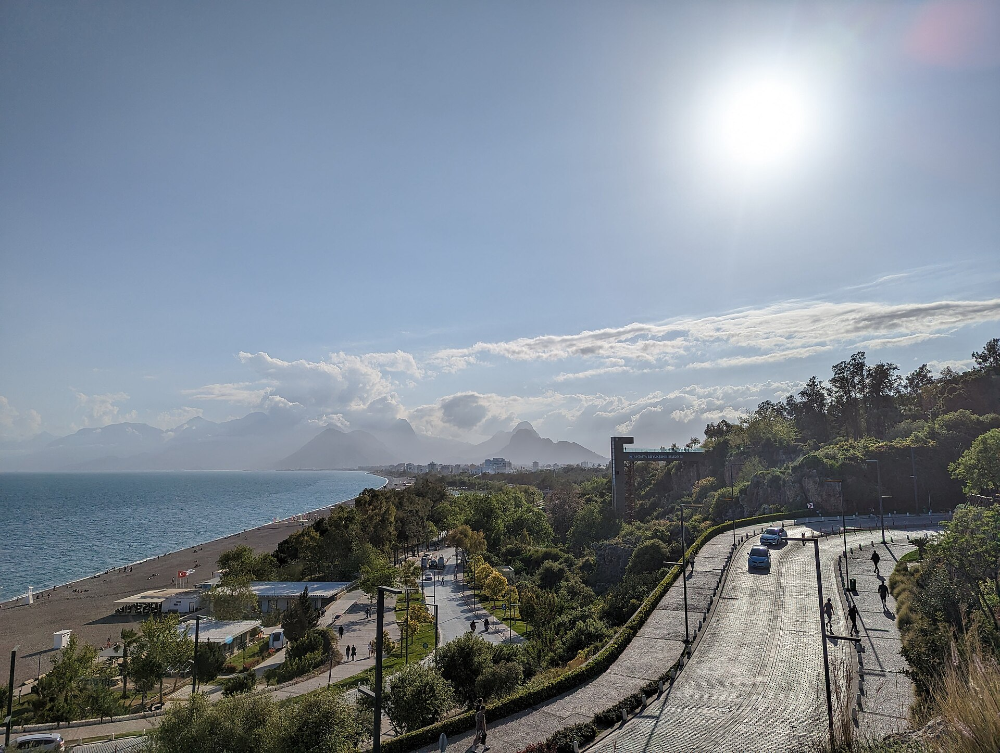
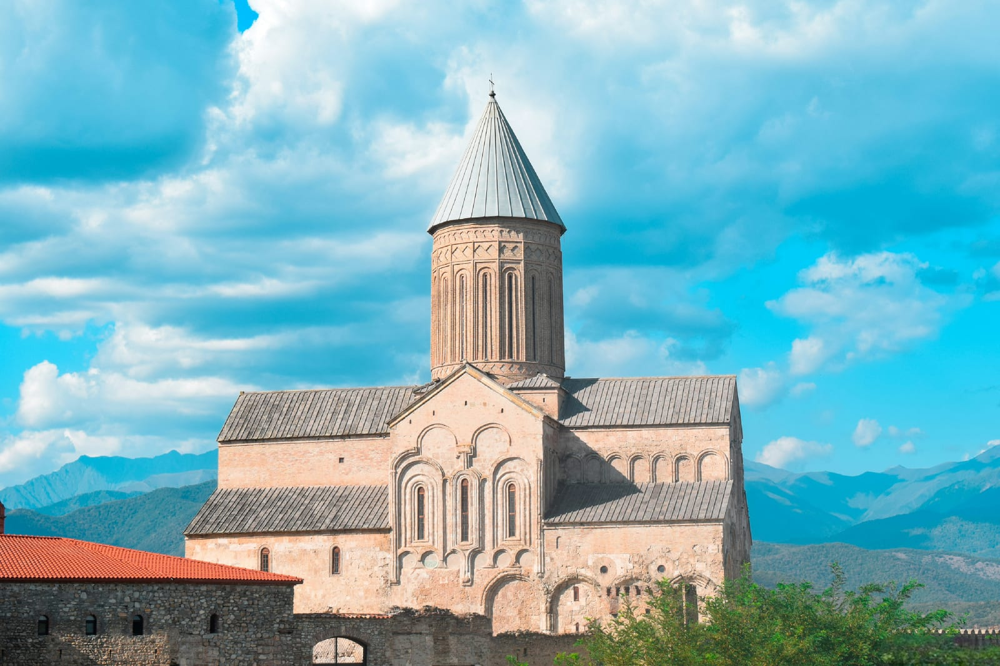
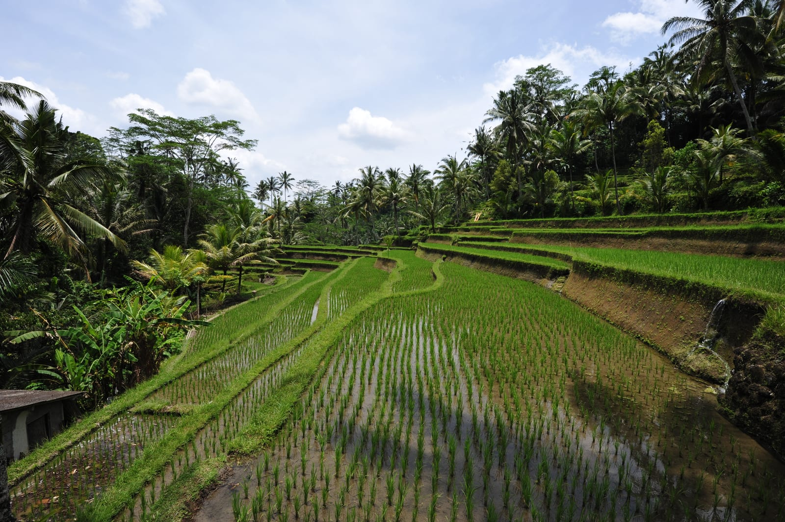
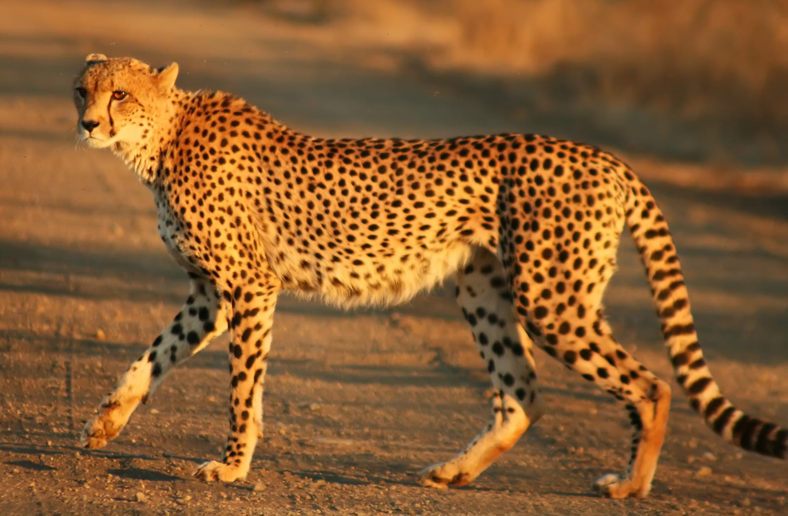

import { TP_LINKS } from '../../data/affiliate.js';

Третье сентября давно живёт в интернете отдельной жизнью: календарь переворачивают, ленты заполняются мемами, а Михаил Шуфутинский снова оказывается главным специалистом по смене сезонов. У песни при этом вполне конкретные авторы: на [официальном канале исполнителя](https://www.youtube.com/watch?v=Kv-tbdVOuOA) указаны музыка Игоря Крутого и стихи Игоря Николаева.

Но календарь не умеет выбирать отпуск. **Если хочется уехать в сентябре, сначала решите, ради чего:** моря без пикового зноя, винной дороги, настоящих рябин, тропиков с меньшим риском ливней или сафари в сухой сезон. Пять сценариев ниже не спорят с большим [календарём направлений на сентябрь](/trips/september/) — они помогают выбрать настроение, а календарь покажет остальные страны.

> **Если коротко:** Анталья подходит для моря, Кахетия — для короткой поездки с дорогой и едой, Кижи — для тех самых рябин, Бали — для длинного отпуска, Крюгер — для сафари. В каждом случае сентябрь хорош по своей причине и с собственной оговоркой: жара, ветер, локальный дождь или холодная ночь.

## Какой сентябрьский сценарий выбрать?

**На 5–7 дней** логичнее смотреть Анталью или Кахетию: меньше времени съест дорога, маршрут не требует сложной экспедиционной сборки. **На 10–14 дней** Бали начинает оправдывать длинный перелёт. Крюгер тоже просит запаса: сафари плохо дружит с планом «в пятницу прилетел, в воскресенье всё понял».

| Хочется | Куда смотреть | Что проверить до оплаты |
|---|---|---|
| Море и тёплые вечера | Анталья | дневную жару и температуру моря на свои даты |
| Еда, вино и дорога | Кахетия | прогноз по району и ночёвку у винодельни |
| Красные гроздья и северный пейзаж | Кижи | свежие фотографии, погоду и переправу на свои даты |
| Тропики без пика дождей | Бали | район острова и свежий бюллетень осадков |
| Животные, а не лежак | Крюгер | холодные выезды на рассвете и правила парка |

Эта таблица не объявляет победителя. Сентябрь в Анталье и сентябрь в Крюгере называются одинаково лишь потому, что календарю лень заводить разные месяцы.

## Анталья: море остаётся, августовская сковородка остывает

**Анталья — вариант для человека, который хочет пляжный отпуск, но не мечтает соревноваться с полуденным солнцем.** По климатической статистике [метеослужбы Турции](https://www.mgm.gov.tr/veridegerlendirme/il-ve-ilceler-istatistik.aspx?m=ANTALYA), средняя дневная максимальная температура сентября составляет **+31,2 °C**, ночная минимальная — **+19,6 °C**. В среднем за месяц бывает 1,71 дождливого дня, а сумма осадков — 16,7 мм.

Цифры описывают многолетний климат, а не обещание конкретной недели. Дневные экскурсии по античным городам лучше ставить на утро, середину дня оставить морю и тени. Если нужен маршрут шире пляжа, в [гайде по Турции](/blog/turkey-guide-2026/) собраны Стамбул, Каппадокия, побережье и практические детали.

**Минус:** начало сентября всё ещё бывает жарким, а курорт не пустеет по команде 1 числа. Людям, которые плохо переносят температуру выше +30 °C, спокойнее смотреть конец месяца или городской формат вместо целого дня на пляже.

## Кахетия: поездка вокруг урожая, а не красивого слова «ртвели»

Кахетия в сентябре годится для короткой дороги через Телави, Цинандали и небольшие хозяйства. На сайте Национального агентства вина открыт раздел [урожая 2026 года](https://wine.gov.ge/En/Harvest), но дата сбора зависит от сорта, района и погоды. Поэтому винодельню лучше выбрать заранее и спросить, что именно происходит в ваши дни: сбор, приём винограда, работа погреба или обычная дегустация.

Погода умеет менять жанр поездки за сутки. [Национальное агентство окружающей среды Грузии](https://meteo.gov.ge/weather-in-tbilisi/Month/56) ожидает в Кахетии в сентябре 2026 года среднемесячные **+18…+20 °C**. В отдельные периоды ночью возможно **+6…+9 °C**, днём — **+30…+33 °C**; осадки прогнозируются около климатической нормы. Футболка и лёгкая куртка здесь не конкуренты, а сменщики.

**Минус:** ртвели не фестиваль с единым расписанием для всей страны. Если построить отпуск вокруг случайной даты из чужого поста, можно приехать между этапами работ. Для большого маршрута пригодится [гайд по Грузии](/blog/georgia-guide-2026/), а для поездки на машине — отдельный [разбор дороги и страховки](/blog/v-gruziyu-na-mashine-2026/).

## Кижи: костры рябин без декоратора

Если хочется не только вспомнить песню, а увидеть рябину в пейзаже, смотрите остров Кижи в Карелии. В материалах [музея-заповедника «Кижи»](https://site.kizhi.karelia.ru/info/about/pressrelease/2008/553.html) рябина названа среди типичных деревьев острова. Здесь красные гроздья попадают в кадр не на городской аллее, а рядом с лугами, деревянными домами и Онего — почти готовая иллюстрация, только без режима «усилить насыщенность».

Но рябина не работает по концертному расписанию. Музей подтверждает её присутствие, а не количество ягод на выбранной неделе. Перед поездкой смотрите свежие фотографии острова или спрашивайте музей, успели ли деревья покраснеть. На 2026 год [официальный прейскурант](https://site.kizhi.karelia.ru/whatson/sightseeing/1643/price) опубликован для посещений до 5 ноября; способ и время переправы всё равно нужно проверять на конкретную дату.

**Минус:** ради одних только красных гроздьев ехать рискованно — урожайность и момент окраски заранее не гарантированы. Проверяйте дождь, ветер и температуру перед выходом на открытый остров. Если рябина решит скромничать, останутся деревянная архитектура и северный пейзаж. Практика поездки собрана в гайдах про [остров Кижи](/blog/ostrov-kizhi-2026/) и [Карелию](/blog/kareliya-guide-2026/).

## Бали: сухой сценарий 2026 года, но не договор с облаками

**Бали подходит, когда отпуск длинный и хочется совместить океан, вулканы и несколько разных районов.** Климатическая станция BMKG на Бали в бюллетене от 3 сентября прогнозирует на сентябрь 2026 года для большей части провинции **1–50 мм осадков**, в основном ниже климатической нормы. Общенациональная BMKG относит июль–сентябрь 2026 года к пику сухого сезона для части Индонезии.

Это не значит «дождя не будет». На острове рельеф, побережья и центральные районы живут по-разному; короткий ливень не обязан читать среднемесячный бюллетень. План с двумя ночами в каждом из пяти районов добавит больше мокрых переездов, чем впечатлений.

**Минус:** ради недели Бали редко окупает длинную дорогу. Лучше выбрать две базы и оставить резервный день для вулкана или лодки. Районы, сезон и бытовые нюансы разобраны в [большом гайде по Бали](/blog/bali-guide-2026/).

## Крюгер: сухой сезон помогает увидеть животных, ночью просит куртку

**Национальный парк Крюгер — сентябрьский выбор для сафари, а не для ленивого курорта.** [SANParks](https://www.sanparks.org/parks/kruger/explore/climate) относит апрель–сентябрь к сухому сезону: дни тёплые и сухие, ночи холодные, растительность реже, а животные чаще держатся у рек и водопоев. Администрация отдельно советует тёплую одежду для ночных выездов.

Главная ошибка — собрать чемодан по дневной фотографии. На открытой машине перед рассветом ветер быстро объясняет разницу между «Африка» и «жарко». Нужны слой под куртку, закрытая обувь и терпение: природа не продаёт гарантированный слот со львом в 09:30.

**Минус:** логистика заметно сложнее пакетного пляжа, а один парк не показывает всю Южную Африку. Связку Крюгера, Кейптауна и других регионов лучше собирать по [гайду по ЮАР](/blog/south-africa-guide-2026/), не склеивая страну в один прогноз погоды.

## Где сентябрь особенно любит сюрпризы?

**У моря смотрите не только температуру воздуха, но и ветер, волны и воду.** Тёплый день не гарантирует спокойный океан. В горах важнее ночной минимум и осадки на высоте: прогноз для столицы не описывает перевал.

**В тропиках месячная норма не заменяет короткий прогноз.** Бюллетень отвечает на вопрос о сезоне, приложение накануне выезда — о конкретном ливне. Для сафари имеет значение время суток: сухой месяц не отменяет холодного рассвета.

С документами та же логика. Визовый режим зависит от паспорта, даты въезда, цели поездки и стран транзита; пересказ без этих вводных опаснее, чем его отсутствие. Перед покупкой невозвратного билета проверьте официальное консульство и актуальный раздел [«Визы и въезд»](/visa/). Проверка на 3 сентября 2026 года не превращает правило в вечное.

### Как собрать поездку и не перевернуть бюджет?

1. Выберите один сценарий: море, винная дорога, рябины, тропики или сафари.
2. Сверьте климат месяца по первичному источнику, затем прогноз на свои даты.
3. Проверьте въезд и транзит по своему гражданству, включая срок действия паспорта.
4. Посчитайте всю поездку в [калькуляторе TravelTribe](/calculator/): перелёт, жильё, транспорт, страховку и запас.
5. Сравнивайте туры с самостоятельной сборкой по одинаковым датам и составу услуг. Цена «от» без багажа и трансфера умеет петь грустнее любой эстрады.

Костры рябин оставим песне. Календарь можно переворачивать раз в год, а маршрут — хоть каждую пятницу.

<a href={`${TP_LINKS.travelata}&sub_id=3_september_2026_final`} class="aff-cta" rel="sponsored">Подобрать тур на сентябрь</a> — Travelata покажет пакеты с перелётом и отелем; проверьте даты, багаж, трансфер и условия отмены до оплаты.

*Фото: FingerWiki (Анталья), GuramGraphy (Кахетия), Digr (Кижи), chensiyuan (Бали), Mukul2u (Крюгер) / Wikimedia Commons / [CC BY](https://creativecommons.org/licenses/by/3.0/) и [CC BY-SA](https://creativecommons.org/licenses/by-sa/4.0/).*

*Погодные данные проверены 3 сентября 2026 года. Прогнозы меняются, климатические нормы не обещают погоду в конкретный день. Условия въезда сверяйте по своему паспорту и маршруту на официальных сайтах перед покупкой билетов.*
