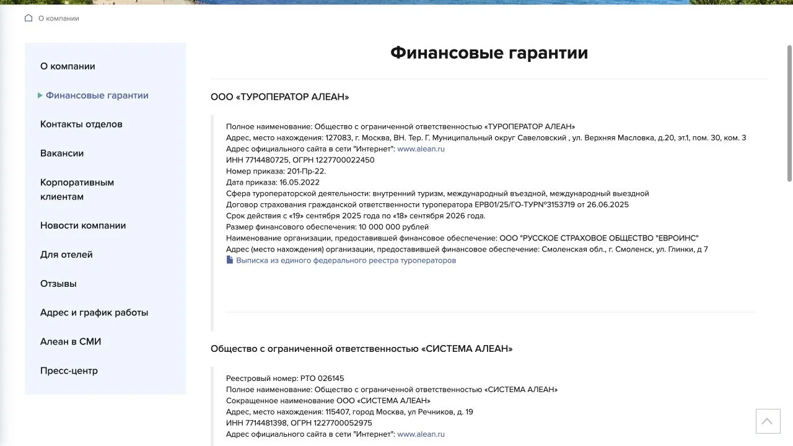
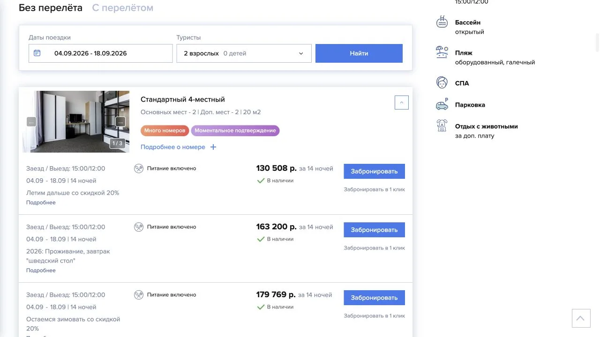
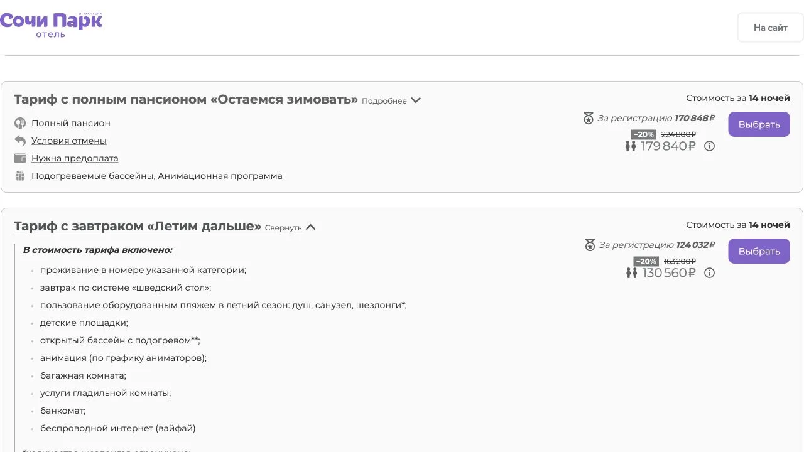
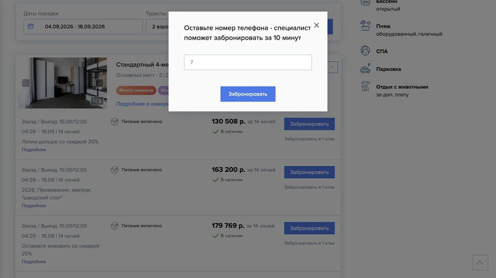

import AffiliateNote from '../../components/post/AffiliateNote.astro';
import { tpkDeep } from '../../data/affiliate.js';

Алеан удобен, когда нужен отель, санаторий или готовая поездка по России в одном поиске. На сайте есть размещение без перелёта, пакетные туры, экскурсионные поездки, детские лагеря и круизы. У одного и того же бренда при этом работают два туроператора, а договор на практике может заключаться ещё и с агентом. Имя на логотипе не отвечает на вопрос, кто примет деньги именно по вашей заявке.

Цена тоже требует проверки до оплаты. В нашем замере один номер на одинаковые даты стоил у Алеана почти столько же, сколько напрямую без регистрации, но на 6 476 ₽ дороже прямой цены после регистрации. Соседний отель, другой тариф или новая дата могут дать обратный результат.

> **Вывод проверки:** Алеан можно брать в сравнение, но нельзя считать автоматически дешевле прямого сайта. Сверяйте не цену «от», а полный счёт с тем же номером, питанием и отменой. В договоре и подтверждении должны совпасть продавец, туроператор и состав заказа. Фиксированной публичной таблицы удержаний мы не нашли: сумма при отказе зависит от тарифа, счёта и фактически понесённых расходов.

<AffiliateNote />

## Как проверяли

3 сентября 2026 года редакция изучила официальные страницы Алеана о финансовых гарантиях, оплате и аннуляции, скачала актуальные образцы документов для турагентов и прошла один путь бронирования без покупки. Для контрольной цены открыт официальный модуль того же отеля.

Условия сравнения были одинаковыми: «Сочи Парк Отель», стандартный четырёхместный номер с двумя основными местами, двое взрослых, 4–18 сентября 2026 года, 14 ночей, тариф «Летим дальше» с завтраком. Кнопку окончательного бронирования не нажимали, телефон и данные туристов не отправляли, оплату не начинали.

Это точечный срез, а не рейтинг сервиса. Он проверяет видимую цену и опубликованные правила, но ничего не доказывает о сопровождении после оплаты, возврате в реальном споре или доле ошибок среди всех заявок. Отзывы на картах и отзовиках мы просмотрели только для карты выдачи и не использовали как основание для вывода.

## Почему отзывы в поиске смешиваются

По точному запросу «туроператор алеан отзывы» Wordcraft показал 70 запросов и 70 переходов на сайты за месяц. Широкая частота «алеан отзывы» в Wordstat была намного выше — 7 693 показа за период 3 августа — 1 сентября 2026 года, — но в ней много названий отдельных гостиниц: «Алеан Фэмили», «Алеан Клаб», объекты в Архызе, Геленджике и Ольгинке.

Яндекс по чистому запросу выводил карты офисов, официальный раздел отзывов, отзовики и страницы агентств. Отдельного разбора, где роли и цена проверены по одному заказу, в заметной части выдачи не было. При этом ответ с Алисой занимал верх экрана: для общего пересказа пользователь может не открыть ни один сайт.

Отзывы об отеле нельзя переносить на туроператора. На странице выбранного объекта Алеан показывал 9,4, а официальный модуль отеля — 7,9 на основе 20 187 оценок. Это разные наборы данных и, возможно, разные методики. Ни одна цифра не описывает качество работы продавца тура, подтверждение заявки или возврат денег.

## Какой именно «Алеан» будет в договоре

На [странице финансовых гарантий](https://www.alean.ru/page/o_kompanii/?label=financial) указаны два юрлица:

| Компания | Реестровый номер | Сфера деятельности | Обеспечение на дату проверки |
|---|---|---|---|
| ООО «ТУРОПЕРАТОР АЛЕАН» | РТО 023654 | внутренний, въездной и выездной туризм | 10 млн ₽, договор страхования до 18 сентября 2026 года |
| ООО «СИСТЕМА АЛЕАН» | РТО 026145 | внутренний и въездной туризм | 500 тыс. ₽, договор страхования до 12 мая 2027 года |

Сайт также даёт выписку из реестра для ООО «ТУРОПЕРАТОР АЛЕАН». Государственная карточка реестра во время проверки не открылась по тайм-ауту, поэтому мы не выдаём копию на сайте компании за подтверждение статуса в реальном времени. Перед крупной оплатой номер стоит заново проверить в государственном реестре, особенно после даты окончания указанного страхового договора.

В [разделе с документами](https://www.alean.ru/page/sotrudnichestvo/?label=dogovory_fingarantii_i_obrazcy_dokumentov_ta) лежат рекомендуемые формы для турагентов. В образце 2026 года исполнителем оставлено поле для агентства, а оба туроператора распределены по направлениям. Это не обязательно тот договор, который выдаст онлайн-касса или конкретный офис. Полезен сам принцип: бренд, продавец и оператор могут быть тремя разными строками.

До оплаты найдите в своём договоре и счёте:

- полное имя и ИНН продавца, который получает деньги;
- туроператора и его реестровый номер;
- номер заявки, даты, туристов и все услуги;
- итоговую сумму, срок оплаты и условия отказа.

Если менеджер прислал только счёт, попросите договор и приложение с составом продукта. Чек на третье юрлицо без объяснения — повод остановить платёж и выяснить роль получателя.

Та же развилка встречается у других продавцов: в проверке [Слетать.ру](/blog/sletat-ru-2026/) отдельно разобраны платформа, турагент и оператор из заявки, а у [Библио-Глобуса](/blog/biblio-globus-2026/) — оператор и розничный договор. Название бренда в обоих случаях не заменяет реквизиты конкретного заказа.

## Что показал живой расчёт

Страница Алеана сначала показывала среднюю стоимость «от 7 358 ₽ за ночь». После ввода дат первый подходящий тариф стоил **130 508 ₽ за 14 ночей**, или 9 322 ₽ за ночь. В него входил завтрак; карточка отмечала наличие и моментальное подтверждение.

Официальный модуль «Сочи Парк Отеля» для тех же дат, номера и тарифа показал две суммы:

- **130 560 ₽** без регистрации — на 52 ₽ дороже Алеана;
- **124 032 ₽** после регистрации — на 6 476 ₽, или 4,96%, дешевле Алеана.

Скидка отеля привязана к регистрации, поэтому сравнение не симметрично: Алеан доступен без аккаунта, а меньшая прямая цена требует передать данные отелю. Мы не регистрировались и не проверяли, сохранится ли сумма на последнем шаге. Анонимная цена отличалась от Алеана всего на 0,04% — это скорее равенство с округлением, чем значимая экономия.

Проверять нужно один тариф строка к строке. На тех же экранах гибкий тариф с завтраком стоил 163 200 ₽ в обоих каналах. Сравнение цены «от» с возвратным тарифом, номера без питания с завтраком или пакета с перелётом с одним отелем даст ложного победителя.

## Оплата и подтверждение

[Алеан перечисляет](https://www.alean.ru/page/turistam/?label=oplata) оплату российской банковской картой, SberPay, Сбербанк Онлайн и наличные в кассе. Доступность конкретного способа зависит от заявки и продавца. На главной встречается обещание предоплаты от 30%, но это не универсальное условие: сумму и срок задаёт счёт выбранного продукта.

В скачанном образце договора подтверждение бронирования оформляется счётом. Документы на поездку выдаются после полной оплаты. Для покупателя отсюда следует простой контроль: статус «есть в наличии» на карточке ещё не заменяет подтверждённую заявку, а рекламная цена не заменяет итоговый счёт.

Кнопка «Забронировать в 1 клик» в проверенном тарифе открыла форму только с телефоном и обещанием помощи специалиста за 10 минут. Мы форму не отправляли. Такой сценарий означает заявку на звонок, а не оформленный заказ и не резерв по показанной цене.

## Отмена и возврат

Публичная страница [«Изменение или аннуляция»](https://www.alean.ru/page/turistam/?label=izmeneniya) в основном описывает действия агента: после отправки отмены поставщику нужно связаться с Алеаном, а возможный штраф появляется в системе бронирования. Фиксированной таблицы по числу дней до заезда на ней нет.

В рекомендуемой форме договора цена и условия аннуляции относятся к счёту, а удержание при отказе связано с фактически понесёнными расходами. Значит, фразы менеджера «возвратный» или «штраф такой-то» мало: точное условие должно быть закреплено в тарифе, счёте или приложении.

Перед оплатой попросите письменный ответ на четыре вопроса:

1. Сколько вернут при отмене сегодня и за день до заезда?
2. Какие позиции оплачены поставщикам и чем подтвердят расход?
3. В какой срок и на тот ли способ оплаты вернут деньги?
4. Кто принимает заявление: агент, одно из юрлиц Алеана или поставщик услуги?

Образец предлагает направлять претензию по качеству туристского продукта в течение 20 дней после окончания поездки; срок рассмотрения указан как 10 дней. Это правило опубликованной формы, а не юридическая консультация по индивидуальному спору. Сохраняйте договор, счёт, чек, переписку, ваучер и подтверждение отправки претензии.

## С чем сравнить Алеан

Для отеля без перелёта сначала откройте [официальный сайт самого объекта](https://sochiparkhotel.ru/booking/). Это не партнёрская ссылка. Проверьте, требует ли меньшая цена регистрацию, можно ли отменить тариф и кто будет возвращать деньги.

Для готового тура сравните ещё одного продавца, сохранив одинаковыми город вылета, даты, оператора, рейс, багаж, трансфер, тип номера и питание. Если меняется хотя бы одна строка, перед вами другой продукт. В [сравнении Travelata и Level.Travel](/blog/travelata-2026/) этот принцип применён к двенадцати одинаковым пакетам.

Алеан не платил TravelTribe за этот материал. Travelata платит комиссию за бронирование по ссылке ниже; это контрольный канал для пакетного тура, а не победитель проверки. Монетизационный вывод по брендам пока не принят.

<a href={tpkDeep('travelata', 'https://travelata.ru/russia/sochi', 'alean_2026_compare_sochi')} class="aff-cta" rel="sponsored">Сравнить пакетные туры в Сочи у Travelata</a> — перенесите те же даты и состав туристов, затем сверьте туроператора, перелёт, багаж, питание, трансфер и отмену.

## Что сделать перед оплатой

Сначала сохраните карточку и итоговый счёт. Затем сравните тот же продукт напрямую и ещё в одном канале. В договоре отметьте продавца, туроператора, состав заказа и сценарий возврата. Если цена меняется после регистрации, входа или звонка, фиксируйте именно последнюю сумму до оплаты.

Для нашего примера прямой зарегистрированный тариф выглядел дешевле, но мы не проходили регистрацию и не создавали бронь. Это остаётся гипотезой экономии до последнего шага. Проверка одного отеля не даёт права переносить разницу 4,96% на весь ассортимент Алеана.

*Проверено 3 сентября 2026 года. Скриншоты сделаны редакцией TravelTribe на официальных сайтах Алеана и «Сочи Парк Отеля». Данные туристов не вводились, формы не отправлялись, покупка и партнёрский тестовый клик не совершались. Цены относятся только к указанным датам, составу гостей, номеру и тарифу.*
