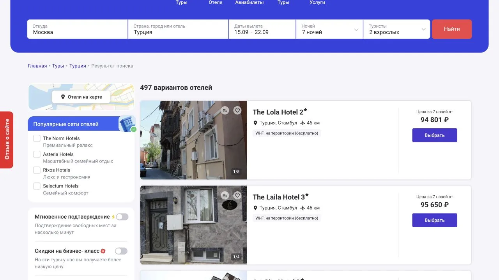
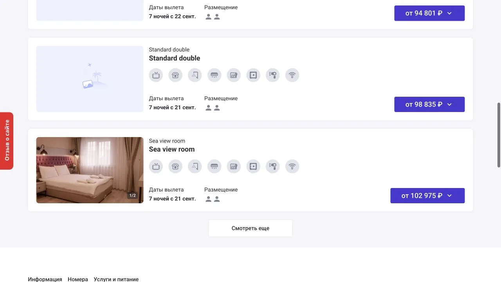
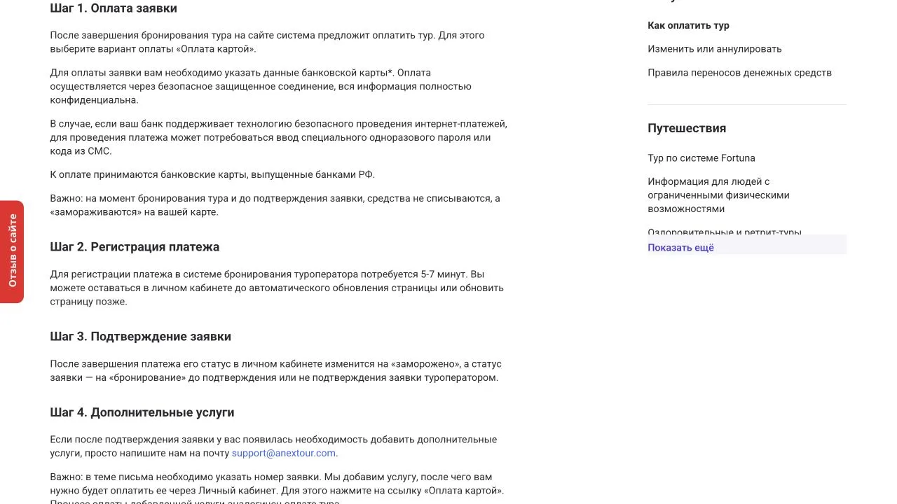
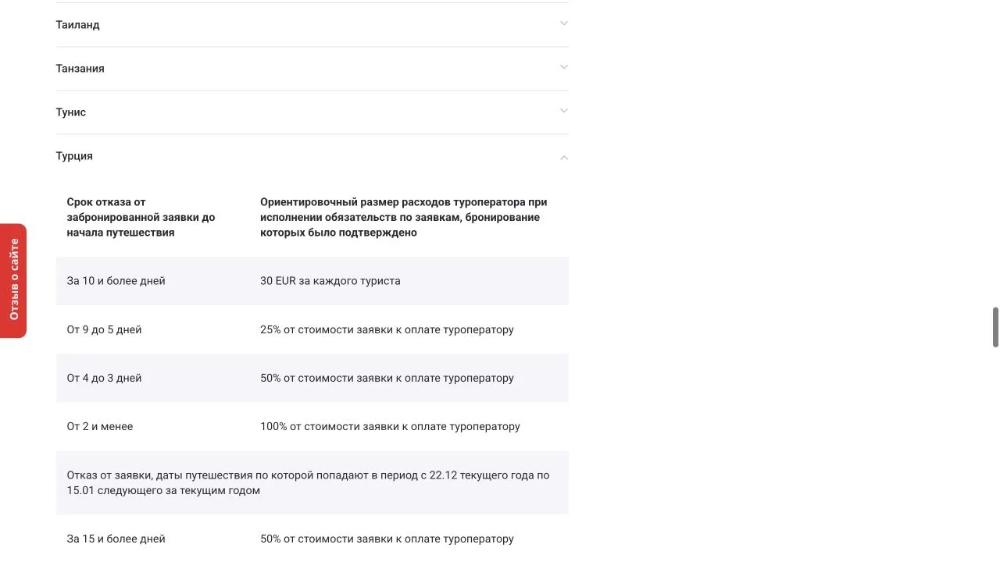
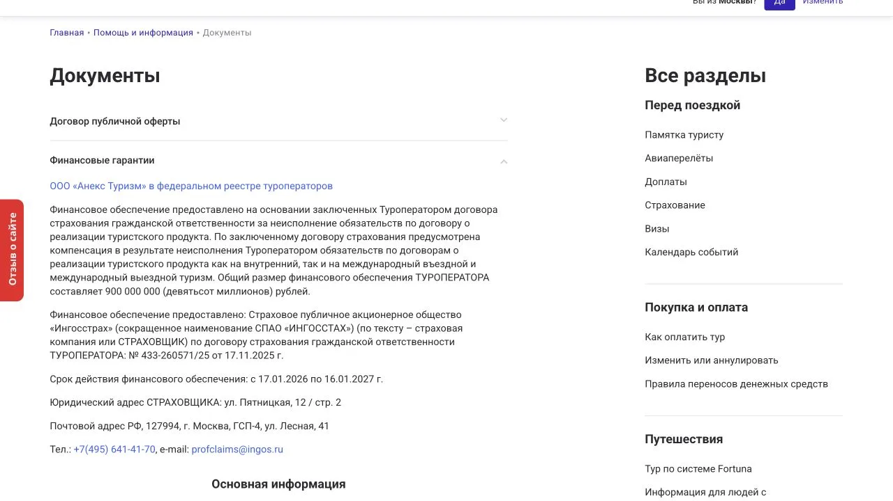

import AffiliateNote from '../../components/post/AffiliateNote.astro';
import { TP_LINKS } from '../../data/affiliate.js';

30 августа 2026 года поиск ANEX Tour показывал туры из Москвы в Турцию **от 94 801 ₽**: 7 ночей, двое взрослых, режим «с перелётом», даты вылета с 15 по 22 сентября. Это цена «от» внутри диапазона дат, а не обещание той же суммы на любой рейс и номер.

Главное до оплаты — скачать оферту и проверить приложение с вашей заявкой. На сайте договор заключается **оплатой**, без физической подписи. До подтверждения онлайн-платёж картой холдируется, а при отмене оператор публикует только ориентировочные расходы: окончательный расчёт зависит от конкретной брони и затрат поставщиков.

> **Если коротко:** карточка ANEX показывает нижнюю цену для заданного поиска. На шаге номера различаются дата вылета и категория комнаты, а рублёвая стоимость фиксируется после 100% оплаты. Сохраните выдачу, приложение №1, чек и условия отмены именно по своей стране и гостинице.

<AffiliateNote />

## Кто заключает договор при покупке на anextour.ru?

На [официальной странице документов](https://anextour.ru/help/service/dokumenty), проверенной 30 августа 2026 года, продавцом по прямой онлайн-покупке указано ООО «Анекс Туризм». Там же стоят реестровый номер **РТО 018486**, ИНН 7743184470 и ОГРН 5167746402324.

[Публичная оферта для физических лиц](https://files1.anextour.com/user-files/elfinder/anexru/docs/oferta/dogovor-oferta-turist-new.pdf) называет ООО «Анекс Туризм» туроператором. По статье 1 договор считается заключённым с момента оплаты, даже если стороны не поставили подписи на бумаге. Состав тура, его существенные условия и полная стоимость должны попасть в приложение №1.

В приложении №2 есть важное уточнение: для выездного туризма ООО «Анекс Туризм» реализует продукт, сформированный иностранным оператором Anex Tourism Worldwide DMCC, на основании агентского договора. Поэтому в своей заявке полезно сверить не только логотип, но и все юрлица, поставщика тура и номер реестра.

## Какие цены показал собственный замер?

Условия замера одинаковые: Москва, Турция, диапазон вылета **15–22 сентября 2026 года**, 7 ночей, 2 взрослых, режим «с перелётом». Выдача сообщила о 497 вариантах отелей. Ниже — первые уникальные гостиницы в сортировке сайта; у каждой могла быть своя дата вылета внутри заданного диапазона.

| Гостиница | Город | Цена за 7 ночей от |
|---|---|---:|
| The Lola Hotel 2★ | Стамбул | 94 801 ₽ |
| The Laila Hotel 3★ | Стамбул | 95 650 ₽ |
| Art City Hotel 3★ | Стамбул | 96 393 ₽ |
| Asitane Life Hotel 3★ | Стамбул | 96 606 ₽ |
| The Zanadu Istanbul Hotel 2★ | Стамбул | 98 092 ₽ |
| Sinem Hotel, Boutique | Стамбул | 98 198 ₽ |

Разница между краями этой шестёрки — **3 397 ₽, или 3,6%**. Это не сравнение одинаковых туров: отличаются гостиницы и конкретные даты. Таблица показывает другое — насколько мало говорит один рекламный порог «от» без перехода к номеру и рейсу.

## Почему цена в карточке ещё не итог?

У The Lola Hotel минимальная карточка раскрылась так: Economy double room — **94 801 ₽** с вылетом 22 сентября, Standard double — **98 835 ₽** с вылетом 21 сентября, Sea view room — **102 975 ₽** с вылетом 21 сентября. От дешёвой до дорогой категории разница составила 8 174 ₽, или 8,6%.

Даже внутри одной гостиницы меняются две вещи сразу: номер и дата. Следующий шаг — раскрыть тариф и проверить рейс, багаж, питание, трансфер, страховку и статус подтверждения. Сравнивать с другой площадкой можно только после выравнивания всех этих строк.

## Когда списываются деньги и фиксируется цена?

По [официальной инструкции оплаты](https://anextour.ru/help/service/kak-oplatit-tur) при оплате картой в личном кабинете сумма до подтверждения заявки не списывается, а **замораживается**. Заявка остаётся в статусе бронирования; регистрация платежа занимает, по данным страницы, 5–7 минут. При неподтверждении тура замороженную сумму нужно разблокировать через аннуляцию заявки.

Для этого сценария принимаются карты банков РФ, заявка оплачивается одной картой и разбить платёж на части нельзя. У других способов логика отличается: например, через Сбербанк Онлайн деньги списываются сразу. Страница также предупреждает, что стоимость фиксируется при **100% оплате**; при частичной оплате рублёвая сумма может измениться вслед за внутренним курсом, который обновляется в 23:59.

Практически нужны три снимка: цена в поиске, сумма в приложении №1 и списание или холд в банке. Если числа разошлись, не доплачивайте по памяти — запросите у продавца письменную расшифровку.

## Что опубликовано об отмене тура в Турцию?

[Страница изменения и аннуляции](https://anextour.ru/help/service/izmenit-ili-annulirovat-tur) начинает с права туриста отказаться от подтверждённой заявки в любое время при компенсации фактически понесённых расходов. Таблицы ниже оператор прямо называет **ориентировочными**, составленными по предварительному расчёту обязательств перед поставщиками.

Для обычных туров в Турцию на базе чартерной перевозки и наземного обслуживания 30 августа была опубликована такая шкала:

| До начала путешествия | Ориентир на странице ANEX Tour |
|---|---:|
| 10 дней и больше | 30 EUR за каждого туриста |
| 9–5 дней | 25% стоимости заявки |
| 4–3 дня | 50% стоимости заявки |
| 2 дня и меньше | 100% стоимости заявки |

Для поездок с 22 декабря по 15 января условия жёстче: 50% за 15 и более дней, 80% за 14–8 дней и 100% за 7 дней и меньше. На странице есть отдельные исключения по экскурсионным турам и конкретным отелям.

Это не готовый ответ «сколько удержат у вас». Оферта говорит о возврате за вычетом расходов оператора, удержаний поставщиков и оказанных услуг. Запрашивайте расчёт по своей заявке и документы, которыми подтверждены отдельные суммы. Персональную правовую ситуацию должен разбирать юрист.

## Можно ли исправить данные без полной отмены?

На странице ANEX Tour опубликованы отдельные тарифы за изменения. Для Турции исправление ФИО, даты рождения или паспортных данных больше чем за 7 дней указано без доплаты; ближе к поездке появляются фиксированные суммы, а возможность замены зависит от перевозчика и принимающей стороны. Изменение состава услуг может потребовать доплаты разницы.

При этом статья 8 оферты формулирует общее правило строже: изменение подтверждённой заявки по инициативе заказчика без соглашения сторон означает аннулирование старой брони и новую заявку с возмещением фактических расходов. Поэтому таблица на сайте — не разрешение самостоятельно переписать тур. Изменение сначала должен подтвердить оператор.

## Что защищает финансовое обеспечение?

На [странице документов ANEX Tour](https://anextour.ru/help/service/dokumenty) указано финансовое обеспечение ООО «Анекс Туризм» на **900 000 000 ₽**. Страховщик — СПАО «Ингосстрах», договор № 433-260571/25 от 17 ноября 2025 года, срок действия — с 17 января 2026-го по 16 января 2027-го.

Финансовое обеспечение относится к неисполнению обязательств туроператором. Оно не заменяет обычную процедуру возврата при добровольной отмене туристом и не превращает ориентировочную таблицу расходов в гарантированную сумму.

## Когда выдадут билеты, ваучер и страховку?

Официальная страница рекомендует печатать документы не раньше чем за 24 часа до вылета. Пакет становится доступен в личном кабинете, когда заявка подтверждена и имеет статус оплаты «Оплачена».

Поздняя выдача сама по себе не означает, что тура нет. Но до поездки должны появиться билеты, ваучер, страховка и памятка. Проверьте ФИО, паспорт, аэропорт, багаж и время рейса сразу после публикации; расписание перепроверьте у перевозчика накануне.

## Что сохранить до и после оплаты?

1. Поисковую карточку с датами, составом туристов и ценой.
2. Страницу номера и точный набор услуг.
3. Оферту в той версии, которую вы принимаете.
4. Приложение №1 с полной ценой, рейсом, размещением и страховкой.
5. Чек и статус банковской операции: холд или списание.
6. Условия отмены по стране, гостинице и виду перевозки.
7. Всю переписку об изменениях и подтверждение получения заявления.

Скриншот карточки не заменяет договор. Его задача — зафиксировать, что показывала витрина до оплаты; юридически важный состав тура находится в приложении к оферте.

## Кому прямое бронирование у ANEX Tour не подходит?

- **Тем, кому нужна одна цена на весь диапазон дат.** Карточка показывает минимум, а категория номера и дата раскрываются дальше.
- **Тем, кто хочет зафиксировать рублёвую сумму частичной оплатой.** Сайт связывает фиксацию с 100% платежом.
- **Тем, кому нужна гарантированная сумма возврата заранее.** Опубликованные проценты названы ориентировочными, есть исключения по датам и отелям.
- **Тем, кто рассчитывает свободно менять туриста или рейс.** Изменение зависит от поставщика и может превратить бронь в новую заявку.
- **Тем, кто не готов дождаться подтверждения.** После холда заявка ещё находится на бронировании.

Кому подходит: тому, кто хочет купить пакет у оператора напрямую, готов проверить приложение №1 и сохраняет документы на каждом денежном шаге.

## Где сравнить тот же тур?

ANEX Tour не платил TravelTribe за этот материал. Travelata и Level.Travel платят комиссию за бронирования по ссылкам ниже; цена для читателя от этого не меняется. Обе площадки заинтересованы в продаже, поэтому их место здесь не считается рекомендацией само по себе.

<a href={`${TP_LINKS.travelata}&sub_id=anex_tour_2026_body`} class="aff-cta" rel="sponsored">Сравнить пакетные туры у Travelata</a> — задайте те же даты и состав туристов, затем ищите тот же отель и оператора.

<a href={`${TP_LINKS.level}&sub_id=anex_tour_2026_body`} class="aff-cta" rel="sponsored">Проверить тот же набор у Level.Travel</a> — сравнивайте не порог «от», а номер, питание, рейс, багаж, трансфер и отмену.

Отдельный замер [двенадцати одинаковых туров у Travelata и Level.Travel](/blog/travelata-2026/) показал, почему название гостиницы ещё не гарантирует одинаковый пакет. Для выбора сценария поездки есть [гайд по Турции](/blog/turkey-guide-2026/), а ещё один оператор разобран на первичных документах в материале о [Библио-Глобусе](/blog/biblio-globus-2026/).

## FAQ — частые вопросы об ANEX Tour

**ANEX Tour — туроператор или турагентство?**

На официальной странице ООО «Анекс Туризм» указано как туроператор с номером РТО 018486. При покупке на другом сайте или в офисе продавцом по договору может оказаться отдельное турагентство.

**Когда договор считается заключённым?**

По публичной оферте — в момент оплаты. Физическая подпись не обязательна, а параметры конкретного тура должны быть в приложении №1.

**Деньги списываются до подтверждения?**

При оплате картой в личном кабинете сумма холдируется. У других способов, включая Сбербанк Онлайн, списание может происходить сразу.

**Цена фиксируется после предоплаты?**

Официальная страница связывает фиксацию с 100% оплатой. При частичном платеже рублёвая стоимость может пересчитаться после изменения внутреннего курса.

**Сколько удержат при отмене тура в Турцию?**

Без заявки точной суммы нет. Общая таблица даёт ориентир от 30 EUR за туриста до 100%, но окончательный расчёт зависит от срока, дат, отеля, перевозки и подтверждённых расходов.

**Когда появятся документы?**

После подтверждения и полной оплаты они становятся доступны в личном кабинете. ANEX Tour рекомендует печатать пакет не раньше чем за 24 часа до вылета.

**Есть ли финансовое обеспечение?**

Да. На 30 августа 2026 года официальный сайт указывал 900 млн ₽ со сроком действия до 16 января 2027 года.

<a href={`${TP_LINKS.travelata}&sub_id=anex_tour_2026_final`} class="aff-cta" rel="sponsored">Сверить ANEX Tour с другими операторами</a> — перенесите в сравнение точные даты, отель, номер и состав пакета.

*Скриншоты, цены и документы проверены 30 августа 2026 года. В публичном канале TravelTribe не найден подтверждённый личный опыт покупки тура у ANEX Tour, поэтому выводы ограничены официальными документами и собственной проверкой витрины. Отзывы о конкретных офисах, гидах и поездках без первичных подтверждений в материал не переносились. Цены меняются в течение дня; статья не заменяет юридическую консультацию.*
