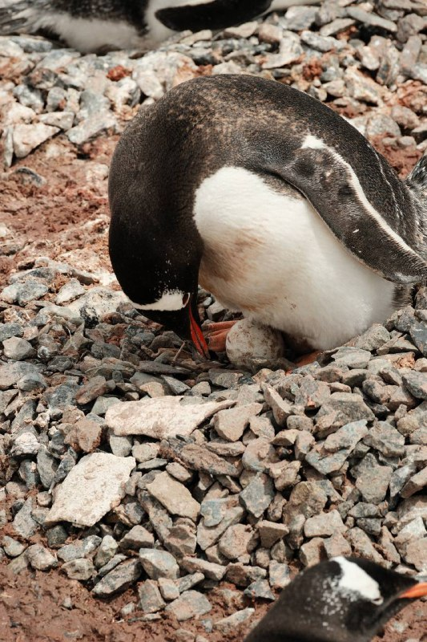
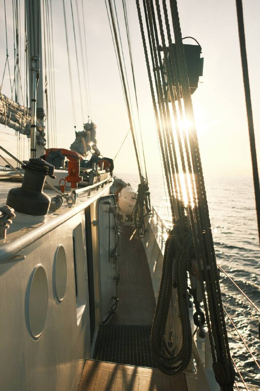
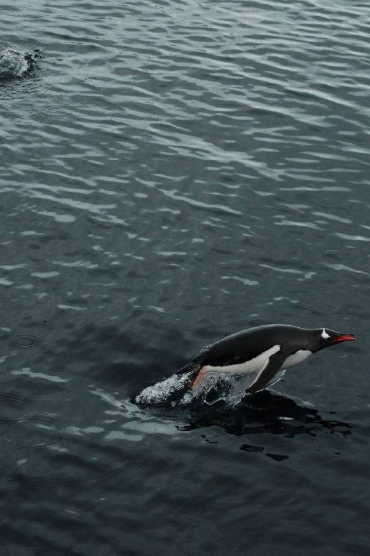
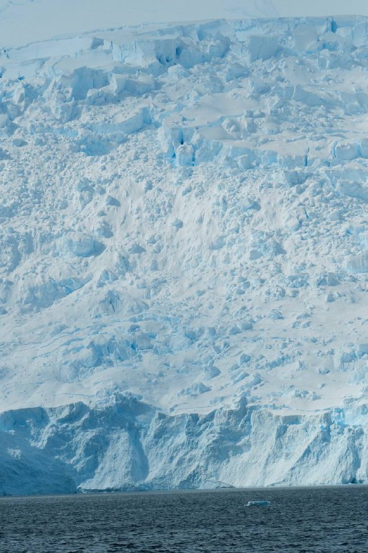
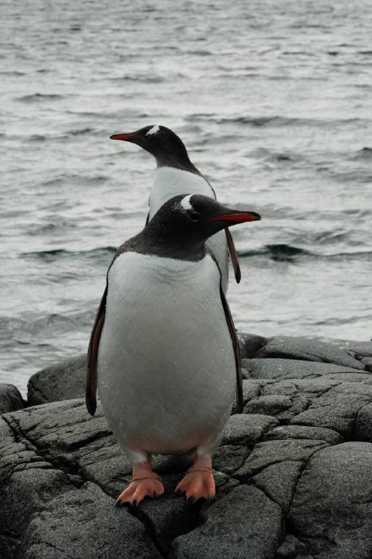
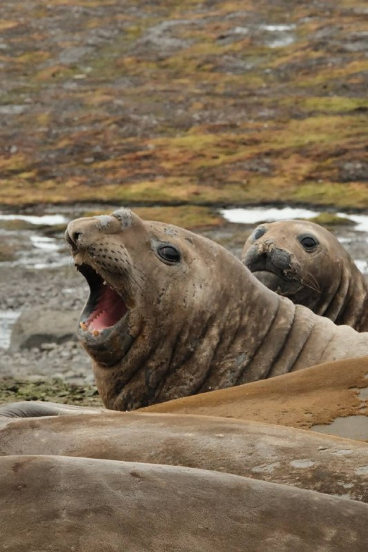
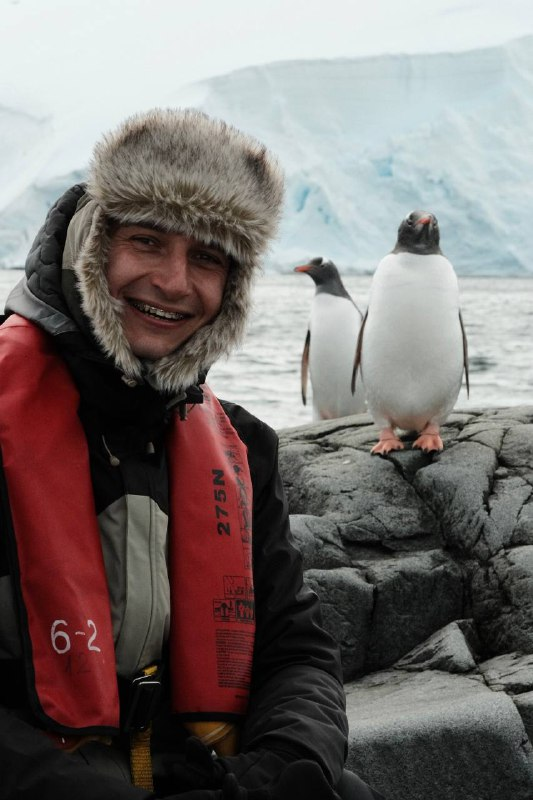

Я абсолютно не верил, что мы сюда добрались. Вообще. Стоишь на палубе, перед тобой целый континент, на котором за всю историю человечества было меньше людей, чем в Шереметьево за один день. И ты — один из них. **Мечта детства, цвет льда, который не может быть настоящим, и пингвин, который выходит из воды, чтобы посмотреть как ты писаешь в Тихий океан.** Если бы мне 5 лет назад сказали, что я туда попаду, я бы посмеялся. А теперь у меня в Lightroom 8 тысяч кадров и план поехать ещё раз.

Дальше — что я понял об этом круизе постфактум, когда вернулся и собрал в голове все цифры, маршруты, ошибки и лайфхаки. Без рекламы туроператоров и без «зов природы зовёт». Только то, что реально пригодилось.

> **Когда лучше ехать в Антарктиду:** [таблица сезонов](/seasons/) — для круизов это ноябрь–март, у каждого месяца свой характер.

---

## 💸 Сколько стоит круиз в Антарктиду — реальный бюджет под ключ

Это не «слетаем на выходные». Это **самый дорогой однократный билет**, который может позволить себе человек со средним доходом в России — ценой одного года накоплений. Все варианты «тур в Антарктиду цена дешево» — это либо люди не понимают что покупают, либо мошенники.

Реальный диапазон 2026 года, **под ключ из Москвы**, на одного человека:

| Класс | Бюджет | Цена ₽ | Что входит |
|---|---|---:|---|
| 🟢 Эконом | март или ноябрь, MV Ushuaia / Ocean Nova, нижняя палуба | **750 000–950 000** | Базовый круиз 10–11 дней, перелёты эконом, недорогой отель |
| 🟡 Стандарт | декабрь–февраль, Swan Hellenic / Quark, каюта с окном | **1 100 000–1 400 000** | Хороший корабль, стандартная каюта, одна ночь в БА |
| 🔴 Премиум | люкс-яхты Ponant Le Boreal, Silversea, бизнес-перелёт | **2 500 000–4 500 000+** | Балкон, личный бутлер, рейтинг Five Star Alliance |

Детально по статьям для **стандарт-варианта 1.2 млн ₽**:

| Статья | Цена ₽ |
|---|---:|
| Сам круиз (10–11 дней, каюта с окном) | 900 000 |
| Перелёт Москва → Буэнос-Айрес (туда-обратно с пересадкой) | 150 000 |
| Перелёт Буэнос-Айрес → Ушуая (туда-обратно) | 16 000 |
| Отель в БА 1 ночь + Ушуая 2 ночи | 25 000 |
| Страховка с покрытием $200k + эвакуация (обязательно) | 5 000 |
| Дополнительная экипировка (термобелье, обувь, очки) | 25 000 |
| Бары/чаевые экипажу/мелочь на корабле | 50 000 |
| Виза в Аргентину | **0** (не нужна) |
| **Итого под ключ** | **~1 170 000 ₽** |

Где можно сэкономить **без потери впечатлений**:

* **Месяц.** Ноябрь и март дешевле декабря-января на **30–40%**. Льды другие, людей меньше, погода непредсказуемее, но сам опыт идентичный.
* **Каюта.** Нижняя палуба с порталом (porthole) даёт тот же круиз, что балкон — все 6–8 высадок одинаковые для всех. Балкон ради вида из окна стоит +$3–5k. Не стоит.
* **Корабль.** MV Ushuaia (русские, кстати, его обожают) и MV Ocean Nova — это базовые, без СПА и дизайнерских ресторанов. Круиз тот же, просто еда без поваров со звездой Мишлен.
* **Last minute.** Если ты в Южной Америке за 1–2 месяца до сезона — можно поймать **скидки 20–40%** на непроданных каютах. С учётом перелёта обычно невыгодно для россиян, но если едешь с тур-целями по континенту — реально.

> **Считаешь свой бюджет:** [калькулятор поездки](/calculator/) — закладывает перелёт, отель и питание на 39 направлений с актуальным курсом ЦБ РФ.

---

## 🗺️ Маршрут — от Москвы до пингвина

Это самый длинный маршрут, который вообще существует в туризме для россиянина. Минимум **48 часов** в пути в одну сторону, считая стыковки. Готовьте психику и поясницу.

### 1. Москва → Буэнос-Айрес (главное плечо)

Прямых рейсов из Москвы в Аргентину нет и не будет в обозримом будущем. Все варианты — с пересадкой в одном из трёх хабов:

* **Через Стамбул** (Turkish Airlines) — самый популярный маршрут. Москва → Стамбул → Буэнос-Айрес. Около 19 часов в воздухе, цена **62 000–90 000 ₽** туда-обратно. Стыковка обычно 2–3 часа, IST — нормальный аэропорт чтобы переждать.
* **Через Дубай** (Emirates) — Москва → Дубай → Буэнос-Айрес. Около 20 часов. **70 000–110 000 ₽**. Сервис лучше, ночь стыковки в Дубае можно бесплатно превратить в город при долгой стыковке.
* **Через Аддис-Абебу** (Ethiopian Airlines) — Москва → Аддис → БА. **65 000–85 000 ₽**, экзотика. Стыковка часто 8–10 часов, аэропорт скромный.

Сравнить актуальные цены и пересадки удобнее всего через [Aviasales](https://www.aviasales.ru/?marker=546042.Zz66f13c16ff6b488883a4127-546042&market=ru) — он агрегирует Turkish, Emirates, Ethiopian и стыковочные комбинации в одной выдаче.

### 2. Буэнос-Айрес → Ушуая

Внутренний рейс Аргентины, часто Aerolineas Argentinas. **3.5 часа, 8 000–12 000 ₽** в одну сторону. Билеты стоит брать заранее — за 2 недели до даты они дороже в 2 раза, потому что сезон. Можно купить вместе с международным сегментом одним билетом, тогда багаж проводят сквозным.

Закладывайте **минимум 1 ночь в БА** между перелётами. Иначе если самолёт из Москвы опоздает на 2 часа — пропустишь стыковочный, потеряешь $400 и день. Это базовая логистика, не экономьте на ней.

### 3. Ушуая → корабль

Ушуая — самый южный город мира, населения 80 тысяч. Корабли загружаются обычно с 14:00 до 17:00. **Прилетайте за 1–2 ночи до посадки** — это страховка от любых задержек, плюс сам город симпатичный, есть Бигль-канал, Музей конца света и пингвинья колония рядом (отдельный half-day тур, $80).

Из отелей нормальные: Arakur Resort & Spa (топ, $300/ночь), Las Hayas (стандарт, $180), Hostería Los Alerces (бюджет, $90). Бронировать через [Ostrovok](https://ostrovok.ru/) — Booking в России недоступен.

### 4. Drake Passage — два дня страданий

Самое неприятное в Антарктике — это пролив Дрейка. **600 морских миль** между мысом Горн и Антарктическим полуостровом, где сходятся три океана и нет суши, чтобы успокоить волны. Качка тут — отдельный жанр.

Я честно скажу — это **самые тяжёлые 2 дня в моей жизни на корабле**. Просыпаешься в 3 ночи от того, что тебя физически отрывает от кровати, как на американских горках вниз. Корабль скрипит как старый чердак. Половина пассажиров не выходит из каюты, на ресторан приходят 30 человек из 150. Я несколько раз был близок к варианту «выйти подышать на палубу» — но при 10-балльной волне на палубу не пускают вообще, заперто.

**Что реально помогает:**
* **Драмина** или **Бонин** (Скополамин) — пластыри за ухо, ставишь за 4 часа до отправления. Работают.
* **Имбирь** — корень, имбирные конфеты. Народное средство, но реально снижает тошноту на 30–40%.
* **Кровать середина корабля, низкая палуба.** Где меньше всего качает. На стандарт-каютах с балконом это самые верхние палубы — вот они трясут больше всего.
* **Ничего не есть.** Серьёзно. Только солёные крекеры и вода. Полный желудок — гарантированно тошнит.
* **Drake Lake вместо Drake Shake.** Иногда везёт и пролив штиль. Тогда переход — медитация, киты, альбатросы. Шанс **20%**, не закладывайте.

### 5. Высадка на континенте

И вот после двух дней качки — утро, в иллюминатор виден белый берег. Голубые айсберги, скалы, тишина. Я плакал. Не пафосно, не в инстаграм — просто пока шёл от каюты до палубы тёр глаза. **Ступаешь на самый южный континент, на котором за всю историю было меньше людей, чем в Шереметьево за один день.**

Высадки делают на **зодиаках** — резиновых лодках на 10–12 человек. Берег часто галечный или скальный. Ты в водонепроницаемых сапогах, тебя обливает ледяной волной, ты идёшь по льду к колонии пингвинов и понимаешь — **они тут хозяева**. Они не боятся, просто смотрят на тебя как на странного нового пингвина.

---

## 📅 Когда ехать в Антарктиду — расклад по месяцам

Сезон в Антарктике — это **ноябрь–март**, южное лето. С апреля по октябрь континент полностью закрыт: лёд, ветер, минус 40, никто туда никаких туристов не повезёт.

Внутри сезона у каждого месяца свой характер. Я бы выбирал так:

### Ноябрь — для тех, кто хочет тишины

* Сезон только открылся, кораблей мало, людей на высадках в 2 раза меньше.
* **Льды нетронутые** — белые, чистые, без тропок от тысяч туристов.
* Пингвины строят гнёзда, **спариваются** — увидишь сцены, которых в декабре уже не будет.
* Цены **на 25–30% ниже декабря**.
* Минусы: холодно (до -10°C), частые штормы, день короче.

### Декабрь–январь — пик

* **Самые длинные дни** — солнце 20–24 часа в сутках, ночи нет вообще.
* **Птенцы пингвинов** вылупляются в середине декабря — увидишь как они учатся ходить.
* Тюленята, морские котики на лежбищах.
* Самая мягкая погода, **-2°C до +5°C** на полуострове.
* Минусы: пик цен, корабли забиты, на популярных высадках толпа.
* **Новогодний круиз** — отдельная категория, цены +20–30% к январю, но атмосфера легендарная.

### Февраль — лучший месяц для китов

* Это пик появления **горбачей, синих, кашалотов, косаток** в антарктических водах.
* Птенцы пингвинов уже подросли — учатся плавать, смешные сцены.
* Цены чуть ниже декабря-января (-10–15%).
* Минус: льды частично подтаяли, фото не такие открыточные.

### Март — закрытие сезона

* Цены опять падают (-20–30%).
* **Киты** ещё в водах.
* Пингвины почти все уплывают, колонии редеют.
* Холоднее, начинается осень южного полушария.
* Высадки могут срываться чаще из-за погоды.

**Что я бы выбрал на первый раз:** **февраль**. Компромисс — пингвины ещё, киты уже, цена не пиковая, льды красивые. Самое драматичное соотношение «впечатления / деньги».

> **Подробнее по сезонам и месяцам:** [таблица сезонов](/seasons/) — там 38 направлений, включая Антарктиду, с оптимальными окнами по каждой стране.

---

## 🧊 Голубой лёд Антарктиды — почему он такого цвета

Самое странное визуальное впечатление от Антарктиды — это не пингвины и не масштабы. Это **цвет льда**. Не белый, не прозрачный — **глубокий, кобальтово-голубой**, как будто кто-то накачал ледник пищевым красителем.

Это физика, не магия. Чистый лёд пропускает солнечный свет, но **неравномерно по длинам волн**:

* **Красные и жёлтые лучи** (длинные волны) — поглощаются молекулами воды.
* **Синие и фиолетовые** (короткие волны) — отражаются и проходят сквозь толщу льда.
* Чем толще и плотнее лёд — тем насыщеннее голубой цвет.

В Антарктиде лёд формируется веками. Снег падает, прессуется под собственным весом, **выдавливает воздух**, становится сверхплотным. Через 50–100 лет это уже не снег и не обычный лёд — это **сжатая голубая стена**, в которой видны прослойки от пеплов прошлых вулканических извержений.

Самое впечатляющее — это **трещины айсбергов**. Свежий разлом светится изнутри, как будто там лампа горит. На этом льду можно различить **слои возрастом от 10 000 до 100 000 лет**. Ты буквально смотришь на капсулу времени.

Где гарантированно увидишь голубой лёд:
* **Lemaire Channel** — узкий пролив между ледниками, классика антарктических открыток.
* **Paradise Bay** — туда обычно делают высадку на каяках.
* **Neko Harbor** — материковая высадка (не остров), пингвиньи колонии на фоне голубых сколов.

---

## 🐧 Пингвины — 4 вида и история про папуанского

В Антарктиде живут 4 основных вида пингвинов, и каждый со своим характером.

* **Императорские** — **самые крупные** (до 1.2 м, 40 кг), настоящие аристократы в «смокингах». Живут глубже на континенте, на круизах попадаются редко — только в специальных экспедициях с высадкой во внутренние районы.
* **Папуанские** (Gentoo) — главные **любопытные** Антарктиды. Ярко-оранжевый клюв, бегут к незнакомцам разузнать, что это за странное существо. Самые часто встречающиеся на круизах.
* **Адели** — маленькие, чёрно-белые, **энергичные**. Долго охотятся под водой, прыгают на лёд как маленькие торпеды.
* **Антарктические** (Chinstrap) — с **чёрным «ремешком»** под подбородком, будто носят шлем. Часто в смешанных колониях с Адели.

И самый абсурдный момент за всю поездку. Я отошёл за камень **пописать в Тихий океан** — банально, других туалетов на островах нет. Стою, занимаюсь делом. И вдруг — **из воды выныривает папуанский пингвин и встаёт рядом**. Просто стоит. Смотрит. Изучает. Я не дышу. Он не дышит. Мы 30 секунд так стоим, мужики на холоде, и потом он разворачивается и плюхается обратно в воду. Это было самым **сюрреалистичным** моментом круиза.

Папуанские пингвины — самые любопытные. Если ты сидишь на корточках и не двигаешься, **они подходят на 30–40 см** и трогают клювом сапоги. По правилам IAATO (международная ассоциация антарктических операторов) ты не имеешь права приближаться к ним ближе чем на 5 метров. Но если **они подходят сами** — это не нарушение. Можно сидеть и смотреть, как они тебя изучают.

---

## 🐘 Морские слоны на станции Беллинсгаузен

Если повезёт с маршрутом — корабль зайдёт на **Южные Шетландские острова**, где находится российская станция **Беллинсгаузен**. Это совсем не то, что ты ожидаешь от научной станции — на голой скале стоят полусгнившие домики советской постройки и **деревянная православная церковь**, единственная во всей Антарктиде.

Но самое сильное впечатление — это **морские слоны**. Огромные, **до 4 тонн весом**, они лежат на лежбище и громко рычат. Самцы устраивают **бои за гарем**, который может включать до **50 самок**. Победитель защищает территорию и делает это **жестоко**.

На моём видео самец буквально **кусает самку до крови**. Сначала это кажется шокирующим — но в мире морских слонов это часть их брачной иерархии. Природа здесь **не диснеевская**. Тут красота соседствует с суровостью, а жизнь — с постоянной борьбой за гарем, территорию и кусок льда побольше.

Местом встречи с этими великанами стала станция Беллинсгаузен. Тут, среди льдов и шумного моря, морские слоны проводят свои дни — отдыхая, борясь и громко заявляя о своём присутствии. **Запах** — отдельная история, на 200 метров вокруг лежбища пахнет так, что приходится дышать через шарф.

---

## 🧥 Что взять в Антарктиду — список из реального опыта

Главное — **большинство круизов выдают базовую экипировку**. Перед посадкой в Ушуая получаешь комплект:

**Обычно дают (Quark, Hurtigruten, Swan Hellenic):**
* Тёплый пуховик-парка (оставляешь себе после круиза)
* Водонепроницаемые штаны (mud pants)
* Резиновые сапоги (muck boots)
* Бахилы для зодиаков

**Обязательно своё:**

* **Термобелье 3 слоя** (мерино) — Icebreaker, Smartwool. Можно купить в Декатлоне за 4–5к ₽ за комплект.
* **Флисовая кофта средней плотности** — между термобельём и парой.
* **Перчатки 2 пары** — тонкие тактильные (для камеры) и тёплые мембранные сверху.
* **Шапка ветрозащитная** + бафф на лицо.
* **Очки с UV-фильтром МАКСИМАЛЬНЫМ** — солнце на снегу выжигает глаза за час, серьёзно. Категория 4.
* **Носки шерстяные тёплые 4–5 пар** — ноги мокнут на высадках.
* **Камера + минимум 4 запасных аккумулятора** — на холоде батарея садится в 2 раза быстрее. Держать под курткой.
* **Power bank 20 000+** — каюта зарядкой не насыщена, везде розетки заняты.
* **eSIM на Аргентину** — у меня была через [Airalo](https://www.airalo.com), 5GB на 7 дней, ~$15. На корабле своего интернета нет, в Ушуая нужен будет.
* **Драмина / пластыри Бонин от качки** — 10 шт минимум.
* **Аптечка** — обезболивающее, что-то от расстройства желудка, пластыри. На корабле есть врач, но проще иметь своё.
* **Гермомешок** — упаковать электронику внутри рюкзака. На зодиаках обливает солёной водой регулярно.

**Что НЕ нужно:**
* Зонт — бесполезен на ветру.
* Городская обувь — не пригодится ни разу.
* Своя верхняя куртка — пуховик дадут на корабле.
* Палатка/спальник — если не записан на отдельную опцию camping (~$300).

---

## 🛂 Виза и страховка для россиян

### Виза в Аргентину — НЕ нужна ✅

Лучшая новость для россиян. **Аргентина — безвиз** на 90 дней с 1 января 2009 года, и в 2026 это правило никто не отменял. То есть **прилетел и въехал**, никаких посольств, никаких ожиданий, никакой биометрии.

Что нужно для въезда:
* **Загранпаспорт** со сроком действия **минимум 6 месяцев** с даты въезда.
* **Минимум 1 пустая страница** для штампа.
* **Обратный билет** — могут спросить на границе.
* **Бронь отеля** на первые ночи (хотя на практике 99% не спрашивают).

90 дней безвиза идут **с момента первого въезда** в течение 180 дней. Этого с большим запасом хватит на круиз 11 дней + неделю по Аргентине после.

### Страховка — обязательно $200 000+

Тут не сэкономишь. **Все круизные операторы требуют страховку с покрытием минимум $200 000 + эвакуация и репатриация**. Без неё на корабль не пустят, проверка на стойке регистрации.

Почему так много: эвакуация из Антарктики — это **дни** вертолётом или аварийным самолётом, расходы реально могут уйти за $100k. На моём корабле один пассажир сломал руку на высадке — эвакуация в Ушуая стоила страховой $80 000.

Где брать россиянам:
* [Cherehapa](https://cherehapa.ru/?partnerId=43c9ad00) — агрегатор, сравнивает 20 страховых, есть фильтр «круизы и Антарктика».
* **Tripinsurance** — у них есть отдельный антарктический пакет.
* **ERV** — проверенная немецкая компания, оплата через российские карты пока работает.

**Цена**: ~$50–80 за круиз 10–12 дней или 14€ в день при покрытии $200k + эвакуация.

⚠️ **Важно**: проверьте, что в полисе явно прописана **«Антарктика» или «полярные регионы»** как зона действия. У многих базовых планов Антарктида исключена или требует доплаты.

---

## 💭 Стоит ли оно того

Короткий ответ: **да, если давно мечтал и можешь себе позволить**. Если рассуждаешь как инвестор и считаешь «впечатления на доллар» — нет, на эти же деньги ты съездишь в **5–7 нормальных стран**, и каждая даст море впечатлений.

Но Антарктида — это **не туризм**, это **закрытие гештальта**. Это место, где **меньше людей было**, чем на любом другом континенте. Это последний неиспорченный кусок планеты. Когда ты там стоишь — ты **физически** понимаешь, что мир огромен, людей мало, а время линейно. Это сложно объяснить, и я не буду пытаться красиво.

**Кому я бы рекомендовал:**
* Закрываешь bucket list мечты детства — однозначно ехать.
* Фотограф / любитель природы — лучшая фото-локация на планете.
* Обеспеченные пары на 10+ годовщину — атмосфера и шок.
* Работаешь с экологией / биологией — профессиональный гештальт.

**Кому НЕ рекомендую:**
* Если **боишься качки** — пролив Дрейка реально жесть. Без вариантов.
* Если **тратишь последнее** — 1 млн ₽ на одну поездку это много, лучше распилить на 3 поездки в разные страны.
* Если **хочешь активный туризм** — Антарктида это **созерцание**, не действие. Походов нет, активностей мало (опционально каяки и camping).
* **С детьми младше 12** — длинный перелёт, качка, скучно.

После Антарктиды стандартный туризм меняется. **Бали кажется попсой, Турция — пустотой, Дубай — Диснейлендом**. Это нормально. Через год пройдёт. Но первое время после возвращения — да, шкала впечатлений сбита.

---

## ❓ FAQ

**Можно попасть в Антарктиду без круиза?**
Да, два варианта. **Чартерный самолёт из Чили** (Антарктика XXI) — 2 часа от Пунта-Аренаса до острова Кинг-Джордж, 3–4 дня программа, ~$5 500 + перелёт из России. Без качки, но и без круиза по полуострову. **Научные станции** не принимают туристов, забудьте.

**Сколько дней нужно на круиз?**
Минимум **11 дней** (стандарт): 2 дня туда, 5 дней Антарктика, 2 дня обратно, +2 на отель и стыковки. **15–18 дней** — расширенный круиз с заходом на Южную Георгию (там тысячи королевских пингвинов). **21+ день** — Фолкленды + Южная Георгия + Антарктида (это уже $20 000+).

**А можно круиз в Антарктиду из России напрямую?**
Нет. Все туры в Антарктиду из России — это перелёт через БА в Ушуая или Пунта-Аренас, потом круиз. Никакой российский корабль из РФ не идёт. Туроператоры (Виа Марис, Russia Discovery, Клуб полярных путешествий) продают тот же круиз с Quark/Swan Hellenic, плюс свою наценку 15–25% за организацию билетов и сопровождение.

**Брать ли русскоязычный круиз?**
Если английский слабый — **да, обязательно**. Лекции на корабле, инструктажи перед высадкой, экскурсии — на английском. Без него потеряешь половину опыта. Русские группы предлагают MZUNGU Expeditions, Mayel, Russia Discovery.

**Безопасно ли на корабле?**
Да. IAATO регулирует всех операторов, корабли соответствуют polar code, экипаж умеет работать в антарктических водах. Worst case — это качка и сломанная рука на высадке. Кораблекрушения за последние 50 лет на круизных операторах не было.

**Нужны ли прививки?**
В саму Антарктиду — нет. Для **транзита через Аргентину** — желательно от **жёлтой лихорадки** (если планируешь в Игуасу или северные провинции). Для самого БА не обязательно. Гепатит А и брюшной тиф — стандартная рекомендация для длинных поездок.

**Можно ли с детьми?**
Технически с любого возраста, но **большинство операторов берут от 8 лет**. Реально комфортно — с **12+**, когда ребёнок выдержит 2 дня качки и оценит контекст. Детям до 8 неинтересно: пингвины посмотреть полчаса, а потом 9 дней безделья на корабле без интернета.

**Какая связь и интернет на корабле?**
Слабый, дорогой Wi-Fi через спутник Starlink или Iridium. **$30–80 за пакет 500MB**, скорость как 3G в деревне. Для рабочих звонков непригодно. **Готовься к информационному детоксу 5–7 дней**.

**Что с едой на корабле?**
На Quark / Swan Hellenic — шведский стол 3 раза в день, ужин из 3 блюд, бокал вина включён. Кухня интернациональная, **нормально для русских**. На люксовых (Ponant, Silversea) — рестораны Мишлен-уровня. На бюджетных (MV Ushuaia) — простая, но сытная.

**Безопасность платежей в Аргентине для россиян?**
Российские карты в Аргентине **не работают**. Бери **наличные USD** (берут везде по официальному курсу, поскольку местная инфляция бешеная), или открывай **карту в дружественной стране** (UnionPay из Армении/Казахстана). На корабле платежи через onboard account, расчёт в конце круиза в долларах.

---

## Что делать дальше

* 📅 [Таблица сезонов](/seasons/) — оптимальные месяцы для Антарктиды и 38 других направлений
* 💸 [Калькулятор бюджета](/calculator/) — учтёт перелёт, проживание и курс ЦБ РФ
* 🌌 [Южное сияние в Новой Зеландии 2026](/blog/aurora-new-zealand-2026/) — следующий пункт bucket list, тоже южные широты
* 🇪🇺 [Шенгенская виза 2026](/blog/schengen-visa-2026/) — если стыковка в Европе
* 🛂 [EES биометрия в Шенгене](/blog/ees-shengen-2026/) — что нового на границах ЕС
* 📲 [Подпишись на @traveltriberu](https://t.me/traveltriberu) — публикую разборы стран без воды

---

*Актуально на: 4 мая 2026. Цены круизов — официальные сайты Quark Expeditions, Swan Hellenic, Hurtigruten, агрегатор RWA.xyz, российские туроператоры (Виа Марис, Клуб полярных путешествий, Russia Discovery). Цены на перелёты — Aviasales и официальные сайты Turkish Airlines / Emirates / Ethiopian Airlines. Курсы валют ЦБ РФ. Информация о визе — официальный сайт МИД Аргентины.*

*Часть ссылок партнёрские (Aviasales, Ostrovok, Cherehapa, Airalo). Цена для тебя не меняется — мы получаем небольшую комиссию.*
