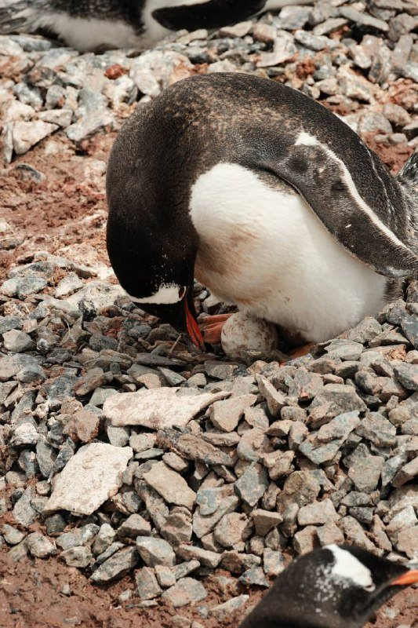
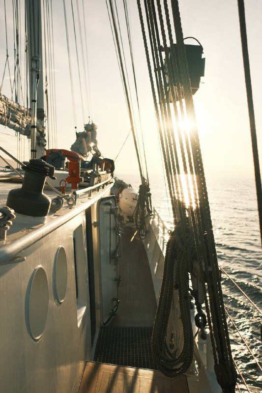
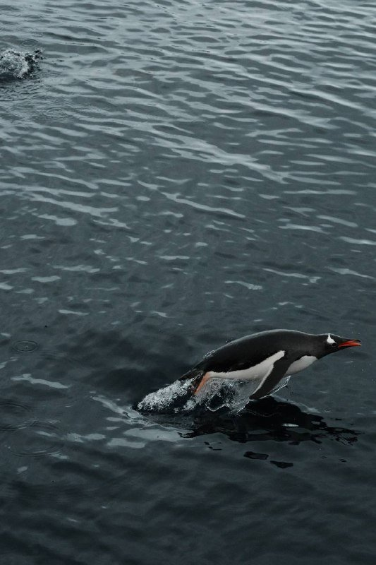
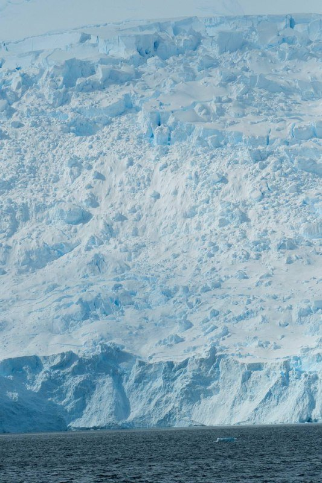
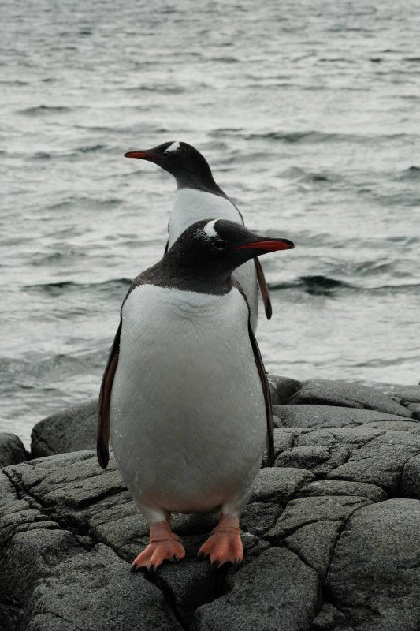
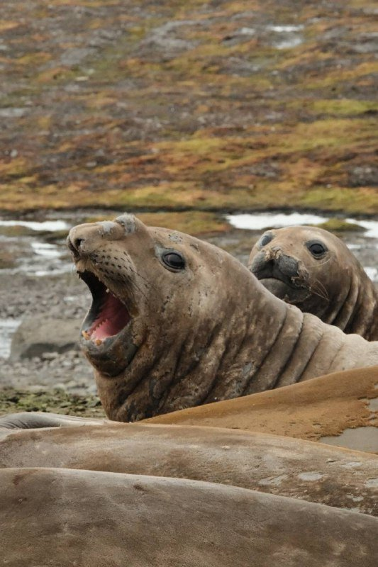
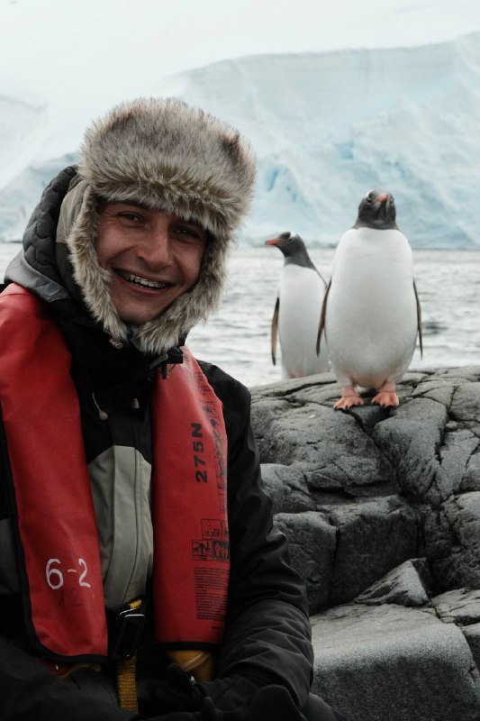

import PricingCards from '../../components/post/PricingCards.astro';
import AffiliateNote from '../../components/post/AffiliateNote.astro';
import { airaloCountry } from '../../data/affiliate.js';

Я абсолютно не верил, что мы сюда добрались. Вообще. Стоишь на палубе, перед тобой целый континент, на котором за всю историю человечества было меньше людей, чем в Шереметьево за один день. И ты — один из них. **Мечта детства, цвет льда, который не может быть настоящим, и пингвин, который выходит из воды, чтобы посмотреть, как ты писаешь в Тихий океан.** Если бы мне 5 лет назад сказали, что я туда попаду, я бы посмеялся. А теперь у меня в Lightroom 8 тысяч кадров и план поехать ещё раз.

Дальше — что я понял об этом круизе постфактум, когда вернулся и собрал в голове все цифры, маршруты, ошибки и лайфхаки. Без рекламы туроператоров и без «зов природы зовёт». Цифры за декабрь 2024, ошибки и что бы я сделал иначе.

> **Если коротко:** круиз в Антарктиду идёт из аргентинской **Ушуаи** через пролив Дрейка; добираются Москва → Буэнос-Айрес → Ушуая. **Под ключ из Москвы это от 750 000 ₽** (эконом, корабли MV Ushuaia / Ocean Nova), стандарт **1,1–1,4 млн ₽**, премиум от **2,5 млн ₽**. Диапазоны собраны в мае 2026; 12 августа я пересверил один опорный прайс — классическая одиннадцатидневная экспедиция Quark на сезон 2026/27 идёт от $12 236 по акции и $14 595 по полной цене, это 1,02–1,21 млн ₽ по курсу ЦБ на 13 августа. То есть стандартная вилка держится, но нижний край подрос. Сам круиз длится **10–11 дней**, но по календарю закладывайте **17–21 день** на перелёты и буфер на штормы. **Виза в Аргентину не нужна**, безвиз 90 дней. Сезон **ноябрь–март**, пик декабрь–февраль. Главное испытание — **2 дня качки** в проливе Дрейка. Страховка обязательна с покрытием от **$200 000**, эвакуация дорогая — подобрать с фильтром «круизы и Антарктика» можно тут: <a href="https://cherehapa.tpk.mx/fkM7suze?erid=2VtzquZTwb5&sub_id=antarctica_cruise_2026" class="aff-cta" rel="sponsored">Оформить страховку с покрытием Антарктики</a>. Был там лично в декабре 2024.

> **Когда лучше ехать в Антарктиду:** [таблица сезонов](/seasons/) — для круизов это ноябрь–март, у каждого месяца свой характер.

<AffiliateNote />

---

## Сколько стоит круиз в Антарктиду из Москвы в 2026?

Это не «слетаем на выходные». Это **самый дорогой однократный билет**, который может позволить себе человек со средним доходом в России — ценой одного года накоплений. Все варианты «тур в Антарктиду цена дешево» — это, по форумам Винского и отзывам на Tripadvisor 2024–2025, либо неполный пакет (без самого круиза), либо мошенники.

Реальный диапазон 2026 года, **под ключ из Москвы**, на одного человека:

<PricingCards tiers={[
 {
 tier: 'Эконом',
 emoji: '',
 price: '750 000–950 000 ₽',
 priceNote: 'март или ноябрь',
 features: [
 'MV Ushuaia или Ocean Nova',
 'Нижняя палуба',
 'Перелёт эконом-классом',
 'Базовый круиз 10–11 дней',
 'Недорогой отель в Буэнос-Айресе',
 ],
 },
 {
 tier: 'Стандарт',
 emoji: '',
 price: '1 100 000–1 400 000 ₽',
 priceNote: 'декабрь–февраль',
 featured: true,
 badge: 'Больше всего впечатлений',
 features: [
 'Swan Hellenic или Quark',
 'Каюта с окном',
 'Хороший корабль с СПА',
 'Одна ночь в Буэнос-Айресе',
 'Шведский стол + ужин из 3 блюд',
 ],
 },
 {
 tier: 'Премиум',
 emoji: '',
 price: '2 500 000–4 500 000+ ₽',
 priceNote: 'люкс-яхты',
 features: [
 'Ponant Le Boreal или Silversea',
 'Каюта с балконом',
 'Личный бутлер',
 'Бизнес-класс перелёт',
 'Рейтинг Five Star Alliance',
 ],
 },
]} />

Детально по статьям для **стандарт-варианта 1.2 млн ₽**:

| Статья | Цена ₽ |
|---|---:|
| Сам круиз (10⁠–⁠11 дней, каюта с окном) | 900 000 |
| Перелёт Москва → Буэнос-Айрес (туда-обратно с пересадкой) | 150 000 |
| Перелёт Буэнос-Айрес → Ушуая (туда-обратно) | 16 000 |
| Отель в БА 1 ночь + Ушуая 2 ночи | 25 000 |
| Страховка с покрытием $200k + эвакуация (обязательно) | 5 000 |
| Дополнительная экипировка (термобелье, обувь, очки) | 25 000 |
| Бары/чаевые экипажу/мелочь на корабле | 50 000 |
| Виза в Аргентину | **0** (не нужна) |
| **Итого под ключ** | **~1 170 000 ₽** |

*Откуда цифры: расчёт собран в мае 2026 по прайсам Quark Expeditions, Swan Hellenic и Hurtigruten, поиску перелётов и расчёту страховки на 11 дней с покрытием $200 000. Точечная пересверка 12 августа 2026: у Quark одиннадцатидневная экспедиция на сезон 2026/27 стоит от $12 236 (акция) до $14 595 — вилка круиза в таблице остаётся рабочей. Перелёты и отели с мая не пересматривались, перед бронированием проверяйте на свои даты.*

Где можно сэкономить **без потери впечатлений**:

* **Месяц.** Ноябрь и март дешевле декабря-января на **30–40%**. Льды другие, людей меньше, погода непредсказуемее, но сам опыт идентичный.
* **Каюта.** Нижняя палуба с порталом (porthole) даёт тот же круиз, что балкон — все 6–8 высадок одинаковые для всех. Балкон ради вида из окна стоит +$3–5k. Не стоит.
* **Корабль.** MV Ushuaia (русские, кстати, его обожают) и MV Ocean Nova — это базовые, без СПА и дизайнерских ресторанов. Круиз тот же, еда без поваров со звездой Мишлен.
* **Last minute.** Если ты в Южной Америке за 1–2 месяца до сезона — можно поймать **скидки 20–40%** на непроданных каютах. С учётом перелёта обычно невыгодно для россиян, но если едешь с тур-целями по континенту — реально.

> **Считаешь свой бюджет:** [калькулятор поездки](/calculator/) — закладывает перелёт, отель и питание на 70+ направлений с актуальным курсом ЦБ РФ.

---

## Как добраться до Антарктиды: маршрут от Москвы до пингвина

Это самый длинный маршрут, который вообще существует в туризме для россиянина. Минимум **48 часов** в пути в одну сторону, считая стыковки. На 19 часов в воздухе бери компрессионные носки и подушку под поясницу.

### 1. Москва → Буэнос-Айрес (главное плечо)

Прямых рейсов из Москвы в Аргентину нет и не будет в обозримом будущем. Все варианты — с пересадкой в одном из трёх городов:

* **Через Стамбул** (Turkish Airlines) — самый популярный маршрут. Москва → Стамбул → Буэнос-Айрес. Около 19 часов в воздухе, цена **62 000–90 000 ₽** туда-обратно (диапазон мая 2026, к августу не пересматривался). Стыковка обычно 2–3 часа, IST — нормальный аэропорт чтобы переждать.
* **Через Дубай** (Emirates) — Москва → Дубай → Буэнос-Айрес. Около 20 часов. **70 000–110 000 ₽**. Сервис лучше, ночь стыковки в Дубае можно бесплатно превратить в город при долгой стыковке.
* **Через Аддис-Абебу** (Ethiopian Airlines) — Москва → Аддис → БА. **65 000–85 000 ₽**, экзотика. Стыковка часто 8–10 часов, аэропорт скромный.

Сравнить актуальные цены и пересадки удобнее всего так: <a href="https://aviasales.tpk.mx/JCSPlC17?erid=2Vtzqxkn4LF&sub_id=antarctica_cruise_2026&u=https%3A%2F%2Fwww.aviasales.ru%2Fsearch%2FMOW1509EZE1" class="aff-cta" rel="sponsored">Найти билет Москва — Буэнос-Айрес</a> показывает все авиакомпании и пересадки сразу (Turkish, Emirates, Ethiopian и стыковочные комбинации в одной выдаче удобно сопоставить), а cookie живёт 30 дней, так что цену можно мониторить и забронировать позже.

### 2. Буэнос-Айрес → Ушуая

Внутренний рейс Аргентины, часто Aerolineas Argentinas. **3.5 часа, 8 000–12 000 ₽** в одну сторону. Билеты стоит брать заранее — за 2 недели до даты они дороже в 2 раза, потому что сезон. Можно купить вместе с международным сегментом одним билетом, тогда багаж проводят сквозным.

Закладывайте **минимум 1 ночь в БА** между перелётами. Иначе если самолёт из Москвы опоздает на 2 часа — пропустишь стыковочный, потеряешь $400 и день. Это базовая логистика, не экономьте на ней.

### 3. Ушуая → корабль

Ушуая — самый южный город мира, население 80 тысяч. Корабли загружаются обычно с 14:00 до 17:00. **Прилетайте за 1–2 ночи до посадки** — это страховка от любых задержек, плюс сам город симпатичный, есть Бигль-канал, Музей конца света и пингвинья колония рядом (отдельный half-day тур, $80).

Из отелей нормальные: Arakur Resort & Spa (топ, $300/ночь), Las Hayas (стандарт, $180), Hostería Los Alerces (бюджет, $90). Бронировать через [Ostrovok](https://ostrovok.ru/) — Booking в России недоступен.

### 4. Drake Passage — два дня страданий

Самое неприятное в Антарктике — это пролив Дрейка. **600 морских миль** между мысом Горн и Антарктическим полуостровом, где сходятся три океана и нет суши, чтобы успокоить волны. Качка тут — отдельный жанр.

Я честно скажу — это **самые тяжёлые 2 дня в моей жизни на корабле**. Просыпаешься в три часа ночи от того, что тебя физически отрывает от кровати, как на американских горках вниз. Корабль скрипит как старый чердак. Половина пассажиров не выходит из каюты, на ресторан приходят 30 человек из 150. Я несколько раз был близок к варианту «выйти подышать на палубу» — но при 10-балльной волне на палубу не пускают вообще, заперто.

**Что реально помогает:**
* **Драмина** или **Бонин** (Скополамин) — пластыри за ухо, ставишь за 4 часа до отправления. Работают.
* **Имбирь** — корень, имбирные конфеты. Народное средство, но реально снижает тошноту на 30–40%.
* **Кровать середина корабля, низкая палуба.** Где меньше всего качает. На стандарт-каютах с балконом это самые верхние палубы — вот они трясут больше всего.
* **Ничего не есть.** Серьёзно. Только солёные крекеры и вода. Полный желудок — гарантированно тошнит.
* **Drake Lake вместо Drake Shake.** Иногда везёт и пролив штиль. Тогда переход — медитация, киты, альбатросы. Шанс **20%**, не закладывайте.

### 5. Высадка на континенте

И вот после двух дней качки — утро, в иллюминатор виден белый берег. Голубые айсберги высотой с 5-этажку, температура -2°C, ветер сел до нуля. Я плакал. Не пафосно, не в инстаграм — пока шёл от каюты до палубы, тёр глаза. **Ступаешь на самый южный континент, на котором за всю историю было меньше людей, чем в Шереметьево за один день.**

Высадки делают на **зодиаках** — резиновых лодках на 10–12 человек. Берег часто галечный или скальный. Ты в водонепроницаемых сапогах, тебя обливает ледяной волной, ты идёшь по льду к колонии пингвинов и понимаешь — **они тут хозяева**. Они не боятся — смотрят на тебя как на странного нового пингвина.

---

## Когда лучше ехать в Антарктиду?

Сезон в Антарктике — это **ноябрь–март**, южное лето. С апреля по октябрь континент полностью закрыт: лёд, ветер, минус 40, никто туда никаких туристов не повезёт.

Внутри сезона у каждого месяца свой характер. Я бы выбирал так:

### Ноябрь — для тех, кто хочет тишины

* Сезон только открылся, кораблей мало, людей на высадках в 2 раза меньше.
* **Льды нетронутые** — белые, чистые, без тропок от тысяч туристов.
* Пингвины строят гнёзда, **спариваются** — увидишь сцены, которых в декабре не будет.
* Цены **на 25–30% ниже декабря**.
* Минусы: холодно (до -10°C), частые штормы, день короче.

### Декабрь–январь — пик

* **Самые длинные дни** — солнце 20–24 часа в сутках, ночи нет вообще.
* **Птенцы пингвинов** вылупляются в середине декабря — увидишь как они учатся ходить.
* Тюленята, морские котики на лежбищах.
* Самая мягкая погода, **-2°C до +5°C** на полуострове.
* Минусы: пик цен, корабли забиты, на популярных высадках толпа.
* **Новогодний круиз** — отдельная категория, цены +20–30% к январю; на борту праздничный ужин, фейерверк с зодиаков, шампанское включено.

### Февраль — лучший месяц для китов

* Это пик появления **горбачей, синих, кашалотов, косаток** в антарктических водах.
* Птенцы пингвинов подросли — учатся плавать, смешные сцены.
* Цены чуть ниже декабря-января (-10–15%).
* Минус: льды частично подтаяли, фото не такие открыточные.

### Март — закрытие сезона

* Цены опять падают (-20–30%).
* **Киты** ещё в водах.
* Пингвины почти все уплывают, колонии редеют.
* Холоднее, начинается осень южного полушария.
* Высадки могут срываться чаще из-за погоды.

**Что я бы выбрал на первый раз:** **февраль**. Компромисс — пингвины ещё, киты уже, цена не пиковая, льды красивые. Самое драматичное соотношение «впечатления / деньги».

> **Подробнее по сезонам и месяцам:** [таблица сезонов](/seasons/) — там 38 направлений, включая Антарктиду, с лучшими окнами по каждой стране.

---

## Голубой лёд Антарктиды — почему он такого цвета

Самое странное визуальное впечатление от Антарктиды — это не пингвины и не масштабы. Это **цвет льда**. Не белый, не прозрачный — **глубокий, кобальтово-голубой**, как будто кто-то накачал ледник пищевым красителем.

Это физика, не магия. Чистый лёд пропускает солнечный свет, но **неравномерно по длинам волн**:

* **Красные и жёлтые лучи** (длинные волны) — поглощаются молекулами воды.
* **Синие и фиолетовые** (короткие волны) — отражаются и проходят сквозь толщу льда.
* Чем толще и плотнее лёд — тем насыщеннее голубой цвет.

В Антарктиде лёд формируется веками. Снег падает, прессуется под собственным весом, **выдавливает воздух**, становится сверхплотным. Через 50–100 лет это не снег и не обычный лёд — это **сжатая голубая стена**, в которой видны прослойки от пеплов прошлых вулканических извержений.

Самое впечатляющее — это **трещины айсбергов**. Свежий разлом светится изнутри, как будто там лампа горит. На этом льду можно различить **слои возрастом от 10 000 до 100 000 лет**. Ты буквально смотришь на капсулу времени.

Где гарантированно увидишь голубой лёд:
* **Lemaire Channel** — узкий пролив между ледниками, классика антарктических открыток.
* **Paradise Bay** — туда обычно делают высадку на каяках.
* **Neko Harbor** — материковая высадка (не остров), пингвиньи колонии на фоне голубых сколов.

---

## Пингвины — 4 вида и история про папуанского

В Антарктиде живут 4 основных вида пингвинов, и каждый со своим характером.

* **Императорские** — **самые крупные** (до 1.2 м, 40 кг), настоящие аристократы в «смокингах». Живут глубже на континенте, на круизах попадаются редко — только в специальных экспедициях с высадкой во внутренние районы.
* **Папуанские** (Gentoo) — главные **любопытные** Антарктиды. Ярко-оранжевый клюв, бегут к незнакомцам разузнать, что это за странное существо. Самые часто встречающиеся на круизах.
* **Адели** — маленькие, чёрно-белые, **энергичные**. Долго охотятся под водой, прыгают на лёд как маленькие торпеды.
* **Антарктические** (Chinstrap) — с **чёрным «ремешком»** под подбородком, будто носят шлем. Часто в смешанных колониях с Адели.

И самый абсурдный момент за всю поездку. Я отошёл за камень **пописать в Тихий океан** — банально, других туалетов на островах нет. Стою, занимаюсь делом. И вдруг — **из воды выныривает папуанский пингвин и встаёт рядом**. Стоит. Смотрит. Изучает. Я не дышу. Он не дышит. Мы 30 секунд так стоим, мужики на холоде, и потом он разворачивается и плюхается обратно в воду. Это был самый странный момент круиза — у меня в голове не укладывалось.

Папуанские пингвины — самые любопытные. Если ты сидишь на корточках и не двигаешься, **они подходят на 30–40 см** и трогают клювом сапоги. По правилам IAATO (международная ассоциация антарктических операторов) ты не имеешь права приближаться к ним ближе чем на 5 метров. Но если **они подходят сами** — это не нарушение. Можно сидеть и смотреть, как они тебя изучают.

---

## Морские слоны на станции Беллинсгаузен

Если повезёт с маршрутом — корабль зайдёт на **Южные Шетландские острова**, где находится российская станция **Беллинсгаузен**. Это совсем не то, что ты ожидаешь от научной станции — на голой скале стоят полусгнившие домики советской постройки и **деревянная православная церковь**, единственная во всей Антарктиде.

Но самое сильное впечатление — это **морские слоны**. Огромные, **до 4 тонн весом**, они лежат на лежбище и громко рычат. Самцы устраивают **бои за гарем**, который может включать до **50 самок**. Победитель защищает территорию и делает это **жестоко**.

На моём видео самец буквально **кусает самку до крови**. Сначала это кажется шокирующим — но в мире морских слонов это часть их брачной иерархии. За 2 часа у лежбища я насчитал 4 драки, одна с кровью на шее самки.

На лежбище у Беллинсгаузена я насчитал 23 самца и около 80 самок, дистанция от тропы — 15 метров. **Запах** — отдельная история, на 200 метров вокруг лежбища пахнет так, что приходится дышать через шарф.

---

## Что взять в Антарктиду в круиз?

Главное — **большинство круизов выдают базовую экипировку**. Перед посадкой в Ушуая получаешь комплект:

**Обычно дают (Quark, Hurtigruten, Swan Hellenic):**
* Тёплый пуховик-парка (оставляешь себе после круиза)
* Водонепроницаемые штаны (mud pants)
* Резиновые сапоги (muck boots)
* Бахилы для зодиаков

**Обязательно своё:**

* **Термобелье 3 слоя** (мерино) — Icebreaker, Smartwool. Можно купить в Декатлоне за 4–5к ₽ за комплект.
* **Флисовая кофта средней плотности** — между термобельём и парой.
* **Перчатки 2 пары** — тонкие тактильные (для камеры) и тёплые мембранные сверху.
* **Шапка ветрозащитная** + бафф на лицо.
* **Очки с UV-фильтром МАКСИМАЛЬНЫМ** — солнце на снегу выжигает глаза за час, серьёзно. Категория 4.
* **Носки шерстяные тёплые 4–5 пар** — ноги мокнут на высадках.
* **Камера + минимум 4 запасных аккумулятора** — на холоде батарея садится в 2 раза быстрее. Держать под курткой.
* **Power bank 20 000+** — каюта зарядкой не насыщена, везде розетки заняты.
* **eSIM на Аргентину** — <a href={airaloCountry('argentina', 'antarctica_cruise_2026')} class="aff-cta" rel="sponsored">Подключить eSIM на Аргентину</a>: у меня была 5GB на 7 дней, ~$15. На корабле своего интернета нет, в Ушуая нужен будет.
* **Драмина / пластыри Бонин от качки** — 10 шт минимум.
* **Аптечка** — обезболивающее, что-то от расстройства желудка, пластыри. На корабле есть врач, но проще иметь своё.
* **Гермомешок** — упаковать электронику внутри рюкзака. На зодиаках обливает солёной водой регулярно.

**Что НЕ нужно:**
* Зонт — бесполезен на ветру.
* Городская обувь — не пригодится ни разу.
* Своя верхняя куртка — пуховик дадут на корабле.
* Палатка/спальник — если не записан на отдельную опцию camping (~$300).

---

## Нужна ли виза и какая страховка обязательна?

### Виза в Аргентину — НЕ нужна 

Лучшая новость для россиян. **Аргентина — безвиз** на 90 дней с 1 января 2009 года, и в 2026 это правило никто не отменял. То есть **прилетел и въехал**, никаких посольств, никаких ожиданий, никакой биометрии.

Что нужно для въезда:
* **Загранпаспорт** со сроком действия **минимум 6 месяцев** с даты въезда.
* **Минимум 1 пустая страница** для штампа.
* **Обратный билет** — могут спросить на границе.
* **Бронь отеля** на первые ночи (хотя на практике 99% не спрашивают).

90 дней безвиза идут **с момента первого въезда** в течение 180 дней. Этого с большим запасом хватит на круиз 11 дней + неделю по Аргентине после.

### Страховка — обязательно $200 000+

Тут не сэкономишь. **Все круизные операторы требуют страховку с покрытием минимум $200 000 + эвакуация и репатриация**. Без неё на корабль не пустят, проверка на стойке регистрации.

Почему так много: эвакуация из Антарктики — это **дни** вертолётом или аварийным самолётом, расходы реально могут уйти за $100k. На моём корабле один пассажир сломал руку на высадке — эвакуация в Ушуая стоила страховой $80 000.

Где брать россиянам:
* <a href="https://cherehapa.tpk.mx/fkM7suze?erid=2VtzquZTwb5&sub_id=antarctica_cruise_2026" class="aff-cta" rel="sponsored">Оформить страховку с покрытием Антарктики</a> — агрегатор, сравнивает 20 страховых, есть фильтр «круизы и Антарктика».
* **Tripinsurance** — у них есть отдельный антарктический пакет.
* **ERV** — проверенная немецкая компания, оплата через российские карты пока работает.

**Цена**: ~$50–80 за пакет на весь круиз (Cherehapa/ERV) или ~14€/день (Tripinsurance) при покрытии $200k + эвакуация.

 **Важно**: проверьте, что в полисе явно прописана **«Антарктика» или «полярные регионы»** как зона действия. У многих базовых планов Антарктида исключена или требует доплаты.

---

## Стоит ли круиз в Антарктиду своих денег?

Короткий ответ: **да, если давно мечтал и можешь себе позволить**. Если рассуждаешь как инвестор и считаешь «впечатления на доллар» — нет, на эти же деньги ты съездишь в **5–7 нормальных стран**, и каждая даст море впечатлений.

Но Антарктида — это **не туризм**, это **закрытие гештальта**. Это место, где **меньше людей было**, чем на любом другом континенте. За всю историю в Антарктиде побывало ~100 тыс. туристов за год — меньше, чем в Лувре за день. Когда ты там стоишь — ты **физически** понимаешь, что мир огромен, людей мало, а время линейно.

**Кому я бы рекомендовал:**
* Закрываешь bucket list мечты детства — однозначно ехать.
* Фотограф / любитель природы — лучшее место для съёмки на планете.
* Обеспеченные пары на 10+ годовщину — атмосфера и шок.
* Работаешь с экологией / биологией — профессиональный гештальт.

**Кому НЕ рекомендую:**
* Если **боишься качки** — пролив Дрейка реально жесть. Без вариантов.
* Если **тратишь последнее** — 1 млн ₽ на одну поездку это много, лучше распилить на 3 поездки в разные страны.
* Если **хочешь активный туризм** — Антарктида это **созерцание**, не действие. Походов нет, активностей мало (опционально каяки и camping).
* **С детьми младше 12** — длинный перелёт, качка, скучно.

**Что разочаровывает даже довольных.** Три вещи, которые стоит знать до оплаты:

* **Четыре дня из одиннадцати вы плывёте.** Дрейк туда и обратно — это больше трети оплаченного круиза, и качка забирает их у большинства. Повезёт со штилем (примерно один шанс из пяти) — увидите китов и альбатросов, не повезёт — вычеркните эти дни из планов.
* **Высадка идёт по расписанию, а не по настроению.** Ассоциация полярных операторов [разрешает не больше 100 человек на берегу одновременно](https://iaato.org/system/files?file=2025-01%2FATCM-General-Visitor-Guidelines-A3-Poster.EN_190170.pdf) и держит по гиду на каждые 20 гостей. На корабле в 150–200 пассажиров это значит смены: пока одна группа на берегу, вторая ждёт на борту или идёт на лодках вдоль берега. Ходить можно по размеченному маршруту. Наедине с пингвинами постоять получится (у меня так и вышло), а вот гулять где вздумается и сколько захочется — нет.
* **Погода отменяет планы без предупреждения.** Часть высадок срывается, и вернуть за это деньги обычно нельзя: вы платите за экспедицию, а не за список пунктов. Условия у операторов разные — свой договор читайте до оплаты, там это написано мелким шрифтом.

После Антарктиды шкала впечатлений сбита. Через 2 месяца после круиза я поехал на Бали — и впервые понял, что это обычный пляжный курорт. Через год пройдёт.

---

## FAQ

**Сколько плыть до Антарктиды из России?**
Из России напрямую никак. Маршрут: **самолёт Москва → Буэнос-Айрес (~19–20 часов в воздухе с пересадкой), потом БА → Ушуая (3.5 часа), потом корабль через пролив Дрейка (~48 часов).** От вылета из Москвы до первой высадки на материке проходит **5–6 суток** по календарю с учётом стыковок и ночёвок. Сам морской переход от Ушуая до Антарктического полуострова — **600 морских миль / 2 суток** в одну сторону, ещё 2 на обратном пути.

**Сколько стоит тур в Антарктиду из Москвы в 2026 году?**
Реальный диапазон **под ключ из Москвы** на одного человека: **750 000–950 000 ₽** эконом-класс (ноябрь/март, базовые корабли MV Ushuaia / Ocean Nova), **1 100 000–1 400 000 ₽** стандарт (декабрь–февраль, Quark/Swan Hellenic, каюта с окном), **2 500 000–4 500 000+ ₽** премиум (Ponant, Silversea, бизнес-перелёт). В сумму входит круиз 10–11 дней, перелёты с пересадкой, страховка $200k+, отель в Буэнос-Айресе и Ушуая, экипировка. Виза в Аргентину не нужна — безвиз 90 дней.

**Реально ли добраться до Антарктиды на небольшом корабле?**
Да, и именно на таких туда и плавают — больше того, размер тут решает не комфорт, а время на берегу: правило «не более 100 человек одновременно» превращает высадку на большом судне в две смены. Стандартный антарктический круизный корабль — это **150–200 пассажиров** (MV Ushuaia, Ocean Nova, Sea Spirit, Plancius). Это не экономия операторов: правила IAATO запрещают высадку более **100 человек одновременно** на одну точку, поэтому большие лайнеры на 2000 пассажиров туда не пускают. Самые маленькие суда это экспедиционные парусные яхты на **8–12 пассажиров** (Bark Europa, Selma), они тоже регулярно ходят в Антарктику, но место стоит **$10 000–15 000**, без сервиса крупного корабля. Идеальный размер для первого раза — **80–150 пассажиров**: и условия нормальные, и высадки делают на всех гостей за один заход.

**Сколько стоит круиз в Антарктиду из России — без перелётов и отелей?**
Сам круиз без логистики из России стоит **$8 000–12 000** за стандарт-каюту (10–11 ночей, Quark/Swan Hellenic; [прайс Quark на сезон 2026/27](https://www.quarkexpeditions.com/expeditions/antarctic-explorer-discovering-the-7th-continent) — $12 236 по акции и $14 595 полной ценой, проверял 12 августа 2026), **$5 500–7 500** за нижнюю палубу на бюджетном корабле (MV Ushuaia, Ocean Nova) и **$25 000–50 000** в премиуме (Ponant Le Boreal, Silversea). К этой цифре прибавь **~$2 500–3 000** на перелёты Москва ↔ Ушуая через Стамбул/Дубай, **$300** на ночёвки и **$50–80** на страховку. Итого **750k ₽ минимум**, реалистичный потолок «чтобы не страдать» — **1.2 млн ₽**.

**Когда открывается бронирование круиза на 2026–2027?**
Круизы в Антарктиду на сезон 2026/27 (ноябрь 2026 — март 2027) уже **открыты для бронирования** у всех крупных операторов с октября 2025. Лучшие каюты разлетаются за 6–9 месяцев до отправления, особенно на новогодние даты (последняя неделя декабря) и Drake-Lake-удачные февральские. **Стандартный депозит 20–25%**, остаток за 90 дней до выезда. В last minute реально поймать **скидки 20–40%** в Ушуае за 1–2 недели до посадки, но это вариант только для тех, кто в Южной Америке. Перелёт Москва → Буэнос-Айрес стоит подбирать за 4–6 месяцев, вот здесь: <a href="https://aviasales.tpk.mx/JCSPlC17?erid=2Vtzqxkn4LF&sub_id=antarctica_cruise_2026&u=https%3A%2F%2Fwww.aviasales.ru%2Fsearch%2FMOW1509EZE1" class="aff-cta" rel="sponsored">Найти билет Москва — Буэнос-Айрес</a>. На стыковочные рейсы Turkish/Emirates цены растут резко за 2 месяца до вылета.

**Когда начинается сезон круизов в Антарктиде?**
Сезон 2026/27 открывается в **начале ноября 2026** и закрывается в **конце марта 2027**. Первые корабли уходят из Ушуая обычно с 5–10 ноября, это так называемые «expedition opening» рейсы по сниженным ценам, для тех кто хочет первозданный лёд. Пик сезона приходится на декабрь и январь: полярное лето, солнце 24 часа. К концу марта операторы сворачивают навигацию, льды нарастают и шторма становятся регулярными. С апреля по октябрь Антарктида закрыта полностью, никакие туристические корабли туда не ходят.

**Сколько стоит билет в Антарктиду в рублях?**
«Билет» в Антарктиду — это сборное понятие, потому что дешёвых поездок туда не существует. Базовый эконом-вариант под ключ из Москвы стоит **750 000 ₽** (ноябрь/март, MV Ushuaia, нижняя палуба). Стандарт обойдётся в **1 100 000–1 400 000 ₽** (Quark/Swan Hellenic, каюта с окном), премиум в **2 500 000–4 500 000 ₽** (Ponant, Silversea). Если кто-то предлагает «билет в Антарктиду за 200 000 ₽», это либо обман, либо односторонний трансфер до Ушуая без круиза. Реальный «билет» = круиз + перелёт + страховка.

**Как добраться до Антарктиды из Москвы?**
Прямого пути из России нет. Маршрут: **Москва → Буэнос-Айрес** (Turkish/Emirates/Ethiopian с пересадкой, 19–20 часов в воздухе, 62 000–110 000 ₽), **БА → Ушуая** (Aerolíneas Argentinas, 3.5 часа, 8 000–12 000 ₽), **Ушуая → Антарктический полуостров** (корабль через пролив Дрейка, 48 часов). От вылета из Москвы до первой высадки проходит **5–6 суток** с учётом стыковок и ночёвок. Альтернатива — самолёт из Чили (Антарктика XXI из Пунта-Аренас на остров Кинг-Джордж, 2 часа в воздухе). Это другой формат, без качки, но и без круиза по полуострову.

**Какие российские туроператоры продают круизы в Антарктиду?**
Главные: **Russia Discovery**, **Клуб полярных путешествий** (Виа Марис), **Mayel**, **MZUNGU Expeditions**, **Adventure Guide**. Все они продают тот же продукт от Quark/Swan Hellenic/Hurtigruten плюс свою наценку 15–25% за организацию билетов и сопровождение русскоговорящего гида. Имеет смысл, если английский слабый или хочется не возиться с международным бронированием.

**Сколько займёт поездка в Антарктиду из России и обратно?**
Минимум **15 дней по календарю**: 2 дня в пути туда (Москва → БА → Ушуая с ночёвкой между перелётами), 11 дней круиз (стандарт), 2 дня обратно. Реалистично — закладывай **17–21 день**, чтобы не делать обратный перелёт сразу с корабля и оставить буфер на задержки рейсов. На 12 дней «слетать в Антарктиду» физически невозможно.

**Сколько стоит круиз в Антарктиду на Новый год?**
Новогодний круиз — отдельная категория, цены **+20–30% к стандартному январю**. Стандарт-каюта в декабре–январе с НГ на борту: **1 400 000–1 700 000 ₽** под ключ. Премиум — **3 500 000–5 000 000 ₽**. Включает праздничный ужин, пингвины + айсберги в качестве декораций, и факт что встретил Новый год на самом южном континенте. Бронировать минимум за **8–9 месяцев**, лучшие каюты разлетаются за год.

**Можно ли попасть в Антарктиду без круиза?**
Да, два варианта. **Чартерный самолёт из Чили** (Антарктика XXI) — 2 часа от Пунта-Аренаса до острова Кинг-Джордж, 3–4 дня программа, ~$5 500 + перелёт из России. Без качки, но и без круиза по полуострову. **Научные станции** не принимают туристов, забудьте.

**Сколько дней нужно на круиз?**
Минимум **11 дней** (стандарт): 2 дня туда, 5 дней Антарктика, 2 дня обратно, +2 на отель и стыковки. **15–18 дней** — расширенный круиз с заходом на Южную Георгию (там тысячи королевских пингвинов). **21+ день** — Фолкленды + Южная Георгия + Антарктида (это $20 000+).

**А можно круиз в Антарктиду из России напрямую?**
Нет. Все туры в Антарктиду из России — это перелёт через БА в Ушуая или Пунта-Аренас, потом круиз. Никакой российский корабль из РФ не идёт.

**Брать ли русскоязычный круиз?**
Если английский слабый — **да, обязательно**. Лекции на корабле, инструктажи перед высадкой, экскурсии — на английском. Без него потеряешь половину опыта. Русские группы предлагают MZUNGU Expeditions, Mayel, Russia Discovery.

**Безопасно ли на корабле?**
Да. IAATO регулирует всех операторов, корабли соответствуют polar code, экипаж умеет работать в антарктических водах. Worst case — это качка и сломанная рука на высадке. Кораблекрушения за последние 50 лет на круизных операторах не было.

**Нужны ли прививки?**
В саму Антарктиду не нужны. Для **транзита через Аргентину** желательна прививка от **жёлтой лихорадки**, если планируешь в Игуасу или северные провинции. Для самого БА не обязательно. Гепатит А и брюшной тиф — стандартная рекомендация для длинных поездок.

**Можно ли с детьми?**
Технически с любого возраста, но **большинство операторов берут от 8 лет**. Реально комфортно — с **12+**, когда ребёнок выдержит 2 дня качки и оценит контекст. Детям до 8 неинтересно: пингвины посмотреть полчаса, а потом 9 дней безделья на корабле без интернета.

**Какая связь и интернет на корабле?**
Слабый, дорогой Wi-Fi через спутник Starlink или Iridium. **$30–80 за пакет 500MB**, скорость как 3G в деревне. Для рабочих звонков непригодно. **Готовься к информационному детоксу 5–7 дней**.

**Что с едой на корабле?**
На Quark / Swan Hellenic — шведский стол 3 раза в день, ужин из 3 блюд, бокал вина включён. Кухня интернациональная, **нормально для русских**. На люксовых (Ponant, Silversea) — рестораны Мишлен-уровня. На бюджетных (MV Ushuaia) — простая, но сытная.

**Безопасность платежей в Аргентине для россиян?**
Российские карты в Аргентине **не работают**. Бери **наличные USD** (берут везде по официальному курсу, поскольку местная инфляция бешеная), или открывай **карту в дружественной стране** (UnionPay из Армении/Казахстана). Быстрая альтернатива — <a href="https://platipomiru.com/?utm_source=traveltribe&utm_medium=cpa" class="aff-cta" rel="sponsored">Выпустить виртуальную карту USD</a>: за 2 минуты, пополнение рублями через СБП (работало на май 2026, к августу не пересверялось — проверяй перед оплатой; ответственность за блокировку карты на стороне пользователя). На корабле платежи через onboard account, расчёт в конце круиза в долларах.

---

## Что делать дальше

* [Таблица сезонов](/seasons/) — лучшие месяцы для Антарктиды и 38 других направлений
* [Калькулятор бюджета](/calculator/) — учтёт перелёт, проживание и курс ЦБ РФ
* [Южное сияние в Новой Зеландии 2026](/blog/aurora-new-zealand-2026/) — следующий пункт bucket list, тоже южные широты
* [Шенгенская виза 2026](/blog/schengen-visa-2026/) — если стыковка в Европе
* [EES биометрия в Шенгене](/blog/ees-shengen-2026/) — что нового на границах ЕС
* [Подпишись на @traveltriberu](https://t.me/traveltriberu) — публикую разборы стран без воды

---

*Актуально на: 9 мая 2026, точечная пересверка цен круиза — 12 августа 2026. Цены круизов — официальные сайты Quark Expeditions, Swan Hellenic, Hurtigruten, агрегатор Cruise Critic, реестр операторов IAATO, российские туроператоры (Виа Марис, Клуб полярных путешествий, Russia Discovery). Цены на перелёты — Aviasales и официальные сайты Turkish Airlines / Emirates / Ethiopian Airlines. Курсы валют ЦБ РФ. Информация о визе — официальный сайт МИД Аргентины.*
