import PricingCards from '../../components/post/PricingCards.astro';
import FlightRoutes from '../../components/post/FlightRoutes.astro';
import AffiliateNote from '../../components/post/AffiliateNote.astro';
import { TP_LINKS, aviasalesRoute, tpkDeep, otelloStay, youtravelSub } from '../../data/affiliate.js';

export const tours = youtravelSub('aurora_murmansk_2027');
export const excursions = tpkDeep('sputnik8', 'https://www.sputnik8.com/ru/murmansk/category/northern-lights', 'aurora_murmansk');
export const flights = aviasalesRoute('MOW', 'MMK', 'aurora_murmansk');
export const stay = otelloStay('aurora_murmansk');

Небо над Кольским не вспыхивает по расписанию. Сначала над сопкой появляется бледная полоса, похожая на след самолёта, и минут двадцать ничего не происходит. Потом полоса начинает шевелиться, зеленеет, распадается на вертикальные лучи и идёт волной от горизонта к зениту. Снег внизу становится зелёным, и это единственный момент, когда понимаешь масштаб: светится не кусок неба, а всё небо целиком.

Кольский полуостров — самое доступное россиянину место, где такое видно регулярно. До Мурманска два с половиной часа лёту из Москвы, виза не нужна, а город стоит на 69-й широте, под полосой, где сияние горит чаще всего.

> **Если коротко:** сезон тёмных ночей на Кольском держится с конца августа до середины апреля. Лучшие месяцы — февраль и март, а не декабрьская полярная ночь: в Мурманске за год в среднем **13 ясных дней**, и в декабре из них приходится **один**. Перелёт из Москвы в марте стоит **9 652 ₽** против **12 825 ₽** в декабре. Закладывать стоит **три-четыре ночи**: одна ночь — лотерея. Вечерний выезд с местным водителем стоит **3 400–6 000 ₽** с человека, готовая программа на четыре дня — **от 42 900 ₽**. <a href={tours} class="aff-cta" rel="sponsored">Посмотреть авторские туры на Кольский</a> — YouTravel собирает программы малых групп с гидом, видны даты, состав группы и что входит в цену.

<AffiliateNote />

## Когда на Кольском начинается сезон сияния?

**Сезон открывается в конце августа и закрывается в середине апреля.** Сияние над Кольским горит круглый год, но летом его не видно: полярный день не даёт небу потемнеть. Первые по-настоящему тёмные ночи приходят к последним числам августа, последние — к середине апреля.

Внутри этого окна есть отдельный отрезок — полярная ночь. Она длится около сорока суток, с начала декабря по середину января, и точная дата плавает от года к году. Мурманск вытянут с севера на юг почти на двадцать километров, и северные районы города уходят в полярную ночь раньше южных.

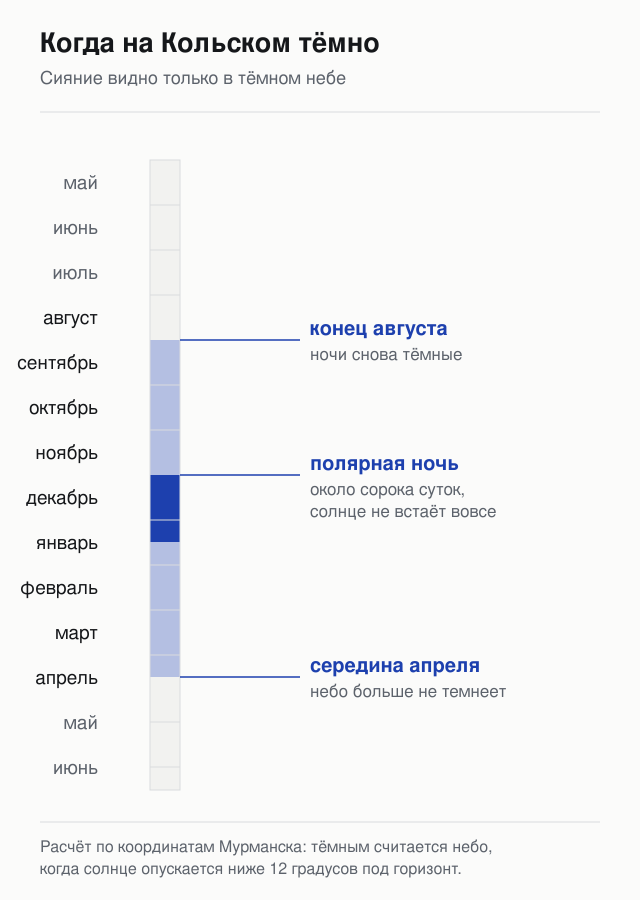

Полярную ночь продают как главный аргумент поездки, и это первая ловушка темы. Темнота — условие необходимое, но не единственное, а по остальным условиям декабрь проигрывает.

## Почему полярная ночь — не лучшее время для сияния?

**Потому что сияние закрывают облака, а декабрь на Мурманском побережье почти сплошь пасмурный.** По многолетним нормам метеостанции Мурманска за год набирается в среднем 13 ясных дней. На декабрь из них приходится один, на январь два, на февраль один.

Цифра выглядит приговором, но её надо читать точнее. Полностью ясных суток действительно единицы, а вот по нижней облачности — той, что реально закрывает небо, — картина мягче: в декабре 4 ясных дня, в январе 5, в феврале 6, в марте 7.

Добавьте метель. В декабре её отмечают 18 дней в месяц, в январе и феврале по 20. Метель — это не только отсутствие видимости, но и перекрытые дороги, о чём ниже отдельно.

Получается арифметика, которую в рекламных описаниях туров не пишут: полностью ясной по нижней облачности в декабре оказывается примерно одна ночь из восьми, ещё часть ночей даёт просветы, а восемь суток в месяце затянуты наглухо. Сияние в эти ночи, скорее всего, будет. Увидите вы его или нет, решит облачность.

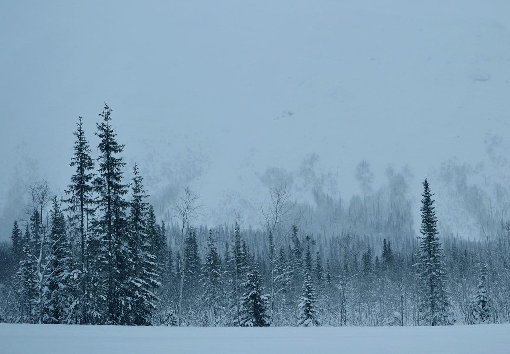

## Какой месяц выбрать: февраль и март против декабря

Февраль и март дают больше ясных ночей, чем начало зимы, и стоят дешевле. Это редкий случай, когда лучшее время совпадает с низким сезоном.

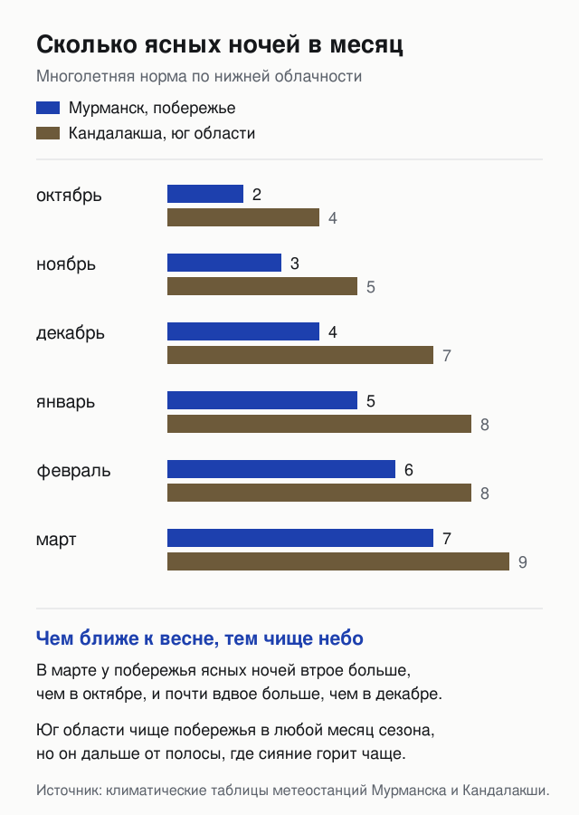

К марту небо над побережьем чище почти вдвое против декабря, а минимальный билет из Москвы падает с 12 825 ₽ до 9 652 ₽. Разница по деньгам на двоих в обе стороны — около двенадцати тысяч рублей, и это оплаченный лишний выезд за сиянием.

У марта есть честный минус. Ночи короче: к концу месяца темнеет поздно, и окно наблюдения сжимается с почти круглосуточного до нескольких часов. Тем, кому важна картинка «полярная ночь и полдень в сумерках», март не даст её вовсе.

Декабрь и январь остаются оправданными, если поездка совмещается с новогодними каникулами или если полярная ночь нужна как отдельное переживание. Тогда стоит закладывать больше ночей и не строить весь план вокруг сияния.

## Каким будет сезон 2026/27 после пика солнечного цикла?

**Слабее двух прошлых, но далеко не пустым.** Международное число солнечных пятен, которое ведёт Королевская обсерватория Бельгии, достигло максимума 25-го цикла в октябре 2024 года — сглаженное значение 160,9. К январю 2026-го оно опустилось до 104,2.

Спад идёт третий год подряд и продолжается: в июле 2026-го месячное число пятен составляло 78,1. Активность остаётся высокой по историческим меркам, но рекорды 2024–2025 годов, когда сияние ловили под Москвой и в Крыму, вряд ли повторятся.

Практический вывод для поездки скромнее, чем кажется. На широте Мурманска сияние появляется при геомагнитной активности от Kp 3, и такие ночи в сезон случаются регулярно даже на спаде цикла. Спад бьёт по редким событиям — тем самым бурям, из-за которых небо становится красным и заливает половину страны.

Отдельно стоит сказать, чего мы не знаем. Прогноз солнечной активности на конкретную ночь работает горизонтом в один-три дня. Всё, что обещает вам сияние в конкретное число за полгода вперёд, — маркетинг, а не наука.

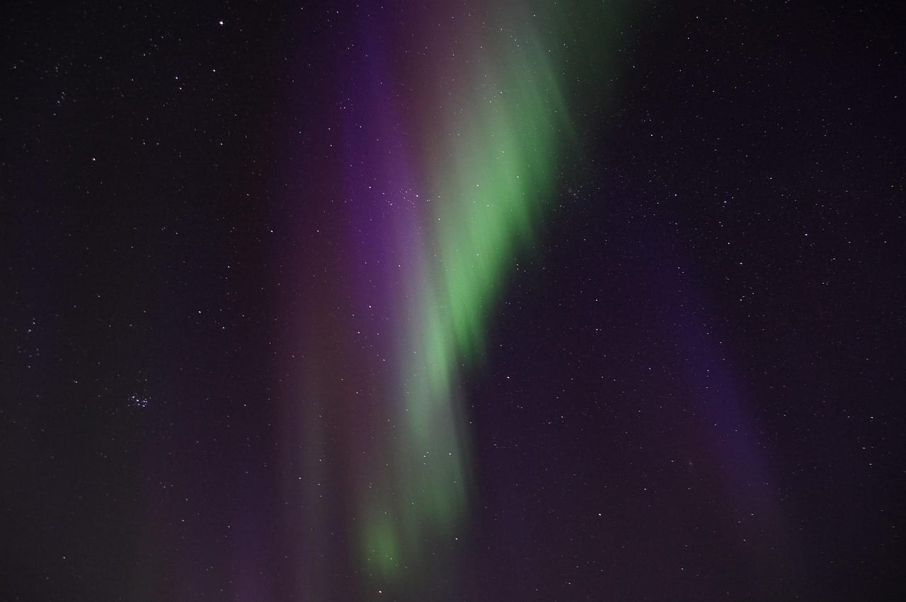

## Где искать сияние: Териберка, окрестности Мурманска или юг области

Три типовых точки, и у каждой своя логика.

**Териберка** — открытый горизонт над Баренцевым морем и никакой городской засветки. Сияние здесь ложится на воду, и кадры получаются лучшими в области. Плата за это — морская погода: облачность у побережья выше, чем в глубине суши, а дорога перекрывается чаще.

**Окрестности Мурманска** — компромисс. От города надо отъехать на двадцать-тридцать километров, чтобы уйти от засветки, и это делается за вечер без ночёвки вне города. Точки вроде горы Лисьей популярны, и в удачную ночь там стоят десятки машин.

**Юг области** — Кандалакша, Хибины, окрестности Кировска. Небо там заметно чище: в январе 8 ясных ночей по нижней облачности против 5 в Мурманске, в марте 9 против 7. Минус в том, что юг дальше от полосы, где сияние горит чаще всего, и при слабой активности его там не видно, тогда как на побережье оно ещё стоит над горизонтом.

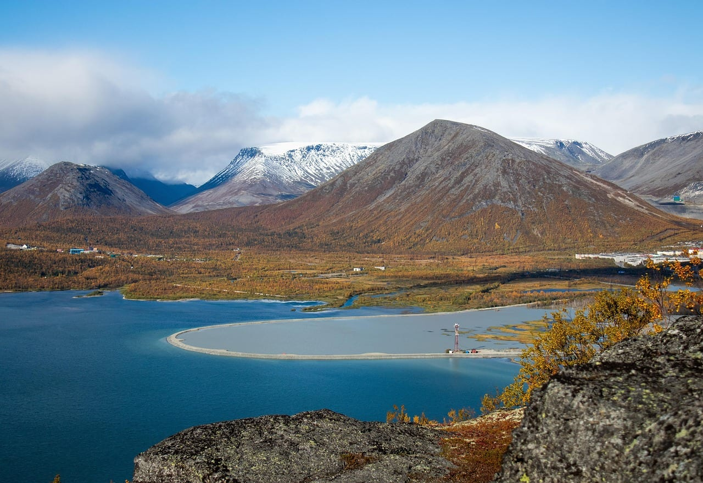

Выбор между побережьем и югом — это выбор между «чаще горит» и «чаще видно». Универсального ответа нет, и лучший вариант при поездке на несколько ночей — не выбирать вовсе, а держать оба направления в запасе и ехать туда, где на вечер меньше облаков.

<a href={excursions} class="aff-cta" rel="sponsored">Сравнить вечерние выезды за сиянием из Мурманска</a> — Спутник8 показывает программы местных гидов с ценой за человека, длительностью и размером группы, оплата картой России.

## Почему дорогу в Териберку закрывают и как под это подстроиться

**Дорогу перекрывают из-за ветра, а не из-за мороза.** Последние сорок с лишним километров идут по открытой тундре, где нет ни леса, ни построек. При сильном ветре трассу переметает за час, видимость падает до нуля, и участок закрывают до улучшения погоды.

В 2026 году дорогу закрывали 8 февраля, 24 апреля и в конце мая. Апрельский и майский случаи показательны: снежные перемёты на Кольском живут дольше календарной зимы.

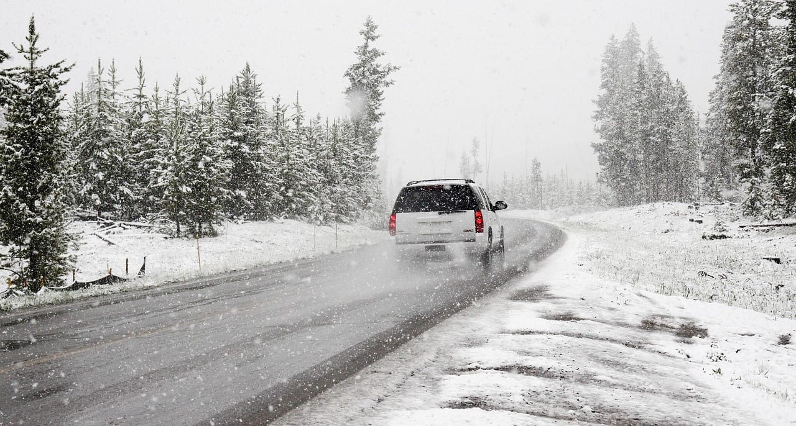

Что с этим делать практически. Не планировать Териберку на последний день поездки — при закрытии дороги заменить его будет нечем. Не бронировать жильё в Териберке без права отмены. И держать телефон местного водителя или оператора: они узнают о закрытии раньше, чем это появится в новостях.

Отдельный риск — попасть в Териберку и застрять там. Дорогу закрывают в обе стороны, и люди пережидают в посёлке по сутки. Запас лекарств и заряженный аккумулятор в машине для февральской поездки не паранойя.

## Сценарии поездок

Четыре готовых варианта под разный запас времени и денег. Длительность считается ночами, потому что охота за сиянием — ночное занятие.

**Выходные из Москвы, 2 ночи.** Прилёт в пятницу вечером, два выезда за сиянием, суббота на город: Мурманск, атомный ледокол «Ленин», залив. Машина не нужна, выезды берутся с водителем. Честный минус: две ночи — это лотерея, и вероятность уехать без сияния высока.

**Классика, 4 ночи с Териберкой.** Три выезда за сиянием, один полный день на Териберку с морской прогулкой и кладбищем кораблей, один день на Мурманск. Машина желательна, но выезды всё равно проще брать с гидом. Минус: при закрытии дороги теряется главный день, запасного нет.

**Кольский вширь, 6–7 ночей.** Мурманск и побережье плюс переезд на юг области — Хибины, Кировск, Кандалакша. Смысл в том, чтобы уходить от облаков, а не сидеть на одной точке. Машина обязательна. Минус: переезды съедают дневное время, и часть его придётся отдать дороге вместо съёмки.

**Зимний спорт плюс сияние, 5–6 ночей.** База в Кировске: днём горные лыжи в Хибинах, ночью выезды за сиянием по чистому небу юга. Машина нужна. Минус: от главной полосы сияния вы дальше всего, и в слабые ночи небо останется пустым.

| Сколько ночей | Что складывается |
|---|---|
| 2 ночи | Город и два выезда. Сияние — как повезёт |
| 4 ночи | Три выезда, Териберка, Мурманск. Рабочий минимум |
| 5–6 ночей | Юг области, лыжи в Хибинах, выезды по чистому небу |
| 7 ночей | Побережье и юг вместе, запас на метель и закрытые дороги |

Запас на непогоду — часть плана, а не роскошь. При четырёх ясных ночах в декабре и трёх ночах поездки арифметика против вас.

## Сколько стоит поездка за сиянием?

Разброс здесь больше, чем в любом другом зимнем направлении России, и зависит он от одного решения: ехать самому или брать готовую программу.

<PricingCards caption="На человека, 4 ночи в сезон, без перелёта. Цены выездов и готовых программ сняты с витрин 18.08.2026; жильё, питание, морская прогулка и трансфер — ориентир" tiers={[
  { tier: 'Самостоятельно', price: '28 000–35 000 ₽', priceNote: 'за 4 ночи со всеми расходами', features: ['Жильё в Мурманске 3 500–6 000 ₽ за ночь', 'Три выезда за сиянием 3 400–6 000 ₽ с человека', 'Морская прогулка в Териберке от 3 000 ₽', 'Еда 600–900 ₽ за приём', 'Трансфер в Териберку в группе от 4 000 ₽'] },
  { tier: 'Готовая программа', price: 'от 42 900 ₽', priceNote: 'четыре дня, три ночи', featured: true, badge: 'Чаще всего берут', features: ['Два выезда за сиянием в цене', 'Териберка и саамская деревня с оленями', 'Мурманск и ледокол «Ленин»', 'Трансферы и гид включены', 'Программа двигается под погоду'], ctaLabel: 'Посмотреть программы и даты', ctaHref: tours },
  { tier: 'Индивидуально', price: 'от 20 000 ₽', priceNote: 'за машину на вечер, не за человека', features: ['Выезд только для вашей группы', 'Водитель едет туда, где чище небо', 'Подъём на гору Лисью от 9 900 ₽ с человека', 'Съёмка на профессиональную технику', 'Верхняя граница витрины — 54 900 ₽'] },
]} />

На живой витрине экскурсий 18 августа 2026 года стояло 32 программы за сиянием из Мурманска. Самая дешёвая — 2 925 ₽ с человека за короткий вечерний выезд, самая дорогая — 54 900 ₽. Групповой выезд на четыре-пять часов держится в коридоре 3 400–6 000 ₽, мини-группа до восьми человек — около 4 500 ₽.

Самостоятельный вариант выходит дешевле, но требует машины и готовности ехать ночью по зимней дороге. Экономия против группового выезда получается ощутимой на длинной поездке и почти нулевой на двух-трёх ночах.

## Как добраться из Москвы и когда билеты дешевле?

**Прямой рейс Москва — Мурманск идёт около двух с половиной часов, разницы во времени нет.** Минимумы сезона в поиске билетов дают «Победа» и Smartavia. Аэропорт за городом, до центра идёт автобус и такси, дорога занимает около получаса.

Минимальные цены в одну сторону по месяцам сезона, снятые 18 августа 2026 года:

| Месяц | Минимум в одну сторону |
|---|---|
| Сентябрь 2026 | 10 409 ₽ |
| Октябрь 2026 | 9 735 ₽ |
| Ноябрь 2026 | 11 066 ₽ |
| Декабрь 2026 | 12 825 ₽ |
| Январь 2027 | 12 387 ₽ |
| Февраль 2027 | 10 872 ₽ |
| Март 2027 | 9 652 ₽ |

Дороже всего — конец декабря и новогодние каникулы, дешевле всего — март и октябрь. Мартовский билет дешевле декабрьского на четверть, и это второй аргумент в пользу поздней зимы после облачности.

<FlightRoutes routes={[
  { from: 'Москва', to: 'Мурманск', flights: [
    { airline: 'Победа, март', duration: '2 ч 30 мин', priceFrom: '9 652 ₽', priceUrl: flights, priceUrlLabel: 'Сравнить даты и цены' },
    { airline: 'Smartavia, октябрь', duration: 'прямой', priceFrom: '9 735 ₽' },
    { airline: 'Smartavia, декабрь', duration: 'прямой', priceFrom: '12 825 ₽' },
  ] },
]} caption="Прямые рейсы, в одну сторону, минимумы по месяцам сезона на 18.08.2026" />

<a href={flights} class="aff-cta" rel="sponsored">Проверить цены Москва — Мурманск по датам</a> — Aviasales показывает календарь на месяц вперёд, видно, какие числа марта дешевле декабрьских; оплата картой России, билет приходит на почту.

Есть и поезд: из Москвы до Мурманска около 35 часов, из Петербурга около 27. Вариант для тех, кто не любит самолёты или едет с большим багажом съёмочной техники.

## Где жить в Мурманске и Териберке

Мурманск — крупнейший город мира за полярным кругом, с обычным городским выбором гостиниц и квартир. Ночь в отеле среднего уровня в центре зимой обходится ориентировочно в 3 500–6 000 ₽, квартира посуточно дешевле; точную цену на свои даты стоит смотреть в поиске, она сильно пляшет от новогодних каникул.

Териберка — другая история. Посёлок маленький, вариантов немного, и в сезон их разбирают заранее. Цены там выше мурманских при более скромном уровне, и это плата за расположение.

Практический совет, который экономит деньги и нервы: базироваться в Мурманске, а в Териберку ездить одним днём. Так вы не привязаны к посёлку при закрытой дороге и не платите за ночёвку в месте, где вечером почти нечем заняться, кроме неба.

<a href={stay} class="aff-cta" rel="sponsored">Найти жильё в Мурманске и Териберке</a> — Отелло показывает российские отели и квартиры с оплатой картой России, у части объектов бесплатная отмена, что для зимнего Кольского существенно.

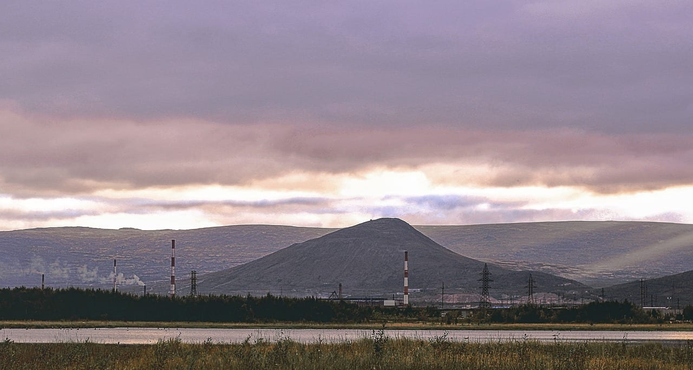

## Чем занять день, пока ждёшь ночь

**Зимой на Кольском светло с одиннадцати до трёх, а иногда и вовсе не рассветает — и это ставит вопрос, куда девать день.** Ответ важнее, чем кажется: поездка на три-четыре ночи означает три-четыре дня, которые нечем заполнить, если не подумать заранее.

**Хибины и Кировск.** Горнолыжный сезон здесь длится с декабря по май — редкость для России. Даже без лыж стоит подняться на смотровые: зимние сопки выглядят иначе, чем на летних фотографиях.

**Снегоходы и упряжки.** Самый честный способ увидеть тундру, куда не ведут дороги. Выезды продают и в Мурманске, и в Териберке; в упряжке едут за самим ощущением, а не за расстоянием.

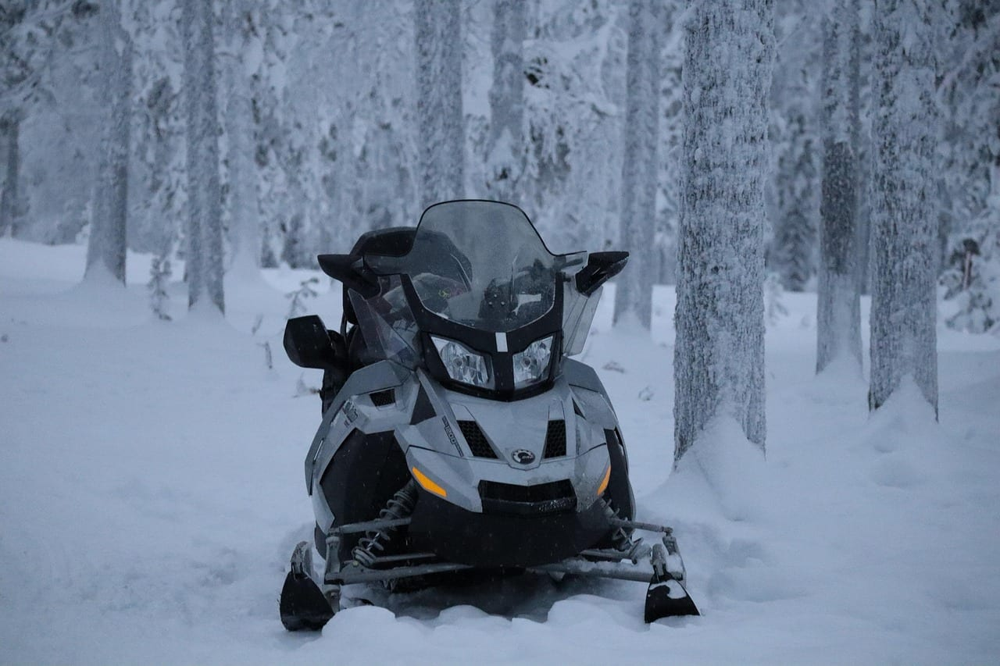

**Атомный ледокол «Ленин».** Первое в мире атомное судно гражданского флота стоит в Мурманске как музей — с реакторным отсеком, каютами и мостиком. Экскурсия занимает час-полтора и хорошо ложится в короткий световой день.

**Саамская деревня.** Оленьи упряжки, чум, разговор про уклад — формат туристический, но детям обычно заходит лучше всего остального.

**Териберка днём.** Кладбище деревянных судов, батарея валунов на берегу, открытая Арктика и зимнее море, которое не замерзает. Отдельная причина ехать даже без сияния.

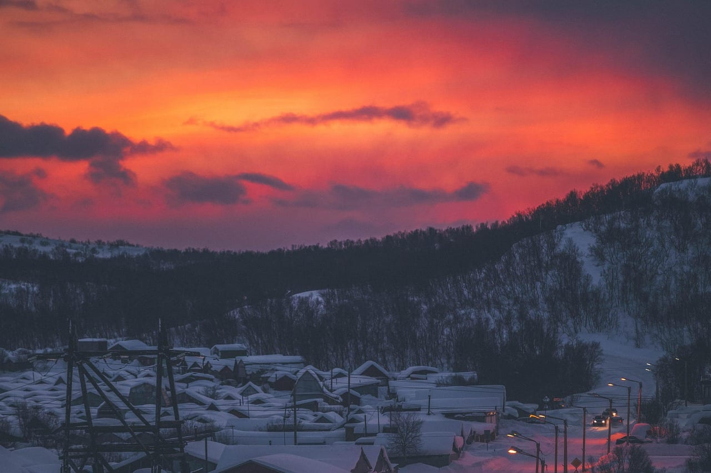

---

## Как проверять прогноз сияния

**По российскому источнику, а не по случайному приложению.** Лаборатория солнечной астрономии Института космических исследований РАН ведёт страницу прогноза для Мурманска: там видна вероятность увидеть сияние в зените в ближайший час, текущий индекс интенсивности и то, как авроральный овал двигался за минувшие сутки.

Второй ориентир — геомагнитный индекс Kp. На широте Мурманска сияние возможно от Kp 3, при Kp 4–5 оно становится ярким и цветным. Ниже тройки шансы на побережье остаются, но небо даёт лишь бледную полосу, которую камера видит лучше глаза.

Третья составляющая, которую обычно забывают, — прогноз облачности. Толку от Kp 5 нет, если над точкой стоит сплошная низкая облачность. Рабочая схема выглядит так: смотрим геомагнитный прогноз на вечер, накладываем карту облачности и выбираем точку под чистое небо, а не под красивое место.

Полярный геофизический институт РАН, чьи обсерватории работают в Ловозере и на Шпицбергене, ведёт наблюдения сияний с 1960 года. Это тот случай, когда наука о явлении делается ровно там, куда вы едете.

## Что взять и как снимать сияние

Одежда рассчитывается не на температуру, а на неподвижность. Средняя температура января в Мурманске −9,6 °C — по российским меркам мягко, но при среднем ветре 5,4 м/с и двух часах стояния на месте это ощущается иначе.

Нужны многослойность, обувь на размер больше под толстый носок, шапка с закрытыми ушами и запасные перчатки. Тонкие перчатки под варежки — чтобы снимать варежку для настройки камеры и не хвататься за металл голой рукой.

Съёмка. Телефоны последних поколений снимают сияние в ночном режиме без всякого штатива, и результат выходит ярче того, что видит глаз. Камере нужен штатив, выдержка от двух до десяти секунд, светосильный объектив и ручной фокус на бесконечность. Запасной аккумулятор держать во внутреннем кармане: на морозе батарея садится в разы быстрее.

Главное разочарование новичков в том, что глаз видит бледнее камеры. Зелёный цвет глазу заметен при средней активности, красные и фиолетовые оттенки чаще проявляются только на снимке. Это не обман съёмки, а устройство ночного зрения.

## Три ошибки, из-за которых уезжают без сияния

**Почти все неудачные поездки укладываются в три штуки, и все три решаются на этапе планирования.**

**Ошибка первая: одна ночь.** Сияние — не расписание, а совпадение трёх условий: тёмное небо, ясная погода и активность на Солнце. Каждое по отдельности вероятно, все три сразу — нет. При одной ночи в запасе шанс упирается в облачность, а она на побережье такая, что декабрь даёт в среднем четыре ясные ночи на месяц. Три ночи меняют арифметику принципиально, четыре-пять делают поездку почти беспроигрышной.

**Ошибка вторая: смотреть из города.** Мурманск — крупный город с уличным освещением, и слабое сияние в нём не разглядеть. Отъезд даже на двадцать-тридцать километров от фонарей меняет картину: то, что в городе выглядит сероватой дымкой, за городом оказывается зелёной лентой. Именно за это платят на вечерних выездах — не за «знание секретного места», а за машину, которая увозит от засветки и умеет за ночь переехать туда, где разрыв в облаках.

**Ошибка третья: верить прогнозу за неделю.** Солнечный ветер летит до Земли двое-трое суток, поэтому осмысленный горизонт прогноза сияния — примерно два дня, а не неделя. Всё, что обещают заранее, — это статистика, а не предсказание. Планировать поездку по прогнозу бессмысленно; планировать надо по месяцу и числу ночей, а прогноз смотреть уже на месте, каждый вечер.

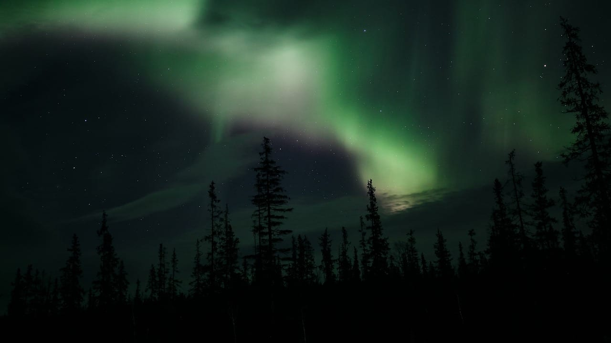

---

## Что делать, если сияния так и не будет

Ответ, которого нет в описаниях туров: закладывать в поездку то, ради чего не жалко приехать и без сияния. Кольский зимой самодостаточен.

Териберка стоит поездки сама по себе: открытая Арктика, кладбище деревянных судов, батарея валунов на берегу, зимнее море. Хибины дают горные лыжи с декабря по май. В Мурманске работает атомный ледокол «Ленин», превращённый в музей.

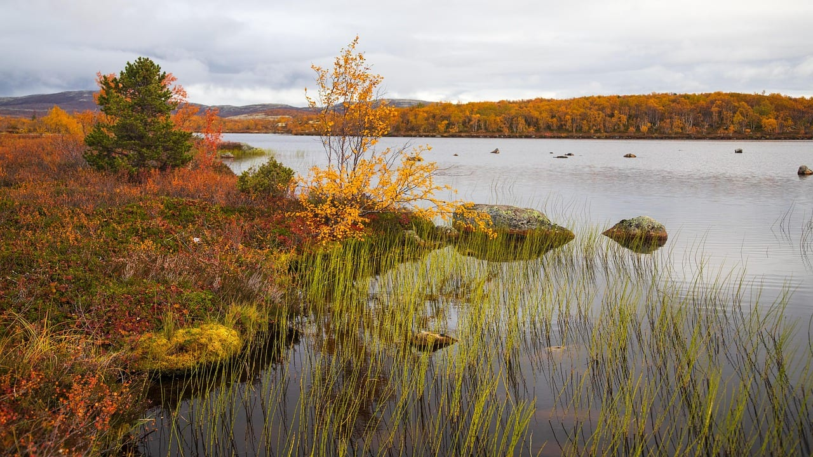

Если план поездки держится на одном явлении, погода делает вас заложником. Если сияние — премия к нормальному северному маршруту, неудачная неделя не превращается в потерянные деньги.

## FAQ

**Когда лучше ехать за северным сиянием в Мурманск?**
Февраль и март. В эти месяцы над побережьем больше ясных ночей — 6 и 7 против 4 в декабре по нижней облачности, — а мартовский билет дешевле декабрьского на четверть.

**Сколько ночей нужно, чтобы увидеть сияние?**
Минимум три, лучше четыре. Одна ночь — лотерея: чистое небо в сезон выпадает не каждый вечер, а сияние без просвета в облаках не видно.

**Обязательно ли ехать в полярную ночь?**
Нет. Тёмных ночей на Кольском хватает с конца августа до середины апреля. Полярная ночь — отдельное переживание, но по погоде декабрь один из худших месяцев сезона.

**Видно ли сияние из самого Мурманска?**
При сильной активности — да, но городская засветка съедает слабое свечение. От города стоит отъехать на 20–30 километров.

**Сколько стоит выезд за сиянием?**
Групповой вечерний выезд — 3 400–6 000 ₽ с человека, мини-группа около 4 500 ₽, индивидуальный от 20 000 ₽ за машину. Витрина 18.08.2026 показывала 32 программы, от 2 925 ₽ до 54 900 ₽.

**Каким будет сезон 2026/27?**
Спокойнее двух прошлых. Пик 25-го солнечного цикла пройден в октябре 2024 года, сглаженное число солнечных пятен снизилось со 160,9 до 104,2 к январю 2026-го. Сияния останутся частыми, редкие мощные бури — менее вероятными.

**Почему закрывают дорогу в Териберку?**
Из-за ветра и снежных перемётов на открытом участке тундры, а не из-за мороза. В 2026 году дорогу закрывали 8 февраля, 24 апреля и в конце мая.

**Нужна ли машина?**
Не обязательна, но без неё выбор точек сужается. На двух-трёх ночах выгоднее брать выезды с местным водителем, на неделе с переездами по области машина нужна.

**Где чище небо — на побережье или на юге области?**
На юге. В Кандалакше 8 ясных ночей в январе против 5 в Мурманске. Но юг дальше от полосы, где сияние горит чаще, и при слабой активности его там не увидеть.

**Можно ли увидеть сияние летом?**
Нет. Сияние горит круглый год, но с мая по август небо над Кольским не темнеет и свечение теряется в свете дня.

**Какой Kp нужен?**
От 3 на широте Мурманска. При 4–5 сияние становится ярким и цветным, ниже 3 остаётся бледная полоса, заметная скорее камере, чем глазу.

## Что почитать дальше

- [Байкал зимой: лёд, переправа на Ольхон, цены](/blog/baikal-zimoy-2027/) — второе большое зимнее направление России с таким же коротким сезонным окном.
- [Камчатка: вулканы, океан, сколько стоит поездка](/blog/kamchatka-guide-2026/) — самый дорогой внутренний маршрут страны.
- [Карелия: Рускеала, Кижи, Валаам](/blog/kareliya-guide-2026/) — ближайший к Петербургу север, если полярные широты кажутся перебором.
- [Сколько стоит неделя в России](/blog/skolko-stoit-nedelya-v-rossii-2026/) — сравнение бюджетов по регионам.

---

Данные проверены 18 августа 2026 года. Цены на перелёт и экскурсии меняются ежедневно, климатические нормы — многолетние средние, а не прогноз на конкретную неделю. Первоисточники: [международное число солнечных пятен SILSO, Королевская обсерватория Бельгии](https://www.sidc.be/SILSO/datafiles), [климатические таблицы метеостанции Мурманска](http://www.pogodaiklimat.ru/climate/22113.htm), [прогноз полярных сияний Лаборатории солнечной астрономии ИКИ РАН](https://xras.ru/aurora.html/murmansk/).

Пишу о путешествиях в телеграм-канале [@traveltriberu](https://t.me/traveltriberu).
