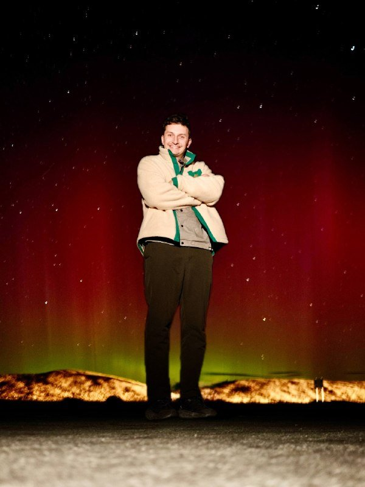
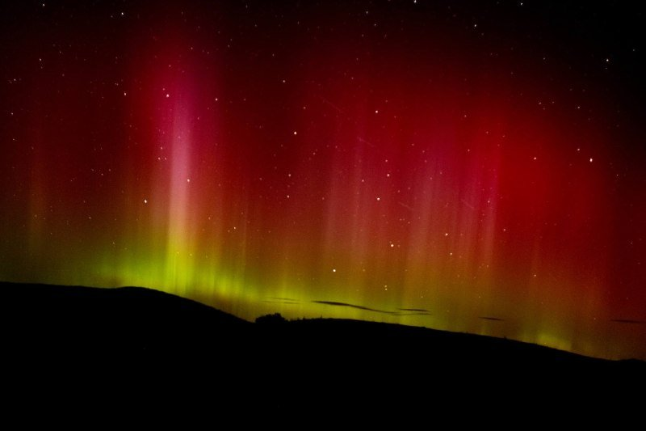
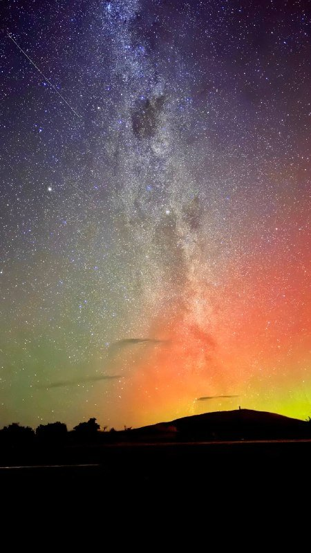
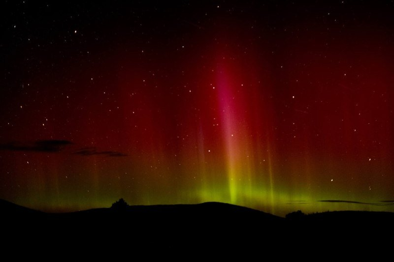
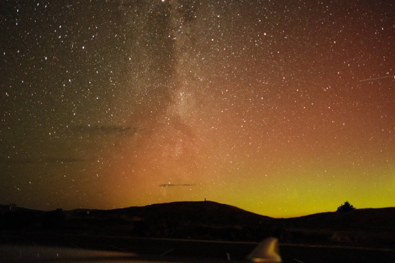

Мы вышли ночью просто поснимать звёзды. Без прогнозов, без какой-то там «охоты за южным сиянием». Камера, штатив, термос с чаем — всё. Над южным горизонтом висело тусклое красное пятно, я списал его на засветку от далёкой деревни и продолжил целиться в Млечный путь. Открыл первый кадр на просмотре — а там кроваво-розовая дуга через всё небо. Я тупо смотрю на экранчик и не понимаю, что вижу. **Это южное сияние. В Новой Зеландии. Поймано случайно, пока мы вообще целились в звёзды.**

Дальше — что я выяснил постфактум, обтерев глаза от удивления: где это ловить осознанно, когда лететь, сколько стоит и почему оно такое странное. Без рекламы туров и эзотерики про «энергии».

> **Когда лучше ехать в Новую Зеландию:** [таблица сезонов](/seasons/) — для охоты за сиянием это апрель–сентябрь, пик у равноденствий.

---

## 🌌 Почему сияние в Новой Зеландии красное, а не зелёное

Если вы видели аврору в Норвегии или на Кольском — там танцуют зелёные шторы. В Новой Зеландии всё иначе. Тут чаще всего ловят ровную **розово-красную дугу**, которая выглядит как космический неоновый закат. Не зелёные шторы, не пляски. Дуга. Розовая. И поначалу мозг отказывается признавать, что это аврора.

Объяснение скучное и физическое. Солнечный ветер бомбит атмосферу частицами, кислород и азот реагируют по-разному в зависимости от высоты:

* **Зелёное сияние** — это нижние **100–150 км**, плотный слой кислорода.
* **Красное** — выше, **200–300+ км**, кислорода меньше, переход медленнее, поэтому красный.
* **Розово-малиновый оттенок** даёт азот. Отсюда «неоновость» — такого в скандинавских авророрах не бывает.

Иногда вместо вертикальных штор появляется ровная горизонтальная полоса — у астрономов даже название красивое: **Stable Auroral Red arc, SAR**. Нужно знать одно: над НЗ её ловят чаще, чем над любой другой обитаемой широтой. Просто потому что мы дальше от магнитного полюса, чем Скандинавия, и до нас долетает только верхушка свечения. А верхушка — красная.

Практический вывод: не ждите танцующих штор. Ждите розового неба и тонкой полосы. И не списывайте её на засветку, как сделал я.

---

## ⏰ Когда лететь — сезоны, часы, активность Солнца

Тут три уровня попасть в нужное окно: год, месяц, час. Промахнётесь хоть в одном — шансы тают.

### Год: солнечный цикл

Сейчас, в 2026, мы на спаде **25-го солнечного цикла**. Пик был в 2024–2025 — самая бойкая аврора-эра за два десятилетия. До 2027–2028 шансы ещё хорошие, потом наступит минимум, и можно будет годами впустую светить камерой. Если давно собирались — окно реально закрывается, не растягивайте на «когда-нибудь».

### Сезон: апрель–сентябрь

* **Идеально:** апрель–май и август–сентябрь. Длинные тёмные ночи плюс пики геомагнитной активности у равноденствий.
* **Неплохо:** июнь–июль. Зато ночи самые длинные. Минус — на Южном острове зимой больше облаков и реально холодно.
* **Так себе:** ноябрь–февраль. Там южное лето, в Текапо в 22:30 ещё ясный сумрак. Ехать имеет смысл только за Млечным путём.

### Эффект равноденствия

Вокруг **20 марта** и **22 сентября** магнитное поле Земли особенно нервно реагирует на солнечный ветер. Это известный «эффект Рассела-Макферрона», его обожают все аврора-чейзеры мира. Если у вас есть гибкость по датам — двигайте под равноденствие. Серьёзно, разница в шансах ощутимая.

### Часы: 22:00–02:00

Аврора не включается по будильнику, но статистика прозрачная:

* **22:00–02:00** — пик, магнитная полночь совпадает с астрономической.
* До 21:00 и после 03:00 — ловят только при сильных бурях (Kp ≥ 6).

---

## 📡 Прогноз и Kp-индекс: что отслеживать

Без прогноза реально можно проторчать неделю и уехать с чёрными кадрами. Минимальный набор — три приложения и один сайт. Поставьте до вылета.

### Что такое Kp-индекс

**Kp** — это шкала геомагнитной активности от 0 до 9. Для Новой Зеландии перевод примерно такой:

* **Kp 3–4:** возможно слабое сияние на южном горизонте, видно только на длинной выдержке.
* **Kp 5 (G1 storm):** уверенно с Южного острова, появляются розовые оттенки.
* **Kp 6–7 (G2–G3):** яркое, иногда видно даже с Северного острова, ловят зелёные шторы.
* **Kp 8–9 (G4–G5):** редкость, событие года. В такие ночи аврора видна даже из Окленда.

### Приложения и сайты

Aurora Forecast (iOS/Android) — пуши при росте Kp выше заданного порога. Установите за неделю до поездки и забейте в настройках Kp 4 — будет дёргать заранее. SpaceWeatherLive — прогноз на 27 дней (полный оборот Солнца). Лучший инструмент для планирования. My Aurora Forecast — карта вероятности «прямо сейчас» по геолокации.

Из сайтов: [NOAA SWPC Aurora Forecast](https://www.swpc.noaa.gov/products/aurora-30-minute-forecast) (карта аврорального овала на 30 минут вперёд) и [MetService](https://www.metservice.com/) для прогноза облачности по НЗ. Без чистого неба никакой Kp 9 не поможет.

**Лайфхак, который реально пригождается.** Солнечный ветер летит до Земли 2–3 дня. Если SpaceWeatherLive показывает свежую CME-вспышку — у вас 48 часов спланировать маршрут к чистому небу. Это не теория, у меня сработало.

---

## 🗺️ Где ловить — 4 точки на Южном острове

Северный остров иногда ловит сильные бури, но если задача увидеть, а не «ну вдруг повезёт» — лететь надо на юг. Чем южнее, тем выше шансы.

### 1. Озеро Текапо и заповедник Aoraki Mackenzie

Координаты: -44.00, 170.48. От Крайстчерча — 3 часа на машине. Это официальный **International Dark Sky Reserve**: в радиусе 80 км нет ни одного фонаря с обычной лампой, всё перепрошито на «звёздное» освещение. Озеро открывает южный горизонт без помех. Лучшие точки — Lake Tekapo Lookout, Mt. John Observatory (только с туром, по записи), Lake Alexandrina. Жильё — YHA Tekapo для бэкпекеров, Peppers Bluewater Resort если хочется душ и вид на воду. **70–180 USD/ночь.**

### 2. Аораки / Маунт-Кук

Час от Текапо. Часть того же Dark Sky Reserve. Главный плюс — снежные пики в кадре. Если хотите эпичную композицию для портфолио, ехать сюда. Главный минус — горы могут перекрывать южный горизонт, обязательно сверяйтесь с картой азимутов до выезда. Точки — Hooker Valley (если осилите тропу ночью с фонариком) и парковка у Mt. Cook Village.

### 3. Фьордленд (Те Анау, Милфорд-Саунд)

2.5 часа на машине от Квинстауна. Дикие фьорды, нулевая засветка, и если небо чистое, космос буквально начинается над головой. **Минус один и большой:** самая высокая вероятность облачности на острове. Микроклимат фьордов любит дождь — его тут больше 200 дней в году. Закладывайте 2–3 ночи минимум, иначе шанс уехать пустым большой. Точки — берег Те Анау, Key Summit на рассвете.

### 4. Остров Стюарт (Rakiura)

Сюда — паром из Bluff (1 час) либо самолёт из Инверкаргилла (20 минут). Это **самая южная точка Новой Зеландии** (-46.8°). Сияние тут видно с северной стороны — как полярное в Норвегии, только наоборот. Минимум людей, небо над морем, тишина. Но инфраструктура минимальна, дорого, и сильно зависите от погоды. Точки — Observation Rock, Horseshoe Bay.

**Что выбрать на первую поездку:** Текапо. Доступно, не дорого, гарантированно тёмное небо, удобно совмещать с Маунт-Куком и Квинстауном. Стюарт — для второго раза, когда уже знаете, чего хотите, и готовы тащиться на край света за конкретной картинкой.

---

## 📷 Как снимать сияние без опыта

Главное, что нужно понять: **камера видит сияние ярче, чем глаз.** Глазом часто кажется, что в небе ничего нет — какой-то намёк на засветку. А на 15-секундной выдержке проявляется красная дуга через половину неба. Не доверяйте глазу. Снимайте всё подозрительное, сортируйте дома.

### Минимальный набор

Любая беззеркалка или зеркалка от 2018 года: Sony A7, Canon R, Nikon Z — что есть. Объектив желательно светосильный, идеально 14–24 мм f/1.8–f/2.8. Кит-линза 18–55 f/3.5 тоже сработает, просто шумнее. Штатив — без вариантов, без него длинная выдержка превращается в смазанное месиво. Желательно с крючком под рюкзак как противовес от ветра. Запасной аккумулятор минимум один, лучше два — на холоде батарея садится в 2 раза быстрее, держите запас под курткой. Спусковой тросик или таймер на 2 секунды, иначе при нажатии на спуск рукой будет смаз.

### Настройки для старта

| Параметр | Значение |
|---|---|
| Режим | Manual (M) |
| Выдержка | **10–20 секунд** |
| Диафрагма | **f/2.8** или максимально открытая |
| ISO | **1600–6400** |
| Фокус | Ручной, на бесконечность (по яркой звезде) |
| Баланс белого | 3500–4000 K |
| Формат | RAW |

### Смартфоном

iPhone 14 Pro и новее, Pixel 7 Pro+, Samsung S23 Ultra+ снимают аврору в ночном режиме, и снимают прилично. Включаете режим, ставите на штатив или просто на камень, нажимаете спуск — телефон сам делает 10–30 секундную композитную экспозицию. Детализация и цвет уступят зеркалке, но картинка для инстаграма точно получится.

**Лайфхак.** Делайте серию по 30 кадров с интервалом 3 секунды — потом склеите тайм-лапс движения сияния. Такие ролики на YouTube собирают миллионы просмотров, и сделать это не сложнее обычного фото.

---

## 🛂 Виза для россиян в 2026

Новая Зеландия — не самая лояльная страна для российского паспорта. **NZeTA россиянам не подходит**, нужна полноценная гостевая виза. Без вариантов, через посредников не дешевле, через знакомых не быстрее. Только официальный путь.

* Тип: **Visitor Visa**, оформляется онлайн через [immigration.govt.nz](https://www.immigration.govt.nz/new-zealand-visas/options/visit).
* Стоимость: **211 NZD** (~11 000 ₽) + сервисный сбор IVL **35 NZD**.
* Срок пребывания: до **9 месяцев** за один въезд.
* Документы: загранпаспорт, фото, авиабилеты, бронь жилья, выписка с банковского счёта (показать ~1000 NZD на каждый месяц поездки), приглашение или маршрут.
* Срок рассмотрения: обычно **1–4 недели**, в пик растягивается до 8.
* Подавать минимум за **2 месяца** до вылета.

⚠️ С 2024 года для россиян обязательна биометрия. Ближайшие визовые центры VFS — Стамбул, Дубай, Бангкок, Алматы, Ереван. Закладывайте перелёт + 1–2 дня в бюджет и в график. Из Москвы по моему опыту проще всего через Стамбул, перелёт стоит относительно недорого.

> **Подробно про биометрию в других визах:** [EES в Шенгене 2026](/blog/ees-shengen-2026/) — отдельный гайд.

---

## ✈️ Как добраться

Прямых рейсов из РФ в Новую Зеландию нет и в обозримом будущем не будет. Только пересадка. Минимум одна, обычно две.

### Лучшие маршруты в 2026

Через Дубай (Emirates, Etihad): Москва → Дубай → Окленд. Около 24 часов в воздухе плюс пересадка, цена **1700–2400 USD** туда-обратно. Самый частый маршрут. Через Доху (Qatar Airways): Москва → Доха → Окленд или Крайстчерч. Чуть дольше — 26 часов, но сервис вкуснее, **1800–2500 USD**. Через Сингапур (Singapore Airlines): через Стамбул и Сингапур, 30+ часов, дорого, но по сервису топ. Через Гонконг (Cathay Pacific): через Дубай или Бангкок, 28+ часов, **1600–2200 USD** — иногда самый дешёвый вариант.

Сравнить актуальные цены и пересадки удобнее всего через [Aviasales](https://aviasales.tpk.mx/Nl3nIBF6?locale=ru&market=ru&currency=rub) — он агрегирует Emirates, Qatar, Cathay, Singapore Airlines в одной выдаче.

### Внутренние перелёты

Прилететь нужно сразу на Южный остров, иначе теряете полдня на трансферы и день на акклиматизацию.

* **Окленд → Крайстчерч (CHC)** — Air New Zealand или Jetstar, **80–150 USD**, 1.5 часа, рейсов много.
* **Окленд → Квинстаун (ZQN)** — **120–250 USD**, 2 часа.
* **Окленд → Инверкаргилл (IVC)** — **180–280 USD**, через Крайстчерч.

Совет: прилетайте в Крайстчерч. Оттуда стартует логичный маршрут на Текапо–Маунт-Кук. Возвращайтесь из Квинстауна, не нужно делать круг.

---

## 🚗 Маршрут на 7 ночей «За сиянием»

Готовый план — повторяет наш с минимальной оптимизацией. Логика такая: первая ночь на отдых после перелёта, потом сразу в тёмные точки и движение по дугообразному маршруту с возможностью манёвра по погоде.

| День | Маршрут | Где ночевать | Что делать |
|---|---|---|---|
| 1 | Прилёт в Крайстчерч → аренда машины | Крайстчерч | Отдохнуть после перелёта |
| 2 | Крайстчерч → Текапо (3.5 ч) | Текапо | Первая ночь под звёздами на озере |
| 3 | Текапо → Маунт-Кук (1.5 ч) | Маунт-Кук Виллидж | Хайк Hooker Valley + ночная съёмка |
| 4 | Маунт-Кук → Ванака (3 ч) | Ванака | Tree of Wanaka, отдых |
| 5 | Ванака → Те Анау (3.5 ч) | Те Анау | Однодневный круиз в Милфорд + ночь у фьорда |
| 6 | Те Анау → Квинстаун (2 ч) | Квинстаун | Резерв на случай облачности |
| 7 | Квинстаун → перелёт обратно | — | Вылет в Окленд / домой |

Аренда машины — **40–70 USD/день** в Jucy, Apex или Hertz. Пробег по маршруту примерно 1500 км. Бензин в НЗ дорогой, заложите ещё ~150 USD на топливо.

---

## 💸 Сколько стоит — детальный бюджет

Это не история «слетаем на выходные». Перелёт + расстояния делают эту охоту явно не дешёвой, экономить можно, но не сильно.

| Статья | Эконом | Комфорт |
|---|---|---|
| Перелёт из Москвы (туда-обратно) | 1500 USD | 2500 USD |
| Виза НЗ + биометрия + перелёт в визовый центр | 400 USD | 600 USD |
| Внутренние перелёты по НЗ | 100 USD | 250 USD |
| Аренда машины (7 дней) + бензин | 350 USD | 600 USD |
| Жильё (7 ночей) | 500 USD | 1100 USD |
| Еда | 250 USD | 500 USD |
| Туры и активности (опционально) | 100 USD | 400 USD |
| **Итого на человека** | **~3200 USD** | **~6000 USD** |
| **На двоих за 7 дней** | **~5500 USD** | **~10 500 USD** |

Где можно сэкономить без потери впечатлений: кемпинг и хостелы YHA вместо отелей, готовка самим — почти все мотели имеют общую кухню. Один внутренний перелёт вместо двух, машину брать втроём-вчетвером (раскидать аренду и бензин).

> **Считаешь свой бюджет:** [калькулятор поездки](/calculator/) — закладывает перелёт, отель и питание на 39 направлений с актуальным курсом ЦБ РФ.

---

## ⚠️ Чтобы не разочароваться

Несколько вещей, которые портят впечатление, если не подготовиться.

Гарантий нет. Можно попасть в идеальный сезон, при Kp 5 и чистом небе — и ничего не увидеть. Солнце не подписывало с вами турпакет. Это не Северное сияние в Норвегии с 80% вероятностью при правильном бронировании.

Погода — главный босс. Облака и туман убивают даже сильную бурю. Нужна мобильность: машина и готовность ночью пилить 200 км в сторону за чистым небом. У нас был случай — Текапо в облаках, прыгнули в машину в полночь, через 2 часа были в Маунт-Куке под звёздным небом. Без машины так не сделать.

Камера честнее глаз. Если кажется, что в небе ничего нет — это не значит, что ничего нет. Я в первую ночь чуть всё не пропустил, списав красную дугу на «деревенскую засветку». Снимайте всё подозрительное, потом разберёте на компьютере.

Холод и ветер. Даже летом ночью на юге Южного острова бывает +3–5 °C, на Стюарте около нуля и с ветром в лицо. Без перчаток снимать невозможно — пальцы за 10 минут перестают слушаться. Берите тонкие тактильные перчатки под зеркалку и тёплые сверху для перерывов.

Долгий перелёт. Не закладывайте ночную съёмку в первый день — джетлаг в 12 часов и съёмка с длинной выдержкой плохо совместимы. Начните на второй день, не на первый.

---

## ❓ FAQ

**Можно увидеть сияние с Северного острова?**
Только при сильной буре (Kp ≥ 6), 1–2 раза в год. Точек с открытым южным горизонтом и без засветки на Северном мало — Wairarapa, Castlepoint. Стабильно — только Южный остров.

**Сколько ночей закладывать на охоту?**
Минимум 5. Из них статистически 2–3 будут ясными, и 1–2 — с активностью. Меньше — высокий шанс уехать пустым.

**Что лучше: машина или туры?**
Машина. Гид не сделает за вас работу с погодой. Если в Текапо облака, нужно прыгать в Маунт-Кук или Ванаку — экскурсия с автобусом так не делает. Аренда + Aurora Forecast — единственная рабочая схема.

**Можно ли совместить с другими странами?**
Да, через Сингапур или Дубай легко добавить Японию или Таиланд. [Гайд по Японии 2026](/blog/japan-guide-2026/) — Япония рядом по маршруту, часто берётся как «нагрузка» к НЗ.

**Когда брать билеты?**
За 5–7 месяцев. На рейсы Emirates и Qatar в апреле–мае и августе–сентябре цена начинает резко расти за 2 месяца до вылета. Зимние месяцы (июнь–июль) дешевле.

**Что делать с джетлагом?**
Разница с Москвой +9 часов. Прилетели — день не спите до 22:00 по местному, потом нормальный сон. На второй день вы готовы к ночной съёмке, не раньше.

**А с детьми ехать имеет смысл?**
Только если они выдерживают долгий перелёт и могут не спать до 02:00. Реально с 10 лет, не раньше.

**Безопасно ли ночью на природе?**
Да, в НЗ нет опасных животных (нет даже змей, кстати). Главные риски — холод и потеряться в темноте. Налобный фонарь и пауэрбанк обязательны.

---

## Что делать дальше

* 📅 [Таблица сезонов](/seasons/) — оптимальные месяцы для НЗ и 38 других направлений
* 💸 [Калькулятор бюджета](/calculator/) — учтёт перелёт, проживание и курс ЦБ РФ
* 🇯🇵 [Гайд по Японии 2026](/blog/japan-guide-2026/) — частый компаньон для НЗ через Сингапур
* 🇪🇺 [Шенгенская виза 2026](/blog/schengen-visa-2026/) — если планируете лететь через Европу
* 🛂 [EES биометрия в Шенгене](/blog/ees-shengen-2026/) — что нового на границах ЕС
* 📲 [Подпишись на @traveltriberu](https://t.me/traveltriberu) — публикую разборы стран без воды

---

*Актуально на: 1 мая 2026. Стоимость визы и биометрии указаны по официальному сайту Immigration New Zealand. Цены на перелёты — Aviasales и официальные сайты Emirates / Qatar Airways. Курсы валют ЦБ РФ. Информация о Kp-индексе и солнечной активности — NOAA SWPC и SpaceWeatherLive.*

*Часть ссылок партнёрские (Aviasales, Cherehapa, Airalo). Цена для тебя не меняется — мы получаем небольшую комиссию.*
