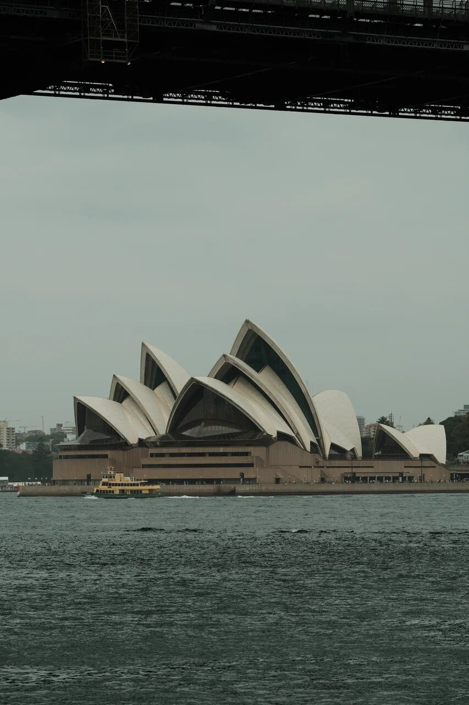
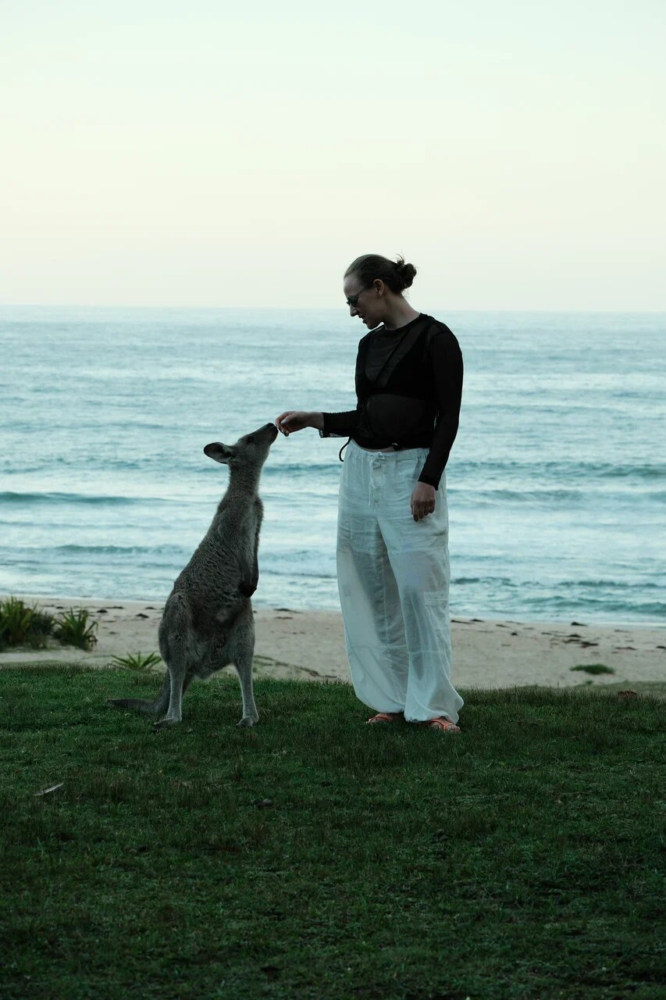
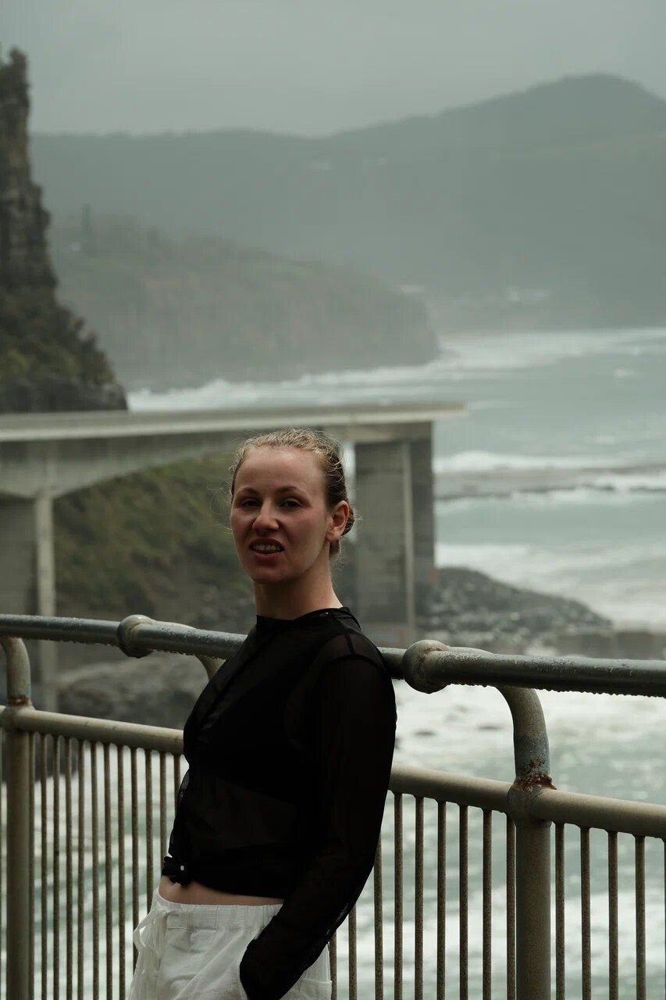
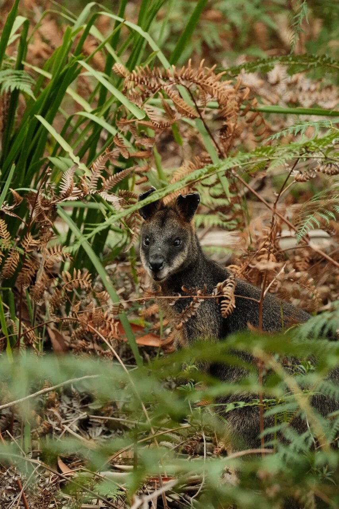

import PricingCards from '../../components/post/PricingCards.astro';
import FlightRoutes from '../../components/post/FlightRoutes.astro';
import AffiliateNote from '../../components/post/AffiliateNote.astro';
import { TP_LINKS, aviasalesRoute } from '../../data/affiliate.js';

Самое австралийское, что со мной случилось, — это не Оперный театр. Это кенгуру, который в сумерках вышел из кустов прямо на пляжный газон южнее Сиднея и спокойно потянулся за угощением с руки. Никакого зоопарка, никакого забора — просто вечер, океан за спиной и дикий кенгуру, которому ты по пояс. Австралия так и работает: ты приезжаешь за открытками с парусами, а увозишь вот это.

Дорога сюда длинная и недешёвая, виза — одна из самых муторных для россиян. Но именно поэтому страна не загажена толпами, как Бали или Пхукет. Этот гайд — что реально нужно знать, чтобы доехать: виза, перелёт, деньги, сезоны и маршрут, который не превращается в гонку по аэропортам.

> **Если коротко:** россиянам нужна **гостевая виза subclass 600** — подаётся онлайн, база **AUD 200**, пребывание 3, 6 или 12 месяцев. Прямых рейсов нет: стыковка через **Дубай/Доху/Абу-Даби**, в пути **от ~19 часов**, билет **от 38 000 ₽** в одну сторону (<a href={aviasalesRoute('MOW','SYD')} class="aff-cta" rel="sponsored">Найти билет Москва — Сидней от 38 000 ₽ →</a>). Бюджет — **от AUD 100 в день** бэкпекером, AUD 250+ комфортом. **Российские карты не работают** — нужна иностранная или наличные. Сезоны перевёрнуты: **декабрь—февраль — лето**, июль — зима. Лучшие окна — **апрель—май и сентябрь—октябрь**.

<AffiliateNote />

---

## Нужна ли виза в Австралию россиянам в 2026?

**Да, виза нужна — и безвиза для россиян нет.** Подходящий вариант для туризма — **гостевая виза subclass 600, поток Tourist**. Базовый сбор — **AUD 200** при подаче из-за пределов Австралии, пребывание — **3, 6 или 12 месяцев** в зависимости от решения офицера. Подаётся **онлайн через ImmiAccount**, бумажные визовые центры не нужны ([источник — Департамент внутренних дел Австралии](https://immi.homeaffairs.gov.au/visas/getting-a-visa/visa-listing/visitor-600), проверял 26.06.2026).

Важные нюансы для россиян:

- **Электронные ETA и eVisitor вам недоступны** — они только для паспортов отдельных стран. Россиянам остаётся subclass 600.
- Нужно быть **вне Австралии** и в момент подачи, и в момент решения.
- **Fast-track нет**, а заявки россиян проходят дополнительные проверки безопасности — **официально от 2 недель, но реально 1–3 месяца**. Подавайся заранее.
- AUD 200 — это **примерно 11 000 ₽** по курсу июня 2026 (≈54 ₽ за AUD, ориентировочно).

Документы стандартные: загранпаспорт 6+ месяцев, подтверждение финансов (выписка), бронь жилья и обратного билета, цель поездки. Решение приходит на email письмом с грантом — распечатывать не нужно, виза электронная. Детали и текущий статус — на странице-справке [виза в Восточную Австралию](/visa/australia-east/); условия меняются, перед подачей сверяйся с первоисточником.

---

## Что посмотреть — Сидней, побережье, риф, Красный центр?

Австралия размером с континент, и «объехать всё» за одну поездку нельзя — расстояния как между Москвой и Лиссабоном. Честнее выбрать один-два региона и не дёргаться.

<PricingCards tiers={[
 { tier: 'Сидней', featured: true, badge: 'С чего начать',
   price: 'от AUD 120/день',
   priceNote: 'паруса, мост, пляжи',
   features: [
     'Оперный театр + Харбор-Бридж — с воды на пароме за 8 AUD красивее, чем с экскурсии',
     'Пляж Бонди и тропа Bondi to Coogee вдоль скал',
     'Голубые горы — день-трип на электричке (эвкалипты, водопады)',
     'Собор Святой Марии и кварталы The Rocks',
   ] },
 { tier: 'Побережье NSW', 
   price: 'от AUD 90/день',
   priceNote: 'Grand Pacific Drive',
   features: [
     'Sea Cliff Bridge — дорога, вынесенная прямо в океан южнее Сиднея',
     'Кенгуру, выходящие на пляжные газоны в сумерках',
     'Киты у берега в сезон миграции (май—ноябрь)',
     'Пустые пляжи без толп — главный контраст с Азией',
   ] },
 { tier: 'Мельбурн + Океанская дорога',
   price: 'от AUD 110/день',
   priceNote: 'кофе и Двенадцать апостолов',
   features: [
     'Great Ocean Road: скалы Двенадцати апостолов над океаном',
     'Кофейная столица страны — лейнвеи, обжарщики, бранчи',
     'Коалы и попугаи в заповеднике по дороге',
   ] },
 { tier: 'Кэрнс + Большой Барьерный риф',
   price: 'от AUD 150/день',
   priceNote: 'тропики и снорклинг',
   features: [
     'Снорклинг и дайвинг на крупнейшем рифе планеты',
     'Тропический лес Дейнтри — древнее любого другого на Земле',
     'Лучшее время — июнь—октябрь (сухой сезон севера)',
   ] },
]} />

Если времени совсем мало — берите **Сидней и побережье вокруг него**: это и открыточная Австралия, и дикая природа в пределах дня на машине. **Красный центр (Улуру)** и **Тасмания** — отдельные большие истории под вторую поездку: до Улуру лететь внутренним рейсом, а Тасмания — это ещё неделя на дикие треки и самый чистый воздух в мире. Я в этот раз держался Нового Южного Уэльса и не пожалел: за парусами Сиднея в часе езды начинается побережье, где кенгуру важнее людей.

---

## Какой маршрут составить на 2 недели?

Рабочая схема на **14 дней без беготни** — Сидней как база плюс выезды по побережью:

- **Дни 1–4. Сидней.** Отойти от перелёта, паром по бухте, Бонди, Голубые горы одним днём. Не пытайтесь «закрыть» город за два дня — джетлаг после 19 часов в воздухе реальный.
- **Дни 5–7. Побережье на юг (Grand Pacific Drive).** Аренда машины и вниз вдоль океана: Sea Cliff Bridge, маяки, пляжи с кенгуру. Мы попали в серый шторм — и это оказалось красивее, чем глянец: пустое побережье, низкие облака, никого.
- **Дни 8–10. Перелёт в Мельбурн + Великая океанская дорога.** Внутренний рейс от AUD 120, потом Двенадцать апостолов на закате.
- **Дни 11–14. Либо тропики (Кэрнс и риф), либо Тасмания.** Выбор по сезону: зимой (июнь—август) — на север к рифу, где тепло; летом — на юг.

Главный совет — **не лететь Сидней → Перт → Улуру → Кэрнс за две недели**. Внутренние перелёты съедят и бюджет, и силы, а Австралию вы так и не увидите — только её аэропорты. Один регион вглубь даёт больше, чем пять галопом.

---

## Как добраться из Москвы и сколько лететь?

**Прямых рейсов Москва — Австралия нет.** Все маршруты — с одной пересадкой через хабы Залива:

<FlightRoutes routes={[
 {
   from: 'Москва', to: 'Сидней',
   flights: [
     { airline: 'Emirates (через Дубай)', code: 'EK', duration: 'от 19 ч', priceFrom: '38 000 ₽', priceUrl: aviasalesRoute('MOW','SYD') },
     { airline: 'Qatar Airways (через Доху)', code: 'QR', duration: 'от 19 ч 30 мин', priceFrom: '40 000 ₽' },
     { airline: 'Etihad (через Абу-Даби)', code: 'EY', duration: 'от 20 ч', priceFrom: '41 000 ₽' },
   ]
 },
 {
   from: 'Москва', to: 'Мельбурн',
   flights: [
     { airline: 'Emirates / Qatar', code: 'EK·QR', duration: 'от 20 ч', priceFrom: '42 000 ₽', priceUrl: aviasalesRoute('MOW','MEL') },
   ]
 },
 {
   from: 'Сидней', to: 'Кэрнс (риф)',
   flights: [
     { airline: 'Jetstar / Qantas', code: 'JQ·QF', duration: '3 ч', priceFrom: 'AUD 120', priceUrl: aviasalesRoute('SYD','CNS') },
   ]
 },
]} caption="Москва → Австралия (с пересадкой) + внутренний рейс к рифу, 2026" />

Расстояние Москва — Сидней — **14 495 км**, быстрейший вариант с учётом пересадки — **около 19 часов**. Билет в одну сторону стартует от **~38 000 ₽**, туда-обратно реально закладывать **70 000–120 000 ₽** в зависимости от сезона и глубины брони. Главный рычаг экономии — ловить билет заранее: <a href={aviasalesRoute('MOW','SYD')} class="aff-cta" rel="sponsored">Сравнить рейсы Москва — Сидней от 38 000 ₽ →</a> — поиск показывает все стыковки сразу, cookie живёт 30 дней, можно вернуться и добронировать.

Стыковка через Залив удобна ещё и тем, что разбивает дорогу: 5–6 часов до Дубая, пересадка, потом длинный ночной перелёт в Австралию. Брать «дешевле через две пересадки» (например, через Гуанчжоу) обычно не стоит — экономия копеечная, а в пути выходит сутки.

---

## Сколько стоит поездка в Австралию в 2026?

**Две недели в Австралии на одного без перелёта обходятся в среднем в AUD 2 500–4 000** (≈135–215 тыс ₽) в комфортном формате: жильё 100–200 AUD за ночь, еда и транспорт 80–120 AUD в день, пара выездов и активностей. Бэкпекеру с хостелами, готовкой и общественным транспортом хватает **от AUD 100 в день**. Перелёт сверху — ещё 70–120 тыс ₽ туда-обратно. *Оценки на основе свежих данных 2026 года, курс ~54 ₽/AUD.*

<PricingCards tiers={[
 { tier: 'Эконом',
   price: 'от AUD 100/день',
   priceNote: 'хостелы, готовка, транспорт',
   features: [
     'Койка в хостеле Сиднея/Мельбурна: 30–70 AUD',
     'Готовка + фуд-корты: 15–25 AUD/день',
     'Проездной Opal/Myki с дневным капом < 10 AUD',
     'Бесплатные пляжи, парки, береговые тропы',
   ] },
 { tier: 'Комфорт', featured: true, badge: 'Оптимально',
   price: 'AUD 250–350/день',
   priceNote: 'отель, рестораны, активности',
   features: [
     'Отель/апартаменты 3–4*: 100–200 AUD/ночь',
     'Рестораны и кофейни: 50–80 AUD/день',
     'Аренда авто для побережья: от 50 AUD/день',
     'Снорклинг на рифе, винодельни, экскурсии',
   ] },
 { tier: 'Премиум',
   price: 'от AUD 600/день',
   priceNote: 'видовые отели, гид, перелёты',
   features: [
     'Отель 5* с видом на бухту: от 400 AUD',
     'Высокая кухня и дегустации',
     'Частные туры к рифу и в Красный центр',
     'Внутренние перелёты бизнес-классом',
   ] },
]} />

Где бронировать жильё — <a href={TP_LINKS.ostrovok} class="aff-cta" rel="sponsored">Подобрать отель в Австралии →</a>: Ostrovok принимает Visa/MC/МИР, в каталоге австралийские отели и апартаменты, оплата проходит из РФ. Если не хочется собирать поездку по частям — <a href={TP_LINKS.travelata} class="aff-cta" rel="sponsored">Посмотреть готовые туры в Австралию →</a>, оплата картой МИР.

**Где Австралия дорогая, а где нет.** Дорого: алкоголь (пинта пива 10 AUD), такси, отели в высокий сезон, рестораны. Дёшево по местным меркам: общественный транспорт (дневной кап Opal/Myki меньше 10 AUD), супермаркеты Coles/Woolworths/Aldi, азиатские фуд-корты (полноценный обед 10–15 AUD) и бесплатная природа, которой здесь больше, чем платных аттракционов.

---

## На чём передвигаться внутри страны?

**Между штатами — самолёт, внутри региона — машина, в городе — карта Opal/Myki.** Австралия слишком большая для поездов: из Сиднея в Перт поезд идёт трое суток.

- **Внутренние перелёты.** Лоукостеры Jetstar и Virgin, билеты от **AUD 49** при ранней брони, обычно AUD 100–200. Сидней — Кэрнс, Сидней — Мельбурн, рейсы к Улуру — только так.
- **Аренда авто** — для побережья и Великой океанской дороги обязательна: расписания автобусов редкие, а вся красота — между точками. От **50 AUD в день**, движение **левостороннее**, дороги пустые и идеальные. <a href={TP_LINKS.economybookings} class="aff-cta" rel="sponsored">Подобрать авто в аренду в Австралии →</a> — сравнение прокатчиков, оплата онлайн.
- **Город.** Бесконтактная транспортная карта (Opal в Сиднее, Myki в Мельбурне) с дневным капом — платишь не больше фиксированной суммы в день. Паромы Сиднея — это не только транспорт, но и лучшая смотровая на Оперный театр за 8 AUD.

Что важно про руль: помимо левостороннего движения, в глубинке между заправками бывают сотни километров — на длинных перегонах заправляйся заранее и держи воду в машине. И будь готов тормозить из-за кенгуру на трассе под вечер — они выскакивают внезапно.

---

## Как платить в Австралии россиянину?

**Российские Visa и Mastercard в Австралии не работают** — ни в терминале, ни в банкомате, ни онлайн. Готовиться надо до вылета.

Рабочие варианты:

- **Иностранная карта** (выпущенная банком вне РФ) — основной способ. Австралия почти полностью на бесконтактной оплате: tap-to-pay принимают везде, от кофейни до парома, наличные почти не нужны.
- **Наличные AUD** — поменять часть денег заранее, минимум на первый день и на мелочи. Снять в банкомате с иностранной карты тоже можно (комиссия 1–3%).
- **UnionPay** некоторых банков СНГ принимают нестабильно — не рассчитывай на него как на основной.

Полный разбор всех схем оплаты за границей для россиян — в отдельном гайде: [как платить за границей в 2026](/blog/pay-abroad-2026/). Логика для Австралии та же, что для большинства недружественных по картам стран: иностранный «пластик» плюс подушка наличных.

---

## Связь и интернет — какой eSIM выбрать?

**Проще всего — eSIM, подключённый до вылета.** Тогда интернет заработает сразу по прилёте, без поиска местного салона связи. Покрытие в городах и вдоль побережья отличное, в глубинке (outback) — провалы, это нормально.

- <a href={TP_LINKS.airalo} class="aff-cta" rel="sponsored">Купить eSIM Airalo для Австралии →</a> — пакеты от нескольких ГБ, активируется в пару кликов, работает сразу в аэропорту.
- Местные SIM (Telstra — лучшее покрытие, Optus, Vodafone) есть в аэропортах и супермаркетах, туристические пакеты от AUD 30. Имеет смысл для долгой поездки.

Сравнение eSIM, местных SIM и роуминга по странам — в отдельном разборе: [связь за границей в 2026](/blog/esim-zagranicey-2026/). Для двух недель в Австралии eSIM почти всегда выгоднее и проще местной симки.

---

## Когда лучше лететь в Австралию?

**Сезоны в Австралии перевёрнуты: декабрь—февраль — это лето, июнь—август — зима.** В Сиднее средняя температура падает с **+26 °C в январе** до **+8 °C в июле**, и дожди в Сиднее сосредоточены с января по июнь. Лучшие универсальные окна — **апрель—май и сентябрь—октябрь**: уже не жара юга и ещё не сезон дождей севера.

- **Декабрь—февраль (G):** лето, пляжный сезон Сиднея и Мельбурна, но пик цен и толпы, плюс жара и риск лесных пожаров в глубинке.
- **Апрель—май (G):** золотая осень юга, мягко и сухо, мало туристов — моё любимое окно.
- **Сентябрь—октябрь (G):** весна, цветение, комфортно по всей стране, теплеет до пика.
- **Июнь—август (O):** зима на юге (Сидней +12…+17 °C, в Альпах — лыжи), но **это лучшее время для севера** — Кэрнс, риф и Красный центр в сухой сезон, тепло и без дождей.

Отсюда ответ на частые вопросы: **«Австралия в июле»** — это север (риф, Улуру) или горные лыжи в Альпах, но не пляжи Сиднея. **«Австралия в октябре»** — отличный месяц почти везде: тепло, но без летнего пекла, идеально для маршрутов и побережья. Подобрать месяц под конкретное направление удобно через [таблицу сезонов по странам](/seasons/).

---

## Что попробовать из еды и сколько это стоит?

**Австралийская кухня — это кофе, бранч и мультикультурный микс, а не «национальные блюда».** Кофе здесь отдельная религия: флэт-уайт придумали именно тут, и даже в маленьком городке эспрессо будет лучше, чем в среднем европейском кафе. Чашка — 4–5 AUD.

Что стоит попробовать:

- **Бранч** — главный приём пищи выходного: авокадо-тост, яйца, всё фотогенично, 20–28 AUD.
- **Мясной пирог (meat pie)** — уличная классика, 6–8 AUD.
- **Барамунди и свежие морепродукты** — рыбный рынок Сиднея, устрицы дешевле, чем кажется.
- **Tim Tam и lamington** — местные сладости в любой супермаркет-корзине.
- **Азиатские фуд-корты** — Сидней и Мельбурн набиты вьетнамской, тайской, китайской едой по 10–15 AUD за полноценную тарелку.

Средний чек: завтрак-бранч 20–28 AUD, обед на фуд-корте 12–18 AUD, ужин в ресторане 40–70 AUD на человека с напитком. Сэкономить просто — супермаркеты Coles, Woolworths и особенно Aldi плюс кухня в хостеле или апартаментах.

---

## Нужна ли страховка в Австралию?

**Формально для туристической визы страховка не обязательна, но без неё ехать рискованно.** Медицина в Австралии частная и дорогая: приём врача — от **90 AUD**, а серьёзный случай со скорой и госпитализацией легко уходит в тысячи долларов, которые турист платит сам.

Базовый полис с медицинским покрытием стоит **от 1 500 ₽** на 10 дней — несопоставимо с риском. <a href={TP_LINKS.cherehapa} class="aff-cta" rel="sponsored">Оформить страховку в Австралию →</a> — сравнение страховых, покрытие активного отдыха (снорклинг, треки) добавляется отдельной опцией. Если в планах риф, дайвинг или серфинг — проверь, что они входят в покрытие, базовый полис их часто не включает.

---

## Безопасно ли в Австралии?

**Австралия — одна из самых безопасных стран для туриста по части преступности; реальные риски тут природные, а не людские.** Города спокойные, к путешественникам относятся дружелюбно. Но природа здесь играет всерьёз:

- **Солнце.** УФ-индекс экстремальный даже в нежаркий день — сгораешь за полчаса. Крем SPF 50, шляпа, не геройствовать. Местное правило — *slip, slop, slap* (футболка, крем, шляпа).
- **Океан.** Купаться только **между флагами** на патрулируемых пляжах — отбойные течения (rip currents) уносят в океан и убивают чаще, чем акулы. Серьёзно: флаги не для красоты.
- **Живность.** Пауки и змеи существуют, но встретить опасных в городе шанс минимальный — они избегают людей. В кустах смотри под ноги, в обувь на земле заглядывай.

А вот кого реально встретишь — это кенгуру и валлаби. Днём в зарослях прячется валлаби, к вечеру кенгуру выходят на открытые газоны и пляжи. Они привыкли к людям и подпускают близко, но это **дикие животные с очень сильными лапами** — не зажимай, не корми руками с резкими движениями, держи дистанцию. Самые сильные впечатления от Австралии у меня связаны именно с ними, а не с городами.

---

## FAQ

**Нужна ли виза в Австралию россиянам в 2026?**
**Да.** Безвиза нет, электронные ETA/eVisitor россиянам недоступны. Подходит гостевая виза **subclass 600 (Tourist)**: подаётся онлайн через ImmiAccount, база **AUD 200**, пребывание 3, 6 или 12 месяцев. Нужно быть вне Австралии при подаче и при решении.

**Сколько стоит виза и как долго её ждать?**
База — **AUD 200** (≈11 000 ₽) при подаче из-за рубежа. Fast-track для россиян нет, заявки проходят доп. проверки — **официально от 2 недель, но реально 1–3 месяца**. Подавайся заранее. *Актуально на 26.06.2026, сверяйся с [immi.homeaffairs.gov.au](https://immi.homeaffairs.gov.au/visas/getting-a-visa/visa-listing/visitor-600) перед подачей.*

**Есть ли прямые рейсы из Москвы в Австралию?**
**Нет.** Только с пересадкой — через Дубай (Emirates), Доху (Qatar), Абу-Даби (Etihad). В пути от **~19 часов**, билет от **38 000 ₽** в одну сторону. Расстояние Москва — Сидней 14 495 км.

**Какой бюджет на 2 недели в Австралии?**
**Бэкпекер**: от AUD 100 в день (хостелы, готовка, транспорт). **Комфорт**: AUD 250–350 в день (отель, рестораны, аренда авто). Перелёт сверху — 70 000–120 000 ₽ туда-обратно. Итого комфортная поездка без перелёта — AUD 2 500–4 000 на человека.

**Работают ли карты МИР и российские Visa/Mastercard в Австралии?**
**Нет.** Российские карты не работают нигде — ни терминал, ни банкомат. Нужна иностранная карта или наличные AUD. Подробнее: [как платить за границей в 2026](/blog/pay-abroad-2026/).

**Когда лучший сезон для поездки?**
Сезоны перевёрнуты. Универсально лучшие окна — **апрель—май и сентябрь—октябрь**. Декабрь—февраль — лето и пляжи юга (но дорого и жарко). Июнь—август — зима юга, зато сухой сезон и тепло на севере (Кэрнс, риф, Улуру).

**Австралия в июле — куда ехать?**
Июль на юге — зима (Сидней +8…+17 °C, в Альпах лыжи). Зато это **лучшее время для севера**: Кэрнс, Большой Барьерный риф и Красный центр в сухой сезон — тепло и без дождей.

**Сколько лететь до Австралии?**
Быстрейший вариант с одной пересадкой — **около 19 часов** в пути. Прямых рейсов нет, все маршруты идут через хабы Персидского залива.

**Нужна ли страховка?**
Формально для визы не обязательна, но медицина платная и дорогая (приём от 90 AUD). Базовый полис от 1 500 ₽ на 10 дней снимает риск. Для рифа и дайвинга проверь, что активный отдых входит в покрытие.

**Опасны ли в Австралии животные?**
Риск встретить опасных пауков или змей в городе минимальный — они избегают людей. Главные реальные опасности — **солнце** (экстремальный УФ, крем обязателен) и **океанские течения** (купаться только между флагами). Кенгуру дружелюбны, но это сильные дикие животные — держи дистанцию.

**Какие города и регионы выбрать, если поездка одна?**
Бери **Сидней плюс побережье вокруг него** — это и открыточная Австралия, и дикая природа в часе езды. Великая океанская дорога у Мельбурна, риф у Кэрнса, Улуру и Тасмания — большие отдельные направления под вторую поездку.

---

## Что почитать дальше

- [Восточная Австралия — кратко: виза, сезоны, бюджет](/australia-east/) — справка-хаб по региону
- [Виза в Восточную Австралию для россиян](/visa/australia-east/) — статус и условия subclass 600
- [Сезоны путешествий](/seasons/) — выбор месяца под направление
- [Южное сияние в Новой Зеландии](/blog/aurora-new-zealand-2026/) — соседняя страна, тоже перевёрнутые сезоны
- [Как платить за границей россиянам в 2026](/blog/pay-abroad-2026/) — иностранные карты, наличные, что работает
- [Связь за границей в 2026](/blog/esim-zagranicey-2026/) — eSIM, местные SIM, роуминг

---

*Проверял 26.06.2026; визовые условия и цены меняются — перед поездкой сверяйся с [Департаментом внутренних дел Австралии](https://immi.homeaffairs.gov.au/visas/getting-a-visa/visa-listing/visitor-600). Если что-то устарело — напиши в [Telegram-канал @traveltriberu](https://t.me/traveltriberu), обновлю.*
