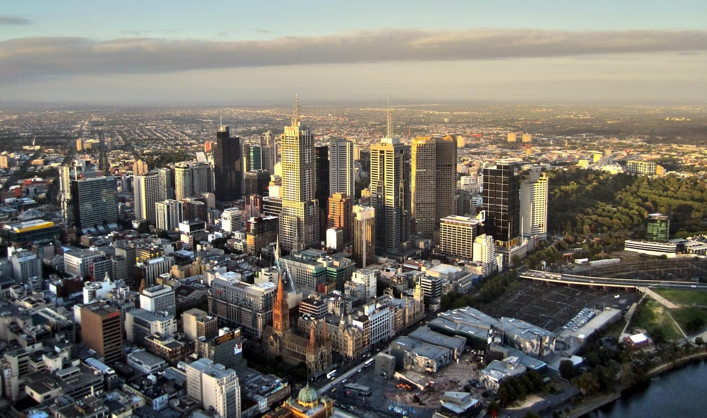
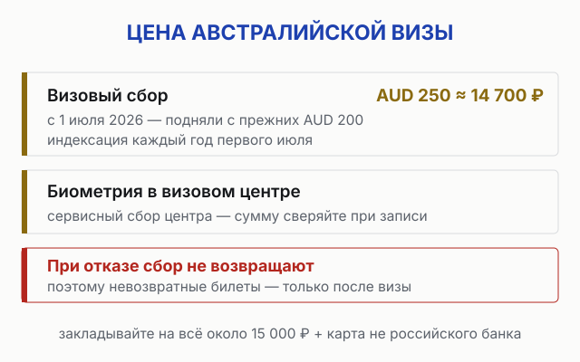
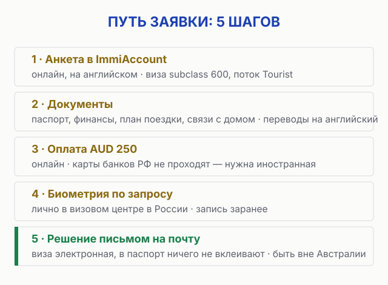
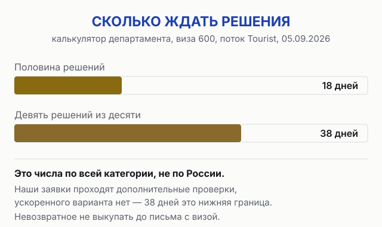

import AffiliateNote from '../../components/post/AffiliateNote.astro';
import { airaloSub, aviasalesRoute, cherehapaTravel } from '../../data/affiliate.js';

Австралийская виза для россиян — это марафон, а не спринт: заявка уходит онлайн за вечер, а решение потом зреет месяцами. И в этом году марафон подорожал: с 1 июля сбор подняли с AUD 200 до AUD 250 (≈11 800 и 14 800 ₽ по курсу ЦБ на 14.08.2026), но половина русскоязычных разборов до сих пор пишет старую цифру. Я сверил условия с живой страницей Департамента внутренних дел Австралии и визового центра 12 августа 2026 — ниже актуальное состояние: сколько стоит, как подавать, где сдавать биометрию и почему не стоит выкупать билеты заранее.

> **Если коротко:** россиянам нужна **гостевая виза subclass 600 (поток Tourist)** — безвиза и электронных разрешений для нашего паспорта нет. Сбор **AUD 250 ≈ 14 900 ₽** (подняли с 1 июля 2026), подача **онлайн через ImmiAccount**, после подачи — **биометрия в визовом центре** в России. По калькулятору департамента на **5 сентября 2026 года** половина решений по этой визе выходит за **18 дней**, девять из десяти — за **38**. Это числа по всей категории, а не по России: наши заявки проходят дополнительные проверки, поэтому 38 дней считайте нижней границей. Подаваться стоит минимум за два месяца, невозвратные билеты до решения не выкупать. Дают 3, 6 или 12 месяцев пребывания. Полис прикладывают к пакету документов — без него заявку не примут: <a href={cherehapaTravel('australia_visa_2026_tldr')} class="aff-cta" rel="sponsored">подобрать страховку под даты визы</a>. А когда виза на руках, перелёт ищется со стыковкой через Эмираты или Катар: <a href={aviasalesRoute('MOW','SYD','australia_visa_2026')} class="aff-cta" rel="sponsored">Найти билет Москва — Сидней от 38 000 ₽</a> — сравнивает все варианты стыковок сразу (ориентир цены — август 2026). 

<AffiliateNote />

---

## Нужна ли виза в Австралию россиянам в 2026 году?

**Да, и лёгких путей нет.** Безвизового въезда для граждан России не существует, а электронные разрешения ETA и eVisitor, которыми пользуются европейцы и азиаты, недоступны для российского паспорта. Единственный рабочий вариант для туризма — **гостевая виза subclass 600, поток Tourist** ([страница визы на сайте Департамента внутренних дел](https://immi.homeaffairs.gov.au/visas/getting-a-visa/visa-listing/visitor-600/tourist-stream-overseas), сверял 12.08.2026).

Хорошая новость: процесс полностью электронный. Анкета подаётся онлайн, виза приходит письмом, в паспорт ничего не вклеивают. Плохая: для россиян нет ускоренного рассмотрения, а заявки проходят дополнительные проверки — отсюда и сроки в месяцы.

## Сколько стоит виза в Австралию в 2026 году?

**Базовый сбор — от AUD 250, это около 14 900 ₽** по курсу ЦБ на 15 августа 2026 (59,76 ₽ за австралийский доллар). Департамент пишет именно «от»: с 1 июля 2026 года у части заявителей — граждан тихоокеанских государств и Восточного Тимора — цена ниже, россиян это не касается. **С 1 июля 2026 сбор подняли** — Австралия индексирует визовые цены каждый год именно первого июля, поэтому статьи, обещающие «около 200», устарели ровно на одну индексацию.

К сбору добавятся расходы на биометрию: за визит в визовый центр берут сервисный сбор (сумма своя у каждого центра — сверяйте при записи). Сбор за визу при отказе не возвращается.

## Как оформить визу в Австралию: пошагово

Вся подача живёт в **ImmiAccount** — личном кабинете на сайте Департамента. Визовые агентства ничего волшебного к этому не добавляют: они заполняют ту же анкету за вашу же плату.

1. **Создаёте ImmiAccount** и заполняете анкету потока Tourist на английском.
2. **Прикладываете документы** — о них ниже.
3. **Платите AUD 250** онлайн. Карты российских банков не проходят — нужна карта иностранного банка; это та же боль, что с [оплатой чего угодно за границей](/blog/pay-abroad-2026/).
4. **Сдаёте биометрию** по запросу — в визовом центре в России.
5. **Ждёте решение.** Быть нужно **вне Австралии** и в момент подачи, и в момент выдачи визы.

## Какие документы нужны на визу в Австралию

Формальный список короткий, но офицер оценивает не бумажки, а картину: турист ли перед ним и вернётся ли он домой.

* **Загранпаспорт** со сроком действия от 6 месяцев;
* **подтверждение финансов** — выписка со счёта, достаточная на перелёт и проживание;
* **план поездки** — брони жилья **с бесплатной отменой** или маршрут; невозвратные билеты покупать не нужно;
* **связи с домом** — работа, учёба, семья, имущество: всё, что показывает намерение вернуться;
* **переводы на английский** для документов на русском.

Самое частое основание для отказа гостевых виз — офицер не поверил, что заявитель приедет как турист и уедет вовремя. Поэтому справка с работы с датами отпуска работает лучше, чем большая сумма на счёте без объяснений.

## Где и как сдавать биометрию в России?

После подачи заявки приходит письмо с запросом биометрических данных — отпечатков и фото. Сдаются они лично в **визовых центрах VFS Global** — это официальный партнёр Департамента внутренних дел Австралии в России: на их сайте запись на приём, список центров и текущий сервисный сбор ([раздел Австралии у VFS](https://visa.vfsglobal.com/rus/ru/aus/)).

Практическая деталь: запись не мгновенная, а слоты в сезон и перед праздниками расходятся быстро — закладывайте на этот шаг неделю-другую, он входит в общий срок рассмотрения.

## Сколько ждать решения и когда подаваться?

Департамент публикует сроки числом — в калькуляторе, куда вводят тип визы, поток и дату подачи. Мы открыли его 5 сентября 2026 года по гостевой визе subclass 600, поток Tourist: **половина решений за 18 дней, девять из десяти за 38** (страница калькулятора обновлена 4 сентября 2026). ⚠️ Это глобальные числа по категории, а не срез по России. Наши заявки проходят дополнительные проверки, ускоренной опции не существует, и отчёты российских заявителей бывают длиннее — поэтому 38 дней это нижняя граница планирования, а не обещание.

Что из этого следует:

* **подавайтесь минимум за два месяца** до планируемого вылета: девять решений из десяти выходят за 38 дней, а запас нужен под дополнительные проверки, которых по России калькулятор не показывает;
* **не выкупайте невозвратные билеты и жильё** до получения визы — сбор при отказе не вернут, билеты тем более;
* **дата подходит, а решения нет** — двигайте поездку, а не летите «на авось»: посадка без визы не состоится;
* виза даёт пребывание **3, 6 или 12 месяцев** — конкретный срок решает офицер, просить дольше трёх месяцев стоит только с внятным обоснованием в анкете.

## Чем платить визовый сбор из России?

Оплата идёт онлайн в ImmiAccount, и **карты российских банков не проходят**. Рабочие варианты те же, что с любой зарубежной онлайн-оплатой: карта банка Казахстана, Армении, Грузии или ОАЭ, виртуальная карта иностранного сервиса, помощь друзей с зарубежной картой.

Продумайте это до начала анкеты: заявка без оплаты никуда не уходит, а курс и комиссии съедают ещё пару процентов сверху — закладывайте на сбор около 15 000 ₽ с запасом.

## Что после визы: страховка и связь

Страховка для гостевой визы формально не обязательна, но австралийская медицина для иностранца — одна из самых дорогих в мире: приём врача от AUD 80–100, день в госпитале — тысячи. На поездку в несколько недель полис стоит несопоставимо меньше возможного счёта: <a href={cherehapaTravel('australia_visa_2026')} class="aff-cta" rel="sponsored">Сравнить страховки в Австралию от 600 ₽</a> — оплата картой РФ, полис в PDF.

Со связью проще решить до вылета: местные сим-карты продаются по паспорту, а тарифы аэропорта кусаются. <a href={airaloSub('australia_visa_2026')} class="aff-cta" rel="sponsored">Оформить eSIM для Австралии</a> — ставится дома, включается по прилёте.

## FAQ

**Сколько стоит виза в Австралию для россиян?**
Базовый сбор — AUD 250 (≈14 900 ₽) с 1 июля 2026 года; до этого было AUD 200. Плюс сервисный сбор визового центра за биометрию. При отказе визовый сбор не возвращается.

**Сколько делается виза в Австралию?**
Срок департамент называет числом в калькуляторе: 18 дней у половины заявок и 38 у девяноста процентов (проверено 5 сентября 2026 года). Это по всей категории, не по России — у нас дополнительные проверки и нет ускоренного варианта. Подавайтесь минимум за два месяца до поездки, а лучше раньше.

**Можно ли подать на австралийскую визу без визового центра?**
Анкета подаётся полностью онлайн через ImmiAccount, визовый центр нужен только для одного шага — сдачи биометрии по запросу. Платные «помощники» заполняют ту же самую анкету.

**Дают ли австралийскую визу с чистым паспортом?**
Дают, но история поездок помогает: офицер оценивает, вернётесь ли вы. Сильная заявка с чистым паспортом — это внятный маршрут, финансы и явные связи с домом: работа, семья, имущество.

**Нужно ли выкупать билеты до подачи?**
Нет, и не стоит: до решения хватит плана поездки. Невозвратные билеты и жильё безопасно покупать только после письма с визой.

**Виза в Австралию — это штамп в паспорте?**
Нет, виза электронная: приходит письмом о выдаче, в паспорт ничего не вклеивают. Авиакомпания и граница видят её по номеру паспорта.

---

## Что почитать дальше

- [Австралия 2026: маршрут, цены, сезоны](/blog/australia-guide-2026/) — страна целиком: перелёт, бюджет, когда лететь
- [Лучшие города мира для молодых](/blog/luchshie-goroda-dlya-molodyh-2026/) — Мельбурн в тройке победителей
- [Как платить за границей россиянам 2026](/blog/pay-abroad-2026/) — карты, наличные, обходные пути
- [Виза в Японию 2026](/blog/japan-visa-2026/) — соседний сложный визовый разбор той же серии

---

*Материал носит справочный характер. Визовые правила меняются — перед подачей сверяйте условия на [странице визы subclass 600](https://immi.homeaffairs.gov.au/visas/getting-a-visa/visa-listing/visitor-600/tourist-stream-overseas) и [сайте визового центра](https://visa.vfsglobal.com/rus/ru/aus/). Сбор и порядок подачи проверял по первоисточникам 12 августа 2026. Нашли неточность — напишите в [Telegram-канал @traveltriberu](https://t.me/traveltriberu), обновлю.*

*Фото Мельбурна — moerschy / [Pixabay](https://pixabay.com/photos/melbourne-skyline-skyscrapers-595426/), лицензия Pixabay. Схемы наши.*
