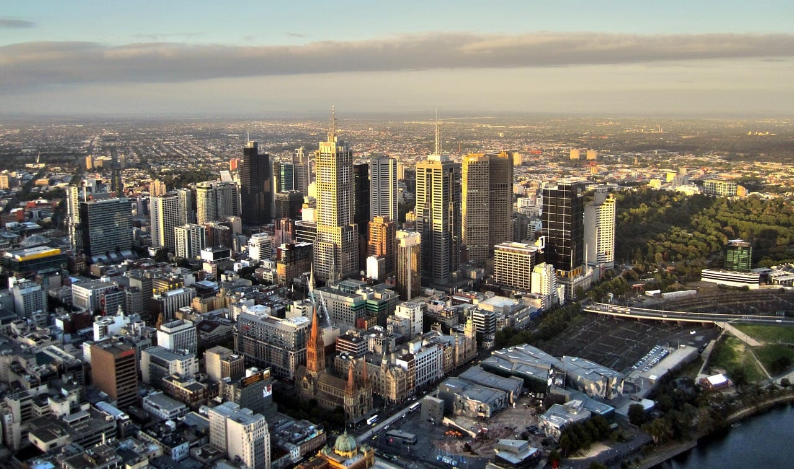
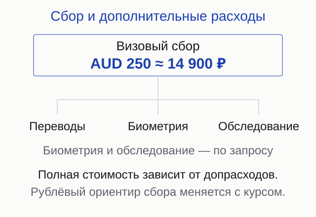
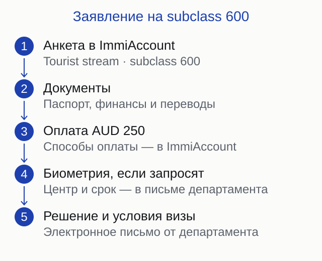
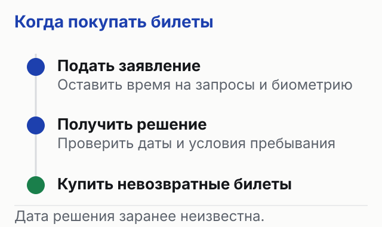

import AffiliateNote from '../../components/post/AffiliateNote.astro';
import { aviasalesRoute, cherehapaTravel } from '../../data/affiliate.js';

**Для туристической поездки в Австралию россиянам нужна гостевая виза subclass 600, поток Tourist.** Заявление подают онлайн через ImmiAccount, находясь за пределами Австралии. Базовый сбор — **AUD 250** без банковских комиссий.

До решения оставьте поездку без невозвратных покупок. Если департамент запросит биометрию или дополнительные документы, следуйте инструкции в письме. Срок разрешённого пребывания станет известен после выдачи визы: обычно это три месяца, в отдельных случаях — до двенадцати.

Страховку стоит выбрать для самой поездки: <a href={cherehapaTravel('australia_visa_2026_tldr')} class="aff-cta" rel="sponsored">сравнить полисы для Австралии</a>. Обязательность полиса зависит от условий конкретной визы. Когда решение получено, можно <a href={aviasalesRoute('MOW','SYD','australia_visa_2026')} class="aff-cta" rel="sponsored">подобрать перелёт Москва — Сидней</a> на свои даты.

## Нужна ли виза в Австралию россиянам в 2026 году?

Для российского паспорта туристическая поездка оформляется через **subclass 600, Tourist stream**. ETA и eVisitor доступны владельцам других паспортов из установленных списков. Заявитель этого потока должен находиться вне Австралии и при подаче, и в момент решения.

Анкета и документы подаются через личный кабинет. Виза привязывается к паспорту в электронной системе; вклейку получать не нужно. По ней нельзя работать, а учёба допускается на срок до трёх месяцев. Если цель поездки — работа или длительная учёба, выбирайте соответствующий тип визы до заполнения анкеты.

## Сколько стоит виза в Австралию в 2026 году?

**Базовый сбор — AUD 250.** Сумма взимается с каждого заявителя отдельно. Для некоторых граждан тихоокеанских стран и Восточного Тимора действует льготная цена; российский паспорт в этот список не входит.

Кроме сбора могут понадобиться переводы, медицинское обследование и биометрия. У каждой услуги своя цена. Перед оплатой проверьте итог в ImmiAccount, курс конвертации и комиссию банка. При отказе визовый сбор обычно не возвращается.

## Как оформить визу в Австралию: пошагово

1. **Создайте ImmiAccount** и выберите Visitor visa, subclass 600, Tourist stream для подачи за пределами Австралии.
2. **Заполните анкету на английском.** Даты поездки, работа, семья и средства на путешествие должны согласовываться с приложенными документами.
3. **Загрузите документы** вместе с переводами. Для семьи заявления оформляются отдельно на каждого человека, включая детей.
4. **Оплатите сбор.** Департамент начнёт обработку после оплаты. Заранее проверьте, какой доступный вам способ платежа поддерживает кабинет.
5. **Проверьте сообщения.** Если придёт запрос на биометрию, обследование или дополнительные сведения, выполните его в указанный срок.
6. **Дождитесь решения.** Сохраните письмо с номером визы, сроками въезда и пребывания, а также её условиями.

Посредник может помочь подготовить заявление, но решение принимает департамент. Если нанимаете помощника, выясните его полномочия и состав услуги до оплаты.

## Какие документы нужны на визу в Австралию

Основная задача — показать цель поездки, средства на неё и причины вернуться домой. Подготовьте:

* **Действующий загранпаспорт:** страницы с фотографией, персональными данными и датами выдачи и окончания срока.
* **Подтверждение финансов:** выписки и документы о доходах, которые объясняют, откуда взялись деньги на поездку.
* **План путешествия:** города, даты и предполагаемое жильё. Невозвратные билеты для этого покупать не стоит.
* **Связи с домом:** работу, учёбу, семью или имущество — то, что относится к вашей ситуации и подтверждается документами.
* **Переводы на английский:** вместе с оригиналами документов на русском.

Для приглашения от родственников или друзей укажите, кто приглашает, на какой срок и где вы будете жить. Если расходы оплачивает принимающая сторона, нужны сведения о её средствах. При самостоятельной поездке объясните собственный маршрут и бюджет.

Проверяйте читаемость сканов и совпадение имён, дат и номеров паспорта. Если документ занимает несколько страниц, объедините их в один файл. Условия транзитных стран и авиакомпании по сроку действия паспорта проверьте отдельно.

## Где и как сдавать биометрию?

Биометрию сдают **по запросу департамента**. В письме будут дальнейшие действия и срок. Открывайте запись по указанной там инструкции: доступные центры, способ идентификации и стоимость обслуживания могут меняться.

Не оплачивайте услугу по старому адресу из чужого отчёта. Сначала убедитесь, что центр и порядок записи соответствуют вашему запросу. Время на запись, дорогу и выполнение запроса заложите в план поездки.

## Сколько ждать решения и когда подаваться?

**Срок конкретной заявки заранее неизвестен.** Калькулятор Home Affairs показывает, как быстро принимались недавние решения по категории. Он помогает оценить разброс, но не задаёт крайний срок для вашей анкеты и не выделяет российские заявки.

Если до вылета остаётся два месяца, подавайте документы сейчас; при возможности оставьте больший запас. Это совет для планирования, а решение может прийти раньше или позже. Запрос дополнительных сведений, биометрии или обследования добавляет отдельный этап.

До получения визы выбирайте жильё с подходящими условиями отмены. Если дата вылета приближается, а решения нет, проверьте условия переноса брони. Письмо о выдаче читайте целиком: срок действия визы, число въездов и разрешённая длительность одного пребывания — разные условия.

## Чем платить визовый сбор из России?

Оплата проходит в ImmiAccount. **Российская карта может не подойти для международного платежа**, поэтому заранее проверьте доступные в кабинете способы и возможности своего банка. Если используете иностранную карту, уточните ограничения на зарубежные операции и конвертацию.

До списания сверьте сумму, валюту и получателя. После платежа сохраните подтверждение и проверьте статус заявления. Итоговое списание зависит от курса и комиссии банка. О других вариантах расчётов за рубежом — в [разборе оплаты в поездках](/blog/pay-abroad-2026/).

## Когда нужна страховка для Австралии?

**Для Tourist stream страховка не является общим условием принятия любого заявления.** Если в вашу визу включено **условие 8501**, поддерживать подходящее медицинское покрытие во время пребывания обязательно. Посмотрите условия в письме о выдаче или в VEVO; по отдельному запросу департамента могут понадобиться доказательства покрытия.

Без такого условия полис остаётся разумной защитой от расходов на лечение. Большинство иностранных посетителей оплачивают медицинскую помощь сами. При выборе проверьте лимит, франшизу, исключения для хронических болезней и покрытие занятий, которые планируете: <a href={cherehapaTravel('australia_visa_2026')} class="aff-cta" rel="sponsored">сравнить страховки для поездки в Австралию</a>. Если назначено 8501, подтвердите у страховщика соответствие полиса этому условию до покупки.

Раньше во вступлении полис был ошибочно назван обязательным для принятия заявки. Это исправлено: требование зависит от условий вашей визы.

## Вопросы перед подачей

**Можно ли включить ребёнка в заявление родителя?**
Для каждого члена семьи оформляется отдельное заявление, включая детей. Связанные семейные заявления можно подавать вместе через кабинет.

**Дадут ли визу с чистым паспортом?**
Отсутствие предыдущих поездок само по себе не заменяет оценку заявки. Подтвердите цель путешествия, средства и обстоятельства возвращения; обещать выдачу по одному признаку нельзя.

**Где смотреть срок пребывания?**
В письме о выдаче и VEVO. Обычно туристический поток даёт три месяца; более долгий срок назначается индивидуально. Срок действия визы не равен длительности каждого визита.

## Что почитать дальше

- [Австралия: маршрут, цены и сезоны](/blog/australia-guide-2026/) — спланировать поездку после визы.
- [Мельбурн и другие города для поездки](/blog/luchshie-goroda-dlya-molodyh-2026/) — выбрать остановки.
- [Оплата за границей для россиян](/blog/pay-abroad-2026/) — разобраться с картами и наличными.
- [Виза в Японию](/blog/japan-visa-2026/) — если сравниваете направления.

---

*Материал носит справочный характер. Визовые правила меняются — перед подачей сверяйте условия на [странице визы subclass 600](https://immi.homeaffairs.gov.au/visas/getting-a-visa/visa-listing/visitor-600/tourist-stream-overseas) и [сайте визового центра](https://visa.vfsglobal.com/rus/ru/aus/). Нашли неточность — напишите в [Telegram-канал @traveltriberu](https://t.me/traveltriberu), обновлю.*
