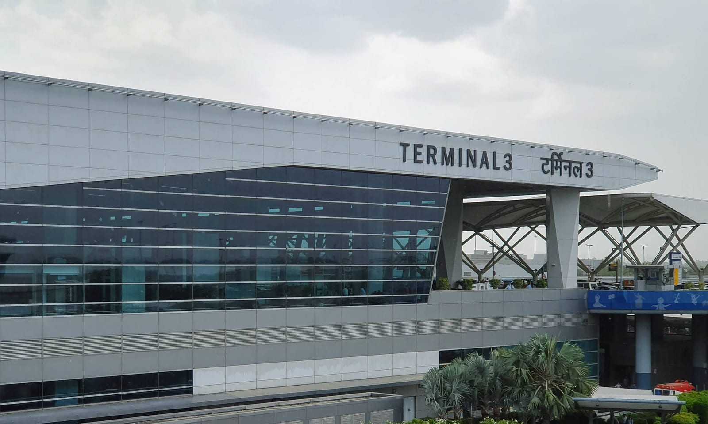
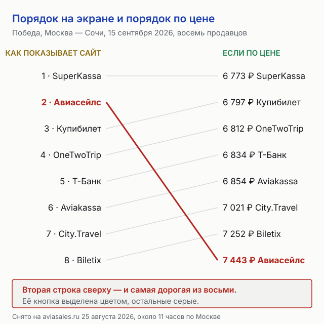
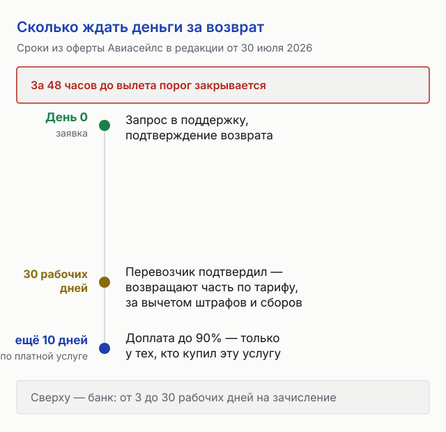
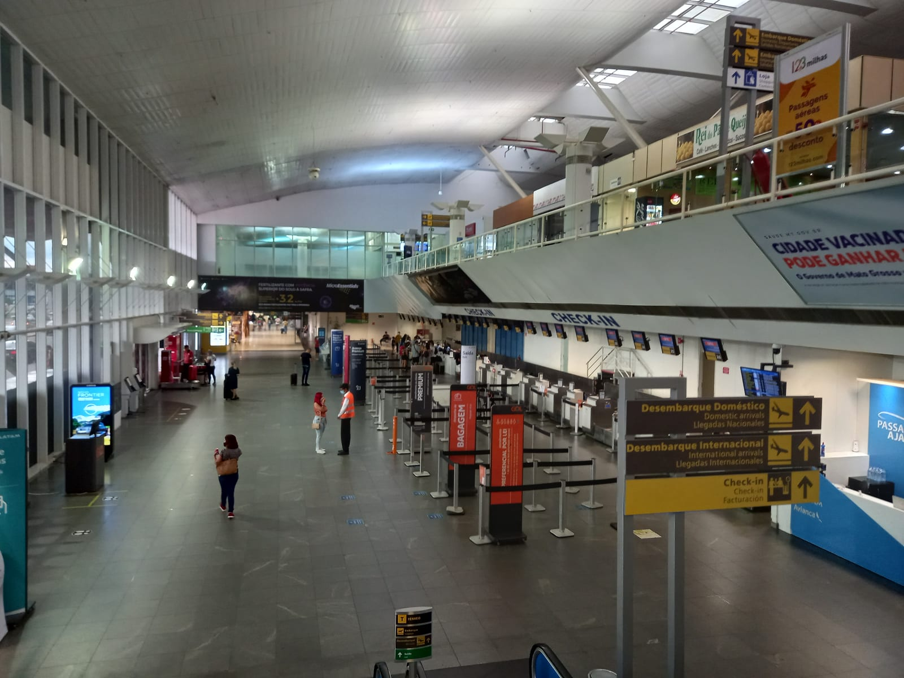

import AffiliateNote from '../../components/post/AffiliateNote.astro';
import { aviasalesRoute } from '../../data/affiliate.js';

Авиасейлс принято описывать как витрину: ищет по чужим сайтам, сам ничего не продаёт. Его собственная справка говорит иначе — купить билет можно **у агентства, у авиакомпании или напрямую у Авиасейлса**, и от того, кто из троих оказался продавцом, зависит цена и то, к кому идти за деньгами при отказе.

Разница измерима. На рейсе Победы Москва — Сочи 15 сентября 2026 года, снятом 25 августа около 11 часов по Москве, восемь продавцов просили за одно и то же место от **6 773 ₽ до 7 443 ₽**. Дороже всех — предложение самого Авиасейлса, и его кнопка стояла второй сверху, выделенная цветом.

<AffiliateNote />

## Кто продаёт билет на Авиасейлсе

В карточке рейса три типа продавцов, и они отвечают за разное.

- **Агентство** — Купибилет, OneTwoTrip, Biletix, SuperKassa и другие. Договор перевозки заключается с авиакомпанией, а деньги принимает агентство, и оно же оформляет возврат.
- **Авиакомпания напрямую** — цена обычно выше, зато посредника между вами и перевозчиком нет.
- **Авиасейлс** — с недавних пор полноценный продавец: свой шаг оформления, своя оплата, своя оферта.

Узнать продавца до покупки можно по подписи рядом с ценой. После покупки — по названию в письме с билетом и в справке об операции из банка; билеты самого сервиса помечены его логотипом наверху маршрутной квитанции.

Практический смысл у этого один. Пункт 6.3 оферты говорит прямо: если деньги принимало третье лицо без участия Авиасейлса, послепродажным обслуживанием занимается сам поставщик или его агент, а Авиасейлс **может помочь с перепиской, но не обязан**. Билет агентства меняет и возвращает агентство, по своим правилам и в свои сроки.

## Один рейс, восемь продавцов: разница 670 ₽

Замер сделан вручную 25 августа 2026 года: Москва — Сочи, 15 сентября, один пассажир, рейс Победы из Шереметьева в 22:50. Карточка развёрнута кнопкой «Ещё предложения», выписаны все продавцы.

| Продавец | Цена | Разница с самым дешёвым |
|---|---|---|
| SuperKassa | **6 773 ₽** | — |
| Купибилет | 6 797 ₽ | +24 ₽ |
| OneTwoTrip | 6 812 ₽ | +39 ₽ |
| Т-Банк | 6 834 ₽ | +61 ₽ |
| Aviakassa | 6 854 ₽ | +81 ₽ |
| City.Travel | 7 021 ₽ | +248 ₽ |
| Biletix | 7 252 ₽ | +479 ₽ |
| **Авиасейлс** | **7 443 ₽** | **+670 ₽** |

Пять продавцов уложились в 81 ₽ друг от друга — на этом отрезке выбор не решает ничего. Разрыв начинается дальше: последние три дороже первого на 248, 479 и 670 ₽, то есть от 3,7 до 9,9% цены билета.

Второй рейс того же дня — Utair из Внукова в 09:25 — дал другую картину: девять продавцов от 8 848 ₽ до 9 572 ₽, и предложение Авиасейлса за 8 927 ₽ оказалось вторым по дешевизне. Сама авиакомпания просила 9 520 ₽ — дороже семи из восьми остальных продавцов.

Вывод из двух замеров осторожный и от этого полезный: **цена Авиасейлса как продавца ходит и вверх, и вниз относительно агентств**, а вот место его кнопки в списке не менялось.

## Почему кнопка Авиасейлса стоит второй, даже когда дороже всех

В обеих карточках список продавцов отсортирован не по цене. Сверху шёл самый дешёвый, вторым — предложение Авиасейлса с выделенной оранжевой кнопкой, третьим на первом рейсе стояла авиакомпания за 9 520 ₽, хотя пять агентств под ней были дешевле.

Читателю это стоит денег ровно в одном месте: **глаз цепляется за выделенную кнопку, а не за первую строку**. На рейсе Победы разница между ними — 670 ₽, десятая часть билета.

Здесь стоит назвать вещи своими именами. Этот блог зарабатывает на переходах в Авиасейлс, то есть у нас есть коммерческий интерес в том, чтобы вы туда пошли. Он не отменяет замера: раскрывайте полный список продавцов и сравнивайте цены строками, а не кнопками.

<a href={aviasalesRoute('MOW', 'AER', 'aviasales_2026_hub')} class="aff-cta" rel="sponsored">Посмотреть билеты Москва — Сочи от 6 773 ₽</a> — в выдаче видно название продавца рядом с ценой, а кнопка «Ещё предложения» раскрывает всех продавцов рейса; у билетов самого сервиса оплата идёт картой российского банка в рублях.

## Что показывает шаг оформления

Цена в карточке и сумма на шаге оформления совпали. При переходе по кнопке Авиасейлса на том рейсе Utair открылась страница со сводкой: билеты 8 600 ₽, налоги и сборы 327 ₽, итого 8 927 ₽ — ровно столько, сколько обещала карточка. Скрытой наценки между поиском и бронированием на этом шаге нет.

Дальше начинается место, куда без паспортных данных не заглянуть, и врать про него не буду. По пункту 8.2 оферты **плата за сопровождение заказа не входит в стоимость бронирования у поставщика и оплачивается отдельно**; её размер, сказано там же, «формируется с учётом множества переменных», а полную сумму показывают до оплаты. Что именно она добавляет к 8 927 ₽ на этом рейсе, проверить не удалось: шаг оплаты открывается после заполнения данных пассажира.

Что за эту плату делают, оферта перечисляет в пункте 5.1: следят за своевременной выпиской билета, проверяют бронирование в системах поставщиков до выписки, при необходимости выписывают билет руками и консультируют по почте. Одна деталь важна на будущее: **эта плата не возвращается ни при каком отказе от перевозки** — она считается оказанной услугой, отдельной от полёта.

## Сколько стоит передумать: сборы Авиасейлса за возврат и обмен

Самая закрытая часть темы. Прайс лежит в разделе 4 оферты и в обзорах сервиса не встречается.

| Что делаем | Сколько берёт Авиасейлс |
|---|---|
| Добровольный отказ от перевозки (возврат) | **2 299 ₽** за пассажира, но не меньше 4,9% от заказа |
| Добровольный обмен билета | 2 299 ₽ за пассажира, но не меньше 4,9% от заказа |
| Изменения без обмена билета | 699 ₽ за пассажира |
| Аннуляция билета | 599 ₽, но не меньше 1,9% от заказа за пассажира |
| Обращение меньше чем за сутки до вылета | стоимость услуги **удваивается** |

Числа стоит примерить к своей поездке. На билете за 6 773 ₽ сбор за отказ съедает 2 299 ₽ — треть цены, и это ещё до штрафа авиакомпании по правилам тарифа. За сутки до вылета получится 4 598 ₽, две трети билета.

Правило «не меньше процента» работает в другую сторону на дорогих заказах: при заказе на 100 000 ₽ отказ обойдётся в 4 900 ₽, а не в 2 299 ₽.

И отдельно к сборам сервиса добавляется то, что удерживает перевозчик. Справка Авиасейлса называет четыре вычета при добровольном возврате: штраф авиакомпании за отказ от места, сервисный сбор агентства, использованная часть билета и изредка сбор за перевод.

## Сколько ждать деньги

Сроки в оферте длинные. Общее правило: деньги за вычетом штрафов и сборов возвращают **в течение 30 рабочих дней с даты подтверждения возврата перевозчиком**. Второй этап есть только у тех, кто купил платную услугу возврата: там оферта обещает первую часть по правилам тарифа в срок до 30 дней после согласования с поставщиком и доплату до 90% в следующие 10 дней.

Сверху ложится банк: справка сервиса называет **от 3 до 30 рабочих дней** на зачисление и честно говорит, что ускорить это нельзя. Разница между покупкой у авиакомпании и у посредника здесь принципиальная: у перевозчика деньги идут сразу вам, у агентства сначала возвращаются продавцу и только потом вам.

## «Возврат без потерь»: что покупает эта опция и где её граница

В карточке рейса встречается переключатель «Обмен или возврат» с ценой. На рейсе Победы он стоил 24 ₽, на рейсе Utair — 3 152 ₽; разброс объясняется правилами тарифа, поверх которого опция продаётся.

По оферте услуга называется «Возврат без потерь» или «Возврат 90%» и возвращает 90% стоимости билета без учёта других услуг, за вычетом налогов, сборов, банковских комиссий и предоставленных скидок. Границы у неё жёсткие:

- **Не работает, если обратиться позже чем за 48 часов до вылета** — и её нельзя купить на рейс, который стартует раньше чем через 48 часов после покупки.
- Не работает на использованные билеты и на возврат части сегментов или части пассажиров.
- Не действует при банкротстве перевозчика, войне, стихийном бедствии, карантине, забастовке и подобных обстоятельствах — при них и плата за саму услугу не возвращается.
- Не работает при обмене билета: штрафы и сборы за обмен не возмещаются.
- Плата за услугу не возвращается, если ею не воспользовались.

За 24 ₽ на дешёвом билете это разумная страховка. За 3 152 ₽ на билете в 8 927 ₽ решение неочевидно: опция вернёт 90% цены, но лишь при отказе раньше чем за двое суток.

## Кто такой Авиасейлс юридически и почему у вас нет кассового чека

Стороной оферты выступает **Go Travel Un Limited** — компания, зарегистрированная в Гонконге 18 августа 2011 года под номером 1658681, с офисом на Таймс-сквер в районе Козуэй-Бей. Правоотношения с пользователем, по пункту 11.3, регулируются **правом Гонконга**. Для писем в оферте указан адрес в Москве: 127055, а/я 80, получатель — ООО «Гоу Трэвел Рус».

Отсюда следует бытовая вещь, о которой мало кто знает. По пункту 8.8 **Авиасейлс не выдаёт электронные кассовые чеки**, потому что российское требование о кассе на гонконгскую компанию не распространяется. Вместо чека приходят электронный билет и квитанция об оплате.

У этого есть полезный побочный эффект: **чек работает как индикатор**. Пришёл чек на какую-то из услуг заказа — её поставщик российское юрлицо. Чека нет — поставщик иностранный. Для командировочного отчёта это разница между «сдал документы» и «объясняюсь с бухгалтерией».

Ещё один признак живого сервиса, а не заброшенного: у оферты восемь редакций с декабря 2023 года, семь прежних лежат в архиве, действующая вступила в силу 30 июля 2026 года. Условия, по которым вы покупали билет год назад, к сегодняшнему дню другие.

## Кому Авиасейлс не подходит

Честный список, каждый пункт которого следует из документов сервиса, а не из отзывов.

- **Тем, кто берёт первое выделенное предложение.** Кнопка Авиасейлса стоит второй независимо от цены; на замеренном рейсе это стоило 670 ₽.
- **Тем, кому нужен кассовый чек от продавца.** У билетов самого сервиса его не будет.
- **Тем, кто часто меняет планы.** Сбор за отказ 2 299 ₽ за пассажира делает дешёвый билет невозвратным по смыслу, а не по тарифу.
- **Тем, кто решает в последние сутки.** Стоимость услуг удваивается, а страховка «Возврат 90%» закрывается за 48 часов до вылета.
- **Тем, кто рассчитывает на единое окно поддержки.** Билет агентства обслуживает агентство; Авиасейлс помогает по своему усмотрению, а не по обязанности.
- **Тем, кто планирует спорить в российском суде.** Оферта прямо отсылает к праву Гонконга.

Если совпало два пункта и больше — покупка напрямую у авиакомпании спокойнее, даже когда билет дороже. На замеренном рейсе Utair переплата за такой покой составила 672 ₽ против самого дешёвого агентства.

## Как купить билет и не потерять деньги: порядок

1. В карточке рейса нажмите «Ещё предложения» и раскройте **весь** список продавцов, а не три верхних.
2. Отсортируйте глазами по цене — список выдаётся в другом порядке.
3. Посмотрите на подпись под ценой: агентство, авиакомпания или Авиасейлс. От этого зависит, кто будет возвращать деньги.
4. Проверьте в условиях тарифа две строки: возвратный билет или нет и платный ли обмен.
5. Решите про опцию возврата до оплаты — после покупки её не добавить, а порог в 48 часов отсчитывается от вылета.
6. Сверьте итог на шаге оформления с ценой в карточке.
7. Сохраните письмо с билетом: название продавца из него понадобится при любом обращении.

<a href={aviasalesRoute('MOW', 'AER', 'aviasales_2026_final')} class="aff-cta" rel="sponsored">Сравнить всех продавцов рейса перед покупкой</a> — цены обновляются в момент запроса, название продавца видно до перехода на оплату, у билетов самого сервиса принимают карту российского банка и СБП.

Как считать остальную часть бюджета поездки, разобрано в статье о том, [сколько стоит неделя в России](/blog/skolko-stoit-nedelya-v-rossii-2026/), деньги на стороне жилья — в разборе того, [что Суточно.ру берёт за бронь](/blog/sutochno-ru-2026/), а на стороне поезда — в замере того, [сколько Туту.ру берёт сверх цены РЖД](/blog/tutu-ru-2026/). Если билет покупается не отдельно, а внутри пакетного тура, счёт другой: сколько перелёт стоит внутри путёвки, посчитано в разборе того, [как работает Травелата и что входит в цену тура](/blog/travelata-2026/).

## FAQ — частые вопросы про Авиасейлс

**Продаёт ли Авиасейлс билеты сам?**
Да. По справке сервиса купить билет можно у агентства, у авиакомпании или напрямую у Авиасейлса. Такие билеты помечены логотипом сервиса наверху маршрутной квитанции, и по ним отвечает его поддержка.

**Берёт ли Авиасейлс комиссию сверх цены билета?**
Цена в карточке и итог на шаге оформления совпали при проверке 25 августа 2026 года: билеты 8 600 ₽ плюс налоги и сборы 327 ₽ равно 8 927 ₽. При этом по пункту 8.2 оферты плата за сопровождение заказа берётся отдельно от стоимости бронирования и показывается до оплаты.

**Сколько стоит вернуть билет, купленный у Авиасейлса?**
Сам сервис берёт 2 299 ₽ за пассажира, но не меньше 4,9% от заказа, и удваивает эту сумму при обращении меньше чем за сутки до вылета. Сверху удерживают штраф авиакомпании по правилам тарифа.

**Кому писать, если с билетом проблема?**
Продавцу, который указан в письме с билетом и в справке об операции из банка. Если платёж принимало третье лицо, послепродажным обслуживанием по оферте занимается поставщик или его агент, а Авиасейлс может помочь с коммуникацией, но не обязан.

**Почему не приходит кассовый чек?**
Стороной оферты выступает гонконгская Go Travel Un Limited, на которую российское требование о применении кассы не распространяется. Приходят электронный билет и квитанция об оплате.

**Дороже ли покупать у Авиасейлса напрямую?**
По-разному. На рейсе Победы 15 сентября его цена была самой высокой из восьми — 7 443 ₽ против 6 773 ₽, на рейсе Utair того же дня второй по дешевизне — 8 927 ₽ против 8 848 ₽. Сравнивать нужно на своём рейсе, раскрыв весь список.

**Что даёт опция «Возврат 90%»?**
Возврат 90% стоимости билета без учёта налогов, сборов, банковских комиссий и скидок. Она не работает при обращении позже чем за 48 часов до вылета, при обмене билета, на использованных билетах и при форс-мажоре вроде банкротства перевозчика.

*Фото: FASTILY, Ravi Dwivedi, Vitorabdala / Wikimedia Commons / [CC BY-SA](https://creativecommons.org/licenses/by-sa/4.0/). Шкала цен и шкала сроков наши. Цены сняты вручную 25 августа 2026 года и меняются в течение дня; условия сервиса — по оферте Авиасейлс в редакции от 30 июля 2026 года. Материал описывает правила сервиса и не заменяет юридическую консультацию.*
