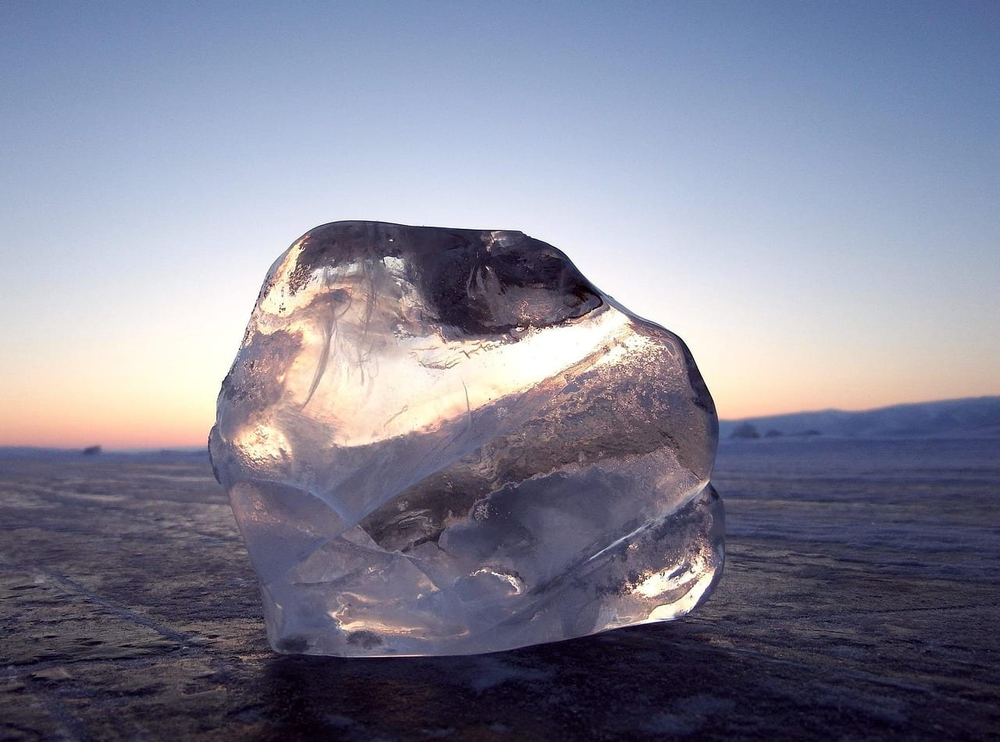
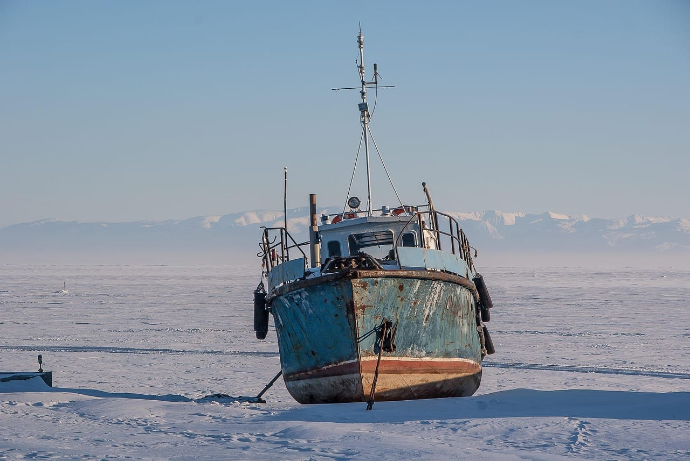
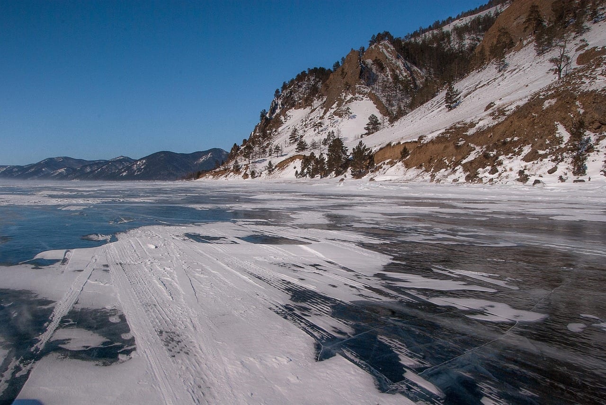
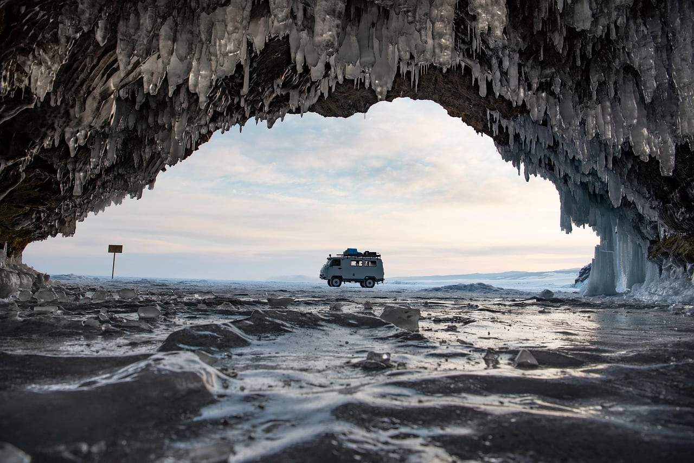
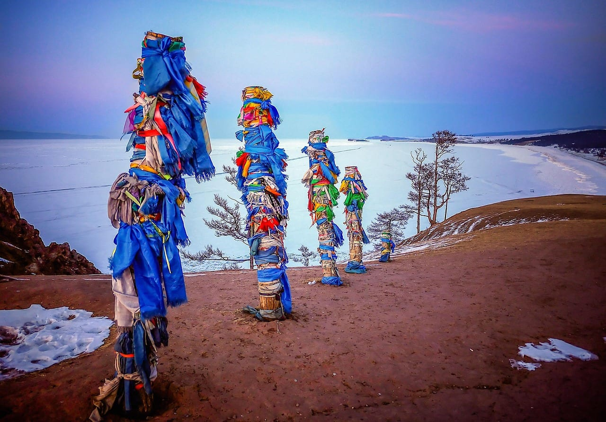
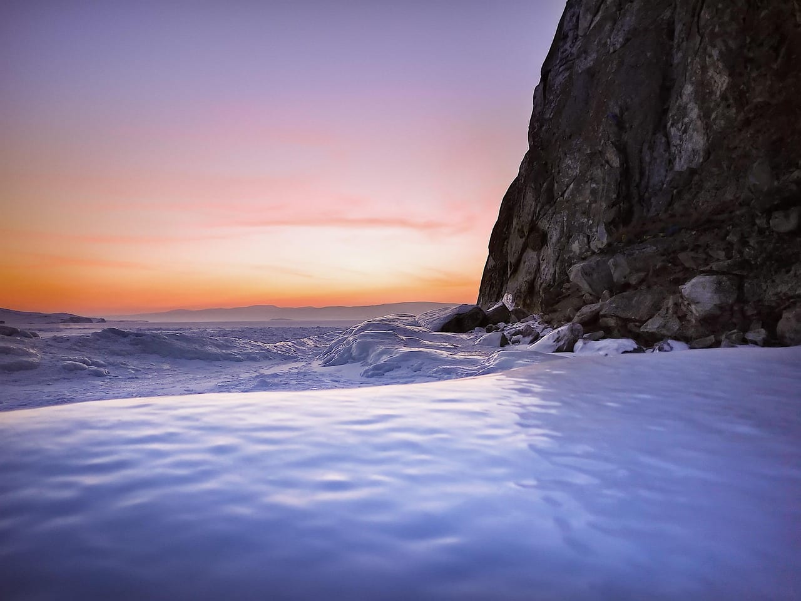
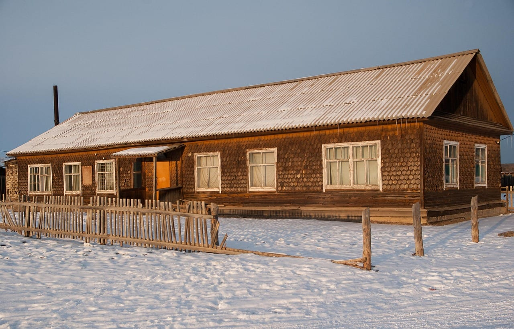
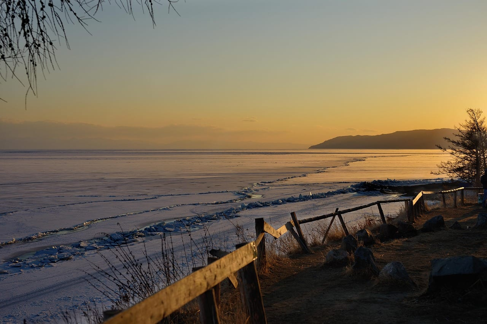
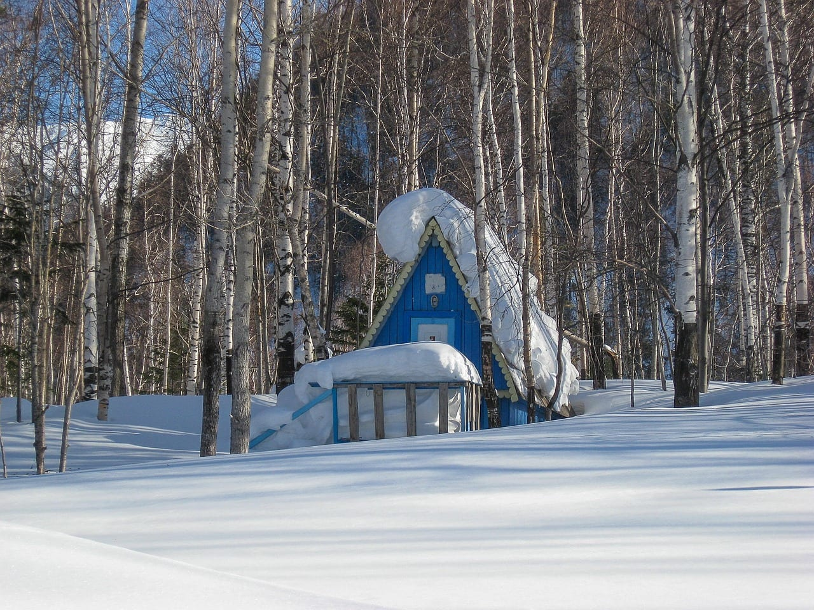

import PricingCards from '../../components/post/PricingCards.astro';
import FlightRoutes from '../../components/post/FlightRoutes.astro';
import AffiliateNote from '../../components/post/AffiliateNote.astro';
import { TP_LINKS, aviasalesRoute, yandexTravelSub, tpkDeep, youtravelSub } from '../../data/affiliate.js';

export const tours = youtravelSub('baikal_zimoy_2027');
export const excursions = tpkDeep('sputnik8', 'https://www.sputnik8.com/ru/baikal', 'baikal_winter');
export const flights = aviasalesRoute('MOW', 'IKT', 'baikal_winter');
export const stay = yandexTravelSub('baikal_winter');

Байкал зимой выглядит так, будто из озера слили воду и оставили стекло. Под ногами метр прозрачного льда, сквозь него видно камни на дне и трещины, уходящие вниз метров на десять. При шаге лёд отзывается звуком, похожим на далёкий выстрел, и звук уходит вдаль под ногами. Это единственное место в России, где можно идти пешком по крыше самого глубокого озера планеты и видеть его насквозь.

> **Если коротко:** ехать за прозрачным льдом нужно **со второй половины февраля до середины марта** — в январе лёд ещё тонкий, в конце марта его ломает. Полный ледостав приходится на **первую половину января**, и юг озера встаёт последним. Главная ловушка: **ледовая переправа на Ольхон в 2026 году работала 26 дней**, с 27 февраля по 24 марта, хотя открыть её планировали 12 февраля. Ледовый сезон — пик цен: жильё в Хужире **8 000–12 000 ₽ в сутки**, самостоятельная поездка на 3–4 дня — **40 000–45 000 ₽** на человека, готовый тур на февраль — **от 32 500 ₽**, разрешение в национальный парк **300 ₽**. Билет Москва — Иркутск в среднем 23 107 ₽. Своя машина на льду не нужна: возят местные на хивусах и УАЗах.

<AffiliateNote />

Зимний Байкал устроен не как курорт, а как экспедиция выходного дня: сюда прилетают на 4–7 дней, живут в двух-трёх точках и каждый день выезжают на лёд с водителем. Дальше — когда именно ехать, чем один февраль отличается от другого, сколько это стоит и что на этом маршруте ломается чаще всего.

Большинство едет сюда организованно, и на то есть причина: по льду без местного водителя не проехать, а маршрут меняется каждый день по ледовой обстановке. <a href={tours} class="aff-cta" rel="sponsored">Поехать на зимний Байкал с местным экспертом</a> — авторский тур малой группой: выезды на лёд, транспорт и жильё уже собраны в маршрут, оплата картой РФ.

## Когда на Байкале встаёт лёд и когда он становится прозрачным

Байкал замерзает поздно и неравномерно — огромная масса воды долго отдаёт тепло, а осенние шторма мешают льду встать сплошняком. Озеро схватывается с севера на юг: сначала заливы и северная часть, затем середина и Малое Море, последним — юг и открытая вода у Ольхона. Полный ледостав приходится на первую половину января, и как ориентир обычно называют **9 января**.

Это значит, что новогодние каникулы для льда не сезон. Насколько «не сезон», видно по замерам Иркутского гидромета: в середине января лёд в проливе Малое Море был толщиной 45 см, а в южной части озера его толщины не хватало даже для измерения, и выход на лёд там признали опасным. Цифры относятся к конкретному году, но порядок величин повторяется: в январе лёд ещё набирает толщину.

Прозрачность — отдельная история, и она не совпадает с толщиной. Стеклянный лёд получается там, где мороз ударил по спокойной воде и снега после этого не было: тогда выходит тот самый чёрный лёд с трещинами вглубь. Один снегопад закрывает картинку на неделю, и никакая программа тура этого не отменит.

Практический вывод: **окно за прозрачным льдом — со второй половины февраля до середины марта**. К этому времени лёд набирает 70–100 см, световой день вырастает до десяти часов, а солнце поднимается высоко и подсвечивает трещины изнутри. На маршрутах в феврале толщина превышала 70 см, и по ним пускали автомобили массой до 10 тонн.

Ранний февраль — компромисс: людей меньше и жильё дешевле, но лёд менее предсказуем и переправа может быть закрыта. Конец марта даёт тепло и солнце, однако лёд к этому времени становится рыхлым у берегов, и выезды сокращают.

## Почему поездка в феврале не гарантирует дорогу на Ольхон

Это главное, что стоит знать до покупки билетов, и именно этого нет в путеводителях. Ольхон — остров, и зимой на него ведёт не мост, а **ледовая переправа**, которую каждый год заново размечают по льду пролива Малое Море.

Переправу открывают не по календарю, а по толщине льда, и решение принимает комиссия из дорожной службы, спасателей и полиции. В сезоне 2026 года это выглядело так:

- **24 января** дорожная служба области начала обустройство: лёд в проливе набрал больше 55 см, специалисты разравнивали поверхность, убирали торосы, ставили вешки и знаки с ограничениями массы и скорости.
- Открыть переправу **планировали 12 февраля**.
- Фактически открыли **27 февраля** — на две недели позже плана. Длина трассы вышла 10,6 км, толщина льда превышала 70 см, движение пустили в две полосы с интервалом между машинами 100 метров и только в светлое время.
- **24 марта** переправу закрыли: на трассе нашли торос, лёд у берегов начал разрушаться.

Итого автомобильное сообщение с Ольхоном в 2026 году работало **26 дней**. Человек, купивший билеты на середину февраля в расчёте «доеду на машине до Хужира», в тот год не доехал бы.

Отсюда два вывода. Первый: **не привязывайте план к переправе** — на остров круглый год возят на судах на воздушной подушке, и зимой это основной способ попасть на Ольхон. Второй: если переправа принципиальна (например, вы едете со своим багажом и большой компанией), берите вторую половину февраля и следите за сообщениями дорожной службы области, а не за прошлогодними датами в блогах.

## Что смотрят на зимнем Байкале

Зимняя программа держится на трёх вещах, и все три про лёд.

**Гроты и наплески.** У скалистых берегов Ольхона и мелких островов волны осенью бьют в камень и намерзают слоями. К февралю получаются ледяные наплески — сокуи — и гроты, изнутри похожие на органные трубы с сосульками до земли. Самые известные — у мыса Хобой на севере Ольхона и у острова Огой.

**Прозрачный лёд и трещины.** Становые трещины идут через озеро на десятки километров, шириной до нескольких метров, и лёд вдоль них встаёт на ребро. По ним же лёд «стреляет»: звук рождается под ногами и уходит вдаль, как будто под вами кто-то бьёт по натянутому тросу.

**Метановые пузыри.** Со дна поднимается газ, и пузыри вмерзают в лёд стопками — как застывшие медузы одна над другой. Ищут их на мелководье, чаще у восточного берега и в Малом Море, и находят не каждый год: под снегом их не видно.

Отдельная точка — **сэргэ**, ритуальные столбы с разноцветными лентами. Их ставят на мысах Ольхона, и зимой они выглядят особенно контрастно на фоне белого льда. Это действующие культовые места бурятской традиции, а не декорация: ленты не трогают, к столбам не привязывают своё.

Живность увидеть сложнее, чем обещают подборки. **Нерпа** зимой держится у продухов и человека к себе не подпускает; в феврале её чаще видят через длинный объектив, чем вживую. Гарантированно посмотреть на нерпу можно в нерпинарии в Листвянке, но это аквариум, а не природа, и решать тут каждому за себя.

Из «сухопутного» зимой работает **Кругобайкальская железная дорога** — старый участок с тоннелями и каменными галереями вдоль южного берега. Зимой по ней ходит туристический поезд из Иркутска, и это спокойный день без выезда на лёд, удобный как запасной вариант в метель.

## На чём передвигаться по льду

**Хивус** — судно на воздушной подушке. Основной зимний транспорт: идёт и по льду, и по воде, и по шуге, не проваливается в трещины. На нём возят на Хобой, к Огою и на дальние точки. Дорого и шумно, зато безопасно и не зависит от состояния переправы.

**УАЗ-«буханка»** — рабочая лошадь Ольхона. Возит группы по острову и по льду там, где толщина проверена. Дёшево и колоритно, но именно легковые машины и внедорожники чаще всего уходят под лёд, поэтому маршрут выбирает водитель, а не пассажиры.

**Коньки и пешие выходы.** По гладкому льду ходят на длинных коньках, и это отдельный формат поездки со своим темпом. Требует стабильной погоды и проводника: гладкий участок может закончиться полем торосов, которое на коньках не пройти.

**Собачьи упряжки и снегоходы** — короткие развлечения на день, обычно из Листвянки или с баз Малого Моря. Берут ради разнообразия, когда выезд на лёд отменили из-за ветра.

Выезды на лёд продают по одному дню — так программу проще собирать под погоду. <a href={excursions} class="aff-cta" rel="sponsored">Подобрать выезды на лёд и на мыс Хобой</a> — Sputnik8 показывает длительность, размер группы и точку старта, оплата картой России, у большинства программ отмена за сутки.

## Готовые сценарии поездки

Ниже пять рабочих схем. У каждой честный минус — от него и стоит отталкиваться.

**1. Листвянка на выходные, 3 дня.** Прилёт в Иркутск, час до Листвянки, оттуда выезды на лёд, нерпинарий и Кругобайкальская дорога. Машина не нужна, всё возят трансферы. *Минус:* Листвянка — самый людный берег, прозрачного стеклянного льда тут меньше, и в феврале много снега.

**2. Ольхон целиком, 5 дней.** Иркутск — Хужир маршруткой (5–6 часов), три ночи на острове, выезды на Хобой и Огой, обратно. Классика зимнего Байкала и лучший лёд. *Минус:* дорога съедает два дня, а бытовые условия в гостевых домах простые, вплоть до туалета на улице.

**3. Ольхон плюс Малое Море, 7 дней.** То же, что выше, плюс база на материковой стороне пролива и выезды к островам Малого Моря, где встречаются пузыри и наплески. *Минус:* переезды каждый второй день, багаж приходится возить с собой.

**4. Коньковый поход, 5–7 дней.** Группа идёт по льду с проводником, ночёвки на берегу. Самый близкий контакт со льдом из всех форматов. *Минус:* зависит от погоды целиком — снегопад отменяет замысел, и физическая подготовка нужна реальная, а не на словах.

**5. Восточный берег из Улан-Удэ, 5 дней.** Прилёт в Улан-Удэ, Баргузинский залив и Чивыркуйский, горячие источники, дацаны по дороге. Людей заметно меньше. *Минус:* инфраструктуры меньше тоже, зимой работает часть баз, и добираться дольше.

| Сколько дней | Что складывается |
|---|---|
| 3 дня | Листвянка, один выезд на лёд, Кругобайкальская дорога. Ольхон не успеть |
| 5 дней | Ольхон с двумя выездами (Хобой, Огой) либо восточный берег |
| 7 дней | Ольхон плюс Малое Море, три-четыре выезда, запас на непогоду |
| 10 дней | Оба берега, коньковый участок, дальние точки без спешки |

Запас на непогоду — не роскошь, а часть плана. Выезды на лёд отменяют из-за ветра и метели, и в короткой поездке один отменённый день означает, что главного вы не увидели.

## Сколько стоит поездка на Байкал зимой

Сразу главное: **зимний Байкал дороже летнего, и заметно.** Ледовый сезон — это пик спроса, и он поднимает всё сразу: жильё на Ольхоне в феврале стоит дороже, чем номер в Иркутске, а места разбирают за полгода.

<PricingCards caption="Ориентир на человека, 3–4 дня в сезон льда, без перелёта (по разбору расходов от 21.05.2026 и ценам туров на февраль 2027)" tiers={[
  { tier: 'Самостоятельно', price: '40 000–45 000 ₽', priceNote: 'за 3–4 дня со всеми расходами', features: ['Жильё в Хужире 8 000–12 000 ₽ в сутки за номер', 'Выезд на лёд в группе 3 500–4 000 ₽', 'Разрешение в нацпарк 300 ₽', 'Еда 500–700 ₽ за приём', 'Коньки 700 ₽ в день'] },
  { tier: 'Готовый тур', price: 'от 32 500 ₽', priceNote: 'февраль 2027, программа на 3 дня', featured: true, badge: 'Чаще всего берут', features: ['4 дня — от 60 700 ₽', '5 дней — от 77 000 ₽', '7 дней — от 82 390 ₽', 'Трансферы, выезды и гид в цене', 'Программа подстраивается под лёд'], ctaLabel: 'Посмотреть программы и даты', ctaHref: tours },
  { tier: 'Комфорт', price: 'до 309 000 ₽', priceNote: 'индивидуальные программы', features: ['Хивус целиком 12 000 ₽ в час на группу', 'Отель, а не гостевой дом', 'Личный гид и фотограф', 'Маршрут под себя', 'Трансфер из аэропорта'] },
]} />

Разброс огромный, и он не про жадность операторов, а про логистику: всё завозится на остров, хивус жжёт топливо, а сезон длится полтора месяца. На февраль 2027 у крупного агрегатора стояло 132 программы, самая дешёвая — 32 500 ₽ за три дня, самая дорогая — 309 000 ₽ за шесть.

**Жильё бронировать за полгода.** По тому же разбору на март мест практически не остаётся, если браться летом. Это не маркетинговая срочность: гостевых домов в Хужире физически мало.

Отдельная статья расходов — **перелёт**, и он часто выходит дороже всей наземной части.

<FlightRoutes routes={[
  { from: 'Москва', to: 'Иркутск', flights: [
    { airline: 'S7 Airlines', duration: '5 ч 46 мин', priceFrom: '12 463 ₽', priceUrl: flights, priceUrlLabel: 'Сравнить даты и цены' },
    { airline: 'Уральские авиалинии', duration: 'ежедневно', priceFrom: '14 540 ₽' },
    { airline: 'Аэрофлот', duration: 'ежедневно', priceFrom: '15 849 ₽' },
  ] },
]} caption="Прямые рейсы, в одну сторону, минимумы года на 17.08.2026" />

⛔ **Эти минимумы — не февральские.** Самый дешёвый билет, найденный за двое суток, приходился на 10 ноября; **средняя цена по маршруту — 23 107 ₽**, и по годовому графику разброс идёт от 9 431 ₽ в провал до 22 613 ₽ в пик. Февраль — верхняя часть этого диапазона, поэтому закладывать под ледовый сезон надо среднюю, а не витринное «от 12 463 ₽».

Разница между покупкой за три месяца и за три недели на этом маршруте измеряется десятками процентов, а февральские даты дорожают первыми.

<a href={flights} class="aff-cta" rel="sponsored">Проверить цены Москва — Иркутск по датам</a> — Aviasales показывает календарь на месяц вперёд, видно, какие числа февраля дешевле; оплата картой России, билет приходит на почту.

## Как добраться и где жить

**Иркутск** — основные ворота. Аэропорт в черте города, до Листвянки час, до Хужира на Ольхоне 5–6 часов на маршрутке. Разница с Москвой +5 часов, и её стоит закладывать: прилетев утренним рейсом, вы теряете первый день на акклиматизацию, а выезд на лёд начинается рано.

**Улан-Удэ** — вход к восточному берегу, к Баргузинскому заливу и Чивыркуйскому. Людей меньше, цены ниже, но добираться дольше и выбор программ уже.

Жильё зимой — это гостевые дома в Хужире, базы на Малом Море и гостиницы в Листвянке и Иркутске. Работает не всё, что открыто летом. Проверять при бронировании стоит три вещи: отапливается ли комната ночью, где находится туалет и включено ли питание — зимой на Ольхоне поесть вне гостевого дома почти негде, кафе закрываются вместе с летним сезоном.

Бронировать на февральские выходные стоит осенью. Хужир — посёлок примерно на полторы тысячи жителей, гостевых домов там конечное число, и лучшие разбирают за несколько месяцев.

<a href={stay} class="aff-cta" rel="sponsored">Найти жильё в Иркутске, Листвянке и на Ольхоне</a> — Яндекс Путешествия по России показывают больше вариантов, чем зарубежные системы, оплата картой России, у части объектов бесплатная отмена.

## Нужно ли разрешение в национальный парк

Да, и об этом забывают. Ольхон, Малое Море, Кругобайкальская железная дорога и Олхинское плато входят в **Прибайкальский национальный парк**, а за посещение федеральной особо охраняемой природной территории берут плату.

С **12 января 2026 года** тариф вырос: Ольхонский кластер, КБЖД и Олхинское плато — **300 ₽ для граждан России** и 600 ₽ для иностранцев, Голоустненский кластер — 350 ₽ и 700 ₽. Разрешение действует **7 дней**. Оформить его можно онлайн на сайте baikalpass.ru, в визит-центрах и участковых лесничествах парка.

От платы освобождены шестнадцать категорий — дети, пенсионеры, многодетные родители, малоимущие и маломобильные граждане, а также жители посёлков внутри границ парка.

Здесь есть деталь, на которую стоит закладываться: **на собственных информационных страницах парка до сих пор висят прежние суммы** — 150 ₽ по приказу 2021 года и 200 ₽ по изменению 2024 года. Цифру 300 ₽ мы взяли по сообщению дирекции об изменении платы, опубликованному в конце декабря 2025 года. Перед поездкой сумму имеет смысл проверить в самой системе оформления, а не на информационной странице.

## Насколько опасен лёд Байкала

Опасен настолько, что это главный риск поездки, а не мороз.

Лёд неоднороден: у устьев рек, над подводными течениями и вдоль становых трещин он тонкий там, где в десяти метрах в стороне держит грузовик. Снег сверху маскирует и трещины, и промоины. По статистике спасателей автомобили проваливаются под лёд примерно вдвое чаще, чем люди, и счёт идёт на несколько машин за сезон — в отдельные годы с человеческими жертвами.

Отсюда правила, которые не обсуждаются:

- **Не выезжать на лёд вне обозначенной переправы.** Официальная трасса размечена вешками, её проверяют ежедневно; всё остальное — на ваш риск.
- **Не брать прокатную машину для выезда на лёд.** По льду возят местные водители, знающие обстановку этой недели, а не прошлого сезона.
- **Держать интервал.** На переправе между машинами оставляют 100 метров, и это не формальность: несколько машин рядом дают нагрузку, которую лёд не рассчитан держать.
- **Не ездить в темноте и в метель.** Переправа работает только в светлое время суток.

Пеший выход на лёд с гидом безопаснее автомобильного, но и там нужны шипы на обувь: гладкий лёд под уклоном не прощает, а падение затылком на лёд — травма, до которой скорая едет часами.

## Как одеться, чтобы выдержать день на льду

Средняя температура февраля в Иркутске — **−14,1 °C**, средний минимум −19,1 °C; в январе холоднее: средняя −17,6 °C и минимум до −21,4 °C. Это климатическая норма по станции Иркутск, а на открытом льду ощущается сильнее из-за ветра, которому на десятки километров нечего перекрывать.

Работает многослойность: термобельё, флис, мембранная куртка и штаны против ветра. Пуховик поверх — на стоянках, когда группа выходит из машины и стоит. Обувь берут на размер больше, чтобы влезал толстый носок и оставался воздух; замерзают почти всегда ноги, а не корпус.

Обязательное, о чём забывают: **солнцезащитные очки** — лёд и снег бликуют так, что к вечеру болят глаза; крем от солнца, потому что на отражении сгорает лицо и в мороз; **термос**, потому что купить горячее посреди озера негде. Технику держать во внутреннем кармане: на морозе аккумуляторы садятся за час, и телефон выключается на самом красивом месте.

## Чем зимний Байкал разочаровывает

Честный список — из тех, что редко пишут в подборках.

**Погода решает за вас.** Прозрачный лёд — это удача, а не гарантия. Снегопад за неделю до приезда закрывает картинку, ради которой всё затевалось, и никакой тур этого не изменит.

**Быт простой.** На Ольхоне зимой это гостевые дома с печным отоплением, туалетом на улице у части объектов и перебоями с водой. Кто ждёт отельного уровня за свои 8–12 тысяч за ночь, расстроится: платите вы за сезон и за остров, а не за сервис.

**Дорога длинная и дорогая.** Пять с половиной часов лёта плюс шесть часов маршрутки — это два дня из отпуска, а перелёт часто дороже, чем неделя проживания на месте.

**Людей больше, чем кажется на фотографиях.** В февральские выходные на Хобое стоят десятки хивусов, и кадр «я один посреди льда» приходится выжидать или уезжать дальше от накатанных точек.

**Нерпу вживую вы, скорее всего, не увидите.** Зимой она держится у продухов и человека избегает.

**Толпа и лучший лёд совпадают по датам.** Пик приходится на вторую половину февраля и первую половину марта — ровно на те дни, когда лёд лучший. Тише в начале февраля, но лёд там менее предсказуем, а переправа может быть закрыта.

## Частые вопросы

**Когда лучше всего ехать за прозрачным льдом?**
Со второй половины февраля до середины марта. К этому времени лёд набирает 70–100 см, день длится около десяти часов, а солнце подсвечивает трещины. Январь — лёд ещё формируется, конец марта — разрушается.

**Можно ли доехать до Ольхона на машине зимой?**
Только по официальной ледовой переправе и только когда она открыта. В 2026 году она работала с 27 февраля по 24 марта — 26 дней, при том что открыть её планировали 12 февраля. В остальное время на остров возят на судах на воздушной подушке.

**Нужна ли своя машина?**
Нет, и на льду она опасна. До Ольхона ходят маршрутки из Иркутска, по льду возят местные водители на хивусах и УАЗах.

**Сколько стоит разрешение в национальный парк?**
300 ₽ для граждан России в Ольхонском кластере, на КБЖД и Олхинском плато, 600 ₽ для иностранцев; Голоустненский кластер — 350 ₽ и 700 ₽. Действует 7 дней, оформляется онлайн, в визит-центрах и лесничествах. Тариф введён 12 января 2026 года, перед поездкой стоит перепроверить.

**Сколько денег закладывать на неделю?**
Без перелёта самостоятельная поездка на 3–4 дня выходит в 40 000–45 000 ₽ на человека со всеми расходами: жильё в Хужире 8 000–12 000 ₽ в сутки за номер, выезд на лёд 3 500–4 000 ₽, еда 500–700 ₽ за приём. Готовый тур на февраль 2027 — от 32 500 ₽ за три дня. Билет Москва — Иркутск в среднем 23 107 ₽ в одну сторону.

**Насколько там холодно?**
Февраль в Иркутске в среднем −14,1 °C, средний минимум −19,1 °C; январь холоднее, до −21,4 °C по среднему минимуму. На открытом льду ощущается ниже из-за ветра.

**Что делать, если лёд окажется под снегом?**
Программу перестраивают: гиды ищут выдутые ветром участки, уходят к островам Малого Моря или в гроты, где картинка не зависит от снега на поверхности. Поэтому и стоит закладывать запасной день.

**Работает ли связь на Ольхоне?**
В Хужире связь есть, за пределами посёлка и на льду пропадает. Скачивать карты и брони заранее — разумная привычка, а не перестраховка.

## Что почитать дальше

- [Камчатка 2026: что посмотреть, когда ехать, сколько стоит](/blog/kamchatka-guide-2026/) — другая дорогая экспедиция по России
- [Алтай 2026: маршруты, цены, когда ехать](/blog/altai-guide-2026/) — ближе и дешевле, сезон другой
- [Карелия 2026](/blog/kareliya-guide-2026/) — зимний север европейской части

*Проверял 17 августа 2026 по сообщениям дорожной службы Иркутской области, дирекции Прибайкальского национального парка и Росгидромета. Сроки работы ледовой переправы каждый год свои — перед покупкой билетов сверяйтесь со свежими сообщениями дорожной службы. Если что-то изменилось — напишите в [Telegram-канал @traveltriberu](https://t.me/traveltriberu), обновлю.*
