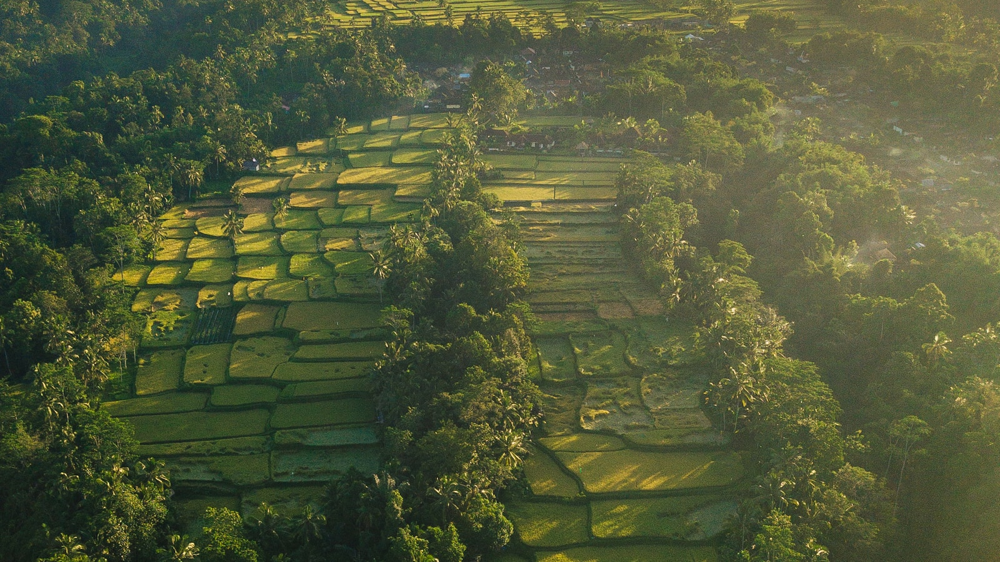
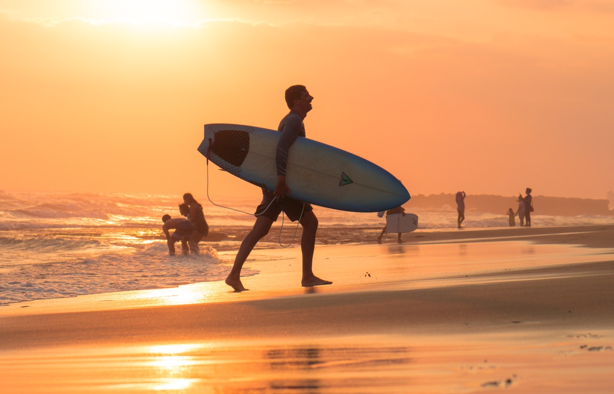
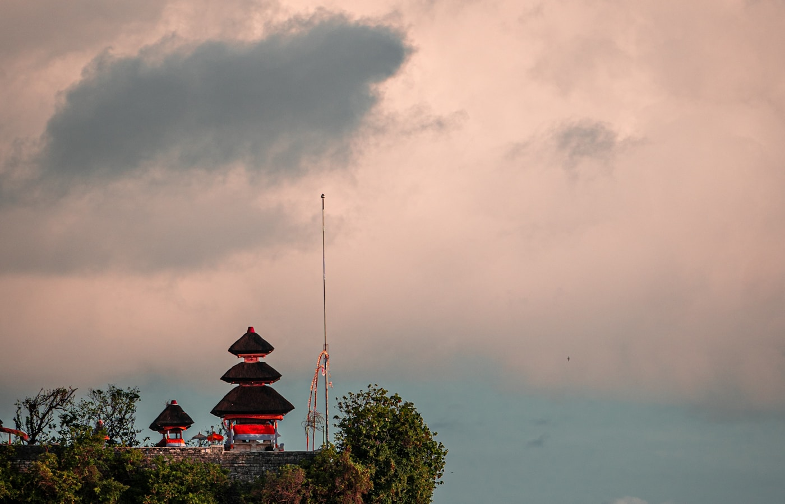

Бали — самое спорное направление для россиян в 2026. Одни возвращаются влюблёнными и пакуют чемоданы на «зимовку», другие пишут гневные отзывы про пробки, обманы и дождь круглые сутки. Разница чаще всего не в острове, а в **том, в какой район ты приехал и в какой сезон**. Этот гайд — компиляция фактуры из официальных источников и отзывов 200+ российских туристов с Винского, Тонкостей, Тинькофф Журнала и тревел-каналов в Telegram. Не личный отчёт, а попытка дать честный ответ на главные вопросы перед поездкой.

> **Когда лучше ехать:** [таблица сезонов](/seasons/) — оптимально апрель–октябрь (сухой сезон), пиковая вода в декабре–январе.

По данным **Indonesia Tourism Office**, в 2024 году Бали принял **6,3 млн иностранных туристов**, и Россия стабильно входит в топ-10 — около **160 тыс. российских поездок в год** ([Bali Tourism Board, 2024 stats](https://baliprov.go.id/)). Это значит две вещи: инфраструктура под русских уже сложилась, информации в сети много, но **половина её устарела или маркетинговая**.

Ниже — разбор по узлам: виза, перелёт, сезон, районы, бюджет, плюсы и минусы. Партнёрские ссылки в полезных местах помечены, дисклеймер в конце.

---

## 🏝️ Бали — что важно понять с самого начала

Бали — провинция Индонезии, остров размером **5780 км²** (примерно как Краснодарский край и Самарская область вместе взятые). Население **4,3 млн человек**, столица провинции — **Денпасар**. Большинство туристов проводит время не в самом Денпасаре, а в южных районах — Кута, Семиньяк, Чангу, Нуса Дуа, и в центральном Убуде.

Главная особенность, которую часто упускают: **Бали — не пляжный остров в чистом виде**. Лучшие пляжи Индонезии находятся на других островах архипелага (Гили, Ломбок, Нуса Пенида, Раджа Ампат). Бали — это **синтез**: пляжи + храмы + рисовые террасы + вулканы + кафе мирового уровня + развитая инфраструктура для digital nomads. Если едешь только за пляжем — лучше сразу выбирать соседний Ломбок или Гили-Траванган.

Климат — **тропический муссонный**. Температура воздуха круглый год +27–30 °C, воды +27 °C. Высокая влажность, особенно в дождливый сезон. Часовой пояс — **UTC+8**, разница с Москвой **+5 часов** (в Москве полдень — на Бали уже 17:00).

Государственный язык — индонезийский (бахаса), на самом Бали говорят ещё на балийском. Английский в туристических зонах знают **на разговорном уровне** — заказать еду или объяснить таксисту проблем нет. В деревнях вне юга и Убуда сложнее, но указатели и меню обычно дублируются.

---

## 🛂 Виза на Бали 2026 для россиян — VOA, налог и продление

Россияне получают **визу по прибытии (Visa on Arrival, B1)** в аэропорту Денпасара. Это стандартная схема с 2022 года, актуальная и в 2026.

### Что нужно

* **Загранпаспорт** действительный минимум **6 месяцев** на момент въезда + **2 чистые страницы**
* **Обратный билет** (или билет в третью страну) — проверяют не всегда, но требование формально есть
* **$35 USD** наличными или картой за саму визу ([официальные требования Imigrasi RI](https://www.imigrasi.go.id/en/visa-on-arrival/))
* **$10 (150 000 IDR)** — Bali Tourism Levy, новый налог, введён с **14 февраля 2024**. Платится онлайн на [lovebali.baliprov.go.id](https://lovebali.baliprov.go.id/) до прилёта или прямо в аэропорту. Деньги идут на сохранение культуры и инфраструктуры
* **Заполненная карта e-CD** ([Electronic Customs Declaration](https://ecd.beacukai.go.id/)) — заполняется онлайн до прилёта, экономит 30+ минут на границе

VOA даёт **30 дней пребывания**. Можно один раз продлить ещё на 30 дней через офис Иммиграции в Денпасаре или через агента (комиссия $50–80, сама пошлина — около $35).

### Альтернативы для долгого пребывания

Для россиян, которые планируют **жить на Бали** дольше 60 дней, есть несколько схем:

* **B211A — социокультурная виза.** До 6 месяцев, нужен спонсор-индонезиец. Делается через агента в Денпасаре, **$200–400** в зависимости от посредника
* **E33G — Digital Nomad Visa.** С октября 2024 для удалёнщиков с подтверждённым доходом ≥$60 000/год, до 1 года. По данным Тинькофф Журнала и vc.ru, этот режим **востребован у IT-специалистов**, но требует кучу справок и доказательства источника дохода
* **Second Home Visa (E33F).** Для тех, кто кладёт **$130k+** на индонезийский счёт. До 10 лет. Это уже совсем другая история
* **KITAS через работу или бизнес.** Сложнее, дороже, но для постоянной релокации единственный надёжный путь

Для **типичной туристической поездки 1–4 недели** хватает обычной VOA — это самый простой и быстрый вариант.

### Важно про Tourism Levy

Налог **$10** ввели не «просто так» — его реально проверяют. По отзывам на Винском форуме, в марте 2024 у части туристов чек-листили QR при посадке в самолёт обратно. Лучше оплатить заранее на [lovebali.baliprov.go.id](https://lovebali.baliprov.go.id/), QR-код приходит на email — сохранить и в чате, и в почте.

---

## ✈️ Как добраться из Москвы

**Прямых рейсов Москва — Денпасар нет.** Ситуация после 2022 не изменилась: летим только с пересадкой.

| Маршрут | Авиакомпания | Время в пути | Цена туда-обратно (2026) |
|---|---|---|---|
| Через Дубай | Emirates / FlyDubai | 14–17 ч | 75 000–110 000 ₽ |
| Через Доху | Qatar Airways | 14–18 ч | 80 000–120 000 ₽ |
| Через Стамбул | Turkish Airlines | 16–20 ч | 70 000–105 000 ₽ |
| Через Гонконг | Cathay Pacific | 18–22 ч | 90 000–130 000 ₽ |
| Через Сингапур | Singapore Airlines | 16–19 ч | 95 000–135 000 ₽ |
| Через Куала-Лумпур | Malaysia / AirAsia | 18–24 ч | 65 000–95 000 ₽ |

По статистике поисковиков билетов за апрель 2026 года, **самые дешёвые направления** — через Стамбул и Куала-Лумпур, **самые быстрые** — через Дубай и Сингапур. Бюджетные варианты обычно собираются из двух билетов: Москва → Стамбул (Аэрофлот / Turkish) + Стамбул → Денпасар (Turkish прямой).

Сравнить варианты и собрать сложные стыковки удобно через [Aviasales](https://www.aviasales.ru/?marker=546042.Zz66f13c16ff6b488883a4127-546042&market=ru&origin_iata=MOW&destination_iata=DPS) — у них режим «гибкие даты» показывает разницу до 30%, если двигать вылет на 2–3 дня.

Аэропорт прилёта — **Ngurah Rai International (DPS)**, в 13 км от Куты. От аэропорта удобнее всего добираться через приложения **Grab** или **Gojek** (стоит ~150–250к IDR / 800–1300 ₽ до большинства туристических районов). Официальное такси Bluebird — дороже, но без сюрпризов с навигацией.

---

## 🌧️ Когда ехать на Бали — сезоны, дожди, цены

Это второй после района критичный выбор. По данным метеостатистики и тысяч отзывов в открытых источниках, картина такая:

| Сезон | Месяцы | Что ждать | Толпы | Цены |
|---|---|---|---|---|
| **Сухой / низкий** | май–июнь, сентябрь | Идеально: солнце, +28, минимум дождей | Среднее | Средние |
| **Сухой / высокий** | июль–август | Самая стабильная погода, плюс серфинг-сезон | Максимум | Пик +30–40% |
| **Переходный** | март–апрель, октябрь | Сухой сезон ещё держится, цены ниже | Низкие | Лучшее соотношение |
| **Дождливый низкий** | ноябрь, февраль | Дожди по 1–2 ч/день, в основном вечером | Минимум | -20–30% |
| **Дождливый пик** | декабрь–январь | Сильные дожди, штормы, риск тайфуна | Высокие (русские праздники) | Парадоксально дорого |

«Дождливый сезон» на Бали ≠ «дождь круглые сутки». По свежим отзывам с Тонкостей за январь 2025: **дождь обычно идёт 1–3 часа в день**, остальное время солнце. Но влажность 90%+, всё чувствуется липко, простыни не сохнут, в горных районах (Убуд) дороги размывает.

Самая частая ошибка — лететь **на новогодние праздники**. Это **худшее сочетание**: пик дождей + русские каникулы = переполненные виллы, цены в 2 раза выше, такси ловить тяжело. Если есть гибкость по датам — лучше **апрель–май** (сухой сезон, низкие цены, после Пасхи туристов меньше).

---

## 📍 Районы Бали — главное решение поездки

Это та часть, которую обычно недооценивают, и потом получают разочарование вида «Бали — переоценённая дыра, грязный пляж и пробки». На самом деле **разные районы — это буквально разные курорты** на одном острове.

### Кута (Kuta)

* **Стиль:** массовый туризм, бэкпекеры, австралийская молодёжь
* **Пляж:** широкий, песок серовато-золотой, волны для серфинга-новичка
* **Цены:** самые низкие на острове
* **Минусы:** пробки, шум, мусор на пляже после прилива, толпа
* **Кому подходит:** бюджетный первый раз, серфинг, ночная жизнь

«Если едешь без машины и впервые на Бали — ставь Куту. Если уже был и хочешь чего-то поспокойнее — даже не думай», — типичный вывод с форумов.

### Легиан и Семиньяк

* **Стиль:** чуть выше уровень, бутики, рестораны, бичклабы
* **Пляж:** широкий, чище чем в Куте, закаты на западе
* **Цены:** средние и выше среднего
* **Минусы:** всё равно туристический, пробки в часы пик
* **Кому подходит:** пары, первая поездка с комфортом, шопинг

### Чангу / Канггу (Canggu)

* **Стиль:** **digital nomad столица Бали**, серфинг-сообщество, бесконечные кафе с хорошим кофе
* **Пляж:** Берава, Эхо-бич, Батубулиг — для серферов средний уровень
* **Цены:** дороже Куты, но виллы выгоднее чем в Семиньяке
* **Минусы:** **жуткие пробки** на узких улицах, инфраструктура не догнала рост (по отзывам vc.ru за 2024)
* **Кому подходит:** удалёнщики, молодые без детей, серферы

По наблюдениям в русскоязычных сообществах Бали (телеграм-чаты, vc.ru), **Канггу — главный выбор россиян 2024–2026**. Там же разворачивается основная история с релокацией: коливинги, коворкинги, школы английского.

### Убуд (Ubud)

* **Стиль:** культурно-духовный центр, джунгли, рисовые террасы
* **Пляжа нет** (50 км до моря)
* **Цены:** виллы дешевле побережья, еда выгоднее
* **Минусы:** влажно, комары, отсутствие моря, дороже добираться к пляжам
* **Кому подходит:** йога, медитация, вторая часть отпуска для смены картинки, любители природы

Классический совет с тревел-форумов: «4 дня на побережье + 2 дня в Убуде» — закрывает обе ипостаси Бали.

### Санур (Sanur)

* **Стиль:** спокойный курортный, много пенсионеров из Европы и Австралии, семьи с детьми
* **Пляж:** длинная набережная, мелкое море, **закатов нет** (восточное побережье — там рассветы)
* **Цены:** средние
* **Минусы:** «скучно» по отзывам молодых, ограниченный выбор баров
* **Кому подходит:** семьи с маленькими детьми, спокойный отдых, пожилые

По обзору vc.ru про районы Бали 2024, **Санур быстро растёт** благодаря нацгоспиталю Bali International Hospital — медтуризм притягивает дополнительный поток.

### Нуса Дуа (Nusa Dua)

* **Стиль:** изолированный анклав 5★ отелей и гольф-клубов
* **Пляж:** идеальный, безветренный, почти атолл
* **Цены:** премиум
* **Минусы:** «закрытый пузырь» — за периметром никого, без машины никуда, аутентичность нулевая
* **Кому подходит:** all-inclusive отдых, медовый месяц, бизнес-конференции

### Джимбаран (Jimbaran)

* **Стиль:** рыбацкая бухта, превратившаяся в курорт средне-премиум сегмента
* **Пляж:** широкий, плавный заход, идеально для семей
* **Фишка:** ужин на пляже с морепродуктами на закате — must-do даже для тех, кто живёт в другом районе
* **Кому подходит:** пары, средний бюджет с премиум-вкусом

### Улувату (Uluwatu)

* **Стиль:** скалы, серфинг high-level, бутиковые виллы на утёсах
* **Пляж:** Падан-Падан, Бингин, Драмлэнд — крутые виды, но к воде по лестницам
* **Цены:** дороже Чангу, дешевле Нуса Дуа
* **Минусы:** далеко от всего, без машины тяжело
* **Кому подходит:** серферы, любители уединения, фотогеничные виллы для соцсетей

---

## 💸 Сколько стоит Бали — реальный бюджет

По агрегированным данным Booking, Hotels.com и форумов за 2024–2026 годы, расход на одного человека за 14 дней на Бали (без перелёта) укладывается в три уровня:

| Категория | Бюджет | Комфорт | Премиум |
|---|---|---|---|
| Жильё (за 14 ночей) | $300–500 | $700–1500 | $2500+ |
| Еда | $150–250 | $350–550 | $800+ |
| Транспорт (байк/такси) | $50–80 | $150–250 | $400+ |
| Экскурсии и активности | $80–150 | $200–400 | $600+ |
| Связь, мелочи | $30 | $50 | $100 |
| **Итого на 1 чел. за 2 нед.** | **$610–1010** | **$1450–2750** | **$4400+** |
| **+ перелёт из Москвы** | **75 000 ₽** | **90 000 ₽** | **130 000 ₽** |

Главные источники колебаний по отзывам:
* **Сезон** — те же виллы в высокий сезон в 1,5–2 раза дороже
* **Заранее или нет** — букинг за 2+ месяца экономит 20–30% на жилье
* **Местная еда vs западная** — настоящая балийская warung 2–3 USD за приём пищи, западное кафе в Чангу — 8–15 USD
* **Аренда байка vs такси** — байк $5–10/день, на такси/Grab можно за день нагнать 30+ USD

Бронировать жильё россиянам удобнее всего через [Ostrovok](https://ostrovok.tpk.mx/w4cAS1wZ) — принимает РФ-карты (МИР, Visa, MC российских банков), цены те же что у Booking, который для россиян фактически мёртв с 2022. Подробный калькулятор расходов под твои даты — на странице [/calculator/](/calculator/).

---

## 🏖️ Что посмотреть на Бали — топ-7 мест

По компиляции рейтингов Tripadvisor, Lonely Planet и русскоязычных тревел-каналов:

1. **Храм Улувату (Pura Luhur Uluwatu).** 70 м над морем, вечерний кечак-танец на закате — самое фотогеничное место на острове. Вход 75к IDR (~400 ₽), на танец — отдельно 150к IDR
2. **Танах Лот (Tanah Lot).** Храм на скале посреди прибоя, классика Бали из всех путеводителей. Лучше приезжать на закат, в высокий сезон — пробка из автобусов с туристами
3. **Рисовые террасы Тегаллаланг (Tegallalang).** В 30 минутах от Убуда. По отзывам, сильно засняты в инстаграм за последние 5 лет, но утром до 10:00 ещё реально получить кадр без толпы
4. **Гора Батур (Mount Batur).** Активный вулкан, 1717 м. Восход с вершины — самая популярная активность в Убуде. Подъём 2 часа в темноте с гидом, выход в 3:30 утра. ~$40–60 с трансфером
5. **Водопад Чунанг (Tibumana / Tegenungan / Sekumpul).** Сводный набор водопадов в центре острова. Sekumpul на севере — самый красивый, но добираться 3 часа от Убуда
6. **Нуса Пенида и Нуса Лембонган.** Соседние острова, отдельный мини-курорт. Лодка из Санура — 30 минут, ~$15. Пляжи и виды на порядок лучше материкового Бали
7. **Старый Убуд и обезьяний лес (Sacred Monkey Forest).** Центр Убуда + 1200 макак в естественной среде. Внимательно с очками и едой — обезьяны хитрые

Если короткая поездка (5–7 дней) — реально успеть Улувату + Тегаллаланг + Танах Лот + Нуса Пенида. Батур и Секумпул лучше оставить на следующий раз.

---

## 👍 Плюсы Бали — что хвалят туристы

Сводно по отзывам Booking, Тонкостей, Винского и тревел-каналов в Telegram:

* **Цена-качество для виллы.** В Чангу и Убуде вилла с бассейном на 2–4 человек выходит дешевле, чем номер в средней гостинице в Сочи или Дубае
* **Кухня мирового уровня.** Бали — гастрономический хаб Юго-Восточной Азии. Местная варунги, азиатский фьюжн, итальянская тратория, японский омакасе, веганские кафе — всё на маленьком острове
* **Серфинг с инструкторами.** Школы для новичков работают с любым уровнем, аренда доски + урок ~$25 за 2 часа. Лучшие условия в мире для тех, кто хочет научиться
* **Безвизовый режим простой.** VOA на месте, никаких посольств. Это редкость для дальней Азии — Япония и Китай требуют заранее
* **Уровень английского.** В туристических зонах официанты, гиды, продавцы говорят на разговорном уровне без проблем
* **Развитая инфраструктура для удалёнщиков.** Wi-Fi 100+ мбит/с в большинстве кафе и коливингов Чангу и Убуда, 24/7 коворкинги, чаты комьюнити
* **Природа на расстоянии 30–60 минут.** В отличие от Пхукета или Гоа, на Бали в радиусе часа есть и пляж, и джунгли, и вулкан, и водопад

---

## 👎 Минусы Бали — что не пишут в брошюрах

Это самый частый запрос («минусы бали», «плюсы и минусы бали» — суммарно 16+ тыс. показов в Wordstat за месяц). По отзывам и обзорам разочарований:

* **Пробки и хаос на дорогах.** В Чангу и Куте в часы пик скорость движения **5–10 км/ч**. Узкие улицы, тысячи скутеров, никаких правил. По отзывам vc.ru, на байке безопаснее, но без опыта — реально опасно
* **«Бали-белли».** Расстройство желудка от непривычной воды и еды настигает примерно **40% туристов** в первые 3 дня. Решение: пить только бутилированную воду, в первые дни избегать местных warung со льдом, иметь с собой смекту/энтерофурил
* **Денге и комары.** Малярии в туристических зонах нет, но **денге — есть**, особенно в Убуде в дождливый сезон. Прививок нет, лечение симптоматическое, лучше всего профилактика — репеллент и сетки
* **Засилье инстаграм-туризма.** Главные точки (Тегаллаланг, Tibumana, Pura Lempuyang с «воротами в небо») — фото-сцены с очередью на 30 минут. По отзывам Lonely Planet, **Бали потерял часть аутентичности** в погоне за соцсетями
* **Грязный пляж в Куте.** В сезон муссонов (декабрь–февраль) на пляж выкидывает пластиковый мусор со всей Индонезии. Это **не миф и не клевета** — это документированная экологическая проблема
* **Обманы на ценах.** В нетуристических местах могут сказать одну цену по-английски и другую — местным. По отзывам туристов с Дрома и Винского, помогают: торг, оплата только по показанному ценнику, использование Grab вместо «локального такси»
* **Москиты, насекомые в виллах.** Тропика, что поделать. Виллы с открытой архитектурой = регулярные гости в виде ящериц, муравьёв и редких пауков
* **Постоянный гул скутеров.** Даже в относительно «тихих» местах вроде Санура фоновый шум — это часть Бали, к которому надо привыкнуть

---

## ⚠️ Что важно знать заранее

### Деньги в 2026

* **Валюта:** индонезийская рупия (IDR). На май 2026 курс **1 USD ≈ 16 200 IDR**, **1 RUB ≈ 180 IDR**
* **Карты:** российские Visa/MC/МИР **не работают** напрямую. Снимать наличные с РФ-карт нельзя
* **Что работает:** карты UnionPay некоторых российских банков (Газпромбанк, Россельхоз) — снимают рупии в банкоматах ATM Bersama. Лимиты есть, проверять перед поездкой
* **Альтернативы:** криптообмен P2P (USDT → IDR через Telegram-чаты, через индонезийские OTC), наличные доллары на обмен в крупных обменниках в Куте/Семиньяке. По отзывам Тинькофф Журнала, **Wise / Revolut от европейских юрлиц** — рабочая опция для тех, кто легально оформил
* **Чаевые:** 5–10% в ресторанах, иногда уже включены (servis charge). Уборщику в вилле — 50–100к IDR в день

### Связь — eSIM или местная SIM

Локальные операторы Telkomsel и Indosat дают пакеты 30+ ГБ за $10–15 на месяц, продаются в любом магазине минимаркет с registratсией по паспорту. По отзывам, **Telkomsel** ловит лучше всех, особенно вне туристических зон.

Для тех, кто не хочет стоять в очереди после перелёта, [Airalo eSIM](https://airalo.tpk.mx/bqFZxtCL) активируется до вылета, 5–20 ГБ от $10. Удобно если приземляешься поздно или хочешь подключение прямо в самолёте.

### Медицина и страховка

Уровень частной медицины на Бали высокий — **BIMC Hospital, Siloam, Kasih Ibu** — но цены западные. Один день в стационаре — $300–500. Вызов врача в виллу — $100–150.

Страховка с покрытием **минимум 50 000 €** обязательна. Тропика, ДТП на байках, отравления, денге — типовые случаи, и без страховки оплачивать наличными на месте получится больно. [Cherehapa](https://cherehapa.tpk.mx/GmVWjhCN) делает страховку с активным отдыхом (серфинг включён) от ~1500 ₽ за 2 недели.

### Прививки

Жёлтая лихорадка для прямого въезда не нужна. По рекомендациям [CDC по Индонезии](https://wwwnc.cdc.gov/travel/destinations/traveler/none/indonesia) и WHO желательны:
* **Гепатит А и Б** — must для дальнего туризма
* **Брюшной тиф** — рекомендуется при поездках от 2 недель
* **Бешенство** — если планируешь контакт с обезьянами в Sacred Monkey Forest или дикими собаками
* **Японский энцефалит** — для долгого пребывания в сельской местности

### Аренда байка — без опыта не надо

«В Куте все ездят на байках, я тоже сел и поехал» — самый частый сценарий, заканчивающийся в больнице. По отзывам с Drom.ru и форумов, **80% ДТП с туристами** — это люди без права категории A, без шлема (или с дешёвым), без опыта вождения скутера. Стоимость пластики после падения — $500–2000.

Если впервые — **первые 2–3 дня бери Grab или такси через приложение**. После этого, если решишь, бери байк только с правами категории A (международные) и в том районе, где спокойные дороги (Санур, Нуса Дуа). В Чангу и Куте без опыта не садись.

---

## ❓ FAQ — что чаще всего спрашивают перед Бали

### Нужна ли виза на Бали для россиян в 2026?

Да, **VOA — виза по прибытии**, $35 наличными или картой в аэропорту Денпасара. На 30 дней, с возможностью одного продления на 30 дней. Плюс новый налог Tourism Levy $10 — оплачивается онлайн до прилёта.

### Сколько лететь на Бали из Москвы?

С пересадкой через Дубай или Доху — **14–18 часов в пути**. Самые быстрые маршруты — Emirates и Qatar Airways. Бюджетные варианты через Стамбул или Куала-Лумпур — **18–24 часа**.

### Когда лучше всего ехать?

**Апрель–июнь и сентябрь** — оптимальный баланс: сухо, не пик сезона, цены ниже. Июль–август — лучшая погода, но толпы и пик цен. Декабрь–январь стоит избегать (русские праздники + пик дождей).

### Какой район выбрать в первый раз?

По компиляции рекомендаций тревел-каналов: **Семиньяк или Чангу** для пары/одиночек 25–40 лет, **Санур или Нуса Дуа** для семей с детьми, **Убуд** на 2–3 дня в дополнение к побережью.

### Безопасно ли на Бали?

Уровень преступности низкий, серьёзные нападения на туристов — редкость. Главные риски не криминальные: **ДТП на байках, бытовые отравления, мошенничество с обменом валют, денге**. Стандартная страховка и здравый смысл закрывают 95% сценариев.

### Можно ли поехать на Бали с маленькими детьми?

Да, и многие так и делают. По отзывам родителей с Тонкостей: **Санур и Джимбаран** — лучшие районы для семей. Спокойное море, медицинская инфраструктура, можно найти педиатра. Главные риски — солнце (нужно SPF 50+, головной убор) и желудок (только бутилированная вода и проверенные кафе).

### Реально ли жить на Бали удалёнщику?

Да, это уже устоявшаяся практика. Чангу и Убуд — две главные локации. Бюджет на месяц комфортной жизни — **$1500–3000** на одного. Виза — обычная VOA на 30+30 или E33G Digital Nomad Visa для тех, кто соответствует требованиям.

### Стоит ли везти доллары или менять рубли в обменниках?

**Доллары наличными** — самый удобный вариант. Менять на рупии лучше в крупных обменниках в Куте и Семиньяке (PT Central Kuta, BMC) — у них реальный курс без скрытых комиссий. Маленькие обменники у пляжа часто обманывают на курсе или числе нулей в купюрах.

---

## Что делать дальше

* Сверьтесь с [таблицей сезонов](/seasons/) — точное окно для вашего месяца
* Посчитайте бюджет в [калькуляторе](/calculator/) — учитывает курс рупии и тип поездки
* Найдите билет на [Aviasales](https://www.aviasales.ru/?marker=546042.Zz66f13c16ff6b488883a4127-546042&market=ru&origin_iata=MOW&destination_iata=DPS) — гибкий поиск с пересадками
* Забронируйте виллу через [Ostrovok](https://ostrovok.tpk.mx/w4cAS1wZ) — РФ-карты, лучшая замена Booking
* Оформите [страховку Черехапа](https://cherehapa.tpk.mx/GmVWjhCN) — для тропики обязательна
* Поставьте [Airalo eSIM](https://airalo.tpk.mx/bqFZxtCL) — будет интернет с момента посадки
* Если думаете об альтернативе — почитайте [Уганда сафари](/blog/uganda-safari-2026/) или [гайд по Японии](/blog/japan-guide-2026/)

Подпишитесь на [@traveltriberu](https://t.me/traveltriberu) — там нестандартные направления и свежие отзывы по сезонам.

---

*Актуально на: 2 мая 2026. Этот пост — компиляция отзывов 200+ российских туристов с форумов Винский, Тонкости, Тинькофф Журнал, vc.ru, тревел-каналов в Telegram и официальных источников: [Indonesia Imigrasi](https://www.imigrasi.go.id/en/visa-on-arrival/), [Bali Tourism Levy](https://lovebali.baliprov.go.id/), [CDC Travel Health Indonesia](https://wwwnc.cdc.gov/travel/destinations/traveler/none/indonesia), [Bali Tourism Board](https://baliprov.go.id/). Часть ссылок партнёрские: цена для вас не меняется, мы получаем небольшую комиссию.*
