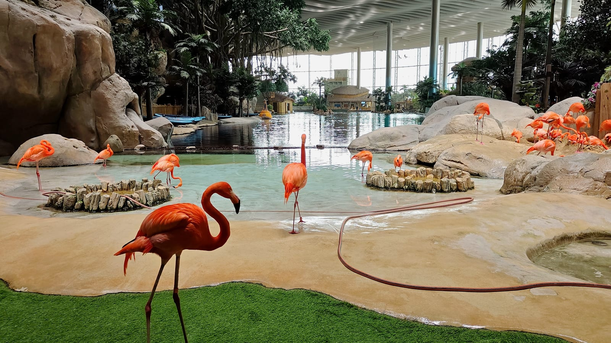
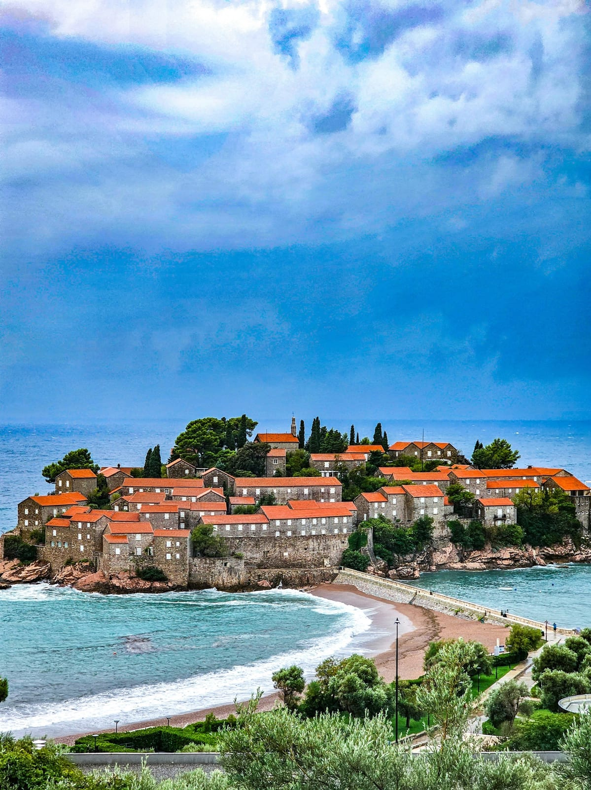
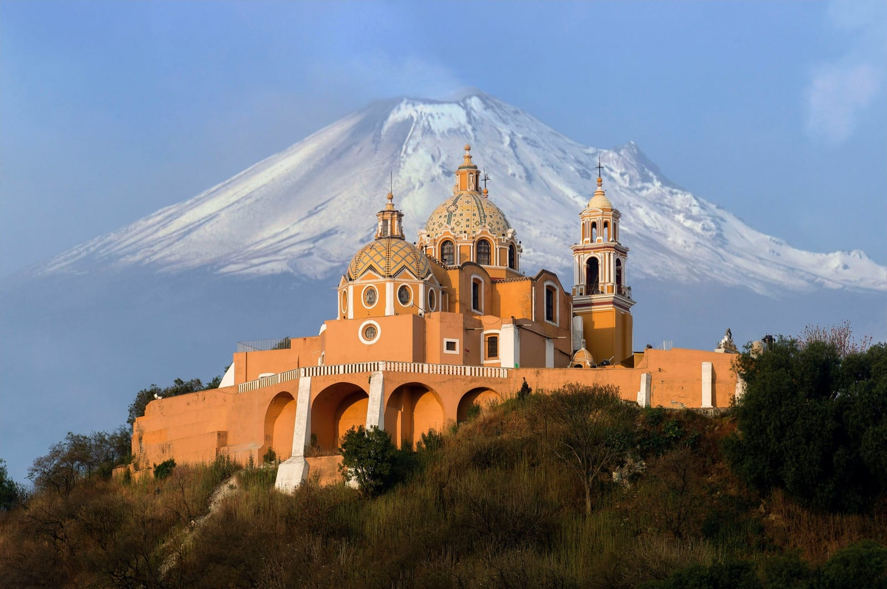
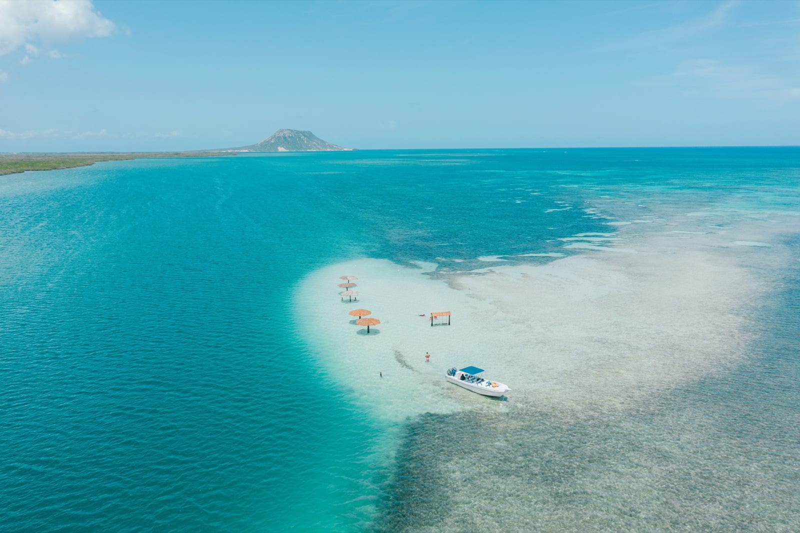
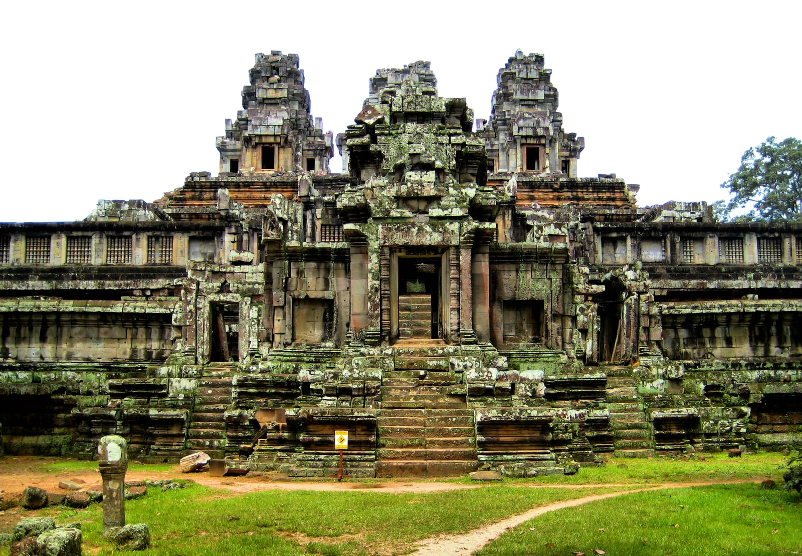
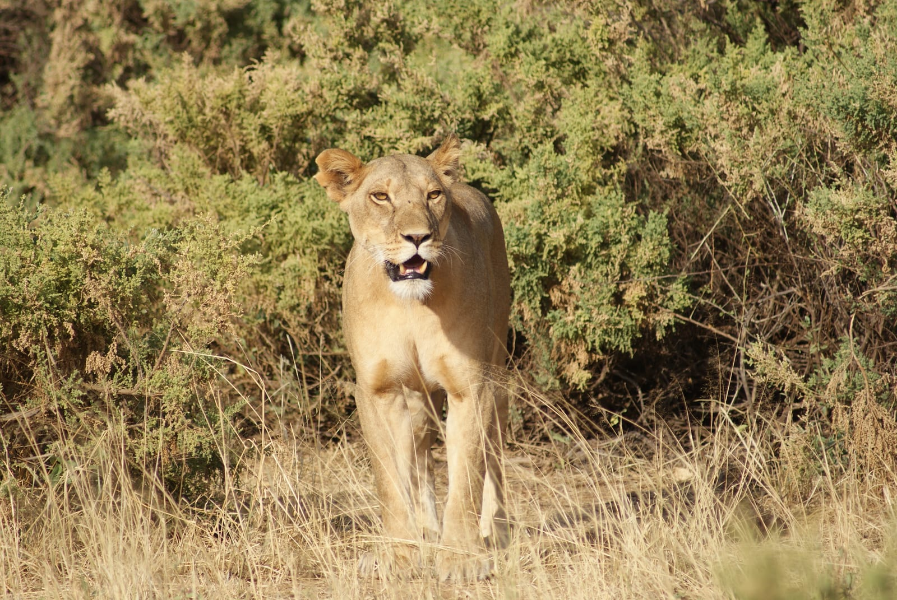
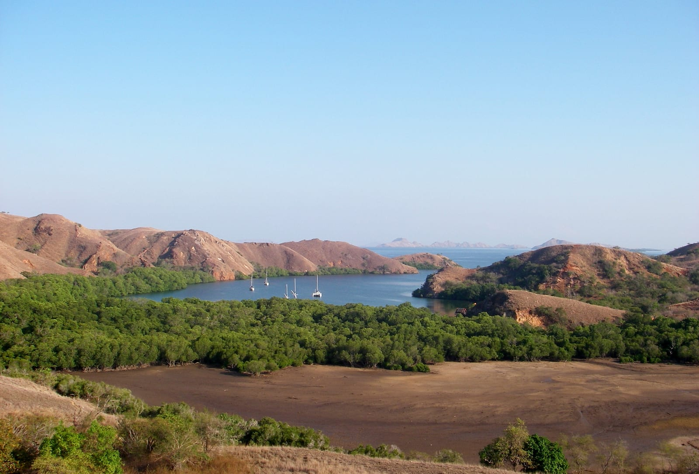

import AffiliateNote from '../../components/post/AffiliateNote.astro';
import { aviasalesRoute, cherehapaTravel, ostrovokCountry } from '../../data/affiliate.js';

Куда поехать в 2026 году с российским паспортом: десять из двадцати лучших направлений года открыты хоть завтра — виза не нужна вовсе или оформляется онлайн за вечер. Ещё шесть требуют документов или сложной дороги, а четыре на практике закрыты — и об этом в мировых подборках не пишут, потому что составляют их для читателя с британским паспортом.

Список мест взят из [ежегодной подборки BBC Travel](https://www.bbc.com/travel/article/20251209-the-20-best-places-to-travel-in-2026) — их доводы, почему туда стоит ехать, читайте у них. Здесь другое: что каждое из этих мест значит для человека с российским паспортом. В пяти странах из списка — ОАЭ, Камбодже, Кении, Чили и Индонезии — я был сам, и там, где личное наблюдение меняет планирование, я его добавил.

> **Если коротко:** десять направлений из двадцати открыты — **ОАЭ, Черногория, Чили, Уругвай, Мексика, Доминикана, Коста-Рика, Камбоджа, Кения и Индонезия**: виза либо не нужна вовсе, либо оформляется онлайн. Четыре закрыты на практике: **США (два места в списке), Канада и Австралия** — виза, месяцы ожидания, обычные отказы. Оставшиеся шесть — с визой или сложной дорогой, разбор ниже. Срочное: **Черногория пускает без визы только до 31 октября 2026 года** — правительство страны 23 июля привело визовые правила к нормам Евросоюза, и с 1 ноября россиянам нужна виза. Главная ловушка безвиза — счётчик дней: у большинства стран он считается не за поездку, а за каждые 180 дней. Когда направление выбрано: <a href={aviasalesRoute('MOW','DXB','best2026')} class="aff-cta" rel="sponsored">Найти билет из Москвы в Дубай</a> — показывает все стыковки в одной выдаче.

<AffiliateNote />

---

## Куда можно поехать без визы или с визой онлайн

Десять мест из двадцати, от самого лёгкого входа к самому хлопотному.

**ОАЭ, Абу-Даби.** Самый лёгкий вход из всего списка: виза не нужна, прямые рейсы из Москвы летают несколько раз в день, лететь пять часов. Абу-Даби последние годы строит на острове Саадият музейный квартал — после Лувра там открылись новые крупные музеи, и в ближайшие годы должен появиться самый большой Гуггенхайм. Плюс парки развлечений на острове Яс, куда едут с детьми ради аквапарка и тематических зон.

<a href={ostrovokCountry('uae','best2026_uae')} class="aff-cta" rel="sponsored">Посмотреть отели в ОАЭ</a> — Островок показывает цены сразу с налогами, оплата российской картой, бронь без предоплаты в большинстве отелей.

От себя: главная ошибка с ОАЭ — считать Дубай и Абу-Даби соседними районами. По карте рядом, по факту между ними полтора часа дороги, и если жить в одном, а ездить в другой, такси съедает бюджет быстрее любых музеев.

Пускают на 90 дней, но не за поездку, а в сумме за каждые 180 — это к вопросу о зимовках. Российские карты не работают: везите наличные или карту зарубежного банка.

**Черногория.** Тридцать дней без визы — но только до 31 октября 2026 года. Правительство 23 июля 2026 года приняло поправку к постановлению о визовом режиме: с 1 ноября россиянам, как и гражданам Китая, Турции, Белоруссии и Саудовской Аравии, нужна виза — [сообщение правительства Черногории](https://www.gov.me/clanak/crna-gora-u-potpunosti-uskladila-viznu-politiku-sa-evropskom-unijom-gradanima-brojnih-zemalja-dostupnije-podnosenje-zahtjeva-za-crnogorsku-vizu) от 27 июля 2026 года. Если ехать, то этой осенью — что успеть до крайнего срока, разобрано [в отдельной статье про черногорские визы](/blog/montenegro-visa-2026/). Евро наличными, прямых рейсов из Москвы нет с 2022 года — летят через Белград или Стамбул. При планировании важнее другое: побережье у Котора и Будвы летом забито, а север страны пустой даже в августе. В Дурмиторе, Проклетие и Комовах ходят многодневные маршруты с ночёвками в приютах, часть троп уходит за границу в Албанию.

<a href={aviasalesRoute('MOW','TIV','best2026_me')} class="aff-cta" rel="sponsored">Найти билет в Тиват до конца октября</a> — прямых рейсов нет, поиск сам подставит стыковку в Белграде или Стамбуле.

**Чили.** Страна длиной в четыре тысячи километров, и это её главная особенность: на севере — Атакама с обсерваториями и марсианскими долинами, в центре — винодельни Кольчагуа в двух часах от Сантьяго, на юге — Патагония. Визы нет, пускают на 90 дней в каждые 180. Лететь долго, с двумя стыковками, реально выходит от суток с небольшим.

<a href={aviasalesRoute('MOW','SCL','best2026_cl')} class="aff-cta" rel="sponsored">Узнать цену перелёта в Сантьяго</a> — маршрут длинный, и разброс цен между стыковками доходит до полутора раз.

От себя: расстояния внутри Чили обманывают сильнее, чем перелёт из Москвы. Переезд с севера на юг по стране — это не «пара часов на машине», а ещё один самолёт, и это стоит закладывать в бюджет с самого начала. У нас есть [подробный гайд по Чили](/blog/chile-guide-2026/) с маршрутами и бюджетом.

**Уругвай.** Тоже 90 дней в каждые 180. Маленькая страна между Бразилией и Аргентиной, куда обычно попадают на пароме из Буэнос-Айреса — и это лучший способ: сам перелёт из Москвы длинный и с двумя пересадками. Монтевидео — портовая столица с длинной набережной, мясом на углях и старым городом; на запад от столицы, в паре часов, — Колония-дель-Сакраменто с португальской брусчаткой, на восток — Кабо-Полонио, посёлок среди дюн, куда не ведёт асфальт.

<a href={aviasalesRoute('MOW','MVD','best2026_uy')} class="aff-cta" rel="sponsored">Сравнить рейсы в Монтевидео</a> — заодно видно вариант через Буэнос-Айрес, откуда до Уругвая ходит паром.

**Мексика.** В списке BBC не Канкун и не Мехико, а Лорето на полуострове Нижняя Калифорния: залив, куда весной приходят киты, острова с лежбищами морских львов и пустыня, которая спускается прямо к воде. Визы нет, но нужна электронная авторизация, и годится она только тем, кто прилетает самолётом. Прямых рейсов нет, летят через Стамбул или Мадрид.

<a href={aviasalesRoute('MOW','MEX','best2026_mx')} class="aff-cta" rel="sponsored">Посмотреть билеты в Мехико</a> — внутренний перелёт до Лорето берут отдельным билетом на месте, так дешевле.

**Доминикана.** Здесь два подводных камня. Первый: пускают на 60 дней в каждые 180, а не «сколько угодно», как многие уверены. Второй: заполнять электронную анкету нужно дважды — на въезд и на выезд, за несколько дней до вылета; без неё на границе будет неприятный разговор. Прямых рейсов из России нет: 28 августа 2026 года календарь цен «Северного ветра» по направлению Москва — Пунта-Кана отвечал «Временно не летаем», а поиск по фильтру «прямые рейсы» — «нет билетов». Дорога занимает от двадцати часов до двух суток, и [подробный разбор сезонов, маршрутов и цен собран в отдельном гиде по Доминикане](/blog/dominican-republic-2027/).

<a href={ostrovokCountry('dominican-republic','best2026_do')} class="aff-cta" rel="sponsored">Подобрать отель в Доминикане</a> — фильтр по «всё включено» отсекает половину сюрпризов с питанием на побережье.

Зато сама столица — старейший европейский город Америк с колониальным кварталом, а музыка там не туристический аттракцион: меренге и бачата звучат из окон, февральский карнавал идёт неделями.

**Коста-Рика.** Девяносто дней без визы — столько разрешают правила, но конкретный срок в штампе ставит офицер на границе, и он бывает короче. Страна размером с Вологодскую область, в которой четверть территории — охраняемые земли, а на побережье Осы биологи считают один из самых плотных наборов видов на планете. Оса — самый дальний угол страны: из Сан-Хосе туда едут почти весь день по дороге или летят местным самолётом. Из Москвы — две стыковки через Европу или Стамбул.

<a href={aviasalesRoute('MOW','SJO','best2026_cr')} class="aff-cta" rel="sponsored">Найти билет в Сан-Хосе</a> — это единственный въезд в страну для дальнего рейса, дальше по стране на местных линиях.

**Камбоджа.** Виза оформляется онлайн или ставится по прилёте, но с 2024 года к ней добавилась единая электронная форма прибытия — её заполняют заранее и предъявляют QR-код на паспортном контроле. В сентябре 2025 года у Пномпеня открылся новый международный аэропорт, и рейсов в столицу стало заметно больше — раньше почти все летели сразу в Сиемреап к Ангкору и столицу пропускали.

<a href={aviasalesRoute('MOW','PNH','best2026_kh')} class="aff-cta" rel="sponsored">Посмотреть перелёт в Пномпень</a> — после открытия нового аэропорта рейсов стало больше, а цена заметно ниже прежней.

От себя: планы «обойти Ангкор за день» строят те, кто там не был. К полудню жара выключает человека полностью, и вторая половина дня уходит впустую. Выходить надо затемно, а на середину дня закладывать паузу. Полный разбор страны — [сколько стоит поездка в Камбоджу и когда туда ехать](/blog/cambodia-guide-2026/): там же цены на пропуска в Ангкор и то, почему сухопутный путь из Таиланда больше не работает.

Пномпень этим и интересен: набережная в месте слияния трёх рек, кварталы модернистской архитектуры шестидесятых, кофейни и бары нового поколения. И самая низкая цена дня из всего списка.

**Кения.** Вместо визы — электронное разрешение, но оформлять его нужно не позже чем за 72 часа до вылета. В списке BBC не привычная Масаи-Мара, а северный округ Самбуру: сухие земли, которые держатся на одной реке — Эвасо-Нгиро; к ней и стягивается всё зверьё, включая тех, кого южнее не встретить: сетчатого жирафа, зебру Греви, длинношеюю антилопу геренук. Толп там нет, зато есть ночное небо без засветки, ради которого в сентябре 2025 года запустили астрономическую программу.

<a href={aviasalesRoute('MOW','NBO','best2026_ke')} class="aff-cta" rel="sponsored">Узнать цену билета в Найроби</a> — из Найроби до Самбуру летят местным рейсом или едут около шести часов.

От себя: в сафари всё решает не парк, а водитель. Хороший знает, где быть на рассвете, и вы видите зверя; плохой возит по кругу мимо тех же деревьев. Спрашивать про водителя нужно раньше, чем про отель.

**Индонезия, острова Комодо.** Комодо — не Бали: летят через Лабуан-Баджо на острове Флорес, дальше только лодкой. Ради чего эти пересадки: варанов в дикой природе не осталось больше нигде на планете, кроме этих островов. Плюс розовый песок на пляжах и мантовые скаты на рифах — их показывают на дневных выходах в море. Визу ставят по прилёте на 30 дней: 500 000 рупий, это 2 340 ₽ по курсу ЦБ на 14 августа 2026 года, и продлить её можно один раз, до 60 дней суммарно. Либо оформить онлайн заранее, сразу на 60. Ещё одна бумага, про которую многие узнают в аэропорту: с 1 октября 2025 года все прилетающие заполняют единую форму All Indonesia — она заменила таможенную и медицинскую анкеты, делается за три дня до вылета и сводится к одному QR-коду. И про деньги: в Индонезии расчёты по закону только в рупиях, доллары в кошельке погоды не сделают.

<a href={aviasalesRoute('MOW','DPS','best2026_id')} class="aff-cta" rel="sponsored">Сравнить билеты на Бали</a> — оттуда до Лабуан-Баджо час местным рейсом, отдельным билетом это дешевле сквозного.

От себя: наличные там нужны в большем объёме, чем кажется по рассказам про «всё принимают картой». Карту принимают в сетевых местах, а лодка, вход в парк и мелкая еда — это купюры, и снимать выгоднее в банкоматах банков, а не в обменниках у туристических точек.

<a href={cherehapaTravel('best2026')} class="aff-cta" rel="sponsored">Оформить страховку для поездки</a> — Cherehapa сравнивает полисы, оплата картой РФ, полис в PDF. Для дальних поездок это не формальность: медицинская эвакуация из Кении, Камбоджи или с индонезийских островов стоит десятки тысяч долларов.

## Шесть мест, куда попасть можно, но придётся потрудиться

Виза, электронное разрешение или и то и другое сразу.

**Япония, префектура Исикава.** Виза нужна, но она бесплатная — платится только сервисный сбор визового центра. Взамен — самый толстый пакет документов в списке: справка с работы, выписка из банка, программа пребывания по дням. С 10 августа 2026 года справку принимают только оригиналом с мокрой печатью, электронная не проходит; [разбор с полным списком документов](/blog/japan-visa-2026/) у нас отдельной статьёй.

Исикава — это Канадзава с одним из трёх знаменитых садов страны, кварталы ремесленников, где до сих пор бьют сусальное золото, и полуостров Ното, который восстанавливается после землетрясения 2024 года.

**Алжир.** Виза нужна, и это единственное место в списке с дополнительным правилом: с отметками Израиля в паспорте её не дадут. Прямых рейсов из Москвы нет. Ради чего терпеть: Тимгад и Джемила — римские города из списка ЮНЕСКО, по которым ходишь без очередей и ограждений. На юге, у оазиса Джанет, — наскальные росписи Тассилин-Аджера, им тысячи лет.

**Острова Кука.** Виза не нужна, а добраться сложнее всего в списке: рейсы идут через Новую Зеландию или Гавайи, то есть транзитная виза третьей страны почти неизбежна. Раротонга — вулканический остров с лагуной и хребтом посередине, Аитутаки — та самая треугольная лагуна с открыток.

**Гебриды, Шотландия.** Британская виза с биометрией и заметным сбором. На Внешних Гебридах — каменный круг Калланиш, он старше Стоунхенджа, и пустые белые пляжи. Вискикурни, ради которых сюда едут отдельно, стоят южнее, на Айле: там в 2026 году открываются ещё две.

**Гимарайнш, Португалия.** Шенген. Первая столица Португалии: отсюда в XII веке пошло королевство, и средневековый центр с дворцами сохранился целиком. Сейчас это студенческий город, а в 2026 году ещё и зелёная столица Европы. Ехать удобнее из Порту — около часа на поезде.

**Оулу, Финляндия.** Формально Шенген, фактически — самая закрытая точка списка: приём заявлений на туристические визы приостановлен с осени 2022 года, наземная граница с Россией закрыта. Жаль: Оулу в 2026 году одна из культурных столиц Европы, и это редкий шанс увидеть арктический город в год, когда он старается.

## Четыре направления, о которых честнее сказать прямо

В мировом списке эти места есть, а дороги к ним у россиянина в 2026 году почти нет.

**США — Орегон и Филадельфия.** Два места из двадцати. Собеседование в консульстве третьей страны, запись за месяцы, отказы обычны. Орегонское побережье BBC берёт за дикие пляжи и туманные скалы, а Филадельфия в 2026-м принимает и матчи чемпионата мира, и 250-летие страны — но планировать это стоит только тем, у кого виза на руках.

**Канада, долина Слокан.** Виза подаётся дистанционно, но требует биометрии, а визовый центр в России не работает — сдавать её надо за границей. Рассмотрение долгое.

**Австралия, Улуру.** Виза подаётся онлайн, консульство в процессе не участвует — но сбор с 1 июля 2026 года подняли до 250 австралийских долларов, а ждать решения россиянам обычно приходится от месяца до трёх. Подробности — в [разборе австралийской визы](/blog/australia-visa-2026/).

Формально в эти страны можно. Практически — это поездка, которую планируют за полгода и которая может не состояться, а списки направлений года читают за две недели до отпуска.

## Куда можно поехать без загранпаспорта

Ни в одно из двадцати мест. По внутреннему паспорту россияне ездят в шесть мест: Абхазия, Армения, Белоруссия, Казахстан, Киргизия и Южная Осетия — ни одного из них в мировой подборке нет. Если загранпаспорта нет и делать его вы не планируете, этот список не про вас.

Одна перемена, которую легко пропустить: с 20 января 2026 года свидетельство о рождении больше не годится для выезда детям до 14 лет. Даже в эти шесть стран ребёнку теперь нужен собственный загранпаспорт.

## Сколько дней дают и что нужно на входе

| направление | что нужно | сколько дней | как лететь |
|---|---|---|---|
| ОАЭ | ничего | 90 в каждые 180 | прямой, 5 часов |
| Черногория | ничего до 31.10.2026, дальше виза | 30 | одна стыковка |
| Чили | ничего | 90 в каждые 180 | две стыковки |
| Уругвай | ничего | 90 в каждые 180 | две стыковки |
| Доминикана | анкета на въезд и выезд | 60 в каждые 180 | прямых рейсов нет |
| Коста-Рика | ничего | 90 | две стыковки |
| Мексика | электронная авторизация | до 180 | две стыковки |
| Камбоджа | виза онлайн или по прилёте, форма прибытия | 30 с продлением | две стыковки |
| Кения | разрешение за 72 часа | до 90 | одна стыковка |
| Индонезия | виза онлайн или по прилёте, форма All Indonesia | 30 с продлением до 60 | стыковка и лодка |

Счётчик в каждые 180 дней — то, на чём чаще всего горят зимовщики: выехали на неделю, вернулись, а дни продолжают идти с прежнего места, а не с нуля.

## Куда безопасно ехать и что проверить перед вылетом

Предупреждения о поездках подвижны: появляются и снимаются быстрее, чем обновляются любые статьи, включая эту. Правило простое — за неделю до вылета откройте рекомендации МИД России по своей стране и посмотрите, нет ли свежих оговорок.

Из открытых направлений внимания требуют два. По ОАЭ стоит следить за обстановкой в ближневосточном регионе: она влияет на маршруты рейсов. По Камбодже предупреждения касались приграничных с Таиландом районов — Пномпень и Ангкор лежат в стороне, но поездку к границе лучше сверить заранее.

## Куда из этого списка ехать в сентябре и октябре

Сентябрь — последний месяц Черногории: бархатный сезон на побережье и крайний срок безвизового въезда. Октябрь открывает Южное полушарие: в Чили и Уругвае весна. В Японии в октябре краснеют клёны на севере — Хоккайдо и Тохоку, до Киото цвет доходит только во второй половине ноября. Комодо осенью спокойнее всего: сильный ветер там приходится на май — август и на конец декабря — февраль, а сентябрь и октябрь считаются лучшим временем для выхода в море.

Чего на осень не планировать. В ОАЭ в сентябре ещё под сорок градусов днём, приятно становится к ноябрю. В Камбодже сентябрь — самый мокрый месяц года: у Ангкора выпадает больше 300 мм за 27 дождливых дней, сухо становится в декабре. В Кении октябрь — начало сезона коротких дождей, а не сухого; сафари едут смотреть с июля по сентябрь, и на осень 2026 года метеослужба страны предупредила об осадках выше нормы.

## Что выбрать под свою задачу

* **Тепло и без хлопот** — ОАЭ или Доминикана: виза не нужна, есть прямые рейсы.
* **Дёшево и надолго** — Камбоджа: онлайн-виза и самые низкие цены на месте.
* **Дикая природа** — Кения или Коста-Рика.
* **Европа без шенгена** — Черногория, но с двумя оговорками: стыковка в Белграде или Стамбуле и крайний срок 31 октября 2026 года.
* **Готовы лететь сутки** — Чили или Уругвай.
* **Готовы собирать документы** — Япония: виза бесплатная, отказов мало.

Прикинуть расходы на выбранный маршрут можно в [калькуляторе бюджета поездки](/calculator/). Когда направление выбрано, цену смотрят по датам: <a href={aviasalesRoute('MOW','PUJ','best2026fin')} class="aff-cta" rel="sponsored">Посмотреть билеты в Доминикану на свои даты</a> — поиск показывает и чартеры, и стыковочные варианты, оплата российской картой.

## Чего в этой статье нет

Цен на туры и билеты: они меняются каждую неделю, и любая цифра здесь устареет раньше, чем вы дочитаете — для этого есть [калькулятор бюджета поездки](/calculator/). Нет и оценок самих направлений: насколько там красиво, решают журналисты BBC в своём материале, и их аргументы стоит читать у них.

Визовые условия в статье указаны на 14 августа 2026 года и меняются по несколько раз в год. Перед покупкой билетов сверяйтесь с сайтом посольства конкретной страны — по большинству направлений из списка у нас есть отдельные разборы со ссылками на первоисточники.

## FAQ

**Куда из списка лучших направлений 2026 года можно поехать без визы?**
Без визы открыты ОАЭ, Чили, Уругвай, Доминикана и Коста-Рика, а Черногория — до 31 октября 2026 года, с 1 ноября она требует визу. Мексика — без визы, но с электронной авторизацией для прилетающих самолётом. Онлайн-виза или виза по прилёте — Камбоджа, Кения и Индонезия. Итого десять направлений из двадцати.

**Сколько дней можно пробыть без визы?**
В ОАЭ, Чили, Уругвае и Коста-Рике — 90 дней, в Доминикане — 60, в Черногории — 30, но её безвиз действует по 31 октября 2026 года. Почти везде срок считается в сумме за каждые 180 дней, а не за одну поездку: выехали на неделю и вернулись — счётчик продолжает идти с прежнего места.

**Куда из списка россиянину попасть сложнее всего?**
В США, Канаду и Австралию: виза обязательна, сроки — месяцы, отказы обычны. Финляндия не принимает заявления на туристические визы с осени 2022 года. Острова Кука визы не требуют, но добраться до них можно только через страны, для транзита в которых виза нужна.

**Куда можно поехать без загранпаспорта в 2026 году?**
Ни в одну из стран этого списка. По внутреннему паспорту открыты шесть мест: Абхазия, Армения, Белоруссия, Казахстан, Киргизия и Южная Осетия — в мировую подборку они не входят. Детям до 14 лет с 20 января 2026 года нужен свой загранпаспорт даже туда.

**Куда поехать в сентябре и октябре 2026 года?**
В сентябре — Черногория, там бархатный сезон и последний месяц безвизового въезда. В октябре — Чили и Уругвай на весну Южного полушария, Комодо на спокойное море, север Японии на красные клёны. А вот ОАЭ до ноября остаются жаркими, в Камбодже сентябрь самый дождливый месяц, в Кении с октября идут короткие дожди.

**Чем платить, если российские карты не работают?**
Наличными долларами или евро плюс картой банка Казахстана, Армении, Грузии или ОАЭ. В Доминикане и Камбодже доллары принимают повсеместно, в ОАЭ ходят дирхамы, а в Индонезии по закону расчёты только в рупиях — меняйте на месте.

---

*Фото: Lieana Slapinsh (Свети-Стефан), Snowscat (Торрес-дель-Пайне), Pedro Lastra (Чолула), Asael Peña (Доминикана), Fajruddin Mudzakkir (Падар) — [Unsplash](https://unsplash.com/); Lintophilip (остров Яс), Francisco Anzola (Ангкор), JULIAN MASON (Самбуру) — [Wikimedia Commons](https://commons.wikimedia.org/), [CC BY](https://creativecommons.org/licenses/by/2.0/) и [CC BY-SA](https://creativecommons.org/licenses/by-sa/2.0/).*

## Что почитать дальше

- [Виза в Японию 2026](/blog/japan-visa-2026/) — документы, сроки и изменение от 10 августа
- [Дубай 2026 для россиян](/blog/uae-guide-2026/) — безвиз, цены и лучшие месяцы
- [Кения 2026](/blog/kenya-guide-2026/) — сафари, разрешение на въезд и бюджет
- [Как платить за границей россиянам 2026](/blog/pay-abroad-2026/) — карты, наличные, обходные пути
- [Базовый лагерь Эвереста и Гокио 2026](/blog/nepal-everest-trek-2026/) — визу в Непал ставят по прилёте, а сложность там не в документах, а в высоте

---

*Материал носит справочный характер. Перечень направлений взят из публикации BBC Travel; тексты, оценки, схемы и подбор иллюстраций в этой статье наши собственные. Визовые условия указаны на 14 августа 2026 года и меняются — перед поездкой сверяйтесь с сайтом посольства. Нашли неточность — напишите в [Telegram-канал @traveltriberu](https://t.me/traveltriberu), обновлю.*

*Фотографии — из фотобанка направлений сайта (Pexels, свободная лицензия). Схемы наши.*
