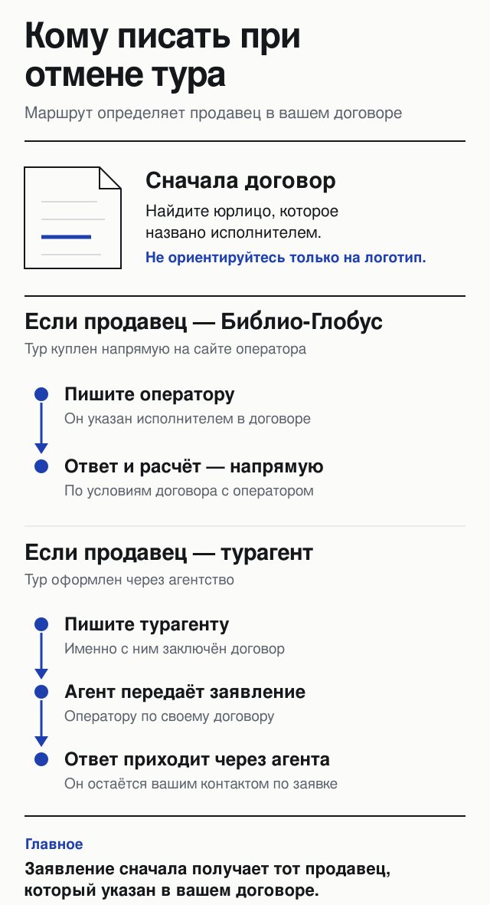
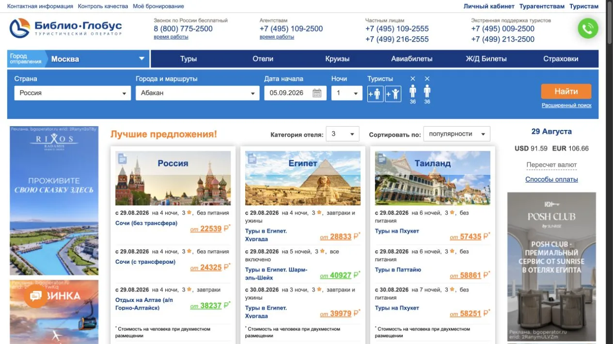
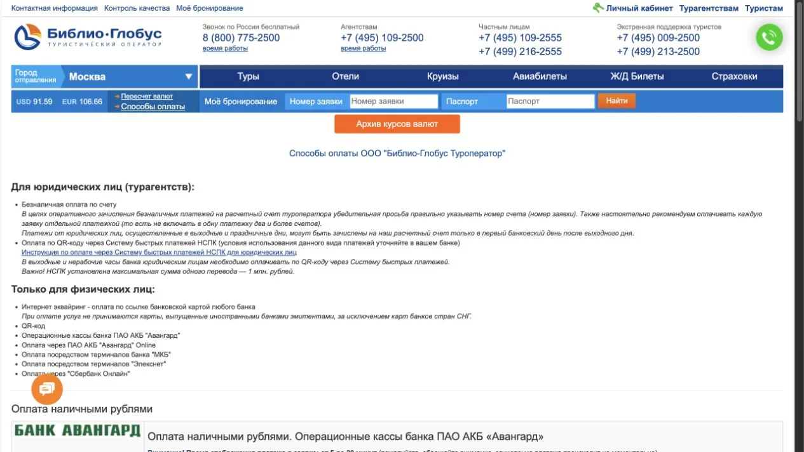
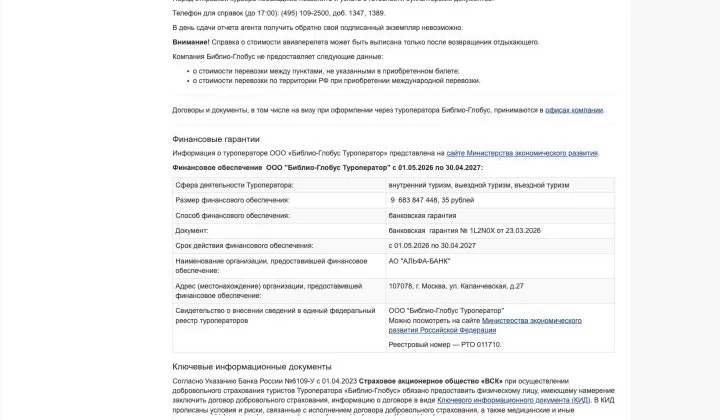

import AffiliateNote from '../../components/post/AffiliateNote.astro';
import { TP_LINKS } from '../../data/affiliate.js';

29 августа 2026 года Библио-Глобус показывал туры из Москвы **от 22 539 ₽ на человека**. Это не цена поездки на двоих: звёздочка под витриной уточняла, что сумма рассчитана на одного при двухместном размещении.

Главная проверка перед оплатой — не логотип, а **имя продавца в вашем договоре**. При прямой покупке это может быть ООО «Библио-Глобус Туроператор», а при покупке в агентстве договор заключает турагент от своего имени. Именно продавцу турист подаёт заявление об отмене и задаёт вопросы о возврате.

> **Если коротко:** цены на витрине реальны только для указанных даты, города вылета, числа ночей и состава туристов. До оплаты сохраните лист бронирования, проверьте перевозчика, багаж, трансфер, питание и условия аннуляции. Публичная шкала расходов Библио-Глобуса лежит в договоре с агентами; переносить её на туриста автоматически нельзя — итог задают договор туриста и фактические расходы по его заявке.

<AffiliateNote />

## Кто продаёт тур: Библио-Глобус или агентство?

Библио-Глобус — туроператор с реестровым номером **РТО 011710**. На [официальной странице договоров и гарантий](https://www.bgoperator.ru/docs.shtml?action=pc&lsec=140820745138&section=140810029955), повторно проверенной 30 августа 2026 года, указаны три сферы: внутренний, въездной и выездной туризм.

Способ продажи меняет путь денег и документов. Пункт 1.2 [агентского договора от 13 августа 2026 года](https://www.bgoperator.ru/pr_img/1000512/20260813/14335622/Agentskii_dogovor_-PDF.pdf) говорит, что турагент заключает сделки с клиентами **от своего имени**. Туроператор бронирует отели, перевозку, страховку и другие услуги по заявке агента.

Прямая покупка тоже предусмотрена: [страница оплаты](https://www.bgoperator.ru/docs.shtml?action=pay) отдельно описывает физлиц, которые забронировали тур онлайн в интернет-магазине Библио-Глобуса. Поэтому до платежа ответьте на один вопрос: кто назван исполнителем в договоре, который вы принимаете?

## Какие цены были на витрине 29 августа 2026 года?

Официальная главная страница показывала короткие предложения без названия конкретного отеля. Во всех строках цена стояла **на одного человека при двухместном размещении**, что было указано под каждой группой карточек.

| Направление | Старт | Ночей | Категория и питание | Цена на человека |
|---|---:|---:|---|---:|
| Сочи, без трансфера | 29.08.2026 | 4 | 3★, без питания | от 22 539 ₽ |
| Хургада | 29.08.2026 | 4 | 3★, завтрак и ужин | от 28 833 ₽ |
| Анталья | 29.08.2026 | 3 | 3★, завтрак и ужин | от 34 879 ₽ |
| Пхукет | 29.08.2026 | 6 | 3★, без питания | от 57 435 ₽ |
| Абхазия через Сочи, без трансфера | 29.08.2026 | 4 | 3★, без питания | от 22 912 ₽ |
| Бали, прямой перелёт | 10.09.2026 | 9 | 3★, завтрак | от 127 379 ₽ |
| Мальдивы, прямой перелёт и багаж 23 кг | 29.08.2026 | 4 | 3★, без питания | от 132 759 ₽ |

*Замер [официальной витрины](https://www.bgoperator.ru/) 29 августа 2026 года, город вылета — Москва. Это снимок рынка, а не обещание цены на другую дату. Название отеля, тип номера и точный состав пакета появляются после перехода к подбору.*

Суммы нельзя честно сравнить по одной колонке. Четыре ночи без питания в Сочи и девять ночей с прямым перелётом на Бали — разные продукты. Полезное сравнение начинается после выбора одного отеля, одинакового номера, питания, рейса, багажа и трансфера.

## Почему цена может измениться после поиска?

Система бронирования показывает предложения в текущем режиме. Пункт 2.4.5 агентского договора определяет её как онлайн-систему со стоимостью турпродуктов и услуг, а пункты 3.4–3.5 связывают оплату с листом бронирования и подтверждением заявки.

На сайте 29 августа стоял внутренний курс **91,59 ₽ за доллар и 106,66 ₽ за евро**. Курс вынесен рядом с поиском, а отдельная ссылка ведёт в архив. Для рублёвого бюджета важна сумма в подтверждённом листе бронирования, а не пересчёт по курсу Банка России из головы.

Перед оплатой сохраните три числа: цену на карточке, сумму в листе бронирования и сумму платежа. Если они различаются, попросите продавца письменно объяснить состав разницы.

## Чем физлицо может оплатить тур?

На [официальной странице оплаты](https://www.bgoperator.ru/docs.shtml?action=pay), повторно проверенной 30 августа 2026 года, для физических лиц перечислены банковская карта по ссылке, QR-код, кассы и онлайн-банк «Авангард», терминалы МКБ и «Элекснет», «Сбербанк Онлайн» и наличные рубли.

Для интернет-эквайринга есть две оговорки. Иностранные карты не принимаются, кроме карт банков стран СНГ. При прямом онлайн-бронировании разовый платёж картой ограничен **500 000 ₽**.

Для терминалов МКБ и «Элекснет» страница отдельно пишет, что комиссия с плательщика не взимается. Это утверждение относится к названным способам, а не ко всем банковским переводам.

## Что договор говорит об отмене тура?

Публичный документ — договор между туроператором и турагентом, не готовый договор с туристом. Это ограничение принципиально: проценты ниже показывают отношения оператора с агентом и служат ориентиром риска, но не заменяют расчёт по вашему договору.

Пункты 4.2–4.3 агентского договора называют **примерные** фактически понесённые расходы:

| До начала поездки | В договоре оператора с агентом |
|---|---:|
| 0–3 дня | до 100% |
| 4–7 дней | до 75% |
| 8–14 дней | до 30% |
| 15–21 день | до 20% |
| 22 дня и больше | 20 у.е. |
| 22 дня и больше по России и Абхазии | 500 ₽ |

Окончательный размер, по пункту 4.3, определяется в каждом случае. Для дат высокого сезона — 20 декабря–15 января, 24 марта–10 апреля, 25 апреля–15 мая и июль–сентябрь — расходы могут составить **100% независимо от срока**. Это не безусловная сумма к удержанию с туриста: продавец должен связать расчёт с конкретной заявкой и договором.

Отдельный риск — перелёт. Пункт 4.7 говорит, что стоимость авиаперевозки по специальным договорным тарифам при аннуляции не возвращается, а часть внутренних авиабилетов за рубежом нельзя обменять или переписать.

## Когда заявление считается полученным?

По пункту 4.1 агент направляет заявление оператору через личный кабинет. Датой аннуляции считается день получения с **10:00 до 19:00 по Москве в рабочий день**.

Для туриста практический порядок такой:

1. Найдите продавца и канал отмены в своём договоре.
2. Отправьте заявление письменно и сохраните подтверждение времени.
3. Запросите расчёт возврата по строкам: отель, перевозка, страховка, услуги продавца.
4. Не считайте молчание отменой: в договоре оператора отсутствие заявления означает, что заявка продолжает действовать.

Если покупали через агентство, не перепрыгивайте через него: по публичному договору именно агент передаёт оператору заявление и отвечает перед клиентом за отсутствие такого заявления.

## Защищены ли деньги финансовой гарантией?

На [официальной странице компании](https://www.bgoperator.ru/docs.shtml?action=pc&lsec=140820745138&section=140810029955) 30 августа 2026 года указана банковская гарантия АО «Альфа-Банк» на **9 683 847 448,35 ₽**. Срок финансового обеспечения — с 1 мая 2026 года по 30 апреля 2027 года, номер документа — 1L2N0X от 23 марта 2026 года.

Там же стоит реестровый номер **РТО 011710** и ссылка на Министерство экономического развития. Финансовая гарантия подтверждает наличие обеспечения, но сама по себе не обещает мгновенный возврат при обычной отмене: сначала действует порядок из договора с продавцом.

## Что проверить до платежа?

- **Продавец:** полное юрлицо и реквизиты в договоре.
- **Туроператор:** Библио-Глобус и РТО 011710 в приложении к договору или листе бронирования.
- **Состав пакета:** отель, категория номера, питание, трансфер, страхование, рейс и багаж.
- **Цена:** общая сумма за всех туристов, валюта заявки, курс и график доплаты.
- **Подтверждение:** что произойдёт, если отель или рейс не подтвердятся.
- **Отмена:** канал заявления, время его получения и порядок расчёта фактических расходов.
- **Документы:** срок выдачи ваучера, билетов, страховки и визовых документов.

Скрин карточки не заменяет договор, но помогает доказать, какой набор услуг показывала витрина. Сохраняйте не рекламный баннер, а лист с конкретным отелем, рейсом и итоговой суммой.

## Кому Библио-Глобус не подходит?

- **Тем, кому нужна одна фиксированная цена до выбора отеля.** Главная показывает цену «от» на человека, а полный пакет раскрывается глубже.
- **Тем, кто планирует легко менять даты и фамилии.** Агентский договор оформляет изменения через новую заявку или платную модификацию; возможность зависит от поставщика.
- **Тем, кому нужна предсказуемая отмена.** Публичная шкала примерная, а итог считают по конкретной заявке.
- **Тем, кто платит картой банка вне России и СНГ.** Официальная страница оплаты такие карты исключает.
- **Тем, кто не готов разбираться, кто продавец.** При покупке через агентство заявление и возврат идут через него.

Кому подходит: человеку, который хочет пакет с перелётом и готов сверить лист бронирования, договор и условия тарифа до платежа.

## Где сравнить тур с предложениями других операторов?

Библио-Глобус не платит TravelTribe за эту статью. Ссылки ниже партнёрские: если по ним оформить тур, блог получит комиссию, а цена для читателя не изменится.

<a href={`${TP_LINKS.travelata}&sub_id=biblio_globus_2026_body`} class="aff-cta" rel="sponsored">Сравнить пакетные туры на свои даты</a> — Travelata показывает предложения нескольких туроператоров и принимает карты российских банков.

Сравнивайте не название направления, а одну строку: тот же отель, номер, питание, дата, длительность, рейс, багаж и трансфер. Если состав различается, разница в цене ничего не говорит о наценке продавца.

Подробно экономика площадки разобрана в статье о том, [из чего складывается цена тура у Travelata](/blog/travelata-2026/). Для самостоятельной сборки поездки есть отдельные проверки [сборов Авиасейлса](/blog/aviasales-2026/) и [цен отелей на Островке](/blog/ostrovok-2026/).

## FAQ — частые вопросы о Библио-Глобусе

**Библио-Глобус — туроператор или турагентство?**
Туроператор. На официальной странице указан реестровый номер РТО 011710. При покупке через турагентство оно заключает договор с туристом от своего имени, а оператор формирует пакет по заявке агента.

**Можно ли купить тур напрямую?**
Да. Страница оплаты описывает физлиц, забронировавших тур онлайн в интернет-магазине. Перед платежом проверьте, что исполнителем в договоре указано ООО «Библио-Глобус Туроператор».

**Цена на главной указана за одного или за двоих?**
За одного человека при двухместном размещении. 29 августа 2026 года эта оговорка стояла под каждой группой предложений.

**Можно ли оплатить картой российского банка?**
Да. Официальная страница перечисляет оплату по ссылке картой, QR-код и несколько офлайн-каналов. Для прямой онлайн-оплаты картой указан предел 500 000 ₽ за один платёж.

**Сколько удержат при отмене?**
Без конкретной заявки ответить нельзя. Договор оператора с агентами даёт примерный диапазон от 20 у.е. или 500 ₽ до 100% и прямо говорит, что окончательные расходы определяются отдельно по каждому случаю.

**Куда подавать заявление об отмене?**
Продавцу из вашего договора. Если тур куплен через агентство, оно передаёт заявление оператору через личный кабинет; рабочее окно получения у оператора — 10:00–19:00 по Москве.

**Есть ли у Библио-Глобуса финансовое обеспечение?**
Да. На 30 августа 2026 года компания указывала банковскую гарантию на 9 683 847 448,35 ₽ со сроком действия до 30 апреля 2027 года.

<a href={`${TP_LINKS.travelata}&sub_id=biblio_globus_2026_final`} class="aff-cta" rel="sponsored">Проверить цены нескольких туроператоров</a> — задайте одинаковые даты и состав туристов, затем сверяйте отель, рейс, багаж и условия отмены строка к строке.

*Скриншоты и цены сняты на официальном сайте Библио-Глобуса 29 августа 2026 года; документы и условия оплаты повторно проверены 30 августа. Личного опыта покупки тура у этого оператора у автора нет; выводы основаны на публичных документах и собственной проверке витрины. Цены меняются в течение дня. Материал не заменяет разбор договора с юристом.*
