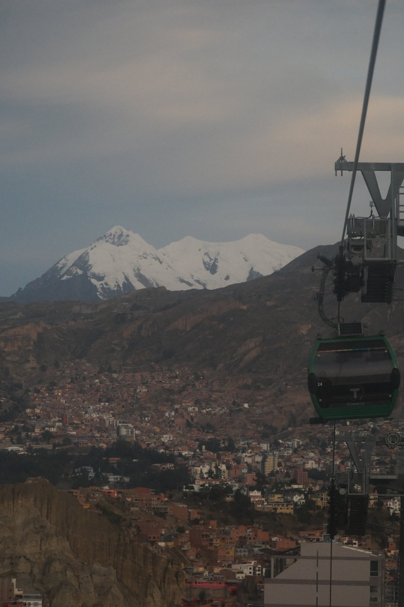
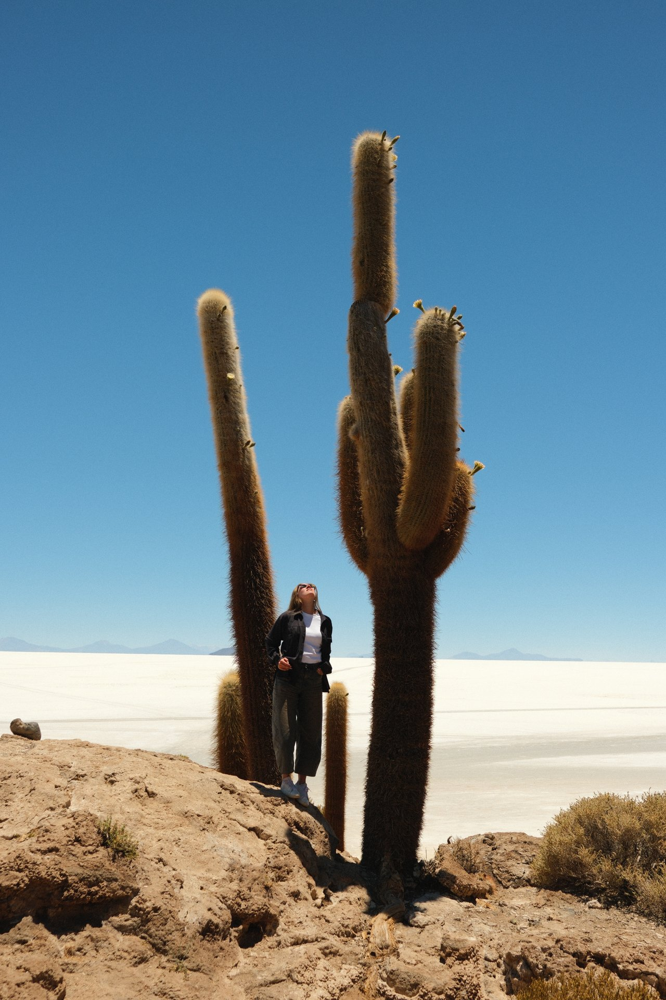
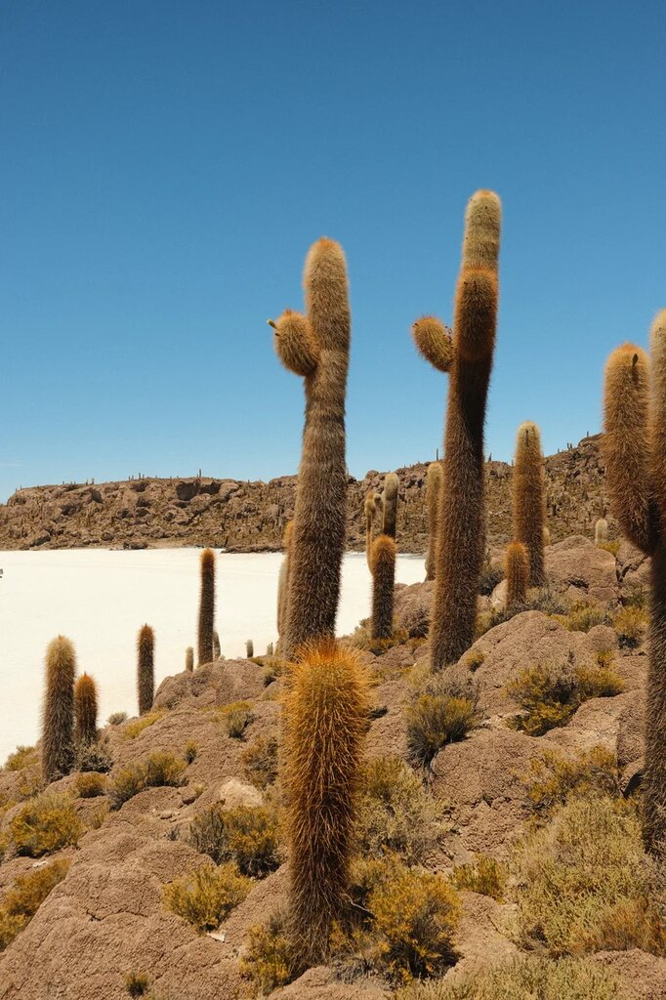
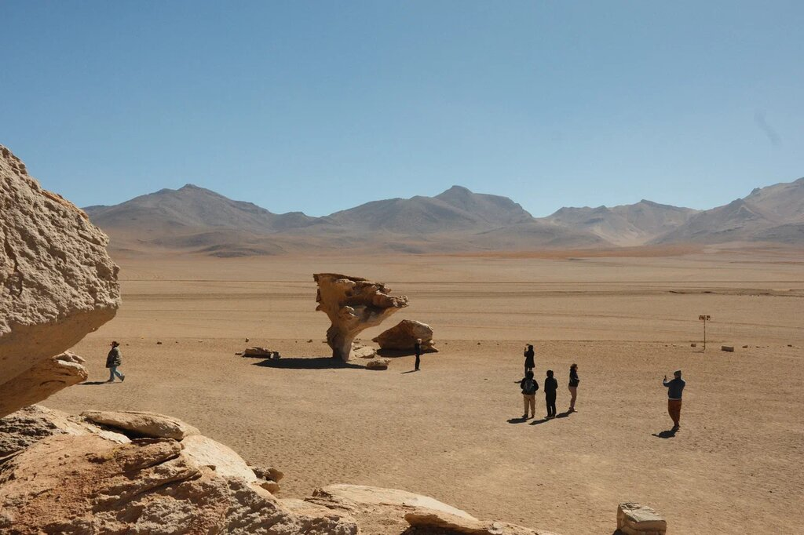
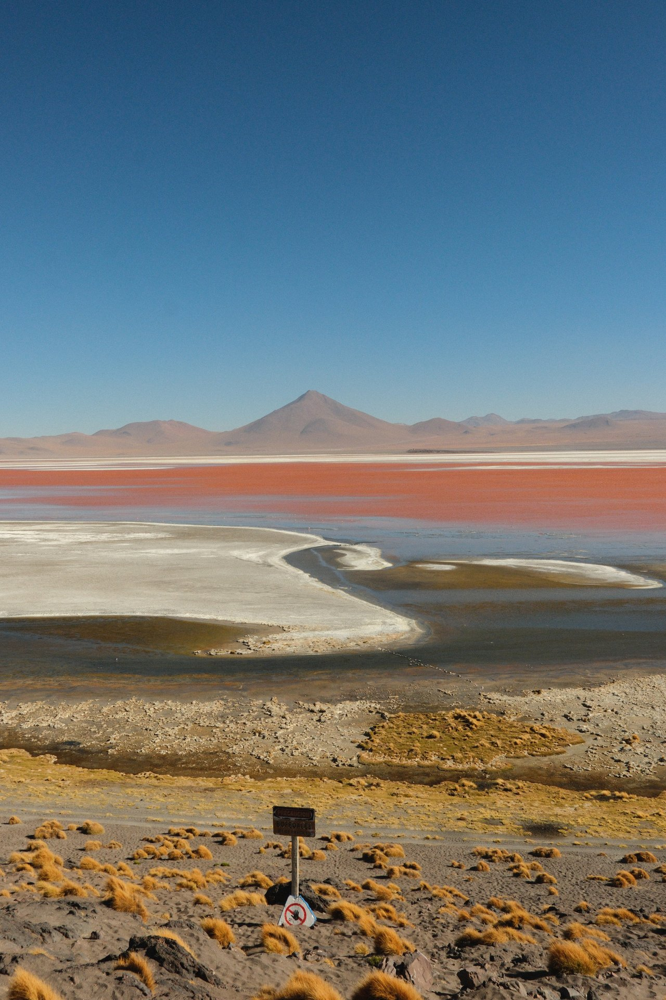
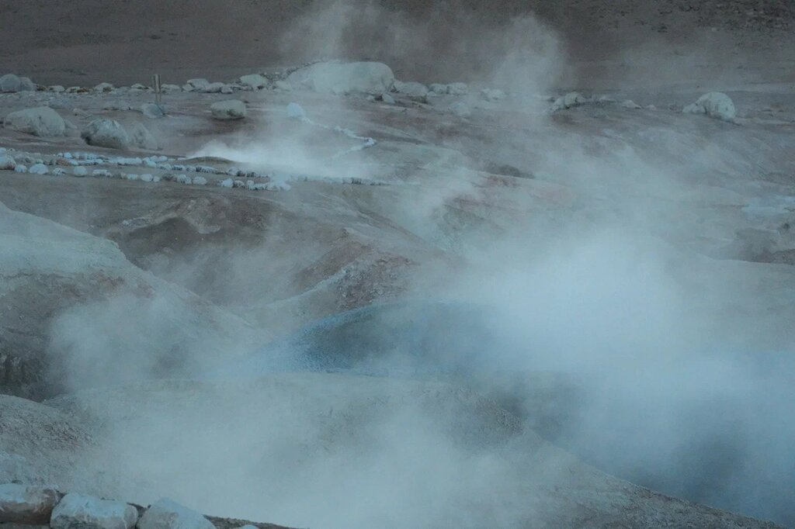

import PricingCards from '../../components/post/PricingCards.astro';
import AffiliateNote from '../../components/post/AffiliateNote.astro';

Я приехал на 9 дней в 2025 — высота ломала первые сутки, но Уюни оправдал. Ла-Пас на 3640 м — самая высокогорная столица в мире, **Салар-де-Уюни** в сезон дождей превращается в зеркало размером с пол-Москвы, а в Потоси испанцы 250 лет качали серебро такими темпами, что инфляция охватила всю Европу. Безвиз 90 дней с 2024, 3-дневный тур по солончаку — от $130.

> **Если коротко:** россиянам **виза не нужна** (90 дней безвиз с 2024). Главные точки — **Салар-де-Уюни** (зеркало в декабре–апреле, сухие шестигранники в мае–ноябре), **Ла-Пас** на 3640 м, **Потоси** и **Сукре** (колониальная архитектура, климат мягче). Бюджет 8–10 дней без перелёта из Москвы — от **$700** (бэкпекинг) до **$2000+** (тур-агрегаторы, 3*).

> **Когда лучше ехать в Боливию:** см. [таблицу сезонов](/seasons/). Зеркало на солончаке — **январь–март**, иногда апрель. Сухие восьмиугольники соли — **май–октябрь**. Высокий сезон туристов — **июль–август** (тёплая погода в Альтиплано и каникулы во всём мире). Низкий — февраль (сезон дождей в Амазонии и риск наводнений).

<AffiliateNote />

---

## Нужна ли виза в Боливию россиянам в 2026?

С июня 2024 Боливия отменила визу для граждан России для туристических визитов до 90 дней в течение года (по данным [МИД РФ](https://www.mid.ru/) и посольства Боливии в РФ на 2025 — проверять перед поездкой). Требуется загранпаспорт со сроком действия 6+ месяцев, обратный билет, бронь отеля или приглашение и финансовое подтверждение (~$50/день — по отзывам туристов в 2025, требования миграционной службы могут меняться).

**Жёлтая лихорадка** — обязательна для въезда в боливийскую часть Амазонии и национальные парки в низменности (Мадиди, Ноэль-Кемпфф). Сертификат — в международном жёлтом паспорте (CDC), действует пожизненно после одной прививки. На границу с тропиками иногда проверяют, на въезде в Альтиплано — нет.

## Сезоны — главное про Салар-де-Уюни

| Период | Состояние солончака | Альтиплано | Низменность |
|---|---|---|---|
| **Декабрь⁠–⁠март** | ★ Зеркальный эффект (после дождей) | Влажный сезон, +15 °C | Жарко и влажно, +30 °C |
| Апрель | Переходный, ещё могут быть лужи | Идеально для треков | Конец дождей, мутные реки |
| **Май⁠–⁠октябрь** | ★ Сухие шестигранники, пейзаж как Марс | Сухо, ночью до −10 °C | Сухо, +25 °C, лучше для джунглей |
| Ноябрь | Начало дождей, переходный | +12 °C, ясно | Жарко, начинаются дожди |

**Зеркальный эффект** — главная фишка Уюни. Солончак заливается водой 5–15 см после дождей, и небо отражается идеально. Лучшие месяцы — **январь–март** (особенно после ливней). Но: дороги от Уюни до западных лагун (Колорада, Верде) могут быть размыты, иногда туры частично отменяются.

**Сухой сезон** — пейзаж совсем другой: 10 000 км² белой плоскости с шестигранными ячейками соли, горизонт виден на 40+ км, делать «эффект перспективы» (фигуры на ладони, фотографии с дронов).

## Логистика тура Уюни — что выбрать

Туристические агентства в Сан-Педро-де-Уюни делятся на 3 категории — разница в безопасности, водителе и комфорте сильнее, чем в маршруте.

**Эконом ($110–140 за 3 дня):** Esmeralda, Atacama Mistica, Andes Travel. Машина Toyota Land Cruiser 1990-х, 6 пассажиров. Водитель часто говорит только по-испански. Питание простое (рис + курица + яичница). Ночёвки в общежитии. **Риск:** машины старые, ломаются раз в 5-й тур; по отзывам на TripAdvisor и форуме Винского за 2024–2025, у эконом-агентств жалобы на состояние водителей по утрам. Подходит если бюджет жёсткий и есть резерв времени.

**Mid-tier ($170–230):** Red Planet, Quechua Connection, Cordillera Traveller. Машины 2010-х, 4 пассажира максимум, водитель говорит на английском, нормальное питание (вегетарианский вариант, продукты с собой), ночёвки в гостевых домах с горячей водой. **Лучший выбор для большинства.** Бронировать **за 2–4 недели** в высокий сезон.

**Premium ($300–500):** Kanoo Tours, Bolivia Hop, Salty Desert Adventures. Машина Land Cruiser 2020+, 3 пассажира, англоязычный гид-биолог, премиум-обед на солончаке (стол с вином), отель из соли Cristal Samaña + Tayka del Desierto в Альтиплано. Подходит если бюджет >$2000 на тур и не готов спать в общежитии на 4280 м.

## Что взять с собой на 3-дневный тур

В машину помещается чемодан + рюкзак на пассажира — оставлять багаж в Уюни (отели хранят бесплатно) или брать в тур по необходимости.

- **Тёплая одежда:** ночью на 4280 м до −10 °C даже летом. Куртка-пуховик + термобельё + шапка + перчатки + 2 пары шерстяных носков. Спальный мешок не нужен — в гостевых домах одеяла толстые, но **холодно**.
- **Солнцезащита:** SPF50+ (UV на 4000–5000 м максимальный), солнцезащитные очки с боковыми створками (соль слепит как снег), бальзам для губ.
- **Купальник + полотенце** — горячие источники Поломе обязательно.
- **Перекус и вода:** 3 литра минимум. На рынке Уюни продают энергетические батончики и сухофрукты.
- **Наличные** — $50 в боливьянос на чаевые гиду + сувениры на лагунах ($30–50 на 3 дня).
- **Power bank 10 000 мАч** — заряжать в машине нельзя, в гостевых домах розетки часто работают только до 22:00.

## Маршрут на 8–10 дней — классика

1. **Ла-Пас** (2 дня) — акклиматизация. Канатная дорога **Mi Teleférico** (одна из самых высоких в мире — 10 линий, до 4100 м), Долина Луны, рынок ведьм, El Alto в воскресенье — крупнейший рынок Латинской Америки.

2. **Тиуанаку** (день из Ла-Паса) — доинкская цивилизация, Ворота Солнца. Автобус 1.5 ч, $5.
3. **Потоси** (1 день) — Серро-Рико, шахты XVI века (тур $25, физически тяжело — пыль, тесно, есть риск подхватить туберкулёз). Город на 4090 м.
4. **Сукре** (1–2 дня) — белый колониальный город, ЮНЕСКО, на 2800 м (легче дышать). Динозавровые следы Cal Orcko.
5. **Тур по Уюни 3 дня / 2 ночи** — главная точка маршрута. Стандартный маршрут: солончак → Isla Incahuasi (кактусовый остров) → лагуна Колорада (фламинго) → лагуна Верде → гейзеры Соль-де-Маняна → выход в Чили (Сан-Педро-де-Атакама) или возврат в Уюни. Цены $130–$250.

**Альтернатива** — **выезд в Чили** (Атакама) после тура, объединить две страны. Граница около лагуны Верде, занимает день, нужна виза в Чили (россиянам не нужна с 2018, безвиз 90 дней).

## Что увидишь по пути — день за днём

Стандартный 3-дневный тур из Уюни в Сан-Педро-де-Атакама (Чили):

**День 1 — Солончак.** Старт 10:00 из Уюни. **Кладбище поездов** (заброшенные локомотивы начала XX века, 15 минут на фото). **Соляные шестигранники** на горизонте до 40 км. **Остров Инкауаси** — кактусовый остров посреди соли, треккинг 30 мин на вершину, оттуда виден солончак на 360°. **Обед на белом столе из соли**. К вечеру — **отель из соли** (стены, мебель, кровати — всё из соляных блоков). $90–250/ночь.

**День 2 — Лагуны и пустыня.** Подъём в 7:00. Первая остановка — **Сан-Кристобаль** (заброшенная серебряная шахта, $1.5 вход). Затем уровень поднимается с 3650 до 4500 м. **Лагуна Эдионда** (фламинго), **Лагуна Чиар-Хаута**, **Лагуна Канапа** — каждая своего цвета из-за разных минералов. По дороге между лагунами — гигантские **кактусы Альтиплано** на склонах вулканических холмов.

Дальше — **Древо из камня (Árbol de Piedra)** — гигантский каменный гриб от ветра в пустыне Сильоли.

К ночи — **Лагуна Колорада** (красная вода, тысячи фламинго трёх видов). Ночь в простом убежище на 4280 м, без отопления, термобельё критично.

**День 3 — Гейзеры и граница.** Подъём в 4:30. **Гейзеры Соль-де-Маняна** на 4900 м — пар плотнее всего на рассвете при −15 °C.

Потом **горячие источники Поломе** (можно купаться в +35 °C посреди пустыни). **Лагуна Верде** — последняя точка, изумрудная из-за мышьяковистых соединений (арсенопирит) + Ликанкабур-вулкан 5916 м на фоне. С границы трансфер 3 ч до **Сан-Педро-де-Атакама** (Чили), вещи едут с тобой.

## Сколько стоит поездка в Боливию на 9 дней?

Без международного перелёта из Москвы (~90 000–130 000 ₽ через Стамбул/Мадрид):

<PricingCards tiers={[
 { tier: 'Эконом', price: '$700', priceNote: '9 дней, бэкпекинг', emoji: '',
 features: [
 'Хостел $10–18/ночь',
 'Питание $10/день — almuerzo и комбини',
 'Внутр. автобусы $15–30 за рейс',
 'Тур по Уюни 3 дня — $130',
 'Эконом-агентство, машина 1990-х',
 ] },
 { tier: 'Средний', price: '$1 300', priceNote: '3*-отели, mid-tier тур', emoji: '',
 featured: true,
 features: [
 '3* отель $40–60/ночь',
 'Питание $25/день',
 'Внутр. перелёт LPB↔SRE↔UYU $90–120',
 'Тур по Уюни 3 дня — $200 (Red Planet)',
 '1 ночь в отеле из соли $90–150',
 ] },
 { tier: 'Комфорт', price: '$2 200+', priceNote: 'премиум-туры', emoji: '',
 features: [
 '4* отель $90–180/ночь',
 'Питание $50/день — рестораны',
 'Внутр. перелёт бизнес $120+',
 'Premium-тур Уюни 3 дня — $300+',
 'Luna Salada / Cristal Samaña $200–250',
 ] },
]} caption="Бюджет на 9 дней в Боливии — три уровня комфорта" />

**Цена отеля у солончака** в высокий сезон: **отель из соли** (Cristal Samaña, Luna Salada) — $90–250/ночь. Эконом-вариант — общежитие в Уюни от $20. Отели удобнее искать — <a href="https://ostrovok.tpk.mx/xtyTcUcY?erid=2VtzqvE1cv3" class="aff-cta" rel="sponsored">Забронировать отель в Боливии</a>: карты МИР принимает, в Боливии Booking из РФ недоступен.

**Или готовый тур** — если не собирать по частям. Пакет из Москвы — <a href="https://travelata.tpk.mx/Do2A3cgV?erid=2VtzqufPtiT" class="aff-cta" rel="sponsored">Подобрать тур в Боливию</a>: оплата картой МИР, цена сразу с перелётом.

## Как добраться в Боливию из Москвы в 2026?

Прямых рейсов нет. Реальные варианты:
- **Через Стамбул + Сан-Паулу + Ла-Пас** (Turkish + LATAM + Boliviana de Aviación) — $1100–1500, 32–38 часов в пути.
- **Через Дубай + Сан-Паулу** (Emirates + LATAM) — $1300–1700, 36 часов, комфортнее.
- **Через Мадрид** (любая до MAD + Air Europa MAD-LPB) — $1200–1700, единственный прямой Европа-Боливия.

Подобрать перелёт с пересадками удобнее всего так — <a href="https://aviasales.tpk.mx/JCSPlC17?erid=2Vtzqxkn4LF&u=https%3A%2F%2Fwww.aviasales.ru%2F%3Forigin_iata%3DMOW%26destination_iata%3DLPB" class="aff-cta" rel="sponsored">Найти билет Москва — Ла-Пас</a>: агрегатор сравнивает все авиакомпании и стыковки сразу (Стамбул, Сан-Паулу, Мадрид и комбинации в одной выдаче — удобно сопоставить цену и время в пути), cookie 30 дней — можно мониторить цену и забронировать позже.

Ла-Пас (LPB) расположен на 4060 м — самый высокий международный аэропорт мира. Резкий набор высоты с уровня моря — тяжело. Альтернатива: лететь сначала в **Санта-Крус (VVI)** на 416 м, оттуда внутренним рейсом в Ла-Пас или в Сукре с акклиматизацией.

Внутри Боливии: **Boliviana de Aviación (BoA), Amaszonas** — сеть рейсов между Ла-Пас, Сукре, Кочабамба, Санта-Крус, Уюни. Билеты $60–120, бронируй онлайн напрямую (Skyscanner иногда не находит мелкие рейсы).

## Что обязательно попробовать

Боливия — не гастрономическое чудо вроде Перу, но эти 6 блюд встретишь на каждом углу за $1–3:

- **Сальтенья** — слоёный пирожок с курицей/говядиной/желатиновым бульоном. Завтрак на ходу, $1–2.
- **Сильпанчо** — гигантский шницель с яичницей сверху, рисом и салатом. Кочабамба рулит в этом блюде.
- **Анти́кучо** — шашлычки из говяжьего сердца, аналог перуанского. Уличная еда, $2–3.
- **Mate de coca холодный** — чай из листьев коки в бутылках, в магазинах. Вкусный, легальный.
- **API морадо** — горячий пурпурный напиток из чёрной кукурузы с корицей. Утром на улицах Ла-Паса в +5 °C — спасение.
- **Сингани** — национальный виноградный спирт. В стиле писко, но боливийский. Коктейль **chuflay** (сингани + лимонад) — обязателен.

Кафе с туристическим меню в Сан-Педро-де-Уюни и Ла-Пасе: **Higher Ground** (Ла-Пас, бургеры $8), **Tica's** (Уюни, пицца $7).

## Что НЕ стоит делать

- **Не пить алкоголь в первые 48 ч** на 3650 м+. Простой пунш = головная боль на 12 часов.
- **Не бронировать самый дешёвый тур по Уюни** ($110–130) — машины старые Toyota Land Cruiser 1990-х; по отзывам туристов на TripAdvisor за 2024–2025, у эконом-агентств жалобы на состояние водителей и языковой барьер (только испанский). Платить $180–220 за middle-tier (Red Planet, Quechua Connection).
- **Не нести ценности в Ла-Пасе по улицам Эль-Альто** — район бедный, карманники работают активно.
- **Не пить водопроводную воду** даже в дорогих отелях — разные минералы, желудок не принимает. Бутилированная или с фильтром.
- **Не везти из Боливии листья коки** — конфискуют на таможне в РФ и большинстве стран.

## Здоровье и высота

Ла-Пас на **3640 м**, Потоси — **4090 м**, тур по Уюни проходит на **3650–4900 м**. Это серьёзно — горная болезнь у большинства туристов в первые 24–48 ч (по данным [CDC Yellow Book](https://wwwnc.cdc.gov/travel/yellowbook/2024/environmental-hazards/high-elevation-travel), частота AMS на 3500+ м — 25–75% в зависимости от скорости подъёма). Что работает:

- Прилететь сначала в **Сукре или Кочабамбу** (~2500 м) — день-два, потом подняться.
- Чай **mate de coca**, конфеты из листьев коки (легально в Боливии), листья жевать.
- **Diamox** по рецепту начинать за день до прилёта.
- Не пить алкоголь первые 48 ч.
- Таблетки от сороче (горной болезни) в боливийских аптеках — местное средство, работает.

В случае серьёзных симптомов (одышка в покое, гипоксия, отёк) — немедленно спускаться. В крупных отелях есть кислородные баллоны.

## Деньги, безопасность, связь

**Валюта** — боливиано (Bolivianos, BOB), курс ~6.9 за доллар. Карты МИР не работают; Visa/Mastercard — только в крупных отелях и торговых центрах. **Большая часть страны — наличные**. Банкоматы дают по $200/раз, комиссия $5.

**Безопасность** — относительно спокойно для Латинской Америки, но Ла-Пас (район Эль-Альто и центр) — следить за карманниками. Такси — только через приложение или из официальных стоянок. Ночные автобусы между городами — Trans-Copacabana, Bolivar — нормально.

**Интернет и SIM** — Tigo, Entel: турпак $10 на неделю, 5–10 ГБ. В горах и пустыне сигнала может не быть полностью.

## Что почитать дальше

- [Боливия — кратко: виза, сезоны, бюджет](/bolivia/) — краткая справка по стране
- [Сравнить Боливию с соседями](/seasons/) — Чили и Перу рядом по климату
- [Калькулятор бюджета на Боливию](/calculator/)
- [Виза в Боливию для россиян](/visa/bolivia/)
- [Боливия в мае 2026](/trips/may/bolivia/)

## FAQ

**Безопасно ли в Уюни в сезон зеркала?**
Дороги размыты, часть маршрутов сокращается, но сами туры идут. Главная опасность — холод (ночью до −15 °C на высоте 4500 м) и горная болезнь. Тёплая одежда обязательна.

**Сколько стоит трёхдневный тур по Уюни?**
Эконом-агентства в Уюни — от $130. Средний класс с обогревателем, лучшим питанием и опытным водителем — $180–220. Премиум (Kanoo Tours, Salty Desert Adventures) — $300–500. Бронировать на месте после прилёта в Уюни — обычно дешевле, но в высокий сезон (июль) лучше заранее.

**Можно ли совместить Уюни с Чили?**
Да, классический выход — через лагуну Верде в Сан-Педро-де-Атакама (Чили). Это 3-й или 4-й день тура, граница перед лагуной Верде. Вещи летят с тобой в джипе.

**Какой бюджет нужен на 10 дней Боливия + Уюни?**
Эконом — $800. Средний — $1500 (с внутренним перелётом и приличным отелем). Это без перелёта из России.
