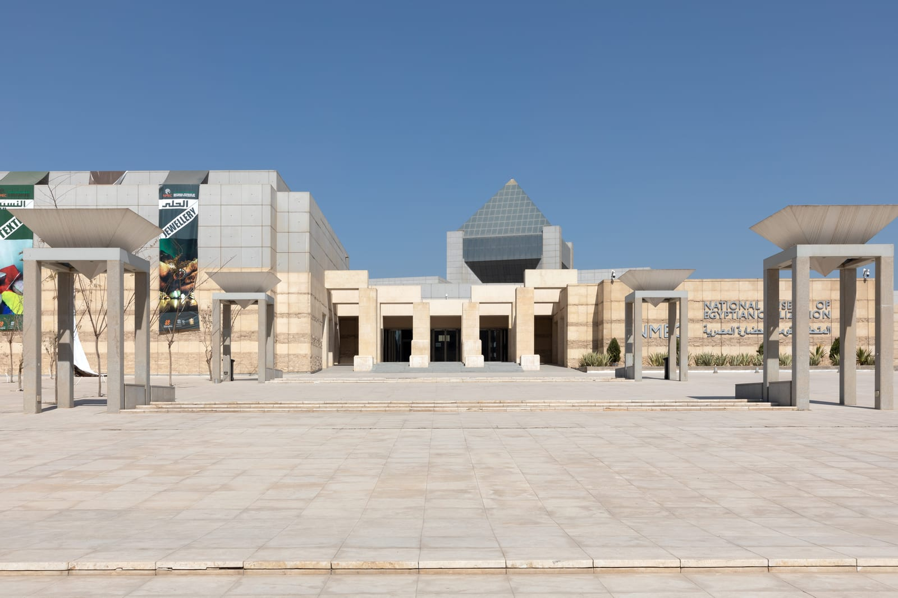
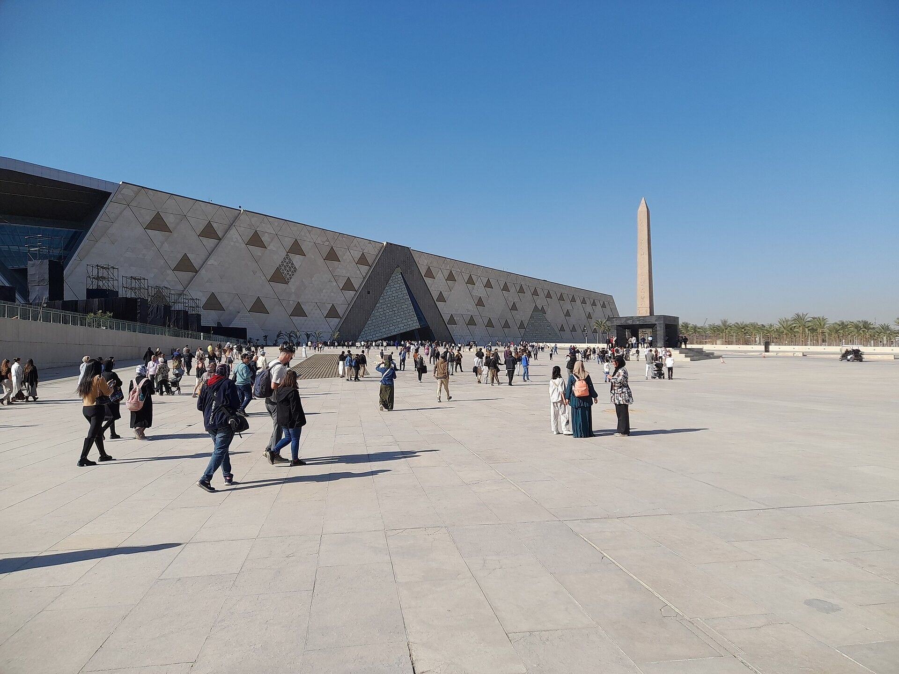
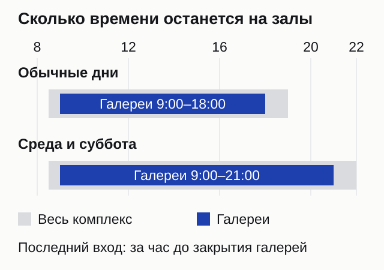
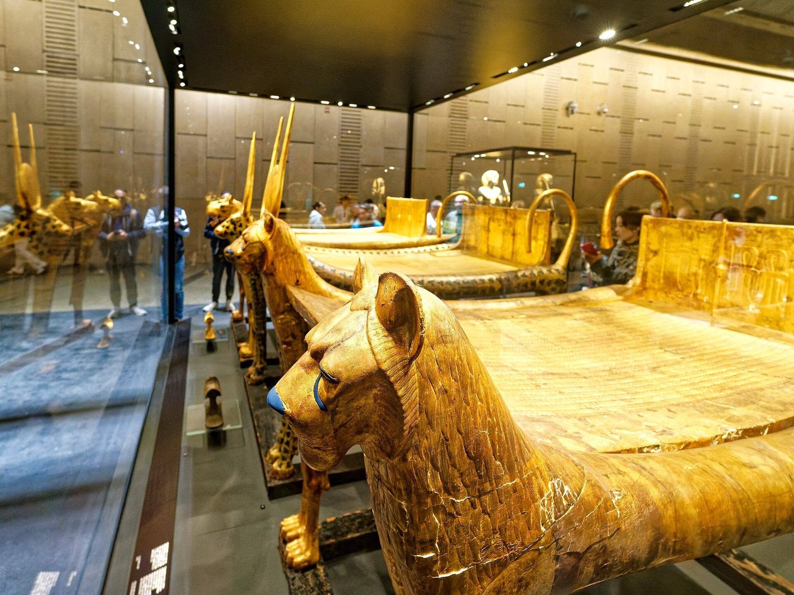
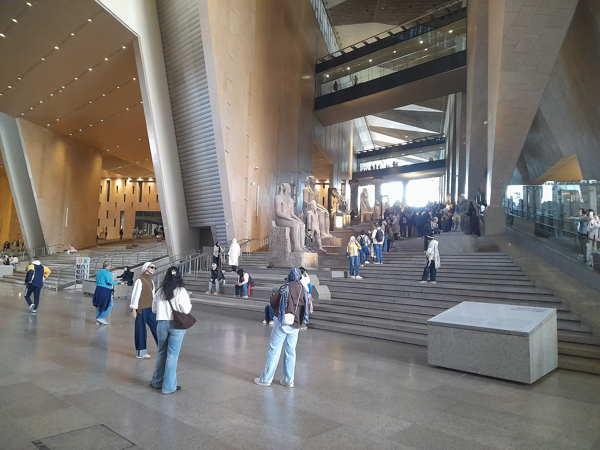
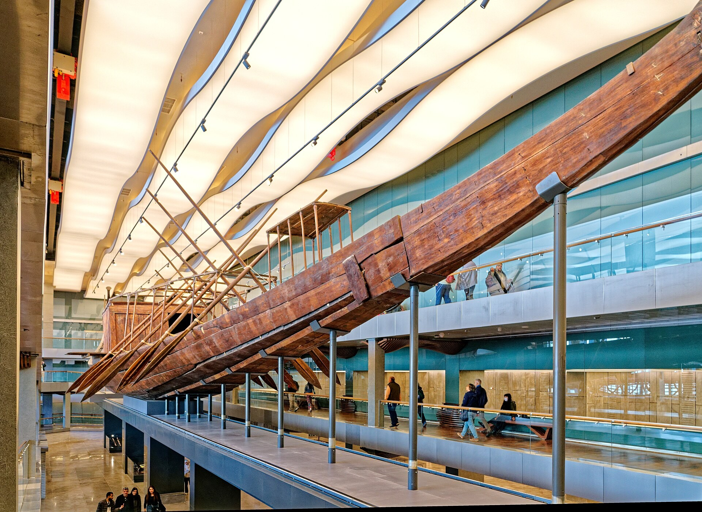
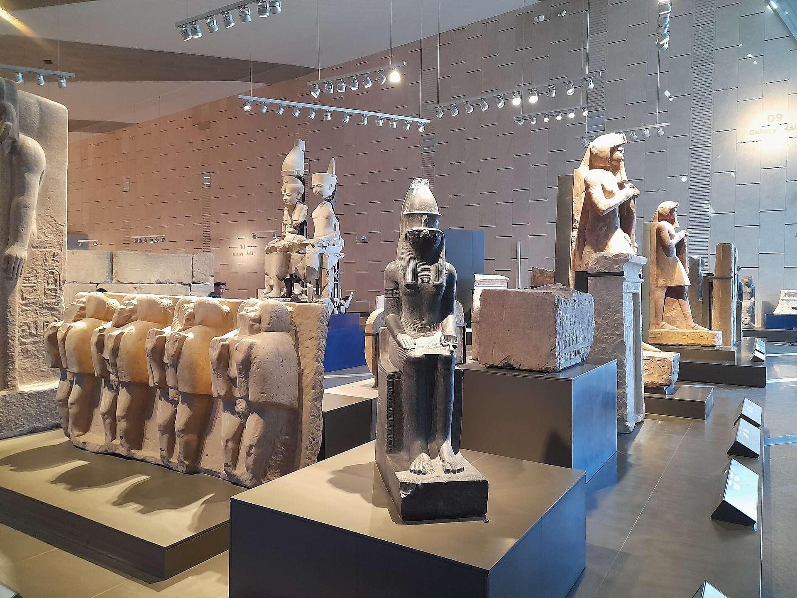

import { tpkDeep } from '../../data/affiliate.js';

export const gemTicket = tpkDeep('sputnik8', 'https://www.sputnik8.com/ru/cairo/activities/98711-bilet-v-bolshoy-egipetskiy-muzey-drevnie-artefakty-i-piramidy', 'bolshoy_egipetskiy_muzey_ticket');

**В Большой Египетский музей стоит отвести отдельные полдня: выбрать несколько главных залов и купить билет с временем входа заранее.** Взрослый билет для иностранца стоит 1 500 египетских фунтов — примерно 2 460 ₽. В него входят галереи Тутанхамона и музей ладей Хеопса. Пирамиды оплачиваются отдельно, а королевские мумии находятся в другом музее Каира.

GEM — сокращение от Grand Egyptian Museum. По-русски его называют Большим, новым Египетским музеем и музеем в Гизе. За этими названиями один комплекс у пирамид, но название «Египетский музей» в заказе такси или экскурсии может означать старое здание на площади Тахрир. С этого различия и начните подготовку: ошибка меняет весь день.

## Какой из трёх музеев нужен вам

**За коллекцией Тутанхамона, включая золотую маску, отправляйтесь в GEM; за залом королевских мумий — в NMEC.** Старый Египетский музей на Тахрире продолжает работать и тоже заслуживает отдельного визита. Эти названия не обозначают разные входы в один комплекс.

| Музей | Что выбрать целью визита | Где искать |
|---|---|---|
| Большой Египетский музей, GEM | Тутанхамон, статуя Рамзеса II, Большая лестница, ладья Хеопса | Гиза, рядом с районом пирамид |
| Национальный музей египетской цивилизации, NMEC | Зал королевских мумий | Фустат, южная часть Каира |
| Египетский музей, Egyptian Museum | Историческое здание, палетка Нармера, сокровища Таниса | Площадь Тахрир, центр Каира |

Если на Каир есть один музейный день, выбирайте по экспонату, ради которого приехали. Маску Тутанхамона и королевские мумии нельзя посмотреть по одному входному билету. Совмещать два музея имеет смысл тому, кто заранее решил, что ищет: иначе переезд и второй большой зал съедят силы раньше, чем закончится день.

*NMEC — другой адрес и другой билет.*

## Сколько стоит вход и что покупать

Для самостоятельного осмотра выбирайте **Admission** на [официальном сайте билетов GEM](https://tickets.gem.eg/). Российскому туристу подходит категория Arab or Other Nationality. Тарифы для граждан и резидентов Египта к обычной туристической поездке не относятся.

| Билет иностранного посетителя | Цена | Ориентир в рублях |
|---|---:|---:|
| Взрослый | 1 500 EGP | 2 460 ₽ |
| Ребёнок 6–12 лет | 750 EGP | 1 230 ₽ |
| Студент 13–24 лет с действующим студенческим удостоверением | 750 EGP | 1 230 ₽ |
| Ребёнок младше 6 лет | Бесплатно | — |

Два взрослых и ребёнок восьми лет заплатят за обычный вход 3 750 EGP, около 6 150 ₽. Это только музей: без дороги, обеда и гида. Рублёвые суммы помогают прикинуть бюджет; списание с карты зависит от конвертации банка или продавца.

Студенческую скидку не стоит выбирать только по возрасту. Нужен действующий документ, который проверят на входе; для подростка без него заранее уточните категорию у музея. Посетителю 25 лет не стоит закладывать студенческий тариф в бюджет: форма указывает студенческий диапазон до 24 лет.

Обычный билет включает основные галереи, галереи Тутанхамона, Большой зал, Большую лестницу, музей ладей Хеопса и доступную территорию комплекса. Экскурсия, детские занятия и специальные программы — отдельные продукты. Сравните состав предложений: другое название на витрине не повод повторно оплачивать вход в основную экспозицию.

## Как купить билет из России

На официальном сайте последовательность такая: дата, категория посетителя, число билетов, время входа. Сначала согласуйте день с остальными планами в Каире и только потом платите. Обычный билет привязан к дате и слоту, не передаётся другому человеку и не возвращается. Выйти за пределы входного контроля и затем вернуться по тому же билету тоже нельзя.

Российская Visa или Mastercard для платежа на иностранном сайте не подойдёт. Если есть иностранная карта, оформляйте билет непосредственно у музея; успешное списание всё равно зависит от банка. После покупки сохраните сам билет с кодом в телефоне так, чтобы открыть его без интернета. Письмо «заказ получен» у посредника ещё не обязательно является входным билетом.

При оплате российской картой есть другая возможность: <a href={gemTicket} rel="sponsored">входной билет в GEM на Sputnik8</a>. Сервис принимает рубли и карты «Мир», Visa и Mastercard. У этого предложения вход в постоянные экспозиции, без гида и еды; возврат не предусмотрен. Цена продавца может быть выше официальной, поэтому сравните итоговую сумму перед оплатой. Не покупайте оба варианта сразу.

У посредника отдельно проверьте, когда пришлют код и к какому времени он относится. Если планируете идти завтра, обещание «пришлём позже» нужно уточнить до оплаты. Самостоятельный визит начинается с полученного билета на нужную дату, а не с готовности банковской карты.

*Входная площадь GEM.*

## На какое время брать билет

**Слот означает промежуток, когда вас впустят, а не время, к которому нужно покинуть музей.** Например, выбрав вход с 11:00 до 13:00, вы не обязаны закончить осмотр в час дня. Оставаться можно до закрытия доступных галерей.

| День | Галереи | Весь комплекс | Последний вход |
|---|---|---|---|
| Понедельник, вторник, четверг, пятница, воскресенье | 09:00–18:00 | 08:30–19:00 | 17:00 |
| Среда и суббота | 09:00–21:00 | 08:30–22:00 | 20:00 |

*Светлая полоса — время работы комплекса, синяя — галерей. Час после закрытия залов не добавляет времени на коллекцию.*

Для первого посещения удобен ранний слот: впереди больше свободных часов и проще сократить программу, если устанете. Это не обещание пустых залов. У популярных витрин могут собираться группы в любое время, а точную длину очереди заранее не предскажешь.

Вечер среды или субботы подходит для спокойного музейного дня после позднего завтрака. Но вход в 20:00 оставляет всего час на галереи — слишком мало для первого знакомства. Продлённый день полезен, когда вы приезжаете заранее и действительно используете дополнительные часы. В праздничные даты сверяйте календарь при покупке: общий недельный режим может меняться.

## Как распределить время внутри

На первый визит я бы заложил **четыре-пять часов с перерывом**, а для подробного осмотра — больше. Это планировочная оценка: скорость чтения подписей, очереди к отдельным витринам и интерес к конкретной эпохе у всех разные. Не пытайтесь делить всё количество экспонатов на оставшиеся минуты.

Начните с Большого зала и статуи Рамзеса II: здесь удобно понять масштаб здания и договориться, где встретиться, если разделитесь. Затем выбирайте главную цель. Если приехали ради Тутанхамона, не оставляйте его галереи на последние полчаса — желание «сначала быстро пройти остальное» в таком музее легко затягивается.

*Коллекция Тутанхамона интересна и за пределами золотой маски.*

В галереях Тутанхамона есть трон, диадема, сосуды и множество вещей, позволяющих рассматривать не только царское погребение, но и отдельные предметы жизни. Выберите несколько витрин и задержитесь у них. Такой осмотр обычно оставляет больше воспоминаний, чем непрерывная съёмка каждой следующей вещи через плечи соседей.

Большая лестница тоже относится к экспозиции. Её стоит включить в маршрут осмысленно, а не воспринимать только как переход между этажами. Если длительный подъём неудобен, воспользуйтесь доступным маршрутом с лифтами и попросите сотрудника показать нужное направление. Заодно уточните путь к следующей коллекции: самостоятельный круг по огромному зданию не всегда экономит время.

*Большая лестница — часть экспозиции музея.*

Ладью Хеопса оставьте самостоятельной частью визита. Для ребёнка, которому надоели небольшие предметы за стеклом, целый корабль может оказаться понятнее очередной витрины. Но обещать одинаковый восторг всей семье не стоит: сначала посмотрите, сколько сил осталось после основных залов.

Практический выбор программы выглядит так:

| Ваше время | Что поставить в центр | Честное ограничение |
|---|---|---|
| Около двух часов | Большой зал и одна главная коллекция, например Тутанхамон | Это выборочный осмотр; остальные галереи придётся пропустить |
| Четыре-пять часов | Тутанхамон, лестница, ладья, часть основных галерей и перерыв | Даже так не получится внимательно рассмотреть всё |
| Почти весь день | Несколько коллекций без спешки, с обедом внутри комплекса | Нужны силы на много ходьбы; второй крупный объект лучше не добавлять |
| Взрослый с ребёнком | Две заранее выбранные цели и короткие остановки | Завершить раньше — нормальный исход, а не потерянный билет |

Это не жёсткий порядок залов. Возьмите план на месте и меняйте последовательность, если у нужной витрины скопилась группа. Договорённость «сегодня смотрим Тутанхамона и корабль» помогает закончить день с чувством сделанного, даже если большая часть здания осталась на следующий раз.

*Ладья Хеопса входит в обычный билет GEM.*

## Как приехать и можно ли добавить пирамиды

В заказе машины укажите Grand Egyptian Museum и сверьте точку с [картой музея](https://maps.app.goo.gl/zJ11KBz1AKEppuyRA?g_st=iw). Одного слова Museum недостаточно. Если водитель показывает центр Каира или Тахрир, это другой адрес.

Для одного музейного дня аренда автомобиля обычно лишняя: к билету добавятся вопросы парковки и движения по незнакомому городу. Такси или заранее согласованный трансфер удобнее, особенно если вы остановились далеко от Гизы. Стоимость и время в дороге проверяйте от своего отеля непосредственно перед поездкой. Обещать универсальные «полчаса от центра» для Каира было бы плохим советом.

Близость пирамид не означает общий вход или короткий проход между экспозициями. Если хотите оба объекта за день, отдельно организуйте переезд и оставьте музею несколько часов. Вечерняя среда или суббота даёт больше свободы; в обычный день поздний приезд после пирамид превращает большой музей в спешку перед закрытием.

Для поездки с Красного моря сначала прочитайте программу экскурсии целиком: какой именно музей включён, сколько времени дадут внутри и оплачивается ли вход дополнительно. Формулировки «Каирский музей» недостаточно. Если главная цель — GEM, не покупайте длинный выезд только по фотографии его фасада в карточке тура.

Сезон, выбор курорта и документы разобраны в [гайде по Египту](/blog/egypt-guide-2026/). Если Каир — часть более длинного путешествия, музей удобно планировать отдельным днём до [круиза по Нилу](/blog/kruiz-po-nilu-2027/), а не пытаться вставить его между аэропортом и отправлением теплохода.

## Что взять и когда нужен гид

Удобная обувь важнее нарядной фотографии на лестнице. Большую сумку оставьте в отеле: багаж крупнее 40 × 40 см придётся сдать на хранение. Держите под рукой билет, документ для льготной категории и телефон с зарядом. До входа распределите вещи так, чтобы затем не возвращаться за ними наружу.

На обед закладывайте остановку внутри комплекса: повторный вход по использованному билету не разрешён. Если у ребёнка особое питание или вам необходимо лекарство, уточните условия проноса заранее у музея. Общее правило про вещи не заменяет разрешение для конкретной ситуации.

Личная фотосъёмка возможна с ограничениями. Вспышку, штатив и селфи-палку оставьте за рамками музейной прогулки; у отдельных экспонатов смотрите знаки и указания сотрудников. Вид чужой фотографии маски в интернете не означает разрешения снимать её сейчас. Сначала рассмотрите предмет, потом решайте, нужен ли кадр.

*В основных галереях можно выбрать эпоху или тип предметов и замедлить осмотр.*

Гид полезен, если вы хотите связать вещи в историю, но не готовы разбираться в эпохах по подписям. Перед заказом спросите язык, длительность работы внутри, размер группы и включён ли вход. «Русскоязычная экскурсия по Каиру» ещё не гарантирует несколько часов объяснений в нужных галереях.

Без гида тоже можно провести содержательный день. Выберите одну коллекцию, прочитайте короткое введение к ней и оставьте время на вопросы у витрин. На выходе гораздо приятнее помнить несколько конкретных вещей, чем осознавать, что обошёл всё здание и устал ещё до Тутанхамона.
