import AffiliateNote from '../../components/post/AffiliateNote.astro';
import { airaloSub, aviasalesRoute, cherehapaCountry, cherehapaTravel, ostrovokCountry, youtravelSub } from '../../data/affiliate.js';

В половине шестого утра у восточного пруда стоят человек тридцать. Через полчаса над центральной башней Ангкор-Вата поднимается солнце, вода становится розовой, и все тридцать одновременно поднимают телефоны. Ещё три года назад на этом же берегу стояли триста.

Днём в галереях храма пусто настолько, что слышно, как метут двор. Мимо колонн проходят двое монахов в оранжевом, останавливаются в проёме, смотрят на равнину — и никто не просит их отойти из кадра.

Кадры в этой статье сняты с 6 по 9 мая 2025 года в Сиемреапе и вокруг: Ангкор-Ват, Ангкор-Том с Байоном, Та Пром, храмы дальнего круга и деревни на сваях у озера Тонлесап. Это конец сухого сезона и самый жаркий месяц года — не то время, которое статья дальше советует. **Побережья и островов в этой поездке не было, и там, где речь пойдёт о них, это будут чужие данные, а не мои кадры.**

> **Если коротко:** за первое полугодие 2026 года Камбоджа приняла вдвое меньше гостей, чем за то же полугодие 2025-го, и Ангкор потерял **треть посетителей** — храмы стоят полупустыми. **Сухопутная граница с Таиландом закрыта** с июня 2025 года, классический маршрут «Бангкок — Сиемреап по земле» не работает, и лететь придётся. Билет в парк — **37 долларов на день, 62 на три, 72 на семь**; одного дня мало. Виза нужна: **30 долларов по прилёте**, и это дешевле, чем оформлять её онлайн. Сухой сезон — с декабря по март, в сентябре у Ангкора выпадает 305 мм дождя. Десять дней с перелётом обходятся примерно в **140 000 ₽** на человека. <a href={youtravelSub('cambodia_guide_2026_top')} class="aff-cta" rel="sponsored">Посмотреть авторские туры в Камбоджу</a> малые группы с русскоязычным гидом, маршрут и даты видны до оплаты. Медицина в Камбодже слабая, серьёзные случаи везут в Бангкок за свой счёт: <a href={cherehapaCountry('cambodia', 'cambodia_2026_tldr')} class="aff-cta" rel="sponsored">подобрать страховку в Камбоджу</a>.

<AffiliateNote />

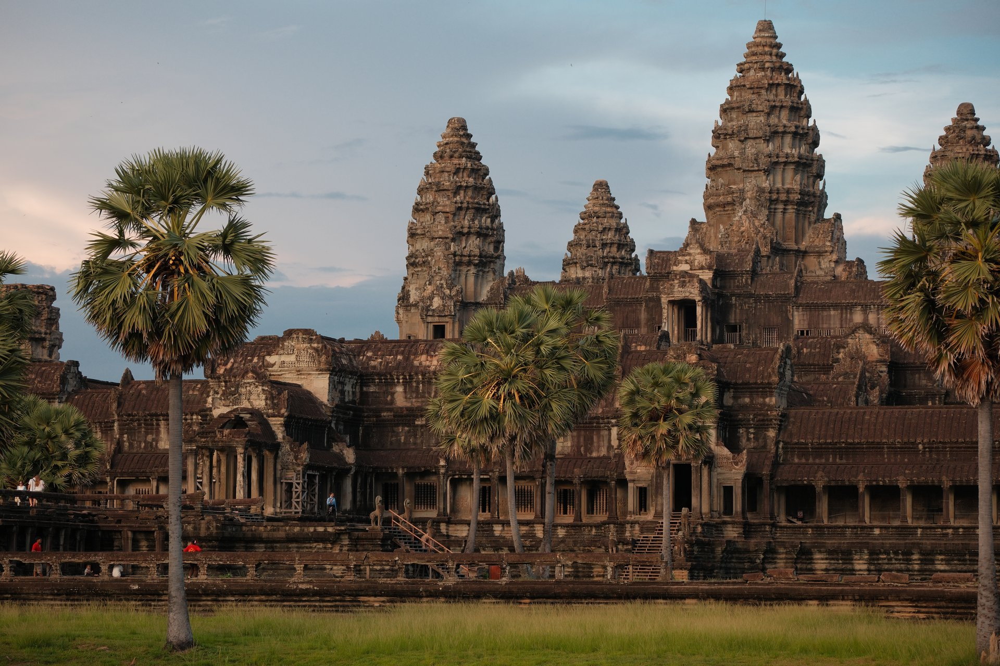

---

## Ангкор наполовину пуст, и это лучшая причина ехать именно сейчас

Оператор археологического парка опубликовал 1 августа 2026 года отчёт за семь месяцев: **428 223 иностранных посетителя против 618 771 годом ранее**, минус 30,7 процента. Выручка от билетов упала с 28,6 до 20,3 миллиона долларов. В одном июле парк принял 40 451 человека — на пятую часть меньше, чем в июле 2025-го.

По стране картина ещё резче. Министерство туризма Камбоджи в июле 2026 года отчиталось за первое полугодие: **1,75 миллиона гостей против 3,36 миллиона**, падение почти вдвое. Просели все крупные рынки: Китай на 22,9 процента, Вьетнам на 27,7, США на 11,3.

Причин несколько, и туриста из России касается ровно одна — закрытая граница с Таиландом, о ней ниже. Остальное про чужие кошельки: дорогое топливо, дорогие билеты, региональный спад.

Для поездки это значит вещь, которую редко удаётся застать. Ангкор — объект, где обычно спорят за место на парапете и стоят в очереди на верхний ярус. **Сейчас там свободно.** Толпа исчезла не потому, что стало хуже, а потому, что до страны стало труднее добираться.

Минус у пустоты тоже есть, и он не в романтике. Часть кафе и гостевых домов в Сиемреапе закрылась или работает вполсилы, автобусные рейсы стали реже, а выбор гидов и лодочников сузился. Проверять, работает ли конкретное место, придётся заранее.

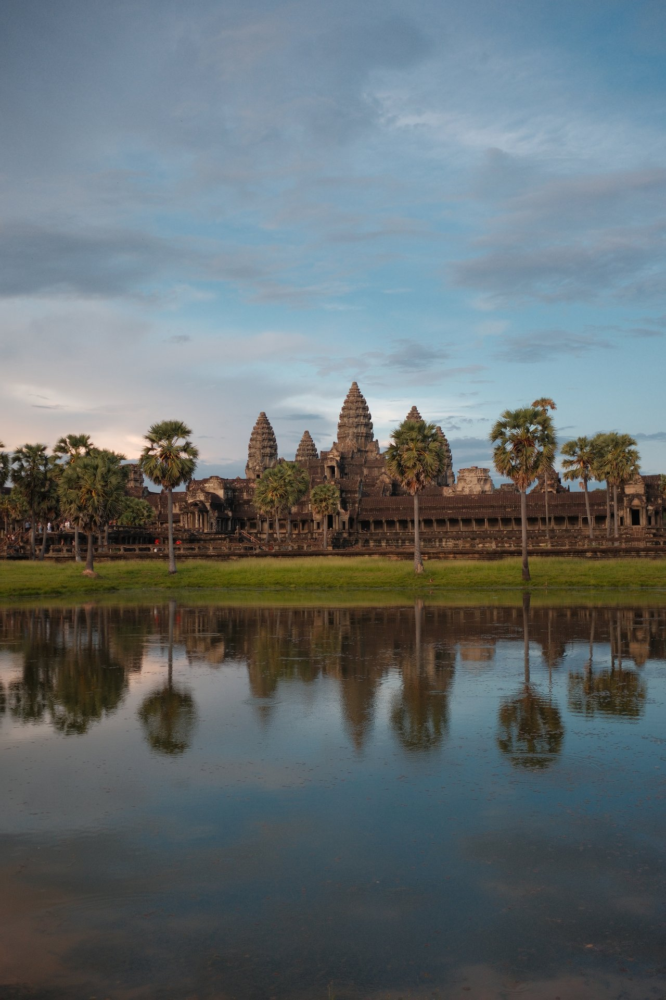

---

## Сухопутная граница с Таиландом закрыта: из Бангкока в Ангкор по земле не доехать

Это главное изменение маршрутов Юго-Восточной Азии за последние годы, и в русских путеводителях оно почти не отражено. Двадцать лет подряд самой популярной дорогой к Ангкору была не авиация, а автобус: Бангкок или Паттайя, переход Пойпет, четыре часа до Сиемреапа. Существовали десятки компаний, торгующих этим трансфером.

**Таиланд закрыл все сухопутные пункты пропуска с Камбоджей в конце июня 2025 года** после боёв на границе. 29 мая 2026 года представитель военно-морских сил Таиланда Парадж Ратанаджайпан публично опроверг слухи об открытии: мера «закрытия пунктов пропуска по всей границе» продолжает действовать, а разовые пропуски идут только под правоохранительные, охранные и гуманитарные задачи и возвращение людей домой. К августу 2026 года ни одна из сторон решения об открытии не объявила.

Косвенно это подтверждает и камбоджийский визовый портал. В списке пунктов, принимающих электронную визу, оба перехода с Таиландом — **Пойпет и Чам Ем — помечены как временно закрытые до особого распоряжения**. Открытыми остаются три аэропорта и два сухопутных перехода: Бавет на границе с Вьетнамом и Трапеанг Крал на границе с Лаосом.

Отдельно стоит сказать про справку МИД России по Камбодже: она всё ещё перечисляет Пойпет и Чам Ем среди пунктов, где пускают по электронной визе. Ведомственные справки обновляются медленнее, чем сама норма, и в таких разночтениях правым оказывается тот, кто визу выдаёт.

Что из этого следует практически:

- **Комбинация «Таиланд плюс Камбоджа» распалась.** Соединить их можно только перелётом, и это отдельный билет, а не автобус за 25 долларов. Если Таиланд в поездке остаётся, [сезоны и курорты страны](/blog/thailand-guide-2026/) считаются теперь отдельно от камбоджийских.
- **Вьетнам с Камбоджей соединяются по-прежнему.** Переход Бавет между Хошимином и Пномпенем работает и принимает электронную визу. Это сегодня единственный наземный маршрут в страну, который имеет смысл планировать заранее — и если связку строить, то от вьетнамской стороны: [как попасть во Вьетнам и сколько это стоит](/blog/vietnam-guide-2026/) разобрано отдельно.
- **Экскурсия «Ангкор одним днём из Паттайи»**, которую до сих пор предлагают в поиске, физически невыполнима. Если такое предложение попалось — это старая страница.

---

## Когда ехать: сухо с декабря по март, в сентябре у Ангкора 305 мм дождя

По климатическим нормам Всемирной метеорологической организации, станция Сиемреапа даёт такую картину года.

| Месяц | Днём | Ночью | Осадки | Дней с дождём |
|---|---|---|---|---|
| Январь | 30,9 | 20,0 | 4 мм | 3 |
| Февраль | 32,3 | 21,3 | 4 мм | 6 |
| Март | 34,6 | 22,6 | 41 мм | 8 |
| Апрель | 34,8 | 23,9 | 48 мм | 11 |
| Май | 35,3 | 24,6 | 143 мм | 13 |
| Июнь | 32,7 | 25,1 | 195 мм | 20 |
| Июль | 32,8 | 23,7 | 170 мм | 25 |
| Август | 31,8 | 24,8 | 170 мм | 18 |
| Сентябрь | 31,9 | 24,6 | 305 мм | 27 |
| Октябрь | 31,3 | 22,4 | 227 мм | 29 |
| Ноябрь | 31,6 | 22,3 | 62 мм | 12 |
| Декабрь | 30,7 | 20,3 | 7 мм | 6 |

Из таблицы читаются три вещи, которых нет в общих словах «сухой сезон с ноября по май».

**Настоящая сушь — это декабрь, январь и февраль.** Четыре-семь миллиметров за месяц, три-шесть дождливых дней, ночью двадцать градусов. Ноябрь ещё довозит хвост дождей, 62 мм за двенадцать дней, но ехать можно.

**Жара приходит раньше дождей.** Март, апрель и май сухие по осадкам, но днём под тридцать пять. Я был в начале мая, и это ошибка планирования, за которую платишь распорядком дня: к полудню жара выключает человека полностью, и вторая половина дня уходит впустую. Выходить надо затемно, а на середину дня закладывать паузу в тени или у бассейна. Планы «обойти Ангкор за день» строят те, кто там не был.

**Сентябрь и октябрь — худшее время для храмов и лучшее для озера.** 305 и 227 миллиметров, дождь почти каждый день. Зато Тонлесап в эти месяцы разливается до максимума, деревни на сваях стоят в воде, и лодки ходят там, где в сухой сезон — пыльная дорога.

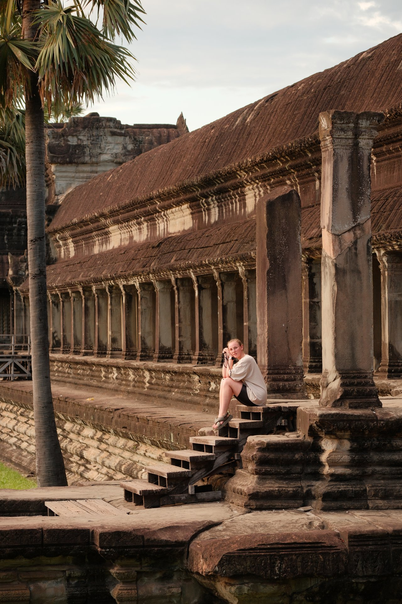

---

## Дорога: прямых рейсов нет, а в Сиемреап дешевле, чем в столицу

Прямых рейсов из России в Камбоджу не существует. Летят с одной-двумя пересадками — через Китай, страны Персидского залива или Вьетнам. Замер цен из Москвы на 25 августа 2026 года, туда-обратно, по месяцам с сентября 2026 по март 2027:

| Куда | Средняя за семь месяцев | Дешёвый месяц | Дорогой месяц |
|---|---|---|---|
| Сиемреап | ≈69 300 ₽ | ноябрь, 66 908 ₽ | январь, 73 700 ₽ |
| Пномпень | ≈79 000 ₽ | сентябрь, 74 317 ₽ | март, 88 376 ₽ |
| Сиануквиль | ≈87 700 ₽ | декабрь, 83 595 ₽ | март, 95 837 ₽ |

**Главный вывод контринтуитивный: лететь в Сиемреап дешевле, чем в столицу**, и так во все семь месяцев замера — разница от четырёх до двадцати одной тысячи рублей, в среднем около десяти. Обычно бывает наоборот: столица крупнее, рейсов больше, цена ниже. Здесь работает Ангкор, ради которого в Сиемреап летают напрямую из азиатских хабов.

Витринное «от» по каждому направлению ниже средней на пять-десять тысяч и приходится на неудобные даты. Пример конкретного предложения: вылет 23 ноября, возврат 20 декабря, 76 023 ₽ до Пномпеня, дорога в один конец 13 часов 35 минут. До Сиемреапа — 2 ноября с возвратом 17-го за 66 908 ₽ и 15 часов 15 минут в пути.

<a href={aviasalesRoute('MOW','SAI','cambodia_guide_2026_flight')} class="aff-cta" rel="sponsored">Найти билет в Сиемреап от 66 900 ₽</a> показывает все стыковки в одной выдаче и календарь цен по месяцам, оплата картой российского банка

---

## Оба аэропорта переехали, и справочники до сих пор дают старые адреса

Про это стоит знать до бронирования жилья, потому что трансфер из аэропорта здесь стоит дороже, чем ночь в гостевом доме.

**Сиемреап.** Новый аэропорт открылся 16 октября 2023 года и стоит **примерно в полусотне километров** к востоку от города — старый был почти в черте. Тук-тук такое расстояние не ходит. Приезжавшие в 2025 и 2026 годах пишут о трёх вариантах: автобус около 8 долларов, такси около 10 долларов с человека, трансфер от гостиницы до 40 долларов. Дорога занимает минут сорок.

**Пномпень.** Международный аэропорт Течо принял первые рейсы 9 сентября 2025 года и забрал у прежнего все международные рейсы; старый остался под внутренние, военные и частные борта. Новый стоит далеко за городом, оценки расстояния расходятся от 19 до 28 километров, а сам аэропорт закладывает на дорогу до центра **от пятидесяти минут до часа**. Справка МИД России при этом до сих пор описывает аэропорт «в 13 км от центра города» — это про прежний.

Поисковые системы билетов продолжают продавать Пномпень под старым кодом, так что искать рейс по названию города можно как раньше. Менять надо не запрос, а планы на дорогу от полосы до гостиницы.

---

## Ангкор: 37, 62 или 72 доллара — и почему одного дня мало

Цены оператора парка на 25 августа 2026 года. Курс Центрального банка на эту дату — **1 доллар США = 83,2878 ₽**.

| Пропуск | Цена | В рублях | Срок использования |
|---|---|---|---|
| Ангкор, 1 день | 37 $ | ≈3 080 ₽ | в течение суток |
| Ангкор, 3 дня | 62 $ | ≈5 160 ₽ | любые 3 дня из 7 |
| Ангкор, 7 дней | 72 $ | ≈6 000 ₽ | любые 7 дней из 30 |
| Кох Кер | 15 $ | ≈1 250 ₽ | 1 день |
| Бенг Мелеа | 10 $ | ≈830 ₽ | 1 день |
| Кбал Спеан | 5 $ | ≈420 ₽ | 1 день |

Важная деталь, которая экономит деньги и нервы: **трёхдневный и семидневный пропуска не обязаны идти подряд**. Трёхдневный расходуется в течение недели, семидневный — в течение месяца. Значит, между двумя днями по храмам можно вставить день на озере или день безделья, и билет не сгорит.

Парк открывается в 5:00 и закрывается в 18:30. Это не формальность: рассвет у Ангкор-Вата — единственный час, когда снаружи прохладно, а внутри почти никого.

Билет покупают на сайте оператора, в приложении, в кассе, у киоска самообслуживания или через гида. В кассе фотографируют на месте, и лицо печатают на самом билете — передать его другому человеку нельзя.

**Один день против трёх.** Ангкор — не отдельный храм, а археологический парк, где между объектами по пять-десять километров и передвигаются на тук-туке или мотоцикле. За один день реально увидеть Ангкор-Ват, Байон и Та Пром — и на этом закончиться. За три спокойно укладываются десять-двенадцать храмов, включая дальний круг и Бантей Срей. Разница в цене — 25 долларов, около 2 100 ₽; разница во впечатлении несопоставима.

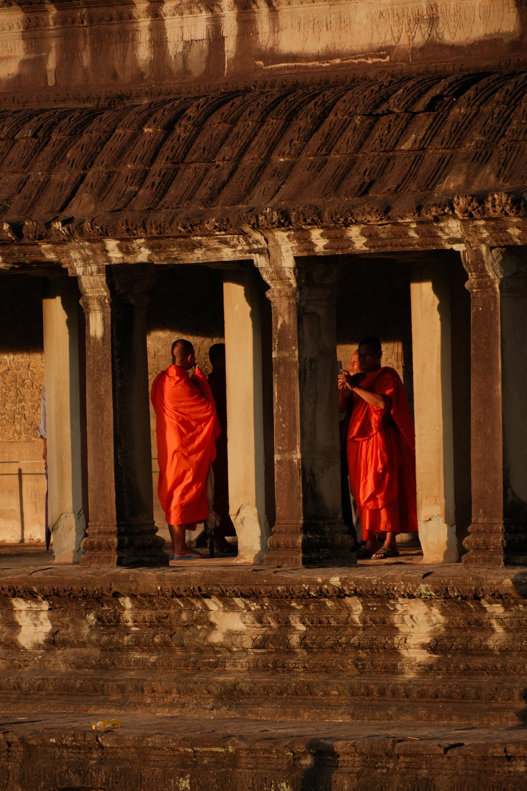

---

## Что смотреть, кроме Ангкор-Вата

Ангкор-Ват знают все, и он действительно крупнейший религиозный комплекс в мире. Но поездка, состоящая из одного Ангкор-Вата, — это как поездка в Рим ради одного Колизея.

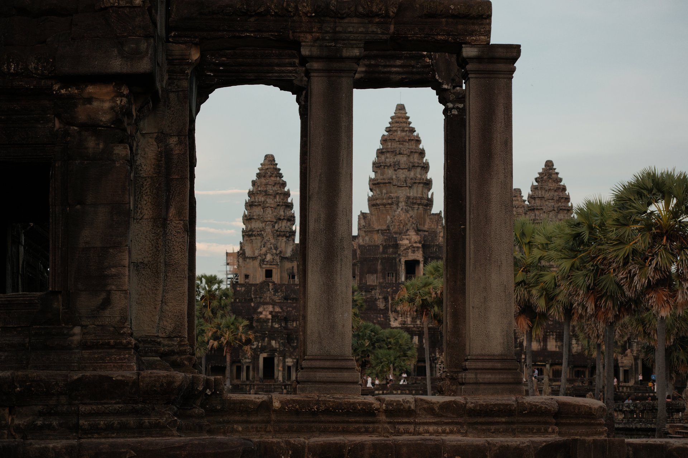

### Ангкор-Том и Байон — каменные лица

Ангкор-Том — обнесённый стеной город к северу от Ангкор-Вата, и вход в него сам по себе достопримечательность: к южным воротам ведёт мост, вдоль которого в два ряда сидят каменные фигуры, держащие тело змея. Половина из них с безмятежными лицами, половина — с гневными.

В центре города стоит **Байон**, храм-гора, с башен которого во все стороны смотрят огромные каменные лица — на каждой башне по нескольку. В отличие от Ангкор-Вата, Байон обходят не по галереям, а карабкаясь по ярусам, и лица открываются постепенно.

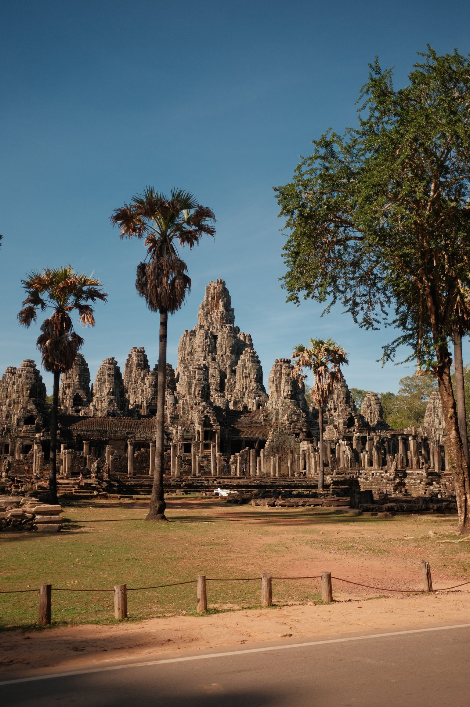

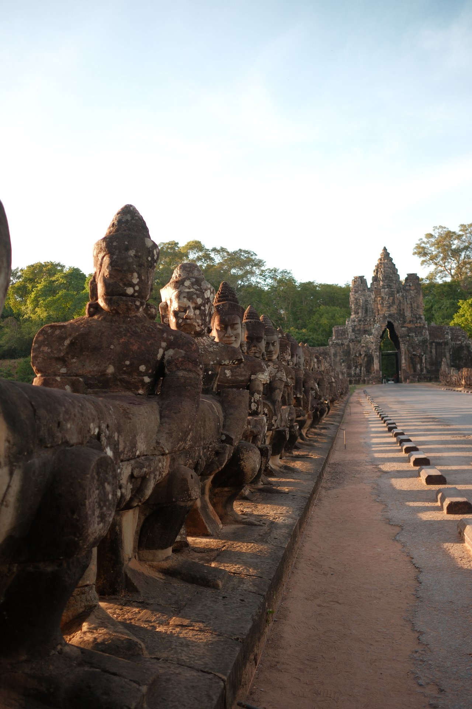

### Та Пром — тот самый храм в корнях

Та Пром оставили таким, каким его нашли: деревья не вырубали. Корни фикусов и хлопковых деревьев обхватывают стены, продавливают перекрытия и висят над проходами белыми жгутами. Здесь снимали «Лару Крофт», и это единственное место в Ангкоре, где очередь на фотографию сохранилась даже в пустой год — проходы узкие, и точка съёмки в них одна.

Приезжать сюда стоит первым делом после рассвета или за час до закрытия. В середине дня свет в проходах плоский, а людей вдвое больше.

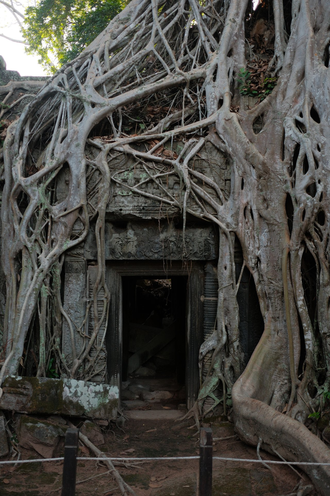

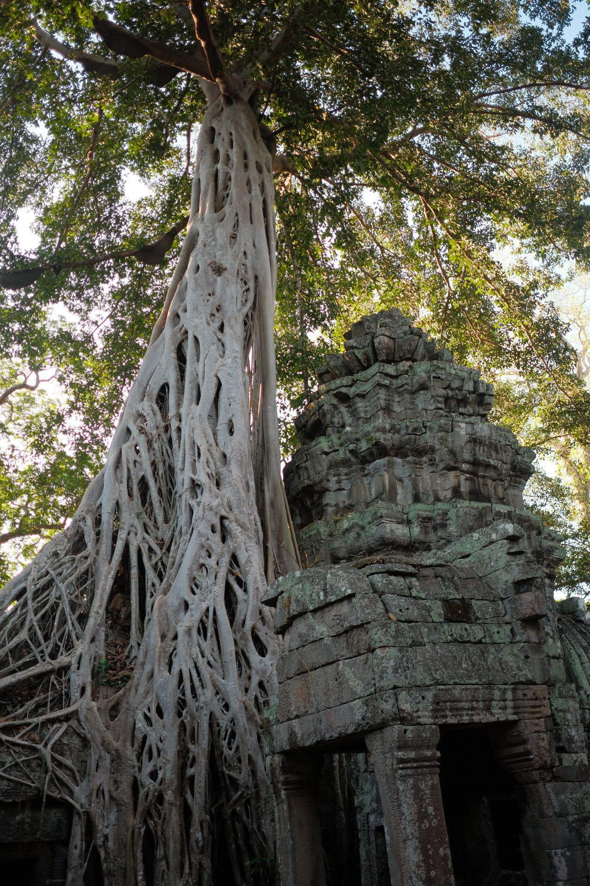

### Дальний круг: храмы, где нет никого

За малым кольцом идёт большое, и там начинается то, ради чего берут трёхдневный билет. Ступенчатые храмы-горы из красноватого латерита с крутыми лестницами, кирпичные башни, заросшие дворы. Людей там мало даже в хороший год, а в 2026-м — единицы.

Отдельно от парка стоит **Бантей Срей** — небольшой храм из розового песчаника с резьбой такой тонкости, что её сравнивают с ювелирной. Он лежит заметно дальше основного кольца, и поездка туда съедает полдня.

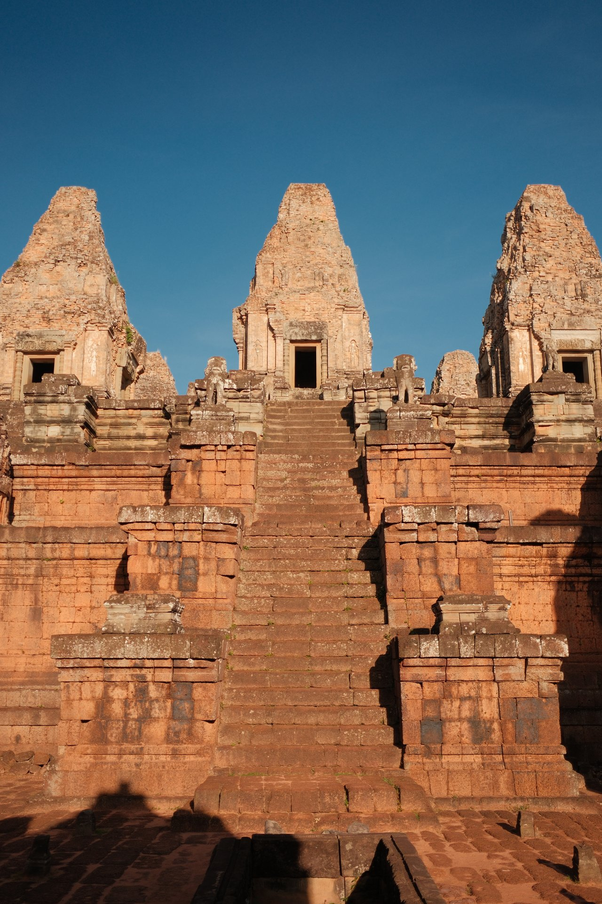

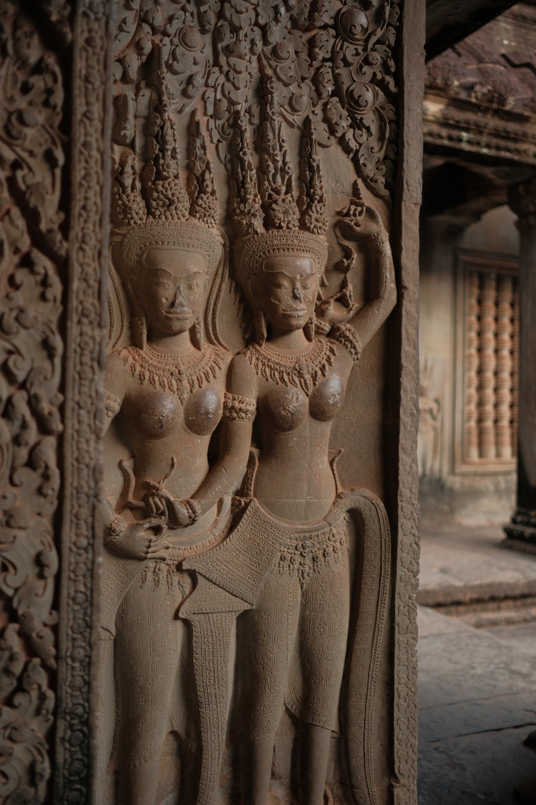

### Тонлесап и деревни на сваях

Тонлесап — крупнейшее озеро Юго-Восточной Азии, и оно меняет площадь в несколько раз между сезонами. Деревни вдоль него стоят на сваях высотой с двухэтажный дом: в сухой сезон под домами ходят и ездят на мотоциклах, в дождливый под ними плавают.

Ехать туда стоит понимая, что вы увидите. **В сухой сезон** это пыльная улица между невероятно длинными сваями, и «плавучая деревня» плавает разве что в названии. **В дождливый** — вода вокруг домов, но и дождь каждый день. Второй честный минус: часть лодочных экскурсий поставлена как аттракцион, с обязательной остановкой у сувенирного плота.

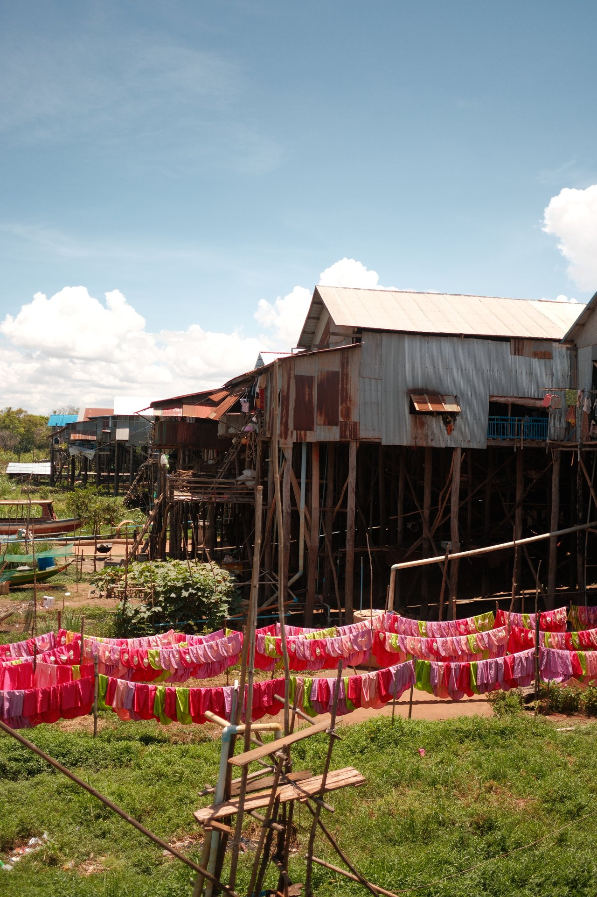

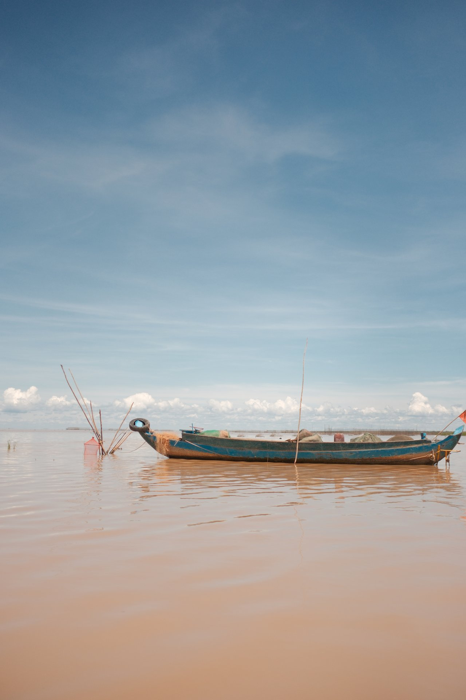

---

## Сценарии поездок

**Четыре дня, только Ангкор.** Прилёт в Сиемреап, трёхдневный пропуск, малое и большое кольцо, Та Пром на рассвете, вечер на реке.
*Минус:* дорога в один конец занимает больше суток с пересадками, и ради четырёх дней арифметика получается плохой. Это вариант для тех, кто пристёгивает Камбоджу к поездке во Вьетнам.

**Неделя, Ангкор без спешки.** Тот же трёхдневный пропуск, растянутый на неделю: два дня по храмам, день на Тонлесап, день на Бантей Срей и водопад, два дня без плана.
*Минус:* Сиемреап — город на одну вечернюю улицу, и на седьмой день там становится тесно.

**Десять дней, Сиемреап и Пномпень.** Ангкор, автобус или перелёт в столицу, Королевский дворец, музей геноцида и Поля смерти, рынки.
*Минус:* Пномпень тяжёлый эмоционально. Места, связанные с режимом красных кхмеров, — не осмотр достопримечательностей, и планировать после них лёгкий вечер не стоит.

**Две недели, страна с побережьем.** То же плюс острова у Сиануквиля: Ко Ронг и Ко Ронг Санлоем.
*Минус:* побережье — самая спорная часть страны. Отдельные ветки на форумах путешественников называются «почему не стоит ехать в Сиануквиль», а про острова отчёты расходятся сильнее, чем про что-либо ещё в Камбодже.

**Две недели, Вьетнам и Камбоджа вместе.** Хошимин, наземный переход Бавет, Пномпень, Сиемреап, вылет из Сиемреапа.
*Минус:* единственный наземный маршрут в страну, и он же самый уязвимый — правила пропуска на конкретном переходе меняются, а электронная виза действует не везде.

| Сколько дней | Что складывается |
|---|---|
| 4 | Ангкор в плотном темпе, без остального |
| 7 | Ангкор спокойно, Тонлесап, Бантей Срей |
| 10 | То же плюс Пномпень |
| 14 | Вся страна с побережьем или связка с Вьетнамом |

---

## Сколько стоит поездка

Курс Центрального банка на 25 августа 2026 года: **1 доллар США = 83,2878 ₽**.

**Перелёт.** Около 69 300 ₽ туда-обратно до Сиемреапа по замеру выше — это средняя за семь месяцев, а не витринное «от».

**Виза.** 30 долларов, около 2 500 ₽. По прилёте — ровно эта сумма; онлайн выходит дороже, разбор ниже.

**Ангкор.** Трёхдневный пропуск 62 доллара, около 5 160 ₽. Отдельные объекты вне парка — ещё 20–35 долларов.

**Жильё.** МИД России называет средний номер в гостинице 40–70 долларов (≈3 300–5 800 ₽). Ездившие в 2025 году пишут о гостевом доме с бассейном в Сиемреапе за 18 долларов и о номере с кондиционером за 30–40 на побережье — со слов постояльцев, официальным источником эти цифры не подтверждены.

<a href={ostrovokCountry('cambodia', 'cambodia_guide_2026_stay')} class="aff-cta" rel="sponsored">Посмотреть жильё в Сиемреапе и Пномпене</a> оплата картой российского банка, подтверждение сразу — его же показывают на паспортном контроле

**Транспорт на месте.** Общественного транспорта между городами в привычном виде нет: ходят автобусы частных компаний от их собственных офисов. Ночной автобус Сиемреап — Сиануквиль обходился пассажирам в 35 долларов, комбинированный билет с катером до острова — в 39. Тук-тук на день по храмам — 25–40 долларов, мотоцикл в аренду от 10 долларов в день. Такси в Пномпене по счётчику: 1 доллар за первые два километра и 0,1 за каждые следующие двести метров.

**Еда.** Обед в ресторане среднего класса — 10 долларов по данным МИД. На практике разброс шире: уличная лапша от доллара, суп в кафе Сиемреапа 3–4 доллара, горячее 4–6, в Пномпене на доллар-два дороже.

**Страховка.** Формально для въезда не нужна. Практический довод против экономии простой: медицинская помощь иностранцам платная, а качество лечения за пределами столицы МИД описывает как крайне низкое — значит, любой серьёзный случай означает эвакуацию, а она стоит десятки тысяч долларов.

<a href={cherehapaTravel('cambodia_guide_2026')} class="aff-cta" rel="sponsored">Подобрать полис для поездки в Камбоджу</a> сравнивает страховщиков по цене и покрытию, оплата картой РФ, полис приходит в PDF

**Итог по чеку — оценка, а не замер.** Десять дней на человека складываются примерно в **140 000 ₽**: перелёт 69 300, виза 2 500, пропуск в Ангкор 5 160, жильё около 24 000, транспорт на месте около 12 500, еда около 19 000, страховка около 2 500, экскурсии и мелочи остальное. Твёрдые здесь три строки — перелёт, виза и билет в парк, они измерены по источникам. Остальное посчитано по дневным ценникам и меняется от сезона и аппетита.

---

## Виза: 30 долларов и одна ловушка с электронной

**Россиянам виза нужна.** Постоянный безвизовый въезд Камбоджа даёт девяти странам АСЕАН — Лаосу, Малайзии, Филиппинам, Сингапуру, Вьетнаму, Таиланду, Индонезии, Брунею и Мьянме. Россиянам, наоборот, [Филиппины дают тридцать дней без визы и без сбора](/blog/philippines-guide-2026/) — из соседей это самый простой въезд. Отдельно, с 15 июня по 15 октября 2026 года, визовый портал объявил временное освобождение для граждан Китая на срок до 14 дней. России нет ни в одном из этих списков.

Туристам оформляют **визу типа T**: 30 долларов, однократная, действует три месяца от даты выдачи, даёт месяц пребывания. Есть ещё деловая типа E за 35 долларов — её берут при работе, учёбе и длительном пребывании, и для неё нужно письменное приглашение от человека или компании в Камбодже.

Получить визу можно тремя способами, и они не равноценны.

**По прилёте.** В большинстве воздушных и наземных пунктов пропуска. Нужен загранпаспорт и 30 долларов; иногда пограничник просит показать бронь гостиницы или обратный билет. Это самый дешёвый способ.

**Онлайн на портале визовой службы.** Оформление три рабочих дня, бланк приходит на почту. С 1 августа 2026 года штрих-код на бланке заменён QR-кодом. Подававшие пишут о комиссии около 6 долларов сверх пошлины на этапе оплаты — то есть онлайн выходит примерно на пятую часть дороже, чем на границе.

**В посольстве заранее.** Имеет смысл при сложном маршруте или если визовые вопросы надо закрыть до вылета.

⛔ **Ловушка электронной визы — пункты пропуска.** С обычной визой по прилёте въезжают почти везде. С электронной — только через перечисленные портом: аэропорты Течо, Сиемреапа и Сиануквиля, наземные Бавет и Трапеанг Крал. **Пойпет и Чам Ем закрыты**, а справка МИД России их ещё называет. Выезжать с электронной визой можно через любой пункт — ограничение только на въезд.

**Паспорт должен действовать не меньше шести месяцев** с даты въезда. МИД формулирует жёстко: с паспортом короче въезд в подавляющем большинстве случаев невозможен, а камбоджийские визы в таких паспортах не продлеваются.

**Форма прибытия обязательна отдельно от визы.** Единая электронная форма заполняется в течение семи дней до въезда на сайте `arrival.gov.kh` или в приложении, бесплатно; QR-код показывают на паспортном контроле. Она не заменяет визу. Групповая подача — до десяти человек разом.

**Штампов в паспорте больше нет.** С января 2026 года при въезде через международные аэропорты и морские порты никаких физических отметок не ставят: данные пишутся в электронную систему учёта, а уведомление о въезде и выезде приходит на почту, указанную в форме. **На сухопутных переходах порядок прежний** — бумажная миграционная карта и мастичный штамп. Проверить свои отметки можно на том же сайте формы прибытия.

**Детям виза нужна с любого возраста.** МИД рекомендует отдельный загранпаспорт: въезд ребёнка, вписанного в паспорт родителя, возможен, но на практике даёт сложности на контроле.

---

## Деньги, связь и здоровье: доллар ходит наравне с риелем

**Валюта двойная.** Наравне с камбоджийским риелем в свободном обращении ходят американский доллар и тайский бат. Курс на месте держится ровным — доллар к четырём тысячам риелей, — и менять доллары в обменниках нет нужды: их принимают магазины, музеи, такси и гостиницы. Риели приходят как сдача с сумм меньше доллара.

Практический вывод: **везти надо наличные доллары мелкими купюрами**. Карты российских банков в стране не работают, а карты принимают ограниченно даже в Пномпене и Сиемреапе — банкоматы стоят в основном в отделениях банков и холлах крупных гостиниц. Обходные способы расплатиться за границей разобраны в статье про то, [чем платить с российским паспортом](/blog/pay-abroad-2026/); в Камбодже из них работают немногие, и наличные остаются основным вариантом.

**Связь.** Местные операторы работают, но покупка симки требует паспорта и времени в первый же день. Электронная симка снимает вопрос до вылета: интернет включается по прилёте, без очереди в салоне.

<a href={airaloSub('cambodia_guide_2026')} class="aff-cta" rel="sponsored">Купить eSIM для Камбоджи заранее</a> активируется по прилёте без похода в салон, оплата картой РФ, тариф виден до покупки

**Здоровье.** Обязательных прививок для въезда нет, но МИД рекомендует сделать прививки от тифа, дифтерии, туберкулёза, гепатита A и B, холеры, жёлтой лихорадки и бешенства. Главная местная угроза — лихорадка денге, от неё защищает не прививка, а репеллент и одежда. Вода из-под крана не питьевая.

**Дороги.** Управлять машиной по российским правам нельзя: Камбоджа участвует в Женевской конвенции 1949 года, и нужно международное водительское удостоверение. Крупных прокатных компаний западного образца в стране нет, машины сдают местные турфирмы. Движение МИД описывает как хаотичное, с массовыми нарушениями; разрешённая скорость в городе — 40 км/ч для автомобилей и 30 для мототранспорта.

**Безопасность.** Уровень террористической угрозы МИД оценивает как низкий, преступность в крупных городах — как относительно низкую. Основное, что случается с иностранцами: карманные кражи на рынках и выхватывание сумок мотоциклистами на безлюдных улицах и ночью. Районов, закрытых для посещения иностранцами, справка не называет — но приграничные с Таиландом области в нынешней обстановке разумно обойти стороной.

---

## Что пишут те, кто был

Разобрал 99 сообщений за 9 января 2025 — 18 июля 2026 года из трёх веток форума путешественников: о визе на границе и форме прибытия и о двух поездках, февральской и мартовской 2025 года. Это последние страницы каждой ветки, а не ветки целиком, поэтому представительной выборку считать нельзя. Но несколько вещей повторяются у разных людей, и ни одной из них нет в официальных описаниях.

**Онлайн-виза дороже, чем на границе.** Про комиссию около 6 долларов сверх тридцатидолларовой пошлины пишут в январе 2025 года, и вывод формулируют прямо: заморачиваться с электронной визой смысла нет. Проверить эту цифру у визовой службы мне не удалось — на её страницах названа только сама пошлина.

**Форму прибытия многие не заполняли заранее — и въехали.** В январе 2025 года через Сиануквиль и Сиемреап люди прилетали, ничего не подав: в зале стоят планшеты, пограничники сами заводят данные и просят сфотографировать выданный QR-код, дальше окно оплаты и паспортный контроль. Один рейс проходил границу минут за пятнадцать. Официально форма обязательна для всех, включая обладателей визы, — расхождение между нормой и практикой здесь заметное, и полагаться на снисходительность я бы не стал.

**Фотографию на визу по прилёте не спрашивают.** Снимают веб-камерой на паспортном контроле, там же берут отпечатки. При этом в официальных требованиях к туристической визе свежее фото паспортного формата по-прежнему указано.

**Форма падает.** В январе 2026 года подача не прошла ни с телефона, ни с компьютера — «сбой соединения». Заложить на это время стоит заранее, а не в день вылета.

**На наземном переходе просили больше.** В январе 2025 года, до закрытия границы, на таиландской стороне вместо 30 долларов хотели 1300 батов — по тогдашнему курсу больше; заплатили долларами, визу оформили за пять минут. К сегодняшнему дню это исторический сюжет, но он показывает, чем наземный переход отличается от аэропорта.

**Электронная виза принимается не на всех переходах, и об этом узнают на месте.** В мае 2025 года человек, планировавший заходить через Ха Тьен со стороны Вьетнама, получил от соотечественников предупреждение, что с электронной визой там не пустят. Ответом в ветке была ссылка на официальный список пунктов — то есть даже опытные путешественники проверяют его каждый раз.

**Цены со слов ездивших** (официальным источником не подтверждены): вход в Королевский дворец в Пномпене 10 долларов; суп в кафе Сиемреапа 3 доллара, горячее 4–6, соки 1–2; в Пномпене дороже — суп 4–5, горячее 5–10. Тук-тук с водителем на день по храмам 25–40 долларов; билет на плато Пном Кулен 20 долларов и покупается в городе, а не на въезде; полудневная поездка к дальним храмам 20 долларов, полный день к Кох Кер — 50; лодка по Тонлесапу 5,5 доллара с человека при компании и 11 в одиночку; массаж 5 долларов; манго доллар за килограмм.

**Где отчёты расходятся.** Сильнее всего — про острова у Сиануквиля. Один участник называет тамошние отели пятизвёздочными и приводит цены от 1300 долларов за ночь в отдельном месте, другой возражает, что это не пятёрки ни по какому счёту, и оба ссылаются на собственное проживание в одних и тех же гостиницах. Ставить на побережье главную часть поездки при таком разбросе я бы не стал.

---

## FAQ — что чаще всего спрашивают про Камбоджу

**Нужна ли виза в Камбоджу россиянам в 2026 году?**
Да. Безвизовый въезд страна даёт только девяти государствам АСЕАН. Туристическая виза стоит 30 долларов, оформляется по прилёте, онлайн или в посольстве, даёт месяц пребывания.

**Можно ли попасть в Ангкор из Таиланда?**
По земле — нет. Все сухопутные переходы между странами закрыты с конца июня 2025 года, и к августу 2026 года решения открыть их не объявлено. Остаётся перелёт.

**Сколько дней нужно на Ангкор?**
Три. Трёхдневный пропуск стоит 62 доллара против 37 за однодневный и расходуется в течение недели — дни не обязаны идти подряд. За один день успеваешь три главных храма, за три — весь малый и большой круг.

**Когда лучше ехать в Камбоджу?**
С декабря по март: осадков 4–41 мм в месяц, ночью около двадцати градусов. Ноябрь тоже рабочий. С мая по октябрь либо жарко под тридцать пять, либо льёт — в сентябре у Ангкора выпадает 305 мм за 27 дождливых дней.

**Правда ли, что сейчас в Ангкоре нет туристов?**
Их стало на треть меньше: за январь–июль 2026 года парк принял 428 223 иностранца против 618 771 годом ранее. Пусто по меркам Ангкора — но это всё же сотни тысяч человек в год, а не десятки.

**Какие деньги брать?**
Наличные доллары США мелкими купюрами. Они ходят наравне с риелем по всей стране, риели приходят сдачей. Карты российских банков не работают, обменивать доллары на риели заранее не нужно.

**Нужна ли страховка?**
Формально нет. По существу — медицина для иностранцев платная, а качество помощи вне столицы МИД называет крайне низким, поэтому серьёзный случай означает эвакуацию за десятки тысяч долларов.

---

## Коротко о главном

Камбоджа в 2026 году — редкий случай, когда великий объект стоит полупустым не из-за войны на его территории и не из-за запрета на въезд, а из-за закрытой соседской границы и дорогих билетов. Ангкор потерял треть посетителей, страна — половину. Для человека, который туда собирался, это лучшие условия за десятилетие.

Планировать надо от трёх вещей. **Сезон** — декабрь, январь, февраль. **Дорога** — только самолётом, дешевле сразу в Сиемреап, около 69 300 ₽ туда-обратно. **Билет** — трёхдневный за 62 доллара, растянутый на неделю.

Виза берётся на границе за 30 долларов и не требует подготовки, но паспорт должен действовать полгода, а форму прибытия надо подать заранее — она отдельная от визы и бесплатная.

<a href={youtravelSub('cambodia_guide_2026_final')} class="aff-cta" rel="sponsored">Посмотреть авторские туры в Камбоджу</a> маршрут, даты и состав группы видны до оплаты, организаторы с отзывами
