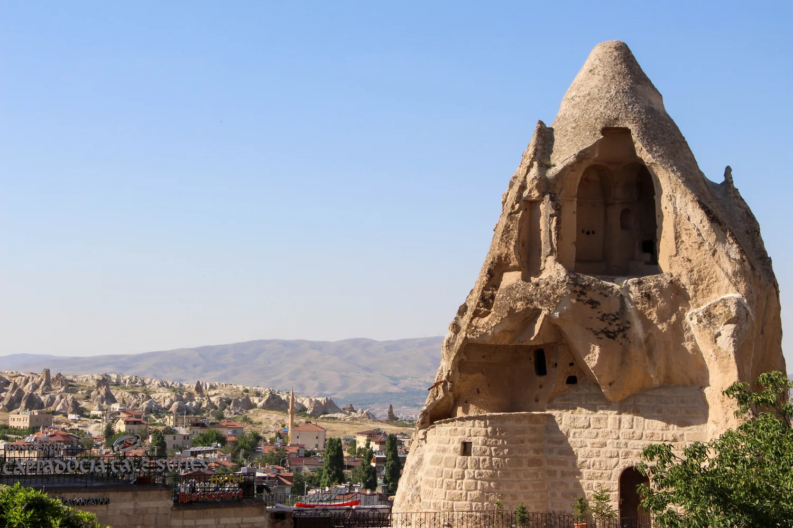

import PricingCards from '../../components/post/PricingCards.astro';
import AffiliateNote from '../../components/post/AffiliateNote.astro';
import { cherehapaCountry } from '../../data/affiliate.js';

В Каппадокию едут за одним кадром — сотни воздушных шаров над лунными долинами на рассвете. Кадр реально того стоит, но у него есть подвох: полёт зависит от погоды, и его могут отменить прямо утром. Поэтому поездку надо спланировать так, чтобы она удалась даже без шара — благо смотреть тут есть что и на земле.

Это разбор одного направления Турции. Если вы ещё выбираете страну и формат в целом — пляж, культура или всё сразу, с визой и бюджетом, — это в основном [гайде по Турции для россиян](/blog/turkey-guide-2026/). Здесь — только Каппадокия, по делу.

> **Если коротко:** Каппадокия — вулканический регион в центре Турции: «каменные грибы», пещерные города и рассветные полёты на шарах. Полёт стоит **€100–300** с человека и **не гарантирован** (ветер отменяет рейсы, особенно зимой). Прямого рейса из Москвы нет — летят через Стамбул + внутренний перелёт **~1,5 часа** в Невшехир (NAV) или Кайсери (ASR). Жить удобнее всего в **Гёреме**. Заложите **2 полных дня** и лучше приезжайте в **апреле–мае или сентябре–октябре**. Виза не нужна — <a href="https://aviasales.tpk.mx/JCSPlC17?erid=2Vtzqxkn4LF&sub_id=cappadocia_2026&u=https%3A%2F%2Fwww.aviasales.ru%2F%3Forigin_iata%3DMOW%26destination_iata%3DIST" class="aff-cta" rel="sponsored">Найти билет Москва — Стамбул</a>.

<AffiliateNote />

## Что такое Каппадокия и стоит ли ехать ради шаров?

**Каппадокия — это вулканическое плато в центре Турции, где ветер и вода за миллионы лет выточили из мягкого туфа «каменные грибы», ущелья и целые пещерные города.** В этих скалах веками жили люди: выдалбливали дома, церкви с фресками и подземные убежища. Сегодня главный магнит региона — рассвет, когда над долинами одновременно поднимаются сотни шаров.

Честно про шар: это не аттракцион с гарантией. Летают только на рассвете и только в тихую погоду — при сильном ветре местная гражданская авиация запрещает вылеты, и рейсы массово отменяют. Зимой такое случается часто. Поэтому ехать в Каппадокию «строго за фото с шаром» — рискованно: можно проснуться в 4 утра и узнать, что сегодня никто не летит.

Хорошая новость в том, что регион держится не на одном шаре. Пещерные монастыри, подземные убежища глубиной до двенадцати ярусов, треки по долинам и закаты с видом на скалы — всё это работает при любой погоде. Так что стоит ехать, если вы готовы, что шар может не выйти, а поездка всё равно удастся.

## Сколько стоит полёт на воздушном шаре и как бронировать?

**Групповой полёт в 2026 году стоит примерно €100–300 с человека — цена зависит от сезона, размера корзины и длительности.** Индивидуальный полёт на маленькой корзине обойдётся от ~€2000 ([sputnik8](https://www.sputnik8.com/ru/cappadocia/pages/gde-v-turtsii-zapuskayut-vozdushnye-shary), [dtf](https://dtf.ru/topovo/4927635-polet-na-vozdushnom-share-v-kappadokii)). Летом, в пик спроса, цены выше — как и на всё в регионе.

В стандартный пакет обычно входит трансфер из отеля и обратно, лёгкий завтрак перед вылетом, около часа в воздухе и небольшая церемония с напитками и сертификатом после приземления ([putevka](https://www.putevka.com/trip/turkey/cappadocia/na-vozdushnom-share)).

Как это устроено по времени: за вами заезжают затемно, взлёт — к восходу солнца. Записываться стоит заранее, особенно в высокий сезон с мая по сентябрь, когда места разбирают. Но бронь не отменяет главного риска — погоды. Если утром ветер, рейс переносят на следующий день или возвращают деньги; точную политику отмены уточняйте у конкретного оператора при бронировании. Практический вывод: **закладывайте в план два утра под шар**, а не одно — тогда даже отмена в первый день не оставит вас без полёта.

По безопасности: полёты в Турции лицензируются гражданской авиацией, у пилотов должна быть лицензия. Выбирайте оператора с лицензией и отзывами, а не самый дешёвый вариант «с рук». Билеты в музеи и на организованные экскурсии по региону удобно взять онлайн заранее — <a href="https://tiqets.tpk.mx/QYpcZlVN?erid=2VtzqvKwa3R&sub_id=cappadocia_2026" class="aff-cta" rel="sponsored">Посмотреть экскурсии и билеты в Каппадокии</a>. Сам полёт на шаре бронируют через отель или напрямую у оператора. И ещё одно, о чём вспоминают уже в корзине: полёт на воздушном шаре почти во всех полисах — не «экскурсия», а активный отдых, который в базовое покрытие не входит. Медицина для иностранцев в Турции платная, так что отмечать эту опцию стоит до вылета, а не после. <a href={cherehapaCountry('turkey', 'cappadocia_2026')} class="aff-cta" rel="sponsored">Полис в Турцию с полётом на шаре</a> — активный отдых отмечается галочкой, оплата картой РФ. А если не хотите собирать логистику сами — по Турции и Каппадокии есть готовые туры с местными гидами, где полёт на шаре уже в программе: <a href="https://travelme.g2afse.com/click?pid=1163&offer_id=1" class="aff-cta" rel="sponsored">Поехать по Каппадокии с гидом</a> (маршрут и трансферы собраны, оплата картой РФ).

## Что делать, если полёт отменили или вы не хотите на шар?

**Каппадокия — это не одна фотография: музей Гёреме под открытым небом, подземные города и долины для треккинга займут вас на пару дней и без всякого шара.** Вот главное.

**Музей Гёреме под открытым небом** — объект Всемирного наследия ЮНЕСКО, около тридцати вырубленных в скалах церквей и часовен с сохранившимися фресками. Это самая известная точка региона и логичный старт знакомства ([sputnik8](https://www.sputnik8.com/ru/cappadocia/pages/chto-posmotret-v-kappadokii)).

**Подземные города.** Деринкую — крупнейший: до двенадцати ярусов вглубь, из которых туристам открыты четыре. Каймаклы — восемь уровней, для посещения тоже открыты четыре; он соединён с Деринкую подземным тоннелем длиной около девяти километров ([moystambul](https://moystambul.ru/podzemnye-goroda-kappadokii/)). Внутри узко и прохладно — не лучший вариант при клаустрофобии, зато полное погружение в то, как здесь прятались от набегов.

**Долины и треккинг.** Пешие маршруты разбиты на два условных направления ([traveller-eu](https://traveller-eu.ru/kappadokiya)). «Красный маршрут» на севере — долина Любви с высокими скалами-столбами, «долина монахов» Пашабаг, фантазийная долина Деврент и музей Зельве. «Зелёный маршрут» на юге — каньон Ихлара, скальный монастырь Селиме и те самые подземные города. Крепость-скала Учхисар даёт лучшую панораму на весь регион, а закат красив в Красной и Розовой долинах.

Входные билеты в музей Гёреме и подземные города для иностранцев теперь считают в евро, и они недешёвые и меняются, поэтому конкретных сумм не привожу: сверяйте актуальные на официальном музейном портале [muze.gov.tr](https://muze.gov.tr/). Если планируете несколько точек, посмотрите в сторону туристической карты Museum Pass Cappadocia — она объединяет вход в основные музеи региона (обычной карте Мюзекарт для граждан Турции турист не пользуется).

## Как добраться до Каппадокии в 2026?

**Прямого рейса из Москвы в Каппадокию нет: сначала до Стамбула, оттуда внутренний перелёт около 1,5 часа в аэропорт Невшехир (NAV) или Кайсери (ASR), дальше шаттл или трансфер до Гёреме.** Билеты на внутренний рейс лучше брать заранее — мест немного, а спрос высокий ([tonkosti](https://tonkosti.ru), [eurotraveler](https://www.eurotraveler.ru/trips/how-to-get-to-cappadocia/)).

| Аэропорт | Код | До Гёреме |
|---|---|---|
| Невшехир (ближе) | NAV | ~40 минут |
| Кайсери (больше рейсов) | ASR | ~1 час, ~75 км |

Из Кайсери рейсов больше и они обычно дешевле, из Невшехира — ближе ехать до Гёреме. От аэропорта до отеля три варианта:

| Способ | Время до Гёреме | Цена |
|---|---|---|
| Шаттл-минибас | 40–60 минут | ~€16 с человека |
| Трансфер от отеля | дверь в дверь | по запросу при брони |
| Такси | быстрее всего | дороже всего |

Шаттл — самый бюджетный, трансфер удобнее с багажом и после ночного рейса.

Альтернативы самолёту, если считаете каждую тысячу: на машине из Стамбула это около **700 км и 8–9 часов** пути, с логичной остановкой у Соленого озера Туз ([tonkosti](https://tonkosti.ru)); ночной междугородний автобус — вариант для экономных, но это порядка 10–12 часов в пути в одну сторону. Для короткой поездки на пару дней перелёт через Стамбул почти всегда выигрывает по времени. Поймать удобную связку рейсов удобно через агрегатор — <a href="https://aviasales.tpk.mx/JCSPlC17?erid=2Vtzqxkn4LF&sub_id=cappadocia_2026&u=https%3A%2F%2Fwww.aviasales.ru%2F%3Forigin_iata%3DMOW%26destination_iata%3DIST" class="aff-cta" rel="sponsored">Сравнить билеты Москва — Стамбул</a>, а внутренний сегмент до NAV или ASR добронировать отдельно.

## Где остановиться: Гёреме, Ургюп или Учхисар?

**Большинство выбирают Гёреме — это центр региона с максимумом пещерных отелей, террасами на старты шаров и пешей доступностью к музею и долинам.** Но всё зависит от того, что вам важнее — движ, панорама или тишина ([alantatour](https://alantatour.com/gde-ostanovitsja-v-kappadokii.html), [gotripzi](https://gotripzi.com/ru/destinations/cappadocia-tr/where-to-stay)).

<PricingCards tiers={[
 { tier: 'Гёреме', featured: true, badge: 'Выбор большинства',
   price: 'от ~$50/ночь',
   priceNote: 'пещерный отель',
   features: [
     'Центр региона, всё рядом',
     'Максимум отелей с террасой на шары',
     'Пешком к музею и долинам',
     'Минус: людно и туристично',
   ] },
 { tier: 'Учхисар',
   price: 'дороже',
   priceNote: 'премиум и тишина',
   features: [
     'На самой высокой точке — лучшие панорамы',
     'Виды на шары прямо с отеля',
     'Тихо, отели высокого уровня',
     'Минус: развлечений почти нет',
   ] },
 { tier: 'Ургюп',
   price: 'средне',
   priceNote: 'рестораны и вино',
   features: [
     '10 км восточнее, более «городской»',
     'Хорошая кухня и местное вино',
     'Красивые особняки-отели',
     'Минус: вида на шары почти нет',
   ] },
]} />

Пещерный отель — это часть впечатления: номер, выдолбленный в скале, с толстыми каменными стенами. Такие места и террасы с видом на рассветные шары разбирают заранее, так что бронировать лучше сильно наперёд — <a href="https://ostrovok.tpk.mx/xtyTcUcY?erid=2VtzqvE1cv3&sub_id=cappadocia_2026&u=https%3A%2F%2Fostrovok.ru%2Fhotel%2Fturkey%2Fgoreme%2F" class="aff-cta" rel="sponsored">Подобрать пещерный отель в Гёреме</a> (Островок принимает карты МИР). Регион компактный: между всеми тремя городками не больше двадцати минут езды, так что грубо «не туда» вы не поселитесь.

## Когда лучше ехать и на сколько дней?

**Лучшие месяцы — апрель–май и сентябрь–октябрь: мягкая погода, короче очереди и стабильнее полёты на шарах.** Июль и август жаркие и самые дорогие; зима эффектна — снег на «каменных грибах» и туман по утрам, — но полёты чаще срывает ветром ([travel.yandex](https://travel.yandex.ru/journal/kogda-ehat-v-kappadokiyu/), [eurotraveler](https://www.eurotraveler.ru/advices/best-time-to-go-to-cappadocia/)). Даже в тёплый сезон утром на высоте прохладно — берите куртку на рассветную программу.

По времени закладывайте **два полных дня** как минимум:

- **День 1:** рассвет с шаром (или смотровая точка, если не летите), музей Гёреме под открытым небом, ближние долины и закат в Красной долине.
- **День 2:** подземный город — Деринкую или Каймаклы, — и треккинг по одному из маршрутов; вечером панорама с Учхисара.

Три дня комфортнее: появляется буфер на случай, если шар в первое утро отменят, и время просто погулять без гонки. Больше трёх дней имеет смысл, только если планируете долгие треки.

Во сколько обойдётся поездка? Точную сумму назвать нельзя — всё решают сезон и то, летите ли вы на шаре, но грубый ориентир на двоих на пару дней такой. Самая крупная статья — шар: €200–600 за двоих в зависимости от сезона. Дальше — внутренний перелёт Стамбул — Каппадокия и обратно, пещерный отель от ~$50 за ночь, входные билеты в музей Гёреме и подземные города (для иностранцев в евро, недёшево — сверять на [muze.gov.tr](https://muze.gov.tr/)), плюс еда, трансферы и такси между долинами. Если бюджет ограничен, экономят обычно именно на шаре — встречают рассвет с террасы отеля, а деньги оставляют на пещерный номер и хорошую еду.

## FAQ

**Нужна ли виза в Турцию для россиян в 2026?**
**Нет, виза не нужна — Турция принимает россиян без визы на срок до 60 дней.** Подробнее про въезд, паспорт и правила — в [гайде по Турции](/blog/turkey-guide-2026/).

**Гарантирован ли полёт на воздушном шаре?**
**Нет.** Летают только на рассвете и в тихую погоду; при сильном ветре рейсы отменяют, зимой особенно часто. При отмене оператор переносит полёт или возвращает деньги. Закладывайте запасное утро.

**Можно ли увидеть шары бесплатно, не летая?**
**Да.** Сотни шаров прекрасно видно с земли — с террасы отеля в Гёреме или со смотровой точки в долине на рассвете. Многие ради этого и не летают, а просто встречают восход с видом.

**Сколько стоит полёт на шаре в 2026 году?**
Групповой — примерно **€100–300** с человека в зависимости от сезона и длительности, индивидуальный — от **~€2000**.

**Сколько дней нужно на Каппадокию?**
Минимум **2 полных дня**, комфортно — 3 (с буфером на случай отмены шара).

**Где лучше жить — Гёреме, Ургюп или Учхисар?**
Гёреме — центр и шары, Учхисар — панорамы и тишина, Ургюп — рестораны и вино. Большинству подходит Гёреме.

**Как добраться из Стамбула?**
Внутренним перелётом около **1,5 часа** в Невшехир (NAV) или Кайсери (ASR) плюс шаттл до Гёреме; либо на машине ~700 км за 8–9 часов, либо ночным автобусом.

**Когда лучший сезон для шаров?**
Апрель–май и сентябрь–октябрь — оптимум по погоде и стабильности полётов.

**Безопасны ли полёты на шарах?**
Полёты лицензируются гражданской авиацией Турции, у пилотов должна быть лицензия. Выбирайте оператора с лицензией и отзывами.

## Что почитать дальше

- [Турция 2026 для россиян](/blog/turkey-guide-2026/) — главный гайд: сценарии отдыха, виза, бюджет, курорты
- [Как платить за границей россиянам 2026](/blog/pay-abroad-2026/) — карты, наличные, лиры на месте
- [Связь за границей 2026](/blog/esim-zagranicey-2026/) — eSIM, местная SIM, роуминг
- [Страховка для путешествий 2026](/blog/strahovka-dlya-puteshestviy-2026/) — какая нужна и что не покрывает

---

*Материал носит справочный характер. Цены на полёты, билеты в музеи и рейсы в Турции меняются — перед поездкой сверяйте актуальные (билеты в музеи — на [muze.gov.tr](https://muze.gov.tr/)) и уточняйте условия у операторов. Проверял 24.07.2026. Нашли неточность — напишите в [Telegram-канал @traveltriberu](https://t.me/traveltriberu), обновлю.*

*Фото: обложка — MusikAnimal, инлайн — Aytazeynep, оба [Wikimedia Commons](https://commons.wikimedia.org/) / [CC BY-SA 4.0](https://creativecommons.org/licenses/by-sa/4.0/).*
