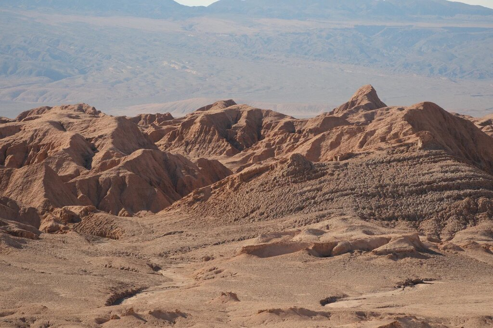
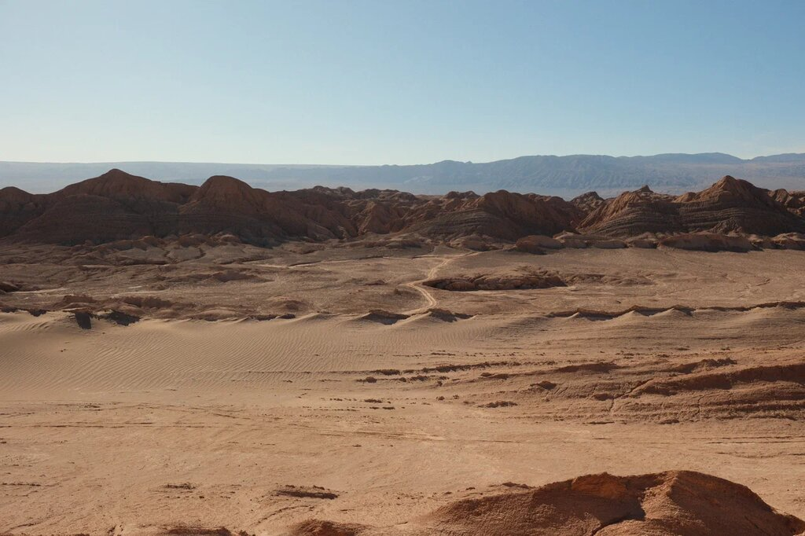

import PricingCards from '../../components/post/PricingCards.astro';
import AffiliateNote from '../../components/post/AffiliateNote.astro';

Чили — длинная страна-полоса. От пустыни Атакама на севере до антарктических льдов на юге — **4300 км**, от пустыни (0 мм осадков 400+ лет) до ледников (−10 °C). Это значит: одна поездка не даёт стране оценки, нужно выбрать север (Атакама и звёзды), центр (Сантьяго и винодельни) или юг (Патагония и Торрес-дель-Пайне). Совмещать всё за одну поездку можно, но это 3 недели и три внутренних перелёта.

> **Если коротко:** россиянам **виза не нужна** с 2018 года (90 дней безвиз). Лучший месяц для Патагонии — **декабрь–февраль** (южное лето), для Атакамы — **круглый год**, особенно **апрель–октябрь** (нет дождей и кометного периода). Бюджет 14 дней с одним внутренним перелётом — от **$1500** (хостелы) до **$4500+** (3*–4* отели, аренда авто).

> **Когда лучше ехать в Чили:** см. [таблицу сезонов](/seasons/). Сезоны на юге и севере полярно противоположны: декабрь в Патагонии — пик лета (+18 °C, 18 часов света), декабрь в Атакаме — лето тоже, но это пустыня. В июне–августе на юге зима (Торрес-дель-Пайне почти закрыт), на севере — пик турсезона.

<AffiliateNote />

---

## Нужна ли виза в Чили россиянам в 2026?

Чили отменил визу для граждан России в **сентябре 2018**. Сейчас въезд по загранпаспорту (срок действия 6+ месяцев), достаточно обратного билета и финансовых средств (~$50/день). Иммиграционная карта (PDI) выдаётся на границе и хранится до выезда.

**Жёлтая лихорадка** не требуется (в Чили её нет). При въезде запрещены свежие фрукты, молочные продукты и мёд — карантин строгий, штрафы $200+. Декларацию Aduanas заполняют на борту.

## Сезоны — Атакама vs Патагония

| Месяц | Сантьяго / винодельни | Атакама (север) | Патагония (юг) |
|---|---|---|---|
| **Декабрь⁠–⁠февраль** | ★ Лето, +28 °C | Жарко, до +25 °C ночью прохладно | ★ Лето, +15 °C, всё открыто |
| Март⁠–⁠май | Осень, винтаж, +18 °C | Тёплый, мало туристов | Уже холодает, к маю Торрес-дель-Пайне частично закрыт |
| Июнь⁠–⁠август | Зима, дожди, +12 °C | ★ Высокий сезон туристов, прохладно ночью | Зима, треккинг почти невозможен |
| Сентябрь⁠–⁠ноябрь | Весна, +20 °C | Лучшее для звёзд (тёмные ночи) | Открывается треккинг, цветение в октябре |

**Атакама** — самая сухая пустыня (некоторые точки не видели дождя 400+ лет). Высота **2400 м** (Сан-Педро) — мягкая акклиматизация. **Главные виды — Долина Луны, Гейзеры Эль-Татио (4300 м, выезд в 4:00), Лагуна Сехар (плавать в соли как в Мёртвом море), обсерватория ALMA**. В Сан-Педро 6–8 отелей с собственными телескопами (Tierra, Explora, Alto Atacama).

**Патагония Торрес-дель-Пайне** — главный нацпарк. Знаменитый трек **W (5 дней, 75 км)** или круг **O (8 дней, 120 км)**. **Декабрь–февраль** — оптимально, но мест в кемпингах надо бронировать **за 8 месяцев**. Альтернатива треку — однодневные экскурсии из Пуэрто-Наталеса.

## Маршрут на 14 дней — комбо «север + юг»

Самый эффективный за две недели:

1. **Сантьяго** (1–2 дня) — Беллависта, музей Bellas Artes, фуникулёр Сан-Кристобаль, ужин в мишленовском Boragó.
2. **Винодельня в Майпо или Касабланка** (1 день из Сантьяго) — Concha y Toro, Undurraga; туры от $50.
3. **Перелёт Сантьяго → Калама → Сан-Педро-де-Атакама** (~$120 LATAM или JetSmart, 2 ч + 1.5 ч на трансфер).
4. **Атакама** (3–4 дня) — Долина Луны (закат), Лагуна Сехар (плавание), Лагуна Бальтиначе (солёные лагуны), Гейзеры Эль-Татио, Звёздный тур ($25–40).
5. **Перелёт CJC → SCL → PUQ** (Пунта-Аренас) — день в полётах, $200–280.
6. **Патагония** (4–5 дней) — Пуэрто-Наталес, Торрес-дель-Пайне (1 день или 3-дневный трек W). Трансферы из PUQ. Отели в Сан-Педро-де-Атакама и Пуэрто-Наталес — <a href="https://ostrovok.tpk.mx/w4cAS1wZ" class="aff-cta" rel="sponsored">Забронировать отель в Чили</a>реклама (карты МИР, выбор от хостелов $30 до 4* за $250+).
7. **Возврат через Сантьяго** (1 день) — отдых перед длинным перелётом.

**Альтернатива** — пропустить север, сделать **только Патагонию** на 7–10 дней. Или пропустить юг — **только Атакама + винодельни** на 8 дней.

## Атакама — день за днём (3 дня)

Большинство туристов бронируют Сан-Педро на 3–4 ночи и комбинируют 4–6 туров. Оптимальная программа:

**День 1 — акклиматизация + Долина Луны.** Прилёт после обеда на 2400 м. Отдых 2–3 часа в отеле, лёгкий обед, не пить алкоголь. К 16:00 — выезд в **Долину Луны** (тур $25), точка Гран Дюна для заката. Возвращение в Сан-Педро 20:00, ужин в Cafe Adobe ($15–20).

**День 2 — лагуны и солончак.** Подъём 7:00, тур к **Альтиплановым лагунам** Мисканти и Миньикес (4200 м, $60). На обратном пути — **Лагуна Сехар** (плавание в соли, $40, своё полотенце). К вечеру отдых, можно записаться на **звёздный тур** в 21:30 ($30–45) с обсерваторией SPACE.

**День 3 — гейзеры Эль-Татио.** Самый ранний тур: подъём 4:00, выезд 4:30, на гейзерах 7:00 (момент пика пара при −10 °C). Завтрак на горячих источниках. Возврат к 12:00. Опционально — после обеда **сэндбординг** в Долине Смерти ($35) или **Долина Радуги** ($50).

**4-й день (если есть):** **обсерватория ALMA** (бесплатно, бронь за 30 дней) или поездка к Лагуне Чакса (фламинго). Выезд из Сан-Педро либо в Калама → Сантьяго, либо через границу в Боливию → Уюни (3-дневный тур, см. [Боливия-гайд](/blog/bolivia-guide-2026/)).

## Патагония — Торрес-дель-Пайне в деталях

Главный национальный парк Чили, площадь 2421 км². Trek **W (75 км, 5 дней)** — классика, проходимая для подготовленного туриста. Trek **O (120 км, 8 дней)** — полный круг, требует серьёзной подготовки.

**Точки трека W:**

1. **Торрес-дель-Пайне (3 башни)** — главный кадр, треккинг от Refugio Chileno 4 ч в одну сторону. Подъём 850 м, последний километр по скалистому склону. Лучше быть у подножия (base) к 8:00 — толпы и облачность приходят к 11:00.

2. **Долина Французов** — между пиками Cuernos и ледником. От Refugio Paine Grande 5 ч в одну сторону, переход через подвесной мост над рекой Frances.

3. **Ледник Грей** — обходной маршрут или каякинг ($120). Огромный ледник, можно подойти вплотную к айсбергам на каяке.

4. **Озеро Pehoé** — кадр-открытка с Cuernos del Paine на заднем плане. Ферри между Refugio Pudeto и Paine Grande.

**Логистика:** база — **Пуэрто-Наталес** (130 км от парка). Кемпинги бронируются **за 6–8 месяцев** через [Vertice](https://www.verticepatagonia.com/) и [Las Torres](https://www.lastorres.com/). Альтернатива — **refugio** — приют с матрасом и ужином, $80–200/ночь, бронь так же. Дешевле — кемпинги $20.

**Что взять:** ветровка с мембраной, треккинг-палки (продаются $40 в Пуэрто-Наталес), термобельё, спальник до −5 °C даже в декабре. Дождевая накидка обязательно — погода меняется 5–10 раз в день.

## Как съездить на винодельни из Сантьяго за день?

Чилийское виноделие — №7 в мире по объёму (по данным [OIV, 2024](https://www.oiv.int/)), фокус на Карменер (исчез из Европы в XIX веке от филлоксеры). Главные регионы:

- **Майпо** (45 мин из Сантьяго) — классика красных вин. Винодельни **Concha y Toro** (тур $50, дегустация 4 вин), **Undurraga** ($40), **Santa Rita** ($45).
- **Касабланка** (1 ч на запад) — белые вина и пино-нуар. **Casas del Bosque** ($60 с обедом), **Veramonte** ($40).
- **Колчагуа** (2 ч на юг) — премиум-резерва. **Montes** ($80 с лимузином), **Lapostolle** ($120).

**Способ организации:** проще всего — экскурсия с русскоговорящим гидом-сомелье: программа целого дня с обедом и трансфером. Альтернатива — прямая бронь винодельни. С арендой авто — учти 0% алкоголя для водителя по чилийскому закону.

## Атакама изнутри — что реально стоит делать

Сан-Педро-де-Атакама — посёлок 6 000 жителей, центр пустынного туризма Латинской Америки. Расположен на 2400 м, мягкая акклиматизация перед более серьёзными выездами. Главный плюс — все туры стартуют отсюда, расстояния до точек 30–90 минут.

**Утренние туры (4:30–11:00):**
- **Гейзеры Эль-Татио** (4300 м) — подъём в 4:00, на месте на рассвете при −10 °C, 80+ фумарол. Тур $40, такси-обратно $15.
- **Долина Радуги** (Valle del Arco Iris) — 14 цветов в скальных слоях, тур $50.

**Дневные туры (8:00–13:00):**
- **Лагуны Сехар, Тебинкуинче, Охос** — плавать в соли с такой плотностью, что не утонешь. $35–45.
- **Альтиплановые лагуны** (Мисканти, Миньикес) на 4200 м — фламинго, бирюзовая вода, пурпурные горы. $60.
- **Долина Камней** (Valle de las Piedras Rojas) — красные скалы, кратеры. $50.

**Закатные туры (15:30–19:30):**
- **Долина Луны** — самая популярная. 3 точки: Тричерос, Гран Дюна, Амфитеатр. В 19:40 (март) скалы становятся бордовыми — снимал на 35 мм без штатива. $25–35. **Не пропускать.**
- **Долина Смерти** (Valle de la Muerte) — сэндбординг, $35 + $15 доска.

**Звёздные туры (после 21:00):**
- **Тур астронома** (Astronomy Tour) с малыми обсерваториями SPACE / Cosmo Andino — $30–45, 2 часа. Пояс Млечного пути в Атакаме виден невооружённым глазом, через профи-телескопы — Сатурн с кольцами.
- **Профессиональные обсерватории** ALMA (5050 м) — туры по субботам бесплатно, бронировать **за 30 дней** на сайте [almaobservatory.org](https://www.almaobservatory.org/en/visits/) (по данным almaobservatory.org на май 2026). Не пропустить, единственный шанс попасть на крупнейший в мире радиотелескоп.

## Сколько стоит поездка в Чили на 14 дней?

Без международного перелёта из Москвы (~110 000–160 000 ₽ через Стамбул/Мадрид/Сан-Паулу). Подобрать перелёт с пересадками удобнее всего так — <a href="https://www.aviasales.ru/?marker=546042.Zz66f13c16ff6b488883a4127-546042&market=ru&origin_iata=MOW&destination_iata=SCL" class="aff-cta" rel="sponsored">Найти билет Москва — Сантьяго</a>реклама: агрегатор сравнивает все авиакомпании и стыковки сразу (Стамбул, Мадрид, Сан-Паулу и комбинации в одной выдаче — удобно сопоставить цену и время в пути), cookie 30 дней — можно мониторить цену и забронировать позже.

<PricingCards tiers={[
  { tier: 'Эконом', price: '$1 500', priceNote: '14 дней, хостелы и автобусы', emoji: '🟢',
    features: [
      'Хостел $25–40/ночь',
      'Питание $20/день — empanadas и menu',
      'Внутр. перелёты ×2 = $300',
      'Туры по Атакаме $25–40 каждый',
      'Кемпинг Торрес-дель-Пайне $20',
    ] },
  { tier: 'Средний', price: '$3 000', priceNote: '3*-отели, средние туры', emoji: '🟡',
    featured: true,
    features: [
      '3* отель $80–130/ночь',
      'Питание $50/день — приличные рестораны',
      'Внутр. перелёты $500 (заранее)',
      'Гид-туры $80 каждый',
      'Refugio Торрес-дель-Пайне $80',
    ] },
  { tier: 'Комфорт', price: '$4 500+', priceNote: 'отели 4*, refugios premium', emoji: '🔴',
    features: [
      '4* отель $200–400/ночь',
      'Питание $100/день — мишленовские',
      'Внутр. перелёты бизнес $700',
      'Аренда авто $120/день',
      'Refugios Torres premium $200+',
    ] },
]} caption="Бюджет на 14 дней в Чили — три уровня комфорта" />

Чили дороже Перу/Боливии: ужин в Сантьяго $20–30 против $8–12 в Ла-Пасе (личный счёт, апр 2025), цены ближе к европейским. Особенно Патагония — отели Пуэрто-Наталес от $100 даже в эконом-сегменте.

**Или готовый тур** — если не собирать по частям. Пакет из Москвы — <a href="https://travelata.tpk.mx/Do2A3cgV?erid=2VtzqufPtiT" class="aff-cta" rel="sponsored">Подобрать тур в Чили</a>реклама: оплата картой МИР, цена сразу с перелётом.

## Что попробовать в Чили

Чили — относительно европейская кухня по сравнению с Перу/Боливией, но несколько вещей must:

- **Эмпанадас pino** — пирожки с мясом, луком, изюмом, оливкой, яйцом. Уличная еда от $1.5.
- **Кальдильо-де-конгрио** — рыбный суп из конгрио (морской угорь). Знаменит из стихов Неруды. $12–18.
- **Curanto** — традиционное блюдо чилотов: морепродукты + мясо + картофель готовятся в яме под листьями. Есть только на острове Чилоэ.
- **Pastel de choclo** — пирог из кукурузы с курицей и говядиной. $10–14.
- **Мариско на побережье** — чорос (большие мидии), лоно (морское ушко), эрисо (морской ёж). Cevichería в Вальпараисо.
- **Pisco sour** — да, чилийский писко тоже есть, но боливийцы и перуанцы спорят чей оригинал.
- **Карменер** — национальный сорт винограда, исчезнувший в Европе. Лучшие — Casablanca / Maipo. Бутылка $10–25.
- **Терремото** — белое вино с ананасовым сорбетом и мятой. Сантьягский «коктейль скорой помощи».

Где есть в Сан-Педро-де-Атакама: **Cafe Adobe** (международная, $15–20), **Toconao** (чилийская, $12–18), **La Casona** (стейки, $20+).

## Деньги, связь, безопасность

**Валюта** — чилийский песо (CLP), курс ~960 за доллар. Карты МИР не работают, Visa/Mastercard принимают почти везде. Apple Pay / Google Pay работает в Сантьяго. ATMs в каждом банке, лимит ~$300/раз, комиссия $7.

**Безопасность** — в Сантьяго и Вальпараисо есть районы, куда туристам лучше не ходить — Bellavista по ночам с осторожностью, центр Вальпараисо тоже. Атакама и Патагония — спокойно. Карманники в метро Сантьяго — обычная история.

**SIM-карта** — Entel или Movistar, турпак на 30 дней с 30 ГБ — $20. В Патагонии и Атакаме — сигнал часто отсутствует, особенно в горах.

## Здоровье и высота

Атакама на **2400 м** — мягкая, большинство переносит хорошо. Эль-Татио на **4300 м** — выезд в 4:00, час на месте, риск горной болезни средний. **Pisco sour** в Сан-Педро вечером — не лучшая идея в первый день.

Патагония — низменность, проблем с высотой нет. Главное — **ветер 80+ км/ч** регулярно. Хорошая ветровка обязательна, треккинговые палки — рекомендованы для W. Утеплитель и термобельё даже в декабре.

## Что почитать дальше

- [Чили — кратко: виза, сезоны, бюджет](/chile/) — справка-хаб по стране
- [Сравнить Чили с Аргентиной и Перу](/seasons/)
- [Калькулятор бюджета на Чили](/calculator/)
- [Виза в Чили для россиян](/visa/chile/)
- [Чили в мае 2026](/trips/may/chile/)

## FAQ

**Можно ли совместить Чили с Аргентиной за одну поездку?**
Да, **Эль-Калафате (AR) → Торрес-дель-Пайне (CL)** — классика, граница в Серро-Кастильо, бус 5 ч. Виза Аргентины россиянам тоже не нужна (90 дней безвиз; по данным [МИД РФ](https://www.mid.ru/ru/maps/ar/) на май 2026).

**Когда лучше для Торрес-дель-Пайне?**
**Декабрь–февраль** — пик: всё открыто, длинный световой день, тёплый ветер. Бронировать кемпинги за **6–8 месяцев**. Ноябрь и март — переходные, меньше туристов, но погода нестабильна.

**Стоит ли ехать в Атакаму на звёзды?**
Да, это одно из лучших мест в мире. Лучший период — **апрель–октябрь** (минимум облачности и низкая влажность). Туры по обсерваториям ALMA нужно бронировать за месяц.

**Какой бюджет на 7 дней только Патагония?**
Эконом — $700 (без перелётов из РФ): автобусы Pacheco, кемпинг, продукты в супермаркете. Средний — $1400 с однодневными турами и refugios. Не считая международный перелёт.

**Безопасно ли в Сантьяго после протестов 2019?**
Сейчас спокойно, центр восстановлен, туризм развивается. Стандартные правила: дорогая техника не светить, в общественном транспорте телефон не доставать, ночью пешком только в хорошо освещённых районах.

**Что взять в Атакаму обязательно?**
Солнцезащитный крем SPF50+ (ультрафиолет на 2400 м экстремальный, обгорят за 30 мин). Тёплая куртка для гейзеров (−10 °C утром в феврале). Очки SunCloud или аналог. Не менее 3 литров воды на человека на день. Походные ботинки или хорошие кроссовки — на каменистых тропах сандалии режут ноги. Налобный фонарь для звёздных туров.

**Совмещают ли Чили с Перу?**
Часто — Лима → Куско → Уюни (Боливия) → Атакама (Чили) → Сантьяго → возврат через Сан-Паулу. Это 22–25 дней, бюджет от $4500 без перелёта из РФ. По данным [МИД РФ](https://www.mid.ru/ru/maps/) на май 2026 — безвиз для Перу/Боливии/Чили/Бразилии до 90 дней.

**Сколько стоит Easter Island (Рапа-Нуи)?**
Перелёт LATAM Сантьяго → Hanga Roa (5.5 ч в одну сторону) — $700–1300. Вход в нацпарк $80. Минимум 4 ночи на острове, отель $150–300/ночь. Туры по моаи $50–100/день. **Итого ~$2500 минимум** на человека только Рапа-Нуи. Сам не ездил — на 4 ночи $2500 при том же бюджете тянут Уюни + Атакама вместе.

**Где в Сантьяго гарантированно нельзя ходить ночью?**
Районы La Pintana, Lo Espejo, Bajos de Mena — нетуристические периферии. В центре — Estación Central и Plaza de Armas после 22:00. Bellavista по выходным — оживлённо но местами агрессивные пьяные. Las Condes, Providencia, Vitacura — спокойно круглосуточно.
