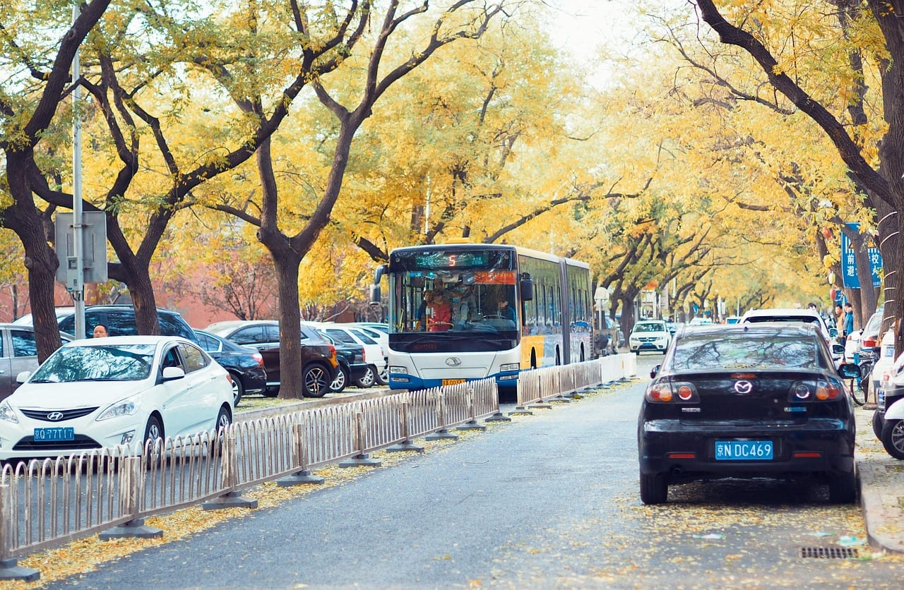
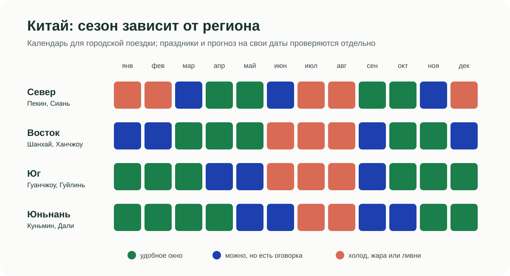
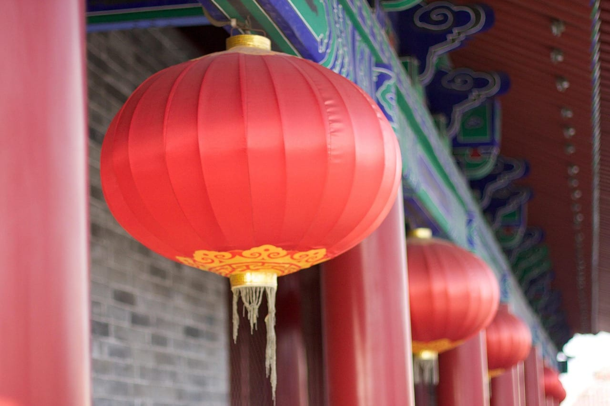
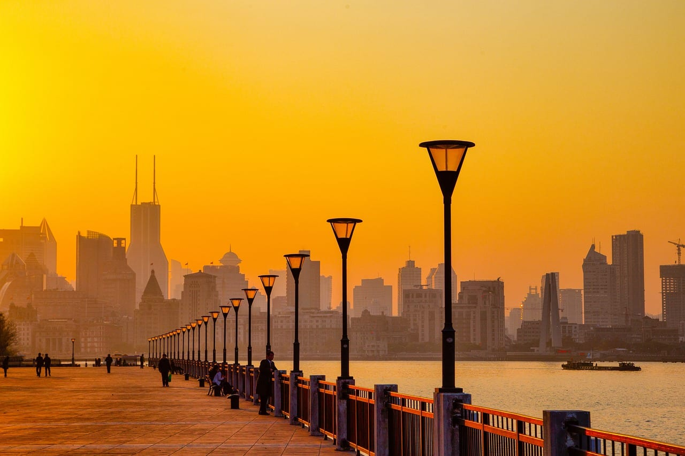
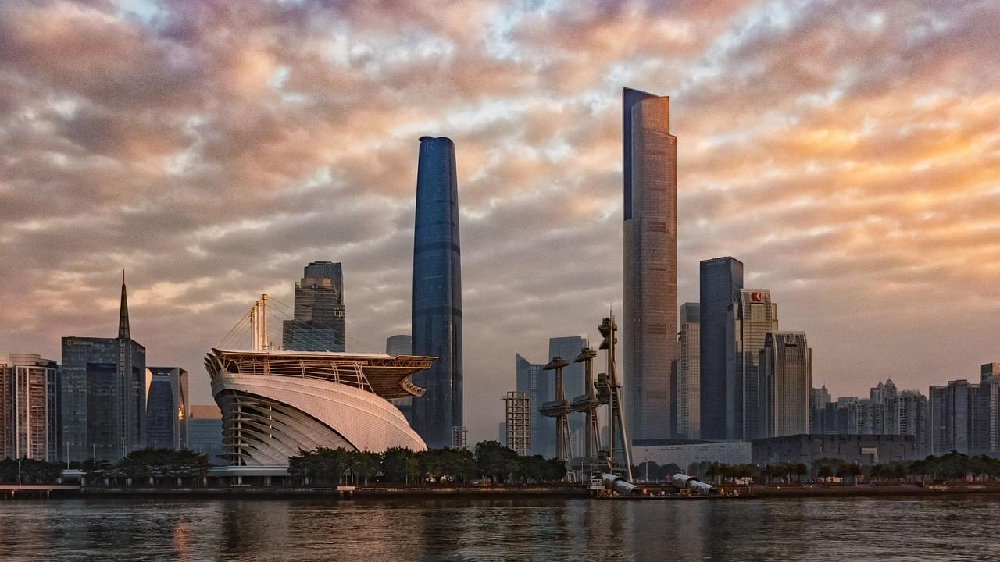
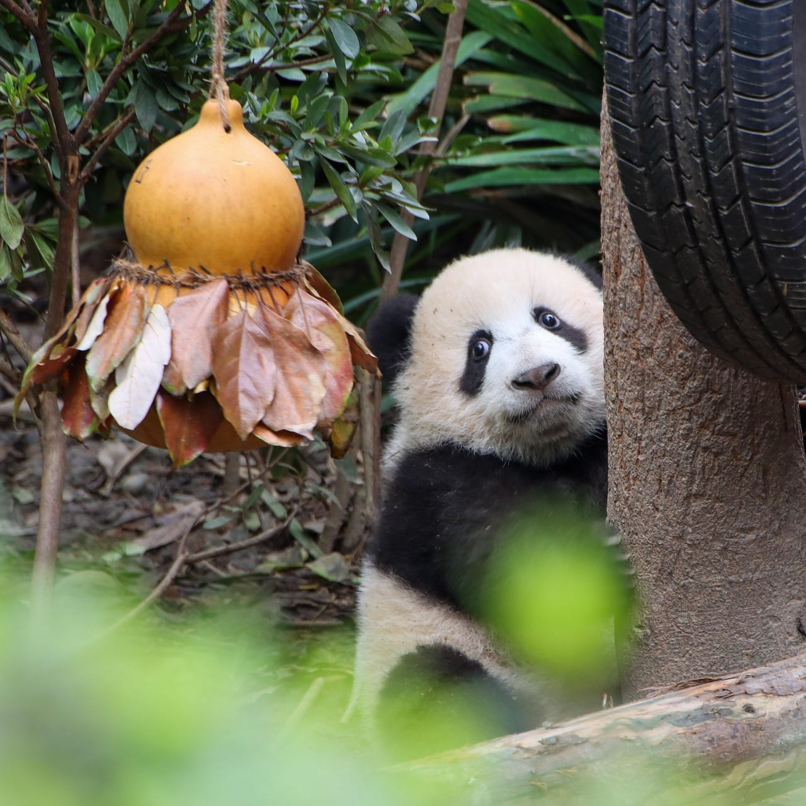
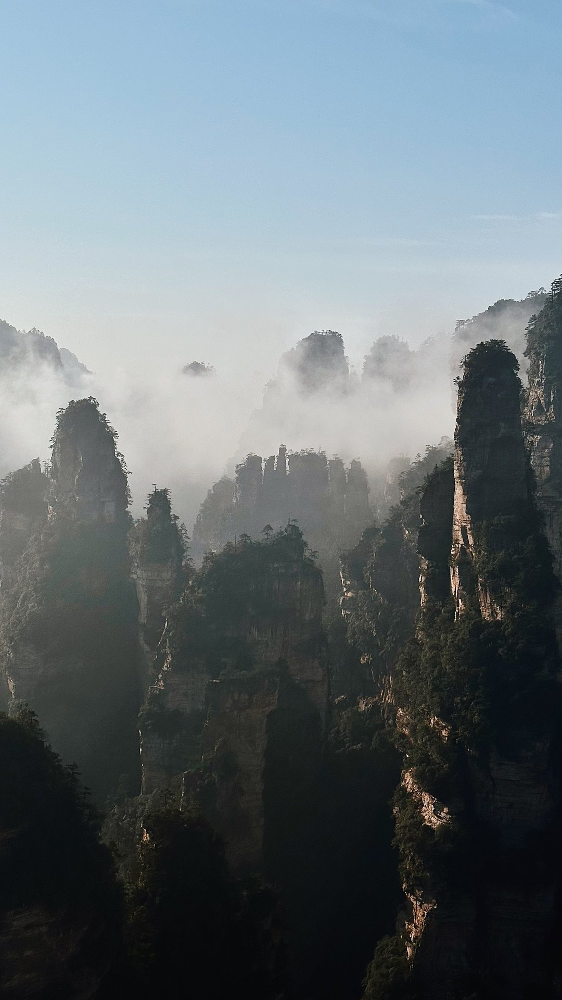
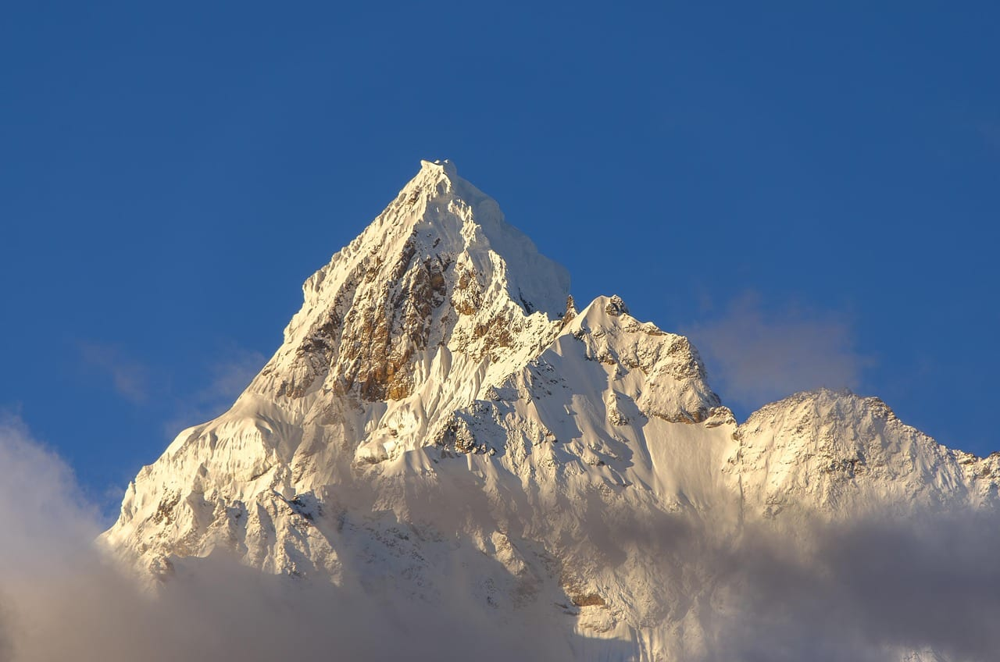
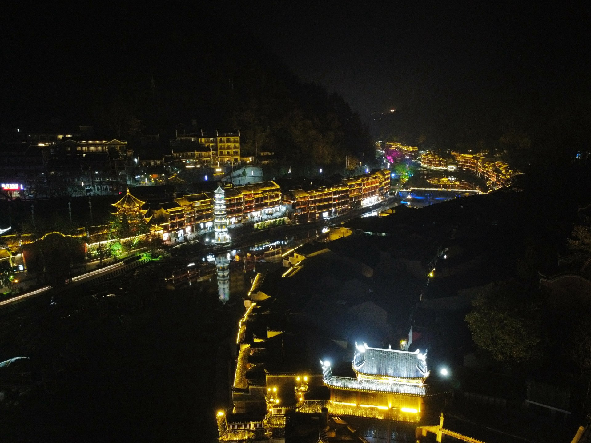
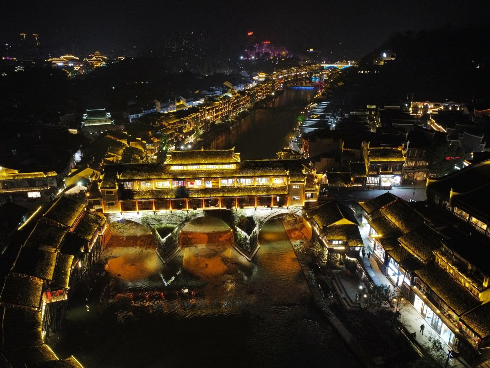

import AffiliateNote from '../../components/post/AffiliateNote.astro';
import CountryMap from '../../components/CountryMap.astro';
import { aviasalesRoute, cherehapaCountry, ostrovokCity } from '../../data/affiliate.js';

export const flights = aviasalesRoute('MOW', 'BJS', 'china_guide_2026_flights', 10);
export const stay = ostrovokCity('china', 'beijing', 'china_guide_2026_stay');
export const insurance = cherehapaCountry('china', 'china_guide_2026_insurance');

В Китае нет одного «лучшего сезона». В январе 2024 года у меня были зимние Чжанцзяцзе, Хуашань и Фэнхуан, а в сентябре — Пекин, Шанхай и Гуанчжоу. Эти две поездки выглядели как разные страны: на севере нужна была куртка, на юге — защита от влажной жары.

Поэтому выбирать надо не «Китай в октябре», а **Пекин после Золотой недели**, **Шанхай после тайфунного пика** или **Юньнань в сухой сезон**. Для тропического пляжа есть отдельный [разбор Хайнаня](/blog/hainan-guide-2026/): переносить его сезон на материк нельзя.

> **Если коротко:** для первой поездки Пекин — Сиань лучше ставить на **вторую половину апреля, май вне каникул, сентябрь или период после 7 октября**. Шанхай удобнее в **марте–мае и октябре–ноябре**; с середины июня до начала июля там сезон затяжных дождей, а конец августа и первая половина сентября попадают в пик тайфунов. Гуанчжоу и Гуйлинь легче переносятся **с октября по март**, Юньнань — **с ноября по апрель**, хотя высота меняет погоду даже внутри одной провинции. В срезе 1 сентября перелёт Москва—Пекин туда-обратно стоил **от 45 319 ₽ в ноябре**, **40 068 ₽ в декабре**, **62 409 ₽ в апреле** и **42 153 ₽ в мае** на человека; это цены, найденные пользователями за последние 48 часов, а не оферта. <a href={flights} class="aff-cta" rel="sponsored">Сравнить перелёты Москва — Пекин на ноябрь</a> — поиск откроется на выбранном маршруте, дату возвращения надо задать в форме.

<AffiliateNote />

## Китай по месяцам

Одна таблица не заменяет прогноз, но отсекает заведомо неудобные сочетания. Пекинский климатический портал описывает короткие весну и осень, жаркое дождливое лето и холодную сухую зиму; около 75% годовых осадков выпадает летом. Шанхайские власти отдельно отмечают мэйюй с середины июня до начала июля и пик тайфунов с конца августа до середины сентября. У Юньнани 85% осадков приходится на май–октябрь.

| Месяц | Куда смотреть в первую очередь | Что может испортить поездку | Ценовой риск |
|---|---|---|---|
| январь | Юньнань, Гуанчжоу; север — ради сухой зимы | мороз и ветер в Пекине, снег и лёд в горах | выше около новогодних дат, затем спокойнее |
| февраль | Юньнань и юг; север — ради зимних видов | каникулы Праздника весны, закрытия и внутренние поездки | высокий вокруг китайского Нового года |
| март | Шанхай, Ханчжоу, Куньмин; Пекин во второй половине | резкие перепады на севере | обычно средний вне праздников |
| апрель | Пекин, Сиань, Шанхай, Ханчжоу | короткий пик на Цинмин, переменчивая весна | средний, выше на праздничные выходные |
| май | север и восток; Юньнань до устойчивых дождей | 1–5 мая 2026 — внутренний пик, юг становится влажнее | высокий на майские каникулы |
| июнь | север в начале месяца, горные районы по прогнозу | мэйюй в Шанхае, жара на юге, старт мокрого сезона Юньнани | средний, но переносы ломают дешёвую бронь |
| июль | высокогорье только с запасным планом | жара, влажность, ливни и паводковые риски | высокий на семейные каникулы |
| август | северо-запад и горы при устойчивом прогнозе | ливни на севере, жара на востоке, тайфуны у побережья | высокий из-за каникул и поздней покупки |
| сентябрь | Пекин и Сиань; Шанхай ближе к концу месяца | тайфуны на востоке в первой половине, праздник середины осени | средний, растёт перед октябрём |
| октябрь | север и восток после 7 октября, юг ближе к концу | 1–7 октября 2026 — Золотая неделя | максимальный в первую неделю, ниже после неё |
| ноябрь | Гуанчжоу, Гуйлинь, Юньнань, Шанхай | Пекин быстро остывает, в горах возможен снег | один из спокойных периодов вне событий |
| декабрь | Юньнань и юг; Пекин — ради сухой зимы | короткий световой день и холод на севере | перелёт может быть ниже весеннего, жильё проверять по датам |

Календарь 2026 года опубликован Госсоветом КНР: Праздник весны шёл **15–23 февраля**, День труда — **1–5 мая**, Праздник середины осени — **25–27 сентября**, День образования КНР — **1–7 октября 2026**. Календарь 2027 года на 1 сентября 2026 ещё не опубликован. Нельзя переносить на него даты 2026 года автоматически.

Зелёные клетки — удобное окно для городской поездки, жёлтые требуют проверки конкретного риска, красные означают, что погода будет главным ограничением. Это авторская схема по официальным климатическим описаниям Пекина, Шанхая, Гуанчжоу и Юньнани, а не прогноз.

## Какой регион выбрать

### Пекин и Сиань: апрель–май или сентябрь–октябрь

Север подходит для первой поездки: дворцы, Великая стена, хутуны, Терракотовая армия и понятная связка скоростным поездом. Весной мешают ветер и скачки температуры, летом — жара и основная часть годовых осадков, зимой — холод. Осень короткая; я был в Пекине в сентябре и выбирал бы её снова, но не ставил бы вылет вплотную к октябрьским каникулам.

Минус этой пары — билеты по времени. Запретный город и популярные участки стены нельзя оставлять на решение утром у входа, а междугородний поезд привязывает день к отправлению.

### Шанхай и Ханчжоу: март–май или октябрь–ноябрь

Шанхай лучше воспринимается как город на несколько дней, а не как «главный Китай». В моём сентябрьском маршруте он проиграл Пекину по плотности впечатлений, зато подходит тем, кому нужны архитектура, музеи, еда и короткий выезд в Ханчжоу.

Официальный городской портал называет весну лучшим сезоном и даёт для неё ориентир **+11…+21 °C**. Лето там жаркое и влажное, в июле и августе температура регулярно проходит **+35 °C**; с середины июня до начала июля длится мэйюй. Осенью воздух постепенно остывает примерно с +25 до +15 °C, но конец августа и первая половина сентября требуют проверки тайфунных предупреждений.

### Гуанчжоу и Гуйлинь: октябрь–март

Юг нужен не как пересадка между северными городами, а как отдельная поездка. Правительство Гуанчжоу описывает местный климат как муссонно-морской: тепло круглый год, дождей много, лето длинное. В январе или ноябре это преимущество; в июле влажность забирает больше сил, чем расстояния на карте.

Гуйлинь и Яншо добавляют карстовые горы и реку Лицзян, но зависят от видимости и уровня воды. Закладывайте запасной городской день вместо обещания, что круиз состоится при любом ливне.

### Чэнду и Чжанцзяцзе: весна и осень, но не одним прогнозом

Чэнду — база для сычуаньской кухни и панд; Чжанцзяцзе — отдельный горный блок. Между ними нельзя ставить знак равенства по погоде. В горах туман иногда создаёт нужную картинку, а иногда закрывает весь вид и останавливает часть маршрутов.

Я был в Чжанцзяцзе зимой. Январь даёт меньше людей, однако холод, мокрые ступени и непредсказуемая видимость делают его выбором под конкретную цель, а не универсальной рекомендацией.

### Юньнань: ноябрь–апрель, с поправкой на высоту

Юньнань нельзя свести к мягкому Куньмину. Провинциальный источник пишет о малой годовой, но большой суточной амплитуде и падении температуры примерно на **0,6–0,7 °C на каждые 100 м высоты**. Сезон дождей длится с мая по октябрь и собирает 85% осадков; сухой сезон — с ноября по апрель.

Для Куньмина, Дали и Лицзяна ноябрь–апрель удобен по осадкам. Для Шангри-Ла и горных треков одной этой строки мало: высота, снег и акклиматизация важнее средней температуры провинции.

<CountryMap slug="china" countryNom="Китай" />

## Маршруты на 7, 10 и 14 дней

| Сценарий | Сколько дней | Нужна ли машина | Главный минус |
|---|---:|---|---|
| Пекин + Сиань для первой поездки | 7 | нет, города и поезд | мало запаса на отмену экскурсии или плохую погоду |
| Пекин + Сиань + Шанхай | 10 | нет | три больших города подряд утомляют, один день уйдёт на переезд |
| Шанхай + Ханчжоу + Гуйлинь | 10 | нет | восток и юг могут одновременно попасть в разные дождевые фазы |
| Чэнду + Чжанцзяцзе + Фэнхуан | 12 | нет, но трансферы надо собрать заранее | сложнее логистика и выше зависимость от видимости в горах |
| Куньмин + Дали + Лицзян | 14 | в городах нет; за их пределами полезен водитель | высота и перепад погоды не видны по одной цифре Куньмина |

Для семи дней я бы оставил два города. На десять — три, если между ними прямой поезд или перелёт. На две недели уже можно добавить природный блок, но не смешивать Пекин, Юньнань и Хайнань: дорога съест выигрыш от количества точек.

Для поездки в августе есть отдельная страница [что взять в Китай в августе](/packing/china/august/), а текущие условия конкретного месяца собраны в сезонном роутере: [Китай в октябре](/trips/october/china/). Это дополнения к гиду, не вторые статьи с тем же интентом.

## Сколько стоит поездка

Цены ниже — срез, а не обещание. На странице маршрута Москва—Пекин 1 сентября были найдены билеты туда-обратно **45 319 ₽ на 4–18 ноября**, **40 068 ₽ на 9–22 декабря**, **62 409 ₽ на 12–21 апреля** и **42 153 ₽ на 18–25 мая** на одного. Вывод из этих четырёх строк не в том, что апрель всегда дорогой: витринный минимум зависит от конкретной пары дат и меняется в течение дня.

Каталог Островка без выбранных дат показывал в Пекине 15 074 варианта: нижняя граница — **3 815 ₽ за ночь**, а варианты в пределах восьми километров от центра начинались примерно с **4 986–8 302 ₽**. Цена без дат не подтверждает доступность. <a href={stay} class="aff-cta" rel="sponsored">Проверить жильё в Пекине на свои даты</a> — откроется город, затем нужно указать гостей, даты, район и бесплатную отмену.

Для предварительного бюджета на **10 дней на двоих** я считаю так:

| Расход | Рабочий диапазон | Что это за цифра |
|---|---:|---|
| перелёт Москва—Пекин—Москва | около 90 600 ₽ | два ноябрьских билета из среза 1 сентября |
| девять ночей | 45 000–90 000 ₽ | оценка по видимым тарифам; даты не заданы |
| еда и городской транспорт | 45 000–84 000 ₽ | авторский запас 350–650 CNY в день на двоих |
| поезда, входные билеты, связь | 19 000–39 000 ₽ | авторский запас 1 500–3 000 CNY на двоих |
| **итого** | **около 200 000–304 000 ₽** | без шопинга, визы, тура и дорогого гида |

Курс Банка России на 1 сентября — **12,858 ₽ за 1 CNY**. Две строки с расходами в юанях — мой плановый запас по поездкам 2024 года, пересчитанный по текущему курсу, а не рыночная котировка ресторана или железной дороги.

## Что проверить до оплаты

**Въезд.** Посольство КНР в России подтверждает безвиз для владельцев обычных российских паспортов до **30 дней** с целями туризма, бизнеса, визита, обмена и транзита. Режим продлён до **31 декабря 2027 года**. В официальном объявлении нет списка из одиннадцати провинций: прежняя версия этой статьи ошибочно ограничивала безвиз частью страны.

**Праздники.** Проверяйте календарь на год поездки, а не прошлогоднюю инфографику. В 2026 году официальные длинные паузы — 15–23 февраля, 1–5 мая и 1–7 октября. Даже если погода хорошая, билеты в музеи и поезда в эти даты становятся отдельной задачей.

**Оплата и связь.** Российские Visa и Mastercard за рубежом не работают; варианты наличных, UnionPay и иностранных карт собраны в гайде [как платить за границей](/blog/pay-abroad-2026/). Google, Telegram и часть привычных сервисов в материковом Китае ограничены, поэтому связь готовят до вылета: [сравнение eSIM и роуминга](/blog/esim-zagranicey-2026/).

**Медицина.** Полис не нужен для безвизового въезда, но лечение иностранца оплачивается отдельно. Для горных маршрутов важны высота, треккинг и эвакуация, а не самый дешёвый базовый тариф. <a href={insurance} class="aff-cta" rel="sponsored">Сравнить страховки для Китая по покрытию</a> — форма откроется со страной, даты и виды активности выбираются вручную.

## FAQ

**Какой месяц лучший для первой поездки в Китай?**

Для Пекина и Сианя — вторая половина апреля, май вне 1–5 числа, сентябрь или октябрь после Золотой недели. Если нужен Шанхай, добавляйте март–май и октябрь–ноябрь. Для Гуанчжоу и Юньнани ответ другой.

**Стоит ли ехать в Китай в октябре?**

Да, но в 2026 году не 1–7 октября. После национальных каникул Пекин, Сиань и Шанхай попадают в одно из самых удобных окон. На юге к концу месяца становится суше.

**Куда ехать в Китае зимой?**

За мягкой погодой — в Юньнань или Гуанчжоу, за осознанной зимней поездкой — в Пекин и горы. Чжанцзяцзе в январе может быть выразительным, но туман, лёд и закрытые тропы нельзя считать бонусом.

**Почему июль и август неудобны?**

На севере это основная часть сезона осадков, Шанхай сочетает жару выше +35 °C с влажностью, юг получает ливни, Юньнань находится в мокром сезоне. Ехать можно, если даты фиксированы, но маршрут должен переживать плохой прогноз.

**Сколько денег нужно на десять дней?**

На двоих — ориентир **200–304 тыс. ₽** при самостоятельной сборке и ноябрьском перелёте из текущего среза. Это плановый диапазон: жильё надо переснять на точные даты, а еду, поезда и входные билеты считать под маршрут.

**Нужна ли россиянам виза в Китай?**

До 31 декабря 2027 года владельцу обычного российского паспорта виза не нужна для поездки до 30 дней с разрешённой целью. Работа, учёба и пребывание дольше 30 дней требуют другого основания.

## Что почитать дальше

- [Китай — кратко: въезд, сезоны и деньги](/china/)
- [Хайнань: отдельный тропический сезон](/blog/hainan-guide-2026/)
- [Как платить за границей российскими и иностранными картами](/blog/pay-abroad-2026/)
- [Связь за границей: eSIM, SIM и роуминг](/blog/esim-zagranicey-2026/)
- [Сезоны путешествий по направлениям](/seasons/)

*Проверено 1 сентября 2026 года. Климатические окна основаны на материалах правительств Пекина, Шанхая, Гуанчжоу и Юньнани; праздники — на календаре Госсовета КНР; безвиз — на сообщении посольства КНР в России. Цены перелёта и жилья меняются: перед оплатой повторите поиск на свои даты.*

*Фото Чжанцзяцзе, Хуашань и Фэнхуана — Никита Зайцев, январь 2024. Пекин — Bob-King, Шанхай — Ferdinand-Feng, Сиань — rachelf2, Чэнду — junoyjl, Гуйлинь — Rupar, Гуанчжоу — cxh2018, Юньнань — sfkjrgk; [Pixabay License](https://pixabay.com/service/license-summary/). Матрица сезонов — TravelTribe.*
