import { ostrovokCity, cherehapaTravel } from '../../data/affiliate.js';

export const stay = ostrovokCity('china', 'hong_kong', 'hongkong_3days_stay');
export const insurance = cherehapaTravel('hongkong_3days_insurance');

**На три полных дня в Гонконге я бы оставил остров Гонконг с Пиком, Коулун с набережной и один выезд на Лантау.** Получатся три разных города: улицы под небоскрёбами, бухта с паромами и горы вокруг Большого Будды. Макао и Диснейленд в этот план не помещаются без жертвы — каждому нужен свой день.

Главная экономия здесь — перестать пересекать город ради каждой новой точки. Пик и Central складываются вместе. Коулун удобнее пройти отдельным днём. Лантау стоит начинать утром и оставить ему время до вечера. Ниже — порядок прогулок, выбор билетов и замены, если вершины затянуло облаками.

## Как разложить Гонконг на три дня

Бухта Виктория разделяет остров Гонконг на юге и Коулун на севере. **Central и Tsim Sha Tsui — противоположные берега**, между которыми ходит Star Ferry. Лантау лежит западнее: поездка туда начинается с метро до Tung Chung, а затем продолжается канатной дорогой или автобусом. Двадцать пять минут в кабине — только последний кусок пути.

<a href={stay} rel="sponsored noopener">Сравнить отели в Гонконге</a> — сопоставьте адрес с метро и первым пунктом каждого дня.

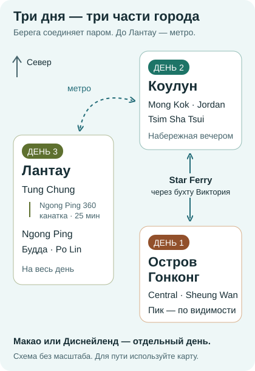

| Сколько полных дней | Что складывается | Чем придётся пожертвовать |
|---|---|---|
| Один | Central, Star Ferry, набережная Tsim Sha Tsui; Пик при ясной погоде | Лантау и дальними кварталами |
| Два | Остров Гонконг и Коулун без гонки | Большим Буддой или частью городского дня |
| Три | Остров, Коулун и Лантау отдельными днями | Макао и парками развлечений |
| Четыре | Базовые три дня плюс Макао **или** Диснейленд | Вторым из этих дополнений |

Это дни в городе, без международного перелёта. Поздний прилёт не превращается в первый экскурсионный день: заселение, ужин и прогулка вокруг отеля — нормальный предел. Машина для этого маршрута не нужна: метро соединяет районы, а у набережных приятнее идти пешком.

## День 1: улицы Central и вид с Пика

Начните с Sheung Wan и двигайтесь к Central. Между ними стоит погулять по Hollywood Road: небольшие лавки и старые фасады дают другую картинку, чем стеклянные башни у воды. Улицы уходят в горку, поэтому маршрут на плоской карте обманчив. Не размечайте утро десятком адресов: оставьте время на лестницы, переходы между уровнями и обед.

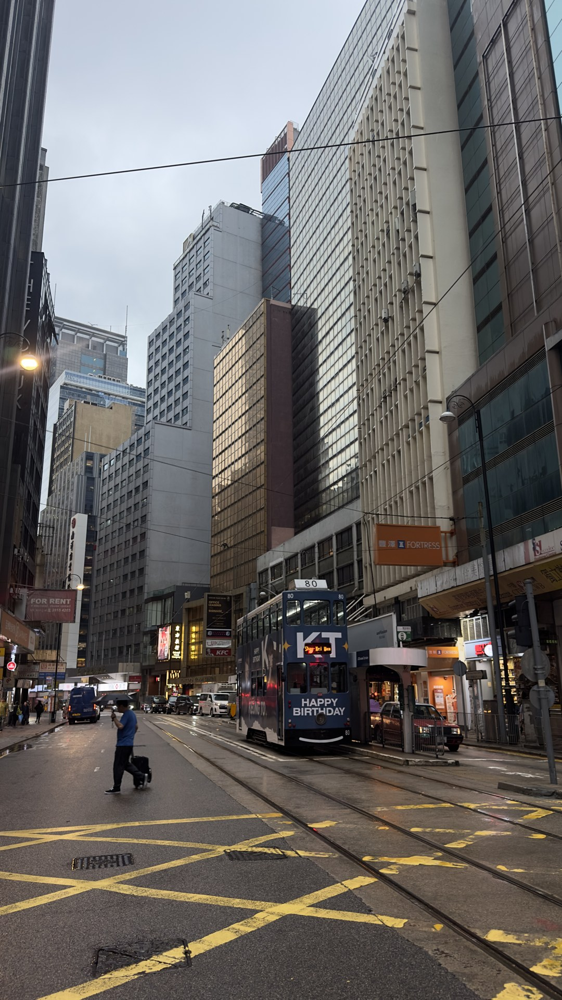

*Двухэтажный трамвай на острове Гонконг.*

Трамвай стоит включить ради самой поездки: со второго этажа улица раскрывается иначе, чем из метро. Но для переезда на другой берег он не подходит. К Пику поднимается отдельный фуникулёр **Peak Tram**, его нижняя станция находится на Garden Road. Обычные городские трамваи и Peak Tram — разный транспорт и разные билеты.

На Пик отправляйтесь, когда различимы верхушки зданий. Идея «куплю заранее на закат, а там разберёмся» работает лишь до первого низкого облака. У датированного комбинированного билета плохая видимость сама по себе не даёт права на возврат. Если день ясный, оставьте на вершине время для прогулки и дождитесь огней; если нет — поменяйте местами первый и второй дни.

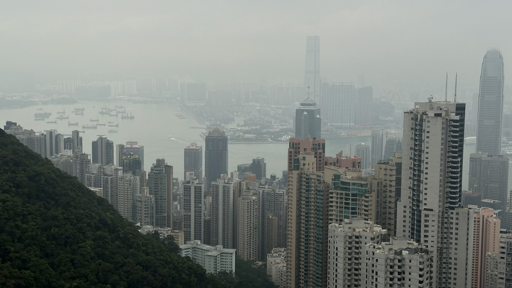

*Вид с Пика в апреле 2024 года: дальний берег теряется в дымке.*

**За подъём и за вид платят отдельно — если выбрать не тот билет.** Special Combo объединяет Peak Tram туда-обратно и один вход на Sky Terrace 428. Отдельный билет на террасу нужен тому, кто добрался наверх иначе; поверх combo его покупать не надо. Приоритетная очередь в обычный combo не входит.

Платная терраса не обязательна для прогулки на Пике. Отправляйтесь по Lugard Road к открытым видам: до смотровой ориентир — около 20 минут пешком. Подняться можно и автобусом №15. Такой вариант хорош, если хочется погулять среди зелени и посмотреть на бухту, а поездка в фуникулёре сама по себе не интересует. После спуска ужинайте на острове; Коулун оставьте на завтра.

## День 2: Star Ferry, Коулун и вечер у воды

Если живёте на острове, начните день с Star Ferry из Central в Tsim Sha Tsui. Если база в Коулуне, эту переправу удобно сделать вечером первого дня, возвращаясь с Пика. **Одной поездки через бухту хватит для впечатления**: покупать ради этого отдельный обзорный круиз не обязательно.

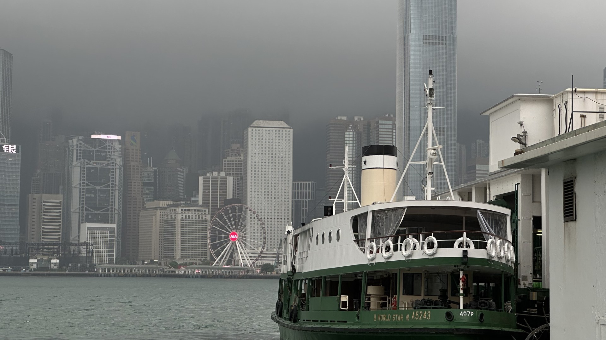

*Судно Star Ferry у набережной.*

На верхней палубе обычного парома Central—Tsim Sha Tsui взрослый билет стоит около **54 ₽ в будни и 70 ₽ в выходные и праздники — 5 и 6,5 HKD**. Эти тарифы относятся к городской переправе; у прогулочных рейсов другая цена. У бухты лучше сидеть и смотреть на приближающийся берег, чем пытаться успеть снять оба сразу.

От причала идите вдоль набережной к Аллее звёзд. Здесь хорошо видно, ради чего Гонконг строит смотровые: противоположный берег стоит сплошной стеной башен. Не стремитесь протиснуться к каждой скульптуре. Если у Брюса Ли толпа, продолжайте прогулку — вид на город не привязан к одному памятнику.

После набережной уходите вглубь Коулуна. Для первого знакомства выберите Mong Kok: вывески, магазины, тесные улицы и поток людей дают сильный контраст с открытой водой. До него удобнее доехать на метро, чем считать прогулку вдоль всей Nathan Road обязательной частью программы.

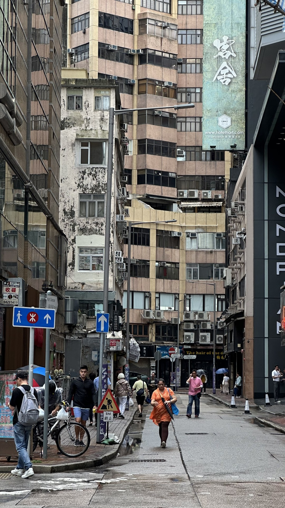

*Уличный Гонконг совсем не похож на открытую набережную.*

К вечеру возвращайтесь к Jordan и Temple Street. Рынок имеет смысл ради прогулки и ужина, а не ради списка покупок: одинаковых сувениров много, хорошую еду стоит выбирать по меню и тому, что едят за соседними столами. Не добавляйте после ужина ещё один дальний район.

**Световое шоу Symphony of Lights возобновилось 21 сентября; обычное начало — в 20:00.** Перед выходом проверьте специальные объявления: из-за тайфуна или сильного дождя выступление могут отменить. Ночная панорама бухты остаётся самостоятельной причиной вернуться к воде.

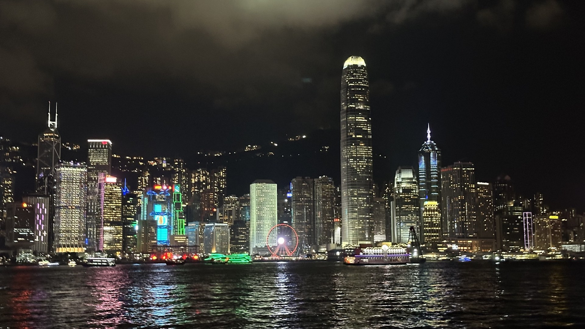

*Ночная бухта из моей поездки в апреле 2024 года.*

## День 3: Лантау, Большой Будда и запас времени

Отведите Лантау отдельный день. Доезжайте на метро до **Tung Chung**, затем идите к станции Ngong Ping 360. Сама канатная дорога занимает около 25 минут в одну сторону. К ним добавятся дорога от отеля, выход из метро, билетный контроль и возможная очередь — поэтому поздний старт после обеда делает день нервным.

Обычная кабина стоит дешевле стеклянной, а горы и воду видно через окна обеих. Переплачивать за Crystal имеет смысл ради прозрачного пола. Если высота тревожит, это сомнительное улучшение поездки. Электронный билет на канатку позволяет пройти с кодом, но не обещает посадку без очереди.

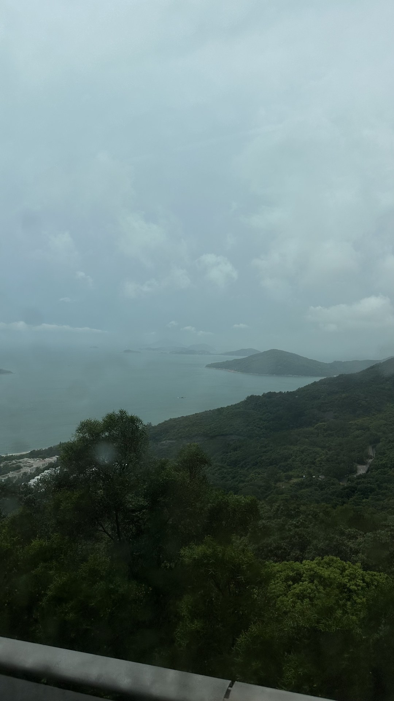

*Лантау: зелёные склоны вместо городской застройки.*

Наверху последовательно идут деревня Ngong Ping, площадь, монастырь **Po Lin** и Большой Будда Тянь-Тан. К площадке у статуи ведут **268 ступеней**. В жару поднимайтесь с остановками; если колени плохо переносят лестницы, не делайте этот подъём обязательным условием удачного дня. Монастырь и прогулка внизу остаются отдельной частью поездки.

Я был здесь в апреле: на моих фотографиях ворота и статуи почти растворяются в тумане. Это полезнее идеальной открытки для планирования. Внизу ещё различимы дома, а наверху может не быть дальнего вида вообще. Билет на канатку покупает поездку, но погоду к ней не добавляет.

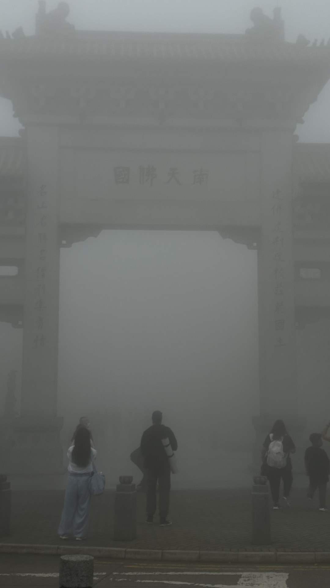

*Ворота Ngong Ping в апрельском тумане.*

Тай-О, рыбацкую деревню на западе острова, оставьте дополнением для раннего старта и хорошей погоды. Это следующий переезд, а не соседняя улица у Будды. Если хочется сидеть за обедом, а не смотреть на часы, закончите на Po Lin и вернитесь в Tung Chung. В три дня важнее спокойно увидеть Лантау, чем собрать все его названия.

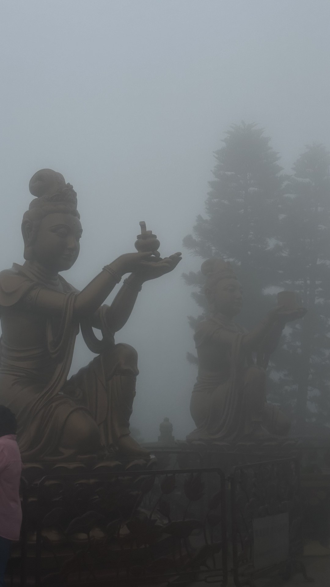

*Фигуры у Большого Будды: в этот день туман скрывал даже ближайший фон.*

## Какие билеты покупать и сколько заложить

Ниже обычные взрослые тарифы. Детские билеты, специальные акции и приоритетный проход сюда не включены.

| Билет | Цена на человека | Что вы получаете |
|---|---|---|
| Peak Tram Special Combo Return | ≈1 960 ₽ / 182 HKD | Фуникулёр туда-обратно и Sky Terrace 428 |
| Только Sky Terrace 428 | ≈860 ₽ / 80 HKD | Вход на террасу, без подъёма |
| Ngong Ping 360, Standard, туда-обратно | ≈3 170 ₽ / 295 HKD | Две поездки в обычной кабине |
| Ngong Ping 360, Crystal, туда-обратно | ≈3 920 ₽ / 365 HKD | Две поездки с прозрачным полом |
| Star Ferry, верхняя палуба, будний день | ≈54 ₽ / 5 HKD | Одна городская переправа |

**Combo на Пик, обычная канатка на Лантау и одна переправа в будни — около 5 180 ₽ на человека, или 482 HKD.** Это только перечисленные билеты. Аэропорт, метро, питание и жильё оплачиваются сверху. Отказ от стеклянной кабины сохраняет примерно 750 ₽; отказ от всего платного подъёма на Пик меняет и впечатление, и способ добраться наверх.

Два дорогих подъёма разумно развести по разным дням и по возможности оставить выбор до прогноза. Приостановка канатки и работа объекта в плохую погоду — разные ситуации: во втором случае не следует рассчитывать на автоматический возврат.

## Где жить, чтобы этот маршрут не развалился

**Central или Sheung Wan** удобны для первого дня, ресторанов на острове и поездки на Пик. Смотрите не только расстояние до метро, но и рельеф: несколько кварталов вверх после длинной прогулки чувствуются иначе, чем такой же отрезок у воды.

**Tsim Sha Tsui или Jordan** удобны для Коулуна и вечерней набережной. Здесь важны площадь номера, наличие окна и отзывы о шуме. Самая дешёвая комната в нужном районе может оказаться плохим обменом денег на сон; для короткой поездки ежедневная усталость дороже небольшой экономии.

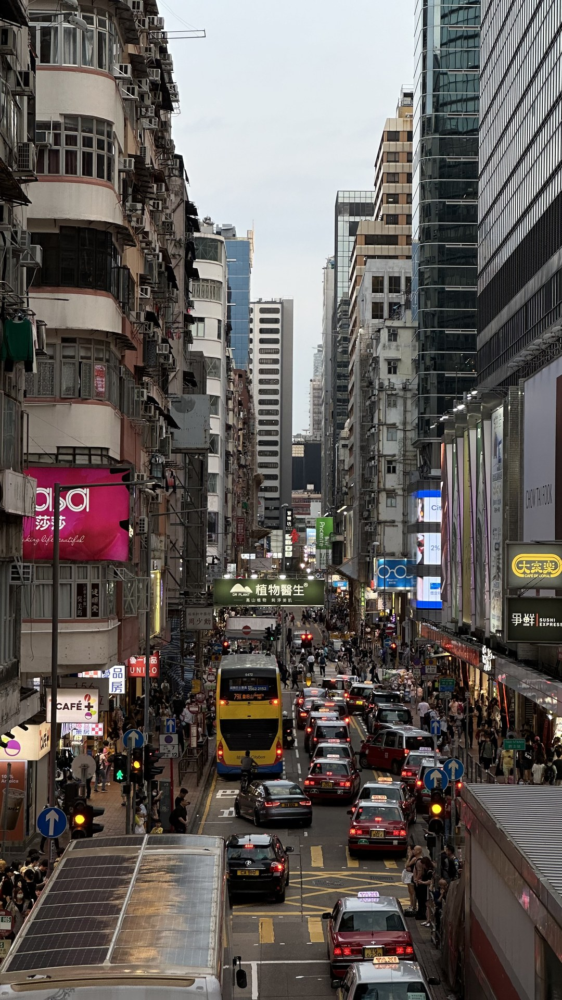

*Выбирая отель, смотрите на улицу и подъём к нему, а не только на название района.*

Для этого плана я бы выбирал один отель на все ночи. <a href={stay} rel="sponsored noopener">Посмотреть отели Гонконга на свои даты</a> удобно после выбора берега: сначала отберите Central—Sheung Wan или Tsim Sha Tsui—Jordan, затем сравните комнаты по площади. Переезд между двумя гостиницами отнимет часть короткой поездки.

Из аэропорта HKG поезд **Airport Express** довозит до станции Hong Kong примерно за 24 минуты. Взрослому — около **1 290 ₽ / 120 HKD с Octopus** или **1 400 ₽ / 130 HKD за обычный разовый билет**. Это время поезда, не дорога до номера. До гостиницы на другом берегу или вдали от станции понадобится ещё один переезд; выбирайте транспорт по конечному адресу.

## Если погода испортилась

Для прогулок приятнее середина и конец осени: обычно суше, чем летом, а жара слабее. Но октябрь не отменяет тропические циклоны — они могут затрагивать Гонконг с мая по ноябрь. [Гонконг в октябре](/trips/october/hong-kong/) поможет выбрать сезон, а прогноз на дни поездки определит порядок маршрута.

При обычном дожде замените горы на **M+ в Западном Коулуне**. Он открыт со вторника по воскресенье, обычно с 10:00 до 18:00, по пятницам до 22:00; понедельник не подходит. Выставки и условия входа выбирайте перед визитом. При сильном штормовом предупреждении музей тоже может закрыться: это повод отменить прогулку, а не искать следующий объект через весь город.

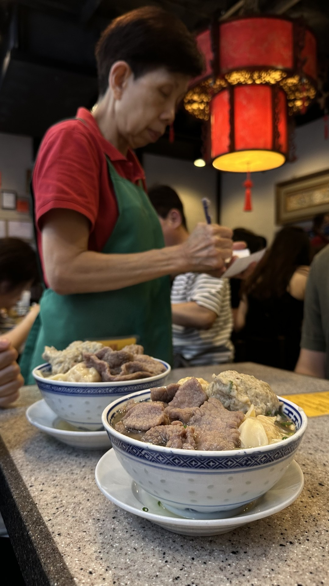

*Пауза на еду в Гонконге тоже часть поездки.*

Россиянам для туристического визита до **14 дней** виза в Гонконг не нужна. У материкового Китая и Макао свои правила контроля — гонконгский въезд их не заменяет. Подробности собраны на странице [въезда в Гонконг для россиян](/visa/hong-kong/). В <a href={insurance} rel="sponsored noopener">подборе страховки на даты поездки</a> укажите Гонконг и проверьте территорию покрытия, особенно если добавляете Макао. Общие вопросы направления — в [путеводителе по Гонконгу](/hong-kong/).

## Что пишут те, кто был

В трёх прочитанных отчётах форума Винского о поездках в декабре 2025, феврале и марте 2026 года важнее всего оказался **запас времени**. Это небольшая выборка; представительной считать её нельзя.

В февральской поездке путешественники отказались от Лантау после позднего подъёма, а у Аллеи звёзд развернулись из-за толпы. При этом утром они гуляли у воды под ясным небом. Хорошая погода сама по себе не делает все точки одинаково удобными — раннее начало дня полезнее попытки наверстать вечером.

Мартовский рассказ начинается с сокращения четырёх дней до двух и описывает утомительные переезды через Макао; сам текст обрывается у пограничного контроля. Принимать его за доказательство, что оба города легко укладываются в два дня, нельзя. В декабрьском отчёте прозрачный пол описан как способ пощекотать нервы: сам вид гор не зависит от этой доплаты. Практический вывод для этого маршрута: сохраняйте день на Лантау и не покупайте улучшения билета раньше, чем поняли, нужны ли они вам.

## Частые вопросы

### Можно ли увидеть Гонконг за один день?

Да, если выбрать один связный маршрут: Central, переправа Star Ferry и набережная Tsim Sha Tsui. Пик добавляйте при ясной погоде и запасе времени. Лантау оставьте на следующую поездку; при короткой стыковке сначала посчитайте время на возвращение в аэропорт.

### Стоит ли включать Макао в три дня?

Только вместо Лантау или одного городского дня. У Макао отдельный пограничный контроль, а дорога включает больше, чем сам паром или автобус по мосту. Для первого знакомства с Гонконгом я бы сохранил три дня в нём.

### Нужно ли заранее покупать оба подъёма?

Не обязательно. Сначала проверьте погоду, условия переноса и состав билета. У Peak Tram combo есть терраса, но нет приоритетной очереди; у Ngong Ping билет в обычную кабину не даёт прозрачного пола. Доплата должна покупать нужное вам впечатление.
