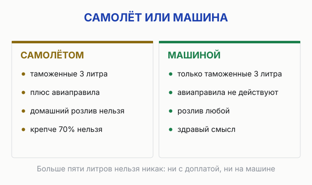

import AffiliateNote from '../../components/post/AffiliateNote.astro';
import { aviasalesRoute, cherehapaCountry, sutochnoRegion } from '../../data/affiliate.js';

Половина того, что везут из Абхазии, до дома не доезжает. Не потому что бьётся — потому что отбирают на границе. Человек честно покупает пакет мандаринов и домашний сулугуни, а на Псоу выясняется, что первое запрещено вывозить вовсе, а второе без заводской упаковки инспектор вправе развернуть. Я перечитал документы обеих сторон границы — российские нормы и абхазские запреты — и собрал список: что везти можно, сколько именно и что оставить на прилавке, как бы ни уговаривал продавец.

> **Если коротко:** главные покупки — **сыр, аджика, специи, мёд и вино**. Готовых продуктов животного происхождения можно **до 5 кг в заводской упаковке**, алкоголя — **3 литра без пошлины** (до 5 л — с доплатой 10 € за литр). А вот **фрукты, орехи и зелень в сумке через границу нельзя совсем** — действует запрет Россельхознадзора, и мандарины у туристов реально изымают. Полис берут заранее: ОМС в Абхазии не действует, а эвакуация в Сочи стоит дороже поездки — <a href={cherehapaCountry('abkhazia', 'chto_privezti_iz_abhazii_2026')} class="aff-cta" rel="sponsored">подобрать страховку в Абхазию</a>. За покупками удобнее жить рядом с рынком: <a href={sutochnoRegion('https://abkhazia.sutochno.ru/', 'chto_privezti_abhazia_2026')} class="aff-cta" rel="sponsored">жильё в Абхазии с оплатой картой РФ</a> — рынки здесь разбирают с утра.

<AffiliateNote />

---

## Что привезти из Абхазии в подарок?

**Съедобное здесь бьёт любые магниты: сыр, аджика, специи, мёд, вино и чача.** Это не сувениры «для галочки» — это то, что в Абхазии реально делают, а не привозят с оптовой базы.

Рабочий список, проверенный на совместимость с таможней:

- **Копчёный сулугуни** — главный гастрономический трофей с сухумского рынка. Ограничение одно, и о нём ниже.
- **Аджика** — настоящая абхазская острая паста, а не соус из супермаркета. В закрытой банке с этикеткой проблем на границе не создаёт.
- **Специи и приправы** — уцхо-сунели, смеси для харчо, перечные связки. Сушёные приправы в упаковке к подкарантинной свежей зелени не относятся.
- **Мёд** — каштановый и горный. Промышленно упакованный мёд выведен из-под ветеринарного запрета отдельным указанием 2010 года — не 2007-го, как часто пишут. Отдельным решением ещё 2007 года.
- **Вино и чача** — по литражу и крепости есть точные правила, разберу отдельным разделом.
- **Чурчхела** — формально кондитерское изделие, а не свежий фрукт, и под растительный запрет не попадает.

Несъедобное, которое не стыдно дарить: керамика, изделия из шерсти, джезвы для кофе. Без ограничений.

## Какие продукты можно везти через границу, а какие нет?

**Правило простое: заводская упаковка и разумный объём проходят, а «домашнее в пластике» и ящики разворачивают.** Граница на Псоу считается въездом в Россию, действуют российские нормы ввоза.

| Что везёте | Норма | Условие |
|---|---|---|
| Сыр, копчёности, готовое мясное | до **5 кг** на человека | только **заводская упаковка** (ФТС) |
| Мёд, молочные продукты | в общих пределах | **промышленная упаковка**: молочное разрешено с 2007 года, мёд — с 2010 |
| Алкоголь | **3 л** без пошлины, до **5 л** с доплатой | 10 € за каждый литр сверх трёх |
| Фрукты, овощи, орехи, зелень | **нельзя вовсе** | запрет Россельхознадзора, см. ниже |
| Сушёные специи, чурчхела, варенье | без спецнормы | закрытая упаковка, личный объём |

Домашний сулугуни без маркировки — самая частая потеря: он вкуснее заводского, но инспектор вправе его не пропустить, и спорить в очереди бесполезно. Хотите именно рыночный — взвесьте риск сами.

Подробный разбор всех норм вывоза с номерами решений — в статье [про документы и границу с Абхазией](/blog/zagranpasport-v-abhaziyu-2026/), здесь я оставляю только то, что касается покупок.

## Почему мандарины и фрукты в сумке отберут?

**Потому что с абхазскими фруктами через границу едет коричнево-мраморный клоп — карантинный вредитель для всей территории ЕАЭС.** Россельхознадзор ввёл временные ограничения на ввоз растительной продукции в ручной клади и багаже из Абхазии и в своём разъяснении написал прямо: ограничения «сохраняются». Отмены с тех пор ведомство не публиковало — я проверял [раздел ограничений по Абхазии](https://fsvps.gov.ru/importexport/abhaziya/ogranicheniya-na-vvoz/) на сайте Россельхознадзора 4 августа 2026 года.

Это не таможенная придирка, а фитосанитария: клоп в 2025 году официально признан в Абхазии прижившимся видом — вывести его не удалось. Поэтому пакет мандаринов у туриста на Псоу изымают на законных основаниях, как бы обидно это ни было.

Теперь про «нормы», которые вы наверняка видели. **«До 15 кг цитрусовых, а на машине до 50» — цифра, которой нет ни в одном документе.** Её пересказывают десятки сайтов друг за другом, но ни ФТС, ни Россельхознадзор такой нормы не публикуют. Общее правило для растительной продукции: без фитосанитарного сертификата не больше 5 кг. На абхазском направлении поверх него лежит тот самый запрет для ручной клади. Товарные партии тяжелее 5 кг идут только через предотгрузочный контроль с сертификатом — это про фуры поставщиков, не про туристов.

Что в итоге: мандарины из Абхазии — прекрасный повод для поездки и никакой для сумки. Ешьте на месте.

## Сколько алкоголя можно вывезти в Россию?

**Три литра на человека старше 18 лет — без пошлины. От трёх до пяти — с доплатой 10 евро за каждый литр сверх нормы.** Это Решение Совета ЕЭК №107 от 20 декабря 2017 года, оно действует на всей границе ЕАЭС, и Псоу не исключение.

Больше пяти литров на человека физлицу нельзя даже с доплатой. Считается всё вместе: вино, чача, ликёры — литраж суммируется. Семья из двух взрослых легально везёт шесть литров бесплатно, и это, честно говоря, покрывает любой разумный сценарий «привезти домой и подарить».

Один практический момент: доплату за 4-й и 5-й литр оформляют на границе, и это очередь и время. Если не везёте вино ящиками — держитесь трёх литров и проходите без остановки.

## Как везти вино и чачу в самолёте?

**В багаже разрешены напитки крепостью от 24% до 70%, не больше 5 литров на пассажира; крепче 70% — запрещено совсем.** Это приказ Минтранса №104 о досмотрах. Напитки слабее 24% (вино как раз здесь) отдельным лимитом не ограничены, но летят в пределах нормы багажа.

Как это выглядит на практике: мы купили чачу на сухумском рынке — и она не улетела. Не из-за градуса, а из-за тары: разливают в бутылку из-под лимонада, а домашний алкоголь без заводской упаковки в самолёт не берут вовсе. Так что покупать на рынке имеет смысл только если едете машиной.

Тут абхазская специфика бьёт больно: **рыночная чача часто крепче 70%**, продавцы этим гордятся. Такая бутылка в самолёт не сядет ни в багаже, ни тем более в ручной клади — в ручную кладь вообще только ёмкости до 100 мл. И второе: **домашний алкоголь без заводской тары авиационные правила не пропускают вовсе** — пластиковая бутылка или стекло без этикетки одинаково не годятся. Берёте чачу в дорогу самолётом — берите заводского розлива, с этикеткой и указанной крепостью.

Своего аэропорта у Абхазии для массовых рейсов пока мало — большинство летит через Сочи (Адлер): от границы до терминала около десяти километров. <a href={aviasalesRoute('MOW', 'AER', 'chto_privezti_abhazia_2026')} class="aff-cta" rel="sponsored">Найти билет Москва — Сочи</a> — сравнивает все авиакомпании сразу, cookie живёт 30 дней, можно поймать цену заранее.

На машине через Псоу авиаправила не действуют — остаются только таможенные три литра и здравый смысл.

## Можно ли вывозить сулугуни, мёд и аджику?

**Можно. Это лучшие покупки в Абхазии, условий ровно два: упаковка и объём.**

**Сулугуни и вообще сырно-мясное** — до 5 кг на человека в заводской упаковке. Формулировка ФТС буквально требует «готовой продукции животного происхождения в заводской упаковке», поэтому вакуумный сыр с этикеткой производителя проходит спокойно, а взвешенный на рынке кусок в пакете правилу не соответствует: пропустят или нет — лотерея, и строить на ней план не стоит.

**Мёд** — промышленно упакованный ввозить можно: термически обработанные молочные продукты выведены из-под общего запрета в 2007 году, мёд — отдельным указанием в 2010-м. Оба разрешения сняли часть общего ветеринарного запрета отдельными решениями ещё в 2007 году. Банка с этикеткой вопросов не вызывает, а безымянная «от пасечника у дороги» — формально та же серая зона, что и рыночный сыр.

**Аджика, ткемали, варенье** — консервированное в закрытых банках проблем не создаёт: это переработанная продукция, а не свежая растительная. Единственное разумное ограничение — объём, который выглядит личным потреблением, а не партией на продажу. «Пара банок каждого вида» вопросов не вызывает.

## Что нельзя вывозить из Абхазии совсем?

**Эвкалипт под прямым запретом самой Абхазии, а самшит краснокнижный — покупать его не надо.**

С эвкалиптом всё однозначно: Государственная инспекция по карантину растений Абхазии ещё [в ноябре 2019 года запретила](https://apsadgil.info/news/society/zapreshchen-vyvoz-evkalipta-iz-abkhazii/) «трансграничное перемещение всех видов эвкалиптов» — из-за вредителя офелимуса, угрожающего эвкалиптовым рощам республики. Веники и ветки, которые предлагают у дорог, под этот запрет попадают — с риском изъятия уже на абхазской стороне.

С самшитом история грустнее. Колхидский самшит — реликт, занесённый в Красную книгу; после нашествия огнёвки от самшитовых лесов Абхазии осталась примерно треть. Прямого «акта о запрете для туристов» я не нашёл и выдумывать его не буду — но покупать изделия «из свежего самшита» не стоит по той же причине, по которой не покупают кораллы: спрос добивает то, что и так умирает. Старые точёные вещи из сухого дерева — другое дело.

И обычный набор любой границы: оружие и его муляжи, «народные лекарства» с сильнодействующими веществами, всё похожее на антиквариат — без документов не пытайтесь.

## Что привезти детям, маме, коллегам?

**Правило одно: подарок должен пережить дорогу и не требовать холодильника.**

- **Детям** — чурчхела (это фактически конфета), рахат-лукум местных цехов, мелкая керамика. Ничего скоропортящегося: дорога от рынка до дома легко занимает сутки.
- **Маме** — каштановый мёд в фабричной банке, набор специй, платок или шерстяная вещь с рынка. Мёд берите с этикеткой — и границе спокойнее, и понятно, что дарите.
- **Коллегам** — специи и аджика: недорого, легко делится на всех, ни у кого не потечёт в сумке. Связка перца в офисе смотрится лучше магнита.
- **Мужчине** — чача заводского розлива в стекле (про крепость и самолёт — выше) или джезва: кофе по-восточному тут варят всерьёз.

Один совет от практика границ: всё съедобное складывайте в одну сумку. Если инспектор захочет посмотреть — покажете разом, а не будете перетряхивать чемодан на стойке.

## Где покупать: рынок Сухума, Гагры или магазин?

**Рынок берёт вкусом и атмосферой, магазин — упаковкой, которая пройдёт границу.** Это не «или-или», это последовательность: пробовать и выбирать — на рынке, а версию «в дорогу» брать заводскую.

Центральный рынок Сухума — главное место: ряды сулугуни, специи на развес, аджика, мёд. В Гагре рынок меньше, но для базовых покупок хватает. Если жить там, в Сухум ради рынка удобно съездить одним днём, соединив с [Новым Афоном](/blog/novoafonskaya-peschera-2026/).Предостерегу: цен здесь я специально не называю — рыночные цены в Абхазии не публикует никто, они меняются от сезона и от того, как вы торгуетесь. Любые «средние цены рынка» из интернета — чьи-то воспоминания.

Два практических момента важнее цен. Первый: **рынки работают с утра** — к обеду лучшее разбирают. Второй: **карты не работают нигде.** Российские в Абхазии не принимаются, нужны наличные рубли; сколько брать — в разборе [как платить за границей](/blog/pay-abroad-2026/).

## Когда сезон мандаринов и что везти по месяцам?

**Мандариновый сезон длится с конца октября по январь, пик сбора — ноябрь и декабрь.** Масштаб честно впечатляет: только с ноября к середине декабря 2025 года Абхазия отправила в Россию почти 20 тысяч тонн мандаринов — это данные «Ведомостей» по таможенной статистике. Но всё это — товарные партии с фитосертификатами. Туристу, как мы разобрали выше, мандарины в сумке всё равно нельзя — сезон меняет только то, что вы едите на месте.

По остальным месяцам:

- **Июль–август** — инжир, персики, молодой сыр. Всё это тоже «есть здесь», а не «везти домой».
- **Сентябрь–октябрь** — сбор винограда: у виноделен появляется молодое вино, чача свежего урожая. Лучшее время для алкогольных покупок.
- **Ноябрь–январь** — мандарины, хурма, фейхоа на каждом углу. И меньше туристов на рынках.
- **Февраль–июнь** — межсезонье: мёд, специи и аджика одинаково хороши круглый год.

Если поездка планируется именно «за вкусом», смотрите [когда вообще ехать в Абхазию](/blog/abkhazia-2026/) — там сезонность по погоде и морю.

## Что из сувениров везти не стоит?

**Треть прилавка — то, что не пройдёт границу, испортится в дороге или сделано не в Абхазии.**

- **Свежие фрукты и орехи** — изымут, причина разобрана выше. Сколько бы ни уверял продавец, что «все возят».
- **Домашнее вино и чача без заводской тары** — в самолёт нельзя по правилам досмотра независимо от бутылки, на машине тоже рискованно.
- **Эвкалиптовые веники и «свежий самшит»** — запрет абхазской стороны и Красная книга соответственно.
- **«Горный мёд» без этикетки по цене заводского**: на рынках хватает перекупленного. Хотите настоящий — берите с маркировкой производителя, он и границу пройдёт.
- **Магниты и «сувениры», которые продаются на любом курорте** — не запрещены, но зачем.

## FAQ

**Можно ли провезти мандарины из Абхазии, если ехать на машине?**
**Нет.** Запрет Россельхознадзора действует на растительную продукцию в ручной клади и багаже независимо от транспорта. Машина не исключение — досмотр на Псоу тот же.

**Можно ли взять чачу 60% в самолёт?**
**В багаже — да, до 5 литров суммарно** (норма для напитков 24–70% по приказу Минтранса №104), в заводской таре с этикеткой. Крепче 70% — нельзя совсем. В ручную кладь любой алкоголь — только ёмкостями до 100 мл.

**Сколько сыра можно вывезти?**
**До 5 кг на человека, в заводской упаковке.** Рыночный без маркировки инспектор вправе не пропустить — правило ФТС говорит именно про готовую продукцию животного происхождения в заводской упаковке.

**Проверяют ли сумки на границе?**
Выборочно, но регулярно — это обычный таможенный и фитосанитарный контроль при въезде в Россию. Считайте, что посмотреть могут, и собирайте сумку так, чтобы за неё не было страшно.

**Что точно доедет без проблем?**
Специи, аджика и варенье в закрытых банках, чурчхела, заводской сыр в вакууме, мёд с этикеткой, вино в пределах трёх литров. Этот набор проходит границу без единого вопроса.

---

Последнее, что стоит сделать до поездки, — страховка: ОМС в Абхазии не действует, а медицина для туриста платная. <a href={cherehapaCountry('abkhazia', 'chto_privezti_abhazia_2026')} class="aff-cta" rel="sponsored">Оформить страховку в Абхазию</a> — пять минут, оплата картой РФ.

## Что почитать дальше

- [Нужен ли загранпаспорт в Абхазию](/blog/zagranpasport-v-abhaziyu-2026/) — документы, граница и полные нормы вывоза
- [Стоит ли ехать в Абхазию](/blog/abkhazia-2026/) — сезоны, цены, безопасность без пересказов
- [Озеро Рица 2026](/blog/ozero-ritsa-2026/) — цена входа, дорога и когда ехать, чтобы не стоять в очереди
- [Гагра: пляжи и жильё](/blog/gagra-2026/) — если базой будет главный курорт
- [Как платить за границей](/blog/pay-abroad-2026/) — почему наличные и сколько брать

*Фото: Jon Gudorf Photography / [Wikimedia Commons](https://commons.wikimedia.org/wiki/File:Churchkhela_-_grape_and_nut_dried_on_string_in_sun.jpg) / [CC BY-SA 2.0](https://creativecommons.org/licenses/by-sa/2.0/deed.ru).*
