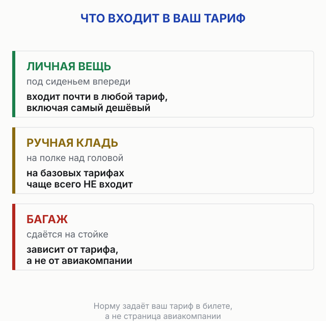
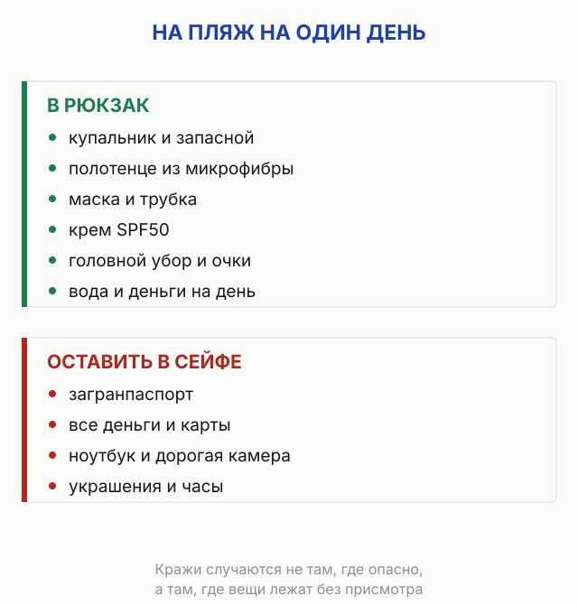
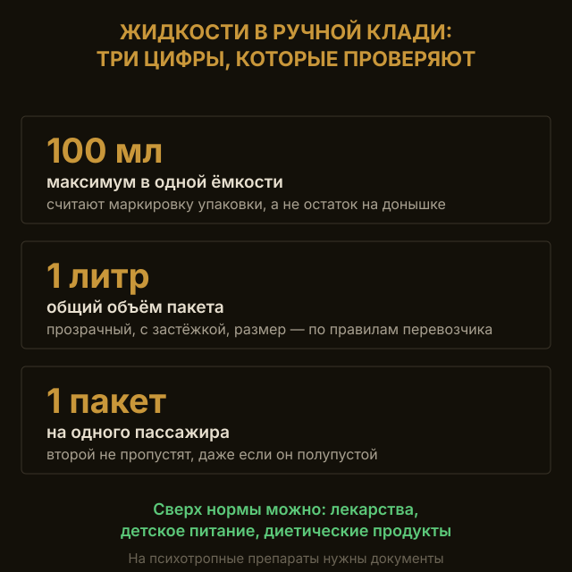
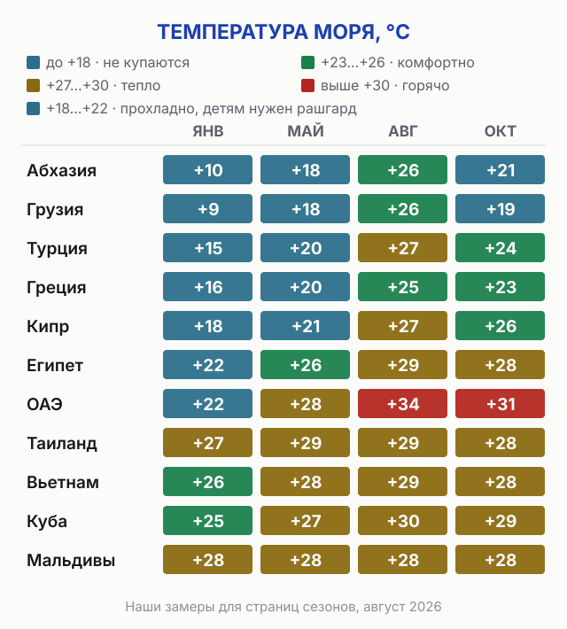

import PackingChecklist from '../../components/PackingChecklist.astro';
import AffiliateNote from '../../components/post/AffiliateNote.astro';
import { TP_LINKS, cherehapaTravel, ostrovokSearch } from '../../data/affiliate.js';

Собрать чемодан на море — это не «накидать вещей за час до такси». Половину забытого приходится докупать на месте втридорога, вторую половину тащить зря. За годы поездок я свёл сборы к одному принципу: список под **конкретную** поездку, а не «универсальный». На два дня и на месяц, вдвоём и с годовалым ребёнком, в самолёт и на машине наборы разные. Ниже живой чек-лист, который подстраивается под ваш случай, плюс разбор по категориям: что реально нужно, что лучше купить на месте и что **не брать** вообще.

> **Если коротко:** базовый набор на море — документы (загран + страховка + рабочая карта + наличные), купальник ×2, SPF50, головной убор, лёгкая одежда из хлопка и льна, аптечка по симптомам и техника (повербанк, переходник, eSIM). Жидкости в ручную кладь — **только до 100 мл**. С ребёнком список расширяется по возрасту, на длинную поездку добавляется мини-стирка. Отметьте своё в чек-листе ниже и скопируйте в заметки.

Одну вещь из этого списка нельзя докупить на месте — страховку: за границей её оформляют до вылета, а лечение туриста везде платное. <a href={cherehapaTravel('chto_vzyat_na_more_2026')} class="aff-cta" target="_blank" rel="sponsored noopener">Оформить страховку на поездку</a> — пара минут, оплата картой РФ.

<AffiliateNote />

## С чего начать сборы?

Выберите тип поездки, длительность, кто едет и транспорт — список перестроится под вас. Галочки сохраняются в браузере, так что можно собираться несколько дней и не терять прогресс. Кнопка **«Скопировать список»** выгружает его в заметки или Telegram, **«Печать»** — на бумагу.

<PackingChecklist preset="sea" heading="Что взять на море" />

Дальше — разбор по категориям: почему именно эти вещи, на чём экономить и где переплата.

## Какие документы и деньги брать на море?

Это единственная категория, где забыть что-то — значит сорвать поездку. Всё остальное докупается, документы — нет.

* **Загранпаспорт** со сроком действия **6+ месяцев** на дату въезда — иначе на границе развернут.
* **Внутренний паспорт** — берите даже за границу: если загран потеряется, возвращаться домой будете по нему.
* **Билеты и брони** — сохраните в телефон офлайн и сделайте по одной распечатке. На границе иногда спрашивают, где вы остановитесь, — распечатка брони снимает вопрос за секунду.
* **Медицинская страховка.** За границей лечение для туриста платное, и счёт за обычный отит может уйти за сотни долларов. Полис на 2 недели стоит примерно как ужин на двоих. <a href={cherehapaTravel('chto_vzyat_na_more_2026')} class="aff-cta" target="_blank" rel="sponsored noopener">Сравнить страховки на море за пару минут</a> — покрытие подбирается под даты, оплата картой РФ.
* **Карты и наличные.** Заранее проверьте, работают ли ваши карты в стране назначения, и возьмите **$200–300** наличными (≈17–25 тыс. ₽ по курсу ЦБ на 14.08.2026) на случай, если банк подведёт. На юге и в небольших городах наличные нужны чаще, чем кажется.

Жильё надёжнее бронировать там, где принимают карты РФ и есть поддержка на русском. <a href={ostrovokSearch('chto_vzyat_na_more_2026')} class="aff-cta" target="_blank" rel="sponsored noopener">Подобрать отель у моря с оплатой картой РФ</a> — принимает Visa, Mastercard и МИР.

## Сколько одежды брать на море?

Главное правило пляжного гардероба — **лёгкие натуральные ткани** (хлопок, лён) и вещи, которые быстро сохнут и не мнутся. На жаре синтетика превращается в наказание.

Базовый набор на неделю:

* **Купальник или плавки — минимум два.** Пока один сохнет, во втором купаетесь. Мокрый купальник под одеждой — прямой путь к раздражению кожи.
* **Лёгкие футболки, шорты, сарафаны, платья** — по числу дней с небольшим запасом.
* **Лёгкая накидка или рубашка с длинным рукавом** — прикрыться в самый солнечный час с 12 до 16, когда сгораешь за двадцать минут.
* **Головной убор** — панама, кепка или шляпа с полями. Не аксессуар, а защита от перегрева.
* **Обувь в трёх ролях:** сланцы для пляжа и бассейна, разношенные кроссовки для прогулок, плюс что-то «на выход», если планируете рестораны.

Два нюанса, на которых часто спотыкаются. Для **галечного пляжа** (Сочи, Абхазия, Хорватия) берите аквашузы, иначе зайти в воду — пытка. В **длинную поездку** (от двух недель) не везите вещи на все дни: возьмите мыло или порошок для стирки и стирайте раз в неделю, чемодан легче, голова спокойнее.

## Какой SPF нужен на море и сколько его брать?

Половина испорченных отпусков — это обгоревшая в первый день спина. Поэтому начну с главного:

* **Солнцезащитный крем SPF50.** Наносить каждые два часа и обязательно после купания. Берите флакон с закручивающейся крышкой — в забитом чемодане крем-«помпа» выдавливается и пачкает всё вокруг.
* **Средство после загара** с пантенолом или алоэ — снимает красноту, если всё же перестарались.
* **Гигиеническая помада** — на солнце и ветру губы трескаются первыми.

Дальше идёт стандартный набор: зубная щётка и паста, дезодорант, расчёска, влажные и сухие салфетки, увлажняющий крем. Шампунь и гель в отелях обычно есть, но качество лотерейное, так что если волосы привередливы, возьмите свои в мини-флаконах или купите на месте. Для линз нужны раствор и контейнер либо однодневные на все дни поездки, и **запасная пара в ручной клади**.

Принцип сборов косметички простой: лучше что-то забыть и купить на отдыхе, чем тащить лишний вес. Всё, что продаётся в любой аптеке у моря, — не берём.

## Что положить в аптечку на море?

Здесь важна осторожность. Я **не называю конкретные лекарства** — это к врачу. Правильнее собрать аптечку по категориям и обсудить состав со своим терапевтом или педиатром за пару недель до вылета, особенно если есть хронические заболевания.

Что стоит продумать по группам:

* Обезболивающее и жаропонижающее — **привычное вам**.
* От аллергии (антигистаминное) — пыльца, новая еда, укусы.
* От расстройства желудка и отравления — на море это случается чаще всего из-за непривычной воды и еды.
* Антисептик, пластыри, бинт — порезы о камни и кораллы заживают долго на жаре.
* От укачивания — если едете на машине по серпантину или планируете морскую прогулку.
* Средства от укусов насекомых и солнечных ожогов.
* **Индивидуальные лекарства** — с запасом, с рецептом или назначением, и обязательно в ручную кладь: если багаж потеряют, без них нельзя.

Аптечку удобно собрать в отдельную косметичку или плотный пакет. Базовые рекомендации по составу для путешественников публикуют [Роспотребнадзор](https://www.rospotrebnadzor.ru/) и [ВОЗ](https://www.who.int/) — это надёжнее, чем советы из чатов.

## Можно ли везти лекарства через границу?

**Почти всё можно, но привычные российские препараты в некоторых странах считаются наркотиками, и за них депортируют.** Это не страшилка: самый известный случай — корвалол и валокордин, где действующее вещество фенобарбитал. В Японии оно относится к запрещённым, и реальные россияне получали депортацию с запретом на въезд. Список запрещённых веществ публикует японский минздрав, и такие списки есть у многих стран.

Правила, которые работают везде:

- **Везите в заводской упаковке с инструкцией.** Россыпь таблеток в органайзере — это то, что вызывает вопросы, потому что опознать её нельзя.
- **На рецептурные препараты возьмите рецепт или выписку**, лучше с международным названием действующего вещества, а не торговым. Таможне понятнее «paracetamol», чем название бренда.
- **Проверьте по действующему веществу, а не по названию.** Один и тот же препарат в разных странах продаётся под разными марками, а запрещают именно вещество.
- **Сильнодействующее и психотропное** — отдельная история: тут нужны документы, и разбираться надо заранее, а не в очереди на досмотре.

Отдельно про количество: везти надо столько, сколько нужно на поездку с небольшим запасом. Коробка про запас «на всю семью на год» выглядит как перевозка на продажу, и это другой разговор с таможней.

## Какую технику брать на море?

* **Смартфон и зарядка** — без них на море никуда: маршруты, фото, переводчик, брони.
* **Повербанк** — на пляже и в дороге розетки нет. В самолёт — **только в ручную кладь**, в багаж литиевые аккумуляторы запрещены.
* **Переходник для розеток** — если в стране другой стандарт. Проверьте заранее, не угадывайте.
* **eSIM вместо роуминга** — настройка за пять минут, тариф от пары долларов в неделю, и вы на связи сразу после посадки, без поиска местной симки. <a href="https://airalo.pxf.io/c/1209822/1310283/15608?erid=2VtzqxRWDfm&sharedID=546042_chto_vzyat_na_more_2026&u=https%3A%2F%2Fairalo.com%2Fru" class="aff-cta" target="_blank" rel="sponsored noopener">Купить eSIM до вылета</a> — работает сразу после посадки, без поиска салона.

Фотоаппарат, электронная книга и дорожный фен — по желанию и обычно для поездок от недели. На пару дней смартфона хватает.

## Что добавить в список, если едете с ребёнком?

С ребёнком сборы — отдельная история, и зависит от возраста. Запрос «что взять ребёнку на море» — один из самых частых, и не зря.

* **0–1 год:** детское питание или смесь, подгузники с запасом, детский крем и присыпка, слинг или эргорюкзак, любимая игрушка для сна.
* **1–3 года:** подгузники, сменная одежда (много — пачкаются постоянно), горшок-дорожный, игрушки для пляжа, головной убор.
* **3–7 лет:** надувной круг или нарукавники, игрушки для песка, влажные салфетки пачками, перекус.
* **7+ лет:** своя бутылка для воды, развлечения в дорогу (книги, скачанные мультфильмы), солнцезащита детская.

Общее правило для всех возрастов: **детская одежда берётся с запасом** и обязательно головной убор. Детская аптечка собирается отдельно от взрослой, а состав — только с педиатром.

## Как длительность поездки меняет список?

Длительность — главная ось сборов, её часто недооценивают.

* **1–3 дня.** Минимум: один комплект на смену, косметика в мини-формате, без техники сверх смартфона. Всё влезает в ручную кладь — и это идеал, багаж можно не сдавать.
* **Неделя.** Базовый набор из чек-листа выше. Стирка не нужна, вещей хватает впритык.
* **10–14 дней.** Добавляется мини-стирка (мыло или порошок), запас расходников косметички, второй купальник лишним точно не будет.
* **Месяц и дольше.** Не везите гардероб на все дни — это бессмысленный вес. Берите на 7–10 дней и стирайте. Расходники (SPF, линзы, лекарства) — с запасом, их не всегда удобно докупать.

## Сколько багажа можно взять с собой?

**Норму задаёт не авиакомпания, а ваш тариф — и на самом дешёвом тарифе багажа нет вообще.** Это главная ловушка сборов: человек смотрит правила перевозчика, видит «до 23 кг» и не замечает, что его билет куплен по тарифу, где в цену входит только маленькая сумка под сиденьем.

Разберитесь с тремя разными вещами, которые часто путают:

- **Личная вещь** — то, что помещается под сиденье впереди: рюкзачок, дамская сумка, ноутбучная сумка. Входит почти в любой тариф, включая самый дешёвый.
- **Ручная кладь** — то, что едет на полке над головой. На базовых тарифах её обычно нет, и она продаётся отдельно.
- **Багаж** — то, что сдают на стойке. Тоже привязан к тарифу, а не к перевозчику.

**Что делать до сборов.** Откройте свой билет и найдите строчку про норму именно вашего тарифа: цифры на главной странице авиакомпании к нему могут не относиться. Габариты у разных перевозчиков разные, и чемодан, который прошёл в прошлом году, в этом может не влезть в рамку.

Доплата на стойке всегда дороже, чем покупка багажа заранее на сайте, и разница бывает в несколько раз. Если сомневаетесь, влезете или нет, — дешевле докупить заранее и не влезть, чем не докупить и влезть в другую сумму.

## Что взять на пляж на один день?

**Из чемодана на пляж переезжает совсем немного, и почти всё остальное только мешает.** Дневной набор помещается в один рюкзак:

- **Купальник или плавки, и лучше два комплекта на поездку** — пока один сохнет, второй на вас.
- **Полотенце из микрофибры.** Занимает вчетверо меньше обычного, сохнет за час и не тянет из отеля их махровое, которое потом нести обратно мокрым.
- **Маска и трубка, если планируете смотреть под воду.** Свой комплект окупается за три-четыре дня проката, а главное — он ваш по размеру лица, а прокатный течёт.
- **SPF, головной убор, вода, очки.** Крем наносят до выхода, а не на пляже, и обновляют после каждого купания.

Чего на пляже быть не должно: паспорт, все деньги и техника, которую жалко. Оставьте в сейфе то, что не готовы потерять, и берите с собой сумму на день. Пляжные кражи случаются не потому, что где-то опасно, а потому, что вещи лежат без присмотра, пока хозяева в воде.

## Что можно везти в ручной клади, а что нельзя?

Если летите, разберитесь с ручной кладью заранее — на досмотре отбирают именно по незнанию.

**Правило жидкостей строже, чем помнит большинство: ограничены и флакон, и общий объём, и число пакетов.**

* **Каждая ёмкость — не больше 100 мл**, и все они складываются в **один прозрачный пакет с застёжкой объёмом до 1 литра**. Пакет разрешён **один на пассажира**, у некоторых перевозчиков прямо указан размер 18×20 см. Правило касается крема, шампуня, антисептика, духов, зубной пасты и вообще всего, что течёт, мажется или брызгает.
* **Считается флакон, а не остаток.** Початый тюбик на 200 мл, в котором осталось на донышке, всё равно заберут: смотрят на маркировку упаковки. Переливайте в дорожные ёмкости заранее.
* **Исключения есть, и они конкретные:** лекарства, специальные диетические продукты и детское питание, включая материнское молоко, можно везти сверх нормы. Для препаратов с наркотическими и психотропными веществами и для биологических материалов нужны подтверждающие документы ([правила провоза жидкостей, гелей и аэрозолей](https://khv.aero/passengers/pravila-provoza-zhidkostey-geley-i-aerozoley-v-ruchnoy-kladi/)).
* **Купленное в дьюти-фри** едет отдельно от пакета, но только в запечатанном магазином пакете и с чеком внутри. Вскрыли до посадки — правило перестаёт работать.

В чек-листе выше такие пункты помечены значком **«≤100 мл»**, когда выбран транспорт «Самолёт».
* **Колюще-режущее** (ножницы, маникюрный набор, бритвенные станки со сменными лезвиями) — надёжнее сдать в багаж.
* **Аккумуляторы и повербанки** — наоборот, **только в ручную кладь**.
* В ручную кладь обязательно кладите вещи первой необходимости: документы, лекарства, запасную пару линз, зарядку. Потеряют багаж — вы не останетесь ни с чем.

## Что дешевле купить на месте, а что везти с собой?

**Везите то, что подбирается под вас, покупайте то, что одинаковое везде.** Это разделение работает лучше любых списков, потому что не зависит от страны и от цен.

**Везти с собой:**

- **Лекарства.** Не из-за цены, а из-за названий: в чужой аптеке вы не найдёте привычную упаковку, а объяснять симптомы на пальцах в плохом состоянии — то ещё удовольствие.
- **Очки и линзы**, включая запасную пару. Подбор — это не покупка, его на отдыхе не сделать.
- **Обувь, в которой вы ходили.** Новые босоножки на курорте — это мозоли на второй день.
- **Технику и зарядки.** Переходник дешевле дома, а оригинальная зарядка у моря продаётся втридорога или подделкой.

**Покупать на месте:**

- **Шампунь, гель, зубную пасту.** Дорожные форматы стоят дороже обычных, занимают место и попадают под правило жидкостей. Проще купить пузырёк на месте.
- **Пляжные тапки, надувное для детей, соломенную шляпу.** Всё это есть в любом курортном магазине, стоит копейки и не едет обратно.
- **Воду и еду на пляж.** Тащить из дома нет смысла нигде.

**Отдельно про солнцезащитный крем.** Его логично взять свой: на курортах он дороже, а в жарких странах ассортимент бывает странный. Но если места в чемодане нет, покупка на месте — не катастрофа, крем есть везде, где есть пляж.

## Что на море брать не надо?

Этот раздел почти никто не пишет, а зря — лишний вес и испорченные вещи начинаются именно здесь.

* **Много обуви.** Сланцы, кроссовки и одна пара «на выход» — потолок. Остальное мёртвым грузом.
* **Гардероб «на все случаи».** На море вы носите 30% того, что взяли. Берите то, что сочетается между собой.
* **Ценности и лишние украшения.** На пляже их некуда деть, а терять обидно. Дорогие часы и золото оставьте дома.
* **Полноразмерную косметику и бытовую химию.** Всё это есть в магазинах у моря и весит зря.
* **Фен и утюг.** В отелях почти всегда есть; если нет — дорожный фен компактнее обычного в разы.
* **«А вдруг пригодится».** Если сомневаетесь, брать ли вещь, — почти всегда не берите. Это самый честный фильтр.

## Какая вода в море будет в вашем месяце?

**От температуры воды зависит не столько настроение, сколько половина списка: до +22 °C ребёнку нужен гидрокостюм или рашгард, после +26 °C — только крем и вода.** Ниже наши замеры температуры моря по месяцам, которые мы ведём для страниц сезонов.

| Направление | Январь | Март | Май | Август | Октябрь | Декабрь |
|---|---|---|---|---|---|---|
| Абхазия | +10 | +10 | +18 | **+26** | +21 | +13 |
| Грузия (Батуми) | +9 | +10 | +18 | **+26** | +19 | +12 |
| Турция | +15 | +17 | +20 | **+27** | +24 | +17 |
| Греция | +16 | +16 | +20 | **+25** | +23 | +18 |
| Кипр | +18 | +18 | +21 | **+27** | +26 | +20 |
| Египет | +22 | +22 | +26 | **+29** | +28 | +24 |
| ОАЭ | +22 | +23 | +28 | **+34** | +31 | +25 |
| Таиланд | +27 | +28 | +29 | **+29** | +28 | +27 |
| Вьетнам | +26 | +26 | +28 | **+29** | +28 | +26 |
| Куба | +25 | +25 | +27 | **+30** | +29 | +25 |
| Мальдивы | +28 | +28 | +28 | **+28** | +28 | +28 |

Что из этого следует для сборов.

**Зимой купаться можно только в четырёх направлениях из одиннадцати.** Египет, Таиланд, Вьетнам, Мальдивы и Куба держат воду выше +25 °C круглый год. Турция, Греция, Кипр, Абхазия и Грузия зимой — это поездка к морю, а не в море: гидрокостюм не спасёт, купальник можно не класть.

**Май — месяц-обманка.** Воздух летний, а вода в Турции, Греции и на Кипре +20–21 °C. Взрослому терпимо, ребёнку холодно: если едете в мае с детьми, рашгард с длинным рукавом и полотенце побольше не роскошь.

**ОАЭ в августе — это +34 °C.** Море там в разгар лета не освежает, а работает как горячая ванна. Плавать в такой воде долго тяжело, и главное в списке смещается на солнцезащиту и питьевой режим.

Помесячные расклады по конкретным странам и месяцам собраны в [разделе сезонов](/seasons/) — там же погода, дожди и цены.

## Что меняется в списке, если ехать без загранпаспорта?

**Меняются документы и деньги, всё остальное остаётся тем же.** Ближайшее к России тёплое море, куда пускают по внутреннему паспорту РФ, — Абхазия. Разница со списком для заграницы такая:

- **Загранпаспорт не нужен и даже нежелателен**: в него ставят абхазский штамп, который потом создаёт проблемы с грузинской визой. Детям до 14 лет хватает свидетельства о рождении с красным штампом о гражданстве. Подробно — в разборе [нужен ли загранпаспорт в Абхазию](/blog/zagranpasport-v-abhaziyu-2026/).
- **Наличных нужно заметно больше.** Карты в Абхазии почти не принимают, банкоматов мало, валюта — рубль. Всю сумму на поездку везите с собой.
- **Страховка нужна всё равно.** Полис ОМС в Абхазии не действует: медицина для туристов платная, а эвакуация в Сочи стоит десятки тысяч рублей. Это тот случай, когда «мы же почти дома» стоит дорого.
- **Связь работает как дома**, российская симка ловит, eSIM покупать не надо.

По российским черноморским курортам помесячных замеров у нас нет, поэтому и советов по ним не даю: врать про воду в Анапе в мае не буду.

## Куда поехать на море и что пригодится именно там?

«На море» — это всегда конкретное направление в конкретный месяц, и набор подстраивается под погоду и сезон. У нас на каждое популярное направление есть свой чек-лист с реальными температурами и сезонной поправкой:

* [Что взять в Турцию](/packing/turkey/) — Анталья, Кемер, всё побережье по месяцам.
* [Что взять в Египет](/packing/egypt/) — Хургада и Шарм, Красное море круглый год.
* [Что взять в Абхазию](/packing/abkhazia/) — галечные пляжи, аквашузы обязательны.
* [Что взять в ОАЭ](/packing/uae/) — Дубай и Эмираты, жара и кондиционеры.
* [Что взять в Таиланд](/packing/thailand/) — Пхукет и Самуи, сезоны противоположны.
* [Что взять во Вьетнам](/packing/vietnam/) — Нячанг и Фукуок.

Не определились с месяцем? Сверьтесь с [таблицей сезонов 70+ направлений](/seasons/) — где в нужный вам месяц лучшая погода и цены. А полный список чек-листов по всем странам — на странице [сборов в поездку](/packing/).

## Что оформить до вылета, а что можно на месте?

**Три вещи не покупаются после вылета вообще, ещё две дешевле оформить дома.**

| Что | Когда оформлять | Почему так |
|---|---|---|
| **Медицинская страховка** | только до вылета | после вылета полис не действует на эту поездку, а лечение туриста платное почти везде |
| **Виза или разрешение на въезд** | до вылета | без него не посадят на рейс, деньги за билет сгорят |
| **Багаж сверх тарифа** | до вылета, на сайте | доплата на стойке дороже в разы |
| **eSIM** | удобнее до вылета | включается сразу после посадки, не надо искать салон с паспортом |
| **Жильё** | до вылета в пик сезона | в июле и августе на популярных направлениях «найдём на месте» не работает |

<a href={cherehapaTravel('chto_vzyat_na_more_2026')} class="aff-cta" target="_blank" rel="sponsored noopener">Оформить страховку до вылета</a> — покрытие под даты поездки, оплата картой РФ. <a href={ostrovokSearch('chto_vzyat_na_more_2026')} class="aff-cta" target="_blank" rel="sponsored noopener">Забронировать жильё у моря</a> — принимает Visa, Mastercard и МИР.

## FAQ

**Что обязательно взять на море из документов?**
**Загранпаспорт со сроком 6+ месяцев, внутренний паспорт, билеты и брони, медицинскую страховку, рабочую карту и наличные в местной валюте.** Брони держите офлайн в телефоне и одной распечаткой.

**Что взять на море в ручную кладь?**
**Документы, деньги, лекарства, запасную пару линз, зарядку и повербанк, один комплект одежды на смену.** Жидкости — только до 100 мл в прозрачном пакете.

**Сколько купальников брать?**
**Минимум два:** пока один сохнет, второй на вас. На длинную поездку — три.

**Что взять на море с ребёнком?**
**Базовый набор плюс по возрасту:** питание и подгузники для малышей, игрушки для пляжа, детская солнцезащита, головной убор и отдельная детская аптечка (состав — с педиатром).

**Сколько жидкости можно взять в ручную кладь?**
**Каждая ёмкость до 100 мл, все вместе в одном прозрачном пакете с застёжкой до 1 литра, пакет один на пассажира.** Смотрят на маркировку флакона, а не на остаток внутри. Лекарства, детское питание и материнское молоко разрешены сверх нормы.

**Почему в билете написано, что багажа нет?**
**Норму задаёт тариф, а не авиакомпания.** На базовых тарифах в цену входит только личная вещь под сиденьем; ручная кладь на полку и багаж покупаются отдельно. Докупать выгоднее заранее на сайте: на стойке дороже в разы.

**Когда в море на самом деле можно купаться?**
Зимой из популярных направлений вода выше +25 °C только в Египте, Таиланде, Вьетнаме, на Кубе и Мальдивах. В Турции, Греции, на Кипре, в Абхазии и Грузии зимой +9…+20 °C — это поездка к морю, а не в море.

**Что лучше не брать на море?**
**Лишнюю обувь, гардероб «на все случаи», ценности и украшения, полноразмерную косметику и бытовую химию, фен и утюг** — всё это есть на месте или не нужно.

---

*Актуально на 3 августа 2026. Список носит справочно-информационный характер. Состав аптечки и приём лекарств согласуйте с врачом. Визовые и таможенные правила, нормы провоза жидкостей и багажа проверяйте на официальных сайтах авиакомпаний и консульств перед поездкой — они меняются.*
