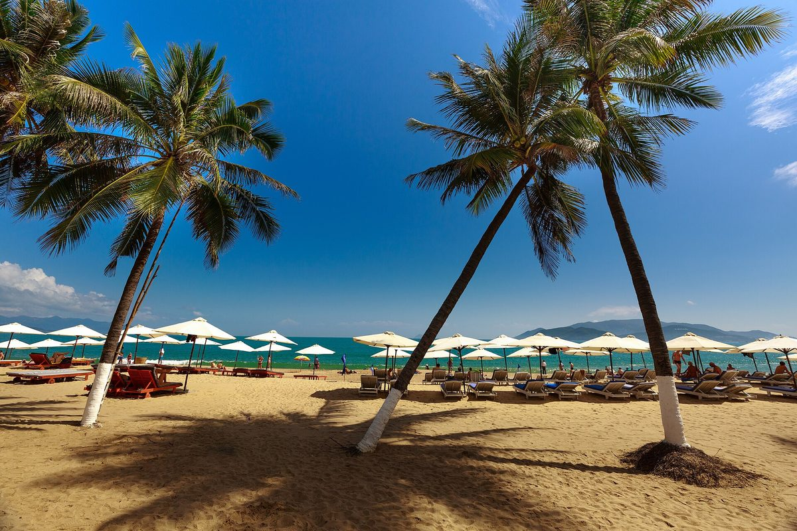

import { aviasalesUrl, ostrovokCity } from '../../data/affiliate.js';

export const flightNha = aviasalesUrl('search/MOW1510CXR29101', 'danang_nyachang_cxr');
export const flightDa = aviasalesUrl('search/MOW1510DAD29101', 'danang_nyachang_dad');
export const stayDa = ostrovokCity('vietnam', 'da_nang2', 'danang_nyachang_stay_dad');

export const stayNha = ostrovokCity('vietnam', 'nha_trang', 'danang_nyachang_stay');

**Нячанг удобнее для отдыха с городским пляжем и вечерами в городе. Дананг — для сочетания моря с поездками в Хойан и прогулками вдоль реки Хан.** Но сначала стоит сравнить билеты <a href={flightNha} rel="sponsored">в Нячанг</a> и <a href={flightDa} rel="sponsored">в Дананг</a>: в нашем расчёте на октябрь перелёт с багажом создаёт почти всю разницу бюджета, а два выбранных отеля стоят близко.

На 13 ночей закладываем около **124 тысяч рублей на человека для Нячанга и 152 тысяч для Дананга** с пересадочными перелётами. Это два конкретных сценария на одинаковые даты, с резервами на повседневные расходы. Ниже — состав сумм, условия номеров и компромиссы, которые исчезают за рекламным «от».

## Какой курорт выбрать под свой отпуск

Выбирайте Нячанг, если нужен городской пляж и возможность менять планы по погоде без переезда. Дананг имеет смысл, если Хойан и центральный Вьетнам — самостоятельная часть путешествия. Отдых только на территории отеля требует другого сравнения: конкретных пляжей, питания и трансфера.

| Ваш план | С чего начать | Что проверить |
|---|---|---|
| Море утром, кафе и прогулки вечером | Городской Нячанг | Переход через дорогу к пляжу, шум под окнами |
| Пляж плюс Хойан | Дананг, побережье Ми Кхе | Адрес отеля и время на выезды |
| Отель, бассейн, минимум поездок | Курортный отель у Камрани или Нонныока | Питание, собственный выход к морю, стоимость трансфера |
| Неделя отпуска и тяжёлые пересадки | Сначала расписание перелёта | Дата прилёта, багаж, время возвращения домой |
| Октябрь и обязательное ежедневное купание | Сначала прогноз и сезон | Оба варианта требуют запасного плана на дождь и волну |

У двух соседних отелей может быть больше различий, чем у городов в целом. Если один номер выходит на оживлённую улицу, а другой находится на закрытой территории с питанием, сравнение «где спокойнее» без адресов не поможет. Для семейного отпуска добавьте к карте обычный вечерний маршрут: ужин, магазин, дорога обратно с уставшим ребёнком.

## Где жить в Нячанге: город или курорт у Камрани

Для прогулок и ужинов вне отеля смотрите городской пляж и улицы за набережной Чан Фу. Для отдыха на территории выбирайте конкретный курорт у Камрани, понимая, что это другой сценарий размещения. Слово «Нячанг» в поиске отелей само по себе не обещает город за дверью.

У городского варианта понятный порядок дня: спустились к морю, вернулись в номер, вечером вышли поужинать. Но линия отелей и пляж могут быть разделены дорогой. Проверяйте реальный пеший путь от входа, а не расстояние от точки на карте до воды. Номер «с видом на море» тоже ничего не говорит о том, где безопасно переходить улицу.

Камрань удобна для другого отпуска: меньше поводов выходить за пределы выбранного комплекса, больше значения у питания и инфраструктуры самого отеля. Если планируете часто ездить в Нячанг, сначала посчитайте эти поездки. Аэропорт Камрани CXR находится примерно в 35 километрах от центра Нячанга; на автомобильную дорогу ориентируйтесь примерно на 45–60 минут без учёта выдачи багажа и ожидания машины.

Есть и третий путь: выбрать отдельный пляжный отель вне центральной набережной, но сохранить несколько городских выездов. Здесь нельзя автоматически переносить преимущества центра. Проверьте, где ближайший ужин, что работает вечером и есть ли у отеля понятные условия трансфера. Разница в цене номера может уйти на дорогу.

В <a href={stayNha} target="_blank" rel="nofollow sponsored noopener">подборке отелей Нячанга</a> сначала задайте район на карте и состав гостей. Затем сравнивайте одинаковые условия питания и отмены. Одинаковое число звёзд или похожие фотографии бассейна не делают номера равными.

## Где жить в Дананге: Ми Кхе, река Хан или Нонныок

Для пляжного дня первым кандидатом будет побережье Ми Кхе. Для городских прогулок смотрите берега реки Хан. Нонныок — отдельный вариант южнее, когда важнее выбранный пляжный отель и выезды по центральному Вьетнаму. Это ориентиры для карты, а не обещание одинакового отдыха в любой точке зоны.

У Ми Кхе начинайте с пешего пути к морю. Отель на второй линии может оказаться удобнее дорогого номера, от которого приходится обходить квартал. Посмотрите, на какую сторону выходят окна: слово «пляжный» в названии не подтверждает вид и тишину. Для долгой поездки отдельно проверяйте рабочее место и условия уборки — фотографии лобби этого не показывают.

У реки Хан другой приоритет: городская набережная и вечерние прогулки. Здесь логично жить, когда пляж занимает только часть отпуска. Перед бронированием проложите маршрут до того участка моря, куда собираетесь ходить или ездить: вид на реку не равен расположению у пляжа.

Нонныок стоит рассматривать через конкретный отель и его окружение. Сравните питание, выход к морю и стоимость поездок в Хойан. Если хочется ежедневно гулять по старому городу до позднего вечера, полезно проверить и отдельную ночёвку в самом Хойане. Два места проживания потребуют сборов и переезда, зато сократят повторяющуюся обратную дорогу.

<a href={stayDa} rel="sponsored">Сравнить отели в Дананге</a> — на карте проверьте выбранный район и путь до пляжа.

## Сколько стоит поездка на 13 ночей

В этом расчёте Нячанг дешевле прежде всего из-за билета с пересадкой. Выбранные двухместные номера на 13 ночей отличаются всего на 1 604 рубля за весь срок. Это не средние цены городов: изменение дат, рейса или номера может развернуть сравнение.

Условия: вылет из Москвы 15 октября 2026 года, прилёт 16 октября, обратный вылет 29 октября и возвращение в Москву 30 октября. В отеле — с 16 по 29 октября, два взрослых в одном номере. **Цены билетов и номеров взяты из конкретных предложений и могут измениться; остальные суммы в таблице — плановые резервы.**

| Расход на одного взрослого | Нячанг | Дананг |
|---|---:|---:|
| Перелёт туда-обратно с багажом | 68 426 ₽, 23 кг | 94 194 ₽, 25 кг |
| Половина двухместного номера, 13 ночей | 19 742,50 ₽ | 18 940,50 ₽ |
| Еда сверх завтраков: резерв 1 000 ₽ × 14 дней | 14 000 ₽ | 14 000 ₽ |
| Аэропорт и поездки по месту: резерв | 3 000 ₽ | 3 000 ₽ |
| Развлечения и экскурсии: резерв | 5 000 ₽ | 5 000 ₽ |
| Страховка: резерв | 1 500 ₽ | 1 500 ₽ |
| Связь: резерв | 1 000 ₽ | 1 000 ₽ |
| Запас на изменения, 10% суммы выше | 11 266,85 ₽ | 13 763,45 ₽ |
| **Всего, округлено вверх до тысячи** | **124 000 ₽** | **152 000 ₽** |

Два таких бюджета — примерно 248 и 304 тысячи рублей на двоих. Резервы не являются тарифами кафе, такси или страховщиков. Если нужны частные экскурсии, регулярные спа-процедуры, алкоголь или покупки, добавьте их отдельно. Для соло-поездки прибавьте вторую половину номера и заново пересчитайте десятипроцентный запас.

**Нячанг:** Libra Nha Trang Hotel, 4 звезды, двухместный Deluxe с двумя односпальными кроватями и видом на город — 39 485 рублей за весь номер. Завтрак включён, нужна предоплата, бесплатная отмена до 9 октября. В выдаче был и вариант за 34 091 рубль, но без окна: его мы в бюджет не взяли.

**Дананг:** Hadana Boutique Hotel Da Nang, 4 звезды, двухместный Superior с двуспальной кроватью — 37 881 рубль. Завтрак включён, предоплата, бесплатная отмена до 11 октября. Вид из окна в карточке выбранного номера не указан — его нужно уточнять у отеля. Это два примера размещения с завтраком, а не одинаковые номера и не рейтинг лучших отелей.

До оплаты снова проверьте итог за весь срок. Ранний заезд, поздний выезд, дополнительная кровать и условия размещения ребёнка могут считаться отдельно. Дата бесплатной отмены у одного поставщика не переносится на соседний тариф того же отеля.

## Почему дешёвый билет может стоить дня отпуска

Сравнивайте не только сумму, но и дату прибытия. Билет, который приводит в отель на сутки позже, нельзя подставить в тот же бюджет 13 ночей без изменения брони. У пересадочного маршрута отдельно проверяйте багаж и условия смены рейса.

Выбранный перелёт в Камрань за 68 426 рублей включает по одной пересадке в каждую сторону: путь туда занимает 16 часов 20 минут, обратно — 29 часов 45 минут. Вариант в Дананг за 94 194 рубля имеет по две пересадки: 21 час 55 минут и 22 часа 55 минут. Утомительность дороги — часть сравнения, даже если она не выражена отдельной строкой расходов.

Прямой вариант Москва — Камрань с багажом 23 килограмма стоил 97 800 рублей. Если заменить в таблице только билет, получится примерно **157 тысяч рублей на человека**, то есть дороже выбранного пересадочного Дананга. Это условный пересчёт: перед бронью тех же 13 ночей нужно подтвердить дату прилёта прямого рейса и согласовать заезд. Полёты занимают 10 часов 10 минут и 11 часов 5 минут. Человеку с коротким отпуском такая доплата может дать больше, чем улучшение категории номера.

Сравнить свои условия можно в поиске <a href={flightNha} target="_blank" rel="nofollow sponsored noopener">Москва — Камрань</a> и <a href={flightDa} target="_blank" rel="nofollow sponsored noopener">Москва — Дананг</a>. В ссылках стоят даты этого расчёта; замените их на свои и проверьте, включён ли чемодан в выбранную цену. Дешёвый тариф без багажа нельзя считать равным соседнему предложению с багажом.

## Чем заняться, если море не подходит для купания

У Дананга сильная сторона — сочетание городского отдыха с Хойаном и Мраморными горами. У Нячанга — городские прогулки, башни По Нагар и спа-комплексы. Морские экскурсии оставляйте зависимыми от погоды: отменённое купание не делает лодочную поездку безопасной заменой.

Для Дананга составьте два списка: что можно сделать в городе и что требует отдельного выезда. Хойан лучше планировать как самостоятельную часть дня, с запасом на возвращение. Не собирайте Хойан, Мраморные горы и ещё один дальний выезд в плотную цепочку только потому, что все точки оказались в одном путеводителе.

В Нячанге башни По Нагар дают повод выйти за пределы пляжа. Спа и грязевые комплексы — ещё один способ изменить день, но не медицинское обещание. Если выбираете островную экскурсию, спросите об отмене из-за погоды до оплаты и не ставьте её на единственный свободный день перед вылетом.

Для обоих городов полезен один свободный день без оплаченных поездок. Его можно поменять местами с пляжным или экскурсионным, если придут дождь и ветер. Бронируя каждое утро заранее, вы теряете эту возможность, а возврат денег зависит от условий конкретного исполнителя.

## Что учесть осенью и перед бронированием

В сентябре и октябре нельзя выбирать ни Дананг, ни Нячанг с обещанием спокойного моря каждый день. У Нячанга дождливый сезон приходится на сентябрь–декабрь; центральное побережье тоже требует внимания к осенней погоде. Средняя климатическая норма не заменяет прогноз на конкретную неделю.

Октябрьские цены выше показывают способ сравнения, а не рекомендацию лучшего пляжного месяца. Если купание — главная цель, сначала посмотрите [сезоны Вьетнама по регионам](/blog/vietnam-guide-2026/), затем подбирайте даты. Если выбираете между центральным побережьем и островом на юге, пригодится отдельное [сравнение Нячанга и Фукуока](/blog/nyachang-fukuok-2026/).

Перед оплатой пройдите короткий порядок:

1. Согласуйте даты прилёта и заезда, вылета и выезда. Учтите ночь в дороге.
2. Сравните перелёты с одинаковым багажом и приемлемыми пересадками.
3. Проверьте адрес отеля, пеший путь к пляжу, окна, питание и отмену.
4. Добавьте расходы вне отеля и резерв. С ребёнком пересчитайте состав гостей.
5. Откройте [правила въезда во Вьетнам](/blog/vietnam-visa-2026/) и условия своей страховки.

Для первого выбора сравните два законченных варианта: конкретный рейс, конкретный номер и понятный план дня. Так видно, за что вы платите больше: удобную дорогу, нужный район, питание или дополнительные поездки.

## Что заметили путешественники

Два самостоятельных рассказа показывают, почему название курорта не заменяет проверку района и сезона. Это небольшая подборка личных наблюдений, а не опрос туристов или прогноз состояния моря.

1. **Нячанг, май 2026 года, форум Винского.** Семья жила в северной части города: ей понравились вид из квартиры и бассейн. Но на ближайшем пляже примерно в десяти минутах ходьбы встретились волны, водоросли и мусор; больше там не купались. Это впечатление от одного участка в конкретную поездку. При выборе похожего размещения проверяйте отзывы именно о ближайшем пляже, отдельно от оценки номера.
2. **Оба курорта, декабрь–январь, Reddit.** Год поездки в самом рассказе не указан. Путешественник хвалил небольшие рестораны и прогулки по кварталу севернее Ми Кхе, но в Дананге столкнулся с сильной волной и ограниченной зоной купания. Нячанг понравился ему больше благодаря пляжному отдыху и прогулкам. Такой опыт помогает сопоставить ожидания с планом поездки, но не доказывает, что море в Нячанге всегда спокойнее.

Для решения полезнее искать повторяющиеся замечания о шуме, переходе к пляжу и состоянии моря на ваши месяцы. Общая высокая оценка отеля эти вопросы не закрывает.

## Частые вопросы

### Где дешевле — в Дананге или Нячанге?

В нашем сценарии на 13 ночей в октябре Нячанг дешевле: около 124 тысяч рублей против 152 тысяч на человека. Почти всю разницу создаёт перелёт с багажом. Условная замена билета на прямой даёт примерно 157 тысяч; даты заезда нужно сверить заново.

### Что выбрать с ребёнком?

Начните с удобного перелёта, питания и дороги к пляжу. Городской Нячанг и курортный отель у Камрани дают разные условия, как и Ми Кхе с Нонныоком. Уточните кровать, завтрак для ребёнка и безопасность купания на выбранном участке.

### Можно ли совместить Дананг и Нячанг?

Можно, но сначала оцените пользу переезда: второй отель, дорогу и потерянное время. Для короткого пляжного отпуска часто разумнее один курорт с выездами. Если сочетаете оба, проверяйте расписание на свои даты, а не закладывайте переезд как незаметную паузу.

### Дананг или Нячанг в октябре?

Выбирайте по всему плану, включая дни без моря. Для ежедневного купания октябрь не даёт надёжного обещания ни одному из вариантов. Гибкая бронь и возможность переносить экскурсии полезнее небольшой экономии на невозвратном тарифе.
