import AffiliateNote from '../../components/post/AffiliateNote.astro';
import { airaloSub, aviasalesRoute, cherehapaCountry, cherehapaTravel, ostrovokCountry, youtravelSub } from '../../data/affiliate.js';

Про Доминикану пишут одинаково: высокий сезон с декабря по апрель, дожди с мая по сентябрь. Совет звучит разумно ровно до того момента, как открываешь таблицу норм местной метеослужбы.

По ним **в январе аэропорт Пуэрто-Платы получает 191,8 мм осадков, а аэропорт Пунта-Каны — 84,7**. Это один и тот же «высокий сезон» и одна и та же страна шириной в четыре часа езды. В июне порядок переворачивается: Пуэрто-Плата становится самой сухой точкой из шести, а Пунта-Кана мокрее её в 1,7 раза. Северный берег ловит зимние атлантические фронты, восточный — летнюю конвекцию, и общего календаря у них нет.

**Своих кадров из Доминиканы у меня нет.** Всё ниже собрано из документов — метеослужбы страны, миграционной службы, МИД обеих стран, центральных банков, спутниковой лаборатории по водорослям — и из отчётов тех, кто ездил туда самостоятельно. Фотографии стоковые, авторы указаны в подписях.

> **Если коротко:** ехать с **декабря по март**, и берег выбирать под месяц: зимой сухо на востоке и юго-востоке (**Пунта-Кана, Ла-Романа, Байяибе**), а север в это время мокрый. Виза не нужна, но обязательна бесплатная анкета **E-Ticket не ранее чем за 72 часа** до вылета. Прямых рейсов из России нет с 2022 года: дорога занимает от 20 часов до двух суток, билет с багажом **от 161 434 ₽** на человека туда-обратно, и самый дешёвый из них летит через США. Десять ночей «всё включено» на двоих в Пунта-Кане — **от 198 742 ₽**. Дорога съедает **63% бюджета** такой поездки. <a href={youtravelSub('dominican_republic_2027_top')} class="aff-cta" rel="sponsored">Посмотреть авторские туры по Доминикане и Карибам</a> малые группы с русскоязычным гидом, маршрут, даты и состав группы видны до оплаты. Лечение в частных клиниках Доминиканы платное и дорогое: <a href={cherehapaCountry('dominican-republic', 'dominican_2027_tldr')} class="aff-cta" rel="sponsored">подобрать страховку в Доминикану</a>.

<AffiliateNote />

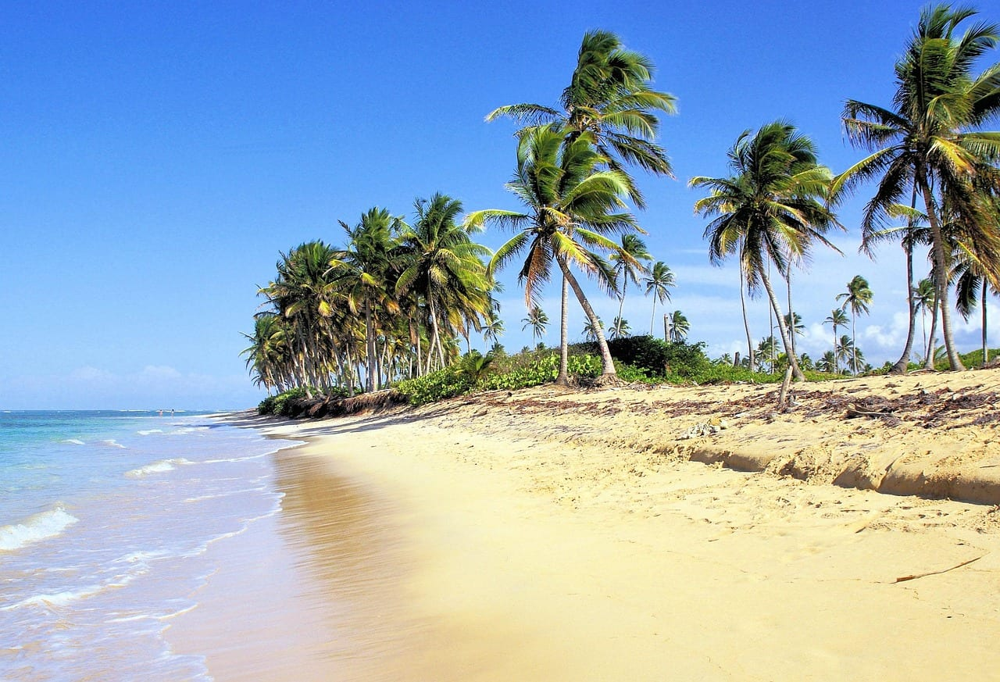

---

## Сухого сезона у страны нет: зимой север мокрее востока в 2,3 раза

Метеослужба Доминиканы публикует ежемесячные отчёты об отклонении осадков от нормы, и в них есть колонка с самой нормой по каждой станции. Ниже — эта колонка за январь и февраль по базе 1991–2020.

| Станция | Январь | Февраль |
|---|---|---|
| Аэропорт Ла-Романы | 44,5 мм | 26,6 мм |
| Аэропорт Лас-Америкас (Санто-Доминго) | 48,3 мм | 43,8 мм |
| Самана, город | 59,8 мм | 50,3 мм |
| Аэропорт Пунта-Каны | 84,7 мм | 62,8 мм |
| Аэропорт Арройо-Барриль (полуостров Самана) | 142,6 мм | 95,2 мм |
| Аэропорт Грегорио Луперон (Пуэрто-Плата) | 191,8 мм | 131,7 мм |

Разброс внутри одного месяца — четырёхкратный. **В январе на севере, в Пуэрто-Плате, нормой считаются 191,8 мм, а в Ла-Романе на юго-востоке — 44,5.** Это 4,3 раза разницы между двумя курортами одной страны в один и тот же месяц. Пунта-Кана стоит посередине с 84,7 мм: суше севера в 2,3 раза, мокрее Ла-Романы почти вдвое.

Февраль повторяет расстановку: Пуэрто-Плата 131,7 мм против 62,8 у Пунта-Каны, разница в 2,1 раза.

Теперь июнь. Метеослужба публикует его по другой базе — 1971–2000, — поэтому июньские цифры **нельзя сравнивать с январскими напрямую**, только станции между собой внутри месяца. И вот там всё наоборот: **Пуэрто-Плата 54,1 мм — самая сухая из шести станций**, Ла-Романа 80,6, Пунта-Кана 93,7, Лас-Америкас 100,6, Самана 108,4, Арройо-Барриль 133,4.

Механика простая. Северное побережье открыто Атлантике, и зимой по нему проходят фронты с холодным воздухом из Северной Америки — те самые, что дают Пуэрто-Плате её зимний максимум. Восток и юго-восток от этих фронтов закрыты сушей и горами, зато летом получают свою порцию грозовой конвекции, когда север сидит под пассатом и остаётся сухим.

Так устроены не одни Карибы: на Филиппинах [у восточных и западных островов сезоны тоже зеркальные, и «низкий сезон» на Бохоле суше «высокого»](/blog/philippines-guide-2026/). Разница в том, что там четыре климатические зоны, а здесь два берега — но перепутать берег стоит тех же испорченных дней.

**Практический вывод один.** Едете в декабре–марте — берите восток и юго-восток: Пунта-Кану, Ла-Роману, Байяибе. Хотите север — Пуэрто-Плату, Кабарете, Сосуа — планируйте на конец весны и лето, и тогда придётся считаться с ураганами.

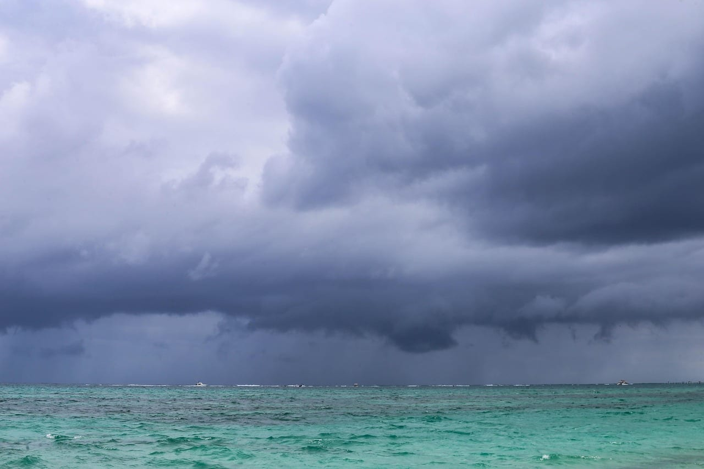

---

## Ураганы и водоросли: два календаря, и оба против лета

**Сезон ураганов идёт с 1 июня по 30 ноября** — это официальные даты для Атлантики, Карибского моря и Мексиканского залива. На 2026 год метеослужба страны прогнозировала 13 именных штормов, из которых 6 могли стать ураганами и 2 — крупными, третьей категории и выше. Прогноз «немного ниже нормы» риска не снимает: одного шторма хватит, чтобы отменить неделю.

**Водоросли саргассум — вторая причина не ехать летом.** Их считают со спутника в лаборатории оптической океанографии Университета Южной Флориды. В бюллетене от 31 июля 2026 года: в июле в восточной части Карибского моря плавало **6,2 млн тонн** водорослей, во всех наблюдаемых районах вместе — 25,5 млн тонн.

Тут стоит развести источники. Пресса весной 2026 года писала о рекордном годе и «худшем сезоне за всю историю». Сама лаборатория в июльском бюллетене формулирует иначе: пиковый месяц пройден, количество будет снижаться до ноября, и **2026 год станет вторым по объёму, уступив 2025-му**. Разница между «рекорд» и «второе место» невелика для планов, но показывает, что заголовки шли впереди замеров.

Для поездки важно другое: снижение идёт до ноября, а значит **декабрь–март — низкая фаза водорослей**, и она совпадает с сухим сезоном востока. Берег внутри курорта тоже решает: Баваро смотрит прямо на восток, в течение, и ловит водоросли хуже всех, а Кап-Кана и пляж Хуанильо прикрыты рифом и остаются заметно чище.

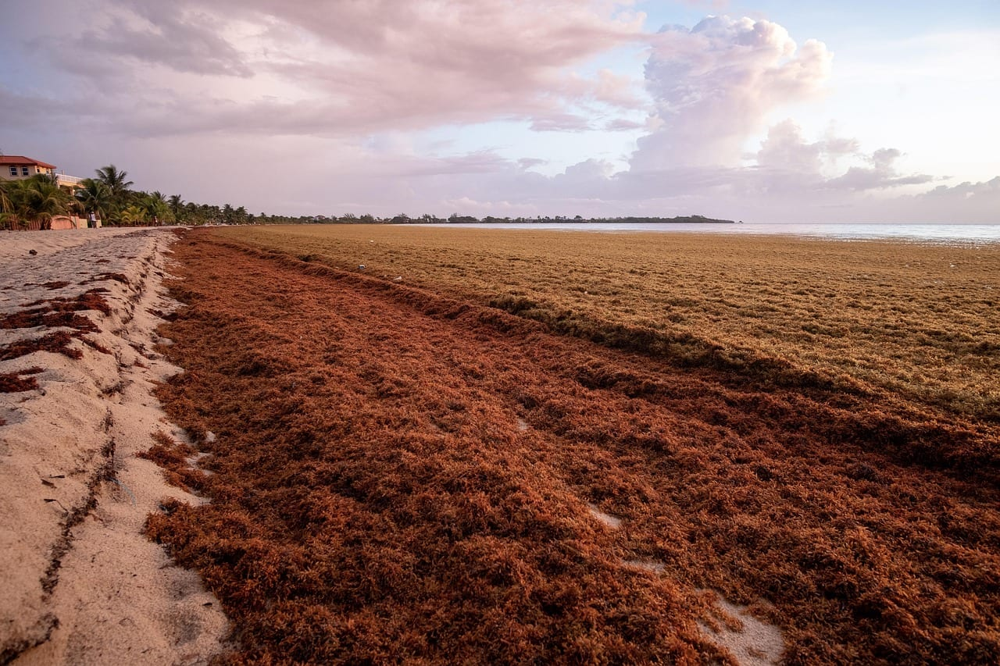

Четыре календаря страны — сезон, ураганы, водоросли и киты — на одной шкале выглядят так.

<figure>
<svg viewBox="0 0 640 392" xmlns="http://www.w3.org/2000/svg" role="img" aria-label="Календарь Доминиканы по месяцам: высокий сезон на восточном берегу с декабря по март, сезон ураганов с июня по ноябрь, много водорослей с апреля по август со спадом в сентябре и октябре, киты в Самане с середины января по конец марта, север мокрее востока в январе и феврале." style="width:100%;height:auto;display:block">
  <g fill="currentColor" font-family="system-ui, sans-serif" font-size="20">
    <text x="0" y="24" font-size="22" font-weight="600">Когда что происходит</text>
    <text x="207" y="54" text-anchor="middle">я</text><text x="243" y="54" text-anchor="middle">ф</text><text x="279" y="54" text-anchor="middle">м</text><text x="315" y="54" text-anchor="middle">а</text><text x="351" y="54" text-anchor="middle">м</text><text x="387" y="54" text-anchor="middle">и</text><text x="423" y="54" text-anchor="middle">и</text><text x="459" y="54" text-anchor="middle">а</text><text x="495" y="54" text-anchor="middle">с</text><text x="531" y="54" text-anchor="middle">о</text><text x="567" y="54" text-anchor="middle">н</text><text x="603" y="54" text-anchor="middle">д</text>
    <text x="0" y="88" font-size="19">Высокий сезон</text>
    <text x="0" y="140" font-size="19">Ураганы</text>
    <text x="0" y="192" font-size="19">Водорослей много</text>
    <text x="0" y="244" font-size="19">Киты в Самане</text>
    <text x="0" y="296" font-size="19">Север мокрее</text>
    <text x="0" y="336" font-size="16">Плотная заливка — явление в силе, бледная — начало или спад</text>
    <text x="0" y="360" font-size="16">Ряд «север мокрее» — по нормам января и февраля</text>
    <text x="0" y="384" font-size="16">Окно без помех: декабрь — март, киты с 15 января</text>
  </g>
  <g>
    <rect x="190" y="70" width="34" height="26" fill="#1d4ed8"/><rect x="226" y="70" width="34" height="26" fill="#1d4ed8"/><rect x="262" y="70" width="34" height="26" fill="#1d4ed8"/><rect x="298" y="70" width="34" height="26" fill="#93c5fd"/><rect x="334" y="70" width="34" height="26" fill="#e5e7eb"/><rect x="370" y="70" width="34" height="26" fill="#e5e7eb"/><rect x="406" y="70" width="34" height="26" fill="#e5e7eb"/><rect x="442" y="70" width="34" height="26" fill="#e5e7eb"/><rect x="478" y="70" width="34" height="26" fill="#e5e7eb"/><rect x="514" y="70" width="34" height="26" fill="#e5e7eb"/><rect x="550" y="70" width="34" height="26" fill="#93c5fd"/><rect x="586" y="70" width="34" height="26" fill="#1d4ed8"/>
    <rect x="190" y="122" width="34" height="26" fill="#e5e7eb"/><rect x="226" y="122" width="34" height="26" fill="#e5e7eb"/><rect x="262" y="122" width="34" height="26" fill="#e5e7eb"/><rect x="298" y="122" width="34" height="26" fill="#e5e7eb"/><rect x="334" y="122" width="34" height="26" fill="#e5e7eb"/><rect x="370" y="122" width="34" height="26" fill="#b45309"/><rect x="406" y="122" width="34" height="26" fill="#b45309"/><rect x="442" y="122" width="34" height="26" fill="#b45309"/><rect x="478" y="122" width="34" height="26" fill="#b45309"/><rect x="514" y="122" width="34" height="26" fill="#b45309"/><rect x="550" y="122" width="34" height="26" fill="#b45309"/><rect x="586" y="122" width="34" height="26" fill="#e5e7eb"/>
    <rect x="190" y="174" width="34" height="26" fill="#e5e7eb"/><rect x="226" y="174" width="34" height="26" fill="#e5e7eb"/><rect x="262" y="174" width="34" height="26" fill="#fcd34d"/><rect x="298" y="174" width="34" height="26" fill="#b45309"/><rect x="334" y="174" width="34" height="26" fill="#b45309"/><rect x="370" y="174" width="34" height="26" fill="#b45309"/><rect x="406" y="174" width="34" height="26" fill="#b45309"/><rect x="442" y="174" width="34" height="26" fill="#b45309"/><rect x="478" y="174" width="34" height="26" fill="#fcd34d"/><rect x="514" y="174" width="34" height="26" fill="#fcd34d"/><rect x="550" y="174" width="34" height="26" fill="#e5e7eb"/><rect x="586" y="174" width="34" height="26" fill="#e5e7eb"/>
    <rect x="190" y="226" width="34" height="26" fill="#93c5fd"/><rect x="226" y="226" width="34" height="26" fill="#1d4ed8"/><rect x="262" y="226" width="34" height="26" fill="#1d4ed8"/><rect x="298" y="226" width="34" height="26" fill="#e5e7eb"/><rect x="334" y="226" width="34" height="26" fill="#e5e7eb"/><rect x="370" y="226" width="34" height="26" fill="#e5e7eb"/><rect x="406" y="226" width="34" height="26" fill="#e5e7eb"/><rect x="442" y="226" width="34" height="26" fill="#e5e7eb"/><rect x="478" y="226" width="34" height="26" fill="#e5e7eb"/><rect x="514" y="226" width="34" height="26" fill="#e5e7eb"/><rect x="550" y="226" width="34" height="26" fill="#e5e7eb"/><rect x="586" y="226" width="34" height="26" fill="#e5e7eb"/>
    <rect x="190" y="278" width="34" height="26" fill="#b45309"/><rect x="226" y="278" width="34" height="26" fill="#b45309"/><rect x="262" y="278" width="34" height="26" fill="#e5e7eb"/><rect x="298" y="278" width="34" height="26" fill="#e5e7eb"/><rect x="334" y="278" width="34" height="26" fill="#e5e7eb"/><rect x="370" y="278" width="34" height="26" fill="#e5e7eb"/><rect x="406" y="278" width="34" height="26" fill="#e5e7eb"/><rect x="442" y="278" width="34" height="26" fill="#e5e7eb"/><rect x="478" y="278" width="34" height="26" fill="#e5e7eb"/><rect x="514" y="278" width="34" height="26" fill="#e5e7eb"/><rect x="550" y="278" width="34" height="26" fill="#e5e7eb"/><rect x="586" y="278" width="34" height="26" fill="#e5e7eb"/>
  </g>
</svg>
<figcaption style="font-size:.85rem;line-height:1.45;opacity:.72;margin-top:.6rem">Единственное окно, где сходятся высокий сезон восточного берега, отсутствие ураганов и низкая фаза водорослей, — с декабря по март. Киты добавляются к нему с 15 января.</figcaption>
</figure>

---

## Куда именно ехать: четыре разные Доминиканы

### Пунта-Кана и Баваро — курортная полоса, ради которой летит большинство

Сплошная линия отелей «всё включено» вдоль восточного берега. В Пунта-Кане на январь 2027 года на одном сервисе бронирования выложено **249 вариантов жилья, из них 86 с системой «всё включено»**; по районам это Баваро — 134 объекта, Кап-Кана — 21, Уверо-Альто — 20.

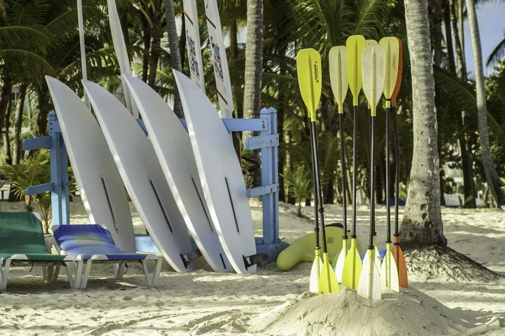

Плюс: сюда прилетает большинство рейсов, здесь короткий трансфер, здесь же самая плотная конкуренция отелей и, значит, цены. Минус: **Баваро смотрит прямо на восток и получает водоросли первым**, а сама курортная полоса устроена так, что за территорию отеля идти некуда — вдоль воды да обратно.

### Кап-Кана и Уверо-Альто — то же море, но с рифом и без соседей

Кап-Кана прикрыта рифом, и в месяцы водорослей разница с Баваро видна глазами. Уверо-Альто лежит примерно в 34 километрах от центра Пунта-Каны — там тише и просторнее. Плата за это — трансфер из аэропорта дольше, а выйти вечером некуда совсем.

### Ла-Романа, Байяибе и Доминикус — самый сухой угол страны

Юго-восток. **Аэропорт Ла-Романы даёт январскую норму 44,5 мм — вчетверо меньше северного берега.** Море здесь чаще без волн, заход в воду пологий, отсюда ходят катера на остров Саону.

Минус тот же, что у всей страны: хорошие пляжи заняты отелями. Береговая линия по закону свободна, и пройти можно, но парковка выйдет «как бы платной», а вход — через чей-то пляжный клуб.

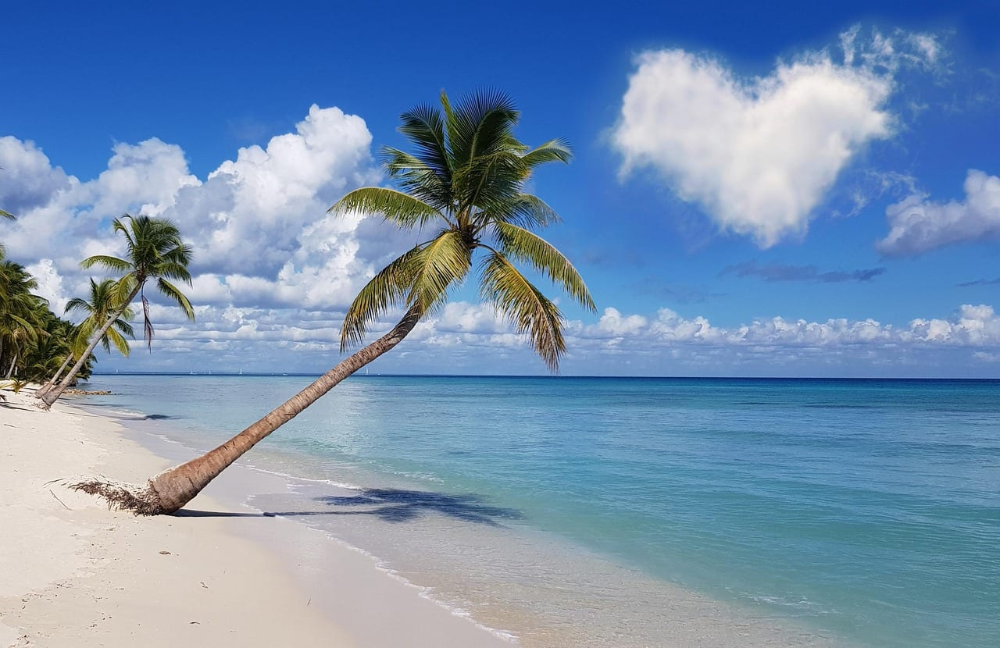

### Самана — киты, водопады и мангры, а не пляжный конвейер

Полуостров на северо-востоке. **Официальный сезон наблюдения за горбатыми китами в бухте Саманы — с 15 января по 31 марта**, его открывает министерство окружающей среды. 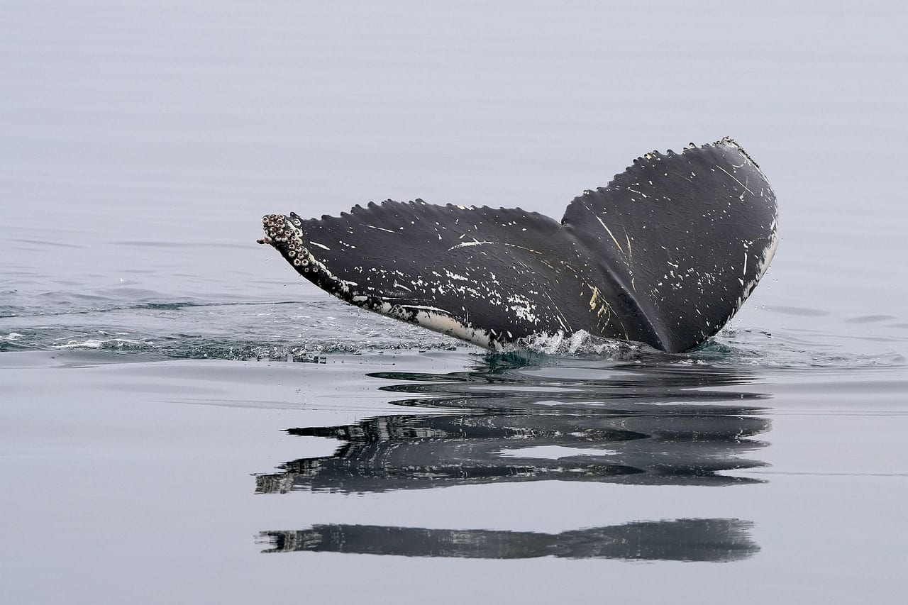

Рядом — заповедник Лос-Айтисес с мангровыми зарослями и пещерами, посёлки Лас-Терренас и Лас-Галерас.

По осадкам полуостров неоднороден, и это ловушка: **норма января в городе Самана 59,8 мм, а на другом конце полуострова, в аэропорту Арройо-Барриль, — 142,6.** Разница внутри одного полуострова больше, чем между Пунта-Каной и Ла-Романой.

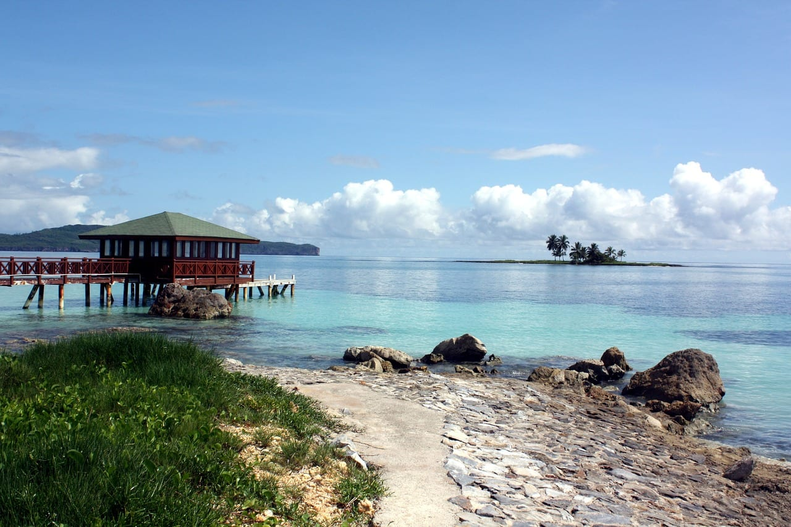

### Пуэрто-Плата, Сосуа и Кабарете — север для ветра, а не для января

Кабарете — один из известных в мире адресов для кайта и винд-сёрфинга: пассат работает почти круглый год. Но январь и февраль здесь самые мокрые месяцы года, и приезжать логично поздней весной или летом, когда северный берег становится самым сухим в стране.

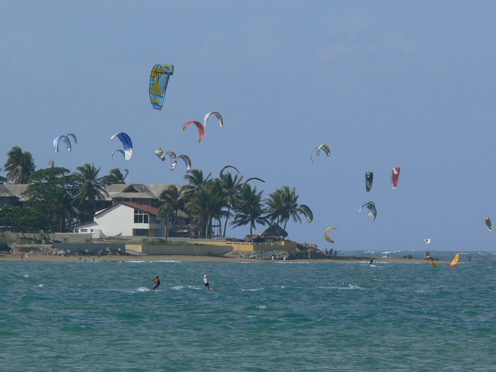

### Санто-Доминго — столица на день, а не на неделю

Колониальная зона — объект списка ЮНЕСКО и старейший европейский город Америки. Заезжать сюда стоит, но с поправкой: в июне 2024 года часть главных музеев стояла в реставрации, а пробки в городе такие, что путешественники берут более ранние автобусы, чтобы не сорвать пересадку.

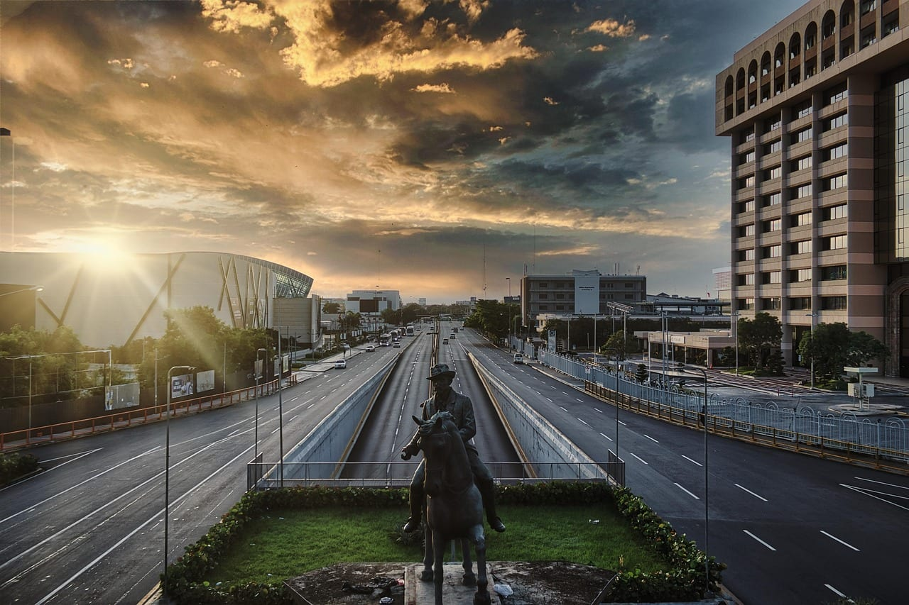

---

## Дорога: прямых рейсов нет, а самый дешёвый билет с багажом летит через США

Прямое авиасообщение с Россией прервалось в 2022 году и не восстановлено. Проверяется это двумя способами, и оба дают один ответ.

Первый — сайт самой авиакомпании. В календаре цен «Северного ветра» по направлению Москва — Пунта-Кана стоит надпись **«Временно не летаем в этом направлении»**. Второй — поиск билетов: фильтр «прямые рейсы» на даты 15–25 января 2027 года отвечает **«нет билетов»**.

⚠️ **Агрегаторы при этом врут.** Отдельные сайты держат страницы вида «Северный ветер, Москва — Пунта-Кана, от 33 701 ₽» и «один прямой рейс в неделю». Расписания там протухли ещё в 2022 году. Обещания тоже стоит делить надвое: в июне 2025 года замминистра транспорта России говорил, что первые рейсы могут пойти «в зимнем сезоне», — тот сезон прошёл, рейсов нет.

Вот что реально нашлось на 28 августа 2026 года по маршруту Москва — Пунта-Кана и обратно, 15–25 января 2027 года, один взрослый, эконом.

| Вариант | Цена | Дорога туда | Через что |
|---|---|---|---|
| Самый дешёвый, ручная кладь | 147 349 ₽ | 2 суток | Стамбул (Сабиха), Мадрид |
| Он же с багажом | 166 952 ₽ | 2 суток | Стамбул (Сабиха), Мадрид |
| Минимум с багажом по всей выдаче | 161 434 ₽ | 1 сутки 10 часов | Касабланка, **Майами** |
| Самый быстрый | 233 926 ₽ | 20 часов 15 минут | Белград, Франкфурт |
| Через Панаму, два места багажа | 309 866 ₽ | 1 сутки 2 часа 47 минут | Стамбул, Панама |

**Главная ловушка выдачи — Майами.** Самый дешёвый билет с багажом по всей выдаче стоит 161 434 ₽ и летит через американский аэропорт. У США нет транзитной зоны: любой пассажир, меняющий там самолёт, проходит паспортный контроль и обязан иметь американскую визу. Из восьми самых дешёвых вариантов **два идут через Майами**. Первый вариант с багажом, где США нет, стоит 166 952 ₽ — дороже билета через Майами на 5 518 ₽.

Второе, на что стоит смотреть, — смена аэропорта. Один из дешёвых вариантов помечен «Стамбул — Сабиха»: это два разных аэропорта на разных берегах Босфора, и переезд между ними занимает не меньше полутора часов.

**Маршрут через Панаму** туроператоры называют безвизовым и собирают его так: Москва — Стамбул около 4 часов, Стамбул — Панама почти 14 часов, Панама — Пунта-Кана около 2,5 часов, билет на едином бланке, багаж идёт транзитом. Дорога со стыковками занимает 25–32 часа. В моей выдаче этот же маршрут стоил 309 866 ₽ с двумя местами багажа и укладывался в 26 часов 47 минут.

Соседние даты меняют цену заметно: 12–22 января — 146 001 ₽, 4–14 января — 151 268 ₽, 11–21 января — 155 981 ₽, 18–28 января — 173 771 ₽. Разброс между худшей и лучшей датой в одном январе — 27 770 ₽ на человека.

<a href={aviasalesRoute('MOW','PUJ','dominican_republic_2027_flight')} class="aff-cta" rel="sponsored">Посмотреть билеты Москва — Пунта-Кана</a> показывает все стыковки одной выдачей и календарь цен по соседним датам, оплата картой российского банка

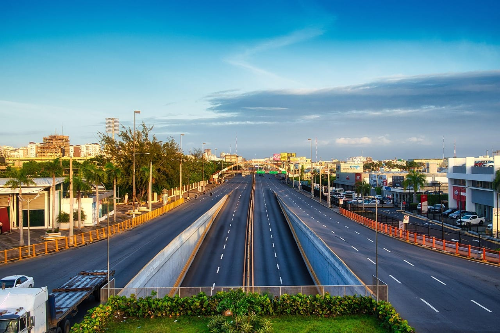

---

## Сценарии поездок

**Десять ночей в отеле «всё включено», без машины.** Пунта-Кана или Байяибе, вылазки только на организованные экскурсии. Минимум усилий, предсказуемый бюджет. Честный минус: страна останется за забором, а из отеля гулять получится по кромке воды и обратно.

**Двенадцать ночей: восток плюс Самана.** Неделя на пляже в Пунта-Кане, дальше переезд на полуостров на киты и водопады, возврат тем же аэропортом. Минус: переезд занимает день в каждую сторону, а по осадкам полуостров сильно неоднороден.

**Две недели на машине по кругу.** Санто-Доминго, юго-запад с дикими пляжами Бараоны и Педерналеса, горы Харабакоа, север, Самана. Машина нужна. Минус серьёзный: движение хаотичное, на обочине платной трассы встречаются мопеды навстречу потоку, а прокат — отдельный источник неприятностей, о нём ниже.

**Десять дней без машины, на автобусах.** Междугородние автобусы Caribe Tours, местные маршрутки гуа-гуа и мотокончо покрывают страну. Так ездят самостоятельные путешественники, и это дешевле проката. Минус: пробки в Санто-Доминго ломают расписание пересадок, а такси по приложению нормально работает только в столице.

**Неделя на севере ради ветра.** Кабарете, Сосуа, Пуэрто-Плата — кайт и винд-сёрфинг. Минус жёсткий: ехать надо поздней весной или летом, потому что январь и февраль на севере самые мокрые, а лето — это сезон ураганов.

| Сколько дней | Что складывается |
|---|---|
| 7 | Один курорт восточного берега, экскурсии из отеля. Дорога съест два дня из семи |
| 10 | Курорт плюс Саона или Лос-Айтисес; либо неделя на севере ради ветра |
| 12–14 | Восток и Самана с китами, если это середина января — март |
| 14–16 | Круг по стране на машине или на автобусах, со столицей и юго-западом |
| 18+ | То же плюс горы Харабакоа и дикий юго-запад без спешки |

---

## Сколько стоит поездка

**Жильё.** Свой замер на 28 августа 2026 года: Пунта-Кана, 15–25 января 2027 года, десять ночей на двоих, все налоги включены.

| Отель | Оценка гостей | Питание | Десять ночей на двоих |
|---|---|---|---|
| Occidental Caribe | 7,6 | всё включено | 198 742 ₽ |
| Sunscape Coco Punta Cana | 8,0 | всё включено | 231 651 ₽ |
| Occidental Punta Cana | 7,8 | всё включено | 241 979 ₽ |
| Barcelo Bavaro Palace | 8,0 | всё включено | 306 993 ₽ |
| Grand Bahia Principe Aquamarine | 8,0 | всё включено | 315 552 ₽ |
| Royalton Splash Punta Cana | 8,6 | всё включено | 362 057 ₽ |
| Now Larimar | 9,4 | всё включено | 387 522 ₽ |
| Hotel Cortecito Inn Bavaro | 5,8 | завтрак | 58 817 ₽ |

Нижняя граница «всё включено» — около 200 тысяч рублей за десять ночей на двоих. Отель с завтраком вместо «всё включено» стоит втрое дешевле, но еду тогда придётся искать в стране, где, по отзывам самостоятельных путешественников, с ресторанами и супермаркетами негусто именно потому, что почти все туристы едят в своих отелях.

**Сложите с дорогой — и картина меняется.** Два билета с багажом без США по 166 952 ₽ дают 333 904 ₽. Плюс самый дешёвый отель «всё включено» за 198 742 ₽ — итого **532 646 ₽ на двоих за десять ночей**. Из этой суммы **дорога составляет 62,7%**. Не отель определяет бюджет карибской поездки, а перелёт.

<a href={ostrovokCountry('dominican-republic', 'dominican_republic_2027_stay')} class="aff-cta" rel="sponsored">Посмотреть отели Доминиканы с оплатой из России</a> оплата картой российского банка, фильтр «всё включено», подтверждение брони сразу в PDF

**Налоги в счёте.** К счетам гостиниц, ресторанов, кафе и баров в стране добавляют **18% налога на товары и услуги плюс 10% обязательной надбавки за обслуживание**. Десятипроцентная надбавка — не чаевые по желанию, а требование статьи 228 трудового кодекса: работодатель обязан начислить её и распределить между работниками. В базу налога она не входит. Пакеты «всё включено» это учитывают внутри цены, а вот счёт в ресторане вырастет примерно на 28% против цифры в меню.

**Готовый тур против самостоятельной поездки.** Туроператоры на зимний сезон 2026/27 оценивают билет туда-обратно в 175–250 тысяч рублей на человека — выше, чем нашлось в свободном поиске, потому что это единый бланк с гарантированной стыковкой и сквозным багажом. Десять ночей в отеле 4* «всё включено» у них начинаются от 115 тысяч, в 5* — от 160 тысяч. Средний чек поездки в Доминикану у одного из операторов — 3 303 доллара на человека, это 283 906 ₽ по курсу Центробанка на 28 августа 2026 года (1 доллар = 85,9541 ₽), и он на 4% ниже прошлогоднего.

⚠️ **Спрос на направление упал почти вдвое.** Тот же оператор фиксирует минус 47% год к году, а по броням наземного обслуживания у другой компании Доминикана занимает 9% против 60,5% у Мексики. Причина прямая: без прямых рейсов дорога стоит дороже отеля.

---

## Виза не нужна, но 60 дней договора и 30 дней миграционной службы — разные числа

**Виза не нужна — это подтверждается официально.** У МИД Доминиканы есть инструмент проверки: выбираешь страну, тип паспорта и тип визы. На запрос «Россия, обычный паспорт, туристическая виза» он отвечает **«Требуется виза? НЕТ»**. Поле для комментария при этом остаётся пустым — срок пребывания инструмент не называет вовсе.

Срок задан двусторонним соглашением. Оно подписано 26 ноября 2018 года и вступило в силу 15 декабря 2020 года; статья 1 даёт гражданам обеих стран право въезжать, выезжать, следовать транзитом и находиться без виз **в течение срока, не превышающего 60 календарных дней в течение каждого периода в 180 дней, считая с даты первого въезда**. Это не «60 дней за поездку»: счёт идёт по окну в полгода от первого штампа. Кто собирается дольше 60 дней или работать — оформляет визу в посольстве.

⚠️ **А теперь расхождение, которого нет ни в одном русском источнике.** Миграционная служба Доминиканы на своей странице о продлении пребывания пишет про **«30 дней, установленных туристам»**, и продление стоит денег: 30–90 дней — 3 500 песо (около 5 100 ₽), 3–9 месяцев — 5 600 песо (около 8 200 ₽), дальше по возрастающей до 98 000 песо за десять лет. Сама заявка бесплатна, платится тариф за дни; нужны копия паспорта, штамп последнего въезда, обратный билет, подтверждение своих средств и медсправка, срок рассмотрения — три рабочих дня.

Договор говорит 60, миграционная служба — 30. Документа, который сводит одно с другим, на официальных сайтах обеих стран нет. Для обычной поездки на две недели это не имеет значения. Но если планируете зимовку на месяц-полтора, **закладывайте вероятность, что на выходе попросят оплатить дни сверх тридцатого**, и берите с собой распечатку соглашения.

**Анкета E-Ticket обязательна, и это главное, что забывают.** Электронная анкета миграционной службы нужна **и на въезд, и на выезд**: данные уходят в миграционную службу, таможню и министерство здравоохранения. На выходе формируется PDF с QR-кодом, и код спрашивают. Посольство России в Санто-Доминго рекомендует заполнять анкету **не ранее чем за 72 часа до вылета**. Таможенную декларацию внутри анкеты заполняют только пассажиры старше 18 лет. Анкета бесплатна.

**Туристическая карта за 10 долларов давно включена в авиабилет.** С 25 апреля 2018 года её стоимость входит в цену билетов, выписанных за пределами Доминиканы, и покупать её в аэропорту прилёта не надо. Сайты российских туркомпаний по-прежнему пишут обратное — это устаревшая на восемь лет справка.

Страховка по правилам въезда не обязательна, но медицина в стране платная, а до ближайшей клиники с курорта ехать. По той же логике [обязательный полис для Кубы разбирали отдельно](/blog/cuba-insurance-2026/) — там он входит в условия въезда, здесь остаётся на усмотрение путешественника.

<a href={cherehapaTravel('dominican_republic_2027')} class="aff-cta" rel="sponsored">Подобрать полис для поездки на Карибы</a> сравнивает страховщиков по цене и покрытию, оплата картой РФ, полис приходит в PDF; отдельной страницы Доминиканы у сервиса нет, страну выбираете в форме

---

## Деньги и связь: карты не работают, наличные решают

**Российские карты в Доминикане не принимают** — ни «Мир», ни выпущенные в России Visa и Mastercard. Валюта страны — доминиканский песо; по курсу центрального банка страны на 27 августа 2026 года доллар стоил 58,9172 песо на продажу, то есть **один песо — около 1,46 ₽** по курсу Центробанка России на 28 августа. В туристических местах доллары берут повсеместно.

Практика тех, кто ездил: обменять доллары получается не везде. В отчёте о поездке в марте 2024 года крупный банк отказал с формулировкой «обслуживаем только своих клиентов», менять пришлось в местном банке напротив, с паспортом, по курсу 57,6 песо за доллар (со слов посетителя). Основатель форума ещё в 2015 году записывал в минусы страны отсутствие приёма карт и привычку местных к наличным — с тех пор для россиян стало только жёстче. Общая механика оплаты за границей [разобрана отдельно](/blog/pay-abroad-2026/), и Доминикана в ней — тот случай, где выручают только наличные и карта иностранного банка.

**Связь.** Местная симка обходится дёшево: в отчёте марта 2024 года 5 ГБ на 5 дней стоили 300 песо (около 440 ₽ по курсу на 28 августа 2026 года). Загвоздка в другом: система магазина не приняла иностранный паспорт, и продавщица оформила номер на себя. Роуминг может не заработать вовсе — у путешественницы 2024 года интернета в роуминге не было всю поездку.

<a href={airaloSub('dominican_republic_2027')} class="aff-cta" rel="sponsored">Купить eSIM для Доминиканы заранее</a> активируется по прилёте без похода в салон и без местного паспорта, оплата картой РФ, тариф и объём видны до покупки

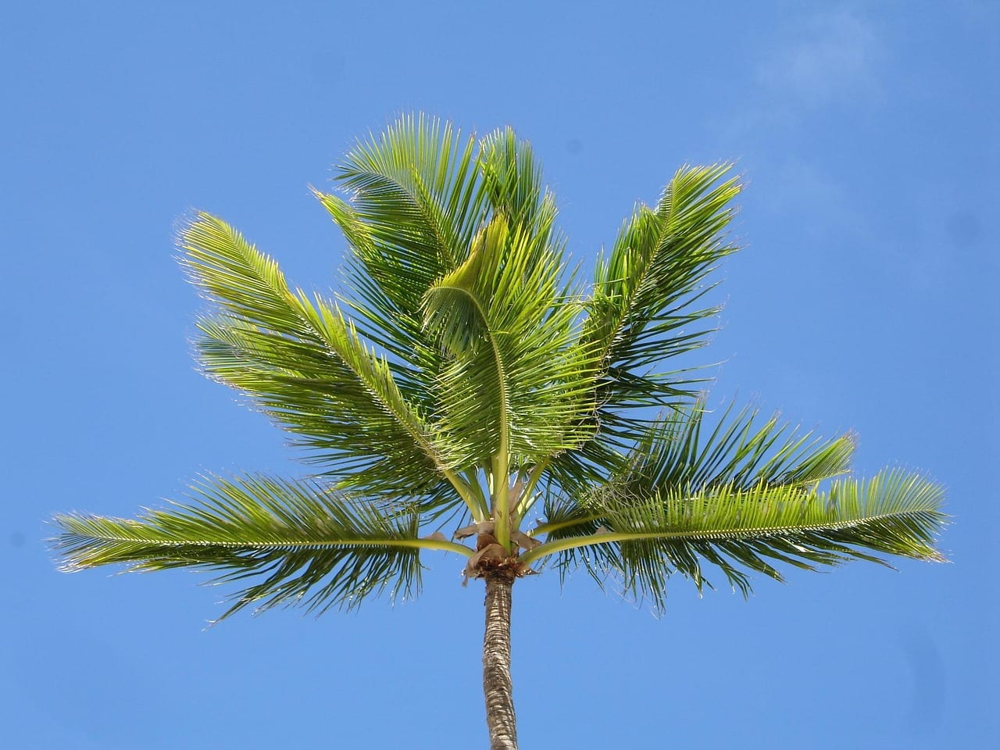

---

## Что пишут те, кто был

Разобрал доминиканский раздел форума самостоятельных путешественников: пять подфорумов, **478 тем**. Представительной выборкой это не является, и есть проблема поважнее — **массив остановился**. Сообщений 2023–2026 годов в каждом подфоруме единицы: в разделе о дороге и ценах за 2024 год пять упоминаний, за 2025 — два, за 2026 — одно. В разделе отзывов полных отчётов о поездках свежее 2022 года всего два, оба написаны летом 2024-го. Причина видна из фактов выше: прямые рейсы кончились в 2022 году, спрос упал почти вдвое, и вместе с ними кончились самостоятельные поездки.

Из того, что нашлось, четыре вещи меняют планы.

**Кита не увидели из-за неверной даты.** Автор поездки в марте 2024 года вычеркнул Саману из маршрута, считая, что сезон китов заканчивается в феврале. Министерство окружающей среды объявляет его до 31 марта — он успевал. Стоит проверять даты по министерству, а не по форумной памяти.

**Оплаченная бронь машины испарилась из-за задержки рейса.** Вылет задержали, стойки проката закрываются в девять вечера, и наутро оплаченную бронь не перенесли: пришлось отменять и оформлять заново с телефона на сайте прокатчика. Итог — 700 долларов, из них 350 записаны как «опциональные» и обнаружились через два дня при разборе бумаг. Бак выдали залитым на три четверти при полном по договору. Отдельная строка: на трассе радар показал 115 при заявленных водителем 100, и бланк он подписал, не оставив себе копии.

**Страна проходится без машины.** Путешественница, ездившая в одиночку в мае–июне 2024 года, пересекла страну на междугородних автобусах Caribe Tours, местных гуа-гуа и мотокончо. Главная помеха — пробки в Санто-Доминго: приходилось брать более ранние рейсы, чтобы успевать на пересадки. Такси по приложению в столице приезжает за три-пять минут, в других городах на него рассчитывать не стоит.

**Отель «всё включено» может оказаться закрытым контуром.** В отчёте о Байяибе из отеля можно было гулять только по кромке моря: грунтовая дорога в сам посёлок после дождей стала непроходимой пешком. Колониальная зона Санто-Доминго в июне 2024 года стояла в ремонте — главный музей закрыт на реставрацию, две усадьбы не посещались, центральная площадь перекопана.

**Оценки расходятся, и это полезно.** Основатель форума после поездки писал, что на месте читателя выбрал бы другие острова Карибского моря, и перечислял слабые рестораны, редкие супермаркеты, отсутствие приёма карт. Путешественница 2024 года хвалит природу и ругает мусор вдоль всех дорог, куда местные добираются на машинах. Сходятся оба в одном: страна построена под пакетного туриста, и самостоятельному в ней приходится идти против устройства. Заодно там же развенчан форумный страх про «двух мужчин с мачете»: мачете в стране — садовый инструмент, а на «Hola!» отвечают пожеланием хорошей прогулки.

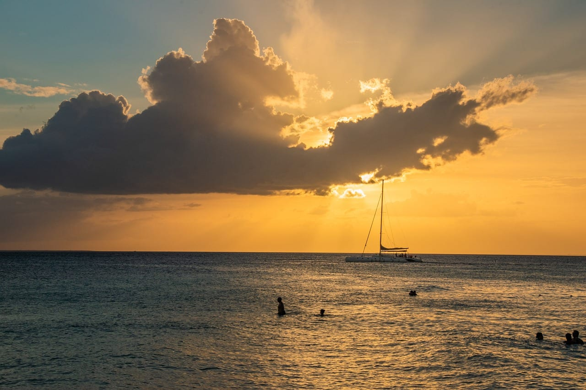

---

## FAQ — что чаще всего спрашивают про Доминикану

**Нужна ли виза в Доминикану россиянам?**
Нет. Официальный визовый инструмент МИД Доминиканы на запрос «Россия, обычный паспорт, туризм» отвечает «виза не требуется». Обязательна бесплатная электронная анкета E-Ticket — и на въезд, и на выезд.

**Сколько дней можно находиться в стране?**
Двустороннее соглашение, действующее с 15 декабря 2020 года, даёт 60 календарных дней в течение каждого периода в 180 дней от даты первого въезда. Миграционная служба страны при этом пишет о 30 днях для туристов и берёт деньги за продление. Для поездки на две недели разницы нет, для зимовки — есть.

**Есть ли прямые рейсы из Москвы?**
Нет с 2022 года. Календарь цен авиакомпании «Северный ветер» по этому направлению отвечает «Временно не летаем», поиск по фильтру «прямые рейсы» — «нет билетов». Страницы агрегаторов с расписанием прямых рейсов устарели.

**Сколько лететь и сколько это стоит?**
От 20 часов 15 минут до двух суток в зависимости от стыковок. На 28 августа 2026 года билет туда-обратно на январь 2027 года стоил от 147 349 ₽ с ручной кладью и от 161 434 ₽ с багажом, но самый дешёвый вариант с багажом идёт через Майами и требует визы США.

**Когда лучше ехать?**
С декабря по март: на восточном и юго-восточном берегу это сухие месяцы, ураганов нет, водоросли в низкой фазе. Северный берег в это время самый мокрый в году, туда логичнее ехать поздней весной.

**Когда в Самане киты?**
Официальный сезон наблюдения за горбатыми китами министерство окружающей среды объявляет с 15 января по 31 марта.

**Работают ли карты «Мир»?**
Нет, как и выпущенные в России Visa и Mastercard. Нужны наличные доллары для обмена либо карта иностранного банка.

**Нужна ли туристическая карта за 10 долларов?**
Её стоимость включена в авиабилет с 25 апреля 2018 года для билетов, выписанных вне Доминиканы. Отдельно в аэропорту её не покупают.

---

## Коротко о главном

Доминикана — направление, где **дорога дороже отдыха**: две трети бюджета уходит на перелёт, потому что прямых рейсов из России нет с 2022 года. Это же объясняет, почему спрос на страну упал почти вдвое и почему самостоятельные путешественники перестали писать о ней отчёты.

Если ехать, то **с декабря по март и на восточный или юго-восточный берег** — Пунта-Кана, Ла-Романа, Байяибе. Север в эти месяцы мокрее востока вдвое с лишним, и это подтверждено нормами метеослужбы, а не ощущениями. С 15 января к этому окну добавляются киты в Самане.

Перед покупкой билета стоит посмотреть на аэропорты стыковки: **самый дешёвый билет с багажом летит через США**, и без американской визы он бесполезен. Разница с первым вариантом без США — 5 518 ₽, и она того стоит.

<a href={youtravelSub('dominican_republic_2027_final')} class="aff-cta" rel="sponsored">Посмотреть авторские туры по Доминикане и Карибам</a> маршрут, даты и состав группы видны до оплаты, организаторы с отзывами и опытом по региону
