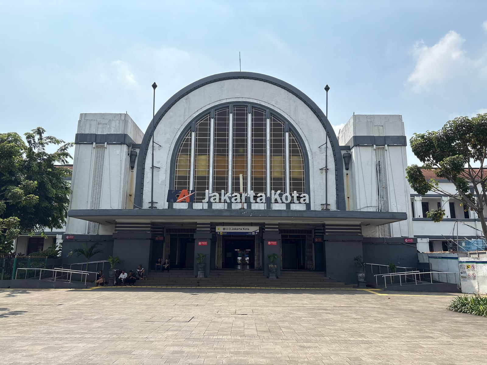
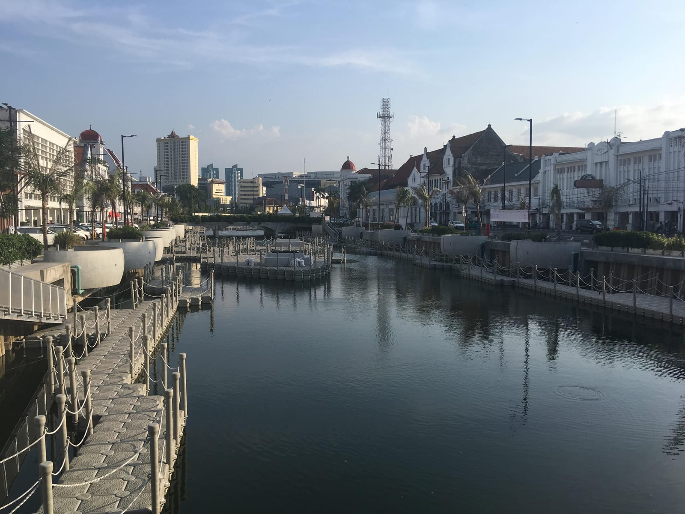
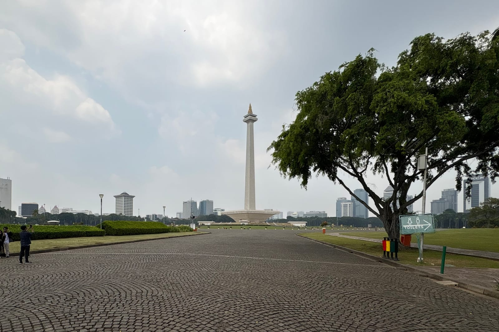
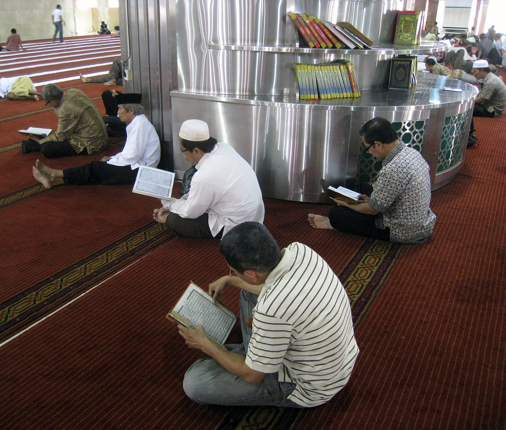
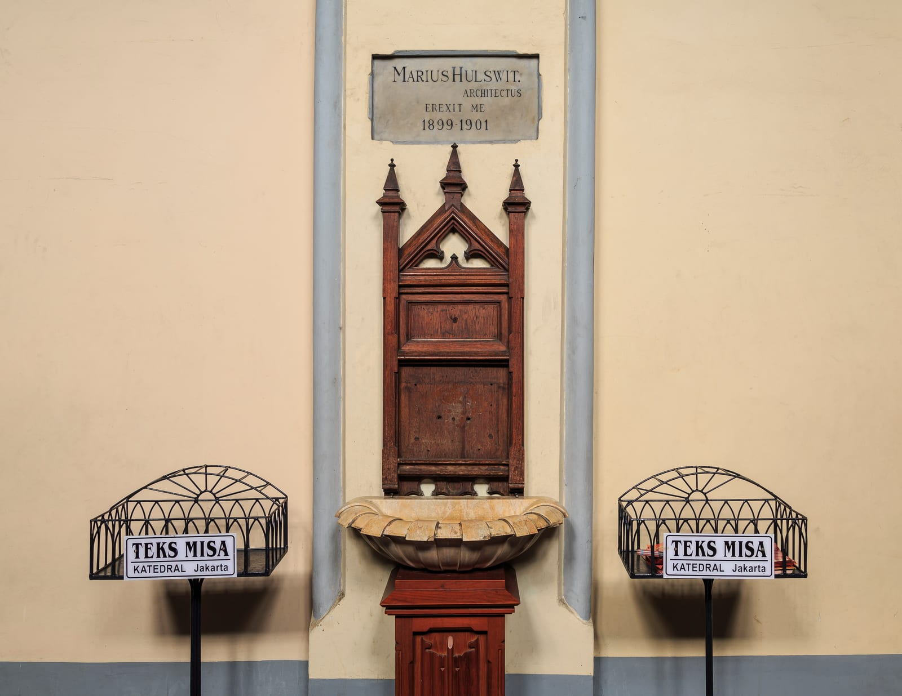
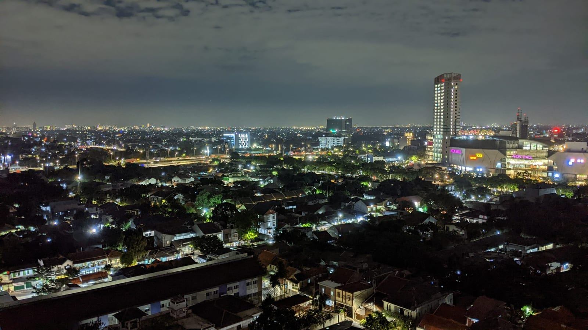

import { ostrovokCity, tpkDeep } from '../../data/affiliate.js';
import RouteDays from '../../components/post/RouteDays.astro';

export const jakartaTour = tpkDeep('tripster', 'https://experience.tripster.ru/experience/73040/', 'jakarta_day_tour');

export const jakartaStay = ostrovokCity('indonesia', 'jakarta', 'jakarta_overnight');

За один день в Джакарте лучше выбрать старый город Кота Туа и центральный район у Монаса, оставив время на один музей и обед. Между районами нужен переезд. Если город достался на пересадке, сначала посчитайте время вне аэропорта: длинный промежуток между рейсами ещё не означает полный день для прогулки.

Джакарта плохо укладывается в идею «пройдём пешком всё главное». У старой Батавии — площадь с колониальными зданиями и канал. У площади Мердека — высокий монумент, Национальный музей и огромная мечеть напротив католического собора. Это разные части города. Если соединить их с дальним парком, портом и вечерним шопингом, поездка быстро превратится в череду переездов.

Маршрут ниже рассчитан на первый визит без машины. Время у достопримечательностей — ориентир для планирования, а не расписание экскурсии. Приоритет можно поменять: любителю истории начать с музея, человеку после ночного перелёта оставить один район, а в понедельник строить день вокруг прогулки, не закрытых музейных дверей.

Для поездки с гидом можно сравнить наш самостоятельный план с <a href={jakartaTour} rel="sponsored">экскурсией по Джакарте</a>. Состав остановок и время возвращения уточните до бронирования.

## Как собрать маршрут по Джакарте на один день

Начните с **двух опорных районов: Кота Туа и центра у Монаса**. На первый оставьте утро, на второй — время после обеда. Отдельно заложите дорогу между ними. Добирать свободный час третьим удалённым районом обычно менее полезно, чем спокойно зайти в музей или пообедать.

<RouteDays
  title="Порядок остановок: старый город, затем центр"
  days={[
    { n: 1, place: 'Площадь Фатахилла', what: 'Начните с площади и выберите один музей в Кота Туа. Музей истории города подойдёт для знакомства с Батавией.' },
    { n: 2, place: 'Kali Besar и обед', what: 'Канал — необязательное продолжение прогулки. Если жарко или сил мало, сразу переходите к обеду.' },
    { n: 3, place: 'Переезд в район Монаса', what: 'Для автобуса смотрите коридор 1 Transjakarta и действующие остановки. В такси задавайте доступный вход, а не центр площади.' },
    { n: 4, place: 'Монас, Истикляль и собор', what: 'Начните с внешнего осмотра. Подъём и посещение храмов внутри добавляйте только при доступном входе и запасе времени.' },
    { n: 5, place: 'Возвращение', what: 'Ужин рядом с отелем или дорога в аэропорт. Дальнюю вечернюю точку выбирайте вместо части дневного плана.' },
  ]}
  note="Это последовательность посещений, не карта пешего пути и не расписание. В понедельник замените музей прогулкой; при сильном дожде выбирайте один открытый музей и сокращайте переезды."
/>

Если музей — главная причина остановки, поменяйте порядок: сначала Национальный музей, затем выбирайте между Монасом и Кота Туа. Ставить важное посещение на последний час дня рискованно: касса может закончить работу раньше закрытия здания, а дорога занять больше ожидаемого.

Для продолжения поездки на острова пригодится [гайд по Бали](/blog/bali-guide-2026/). Джакарту лучше считать отдельной городской остановкой: пляжный план и плотный день в мегаполисе требуют разного темпа.

*Фото: Chainwit., [CC BY](https://creativecommons.org/licenses/by/4.0/); [оригинал](https://commons.wikimedia.org/w/index.php?curid=171165965).*

## Что посмотреть в Кота Туа утром

Начальная точка — площадь Фатахилла. Здесь удобно увидеть старую Джакарту без списка из десятка адресов: площадь, окружающие здания, музей истории города, соседние музейные входы. Не покупайте билеты сразу во все музеи. Сначала решите, что интереснее: история Батавии, индонезийские куклы ваянг или денежная история страны.

Музей истории Джакарты занимает бывшую ратушу. Его легко перепутать с Национальным музеем в другой части города: это разные коллекции и разные остановки маршрута. Если нужно понять именно старую Батавию, логично выбрать городской музей и оставить более широкий рассказ об Индонезии на другой визит.

Музей ваянг подходит тем, кому интересны куклы и сценические традиции. Музей Bank Indonesia — альтернатива с денежной историей и банковским зданием. Выбирайте один по интересу, а перед выходом сверяйте его часы: название района в путеводителе не гарантирует, что все учреждения открыты одинаково.

После площади можно пройти к Kali Besar — каналу среди старых зданий. Это продолжение прогулки, а не обязательный дополнительный квест. Если стало жарко или ребёнок устал, лучше остановиться на обед, чем пытаться закрыть все точки старого города. Тень, вода и удобный темп здесь полезнее ещё одной отметки на карте.

*Фото: Christophe95, [CC BY-SA](https://creativecommons.org/licenses/by-sa/4.0/); [оригинал](https://commons.wikimedia.org/w/index.php?curid=103529085).*

Кафе в историческом здании — возможность передохнуть, но не бесплатная смотровая. У Café Batavia вид на площадь сочетается с обычным ресторанным сценарием: смотрите меню и условия до заказа. Не стоит строить бюджет по давнему чужому чеку или ждать музейного доступа к любому красивому интерьеру.

## Как переехать к Монасу и площади Мердека

Между старым городом и районом Монаса проходит коридор 1 Transjakarta, Blok M–Kota. Перед поездкой посмотрите нужную остановку и направление в приложении TJ:Transjakarta: временная схема движения важнее старой картинки из путеводителя. MRT не стоит считать прямым поездом до площади Фатахилла — в маршруте может понадобиться пересадка.

Монас — Монумент независимости, заметная вертикаль в большом открытом пространстве центральной Джакарты. После плотной застройки Кота Туа здесь меняется масштаб. Для первого знакомства можно ограничиться видом снаружи: подъём внутрь и на смотровую — отдельное решение, которое зависит от работы кассы, очереди и оставшегося времени.

Не считайте прогулку по карте равной проходу по прямой. У больших общественных пространств важны действующие входы и выходы. Перед высадкой из такси посмотрите точку входа, а не только значок монумента. Иначе короткое расстояние на экране обернётся обходом ограждения.

Если остаётся мало времени, выбирайте: смотровая Монаса или Национальный музей. Разные впечатления конкурируют за одну часть дня. Подъём нужен ради панорамы; музей — ради коллекции и более спокойного посещения в помещении. Делать оба пункта обязательными на короткой остановке не стоит.

*Фото: Chainwit., [CC BY](https://creativecommons.org/licenses/by/4.0/); [оригинал](https://commons.wikimedia.org/w/index.php?curid=175479864).*

## Истикляль и собор: как включить их в прогулку

**Мечеть Истикляль и католический собор стоят рядом**, поэтому их удобно рассматривать как одну остановку. После Монаса это возможность увидеть другой слой города: действующие религиозные пространства, а не только музейные здания. При этом близость двух входов не означает одинакового режима посещения.

Для иностранных туристов у Истикляля есть отдельная регистрация. На официальном портале запрашиваются сведения о посетителе и сопровождении; сам факт существования формы не даёт оснований обещать свободный вход в любой час. Перед визитом уточните туристический порядок, особенно в день большого религиозного события.

Выбирайте закрытую одежду, не мешайте молитве и следуйте указаниям на месте. Не стройте план вокруг обязательной фотосессии внутри. Если туристический вход временно ограничен, осмотр снаружи остаётся самостоятельной остановкой, а музей можно сделать следующим пунктом.

С собором тот же принцип: это работающий храм. Служба не является частью экскурсионной программы, а доступ в отдельный музей или помещение может отличаться от входа в сам собор. Если времени мало, лучше спокойно увидеть оба здания, чем спорить с расписанием богослужений ради полного списка интерьеров.

*Фото: Gunawan Kartapranata, [CC BY-SA](https://creativecommons.org/licenses/by-sa/3.0/); [оригинал](https://commons.wikimedia.org/w/index.php?curid=18711488).*

## Что выбрать в дождь, понедельник или с ребёнком

В дождь опорой дня может стать **Национальный музей Индонезии** на Jalan Medan Merdeka Barat, 12. Он находится у центрального района маршрута; не нужно ехать обратно в старый город только ради помещения. Если музей важен, ставьте его первым, а прогулку вокруг Монаса оставляйте на подходящую погоду.

Иностранный взрослый билет стоит **150 000 индонезийских рупий — примерно 710 ₽**. По режиму с 1 апреля 2026 года музей работает со вторника по четверг с 08:00 до 18:00, с пятницы по воскресенье — до 20:00; понедельник и национальные праздники — выходные. Все часы — местные, WIB. Этот режим относится к Национальному музею, а не ко всем музеям Джакарты.

Для сравнения, иностранный билет в музей истории Джакарты на площади Фатахилла указан как 50 000 рупий — около 240 ₽. Его будничный день со вторника по пятницу заканчивается в 15:00, выходной — в 20:00; понедельник закрыт. Поэтому музей в Кота Туа лучше оставить в утренней части маршрута, а не откладывать на возвращение. Рубли округлены; итог списания по карте может отличаться.

Понедельник меняет выбор дня. Музеи Кота Туа также могут быть закрыты, поэтому не планируйте музейный марафон без проверки конкретных дверей. Оставьте площадь Фатахилла, канал и внешние виды центральных достопримечательностей. Если вся поездка задумана ради коллекций, перенести городской день полезнее, чем заменять каждый закрытый музей торговым центром.

С ребёнком удобнее сократить количество переездов. Один район, музей по интересу и нормальный обед дают более управляемый день, чем пять остановок с неопределённым транспортом между ними. В большой семейной компании заранее посмотрите вместимость машины и место для багажа: возможность вызвать автомобиль не означает, что любой вариант подойдёт всем.

*Фото: CEphoto, Uwe Aranas, [CC BY-SA](https://creativecommons.org/licenses/by-sa/3.0/); [оригинал](https://commons.wikimedia.org/w/index.php?curid=38694568).*

## Можно ли посмотреть Джакарту на пересадке

**Сначала считайте полезное время вне аэропорта, потом выбирайте достопримечательности.** Из промежутка между рейсами нужно вычесть выход из самолёта, формальности, возможное получение багажа, дорогу в город и обратно, регистрацию и запас на непредвиденную задержку. Остаток и есть время прогулки. Универсального безопасного числа часов для любой пересадки нет.

Международный транзит и выход в город — разные сценарии. До поездки убедитесь, что документы позволяют пересечь границу и затем вылететь выбранным рейсом. Условия зависят от паспорта и маршрута. Не покупайте невозвратную городскую программу, пока не понятны въезд, багаж и регистрация на следующий перелёт.

Если между рейсами остаётся ночь, <a href={jakartaStay} rel="sponsored">выбирайте жильё в Джакарте</a> по времени дороги до своего аэропорта.

Из аэропорта Сукарно-Хатта, код CGK, есть поезд Commuter Line Basoetta. Для центральной части города смотрите станции BNI City и другие остановки действующего расписания. Время движения поезда не включает переход из терминала к станции, ожидание отправления и путь от станции до музея. Эти отрезки нужно добавить отдельно.

Если начало и конец остановки зависят от двух разных билетов, запас времени особенно важен. Отмена одного городского пункта легко исправляется, пропущенный вылет — гораздо хуже. На короткой пересадке выбирайте один район; при позднем прилёте и раннем вылете разумным планом может оказаться сон рядом с аэропортом.

Если ещё выбираете аэропорт для остановки по пути в Азию, сравните этот вариант с [пересадкой в Шанхае](/blog/peresadka-v-shankhae/). Для каждого маршрута отдельно проверяйте условия въезда и время, которое останется на город.

*Фото: Niels Lange, [CC0](https://creativecommons.org/publicdomain/zero/1.0/); [оригинал](https://wordpress.org/photos/photo/333642c29f/).*

## Где ночевать и как считать расходы на день

Для городской остановки смотрите жильё относительно выбранного маршрута и следующего выезда. Отель у аэропорта удобен для раннего рейса, но не становится центральным отелем из-за слова Jakarta в адресе. Для полного городского дня сравните варианты в центральной части и фактическую дорогу к ним.

<a href={jakartaStay} target="_blank" rel="sponsored noopener noreferrer">Сравнить жильё в Джакарте на Островке</a> — с проверкой адреса, времени заселения и условий отмены на свои даты. Перед оплатой сопоставьте отель с аэропортом вылета и выбранными районами.

Для начала посчитайте **платные музейные входы**, а дорогу, еду и жильё добавьте отдельно. Ниже расчёт для взрослых иностранных посетителей: он не включает детские льготы, выставки с отдельным билетом, подъём на Монас и банковские комиссии.

| Выбор музея | На одного взрослого | На двух взрослых |
|---|---|---|
| Музей истории Джакарты в Кота Туа | 50 000 IDR ≈ 240 ₽ | 100 000 IDR ≈ 470 ₽ |
| Национальный музей у площади Мердека | 150 000 IDR ≈ 710 ₽ | 300 000 IDR ≈ 1 420 ₽ |
| Оба музея в один день | 200 000 IDR ≈ 940 ₽ | 400 000 IDR ≈ 1 890 ₽ |

Суммы в рублях округлены до десятков. Сначала складываются рупии, затем переводится общий итог — поэтому сумма округлённых строк может отличаться от округлённой общей суммы. Это расчёт билетов, а не обещание провести весь день за 240 ₽.

Если важна старая Батавия, выберите первый вариант. Если цель — коллекции Национального музея, начните день с него: выбор второго варианта меняет и порядок поездки. Оба музея оправданы, когда коллекции важнее долгой прогулки и осмотра храмов. Для семьи с детьми отдельно уточните возрастные категории; умножать взрослый иностранный тариф на всех нельзя.

Полный бюджет запишите так: **музеи + дорога в город + переезд между районами + еда и вода + обратная дорога**. Подставьте стоимость выбранных поездов или машины на свою дату и состав группы. Если ночуете, прибавьте отель. Без этих сумм музейная таблица остаётся только проверенной частью расходов.

Не включайте в обязательный бюджет всё, что попалось в подборке. Смотровая, несколько музеев и дальняя вечерняя точка увеличивают и расходы, и время дороги. Хороший однодневный маршрут оставляет возможность отказаться от второстепенной остановки без ощущения, что путешествие сорвалось.

## Что пишут те, кто был

В двух отзывах о Монасе за январь и апрель 2025 года повторяется одна практическая деталь: к монументу мало подойти, нужно разобраться с билетом и временем входа. Это небольшая выборка отзывов Tripadvisor; считать её представительной нельзя. Она не описывает нынешние очереди или все впечатления от Джакарты.

Январский посетитель не попал внутрь и отметил, что билеты продавались не у памятника, а у входа в парк. Апрельский посетитель поднялся на смотровую, отметил вид на город, описал билет на определённое время и очереди к лифту в обе стороны.

Разница между этими поездками объясняет, зачем оставлять подъём необязательным. Если панорама — главная цель, сначала выясните действующий порядок посещения. Если на город отведена короткая остановка, внешний осмотр и прогулка могут оказаться более удобным выбором. Цены и режим из старых отзывов не следует считать актуальной инструкцией.

## Частые вопросы о первом дне в Джакарте

### Хватит ли одного дня на Джакарту?

На знакомство со старым городом и центральным районом — да, если выбрать один музей и оставить время на переезды. Это не способ увидеть весь мегаполис. Для спокойного музейного дня и отдельной прогулки по другим районам лучше дополнительная ночёвка.

### С чего начинать: с Монаса или Кота Туа?

С приоритетной точки. Для прогулки по старой Батавии начните с площади Фатахилла. Если главная цель — коллекция Национального музея, сначала езжайте к нему. Остальную часть маршрута проще сокращать после важного посещения, а не перед ним.

### Национальный музей и музей истории Джакарты — одно место?

Нет. Национальный музей стоит у площади Мердека, а музей истории Джакарты — в бывшей ратуше на площади Фатахилла. При поиске билетов и маршрута проверяйте название учреждения и адрес, иначе план может отправить вас в другой район.

### Можно ли обойти весь маршрут пешком?

Пешком удобно смотреть точки внутри выбранного района. Между Кота Туа и центральной частью запланируйте транспорт. Сочетание прогулки, жары и широких дорог не стоит оценивать только по прямому расстоянию между значками на карте.

### Что делать в понедельник?

Проверять часы каждого музея заранее и строить запасной план из прогулок. Национальный музей в понедельник закрыт. Если именно музейные коллекции — цель поездки, по возможности выберите другой день, а не рассчитывайте на открытие без подтверждения.

### Можно ли туристу посетить Истикляль?

Официальный портал предусматривает регистрацию иностранных туристов. Условия конкретного посещения нужно уточнять, учитывая молитвы и мероприятия. Наличие туристической формы не гарантирует вход в любой момент и не заменяет правила поведения в действующей мечети.

### Стоит ли подниматься на Монас?

Если панорама для вас важнее дополнительного музея и есть время на вход. Осмотр монумента снаружи тоже имеет смысл. На короткой остановке подъём лучше оставить необязательным пунктом, который можно отменить из-за очереди или изменения плана.

### Можно ли выйти из CGK на несколько часов?

Это зависит от права на въезд, багажа, рейса и реального времени дороги. Сначала посчитайте запас до регистрации и посадки на обратном пути. Если после всех вычетов остаётся короткий промежуток, поездку в центр лучше не планировать.

### Чем занять дождливую половину дня?

Выбрать один открытый музей в том районе, где вы находитесь, и сократить переезды. Для центральной части подходит Национальный музей. Его часы и иностранный тариф отличаются от небольших музеев Кота Туа, поэтому заранее определитесь с названием.

### Нужно ли включать в день порт и дальние парки?

Только вместо части основного маршрута. Добавление удалённого места поверх двух районов отнимает время у самих посещений. Выберите то, ради чего остановились в городе: историю, архитектуру, музейную коллекцию или прогулку, — и подстройте день под этот интерес.

## Что почитать дальше

- [Бали: районы, маршрут и подготовка к поездке](/blog/bali-guide-2026/).
- [Сезон на Бали: погода по месяцам](/bali/).
- [Рассказы о путешествиях в канале TravelTribe](https://t.me/traveltriberu).

*Обложка: CEphoto, Uwe Aranas, [CC BY-SA](https://creativecommons.org/licenses/by-sa/3.0/); [оригинал](https://commons.wikimedia.org/w/index.php?curid=41093453).*
