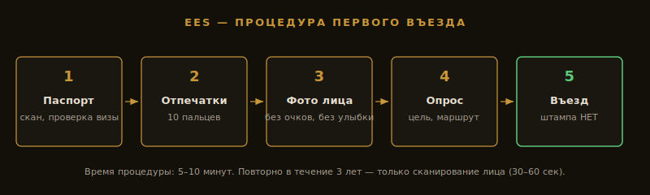

**Очередь в Барселона-Эль-Прат — 4 часа** к пограничному киоску (по сообщениям пассажиров и местных СМИ, суббота 11 апреля 2026) — первый день «массового туризма» после запуска EES. По данным аэропортов Schiphol и Charles de Gaulle, туристы с 90-минутными пересадками опаздывали на стыковочные рейсы. Авиакомпании пересаживают на следующие, но день потерян. По оценкам Еврокомиссии и IATA, повышенные задержки сохранятся в первые месяцы работы системы.

EES — Entry/Exit System — заработал в полном режиме на границах Шенгена **с 10 апреля 2026** (поэтапно вводился с 12 октября 2025, к апрелю 2026 — 100% пунктов пропуска по графику EU-LISA / Еврокомиссии, [travel-europe.europa.eu/ees_en](https://travel-europe.europa.eu/ees_en)). Штампы в паспорте отменены, вместо них электронная регистрация: фото лица и отпечатки **10 пальцев**. Россияне попадают под правила в полной мере — без биометрии возможен отказ во въезде и возврат в страну отправления за свой счёт ([Регламент (EU) 2017/2226](https://eur-lex.europa.eu/eli/reg/2017/2226/oj)).

В материале — что реально происходит на границе, тайминги и нюансы пересадок (по данным Еврокомиссии, EU-LISA и сообщений аэропортов).

> **Связано:** [Шенгенская виза для россиян 2026 — куда реально дают](/blog/schengen-visa-2026/) — без визы EES никак не пройти. Полный разбор системы и **калькулятор дней 90/180** — в гайде [EES 2026: биометрия, виза и калькулятор](/blog/ees-2026/).

---

## Главное за 30 секунд

* **EES в полном режиме с 10.04.2026** (поэтапный запуск стартовал 12.10.2025), обязательна для всех граждан третьих стран (Россия в том числе).
* **При первом въезде** в Шенген после этой даты — снимут отпечатки пальцев (10 пальцев) и сфотографируют лицо.
* **При повторных въездах в течение 3 лет** — только сканирование лица, быстрее.
* **Дети до 12 лет** — без отпечатков, только фото.
* **Штампы в паспорте** больше не ставят — данные хранятся в электронной базе ЕС.
* **Очереди в первые недели:** по сообщениям Schiphol и CDG, в первые недели апреля 2026 фиксировались задержки 2–3 часа на пограничном контроле в популярных аэропортах.
* **ETIAS** к россиянам **не применяется** — это для безвизовых стран. Вам по-прежнему нужна шенгенская виза.

---

## В каких странах работает EES в 2026?

**EES работает в 29 странах Шенгенской зоны — 25 государствах ЕС плюс 4 не входящих в ЕС (Исландия, Норвегия, Лихтенштейн, Швейцария).** Не используют EES только Ирландия и Кипр — у них своя система пограничного контроля.

В системе участвуют **29 стран** Шенгенской зоны.

**ЕС (25 стран):** Австрия, Бельгия, Болгария, Хорватия, Чехия, Дания, Эстония, Финляндия, Франция, Германия, Греция, Венгрия, Италия, Латвия, Литва, Люксембург, Мальта, Нидерланды, Польша, Португалия, Румыния, Словакия, Словения, Испания, Швеция.

**Не-ЕС (4 страны):** Исландия, Норвегия, Лихтенштейн, Швейцария.

**Не входят в EES:** Ирландия и Кипр — у них своя система контроля.

---

## Что именно делают на границе

| Параметр | Первый въезд | Повторный (3 года) | Через 3 года |
|---|---|---|---|
| **Сканирование паспорта** | Да | Да | Да |
| **Отпечатки пальцев** | 10 пальцев | Нет | 10 пальцев заново |
| **Фото лица** | Да | Сверка с базой | Новое фото |
| **Время** | 5⁠–⁠10 минут | 30⁠–⁠60 секунд | 5⁠–⁠10 минут |
| **Штамп в паспорт** | Нет (только база) | Нет | Нет |

### Первый въезд после 10 апреля 2026

1. Подходите к специальному киоску или к стойке пограничника (зависит от аэропорта).
2. Сканируете паспорт — система проверяет визу.
3. Прикладываете 4 пальца правой руки (большой отдельно), потом то же с левой — итого 10 пальцев.
4. Камера делает фото лица — стоять прямо, без очков, без улыбки.
5. Пограничник проверяет данные и задаёт стандартные вопросы. По отзывам пассажиров CDG и Schiphol за 12–15.04.2026, чаще всего спрашивают про обратный билет и бронь отеля.
6. Штамп в паспорт не ставят — отметка о въезде уходит в базу EES.

### Повторный въезд (в течение 3 лет)

1. Сканируете паспорт.
2. Камера сверяет ваше лицо с фото в базе.
3. Если совпадение — пропускают за 30–60 секунд.
4. Отпечатки пальцев заново снимать не нужно.

### Через 3 года

Биометрические данные удаляются из базы. При следующем въезде — снова процедура с нуля как в первый раз.

---

## Где в аэропорту находится зона EES?

В большинстве крупных аэропортов установлены **самообслуживаемые киоски**. Сами сканируете паспорт и сдаёте биометрию, потом подходите к пограничнику для финальной проверки. В небольших или старых терминалах — всё через пограничника, очередь медленнее.

Куда смотреть в аэропорту:

* Указатели *EES Registration* (регистрация EES) / *Self-Service Kiosks* (киоски самообслуживания) / «Биометрическая регистрация».
* Отдельная зона перед паспортным контролем.
* Если есть выбор — приоритет для **биометрических паспортов**. Российские загранпаспорта нового образца с чипом — биометрические.

---

## Где сдавать EES при пересадке в Шенгене?

**Биометрию EES сдают в первой стране Шенгена, куда вы прилетаете, а не в стране назначения.** Если летите Москва → Стамбул → Барселона, биометрия будет в Барселоне (Стамбул не Шенген). Если Москва → Дубай → Мюнхен → Барселона — в Мюнхене, дальше внутренний рейс ЕС.

Самый частый вопрос: «Я лечу через Стамбул в Барселону. Где буду сдавать биометрию?»

**Правило:** EES работает в **первой стране Шенгена**, куда вы прилетаете.

| Маршрут | Где сдавать EES | Почему |
|---|---|---|
| Москва → Стамбул → Барселона | **Барселона** | Стамбул — не Шенген |
| Москва → Дубай → Мюнхен → Барселона | **Мюнхен** | Первый въезд в Шенген, дальше внутренний рейс ЕС |
| Москва → Стамбул → Афины → Кипр | **Афины** | Кипр не в EES, отдельный контроль |

**Важно для пересадок:**

* Закладывайте на пересадку **минимум 2,5–3 часа** в первой шенгенской стране, особенно в первые месяцы работы EES.
* Короткие стыковки 60–90 минут — реальный риск опоздать на следующий рейс из-за очереди.
* При опоздании авиакомпания обычно пересаживает на следующий рейс бесплатно (если стыковка по одному билету) — по правилам [Регламента EU 261/2004](https://eur-lex.europa.eu/eli/reg/2004/261/oj) и стандартной практике перевозчиков, — но это потеря половины дня.

---

## Как ускорить прохождение EES

1. **Биометрический загранпаспорт** (с чипом, выдают с 2010 года) — в ряде аэропортов даёт доступ к автоматизированным воротам eGates. Доступность для визовых граждан третьих стран (включая Россию) зависит от страны и терминала — уточняйте на месте.
2. **Доехать до киосков заранее.** После посадки идите быстро, не задерживайтесь в Duty Free.
3. **Не приходите впритык.** Регистрация на рейс закрывается за 60–90 минут до вылета — это с учётом обычного контроля. По практике первых недель апреля 2026 (Schiphol, CDG) с EES к привычному запасу стоит закладывать +60 минут.
4. **Проверьте паспорт перед поездкой:** срок действия минимум 3 месяца после возвращения + 2 чистые страницы ([Шенгенский кодекс границ, Регламент (EU) 2016/399, ст. 6](https://eur-lex.europa.eu/eli/reg/2016/399/oj)).
5. **Снимите контактные линзы и очки перед фото**, не улыбайтесь, не машите головой — система может не распознать.
6. **На выезде из Шенгена — ту же процедуру:** сканирование лица или регистрация выезда. По [Регламенту (EU) 2017/2226](https://eur-lex.europa.eu/eli/reg/2017/2226/oj) выезд без отметки означает статус overstay в системе.

---

## Что не работает

**EES — не предварительная регистрация.** Сдать биометрию заранее (например, в визовом центре в Москве) **нельзя**. Только на границе при первом физическом въезде в Шенген.

**Нет онлайн-формы перед вылетом.** В отличие от ESTA (США), ETIAS (для безвизовых) или Arrival Card (Китай) — EES заполнять заранее не нужно. Но и нельзя.

**Нельзя отказаться от биометрии.** Отказ = автоматический запрет на въезд и разворот в Россию за свой счёт.

**Не заменяет визу.** EES — это пограничный контроль, а не разрешение на въезд. Шенгенская виза по-прежнему обязательна.

---

## Лайфхаки для россиян

* **Прилетайте утром.** Большинство стыковочных рейсов из РФ через Стамбул/Дубай заходят в Европу днём — пик загрузки EES. Утренние рейсы (до 9:00) обычно идут через свободные коридоры. Рейсы с утренним прилётом ищутся за минуту: <a href="https://aviasales.tpk.mx/JCSPlC17?erid=2Vtzqxkn4LF&u=https%3A%2F%2Fwww.aviasales.ru%2F%3Fsub_id%3Dees_shengen_2026" class="aff-cta" rel="sponsored">фильтр по времени вылета и прилёта</a>.
* **Выбирайте крупные хабы.** Франкфурт, Схипхол (Амстердам), Мадрид — много киосков, очереди распределяются. Маленькие аэропорты (Загреб, Любляна) — мало стоек, очередь дольше.
* **Не теряйте паспорт после регистрации.** При утере паспорта данные EES к новому документу не привяжутся автоматически — придётся проходить процедуру заново при следующем въезде.
* **Семьи с детьми** — приоритетная зона есть в большинстве аэропортов; спрашивайте указатель Priority lane for families (приоритетная зона для семей).
* **Интернет — с посадки, не после багажа.** Очередь на контроле может съесть 1–4 часа, а бесплатный Wi-Fi есть не во всех зонах прилёта. eSIM ставится ещё до вылета: <a href="https://drimsim.ru/?utm_travelpayouts_track_id=9681f36432214f3785fa2431a-546042" class="aff-cta" rel="sponsored">Drimsim с оплатой картой РФ</a> или <a href="https://airalo.pxf.io/c/1209822/1310283/15608?erid=2VtzqxRWDfm&sharedID=546042_&u=https%3A%2F%2Fairalo.com%2Fru" class="aff-cta" rel="sponsored">eSIM Airalo под страну</a>.

И про полис: для шенгенской визы страховка с покрытием от 30 000 € обязательна ещё на этапе подачи документов — без неё до EES вы просто не доедете. <a href="https://cherehapa.tpk.mx/GmVWjhCN?erid=2VtzquZTwb5&u=https%3A%2F%2Fcherehapa.ru%2Ftravel%2F%3Fsub_id%3Dees_shengen_2026" class="aff-cta" rel="sponsored">Сравнить полисы для Шенгена онлайн</a> — фильтр по покрытию, оплата картой РФ.

---

## FAQ

**Что такое EES простыми словами?**
EES (Entry/Exit System) — это электронная система въезда-выезда на границах Шенгена, заработавшая в полном режиме с 10 апреля 2026. Вместо штампа в паспорте пограничник снимает фото лица и отпечатки 10 пальцев, а данные о въезде и выезде хранятся в общей базе ЕС. Россияне проходят её в полной мере.

**Если у меня уже есть действующая шенгенская виза, мне всё равно нужно проходить EES?**
Да. EES не зависит от наличия визы. Это пограничный контроль, а виза — разрешение на въезд. Оба нужны.

**Нужно ли регистрироваться в EES заранее или онлайн перед вылетом?**
Нет. EES — не предварительная регистрация: сдать биометрию заранее, например в визовом центре в Москве, нельзя. Онлайн-формы перед вылетом, в отличие от ESTA (США) или ETIAS (для безвизовых), тоже нет. Биометрию снимают только на границе при первом физическом въезде в Шенген.

**Сколько времени занимает прохождение EES на границе?**
Первый въезд занимает 5–10 минут — сканирование паспорта, отпечатки 10 пальцев, фото лица и опрос пограничника. При повторных въездах в течение 3 лет — только сверка лица с базой, 30–60 секунд. В первые недели после запуска (апрель 2026) в популярных аэропортах фиксировались очереди до 2–4 часов.

**Как часто нужно сдавать отпечатки пальцев?**
Отпечатки 10 пальцев снимают только при первом въезде. При повторных въездах в течение 3 лет отпечатки заново не нужны — система сверяет только лицо. Через 3 года после последнего въезда данные удаляются из базы, и при следующей поездке процедура проходит с нуля как в первый раз.

**Можно ли пройти EES, если приехал на машине через сухопутную границу (например, через Финляндию или Эстонию)?**
Да. На сухопутных пунктах пропуска EES тоже работает. Финляндия закрыла границу с РФ для туристов с конца 2023 года ([МИД Финляндии](https://um.fi/), по состоянию на 20.05.2026), но через Эстонию или Латвию проехать можно — проверяйте актуальные требования перед поездкой.

**Что если киоск не распознаёт мои отпечатки пальцев?**
Бывает у пожилых людей и у тех, кто работает руками (стёртые пальцы). В этом случае пограничник переключается на ручной режим — вносит данные сам. Не критично, просто медленнее.

**Сколько хранятся данные?**
3 года с момента последнего въезда. После — автоматически удаляются ([ст. 34 Регламента (EU) 2017/2226](https://eur-lex.europa.eu/eli/reg/2017/2226/oj)).

**Можно ли запросить удаление данных раньше?**
Только в исключительных случаях через GDPR-запрос в национальное ведомство страны, где сдавали биометрию. Туристам обычно не одобряют.

**EES — это же то самое, что ETIAS?**
Нет. **EES** — биометрический контроль на границе для всех (включая визовых россиян). **ETIAS** — это электронное разрешение на въезд **для безвизовых стран** (Канада, США, Япония и т.д.). К россиянам ETIAS не применяется — у вас по-прежнему виза.

**Что если я ехал в Шенген до 10 апреля 2026 — мои данные есть в системе?**
Нет. Историческая база не переносилась. Все въезды после 10.04.2026 — с нуля.

**EES задерживается в каких-то странах?**
По сообщениям самих аэропортов и СМИ, в первые недели после запуска (10–25 апреля 2026) задержки до 2–4 часов фиксировались в Charles de Gaulle (Париж), Schiphol (Амстердам), Barcelona-El Prat. К концу апреля ситуация стабилизировалась.

---

## Что делать дальше

* [Шенгенская виза для россиян 2026](/blog/schengen-visa-2026/) — куда реально дают, статистика отказов, какие страны выбирать
* [Сезоны путешествий](/seasons/) — оптимальные месяцы для 70+ направлений мира
* [Калькулятор бюджета поездки](/calculator/) — посчитай Европу с учётом виз и страховки
* [Альтернатива Шенгену — Китай](/blog/hainan-guide-2026/) — безвиз с 15.09.2025, биометрии не нужно
* [Виза в Японию 2026](/blog/japan-visa-2026/) — без EES и биометрии, бесплатная
* [@traveltriberu](https://t.me/traveltriberu) — оперативные обновления по Шенгену и границам в Telegram

---

*Актуально на: 30 апреля 2026. Информация по EES проверена через официальные источники — [Еврокомиссия (EES official)](https://travel-europe.europa.eu/ees_en), посольства стран Шенгена. Список стран и процедуры обновляются — следите за каналом.*
