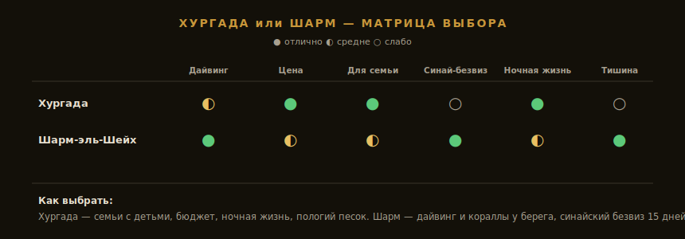

import FlightRoutes from '../../components/post/FlightRoutes.astro';
import PricingCards from '../../components/post/PricingCards.astro';
import AffiliateNote from '../../components/post/AffiliateNote.astro';

Египет — это ближайшее тёплое море для россиянина: прямой рейс до Шарм-эль-Шейха всего **5,5 часа**, купаться можно круглый год, а неделя «всё включено» стоит дешевле, чем многие тратят на отпуск в Сочи. Плюс пирамиды и лучший в мире дайвинг на коралловых рифах. Главных вопроса два — **какой курорт** (Хургада или Шарм) и **как с визой** (а тут есть бесплатная лазейка для Синая). Разберём без турагентского глянца.

> **Если коротко:** прямой **Москва — Шарм-эль-Шейх ~5,5 часа**, Хургада чуть дольше. Виза — **по прибытии около $30–45** на 30 дней, но для отдыха только на Синае (Шарм, Дахаб) до 15 дней действует **бесплатный «синайский штамп»**. Купальный сезон **круглый год** (море +21 зимой, +28 летом), лучшие месяцы — **октябрь–ноябрь и март–май**. Бюджетный тур на двоих — от **77 000 ₽** за неделю зимой.

<AffiliateNote />

> **Когда лучше ехать:** [таблица сезонов](/seasons/) — на Красном море купаются весь год, разбор по месяцам ниже.

Египет годами держит первое место по выездному пляжному спросу из России — близко, дёшево, безвизово в формате «по прибытии», прямые рейсы из десятков городов. Разберём по узлам: виза, перелёт, курорты, бюджет, сезон, дайвинг.

---

## Нужна ли виза в Египет россиянам в 2026?

**Виза нужна, но оформляется элементарно** — по прибытии в аэропорту или онлайн. А для Синайского полуострова есть бесплатная альтернатива.

### Виза по прибытии

В аэропортах (Каир, Хургада, Шарм и др.) ставят туристическую визу на **30 дней**, стоимость — **около $30–45** (Египет с 2026 переходит на электронные визы по прибытии через терминалы и приложение, цена в процессе унификации — уточняйте перед вылетом) ([правила въезда, Aviasales](https://www.aviasales.ru/psgr/article/egypt-entry)). Нужен загранпаспорт со сроком от 6 месяцев и обратный билет.

### Бесплатный «синайский штамп» (Sinai Only)

Если едете **только на Синай** — Шарм-эль-Шейх, Дахаб, Нувейба — и **не дольше 15 дней**, визу можно не платить: в аэропорту ставят бесплатный **синайский штамп** ([Tutu — виза в Египет](https://www.tutu.ru/geo/egypt/article/visa/)). Но есть условие: с ним **нельзя выезжать на материк** (Хургада, Каир, Луксор). Хотите к пирамидам или в Хургаду — нужна полная платная виза.

Практический вывод: для недельного пляжного отдыха в Шарме — берите бесплатный синайский штамп. Для Хургады, Каира или поездки дольше 15 дней — платная виза. Детали статусов — на странице [визы в Египет](/visa/egypt/).

---

## Как добраться до Египта из Москвы в 2026?

**Главный плюс Египта — близко.** Прямой рейс до Шарм-эль-Шейха (SSH) — **около 5 часов 35 минут**, до Хургады (HRG) — чуть дольше. Это вдвое короче, чем лететь в Азию. Рейсы выполняют Аэрофлот, Pegasus, EgyptAir и чартерные перевозчики.

<FlightRoutes routes={[
 {
 from: 'Москва', to: 'Шарм-эль-Шейх (SSH, прямой)',
 flights: [
 { airline: 'Аэрофлот / Pegasus / EgyptAir', code: 'прямой', duration: '~5 ч 35 мин', priceFrom: '15 000–22 000 ₽ в одну сторону', priceUrl: 'https://aviasales.tpk.mx/JCSPlC17?erid=2Vtzqxkn4LF&u=https%3A%2F%2Fwww.aviasales.ru%2F%3Forigin_iata%3DMOW%26destination_iata%3DSSH' },
 ]
 },
 {
 from: 'Москва', to: 'Хургада (HRG, прямой)',
 flights: [
 { airline: 'Аэрофлот / чартеры', code: 'прямой', duration: '~5 ч 50 мин', priceFrom: '14 000 ₽ в одну сторону' },
 ]
 },
]} caption="Москва → Египет — рейсы в 2026" />

Самый дешёвый способ — **готовый тур с чартером** (об этом ниже), но если собираете сами, цены удобно мониторить — <a href="https://aviasales.tpk.mx/JCSPlC17?erid=2Vtzqxkn4LF&u=https%3A%2F%2Fwww.aviasales.ru%2F%3Forigin_iata%3DMOW%26destination_iata%3DSSH" class="aff-cta" rel="sponsored">Найти билет Москва — Шарм</a>: Aviasales сравнивает авиакомпании сразу, гибкие даты дают разницу до 30%. От аэропорта до отелей — трансфер (в туре включён) или такси.

---

## Хургада или Шарм — какой курорт выбрать

В отличие от Вьетнама и Таиланда, у Египта **нет фокуса с противоположными сезонами** — оба курорта на Красном море, климат похожий. Выбор идёт по другим критериям: дайвинг, цена, семья, виза.

* **Шарм-эль-Шейх** — для дайверов и снорклинга: коралловые рифы **прямо у берега**, мировые сайты Рас-Мохаммед и Тиран. Вода чище, отдых спокойнее и чуть дороже. Бонус — **бесплатный синайский безвиз** на 15 дней.
* **Хургада** — для семей и бюджета: пляжи песчаные с **пологим входом** (идеально с детьми), дешевле, больше ночной жизни и аниматоров. Но дайвинг здесь дальше — рифы на островах, нужны лодочные выезды, и виза платная (это материк).

Коротко: **дайвинг и тишина — Шарм; семьи, цена и тусовка — Хургада.** Полное сравнение по пляжам, отелям и экскурсиям — в гиде [Хургада или Шарм 2026](/blog/hurghada-sharm-2026/).

---

## Курорты Египта — куда ещё

* **Хургада** — крупнейший бюджетный курорт, песчаные пляжи, семьи, ночная жизнь, отсюда экскурсии в Луксор
* **Шарм-эль-Шейх** — дайвинг-столица, кораллы у берега, синайский безвиз, спокойнее и дороже
* **Дахаб** — на Синае, расслабленный бэкпекерский дайв-город, знаменитый Голубой провал (Blue Hole), дешевле Шарма
* **Марса-Алам** — южнее Хургады, нетронутые рифы, дюгони и черепахи, для уединённого дайвинга
* **Каир** — не пляж, а ради **пирамид Гизы**, Сфинкса и Египетского музея; на 1–2 дня в начале или конце поездки

---

## Сколько стоит поездка в Египет в 2026?

**Главное преимущество — дёшево.** Тур «всё включено» на двоих за неделю стартует **от 77 000 ₽ зимой** (декабрь–февраль, +22 °C) и **от 102 000 ₽ в бархатный октябрь** ([АТОР](https://www.atorus.ru/article/skolko-stoyat-tury-vse-vklyucheno-v-egipet-na-vesennie-kanikuly-66392)). Самостоятельно 14 дней без перелёта укладываются так:

<PricingCards tiers={[
 {
 tier: 'Эконом',
 emoji: '',
 price: '$450–800',
 priceNote: '14 дней, 1 чел.',
 features: [
 '3★ или гестхаус от $20/ночь',
 'Местная еда (кошари, фуль $2–4)',
 'Маршрутки и такси',
 'Низкий сезон',
 ],
 },
 {
 tier: 'Комфорт',
 emoji: '',
 price: '$1200–2000',
 priceNote: '14 дней, 1 чел.',
 featured: true,
 badge: 'Золотая середина',
 features: [
 '4–5★ «всё включено»',
 'Дайвинг и экскурсии',
 'Трансферы и Каир',
 'Бархатный сезон',
 ],
 },
 {
 tier: 'Премиум',
 emoji: '',
 price: '$3000+',
 priceNote: '14 дней, 1 чел.',
 features: [
 '5★ luxury у рифа',
 'Приватный дайвинг-гид',
 'Круиз по Нилу + Луксор',
 'Топ-линия Шарма',
 ],
 },
]} />

Жильё россиянам удобнее бронировать — <a href="https://ostrovok.tpk.mx/xtyTcUcY?erid=2VtzqvE1cv3" class="aff-cta" rel="sponsored">Забронировать отель в Египте</a>: Ostrovok принимает карты МИР. Но в Египте чаще всего выгоднее именно тур (см. ниже). Точный расчёт — в [калькуляторе](/calculator/).

---

## Тур или самостоятельно — что выгоднее

Египет — **самое «турное» направление из всех**: почти весь поток идёт пакетами «всё включено» с чартером, и собрать дешевле самому здесь сложнее, чем где-либо. За 77 000 ₽ на двоих зимой вы получаете перелёт + 4★ с питанием + трансфер — отдельный билет иногда стоит почти столько же.

Самостоятельно есть смысл ехать ради дайвинг-сафари, Дахаба бэкпекером или длинного маршрута с Каиром и Нилом.

<a href="https://travelata.tpk.mx/Do2A3cgV?erid=2VtzqufPtiT" class="aff-cta" rel="sponsored">Подобрать тур в Египет</a> — Travelata сравнивает всех туроператоров, фильтр по «всё включено», линии пляжа и звёздности, оплата картой МИР. В Египте пакет почти всегда выгоднее раздельной брони.

---

## Когда ехать в Египет — сезон Красного моря

**Купаться можно круглый год** — море не остывает ниже +20…+21 °C даже зимой, а летом прогревается до +28 и выше. Но воздух меняется сильно:

* **Октябрь–ноябрь и март–май** — лучшее время: воздух +25…+32 °C, море +24…+28, нет пекла и сильного ветра. Бархатный сезон
* **Декабрь–февраль** — прохладнее (+22 °C воздух, +21…+22 море), вечером ветрено, но дёшево и без толп
* **Июнь–август** — пекло до +40 °C, море как парное молоко; жара сухая, но днём тяжело. Зато низкие цены и пустые пляжи

Лайфхак: **начало ноября** — почти летняя погода (+28, море +25, без ветра) по ценам ниже летних.

---

## Дайвинг и что посмотреть

Красное море — **одно из лучших мест для дайвинга в мире**, и это отдельная причина лететь в Египет:

* **Рас-Мохаммед и остров Тиран** (Шарм) — заповедные рифы, стены, обилие рыбы
* **Голубая дыра в Дахабе** — культовый (и опасный для неподготовленных) сайт
* **Эльфинстон у Марса-Алам** — для опытных, акулы и дрейфы
* Снорклинг у берега в Шарме доступен даже без сертификата — кораллы сразу за пляжем

Из экскурсий помимо дайвинга — **пирамиды Гизы и Сфинкс** (из Каира; из Хургады это долгая поездка ~6 часов в одну сторону), храмы **Луксора**, круиз по Нилу, квадроциклы по пустыне к бедуинам.

---

## Египетская кухня — что есть и сколько стоит

Если выбраться из отеля «всё включено», окажется, что египетская еда сытная и почти бесплатная — уличная порция 20–60 фунтов (~50–150 ₽).

* **Кошари** — национальное блюдо: рис, макароны, чечевица и нут под томатным соусом с жареным луком. Дёшево и сытно, $1–2
* **Фуль и таамия** — бобовая паста и египетский фалафель из бобов, классический уличный завтрак в лепёшке
* **Молохея** — густой суп из листьев джута, специфический, но местные обожают
* **Шаурма и кофта** — мясная классика на каждом углу
* **Свежие соки** — манго, гуава, сахарный тростник выжимают при тебе за копейки

В отелях кормят интернациональным буфетом, но за настоящим вкусом и ценами выходите в город: рынок **Эль-Дахар** в Хургаде или **Old Market** в Шарме. Желудок в первые дни берегите: бутилированная вода, осторожнее с уличным льдом, аптечка с собой.

---

## Деньги, карты и связь в Египте

### Деньги в 2026

* **Валюта** — египетский фунт (EGP)
* **Карты российских банков (Visa/MC/МИР) не работают** напрямую
* **Что работает:** наличные **доллары и евро** на обмен в банках и обменниках отелей, карты **UnionPay** некоторых банков. В отелях «всё включено» деньги почти не нужны — только на чаевые (бакшиш) и экскурсии
* **Виртуальная карта USD/EUR** иностранного эмитента — для онлайн-оплат и e-Visa. <a href="https://platipomiru.com/?utm_source=traveltribe&utm_medium=cpa" class="aff-cta" rel="sponsored">Выпустить виртуальную карту</a>. Разбор способов — [как платить за границей россиянам 2026](/blog/pay-abroad-2026/)
* Берите запас мелких долларов на бакшиш — в Египте принято давать на чай за любую услугу

### Связь — eSIM или местная SIM

Операторы **Vodafone**, **Orange** и **WE** дают пакеты от $5–10, продаются в аэропорту и салонах. Для интернета сразу по прилёте удобнее eSIM: <a href="https://airalo.pxf.io/c/1209822/1310283/15608?erid=2VtzqxRWDfm&sharedID=546042_&u=https%3A%2F%2Fairalo.com%2Fru" class="aff-cta" rel="sponsored">Купить eSIM Airalo от $5</a> — активируется до вылета.

### Страховка

Дайвинг, жара, кишечные инфекции, квадроциклы — без полиса медицина платная. <a href="https://cherehapa.tpk.mx/GmVWjhCN?erid=2VtzquZTwb5" class="aff-cta" rel="sponsored">Оформить страховку для Египта</a> — Cherehapa с активным отдыхом (дайвинг включён) от ~1500 ₽.

---

## Минусы Египта — что не пишут в брошюрах

* **Бакшиш и навязчивость.** Чаевые ждут за всё, на рынках и у бассейна — активные продавцы и зазывалы. Помогает вежливое «ла, шукран» (нет, спасибо) и твёрдость
* **Жара летом.** Июль–август — пекло до +40, днём на улице тяжело даже у моря
* **«Бельевые» отравления.** Непривычная еда и вода в первые дни — аптечка обязательна, вода только бутилированная
* **Разводы на экскурсиях.** Уличные «дешёвые» туры к пирамидам и на дайвинг бывают мошенничеством — берите через отель или проверенные сервисы
* **Анимация и шум.** Многие отели «всё включено» — это громкая анимация и переполненные бассейны; за тишиной выбирайте отели «только для взрослых» или Шарм
* **Кораллы и камни.** На многих пляжах Шарма вход в море по понтону или в спецобуви — голыми ногами по рифу не пройти

---

## FAQ — что чаще всего спрашивают перед Египтом

### Нужна ли виза в Египет россиянам в 2026?

Да, но просто: **по прибытии около $30–45** на 30 дней. Для отдыха только на Синае (Шарм, Дахаб) до 15 дней действует **бесплатный синайский штамп** — но с ним нельзя на материк (Хургада, Каир).

### Сколько лететь до Египта из Москвы?

**Прямой рейс Москва — Шарм-эль-Шейх около 5,5 часов**, до Хургады чуть дольше. Это вдвое ближе, чем лететь в Юго-Восточную Азию.

### Хургада или Шарм — что выбрать?

**Шарм** — для дайвинга (кораллы у берега) и синайского безвиза. **Хургада** — для семей с детьми (пологий песок), бюджета и ночной жизни. Подробно — в [отдельном гиде](/blog/hurghada-sharm-2026/).

### Когда лучше ехать в Египет?

**Октябрь–ноябрь и март–май** — бархатный сезон без пекла. Зимой прохладнее, но дёшево; летом жара до +40. Купаться можно весь год.

### Сколько денег брать в Египет?

Тур «всё включено» на двоих — от 77 000 ₽ за неделю зимой, от 102 000 ₽ в октябре. При системе «всё включено» на месте нужны только деньги на бакшиш и экскурсии.

### Работают ли карты МИР в Египте?

Нет, российские карты напрямую не принимают. Выручают наличные доллары/евро на обмен в фунты, UnionPay некоторых банков и виртуальные карты. В отелях «всё включено» деньги почти не нужны.

### Можно ли поехать в Египет с детьми?

Да, особенно в **Хургаду**: песчаные пляжи с пологим входом, отели с аквапарками и анимацией. В Шарме многие пляжи коралловые (вход по понтону) — для малышей менее удобно.

### Стоит ли ехать ради пирамид?

Да, но планируйте: пирамиды Гизы — у Каира. Из Шарма/Хургады это долгая экскурсия (или отдельный перелёт в Каир на 1–2 дня). Совмещать пляж и пирамиды лучше осознанно.

---

## Что делать дальше

* Сверьтесь с [таблицей сезонов](/seasons/) — точное окно под ваш месяц
* Выбираете курорт — читайте [Хургада или Шарм 2026](/blog/hurghada-sharm-2026/)
* Статусы и документы — [виза в Египет](/visa/egypt/)
* Посчитайте поездку — [калькулятор](/calculator/)
* <a href="https://aviasales.tpk.mx/JCSPlC17?erid=2Vtzqxkn4LF&u=https%3A%2F%2Fwww.aviasales.ru%2F%3Forigin_iata%3DMOW%26destination_iata%3DSSH" class="aff-cta" rel="sponsored">Найти билет Москва — Шарм</a> — прямой ~5,5 ч от 15 000 ₽
* <a href="https://travelata.tpk.mx/Do2A3cgV?erid=2VtzqufPtiT" class="aff-cta" rel="sponsored">Подобрать тур в Египет</a> — «всё включено» от 77 000 ₽ на двоих
* <a href="https://cherehapa.tpk.mx/GmVWjhCN?erid=2VtzquZTwb5" class="aff-cta" rel="sponsored">Оформить страховку</a> — с дайвингом для Красного моря

Сравниваете тёплое море — посмотрите [Таиланд](/blog/thailand-guide-2026/) или [Вьетнам](/blog/vietnam-guide-2026/). Свежие отзывы по сезонам — в [@traveltriberu](https://t.me/traveltriberu).

---

*Актуально на: 6 июня 2026. Источники: [Aviasales — правила въезда](https://www.aviasales.ru/psgr/article/egypt-entry), [Tutu — виза в Египет](https://www.tutu.ru/geo/egypt/article/visa/), [АТОР — цены на туры](https://www.atorus.ru/article/skolko-stoyat-tury-vse-vklyucheno-v-egipet-na-vesennie-kanikuly-66392).*
