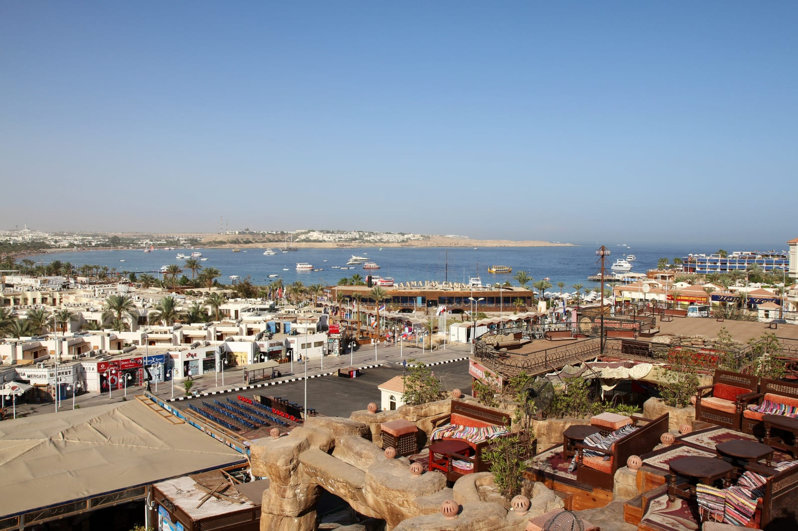
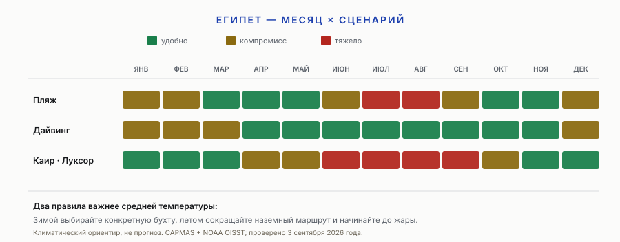
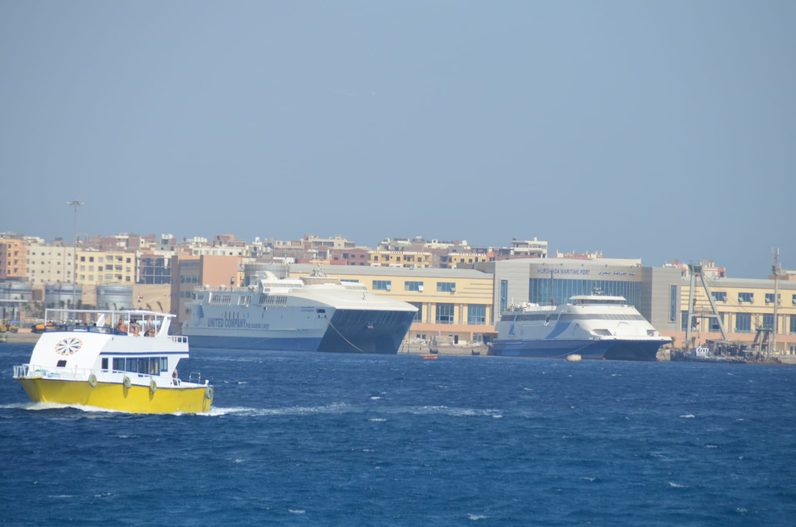
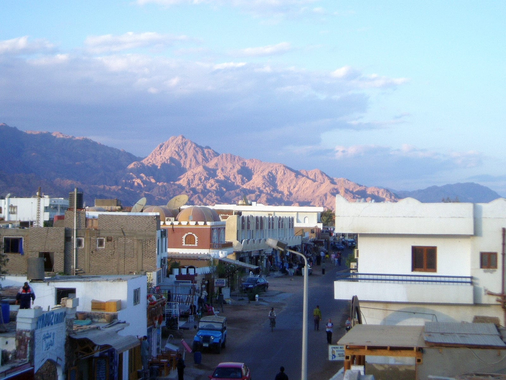
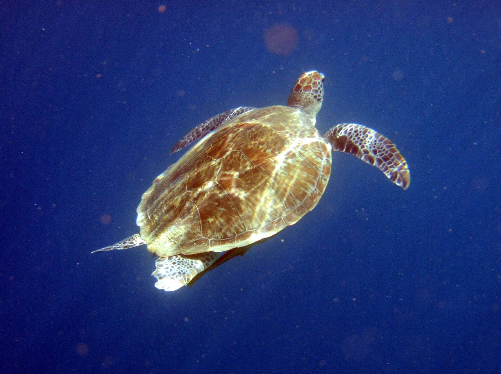
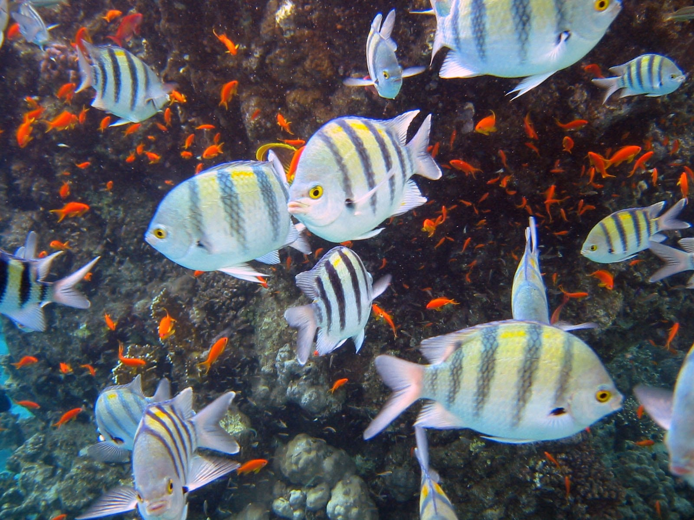
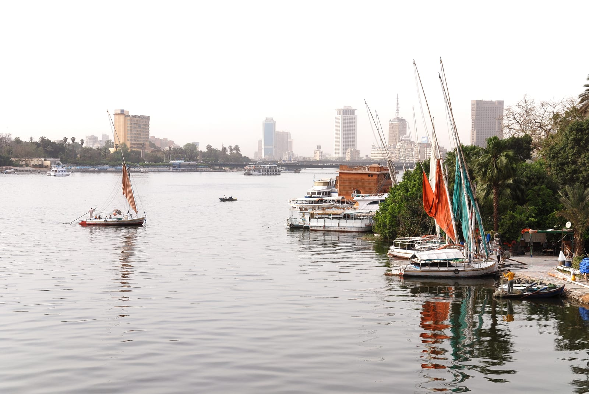
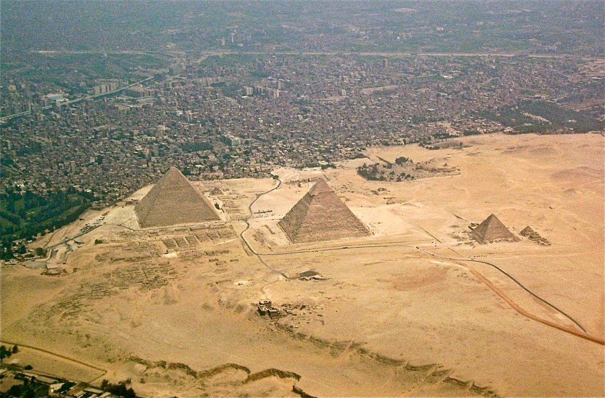
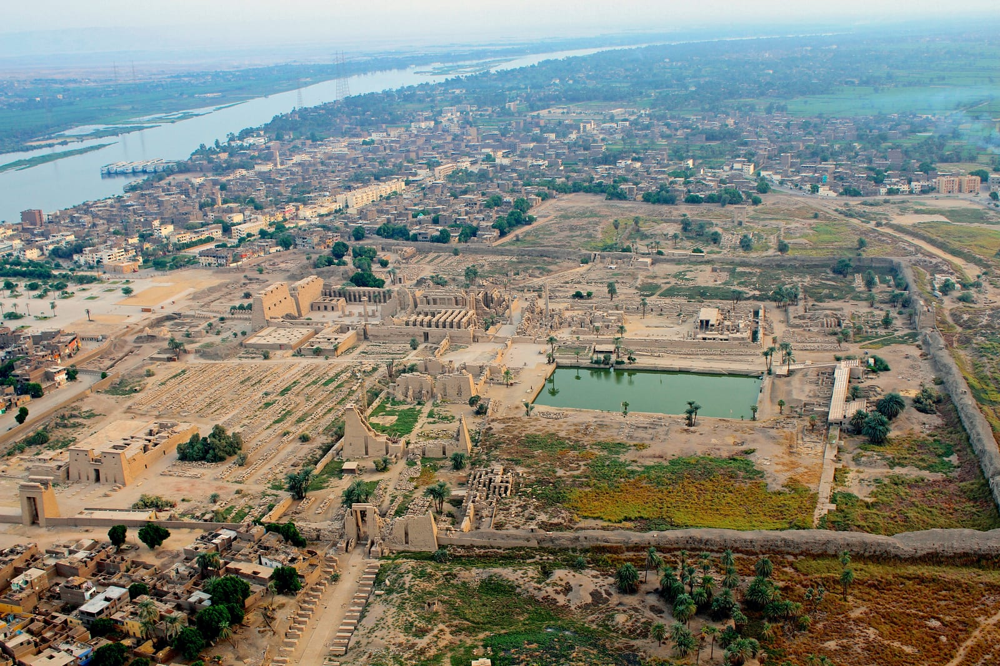
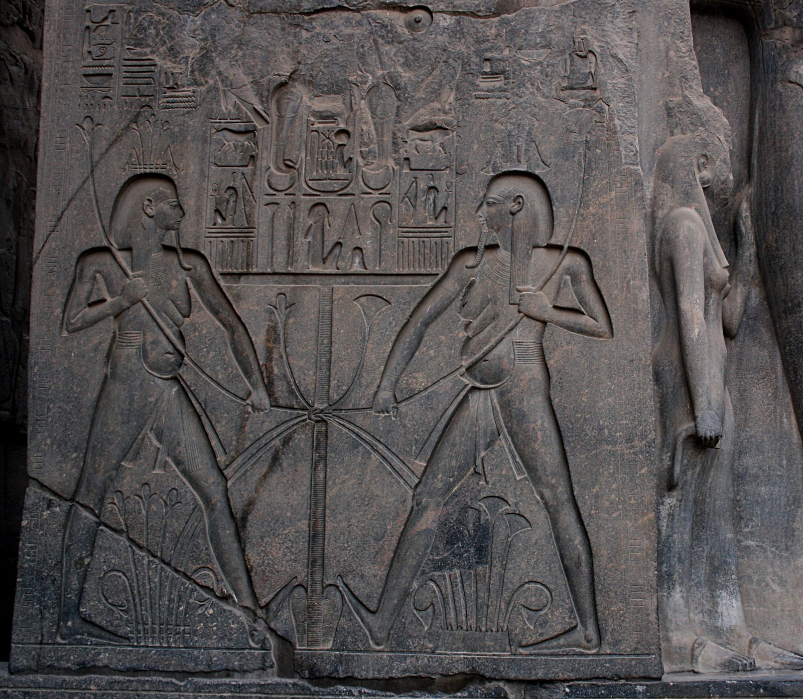

import AffiliateNote from '../../components/post/AffiliateNote.astro';
import CountryMap from '../../components/CountryMap.astro';
import { aviasalesRoute, cherehapaCountry, tpkDeep } from '../../data/affiliate.js';

export const flightsHurghada = aviasalesRoute('MOW', 'HRG', 'egypt_guide_2026_flights_hrg', 9);
export const insurance = cherehapaCountry('egypt', 'egypt_guide_2026_insurance');
export const tours = tpkDeep('travelata', 'https://travelata.ru/egypt', 'egypt_guide_2026_tours');

В Египте нет одного «лучшего месяца». В январе можно купаться, но ветер способен испортить пляжный день; в августе море почти не охлаждает, зато поездка в Луксор превращается в испытание жарой. Правильный выбор начинается не со средней температуры по стране, а с трёх вопросов: **пляж или экскурсии, Хургада или Шарм, какой именно берег у отеля**.

> **Если коротко:** для первого пляжного отпуска проще всего **октябрь–ноябрь** или **март–апрель**. Зимой ищите защищённую бухту в Шарм-эль-Шейхе и не считайте слово «Шарм» гарантией безветрия: открытый Набк заметно отличается от Хадабы или Наама-Бей. Для Луксора и Каира удобнее ноябрь–март. Июнь–август подходят тем, кто нормально переносит жару и не планирует длинные дневные экскурсии.

<AffiliateNote />

## Египет по месяцам: рабочая матрица

Матрица разделяет три разные задачи. «Пляж» означает не только возможность зайти в воду, но и комфорт после выхода из неё. «Под водой» учитывает тёплое море и длинный световой день. «Каир и Луксор» оценивает наземные прогулки, а не температуру у бассейна.

| Месяц | Воздух днём и ночью в Хургаде | Море у Хургады | Кому подходит | Главный компромисс |
|---|---:|---:|---|---|
| январь | 21 / 11 °C | 24 °C | экскурсии; пляж в защищённой бухте | ветер и прохладный вечер |
| февраль | 23 / 12 °C | 23 °C | Луксор, Каир, дайвинг в гидрокостюме | море у сезонного минимума |
| март | 25 / 14 °C | 23 °C | пляж + экскурсии | возможны ветреные и пыльные дни |
| апрель | 29 / 18 °C | 23 °C | лучший баланс для маршрута | вода ещё прохладнее, чем осенью |
| май | 33 / 22 °C | 25 °C | море, дайвинг, ранние экскурсии | днём жарко в глубине страны |
| июнь | 35 / 25 °C | 26 °C | спокойный отпуск у воды | Каир и Луксор тяжело проходить днём |
| июль | 36 / 27 °C | 28 °C | дайвинг и пляж с дневной паузой | постоянная жара, слабое ночное охлаждение |
| август | 36 / 26 °C | 29 °C | только если жара не мешает | самый тёплый воздух и вода |
| сентябрь | 34 / 24 °C | 28 °C | море и дайвинг | экскурсии ещё лучше начинать на рассвете |
| октябрь | 31 / 21 °C | 28 °C | пляж + Луксор, первая поездка | высокий спрос на удобные даты |
| ноябрь | 27 / 17 °C | 27 °C | универсальный месяц | вечером нужна лёгкая куртка |
| декабрь | 23 / 13 °C | 25 °C | экскурсии и зимнее солнце | ветер важнее средней температуры |

**Откуда цифры.** Воздух — округлённые средние максимумы и минимумы станции Хургады из официального климатического раздела CAPMAS. Море — расчёт TravelTribe по NOAA OISST v2.1: среднее по прибрежной ячейке 27,125° N, 33,875° E, недельная выборка ежедневных данных за 2021–2025 годы. Это климатический ориентир, а не прогноз температуры на пляже конкретного отеля.

### Зима: купаться можно, но выбирать надо бухту

Температура моря в январе–феврале остаётся пригодной для короткого плавания, однако ощущение после воды определяет ветер. В Хургаде длинное открытое побережье; в Шарме рельеф сложнее, и соседние районы могут дать разный пляжный день.

Для зимней поездки проверяйте не только курорт, но и точку на карте. **Хадаба, Рас-Умм-Сид и Наама-Бей** обычно дают больше шансов на защищённый берег. **Набк** открыт северному ветру: красивый риф не компенсирует красный флаг и длинный понтон. Формулировка «безветренный отель» в карточке продавца ничего не доказывает — нужны карта бухты и свежие отзывы именно за зимний месяц.

### Весна: широкий выбор, но не обещание штиля

Март и апрель удобны для связки пляжа с Каиром или Луксором. Днём тепло, а дорога по пустыне ещё не проходит в летнем пекле. Переходный сезон может принести сухой горячий ветер и пыль, поэтому невозвратную морскую экскурсию лучше не ставить на единственный свободный день.

В мае море заметно теплеет. Для пляжа это плюс, для длинных наземных выездов — сигнал сдвинуть начало на раннее утро.

### Лето: море тёплое, страна становится меньше

С июня по август пляжный отпуск возможен, но радиус поездки сокращается. В полдень комфортно в воде, под навесом или в помещении; прогулка по Карнаку, плато Гиза или улицам Каира требует раннего старта, воды и реального запаса сил.

Низкая витринная цена летом не означает выгодную поездку. Если из-за жары вы отказываетесь от половины маршрута, экономия покупает другой продукт — отель и море без насыщенной экскурсионной программы.

### Осень: самый понятный первый выбор

В сентябре вода ещё летняя, но воздух постепенно становится мягче. Октябрь и ноябрь дают лучший баланс моря и наземных поездок. Разница между ними практическая: в октябре теплее вечером, в ноябре легче выдержать Луксор и Каир.

## Хургада или Шарм: сначала пляж, потом звёзды

**Хургада** удобнее, если нужен песчаный вход, короткий трансфер к Луксору и большой выбор пакетных отелей. Но «Хургада» включает Макади-Бей, Сома-Бей, Сахл-Хашиш и сам город — пляжи и удалённость у них разные. Домашний риф чаще слабее, чем в Шарме, а хороший снорклинг требует лодки.

**Шарм-эль-Шейх** сильнее для рифа у берега и поездок на Синай. Цена преимущества — понтоны, глубина сразу за рифовой кромкой и пляжи, где ребёнку негде спокойно заходить в воду. Зимой район важнее звёздности отеля.

| Если важнее всего | Первый выбор | Что проверить до оплаты |
|---|---|---|
| песчаный вход с ребёнком | Хургада, Макади-Бей, Сома-Бей | реальную длину мелководья и отсутствие отлива до щиколотки |
| риф без лодки | Шарм, Хадаба или Рас-Умм-Сид | открыт ли понтон, глубину и течение |
| зимний пляж | защищённая бухта Шарма | ориентацию берега; не выбирать по слову «Шарм» |
| Луксор одной поездкой | Хургада и южные бухты | длительность трансфера от конкретного отеля |
| тихий отель вдали от города | Сома-Бей или Марса-Алам | расстояние до аэропорта, аптеки и прогулочной зоны |

Полное сравнение пляжей, районов и логистики вынесено в отдельный материал [Хургада или Шарм](/blog/hurghada-sharm-2026/). Дублировать его здесь нет смысла: для сезонного решения важно понять, что зимой Шарм не равен одной бухте, а семейный пляж нельзя выбирать по числу звёзд.

<a href={tours} class="aff-cta" rel="sponsored">Сравнить туры в Египет на свои даты</a> — сначала задайте месяц и город вылета, затем сверяйте бухту, пляж, рейс, багаж и отмену.

## Шесть сценариев поездки

| Сценарий | Срок и база | Как передвигаться | Главный минус |
|---|---|---|---|
| зимнее море без гонки | 7 дней, защищённая бухта Шарма | трансфер; машина не нужна | погода не гарантирует ежедневное купание |
| отпуск с ребёнком | 7–10 дней, Макади-Бей или Сома-Бей | трансфер и такси | хороший песок часто означает слабый домашний риф |
| рифы и дайвинг | 10 дней, Шарм + Дахаб | водитель или групповой трансфер | понтоны, течение и ограничения для новичков |
| море + Луксор | 10 дней, Хургада + 2 ночи в Луксоре | водитель или автобус; ночёвка лучше однодневной гонки | переезд съедает значительную часть двух дней |
| первая большая поездка | 14 дней, Каир + Луксор + Красное море | внутренний рейс или поезд и два трансфера | три базы делают поездку дороже и плотнее |
| тихое южное побережье | 10–14 дней, Марса-Алам | трансфер; машина редко оправдана | мало городской жизни, далеко до крупных экскурсий |

<CountryMap slug="egypt" countryNom="Египет" />

Арендовать машину ради обычной связки «аэропорт — отель — экскурсия» необязательно. Длинные пустынные дороги, посты и ночная езда добавляют риска, а на курорте автомобиль большую часть времени стоит. Для маршрута по Каиру и Луксору практичнее поезд, внутренний рейс или заранее выбранный водитель.

## Дахаб и Марса-Алам: не запасные версии Шарма

**Дахаб** подходит для длинной спокойной поездки, фридайвинга, дайвинга и ветровых видов спорта. Это не all inclusive без анимации, а город с набережной, дайв-центрами и более самостоятельным ритмом. Зимой ветер здесь не недостаток для кайтера, но проблема для человека, который хотел лежать у воды.

**Марса-Алам** выбирают ради южных рифов, черепах и удалённых бухт. Цена — длинный трансфер, меньше кафе и почти полная зависимость от отеля или дайв-центра. Для первой поездки без интереса к подводному миру Марса-Алам часто даёт меньше, чем Хургада или Шарм.

Официальное природоохранное ведомство Египта описывает Рас-Мохаммед как национальный парк на стыке Суэцкого залива и залива Акаба с коралловыми стенами, мангровым каналом, морскими черепахами и редкими видами. Это не декорация отеля: по кораллам нельзя ходить, животных нельзя трогать, а якорь и ласты разрушают то, ради чего сюда приехали.

## Каир и Луксор: считать не километры, а жару

Каир плохо работает как «быстрая экскурсия к пирамидам» с Красного моря. Плато Гиза — один пункт огромного города; дорога, пробки и сам Каир требуют отдельного времени. Если пирамиды входят в главную цель поездки, оставьте столице две ночи и не привязывайте её к единственному дню между рейсами.

Луксор ближе к Хургаде, но однодневный автобус всё равно означает выезд до рассвета и много часов дороги. Ночёвка меняет качество маршрута: Карнак можно пройти утром, Луксорский храм — вечером, а не собирать оба места в полуденный рывок.

Лучшее окно для наземного Египта — ноябрь–март. Апрель и октябрь ещё подходят при раннем старте. Летом сам памятник никуда не исчезает, но доступная человеку продолжительность прогулки резко сокращается.

## Документы: коротко и по официальному источнику

На официальном портале МВД Египта Россия входит в список стран, граждане которых могут оформить e-Visa. На 3 сентября 2026 года однократная туристическая e-Visa стоит **$30**, многократная — **$65**; паспорт должен быть действителен не менее шести месяцев с даты въезда. Портал просит подать заявление минимум за семь дней до поездки и взять распечатку с собой.

Правила меняются быстрее климата. Условия визы по прилёте, бесплатного Sinai Only и выезда с Синая проверяйте перед оплатой в отдельном [разборе визы в Египет](/visa/egypt/) и на домене `visa2egypt.gov.eg`. Посреднический сайт с похожим названием не является государственным порталом.

## Как сравнить пакет и самостоятельную поездку

Египет часто продаётся готовым пакетом, но тезис «пакет всегда дешевле» без одинаковых условий неверен. Сначала зафиксируйте даты, состав туристов, аэропорт, багаж, питание, трансфер и тип номера. Затем сравните полный пакет с суммой перелёта, жилья, трансферов и питания на тех же условиях.

Самостоятельная сборка особенно логична для Каира, Луксора и Дахаба. Пакет удобнее для недели в одном курортном отеле, если чартер, багаж и трансфер включены. Как витрина показывает продавца, скидку и условия отмены, разобрано в [замере Travelata](/blog/travelata-2026/) и в проверках [ANEX Tour](/blog/anex-tour-2026/) и [Библио-Глобуса](/blog/biblio-globus-2026/).

<a href={flightsHurghada} class="aff-cta" rel="sponsored">Проверить перелёт Москва — Хургада</a> — маршрут задан, месяц и точные даты выберите в форме.

Для дайвинга, фридайвинга, квадроцикла и других активностей недостаточно галочки «спорт»: риск должен быть прямо указан в программе полиса. Обычный пляжный полис и покрытие погружений — не одно и то же.

<a href={insurance} class="aff-cta" rel="sponsored">Сравнить страховки для Египта</a> — отдельно отметьте дайвинг, квадроцикл и другие запланированные активности.

Итоговая логика простая: **октябрь–ноябрь — самый понятный первый выбор, март–апрель — лучший баланс весной, зимой решает бухта, летом — переносимость жары**. После месяца выберите сценарий, затем конкретный пляж. Только после этого цена тура или отеля становится сопоставимой.

---

*Материал пересмотрен 3 сентября 2026 года. Воздух сверён по [официальному статистическому сборнику CAPMAS](https://www.censusinfo.capmas.gov.eg/Metadata-ar-v4.2/index.php/catalog/1342/download/4478). Температура моря рассчитана по [NOAA OISST v2.1](https://www.ncei.noaa.gov/products/optimum-interpolation-sst): прибрежная ячейка у Хургады, недельная выборка ежедневных данных за 2021–2025 годы. Сборы и требования e-Visa проверены на [портале МВД Египта](https://visa2egypt.gov.eg/eVisa/FAQ?lang=en), сведения о Рас-Мохаммеде — у [Egyptian Environmental Affairs Agency](https://www.eeaa.gov.eg/Topics/85/36/65/Details). Личный опыт автора по Египту не заявлен.*

*Фото Шарма, Хургады, Дахаба, Каира, Карнака, Луксорского храма, пирамид, рифа и морской черепахи: Wikimedia Commons; авторы и лицензии указаны в данных изображений.*
