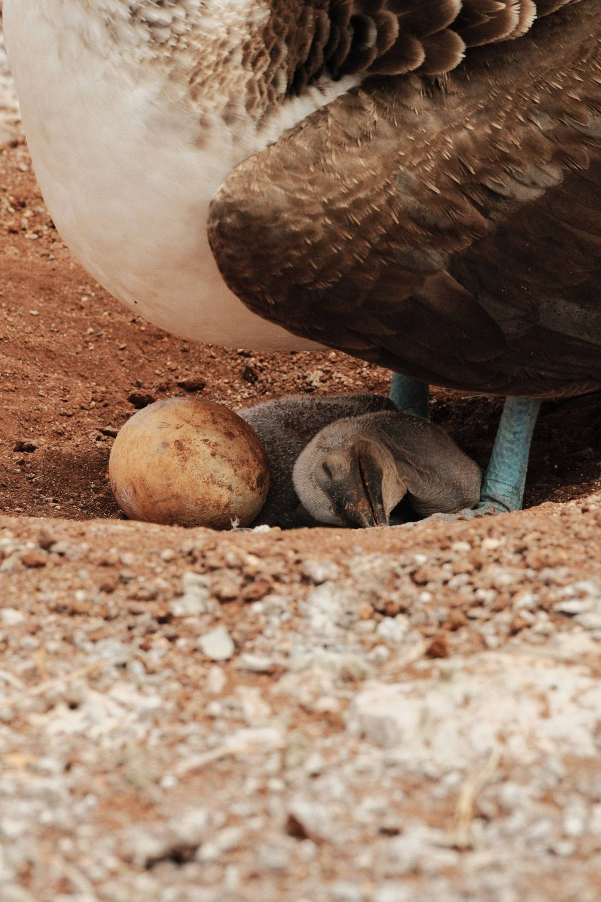
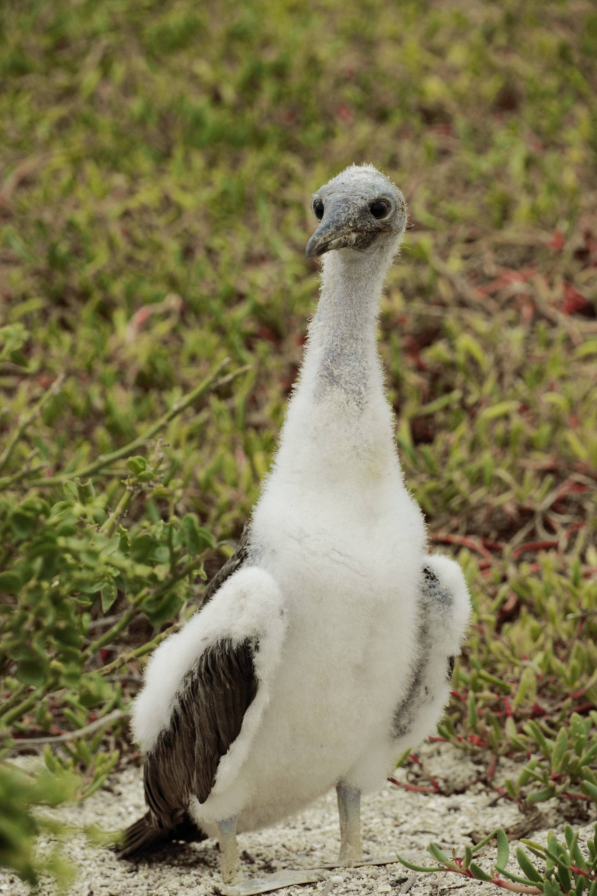
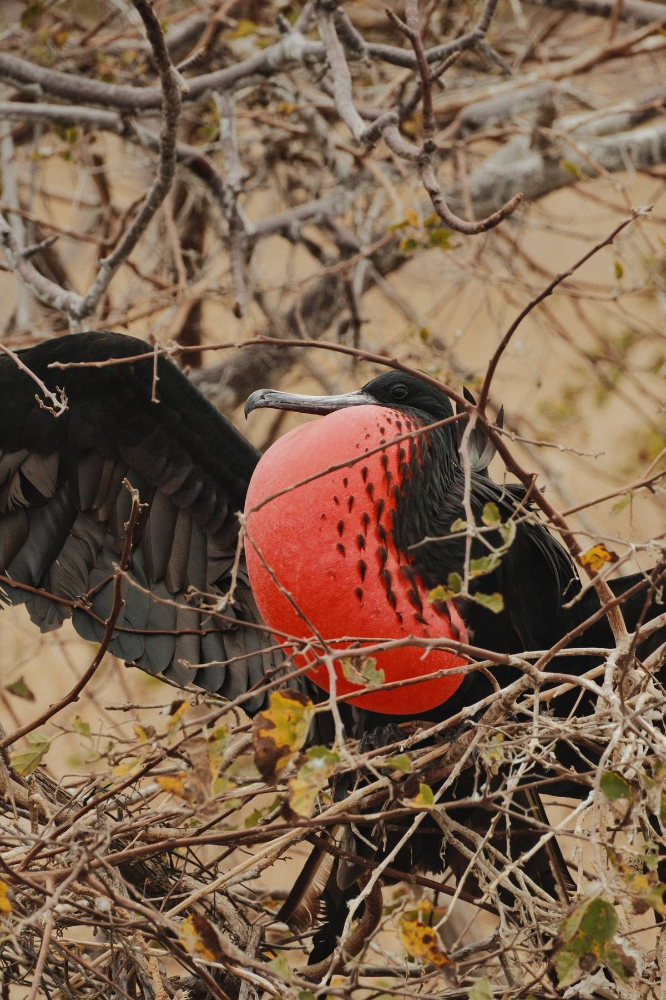
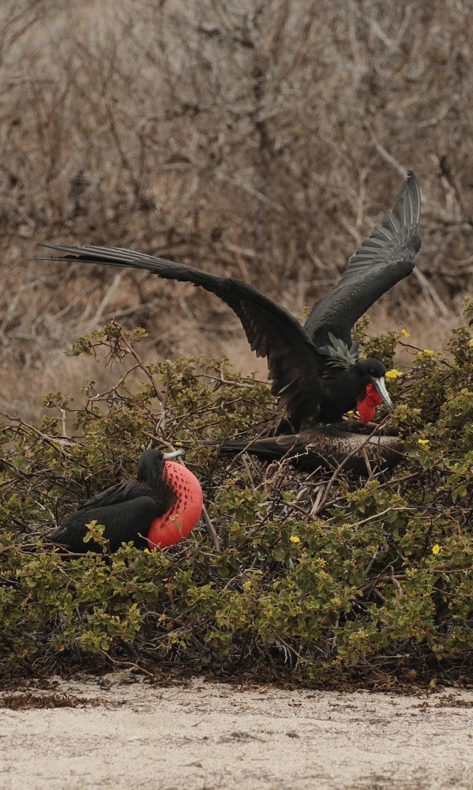
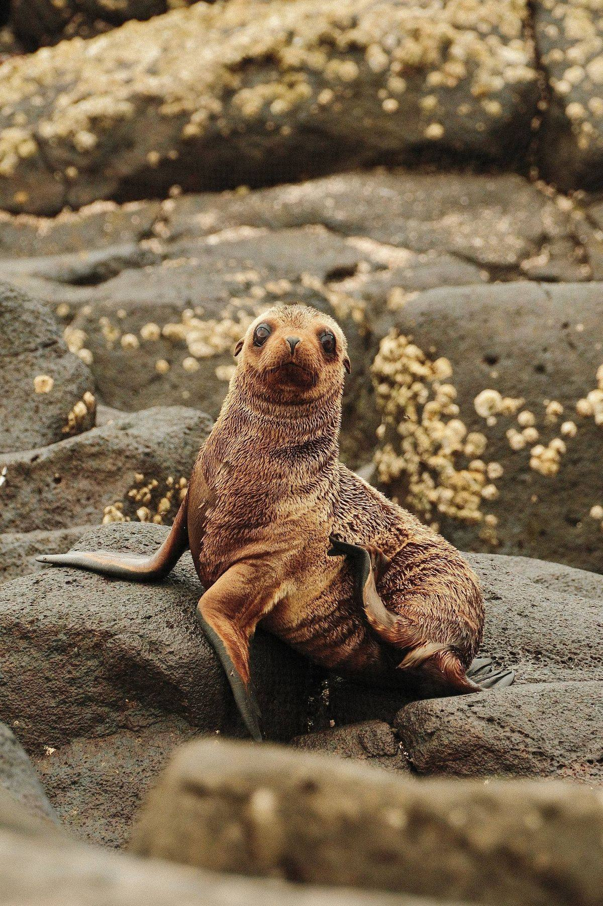

Я стою на тропе в полутора метрах от спящей олуши, и в этот момент к ней с боку, очень буднично, прыгает небольшая коричневая птичка. Долбит клювом у основания крыла. Тонкой струйкой течёт кровь. Олуша даже не просыпается. Я тупо смотрю на видоискатель и не сразу понимаю, что это не фантазия — это **остроклювый вьюрок-«вампир»**, и он сейчас при мне завтракает чужой кровью. Это его официальный рацион. Гид рядом шёпотом: «Continue, please». Я продолжаю снимать. **Это и есть Галапагосы. Не «природный парк», а лаборатория, в которой эволюция до сих пор работает в прямом эфире.**

> **Если коротко:** 1000 км от материка, **80%** сухопутных птиц и **97% рептилий** — эндемики. Россиянам **виза не нужна** (90 дней безвиз в Эквадор). Вход в нацпарк — **$200** для иностранцев, INGALA-карта — **$20**. Бюджет 8–10 дней без перелёта из Москвы — от **$3000** (island-hopping эконом) до **$9000+** (премиум-круиз).

> **Когда лучше ехать на Галапагосы:** [таблица сезонов](/seasons/) — два режима. Тёплый влажный (декабрь–май): тёплая вода +25°C, спокойный океан, фламинго. Холодный сухой (июнь–ноябрь): холодное течение Кромвелла, +18°C в воде, киты, активные пингвины.

Дальше — что я выяснил за неделю на островах: куда лететь, как устроен вход в нацпарк, чем круиз отличается от island-hopping, реальные цены и шесть встреч, ради которых имеет смысл лететь полутра суток в одну сторону.

---

## Что вообще такое Галапагосы и почему это не «отпуск»

Архипелаг из 19 крупных островов и сотни мелких, в **1000 км от Эквадора** в Тихом океане, прямо на экваторе. Принадлежат Эквадору, статус — **национальный парк** (с 1959) + **объект ЮНЕСКО** (с 1978). 97% территории — заповедник, жить можно только на четырёх населённых: Санта-Крус (главный), Сан-Кристобаль, Изабела и Флореана.

Главное, что нужно понять до поездки: **это не пляжный отдых**. Океан вокруг — холодное Перуанское течение и течение Кромвелла, вода летом +18 °C. Снорклинг — в гидрокостюме. Пляжи — есть, но это бонус, а не цель. Цель — увидеть, как природа развивалась 5 миллионов лет в полной изоляции.

Никаких наземных млекопитающих, кроме завезённых людьми. Зато 19 островов = **19 отдельных «лабораторий»**: на каждом свой вьюрок, своя игуана, свои черепахи. Дарвин в 1835 году именно на этом и собрал материал для «Происхождения видов».

И главная фишка, ради которой сюда едут: **животные не боятся человека**. Хищников у них нет (кроме завезённых крыс и одичавших коз — с ними борются), поэтому нет гена страха. Фотосессия 30 см от объекта — норма. Гид только следит, чтобы ты не сходил с тропы и не трогал зверей руками.

---

## Шесть встреч в радиусе вытянутой руки

Это не «топ-10 must-see». Это конкретно то, что я видел сам, обычно в полутора-двух метрах. Без зума.

### 🦶 Голубоногая олуша (blue-footed booby)

Танцует прямо на тропе. Поднимает по очереди две неоново-бирюзовые лапы — будто говорит самке: «Смотри, сколько у меня каротиноидов, выбирай меня». Самка кивает, пара пристраивается, через два месяца на песке у тропы лежит белый шипящий шар — птенец, который орёт на тебя с расстояния 30 см и не понимает, что ты больше его в сорок раз.

Фишка с цветом лап: чем ярче бирюза, тем здоровее самец. Это прямой биомаркер питания — каротиноиды берутся из свежей рыбы. Голодает несколько недель — лапы тускнеют. Самки это видят и делают вывод. Так что да, на Галапагосах эволюция реально продолжает работать у тебя на глазах.

### 🤍 Назка-олуша (Nazca booby)

Чисто белая, с чёрным «рисунком» на крыльях, оранжево-серый клюв. Гнездятся плотными колониями на скальных обрывах. У пары обычно два яйца, но второе — это «страховка»: первый вылупившийся птенец просто выталкивает второго из гнезда. Родители смотрят и не вмешиваются. Это называется **siblicide**, и для назки это норма, не сбой.

Стоял в двух метрах от взрослой назки, она надула красный мешок на горле и сделала громкий хлопок — как будто пробку от шампанского выстрелили. 8 литров воздуха за 0,8 секунды. Звук такой, что у меня сердце ёкнуло. На птицу это произвело ровно ноль впечатления.

### 🩸 Великолепный фрегат (magnificent frigatebird)

Главная звезда брачного сезона. Самец надувает огромный ярко-красный горловой мешок размером с воздушный шарик, лежит на ветках и ждёт самку. Сидит с надутым мешком часами. Если самке нравится — садится рядом, начинается сложная пляска с трясением головой и расправленными крыльями.

Их же фишка — **клептопаразитизм**: фрегат сам ныряет плохо, зато великолепно отбирает рыбу у других птиц прямо в воздухе. Атакует в полёте, бьёт клювом, заставляет жертву отрыгнуть рыбу — и подхватывает её, не приземляясь. Назвать это «грабежом» язык не поворачивается, потому что 50 миллионов лет эволюции — это уже не преступление, это профессия.

### ✈️ Краснохвостый фаэтон

Пролетел над головой с двухметровым алым «шлейфом» из хвоста. Сел на скалу, а хвост ещё секунду висел в воздухе как лента. Через минуту взлетел, нашёл в воздухе своего птенца и **в полёте на 70 км/ч передал ему 22-сантиметровую рыбу прямо в клюв**. Без тормозов, без подлёта. Я даже сначала не понял, что это было — выглядит как трюк, который пять раз отрепетировали.

### 🩻 Вьюрок-«вампир»

Тот самый, с которого начался пост. Эндемик одного-двух северных островов (Вулф, Дарвин). На большой земле его еды просто нет — он ест кровь морских птиц, в основном олуш и альбатросов. Прыгает, долбит клювом у основания крыла, кровь течёт 40–80 секунд, он пьёт. Жертва в это время спит или равнодушно смотрит вдаль.

Эта штука эволюционировала из обычного зерноядного вьюрка примерно за 500 тысяч лет. На островах не было нормальной пресной воды — а в крови соседей жидкости много. Природа просто открыла бизнес-модель.

### 🐧 Галапагосский пингвин

Единственный пингвин на экваторе. Ныряет рядом с тобой при +18 °C в воде. **36 км/ч под водой**, в смокинге и с паническими глазами. Ловит в основном анчоусов и сардин — те поднимаются вместе с холодным течением Кромвелла. Когда приходит Эль-Ниньо и течение слабеет, пингвинам становится плохо: рыбы нет, и популяция падает на 60–70%. После двух подряд Эль-Ниньо в 1982 и 1997 годах их осталось около 1500 особей. Сейчас — порядка 2000.

### 🦅 Канюк (Galapagos hawk) — круг замкнулся

Я снимал ту самую колонию олуш, когда сверху беззвучно сел канюк. В трёх метрах от меня. Подождал минуту, пока родители-олуши отвернутся. Сел рядом с гнездом, схватил клювом только что вылупившегося птенца и улетел завтракать. Родители просто смотрели вслед. Никто не кричал, никто не атаковал. Канюк здесь — единственный наземный хищник, и он часть системы. Экосистема замкнулась прямо у меня в видоискателе.

### 🦭 Бонус: морской лев (Galapagos sea lion)

Они везде. На пирсах, на лавочках в посёлке Пуэрто-Айора, на песке, на ступеньках кафе. Молодые особи приходят к снорклерам и смотрят прямо в маску, иногда делают круг вокруг тебя. Крупные самцы лежат на тропе и не сдвигаются — обходишь по дуге. Местные с ними соседствуют так же, как мы с голубями, только ленивее.

---

## Когда ехать: два режима, нет «плохого» сезона

Главное про Галапагосы: **плохого сезона нет**. Есть два разных по характеру, и выбирать надо под цель.

| Сезон | Месяцы | Воздух | Вода | Что хорошо | Что хуже |
|---|---|---|---|---|---|
| Тёплый влажный | дек–май | +28–30 °C | +24–26 °C | Спокойный океан, видимость для снорклинга, активный размножение фрегатов и олуш, фламинго, цветение | Короткие тропические ливни во второй половине дня |
| Холодный сухой | июн–ноя | +22–24 °C | +18–20 °C | Активные пингвины, киты у западных островов, миграции, меньше дождей | Холодная вода, нужен гидрокостюм, океан более бурный |

Для меня лучший компромисс — **апрель и май**: вода ещё тёплая, дожди уже стихают, у фрегатов и голубоногих олуш разгар брачного сезона, а туристов меньше, чем в высокий январь–март.

Кому критичны пингвины и киты — июль–сентябрь. Кому критична тёплая вода и снорклинг — февраль–март, но это пик цен (новогодние и пасхальные брони).

---

## Cruise vs island-hopping: что выбрать

Два формата поездки. Выбор не «лучше/хуже», а **что важнее: эксклюзив или гибкость**.

| Формат | Длительность | Цена $/чел | Кому подходит |
|---|---|---|---|
| **Круиз** на яхте 14–20 пассажиров | 4–8 ночей | $1500–7000+ | Хочется максимум удалённых островов (Геновеса, Фернандина, Эспаньола), не жалко денег, не страдаешь морской болезнью |
| **Island-hopping** с базой на Санта-Крус/Сан-Кристобаль | 5–10 ночей | $1500–4000 | Бюджет средний, нужна гибкость, нормально жить в посёлке и каждый день уплывать на daily tour |
| Combo: 4 ночи land + 4 ночи cruise | 8–10 ночей | $4000–6000 | Хочется и того и другого, и ты в Эквадоре впервые |

Я делал **island-hopping с базой в Пуэрто-Айора** на Санта-Крус. Каждый день — daily tour на соседний остров (Северная Сеймур, Бартоломе, Санта-Фе, Плаза-Сур). Стоит $150–250 за день, включая лодку, гида и обед. Плюс две ночёвки на Сан-Кристобаль для разнообразия.

Что я в этом потерял: не увидел Геновесу (только круизы) и западные вулканические Изабелу/Фернандину (только круизы 7+ ночей). Что приобрёл: вечерами я был на земле, в нормальном кафе с приличным wi-fi, и не страдал от качки.

Если ехать ради максимума экзотики и денег нет ограничений — берите **круиз 7 ночей first-class или luxury**. Это другой уровень доступа к островам.

---

## Виза, рейсы, вход в нацпарк

### Виза для россиян

**Не нужна**. Эквадор — безвиз 90 дней при наличии загранпаспорта со сроком действия не менее 6 месяцев. На границе спросят обратный билет и подтверждение брони отеля, иногда — подтверждение средств (оборотная карта обычно достаточно). По прилёту в Кито или Гуаякиль ставят штамп.

### Как туда лететь

Прямых рейсов из Москвы в Эквадор нет. Рабочие маршруты:

- **Через Стамбул** (Turkish Airlines) → Богота → Кито/Гуаякиль. ~28–32 часа в одну сторону, $1500–2200 round trip.
- **Через Мадрид** (Iberia/Air Europa) → Кито/Гуаякиль. ~22–26 часов, $1700–2500.
- **Через Амстердам** (KLM) → Гуаякиль. ~24 часа, $1800–2500.

Я летел Turkish + Avianca. Стамбул — Богота — Гуаякиль. На обратном пути в Боготе была пересадка 9 часов, успел съездить в город (виза в Колумбию для россиян тоже не нужна, безвиз 90 дней).

### Внутренний рейс на острова

Есть **только из Кито (UIO) или Гуаякиля (GYE)**. Из Кито дольше (с дозаправкой в Гуаякиле). Прилёт — два аэропорта:

- **Балтра (GPS)** — основной, 5 минут паромом до Санта-Крус, оттуда автобус или такси. Отсюда удобно для cruise и island-hopping.
- **Сан-Кристобаль (SCY)** — северо-восточный, удобно если базируешься на Сан-Кристобале.

Авиакомпании: LATAM, Avianca, Aeroregional. Цена round trip — **$350–500** в эконом-классе. Брать обязательно с багажом — на островах одежду и снаряжение не купить.

### INGALA Transit Card (TCT)

Обязательная карта въезда. Стоимость — **$20**. Раньше покупалась в аэропорту материка перед вылетом. **С 29 мая 2025 — только онлайн** через [официальный портал INGALA](https://tct.ingala.gob.ec/), за 24 часа до вылета. Распечатка или PDF на телефоне. Без неё на рейс не пустят.

### Вход в нацпарк

При прилёте на Балтру или Сан-Кристобаль — стойка нацпарка. Платишь **$200 наличными** (карты часто не работают). С 1 августа 2024 года цена удвоилась со $100 — это решение администрации Эквадора, деньги идут на консервацию. Дети до 12 лет — $100. Эквадорцы — $30.

В сумме обязательные платежи на острова: **$220 на человека сверх перелёта**.

### Прививки и здоровье

Обязательных нет. Рекомендуется жёлтая лихорадка (если едешь дальше в Амазонию) и стандартный набор (гепатит А, столбняк). Воду из-под крана не пить нигде в Эквадоре, включая острова — только бутилированная. Москиты есть, но малярии на Галапагосах нет.

---

## Бюджет 2026: на что закладываться

Расчёт на одного человека, **без международного перелёта** Москва — Гуаякиль (он ещё $1500–2500). Длительность поездки — 8–10 дней, из них 5–7 на островах.

| Статья | Эконом (island-hopping) | Комфорт (mid-cruise) | Премиум (luxury cruise) |
|---|---|---|---|
| Внутр. перелёт UIO/GYE → GPS | $350–450 | $400–500 | $450–550 |
| Парк-фи + INGALA | $220 | $220 | $220 |
| Жильё (5–7 ночей) | $300–600 (хостелы/гестхаусы Санта-Крус) | включено в круиз | включено в круиз |
| Daily tours (5–7 дней) | $750–1500 ($150–250/день) | включено | включено |
| Круиз tourist superior 5–7 ночей | — | $3500–5500 | — |
| Круиз luxury 7 ночей | — | — | $7500–12000 |
| Еда (помимо туров) | $200–350 | $50 (несколько обедов на берегу) | $50 |
| Снорклинг-снаряжение | $50 (своё) или $40 (аренда) | включено | включено |
| Сувениры, кофе, такси | $100–200 | $100 | $200 |
| **Итого на островах** | **$2000–3300** | **$4300–6400** | **$8500–13000** |
| **+ материк (1–2 дня в Кито/Гуаякиле)** | $150–300 | $200–400 | $300–500 |
| **С учётом международного перелёта** | **$3700–6000** | **$6000–9000** | **$10500–16000** |

Реально на чём можно сэкономить:
- Снаряжение для снорклинга — везти своё. Аренда на острове $40 за неделю, своё за два года окупится.
- Дешёвые daily tours существуют (Las Tintoreras, Tortuga Bay — $0, добраться самостоятельно). Не все хорошие туры стоят $250.
- Еда в местных кафе на Санта-Крус: обед с супом и горячим — $5–8. Туристические рестораны на набережной — $25–40.

На чём **не экономить**:
- Гид. Без лицензированного гида не пускают на 80% локаций. Дешёвые «туры» без гида — это туры по двум публичным пляжам и обратно.
- Daily tours с морскими частями — Северная Сеймур, Бартоломе. Если приехал на острова и не съездил хотя бы на 2-3 серьёзных тура — лучше было сэкономить весь бюджет и не лететь вообще.

---

## Что меня удивило и что бесило

### Что удивило

- **Толпы — не такая проблема, как думал.** Парк жёстко лимитирует посещения: на каждом острове и точке свой квота-лист. На локациях обычно 12–30 человек на лодку, и групп больше двух одновременно не бывает. По сравнению с Бали или Камбоджей — это пустыня.
- **Гиды реально знают свою тему.** Локальная сертификация требует биологического образования. Мой гид мог 20 минут рассказывать про эволюцию клюва вьюрка под конкретным камнем. Это не «работа за чаевые», это работа за интерес.
- **Wi-Fi есть.** В Пуэрто-Айора нормальный, в кафе работает, можно отправлять фото. На круизах — спутниковый, но дорогой и медленный.

### Что бесило

- **Перелёт.** Реально 28–36 часов в одну сторону с двумя пересадками. Не «слетать на выходные».
- **Налом за всё.** Парк-фи — $200 cash, INGALA — $20 cash, такси — cash, daily tours часто cash. Я взял $1000 наличными и почти всё ушло в первые 4 дня. Везите запас.
- **Жара днём + холодная вода.** Парадокс экватора с холодным течением. Снорклинг в +18 °C без гидрокостюма для меня лично — пытка. Брать минимум shorty 2 мм.
- **Меню в кафе на берегу скучное.** Курица-рис-морепродукты, и так каждый день. На круизах кормят разнообразнее. Если едешь island-hopping и любишь поесть — готовься к гастрономическому однообразию.

---

## ❓ FAQ

### Когда ехать на Галапагосы в 2026?

Универсального ответа нет. **Апрель–май и октябрь–ноябрь** — лучший компромисс: цены ниже пика, погода в обоих режимах разумная, толпы меньше. Зимой (январь–март) — тёплая вода и пик размножения, но и пик цен. Летом (июль–сентябрь) — киты и пингвины, но холодная вода и более бурный океан.

### Сколько стоит поездка из Москвы в 2026?

Минимум — около **$3500–4000** на человека (международный перелёт ~$1500 + island-hopping эконом). Комфортный уровень с круизом 5 ночей tourist superior — **$6000–9000**. Премиум-круиз 7 ночей luxury — от **$10500**. Это всё на одного.

### Нужна ли виза в Эквадор для россиян?

**Нет.** Безвизовый въезд до 90 дней при наличии загранпаспорта со сроком действия от 6 месяцев. На границе попросят обратный билет и подтверждение брони. На сами Галапагосы из Эквадора виза не нужна — достаточно [INGALA Transit Card за $20](https://tct.ingala.gob.ec/) и парк-фи $200.

### Можно ли поехать без круиза и сэкономить?

**Можно.** Island-hopping с базой на Санта-Крус и Сан-Кристобаль работает отлично, daily tours покрывают 70% самых интересных локаций. Что вы пропустите — самые удалённые острова (Геновеса, Фернандина), для них нужен круиз минимум 5 ночей. Если первый раз и бюджет ограничен — спокойно берите island-hopping.

### Опасно ли это?

Для людей — нет. Преступности почти нет, медицина базовая, но есть. Главные риски — морская болезнь на лодках (берите таблетки), солнечный ожог (экватор + отражение от воды + ветер = обгораешь незаметно) и пищевые отравления (только бутилированная вода). Для природы опасны вы — поэтому правила парка строгие, не нарушайте.

### Нужно ли знать испанский?

Нет. В туристической инфраструктуре английского достаточно: гиды, отели, рестораны на набережной. С таксистами и в локальных кафе пригодится Google Translate, но это не блокер. Я с тремя фразами испанского справился.

### Можно ли добраться без пересадки?

**Нельзя.** Прямого рейса Москва — Эквадор нет. Минимум одна пересадка (Стамбул, Мадрид, Амстердам, Париж). Из Боготы или Лимы есть рейсы с одной пересадкой через Avianca/LATAM, если хочется совместить с другой страной Южной Америки.

---

## Что делать дальше

- Сверьте даты с [таблицей сезонов](/seasons/) — на Галапагосы любой месяц рабочий, но «лучший лично для тебя» зависит от того, ради чего летишь.
- Прикиньте полный бюджет на [калькуляторе путешествия](/calculator/) — там учитываются актуальные цены на перелёт из Москвы и курс валют.
- Если интересна Южная Америка целиком — почитайте [мой отчёт об Антарктическом круизе из Ушуаи](/blog/antarctica-cruise-2026/), маршрут через Аргентину и Чили хорошо стыкуется с Эквадором.
- Для тех, кто думает про дальние сафари — [Уганда: гориллы Бвинди и сафари](/blog/uganda-safari-2026/), эмоционально близкий формат «дикая природа в радиусе вытянутой руки».
- В Telegram-канале [@traveltriberu](https://t.me/traveltriberu) — фото и заметки с поездок в реальном времени, без причёсанной редактуры.

---

*Актуально на: 8 мая 2026. Цены на нацпарк, INGALA и daily tours — по официальному сайту [Galapagos National Park](https://galapagos.gob.ec/) и порталу INGALA. Курсы валют — по ЦБ РФ. Личный опыт — поездка 2025 года, остановка на Санта-Крус и Сан-Кристобаль, daily tours на Северную Сеймур, Бартоломе, Эспаньолу и Плаза-Сур.*
