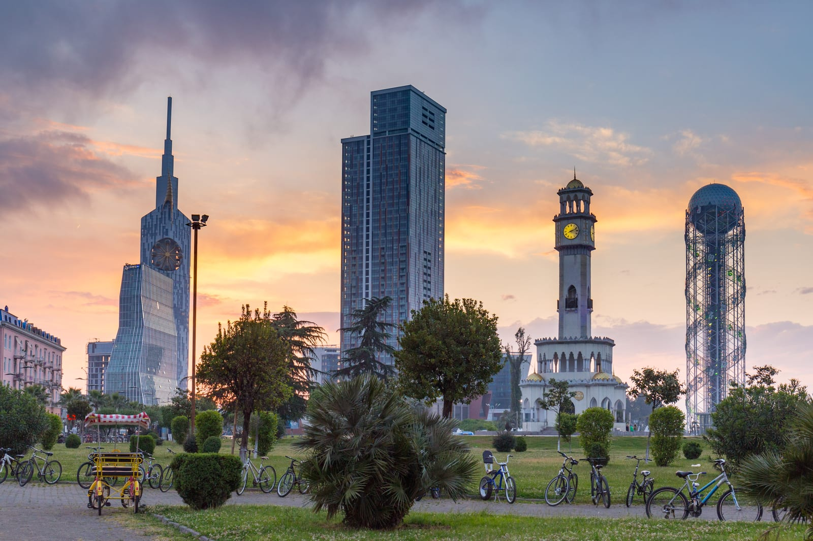
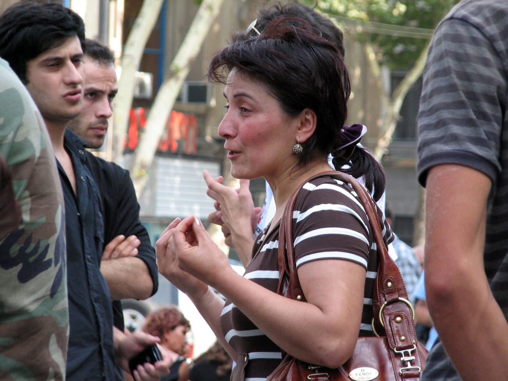
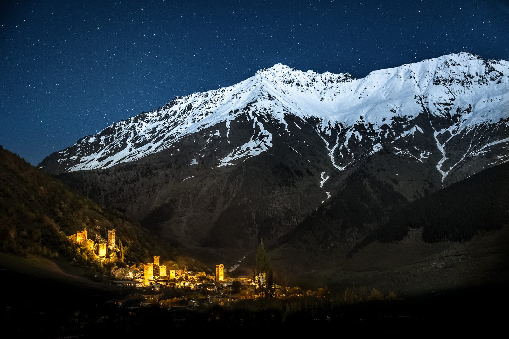
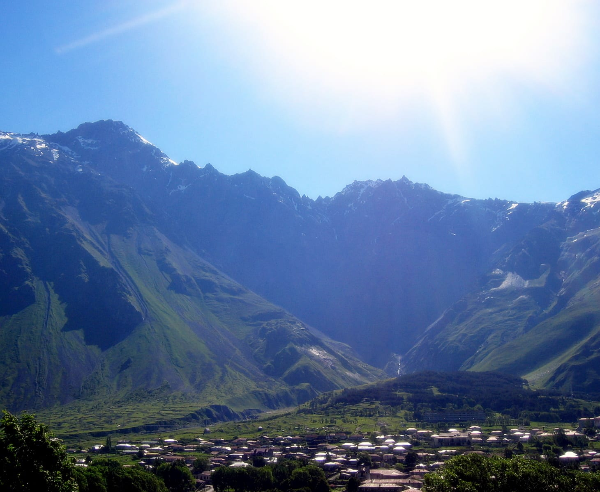

import PricingCards from '../../components/post/PricingCards.astro';
import FlightRoutes from '../../components/post/FlightRoutes.astro';
import AffiliateNote from '../../components/post/AffiliateNote.astro';
import LivePrice from '../../components/post/LivePrice.astro';
import LivePriceTable from '../../components/post/LivePriceTable.astro';
import pricesCache from '../../data/prices-cache.json';

{/* Один источник правды по цене на всю статью. Раньше «28 500 ₽» стояло в пяти
    местах руками и разъехалось с выгрузкой: настоящий минимум 24 364 ₽. */}
export const tbsMonths = Object.entries(pricesCache.prices.TBS ?? {}).filter(([, v]) => v > 0);
export const tbsMin = tbsMonths.length ? Math.min(...tbsMonths.map(([, v]) => v)) : null;
export const tbsNear = tbsMonths.length ? tbsMonths[0][1] : null;
export const rub = (n) => n.toLocaleString('ru-RU') + ' ₽';
export const tbsCheapKey = tbsMonths.length ? tbsMonths.reduce((a, b) => (b[1] < a[1] ? b : a))[0] : null;
export const tbsCheapMonth = tbsCheapKey ? ['январь','февраль','март','апрель','май','июнь','июль','август','сентябрь','октябрь','ноябрь','декабрь'][Number(tbsCheapKey.slice(5,7))-1] + ' ' + tbsCheapKey.slice(0,4) : '';
import { TP_LINKS, aviasalesRoute, cherehapaCountry, ostrovokCity, drimsimSub } from '../../data/affiliate.js';

В Тбилиси я был сам — это один из тех городов, где старый балкон, серные бани и хинкальная во дворе соседствуют с современными барами, и куда хочется вернуться. В 2026 Грузия для россиян — самое простое направление по входному порогу: безвиз 365 дней, прямой Москва-Тбилиси 2 ч 40 мин, нет языкового барьера, а море (Батуми, 380 км от Тбилиси), горы (Казбек 5033 м) и вино (Кахетия) — в одной стране. Но с января появилось одно новое жёсткое условие, без которого на границе развернут. Разбираем по порядку.

> **Если коротко:** россиянам **виза в Грузию не нужна**, находиться можно **до 365 дней** подряд с момента въезда, обнуляется любым выездом — без ограничений по числу раз. **С 1 января 2026 обязательна медицинская страховка** (мин. покрытие 30 000 лари ≈ 969 000 ₽) — без неё не посадят на рейс. Прямой рейс **Москва-Тбилиси 2 ч 40 мин**, билет <LivePrice iata="TBS" />. **Карты Visa/Mastercard и МИР РФ не работают** — нужны наличные + иностранная виртуальная карта (<a href="https://platipomiru.com/?utm_source=traveltribe&utm_medium=cpa" class="aff-cta" rel="sponsored">Выпустить виртуальную карту</a>) для броней. Бюджет на двоих 7 дней — **$700–1400** (≈58–116 тыс. ₽) комфорт, от $350 (≈29 тыс. ₽) бэкпекер. Лучшие месяцы — **май–июнь и сентябрь–октябрь**.

<AffiliateNote />

---

## Нужна ли виза в Грузию россиянам в 2026?

**Нет, виза не нужна.** Граждане России въезжают в Грузию по безвизовому режиму и могут находиться в стране **до 365 дней подряд** с момента въезда — это один из самых длинных безвизовых сроков в мире для россиян.

Ключевые условия:

- Срок пребывания — **до 1 года за один въезд**, для туризма, гостевых и деловых поездок
- Загранпаспорт, действующий **на весь период поездки**
- С 2026 — **обязательная медстраховка** (подробно в следующем разделе)
- На паспортном контроле могут спросить цель и срок поездки — отвечать спокойно: туризм; полезно иметь при себе бронь жилья и обратный билет

У меня в Тбилиси прошёл за 7 минут, очереди не было в будний день. Дополнительных приглашений, ваучеров или подтверждения средств официально не требуется, но пограничник вправе задать уточняющие вопросы про цель и срок поездки.

---

## Пустят ли в Грузию с абхазским штампом в паспорте?

**Штамп о въезде в Абхазию со стороны России Грузия считает нарушением своего законодательства.** Для Тбилиси Абхазия — собственная территория, а въезд туда через российскую границу означает, что человек прошёл мимо грузинского пограничного контроля. Отметка в загранпаспорте превращает это из предположения в документ.

Чем это грозит на практике: вопросы на паспортном контроле, в худшем случае отказ во въезде. Гарантии, что развернут, нет, но нет и гарантии, что не заметят.

**Как не создавать себе проблему.** В Абхазию россияне ездят по внутреннему паспорту РФ, и тогда штамп не появляется: во внутренний паспорт на той границе ничего не ставят. Порядок разобран отдельно — [нужен ли загранпаспорт в Абхазию](/blog/zagranpasport-v-abhaziyu-2026/).

Если штамп уже стоит, честный ответ такой: новый паспорт убирает отметку, но не отменяет сам факт поездки. Правило Грузии написано про въезд, а не про чернила в документе. Решать, что с этим делать, вам, но рассчитывать на «в новом паспорте чисто, значит вопрос закрыт» не стоит.

---

## Что обязательно для въезда в Грузию в 2026?

**С 1 января 2026 года для въезда обязательна медицинская страховка** (по данным [МВД Грузии](https://police.ge/) и [Посольства Грузии (Секция при Посольстве Швейцарии)](https://www.eda.admin.ch/), актуально на май 2026). Это главное изменение года: турист без действующего полиса рискует **тем, что его не посадят на рейс**: полис проверяют авиакомпании при регистрации. Штраф в 300 лари называют СМИ и страховые, но в самом постановлении санкций нет — [разбираю текст документа отдельно](/blog/georgia-insurance-2026/).

Требования к полису:

- **Минимальное покрытие — 30 000 лари** (примерно 969 000 ₽ по курсу ЦБ на 15 августа 2026) — по требованию МВД Грузии к полису с 2026
- Действует **весь срок поездки** (дата въезда → дата выезда)
- Покрывает экстренную медицинскую помощь

Полис стоит **от 233 ₽ за восемь дней** — это расчёт на 17 июля 2026 для туриста тридцати лет. Удобно сравнить страховщиков и купить онлайн — <a href={cherehapaCountry("georgia", "georgia_guide_2026")} class="aff-cta" rel="sponsored">Оформить страховку от 30 000 лари</a>: агрегатор подбирает полис с нужным покрытием под даты поездки.

Все детали — какое покрытие требует закон, где именно проверяют полис и что будет без него — в отдельном разборе: [Страховка в Грузию 2026: обязательна, от 30 000 лари](/blog/georgia-insurance-2026/).

**Документы по списку:**

| Документ | Обязательно | Комментарий |
|---|---|---|
| Загранпаспорт | Да | Действителен на весь срок поездки |
| Медстраховка от 30 000 лари | **Да, с 2026** | Без неё — не посадят на рейс |
| Обратный билет / бронь жилья | Желательно | Могут спросить на границе |
| Наличные на расходы | Да | Карты РФ не работают (см. раздел про оплату) |

> Не экономь на страховке: при отказе во въезде из-за её отсутствия ты теряешь и билеты, и бронь жилья — это дороже самого полиса в сотни раз.

---

## Какой полис брать для Грузии?

**Без франшизы** — тогда страховая платит с первого рубля, а с франшизой первые $30–100 вы платите сами. Разница в цене небольшая, а разбираться с чеками в чужой стране не хочется.

Стандартные исключения одинаковы почти у всех: травмы в состоянии опьянения, активный отдых без доплаты (горные лыжи в Гудаури, парапланы), обострение хронических болезней и плановое лечение. Едете в горы — добавьте опцию «активный отдых».

Что именно требует постановление, чего в нём нет и сколько на самом деле стоит полис — [разбираю текст документа отдельно](/blog/georgia-insurance-2026/): там же таблица страховых, которые дают нужное покрытие.

<a href={cherehapaCountry("georgia", "georgia_guide_2026")} class="aff-cta" rel="sponsored">сравнить страховки от 30 000 лари</a>

---

## Как остаться в Грузии на год без выезда?

**Безвизовый срок — до 365 дней с каждого въезда, и его можно обнулять бесконечно.** Хватит выехать из Грузии в любую страну (или в Россию) и вернуться — отсчёт начинается заново, ещё на год.

- Формальных ограничений на **количество въездов** нет
- Популярный «визаран» — короткий выезд в **Армению или Азербайджан** по земле и возврат тем же днём/на следующий
- Для долгого проживания (работа, ВНЖ) безвиз не подходит — нужен отдельный статус, но для путешествий и зимовки 365 дней закрывают почти любой сценарий

Это делает Грузию удобной базой для удалёнки: интернет 100+ Мбит, аренда студии в Тбилиси от $400/мес, безвиз 365 дней без визовой бюрократии.

---

## Как добраться из России в Грузию в 2026?

**Прямые рейсы между Россией и Грузией работают.** Из Москвы летают в Тбилиси, Батуми и Кутаиси — время в пути 2,5–3 часа.

<FlightRoutes routes={[
 {
 from: 'Москва', to: 'Тбилиси',
 flights: [
 { airline: 'Azimuth', code: 'A4', duration: '2 ч 40 мин', priceFrom: rub(tbsNear), priceUrl: 'https://aviasales.tpk.mx/JCSPlC17?erid=2Vtzqxkn4LF&sub_id=georgia_guide_2026&u=https%3A%2F%2Fwww.aviasales.ru%2F%3Forigin_iata%3DMOW%26destination_iata%3DTBS' },
 { airline: 'Georgian Airways', code: 'A9', duration: '2 ч 45 мин', priceUrl: aviasalesRoute('MOW', 'TBS', 'georgia_guide_2026'), priceUrlLabel: 'Посмотреть цены' },
 ]
 },
 {
 from: 'Москва', to: 'Батуми',
 flights: [
 { airline: 'Azimuth', code: 'A4', duration: '3 ч', priceUrl: aviasalesRoute('MOW', 'BUS', 'georgia_guide_2026'), priceUrlLabel: 'Посмотреть цены' },
 ]
 },
 {
 from: 'Москва', to: 'Кутаиси',
 flights: [
 { airline: 'Georgian Airways', code: 'A9', duration: '3 ч', priceUrl: aviasalesRoute('MOW', 'KUT', 'georgia_guide_2026'), priceUrlLabel: 'Посмотреть цены' },
 ]
 },
]} caption="Прямые рейсы Москва → Грузия в 2026" />

**Способы добраться:**

1. **Прямой самолёт** — быстрее и проще всего. Сравнить цены и даты по всем трём городам — <a href="https://aviasales.tpk.mx/JCSPlC17?erid=2Vtzqxkn4LF&sub_id=georgia_guide_2026&u=https%3A%2F%2Fwww.aviasales.ru%2F%3Forigin_iata%3DMOW%26destination_iata%3DTBS" class="aff-cta" rel="sponsored">Найти билет в Грузию — от {rub(tbsMin)} в дешёвый месяц</a>: сравнивает все авиакомпании сразу, cookie 30 дней — можно забронировать позже.
2. **Со стыковкой через Ереван или Стамбул** — иногда дешевле, но +6–12 часов в пути. Берите прямой, если разница невелика.
3. **По земле через КПП «Верхний Ларс»** (Военно-Грузинская дорога) — на машине или автобусе из Владикавказа. Дорога живописная, но возможны **многочасовые очереди** на границе, особенно в праздники и зимой при снегопадах.

**Лайфхак:** прилёт в **Кутаиси** часто дешевле — это база лоукостеров, оттуда удобно стартовать маршрут на запад (Имеретия, каньоны, Батуми), а Тбилиси оставить на конец.

---

## В каком месяце билет в Тбилиси дешевле всего?

**Самый дешёвый и самый дорогой месяц считаются из той же ежедневной выгрузки, что и таблица ниже** — цену в тексте руками я больше не вписываю: она протухает за пару дней, а по ней выбирают месяц поездки.

Минимальная цена прямого перелёта Москва — Тбилиси по каждому месяцу:

<LivePriceTable iata="TBS" />

Что из этой таблицы стоит вынести.

**Август и сентябрь стоят одинаково.** Разница 134 ₽, то есть её нет. При этом сентябрь мягче по погоде, спокойнее по толпам и всё ещё держит море. Если выбор между этими двумя месяцами упирался в деньги, он больше ни во что не упирается.

**С ноября по февраль цена стоит ровной полкой.** Четыре месяца в диапазоне 24 364–24 931 ₽, разброс меньше шестисот рублей. Внутри этой четвёрки выбирать по цене бессмысленно, выбирайте по тому, что хотите: лыжи в Гудаури, пустой Тбилиси или новогодние ярмарки.

**Дальние месяцы читаются иначе.** Чем дальше дата, тем меньше рейсов выставлено в продажу, и минимум подскакивает лишь потому, что дешёвых мест ещё не открыли. Апрель и июль 2027 в таблице — как раз такой случай: это «пока так», а не прогноз. Ближе к датам они почти наверняка опустятся.

<a href={aviasalesRoute('MOW', 'TBS', 'georgia_guide_2026')} class="aff-cta" rel="sponsored">Проверить цену на свои даты</a> — цифры выше меняются ежедневно, а поиск покажет актуальные по конкретному дню.

---

## Как проехать через Верхний Ларс?

**Это единственный сухопутный переход между Россией и Грузией, и пешком через него не пропускают.** Границу здесь пересекают только в транспортном средстве: на машине, автобусе, маршрутке, мотоцикле или велосипеде. Пешеходного коридора нет, и это первое, что ломает планы тем, кто рассчитывал дойти до шлагбаума ногами и поймать попутку на той стороне.

Дорога — Военно-Грузинская, от Владикавказа до Степанцминды через Крестовый перевал. Что про неё стоит знать до выезда:

- **Зимой перевал закрывают.** Снегопады и лавинная опасность останавливают движение, иногда на несколько суток. Решение принимают в день события, поэтому статус смотрят накануне выезда, а не за неделю.
- **Праздники удлиняют переход непредсказуемо.** Новогодние каникулы, майские и любые длинные выходные — время, когда очередь растягивается на много часов.
- **Без своей машины проще всего автобусом или маршруткой из Владикавказа.** В сезон место стоит взять заранее.

**Сколько занимает сам переход, заранее не скажет никто.** Цифры, которые ходят по форумам, описывают чей-то конкретный вторник, а не правило. Планируйте так, чтобы опоздание на полдня ничего не сорвало, и не ставьте на этот день стыковку с самолётом.

---

## Сколько денег брать в Грузию на день?

**Минимальный бюджет — от $16/день в Батуми и от $26/день в Тбилиси** (хостел, транспорт, еда). Грузия остаётся одним из самых дешёвых направлений для россиян.

<PricingCards tiers={[
 { tier: 'Бэкпекер', emoji: '',
 price: 'от $20/день',
 priceNote: 'хостелы, маршрутки, локальная еда',
 features: [
 'Койка в хостеле / гестхаус: 6–14 € (~$7–15)',
 'Хачапури/хинкали в локальном кафе: 8–15 лари ($3–5)',
 'Маршрутки и метро: 2–4 лари/день',
 'Вино домашнее на розлив: 5–8 лари/литр',
 'Итого 7 дней на двоих: от ~$350 (без перелёта)',
 ] },
 { tier: 'Комфорт', emoji: '', featured: true, badge: 'Лучший выбор',
 price: '$50-90/день',
 priceNote: '3-4* отели, рестораны, экскурсии',
 features: [
 'Отель 3–4* в центре: от $50/ночь',
 'Рестораны: средний чек на двоих 25–40 лари ($9–15)',
 'Ужин с вином в ресторане: от 50 лари ($18)',
 'Такси Bolt по городу: 5–10 лари',
 'Итого 7 дней на двоих: ~$700-1400 (без перелёта)',
 ] },
 { tier: 'Премиум', emoji: '',
 price: 'от $180/день',
 priceNote: '5* отели, гид, винные туры',
 features: [
 'Отель 5* / бутик: $150-300/ночь',
 'Авторские дегустации в Кахетии: $50-120/чел',
 'Личный гид с машиной: $100-180/день',
 'Высокая кухня: от 100 лари/чел',
 'Итого 7 дней на двоих: от $2500',
 ] },
]} />

**Курс ориентир по [НБГ](https://nbg.gov.ge/en/monetary-policy/currency) на 01.08.2026:** 1 лари (GEL) ≈ 30,25 ₽ ≈ 0,32 €. Цены в стране указывают в лари.

**Где бронировать жильё** — <a href={ostrovokCity("georgia", "tbilisi", "georgia_guide_2026")} class="aff-cta" rel="sponsored">Забронировать отель в Грузии</a>. Ostrovok принимает карты Visa/MC/МИР, в каталоге грузинские гестхаусы и отели Тбилиси/Батуми, бонусная программа даёт скидки. Бронировать заранее стоит только на пик сезона (июль–сентябрь) — в остальное время в Тбилиси и Батуми много жилья по факту.

---

## Как платить в Грузии россиянину?

**Главное: российские Visa и Mastercard НЕ работают, карты МИР тоже не принимают.** Это самая частая ошибка — приехать и остаться без денег. Готовиться надо до вылета.

**Рабочие способы:**

1. **Наличные доллары/евро на обмен** — основной. Везите наличные USD или EUR, меняйте **в Грузии** (в обменниках Тбилиси/Батуми курс заметно лучше, чем в РФ). Лари снять с карты РФ нельзя — только обмен наличных.
2. **Виртуальная иностранная карта** — для онлайн-броней (отели, билеты, аренда авто) и оплаты картой в кафе. Выпустить Visa/MC иностранного эмитента можно за пару минут — <a href="https://platipomiru.com/?utm_source=traveltribe&utm_medium=cpa" class="aff-cta" rel="sponsored">Выпустить виртуальную карту USD/EUR</a>, пополнять рублями.
3. **Карта банка соседних стран** (Армения/Казахстан) — если есть, работает в Грузии штатно.
4. **Криптовалюта/USDT** — некоторые принимают в обменниках и среди частников, но это серая зона, для туриста удобнее наличные.

Минимум **$200–300 наличными на первые дни** — пока не разменяешь и не настроишь карту. Чаевые 5–10%, в локальных местах округляют.

Подробный разбор всех схем оплаты за границей — в гайде [Как платить за границей россиянам 2026](/blog/pay-abroad-2026/).

---

## Когда лучше ехать в Грузию в 2026?

**Лучшее время — май–июнь и сентябрь–октябрь:** комфортная температура, до жары и без зимней слякоти, работает и море, и горы, и вино.

**По сезонам:**

- **Пляжный сезон (Батуми, Аджария):** май–октябрь. Лучшее — **сентябрь–октябрь**: вода тёплая, воздух +24°, толпы схлынули.
- **Горы и треккинг (Казбеги, Сванетия):** июнь–сентябрь, перевалы открыты, зелено.
- **Вино и Кахетия:** сентябрь–октябрь — ртвели (сбор винограда), дегустации прямо на винодельнях.
- **Горные лыжи (Гудаури, Бакуриани):** декабрь–апрель. При этом в Батуми у моря может быть +12°, а в Гудаури — снег и +13° днём на склоне.

**Чего избегать:** **июль–август** в Тбилиси и Батуми — жара выше +30° и высокая влажность, не всем комфортно; **ноябрь** — дожди, ветер, +9°, низкий сезон (зато дёшево и пусто).

Подобрать месяц под конкретное направление можно в разделе [Сезоны путешествий](/seasons/).

---

## Стоит ли ехать в Грузию в августе или дождаться октября?

**В августе вы получаете лучшее за год море и жару в городах, в октябре — вино и остывший пляж.** Выбирать надо не по погоде вообще, а по тому, ради чего едете.

| | Август | Октябрь |
|---|---|---|
| Днём | **+30 °C** | **+18 °C** |
| Море | **+26 °C** | **+19 °C** |
| Дождливых дней в месяце | 6 | 8 |
| Сезон | высокий | средний |
| Бюджет, минимум в день | $55 | $40 |

**Август — если главное море.** +26 °C это лучшая вода в году, Батуми и Кобулети работают на полную, в горах Сванетии комфортные +20 °C. Плата за это заметная: Тбилиси накаляется до +35 °C, и экскурсии по городу превращаются в мучение, Батуми переполнен, а цены вдвое выше майских. Отдельно держите в голове 28 августа: Мариамоба, государственный выходной, часть мест закрыта.

**Октябрь — если главное вино и город.** Это ртвели, сбор винограда: винодельни Кахетии зовут на сбор весь месяц, дегустации идут прямо на месте, а в последние выходные Тбилиси празднует Тбилисоба с ярмарками на улицах. Плата другая: море остыло до +19 °C и пляж отпадает, с середины месяца заряжают дожди, в горах становится прохладно.

Сентябрь стоит ровно между этими колонками: море ещё держит августовское тепло, виноград начинают собирать. Помесячных замеров по нему у меня нет, поэтому цифр и не привожу — но если выбирать вслепую, это самый безопасный месяц из трёх.

---

## Где отдохнуть на море в Грузии в 2026?

**Главное морское направление — Аджария на Чёрном море: Батуми, Кобулети и Уреки.** Купальный сезон — **июнь–сентябрь**, вода теплее всего в августе (около +25°), а лучший баланс «тепло + меньше толп + ниже цены» — **сентябрь**.

Куда ехать под свой формат:

- **Батуми** — город у моря: набережная, бары, аквапарк, галечные пляжи. Подходит, если хочется и пляж, и движуху. Бюджет от **$16/день**.
- **Кобулети** — спокойнее и зеленее Батуми, песчано-галечный пляж, дешевле. Для размеренного отдыха.
- **Уреки** — чёрный **магнитный песок**, мелкое тёплое море, считается полезным; самый «семейный» вариант для отдыха с детьми.
- **Гонио и Квариати** — южнее Батуми, вода чище и спокойнее; в Гонио — древнеримская крепость Гонио-Апсаросская.
- **Сарпи** — у самой турецкой границы, галечный пляж и прозрачная вода, один из самых живописных уголков Аджарии.

Море и горы здесь рядом: из Батуми за день реально съездить в водопады и каньоны Аджарии. Жильё на пик сезона (июль–август) стоит бронировать заранее — <a href={ostrovokCity("georgia", "batumi", "georgia_guide_2026")} class="aff-cta" rel="sponsored">Найти отель в Батуми</a> (Ostrovok принимает карты РФ).

---

## Как добраться из Тбилиси до Батуми и Казбеги?

**До Батуми удобнее всего поездом, до Казбеги дороги нет вообще никакой, кроме автомобильной.** Это два разных по логике переезда, и планировать их надо по-разному.

**Батуми, 380 км.** Между Тбилиси и Батуми ходит скоростной поезд — самый предсказуемый способ: без пробок, с расписанием и багажом без ограничений. Альтернативы — внутренний перелёт, если жалко дня, или маршрутка, если жалко денег. Расписание и классы вагонов смотрите на сайте грузинской железной дороги под свои даты.

**Казбеги, он же Степанцминда.** Ехать только по Военно-Грузинской дороге, той же, что ведёт к Верхнему Ларсу. Варианта три: маршрутка от Дидубе, такси или трансфер на день, аренда машины. Зимой это тот же перевал, который закрывают при снегопадах, поэтому поездку в Казбеги в холодный сезон нельзя считать гарантированной.

**Аренда машины окупается на маршруте, а не на одной поездке.** Если план — Кахетия с винодельнями, Казбеги и заезд в каньоны, своя машина дешевле трёх трансферов и снимает привязку к расписанию. <a href={`${TP_LINKS.economybookings}&sub_id=georgia_guide_2026`} class="aff-cta" rel="sponsored">Сравнить цены проката в Грузии</a> — агрегатор показывает местных и международных прокатчиков, бронь часто без предоплаты.

Права РФ в Грузии принимают, международное водительское удостоверение не требуется. Дороги в целом хорошие, но манера езды местных водителей заметно живее привычной, а горные серпантины не прощают спешки.

---

## Маршрут по Грузии на неделю: что посмотреть

**Лучшая схема на 7 дней — Тбилиси как база, радиальные выезды + переезд к морю.** За неделю реально захватить столицу, горы, вино и Чёрное море.

<PricingCards tiers={[
 { tier: 'Тбилиси + окрестности', emoji: '', featured: true, badge: '3 дня',
 price: 'старт маршрута',
 priceNote: 'столица, история, бани, вид',
 features: [
 'Старый город, серные бани Абанотубани',
 'Крепость Нарикала + канатка, мост Мира',
 'Мцхета и монастырь Джвари (1 день, рядом)',
 'Район Сололаки и проспект Руставели',
 'Хинкали, хачапури, рынок Дезертирка',
 ] },
 { tier: 'Горы — Казбеги', emoji: '',
 price: '1-2 дня',
 priceNote: 'Военно-Грузинская дорога',
 features: [
 'Крепость Ананури по дороге',
 'Курорт Гудаури, перевал',
 'Степанцминда (Казбеги)',
 'Церковь Гергети на фоне Казбека',
 'Вернуться в Тбилиси вечером можно',
 ] },
 { tier: 'Кахетия + Батуми', emoji: '',
 price: '2-3 дня',
 priceNote: 'вино и море',
 features: [
 'Сигнахи — «город любви», виды на Алазани',
 'Дегустации квеври-вина, Телави',
 'Пещерный монастырь Давид-Гареджа',
 'Перелёт/переезд в Батуми, набережная',
 'Аджарское хачапури у моря',
 ] },
]} />

**Расширенный вариант (10–14 дней) — добавить:**

- **Кутаиси и Имеретия** — монастырь Гелати, каньон Окаце, пещера Прометея
- **Сванетия (Местиа, Ушгули)** — высокогорье, башни, треккинг (лето)
- **Боржоми** — минеральные источники, парк, по пути с запада
- Больше моря — **Кобулети, Уреки** (магнитные пески) рядом с Батуми

**Готовый тур из Москвы** (8 дней «вся Грузия») стоит от ~53 200 ₽ с человека, но самостоятельно те же места выходят в 1,5–2 раза дешевле. Если не собирать по частям — <a href="https://travelata.tpk.mx/Do2A3cgV?erid=2VtzqufPtiT&sub_id=georgia_guide_2026" class="aff-cta" rel="sponsored">Подобрать тур в Грузию</a>: в высокий сезон пакет с перелётом и отелем часто дешевле раздельной брони, оплата картой МИР. Готовые экскурсии и винные туры с русскоговорящими гидами удобно брать точечно онлайн.

---

## В каком районе Тбилиси и Батуми лучше жить?

**В Тбилиси выбор между атмосферой и тишиной, в Батуми — между морем и ценой.** Разница между районами тут сильнее, чем разница между отелями одной звёздности.

**Тбилиси.** Старый город и Сололаки — те самые резные балконы, серные бани и хинкальные во дворах, всё в пешей доступности. Плата за это — шум по вечерам и туристический ценник. Вера и Ваке спокойнее и зеленее, публика местная, до центра десять минут на такси. Район вокруг Марджанишвили дешевле, стоит на метро и удобен, если вы приехали не гулять по старому городу, а использовать Тбилиси как базу для поездок.

**Батуми.** Старый Батуми — это компактный центр с кафе и невысокой застройкой, море рядом, но пляж там людный. Новый бульвар — высотки, вид на море и больше места, зато от старого города далековато пешком. Дешевле всего жить в паре кварталов от набережной: разница в цене заметная, а до воды всё равно идти пять минут.

Отдельная логика у Кобулети, Уреки, Гонио и Квариати: туда едут именно за тем, чтобы не жить в городе. Если в планах машина и переезды, база в Батуми удобнее; если план — лежать у воды, смотрите сразу посёлки.

**Что бронировать заранее.** Июль и август в Батуми разбирают за месяцы, и это единственное время, когда «найдём на месте» не работает. В остальные месяцы и в Тбилиси круглый год жильё есть по факту. <a href={ostrovokCity("georgia", "batumi", "georgia_guide_2026")} class="aff-cta" rel="sponsored">Посмотреть жильё в Батуми с оплатой картой РФ</a> — в каталоге и отели, и гестхаусы, карты Visa, Mastercard и МИР принимает.

---

## Тбилиси за 2–3 дня: что успеть

**Старый Тбилиси компактен — от Абанотубани до Руставели 25 минут пешком.** Здесь я был лично: лучшее — район Бетлеми (200 ступеней, балконы 19 в., вид на Нарикалу за 5 минут от метро Авлабари) и спуски к Куре, а не точки из списка.

Минимальная программа на 2–3 дня:

- **День 1 — Старый город:** Абанотубани (серные бани — реально сходить попариться, от 50 лари за номер), крепость **Нарикала** (подняться канаткой от парка Рике), мост Мира, район **Бетлеми** с лестницами и видами.
- **День 2 — центр и высота:** проспект **Руставели**, площадь Свободы, район **Сололаки** с парадными ар-нуво, вечер на горе **Мтацминда** (фуникулёр, панорама города в огнях).
- **День 3 — еда и Мцхета:** утро на рынке **Дезертирка**, гастротур по хинкальным и пекарням, во второй половине — древняя **Мцхета** и монастырь **Джвари** (30 минут от города).

**Что попробовать:** хинкали (есть руками, бульон не протыкать заранее), хачапури по-аджарски (лодочка с яйцом), лобио в глиняном горшке, чурчхела, домашнее вино на розлив. Средний счёт в локальном кафе — 25–40 лари на двоих.

---

## Что обязательно попробовать в Грузии?

**Хинкали, хачапури и вино — но за каждым из трёх стоит выбор, о котором обычно не предупреждают.**

**Хинкали.** Мясные едят руками, за хвостик, и хвостик не съедают. Первым делом надкусывают сбоку и выпивают бульон, иначе он окажется на столе и на соседе. Заказывают штуками, пять на человека — полноценный обед. Кроме мясных бывают грибные и сырные, но начинать стоит с классических.

**Хачапури.** Их несколько, и это разная еда, а не разные названия одного блюда. Имеретинский — плоский, с сыром внутри, самый повседневный. Мегрельский — тот же, но с сыром ещё и сверху. Аджарский — лодочка с яйцом и маслом, тот самый с открыток; он огромный и тяжёлый, одного хватает на двоих. Есть его положено, отламывая края лодочки и макая в середину.

**Вино.** Главное отличие Грузии — квеври, глиняные сосуды, закопанные в землю, где вино бродит вместе с кожурой и косточками. Отсюда янтарные белые вина, которых почти нигде больше не делают, — если пробовать что-то одно, пробуйте именно их, а не привычные красные. Ркацители и мцване — белые, саперави — красное, киндзмараули — полусладкое.

**Что ещё стоит внимания.** Пхали — холодные закуски из овощей с орехами, разноцветные и совсем не похожие на то, что подают под этим словом в России. Чакапули — баранина с тархуном и молодым вином, сезонное весеннее блюдо. Аджапсандали — овощное рагу, спасает вегетарианцев, которым в Грузии в целом непросто. Чурчхела — не конфета, а орехи в загустевшем виноградном соке, и покупать её лучше на рынке, а не у пляжа.

**Про сервис.** Счёт часто включает обслуживание, посмотрите строчку внизу, прежде чем оставлять сверху. Домашнее вино на розлив дешевле бутылочного в разы и в хорошем заведении бывает лучше. И не заказывайте всё сразу: порции в Грузии больше, чем кажется по меню.

---

## Говорят ли в Грузии по-русски?

**Старшее поколение — да, молодёжь чаще по-английски.** Языкового барьера в туристических местах практически нет: в Тбилиси, Батуми и на винодельнях объясниться получится почти всегда. В глубинке и у людей до тридцати русский встречается реже, там выручает английский или телефон с переводчиком.

Отдельно про вывески: они на грузинском, алфавит уникальный и на слух ни на что не похож. Дублирование латиницей есть на дорожных указателях и в транспорте, но не везде. Заранее сохранённые офлайн-карты снимают половину вопросов.

Языковой этикет простой: «гамарджоба» — здравствуйте, «мадлоба» — спасибо, «гаумарджос» — тост за здоровье. Двух слов хватает, чтобы к вам стали относиться заметно теплее.

---

## Связь и интернет в Грузии

**Интернет в Грузии быстрый и дешёвый, ничего не заблокировано.** Работают все привычные сервисы — Google, Telegram, WhatsApp, банки-приложения (там, где сами банки не ограничивают).

Варианты:

1. **eSIM** — подключить ещё до вылета, работает сразу по прилёту: <a href={drimsimSub('georgia_guide_2026')} class="aff-cta" rel="sponsored">Купить eSIM Drimsim для Грузии</a> или <a href="https://airalo.pxf.io/c/1209822/1310283/15608?erid=2VtzqxRWDfm&sharedID=546042_georgia_guide_2026&u=https%3A%2F%2Fairalo.com%2Fru" class="aff-cta" rel="sponsored">Купить eSIM Airalo для Грузии</a> — пакет на Грузию от ~$5–9.
2. **Местная SIM** — Magti, Silknet, Cellfie. Продаются в аэропорту и салонах по паспорту, туристический пакет с интернетом — от 10–15 лари. Самый дешёвый вариант для долгой поездки.
3. **Wi-Fi** — бесплатный почти везде: кафе, отели, гестхаусы.

Детальное сравнение eSIM/SIM/роуминга — в гайде [Связь за границей 2026](/blog/esim-zagranicey-2026/).

---

## Какие ошибки чаще всего делают туристы в Грузии?

Самое ценное — не «что посмотреть», а чего избежать:

- **Ехать без страховки.** С 2026 это прямой риск того, что не посадят на рейс. Оформить полис на 30 000 лари — первое, что делаешь.
- **Рассчитывать на карты РФ.** Visa/MC/МИР не работают. Без наличных и иностранной карты ты буквально без денег.
- **Менять деньги в России.** Курс лари в грузинских обменниках заметно выгоднее — везите USD/EUR наличными.
- **Лезть в политику в разговорах.** Тема РФ–Грузия чувствительная. К туристам относятся хорошо, но обсуждать политику с незнакомыми — лишнее.
- **Недооценивать Военно-Грузинскую дорогу зимой.** Серпантин, снег, лавиноопасные участки, перекрытия. Зимой — только проверенный водитель и запас времени.
- **Брать стихийных «гидов» у достопримечательностей.** Переплата и сомнительное качество. Лучше заранее оформить экскурсию с нормальным гидом.
- **Планировать всё впритык.** Закладывай +1 час на застолье в Кахетии и +2 ч буфера на Военно-Грузинскую дорогу.

---

## FAQ

**Нужна ли виза в Грузию россиянам в 2026?**
**Нет.** Граждане РФ въезжают без визы и могут находиться **до 365 дней подряд** с момента въезда. Срок обнуляется любым выездом из страны, число въездов не ограничено.

**Какая страховка нужна для въезда в Грузию в 2026?**
**Медицинская, с покрытием от 30 000 лари** (≈ 969 000 ₽), действующая весь срок поездки. Обязательна с 1 января 2026. Без полиса не посадят на рейс. Стоит от 233 ₽ за восемь дней, оформляется онлайн.

**Нужна ли для Грузии страховка без франшизы?**
**Желательно.** Франшиза — сумма, которую при страховом случае ты оплачиваешь сам (обычно $30–100); полис без франшизы дороже на 15–25%, но страховая платит с первого рубля. Для Грузии (горы, серпантины, вино) лучше брать без франшизы. Что полис обычно **не покрывает**: травмы в состоянии опьянения, активный отдых без доплаты (лыжи, рафтинг), обострение хронических болезней, плановое лечение.

**Работают ли российские карты в Грузии?**
**Нет.** Visa и Mastercard российских банков не работают, карты МИР не принимают. Решение — наличные доллары/евро на обмен в Грузии + виртуальная иностранная карта для онлайн-броней.

**Сколько денег брать в Грузию на неделю?**
**Бэкпекер** — от $350 на двоих за 7 дней (без перелёта). **Комфорт** — $700–1400 (отели 3-4*, рестораны, экскурсии). **Премиум** — от $2500. Перелёт Москва-Тбилиси сверху — цены по месяцам в таблице выше, она обновляется ежедневно.

**Как добраться в Грузию из России в 2026?**
**Прямые рейсы** Москва-Тбилиси/Батуми/Кутаиси, 2,5–3 ч; цену по нужному месяцу смотрите в таблице выше. Альтернативы — стыковка через Ереван/Стамбул или по земле через КПП «Верхний Ларс» (возможны очереди).

**Можно ли въехать в Грузию по внутреннему паспорту РФ?**
Стандартный документ для въезда — **загранпаспорт**, действующий на весь срок поездки; внутренний паспорт РФ для въезда в Грузию не подходит ([МИД РФ, поездки за рубеж](https://www.mid.ru/ru/), актуально на май 2026). Правила пересечения границы могут меняться — перед поездкой сверяйтесь с официальными источниками (см. дисклеймер ниже).

**Когда лучше ехать в Грузию?**
**Май–июнь и сентябрь–октябрь** — лучшее время по погоде. Пляж в Батуми — май–октябрь (лучшее сентябрь-октябрь), горные лыжи в Гудаури — декабрь–апрель, вино в Кахетии — сентябрь–октябрь (сбор урожая).

**Сколько можно жить в Грузии без выезда?**
**До 365 дней подряд** с каждого въезда. Чтобы продлить — короткий выезд (часто в Армению/Азербайджан по земле) и возврат: срок начинается заново. Ограничений по числу раз нет.

**Нужно ли знать грузинский язык?**
Нет. **Русский язык понимают почти везде** среди людей старше 30, в туризме — повсеместно. Молодёжь чаще на английском. Языкового барьера для туриста практически нет.

**Безопасно ли в Грузии?**
**Да, уровень преступности низкий**, к туристам относятся доброжелательно. Хватает базовых мер: не оставлять сумку без присмотра в Сололаки ночью, не голосовать частникам у вокзала. Главные риски — горные дороги зимой и переоценка собственных сил на треккинге.

**Какой бюджет на еду в Грузии?**
Хачапури/хинкали в локальной — 8–15 лари ($3–5). Средний чек в кафе на двоих — 25–40 лари ($9–15). Ужин с вином в ресторане — от 50 лари ($18). Домашнее вино на розлив — 5–8 лари за литр.

**В каком месяце билет в Тбилиси самый дешёвый?**
**Зимние месяцы — самые дешёвые, летние самые дорогие, разница доходит до двух с половиной раз.** Точные числа по каждому месяцу и дату выгрузки смотрите в таблице выше: она обновляется ежедневно, поэтому конкретные суммы я здесь не дублирую — они разъедутся за пару дней.

**Пустят ли в Грузию с абхазским штампом в паспорте?**
Грузия считает въезд в Абхазию со стороны России нарушением своего законодательства, и штамп об этом в загранпаспорте — документальное подтверждение. Риск дополнительных вопросов и отказа во въезде реальный. В Абхазию россияне ездят по внутреннему паспорту, куда штамп не ставят.

**Можно ли пройти Верхний Ларс пешком?**
**Нет.** Границу там пересекают только в транспортном средстве: на машине, автобусе, маршрутке, мотоцикле или велосипеде. Пешеходного коридора на этом пункте пропуска нет.

**Стоит ли брать тур или ехать самостоятельно?**
**Самостоятельно дешевле в 1,5–2 раза.** Готовый тур «вся Грузия» из Москвы — от ~53 200 ₽/чел за 8 дней. Те же места самому через Aviasales + Ostrovok + точечные экскурсии с гидами — заметно выгоднее и гибче по темпу.

---

## Что почитать дальше

- [Грузия — кратко: виза, сезоны, бюджет](/georgia/) — краткая справка с календарём по месяцам и сравнением аэропортов
- [Как платить в Грузии россиянам 2026](/blog/pay-georgia-2026/) — карты РФ не работают: наличные, обмен на лари, переводы
- [Как платить за границей россиянам 2026](/blog/pay-abroad-2026/) — наличные, виртуальные карты, схемы оплаты
- [Связь за границей 2026](/blog/esim-zagranicey-2026/) — eSIM, SIM, роуминг по странам
- [Армения 2026 для россиян](/blog/armenia-guide-2026/) — соседняя безвизовая страна, часто в одной поездке с Грузией
- [Азербайджан 2026 для россиян](/blog/azerbaijan-guide-2026/) — третья страна Закавказья: Баку, Шеки, Гобустан
- [Отдых в Дагестане 2026](/blog/dagestan-guide-2026/) — российская часть того же Кавказа, без загранпаспорта
- [Турция 2026](/blog/turkey-guide-2026/) — соседнее безвизовое направление
- [Сезоны путешествий](/seasons/) — выбор месяца под направление и погоду

---

*Актуально на 3 августа 2026. Безвизовые условия, требования к страховке, цены и правила оплаты меняются. Перед поездкой проверь актуальный статус: [МИД РФ — поездки за рубеж](https://www.mid.ru/ru/), [Посольство Грузии (Секция интересов при Посольстве Швейцарии)](https://www.eda.admin.ch/), [форум Винского — раздел Грузия](https://forum.awd.ru/viewforum.php?f=378). Если что-то устарело — напиши в [Telegram-канал @traveltriberu](https://t.me/traveltriberu), обновлю.*

*Фото: Wikimedia Commons / [CC BY-SA](https://creativecommons.org/licenses/by-sa/4.0/).*
