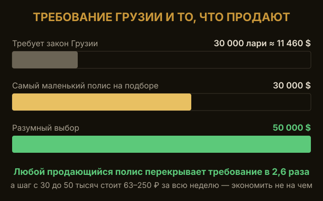
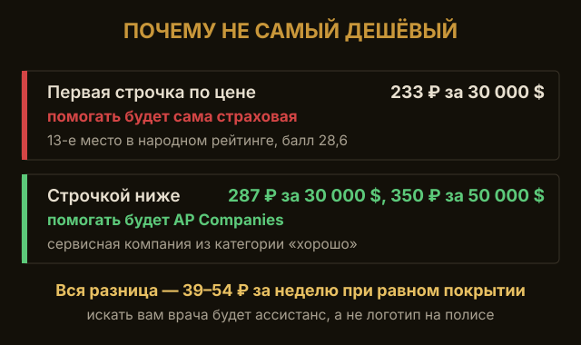
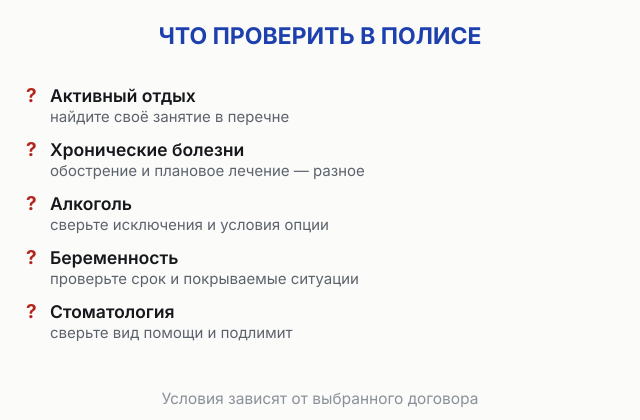
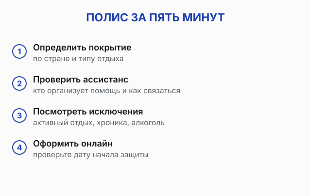

import AffiliateNote from '../../components/post/AffiliateNote.astro';
import PricingCards from '../../components/post/PricingCards.astro';
import { cherehapaCountry } from '../../data/affiliate.js';

export const chGeorgia = cherehapaCountry('georgia', 'georgia_insurance_2026');

С января 2026 у поездки в Грузию появилось новое жёсткое условие, про которое многие узнают в аэропорту: без медицинской страховки на рейс могут не посадить. Я сам летал в Тбилиси и оформлял полис заранее — это пять минут и пара сотен рублей за поездку.

А ещё вокруг этого требования выросло столько мифов, что я полез читать сам текст постановления. Разбираю, что закон требует на самом деле, где реально проверяют полис и сколько он стоит.

> **Если коротко:** с **1 января 2026** страховка для въезда в Грузию **обязательна** для всех иностранных туристов, включая россиян. Закон требует ровно трёх вещей: **страховая сумма не ниже 30 000 лари** (≈ 969 000 ₽), покрытие **здоровья и несчастного случая** на весь срок поездки, полис **на английском или грузинском** — бумажный или электронный. **Про франшизу в законе нет ни слова** — это миф, разошедшийся по перепечаткам. Проверяют в основном **авиакомпании на регистрации и посадке**. Стоит это **от 233 ₽ за неделю** — в разы дешевле, чем пишут; но за 287 ₽ берётся полис с нормальным ассистансом на 30 000 $, а за 350 ₽ — он же на 50 000 $, и это те деньги, которые стоит доплатить. Купить по прилёте негде. Сравнить цены и оформить: <a href={chGeorgia} class="aff-cta" rel="sponsored">Подобрать полис в Грузию</a> — оплата из России, полис сразу в PDF.

<AffiliateNote />

---

## Нужна ли страховка для въезда в Грузию в 2026 году?

**Да, с 1 января 2026 года страховка обязательна для всех иностранных туристов, включая граждан России.** До 2026 года полис для въезда не спрашивали.

Здесь важно не путать два документа. Сама обязанность записана в **статье 12 Закона Грузии «О туризме»**: туристы, посещающие Грузию, должны иметь обязательное страхование здоровья и от несчастного случая. А конкретные правила задаёт **[Постановление правительства Грузии №602](https://matsne.gov.ge/ka/document/view/6728816?publication=0)** от 26 декабря 2025 года — оно вступило в силу 1 января 2026 и состоит всего из пяти статей. Именно в нём написано, каким должен быть полис.

Требование зависит не от гражданства, а от того, въезжаете ли вы как турист. Изначально его собирались ввести в июне 2025, но перенесли; задним числом к тем, кто въехал до 1 января, оно не применяется.

Подходит обычная туристическая страховка — та же, что берут в любую поездку. Отдельного «полиса для Грузии» не существует: закон описывает не продукт, а минимальные условия, которым полис должен отвечать.

Сам безвизовый режим не изменился: россиянам **виза в Грузию по-прежнему не нужна**, находиться можно до 365 дней подряд. Подробно про въезд, сроки и оплату — в общем разборе [Грузия 2026 россиянам: безвиз, цены, маршрут](/blog/georgia-guide-2026/).

---

## Какое покрытие должно быть у полиса?

Постановление №602 задаёт минимум. Вот он целиком, без додумок:

| Параметр | Что требует закон |
|---|---|
| Страховая сумма | **Не ниже 30 000 лари** (≈ 969 000 ₽) |
| Что покрывает | **Здоровье и несчастный случай** |
| Срок действия | Весь период пребывания, от въезда до выезда, но **не более 1 года** |
| Язык полиса | **Английский или грузинский** (другой язык — с переводом) |
| Форма | Электронный (PDF) или бумажный |
| Кто выдал | Грузинская **или иностранная** страховая — оба варианта равны |

Всё. Больше постановление ничего не требует.

Про **несчастный случай** есть нюанс, который стоит знать. Закон его называет, но не объясняет, что под ним понимать. В публикации на сайте Ассоциации туроператоров России от 20 февраля 2026 (там она помечена как новость компании, а не разбор самой ассоциации) прямо сказано: разъяснений нет, травмы обычно покрывает медицинская часть, а accident insurance — это выплаты при инвалидности или смерти. Поэтому опцию «несчастный случай» рекомендуют включать — чтобы соответствовать закону наверняка.

Ещё в публикациях гуляет разбивка «5 000 лари на амбулаторную помощь и 30 000 на стационар». В постановлении такой разбивки нет — та же публикация от 20 февраля 2026 называет её медийной. В законе одна цифра: 30 000 лари общей суммы.

---

## Требует ли закон Грузии полис без франшизы?

**Нет, не требует. В постановлении №602 слова «франшиза» нет вообще** — ни в требованиях к полису, ни в перечне сведений, которые в полисе должны быть указаны.

Я полез в текст сам, потому что «без франшизы» пишут буквально все — в том числе сайты, которые эти полисы и продают. В постановлении пять статей. Про деньги там одна фраза, статья 4: «Страховая сумма полиса должна составлять не менее 30 000 лари». Перечень обязательных сведений в полисе тоже закрытый: стороны, территория, сроки, риски, лимиты, размер взноса.

То же самое видно в [публикации на сайте АТОР от 20 февраля 2026](https://www.atorus.ru/node/66596): список требований по №602 — сумма, риски, срок, язык, форма. Франшизы там нет.

Раньше в этой статье у меня было написано, что закон требует полис без франшизы. Это была ошибка — я её исправил.

**И всё-таки берите без франшизы.** Не потому что закон, а потому что франшиза — это сумма, которую вы платите сами, и она съедает как раз мелкие обращения, которые случаются чаще всего. Отравление, ухо, разбитая коленка: счёт небольшой, франшиза его накрывает, и полис не срабатывает ни разу за поездку.

На практике вопрос вообще почти не стоит: в подборе по Грузии на 17 июля 2026 у **всех четырнадцати** страховых франшиза нулевая. Полис с франшизой на Грузию ещё надо постараться найти.

---

## Кому полис не нужен

Постановление освобождает пять категорий (статья 1, пункт 3):

- владельцы **дипломатической или специальной визы**;
- владельцы **дипломатического, официального, служебного или специального паспорта**;
- **аккредитованные сотрудники** дипломатических представительств, консульств, международных организаций и члены их семей с аккредитацией;
- лица, чей въезд предусмотрен **международными соглашениями** Грузии;
- **водители** на международных грузовых и пассажирских перевозках.

Отдельная история — **вид на жительство**. Требование написано про туриста, а турист по грузинскому закону — это тот, кто приехал не по месту постоянного жительства на срок от суток до года. Держатели ВНЖ и граждане Грузии под это определение не попадают: та же публикация на сайте АТОР пишет, что прямых требований к ним нет. Но если вы живёте в Грузии по ВНЖ, местная медстраховка — это не то же самое, что полис путешественника, и на стойке регистрации её могут не принять как подтверждение.

---

## Что будет без страховки — отказ или штраф?

**Самый реальный риск — отказ в посадке на рейс.** Главное, что изменилось в 2026 году: первичный контроль сместился на авиакомпании — так это описывает [публикация на сайте АТОР от 20 февраля 2026](https://www.atorus.ru/node/66596). Перевозчик отвечает за то, что везёт пассажира, который проходит по правилам въезда, — поэтому полис спрашивают ещё в аэропорту вылета. Есть случаи, когда людей не пускали на борт: деньги за билет и бронь при этом сгорают.

Про **штраф в 300 лари** (≈ 9 800 ₽) скажу честно. Цифру называют страховые компании и СМИ, но в постановлении №602 никаких санкций нет вообще — там нет статьи про штрафы. Официального реестра штрафов за это в открытом доступе тоже нет. То есть 300 лари гуляет по публикациям, а чем подтверждается — непонятно. Все суммы сверх этой, которые попадаются в перепечатках, я проверил и подтверждения не нашёл.

**И самое практичное:** купить полис по прилёте нельзя. В аэропортах и на наземных пунктах Грузии нет ни стоек продажи, ни официального механизма оформить страховку на месте — та же публикация АТОР пишет об этом прямо. Не долетели без полиса — выкручиваться будет поздно.

> Полис на неделю стоит около 300 ₽. Отказ в посадке из-за его отсутствия — это сгоревшие билеты и бронь.

---

## Сколько стоит страховка в Грузию?

**От 233 ₽ за восемь дней** — это около 29 ₽ в день. Дешевле, чем принято думать: цифры вроде «150 ₽ в день» и «50 € за неделю», которые ходят по статьям, завышены в разы.

Вот живой расчёт на 17 июля 2026, поездка 1–8 августа, турист 30 лет:

| Страховая | Покрытие 30 000 $ | Покрытие 50 000 $ | Ассистанс |
|---|---|---|---|
| Абсолют Страхование | **233 ₽** | **311 ₽** | Absolute Insurance Ltd |
| АльфаСтрахование | 255 ₽ | 505 ₽ | Global Voyager Assistance |
| Русский Стандарт | 261 ₽ | 331 ₽ | Eurasia Assistance |
| **Зетта Страхование** | **287 ₽** | **350 ₽** | **AP Companies** |
| Совкомбанк Страхование | 443 ₽ | 553 ₽ | AP Companies |
| РЕСО Гарантия | 502 ₽ | 627 ₽ | Global Voyager Assistance |
| Ингосстрах | 759 ₽ | 948 ₽ | Balt Assistance |

Обратите внимание на арифметику: **минимум по закону — 30 000 лари, это примерно 11 460 $ по курсам ЦБ на 15 августа 2026 — той же даты, что и рублёвый пересчёт.** А самый маленький лимит, который вообще продают на подборе, — 30 000 $. То есть любой полис перекрывает требование Грузии в 2,6 раза, и стоит это 233 ₽. Экономить тут не на чем.

Разница между 30 000 $ и 50 000 $ — от 63 до 250 ₽ за всю неделю в зависимости от компании: у Зетты 63 ₽, у Абсолюта 78 ₽. Берите 50 000.

**Только не хватайте первую строчку.** Самый дешёвый в таблице — Абсолют, и это как раз тот случай, когда экономия выходит боком. Ассистанс у него — он сам, в народном рейтинге Банки.ру на 17 июля 2026 он стоял на 13-м месте с баллом 28,6, а блог «Ездили-Знаем», который годами собирает отзывы о страховых, для Грузии советует «любой, кроме Абсолюта».

**Мой выбор — Зетта: 287 ₽ с покрытием 30 000 $ или 350 ₽ с покрытием 50 000 $, я беру второй вариант.** При равном покрытии Зетта дороже самого дешёвого на 39–54 ₽, зато за полисом стоит **AP Companies** — сервисная компания из категории «хорошо». Именно ассистанс будет искать вам врача, пока вы лежите с температурой, и он важнее цены и бренда. Почему — разбираю в отдельном материале [какая страховка для путешествий лучше](/blog/strahovka-dlya-puteshestviy-2026/).

<a href={chGeorgia} class="aff-cta" rel="sponsored">Подобрать полис в Грузию под мои даты</a> — агрегатор показывает цены разных компаний и ассистанс у каждой, оформляет полис сразу в PDF. Принимает оплату из России.

<PricingCards
  caption="Какое покрытие выбрать для Грузии"
  tiers={[
    {
      tier: 'Минимум по закону',
      price: '30 000 лари',
      priceNote: '≈ 969 000 ₽ · это всего ~11 460 $',
      features: [
        'Формальное требование постановления №602',
        'Полисов с таким низким лимитом на подборе нет',
        'Любой полис от 30 000 $ перекрывает его в 2,6 раза',
      ],
      ctaLabel: 'Посмотреть цены',
      ctaHref: chGeorgia,
    },
    {
      tier: 'Рабочий вариант',
      price: '50 000 $',
      priceNote: 'от 350 ₽ за 8 дней у Зетты с AP Companies (расчёт 17.07.2026)',
      featured: true,
      badge: 'Мой выбор',
      features: [
        'Закрывает закон с огромным запасом',
        'Дороже лимита 30 000 $ на 63–250 ₽ за неделю',
        'Хватает на серьёзное лечение, а не только на приём',
      ],
      ctaLabel: 'Подобрать под мои даты',
      ctaHref: chGeorgia,
    },
    {
      tier: 'Горы и активность',
      price: '50 000 $ + опция',
      priceNote: 'Казбеги, Гудаури, треккинг',
      features: [
        'Без опции «Спорт» травмы в горах не оплатят',
        'Это условие страховых, а не требование закона',
        'Отдельная опция под аренду авто, если за руль',
      ],
      ctaLabel: 'Собрать полис с опциями',
      ctaHref: chGeorgia,
    },
  ]}
/>

---

## Где и когда проверяют полис?

- **Стойка регистрации и посадка** — главная точка. Авиакомпании проверяют полис до вылета, потому что отвечают за соответствие пассажира правилам въезда.
- **Пограничный контроль** — по постановлению патрульная полиция МВД Грузии **вправе** проверить полис в пункте пропуска. На практике контроль выборочный.
- **Наземные пункты пропуска** — проверки фиксируются и там тоже. Спрашивают выборочно, и рассчитывать на «пронесёт» не стоит.

Полис нужен **на весь срок поездки**: если даты в страховке короче брони, это повод для вопросов. Оформляйте ровно по датам въезда и выезда.

---

## Что полис не покрывает

Три вещи, на которых спотыкаются именно в Грузии:

- **Горы.** Казбеги, Гудаури, треккинг по Сванетии, горные лыжи — травмы на такой активности базовый полис не покрывает. Нужна опция «Спорт» или «Активный отдых», и это условие самих страховых, а не закона. Ингосстрах пишет об этом прямым текстом.
- **Абхазия и Южная Осетия.** Большинство полисов там не действует — включая те, что выпущены грузинскими страховыми. Если планируете [поездку в Абхазию](/blog/abkhazia-2026/), это отдельная история и отдельный полис.
- **Больше года.** Период страхования по постановлению — не более 1 года. На фоне безвиза в 365 дней это стоит держать в голове: полис на весь срок пребывания, но верхняя граница есть.

Плюс стандартные исключения любого полиса: травмы в состоянии опьянения (нужна отдельная опция), а мотобайк оплатят, только если есть права нужной категории и вы были в шлеме и трезвый.

---

## Нужна ли страховка на машину, если еду своим ходом?

**Это другой полис, и медицинский его не заменяет.** Медицинская страховка отвечает за человека, а машину на иностранных номерах закрывает грузинская автогражданка — полис ответственности перед третьими лицами. Обязательное страхование в Грузии распространяется на транспортное средство, зарегистрированное в другом государстве, — то есть на любую машину с российскими номерами. Продаёт полис [Центр обязательного страхования](https://www.tpl.ge/ru/policies): через сайт, агентов и брокеров, в бумажном или электронном виде.

Тарифы для легкового автомобиля — с сайта Центра, снято 28 августа 2026 года; в рублях по курсу Банка России на ту же дату (32,81 ₽ за лари):

| срок полиса | цена | в рублях |
|---|---|---|
| 15 дней | 30 лари | ≈ 984 ₽ |
| 30 дней | 50 лари | ≈ 1 641 ₽ |
| 90 дней | 90 лари | ≈ 2 953 ₽ |
| год | 295 лари | ≈ 9 680 ₽ |

**Штраф за поездку без автогражданки — от 100 до 200 лари** (≈ 3 300–6 600 ₽). Вилку называет сам Центр в ответах на частые вопросы. По русским сайтам вместо неё ходит «300 лари» — та же цифра, что приписывают отсутствию медицинского полиса. Требования разные: одно про здоровье путешественника, второе про ущерб чужой машине и чужому имуществу.

Автогражданка не платит за ущерб от умысла потерпевшего, стихии, опасных грузов, военных действий и терактов, а также за аварии на соревнованиях и учениях. Решение о выплате Центр принимает в срок до 30 дней.

Полный комплект документов, правила живой очереди и четыре сценария отпуска собраны отдельно — [как поехать в Грузию на своей машине через Верхний Ларс](/blog/v-gruziyu-na-mashine-2026/).

---

## Как оформить страховку онлайн за несколько минут

1. **Задайте даты поездки** — въезд и выезд; покрытие должно закрывать весь срок.
2. **Поставьте сумму 50 000 $** — закон требует 30 000 лари (~11 460 $), но разница в цене — от 63 до 250 ₽ за неделю, так что берите с запасом.
3. **Посмотрите на ассистанс** — он указан в карточке каждого полиса. AP Companies из доступных по Грузии — один из самых надёжных.
4. **Добавьте опции при необходимости** — активный отдых для гор, аренда авто.
5. **Оплатите и сохраните PDF** — держите его в телефоне и распечатайте одну копию для регистрации.

<a href={chGeorgia} class="aff-cta" rel="sponsored">Оформить страховку для Грузии</a> — агрегатор покажет цены и ассистанс под ваши даты, полис придёт в PDF, оплата из России.

Дальше пригодятся ещё два практичных разбора: [как платить в Грузии, раз карты РФ не работают](/blog/pay-georgia-2026/) и [eSIM и связь за границей](/blog/esim-zagranicey-2026/).

---

## FAQ

**Нужна ли страховка в Грузию россиянам в 2026 году?**
Да. С 1 января 2026 она обязательна для всех иностранных туристов. Обязанность записана в статье 12 Закона Грузии «О туризме», а правила задаёт Постановление правительства №602 от 26.12.2025. Без полиса возможен отказ в посадке на рейс.

**Обязательно ли брать полис без франшизы?**
Нет, закон этого не требует — в постановлении №602 слова «франшиза» нет вообще. Но брать без франшизы всё равно разумно: франшиза съедает мелкие обращения, которые случаются чаще всего. На практике у всех страховых в подборе по Грузии франшиза и так нулевая.

**Какое минимальное покрытие должно быть у полиса?**
Не ниже 30 000 лари (≈ 969 000 ₽, это около 11 460 $) на весь срок поездки, с покрытием здоровья и несчастного случая. Минимальный лимит, который продают на подборе, — 30 000 $: он перекрывает требование примерно в 2,6 раза.

**Сколько стоит страховка в Грузию на неделю?**
От 233 ₽ за восемь дней с покрытием 30 000 $ и от 311 ₽ с покрытием 50 000 $ (расчёт на 17 июля 2026, турист 30 лет). Это порядка 29–39 ₽ в день.

**Есть ли штраф за отсутствие полиса?**
СМИ и страховые называют 300 лари, но в самом постановлении №602 санкций нет, и официального реестра штрафов в открытом доступе найти не удалось. Практический риск — не штраф, а отказ в посадке на рейс.

**Где проверяют страховку — на границе или в аэропорту?**
Основная проверка — на стойке регистрации и на посадке: этим занимаются авиакомпании. Пограничная служба Грузии проверяет выборочно, в том числе на наземных пунктах пропуска.

**Можно купить полис по прилёте в Грузию?**
Нет. В аэропортах и на наземных пунктах пропуска нет ни стоек продажи, ни официального механизма оформить страховку на месте. Полис нужен до вылета.

**Нужен ли полис владельцу ВНЖ Грузии?**
Прямых требований нет: требование написано про туриста, а держатели ВНЖ и граждане под это определение не попадают. Но местная медстраховка — не полис путешественника, и на регистрации её могут не принять.

**На каком языке должен быть полис для Грузии?**
На английском или грузинском. Полис на русском нужно сопроводить переводом — поэтому удобнее сразу брать версию на английском.

---

*Материал носит справочный характер и не является юридической консультацией. Требования к въезду устанавливает Грузия и может их менять; перед поездкой сверяйтесь с первоисточниками — [Постановление правительства Грузии №602](https://matsne.gov.ge/ka/document/view/6728816?publication=0) на официальном правовом портале matsne.gov.ge, МВД Грузии и сайт вашей авиакомпании.*
