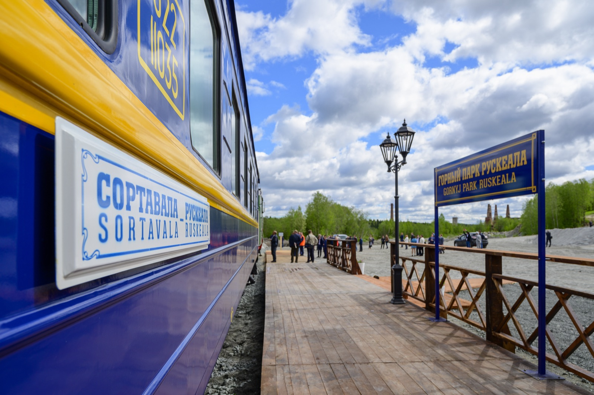

import AffiliateNote from '../../components/post/AffiliateNote.astro';
import PricingCards from '../../components/post/PricingCards.astro';
import { TP_LINKS } from '../../data/affiliate.js';

Горный парк Рускеала — главная «открытка» Карелии: затопленный мраморный каньон с бирюзовой водой, отвесными скалами и подземными штольнями, куда добираются на ретропоезде с настоящим паровозом. Место красивое, но популярное до толп — и тем ценнее знать, когда ехать и что почём. Собрал по делу: цена билета в 2026 году, как добраться из Петербурга и Сортавалы и что успеть внутри.

> **Если коротко:** Рускеала — горный парк вокруг старого мраморного карьера в Карелии, недалеко от Сортавалы. **Входной билет 2026 — 750 ₽** (школьники 550 ₽, дети до 7 лет бесплатно); экскурсия в штольни «Подземная Рускеала» и активности — отдельно. Парк работает **круглый год, 10:00–20:00**; зимой — художественная подсветка (с 1 ноября по 8 марта). Самый атмосферный способ добраться — **ретропоезд «Рускеальский экспресс»** на паровозе из Сортавалы (~1 час). Из Петербурга в Сортавалу идёт «Ласточка» (~4 часа). Лучшее время — будний день, раннее утро: к середине дня привозят автобусы из Питера.

<AffiliateNote />

---

## Что такое Рускеала?

**Рускеала — это бывший мраморный карьер, превращённый в горный парк.** Мрамор здесь добывали с XVII века, карьер постепенно затопили грунтовые воды, а в 2005 году энтузиасты открыли на его месте туристический парк. Сегодня это самая посещаемая природная достопримечательность Карелии.

Сердце парка — **Мраморный каньон**: чаша длиной около 470 метров с отвесными белыми стенами и водой изумрудно-бирюзового цвета (видимость в ней превышает 10 метров). Вокруг каньона проложен маршрут со смотровыми площадками, есть подземные штольни, гроты, прокат лодок и экстрим-аттракционы.

Рускеальский мрамор — не просто красивый камень: им облицованы **Исаакиевский собор** и **Михайловский замок** в Петербурге, а мрамором из соседнего Итальянского карьера — станции метро «Приморская» и «Ладожская».

Если планируете Карелию целиком, Рускеала — обязательная точка; как встроить её в маршрут, разобрал в гайде [Карелия 2026: что посмотреть и как добраться](/blog/kareliya-guide-2026/).

---

## Сколько стоит вход в Рускеалу в 2026?

**Входной билет в парк в 2026 году — 750 ₽ для взрослого.** Это плата только за вход; экскурсии в штольни, активности и прокат оплачиваются отдельно.

| Категория | Входной билет 2026 |
|---|---|
| Взрослый | **750 ₽** |
| Студенты, лица 60+ | 650 ₽ |
| Школьники | 550 ₽ |
| Дети до 7 лет | бесплатно |

Отдельно оплачиваются экскурсии и активности (цены 2026, оф. сайт парка):

- **Мраморный каньон** (экскурсия с гидом, ~1 ч 15 мин) — 950 ₽.
- **Подземная Рускеала** (маршрут по затопленным штольням на понтонах, 7+) — 2500 ₽.
- **«Дорогой горных мастеров»** (~1 ч 45 мин) — 1150 ₽.
- **Зиплайн** над каньоном (~400 м, до 50 км/ч), тарзанка, гигантские качели, прокат лодок — цены уточняются на месте.

**Важно:** не путайте входной билет (750 ₽) с турпакетами из Петербурга по 3700–5300 ₽ — в последние входят дорога и экскурсии. На месте достаточно входного билета плюс то, что захотите добрать.

---

## Как добраться до Рускеалы?

**Главный и самый атмосферный способ — ретропоезд «Рускеальский экспресс».** Это настоящий поезд на паровой тяге, который ходит из Сортавалы прямо в парк примерно за час. Но добраться можно и другими путями.

- **«Рускеальский экспресс»** (паровоз, Сортавала → парк, ~1 час). Отправления из Сортавалы утром и днём, обратно — днём и вечером; билет от ~1500 ₽, детям и молодёжи до 21 и пассажирам 60+ — скидки. Покупка — на РЖД и у агрегаторов; расписание сверяйте, оно сезонное.
- **«Ласточка» из Петербурга до Сортавалы** (~4 часа, с Финляндского вокзала; утренний рейс стыкуется с дневным экспрессом). Дальше — экспресс, автобус или такси.
- **На машине из Петербурга** — около 290–310 км, 4–5 часов по Приозерской трассе (А-121) через Приозерск и Сортавалу. У входа бесплатная парковка.
- **Автобусом:** прямого из Петербурга нет; едут до Сортавалы (~4–5,5 ч, 790–960 ₽), затем местный автобус Сортавала → Рускеала (один рейс, вечером, ~169 ₽) или такси.
- **Из Москвы** — турпоездом «В Карелию» (состыкован с экспрессом) либо «Сапсаном» до Петербурга + «Ласточкой».

<a href={TP_LINKS.tutu} class="aff-cta" rel="sponsored">Посмотреть «Ласточку» и «Рускеальский экспресс» →</a> — расписание и билеты на поезда до Сортавалы и в парк.

---

## Что посмотреть внутри парка

**Главное — обойти Мраморный каньон по кругу, а дальше выбирать по силам и бюджету.** Что есть в парке:

- **Мраморный каньон** — та самая бирюзовая чаша с отвесными стенами. Основной маршрут со смотровыми занимает 1–1,5 часа.
- **Подземная Рускеала** — экскурсия по затопленным штольням: идёшь по мосткам на понтонах над подземным озером, зимой здесь вырастают ледяные сталактиты. Отдельный билет, ограничение 7+.
- **Итальянский карьер** — открыт в 1970-х в километре от главного; ровные мраморные стены, отпиленные итальянскими машинами.
- **Рускеальские водопады (Ахвенкоски)** — по дороге Сортавала — Рускеала, на реке Тохмайоки. Здесь снимали фильм **«А зори здесь тихие»**; это отдельный объект «Долина водопадов».
- **Активности:** зиплайн через каньон, тарзанка, гигантские качели, прокат лодок (сезон примерно с мая по октябрь).

---

## История: мрамор Рускеалы

**Камень отсюда украшает главные здания Петербурга.** Добывать мрамор у Рускеалы начали шведы ещё в середине XVII века, а «второе открытие» месторождения произошло при Екатерине II — карьер на Белой горе разрабатывали для имперских строек.

Рускеальский мрамор пошёл на облицовку **Исаакиевского собора** и элементы **Михайловского замка** в Петербурге, на верстовые столбы и дворцовый декор. Позже мрамором из соседнего **Итальянского карьера** облицевали станции ленинградского метро «Приморская» и «Ладожская».

После того как добыча прекратилась, выработки постепенно затопили грунтовые воды; к началу 2000-х вода стала кристально прозрачной, и в 2005 году на месте карьера открыли горный парк.

---

## Рускеальские водопады рядом

**По дороге Сортавала — Рускеала есть отдельная точка, ради которой стоит сделать остановку: Рускеальские водопады (Ахвенкоски).** Это каскад порогов на реке Тохмайоки в окружении соснового леса. Водопады невысокие, но фотогеничные, а сам парк «Долина водопадов» обустроен экотропами, подвесными мостами и зиплайнами над водой.

Главная фишка места — кино: именно здесь снимали сцены легендарного фильма **«А зори здесь тихие»**, а позже — «Тёмный мир». По тропам проложены деревянные настилы и мостики, так что обойти каскад можно за 30–40 минут.

Водопады — отдельный объект со своим входом, не входящий в билет горного парка. Логично заехать сюда по пути: если едете на машине или такси из Сортавалы, это буквально несколько километров в сторону. Многие комбинируют водопады и каньон в один день.

---

## Зимняя Рускеала — отдельное впечатление

**Зимой парк превращается в сказку и работает по-другому.** С 1 ноября по 8 марта включается **художественная подсветка**: каньон и скалы заливают цветным светом, и с наступлением темноты (а зимой это уже к 16:30) Рускеала выглядит совершенно иначе, чем летом.

Что добавляется зимой:
- **Ледовые скульптуры** и зимний фестиваль ледового искусства (обычно февраль–май).
- **Каток** и зимние прогулки по заснеженному каньону.
- Штольни «Подземной Рускеалы» обрастают **ледяными сталактитами** — пожалуй, самое атмосферное время для подземной экскурсии.

Минусы зимы — короткий световой день и мороз, так что одевайтесь максимально тепло и закладывайте меньше времени на улице. Зато туристов заметно меньше, чем в летний пик.

---

## Что ещё рядом: Сортавала и шхеры

**Рускеалу удобно совмещать с другими точками Приладожья — за один-два дня закрывается весь север Ладоги.**

- **Сортавала** — атмосферный городок с финской и карельской архитектурой, главная база для Рускеалы и Валаама. От вокзала до причала метеоров — 20–30 минут пешком.
- **Ладожские шхеры** — национальный парк, лабиринт скалистых островов; популярны лодочные и катерные прогулки из Сортавалы.
- **[Остров Валаам](/blog/ostrov-valaam-2026/)** — метеор отправляется из той же Сортавалы; реально совместить Рускеалу и Валаам в одной поездке (но это два разных насыщенных дня).

Такой набор — Рускеала, водопады, Сортавала, шхеры и Валаам — складывается в идеальный маршрут выходного по Приладожью.

---

## Когда ехать и как избежать толп

**Лучшее время — будний день и раннее утро.** Рускеала очень популярна, и главная проблема — не погода, а толпы: к середине дня в парк привозят однодневные автобусные экскурсии из Петербурга. Об этом честно пишут бывавшие:

> «Народу много. Местные вообще в выходные не рекомендуют туда ездить» — *moleff, [Форум Винского](https://forum.awd.ru/viewtopic.php?t=348909&start=20)*.

> «Особенно много народа становится, когда организованные однодневные экскурсии из Питера в середине дня привозят» — *moleff, [Форум Винского](https://forum.awd.ru/viewtopic.php?t=348909&start=20)*.

> «Относительно немного народу только ранней весной и поздней осенью» — *Kivach, [Форум Винского](https://forum.awd.ru/viewtopic.php?t=348909&start=20)*.

Это мнения путешественников, но они совпадают: приезжайте к открытию (10:00) в будний день, а межсезонье (поздняя осень, ранняя весна) даёт самые пустые кадры — правда, без летней зелени.

**Зимой** парк работает с художественной подсветкой (с 1 ноября по 8 марта, включается с наступлением темноты) и ледовыми скульптурами — это совсем другая, сказочная Рускеала.

---

## Сколько времени заложить

**Минимум — полдня на сам парк.** Если берёте «Подземную Рускеалу» и активности, закладывайте полный день. Удобный план:

- Утренняя «Ласточка» из Петербурга → Сортавала.
- «Рускеальский экспресс» в парк к открытию.
- Каньон + штольни + при желании зиплайн.
- Обратный экспресс днём или вечером → «Ласточка» в Петербург.

На регион в целом стоит закладывать 2–3 дня: рядом — Сортавала, Ладожские шхеры и [остров Валаам](/blog/ostrov-valaam-2026/).

---

## Практические советы

- **Берите билеты на экспресс заранее** — летом и в выходные разбирают.
- **Удобная обувь** — маршрут по камню и настилам, местами скользко.
- **Тёплая одежда** даже летом: в каньоне и штольнях прохладно.
- **Наличные** на месте пригодятся, хотя карты в основном принимают.
- **Репеллент** летом — рядом лес и вода, есть комары.
- **Совмещайте** Рускеалу с Рускеальскими водопадами по дороге — это разные объекты.

---

## Сколько стоит съездить в Рускеалу на день

**Однодневная поездка из Петербурга обходится ориентировочно в 6 000–9 000 ₽ на человека** — в зависимости от того, едете ли вы на «Ласточке» с экспрессом или на своей машине компанией. Примерный расклад на одного:

| Статья | Ориентир (2026) |
|---|---|
| «Ласточка» СПб — Сортавала (туда-обратно) | ~2 500–3 500 ₽ |
| «Рускеальский экспресс» (туда-обратно) | от ~3 000 ₽ |
| Входной билет в парк | 750 ₽ |
| Экскурсия (каньон или штольни) | 950–2 500 ₽ |
| Еда на месте | ~500–800 ₽ |

**Как сэкономить:** ехать компанией на машине (тогда дорога делится на всех, а парковка бесплатная), брать только входной билет без экскурсий (по каньону реально пройти самостоятельно) и заранее покупать билеты на экспресс по более дешёвым тарифам. Семьям выгоднее автомобиль: дети до 7 лет проходят в парк бесплатно, а расходы на дорогу не зависят от числа пассажиров.

Если едете на 2–3 дня с базой в Сортавале, добавьте к бюджету жильё (домики и гостевые дома Приладожья — от ~2 500 ₽/ночь) и распределите по дням Рускеалу, водопады, Валаам и шхеры.

---

## FAQ

**Сколько стоит билет в Рускеалу в 2026 году?**
**Входной билет — 750 ₽** для взрослого, 650 ₽ для студентов и лиц 60+, 550 ₽ для школьников, дети до 7 лет — бесплатно. Экскурсия в штольни «Подземная Рускеала» (2500 ₽) и активности оплачиваются отдельно.

**Как добраться до Рускеалы из Санкт-Петербурга?**
**«Ласточкой» до Сортавалы (~4 ч), дальше «Рускеальским экспрессом», автобусом или такси.** На машине — около 290–310 км, 4–5 часов по Приозерской трассе.

**Что такое «Рускеальский экспресс»?**
**Ретропоезд на паровой тяге**, который ходит из Сортавалы в парк примерно за час. Билет от ~1500 ₽; самый атмосферный способ добраться. Расписание сезонное, бронируйте заранее.

**Работает ли Рускеала зимой?**
**Да, круглый год, 10:00–20:00.** Зимой включают художественную подсветку (с 1 ноября по 8 марта) и делают ледовые скульптуры — каньон выглядит сказочно.

**Сколько времени нужно на парк?**
**Минимум полдня**, а с экскурсией в штольни и активностями — полный день. На весь регион (Сортавала, Валаам, шхеры) закладывайте 2–3 дня.

**Когда меньше всего туристов?**
**В будни рано утром, а также поздней осенью и ранней весной.** К середине дня привозят автобусные экскурсии из Петербурга, и становится людно.

---

## Что почитать дальше

- [Карелия 2026: что посмотреть и как добраться](/blog/kareliya-guide-2026/) — общий гайд по региону
- [Остров Валаам 2026](/blog/ostrov-valaam-2026/) — рядом, метеор из Сортавалы
- [Остров Кижи 2026](/blog/ostrov-kizhi-2026/) — деревянное зодчество под Петрозаводском
- [Карелия в августе](/trips/august/karelia/) — лучший месяц для поездки
- [Калькулятор поездки](/calculator/) — прикинуть бюджет

---

*Материал носит справочный характер. Цены, часы работы и расписание «Рускеальского экспресса» меняются — сверяйтесь с официальным сайтом парка и РЖД перед поездкой. Проверял 21.06.2026. Нашли неточность — напишите в [Telegram-канал @traveltriberu](https://t.me/traveltriberu), обновлю.*

*Фото: Александровы АГ (каньон) и Kindastanley (экспресс) / [Wikimedia Commons](https://commons.wikimedia.org/wiki/File:0517Ac10._Ruskeala._Large_Marble_quarry.jpg) / [CC BY-SA 4.0](https://creativecommons.org/licenses/by-sa/4.0/).*
