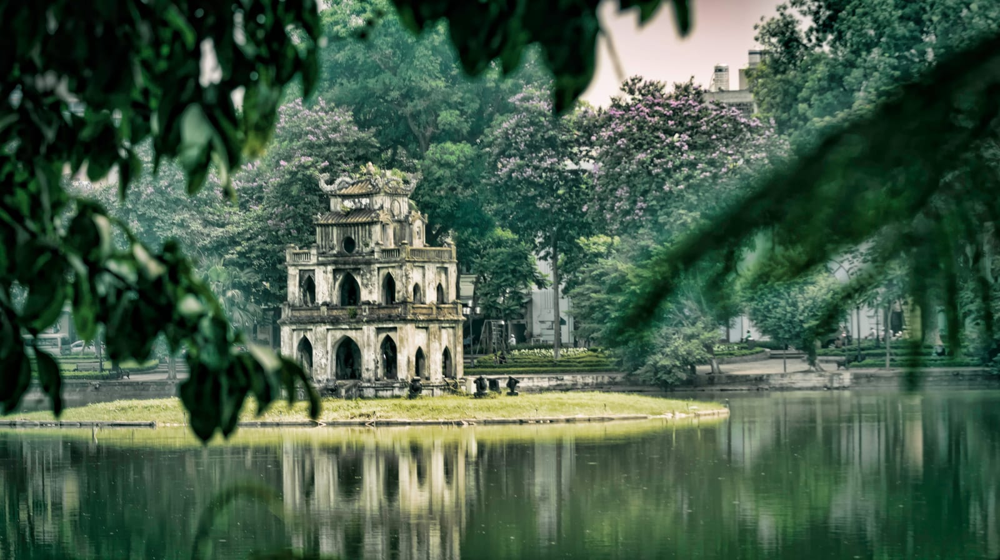
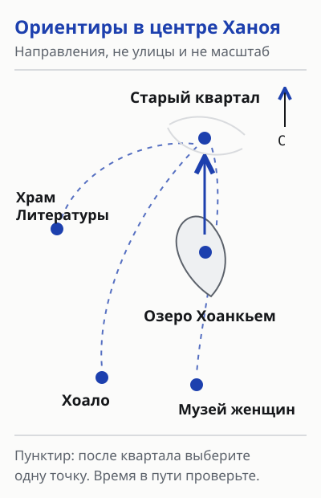
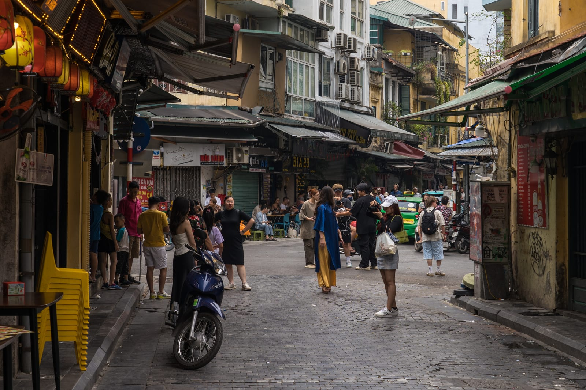
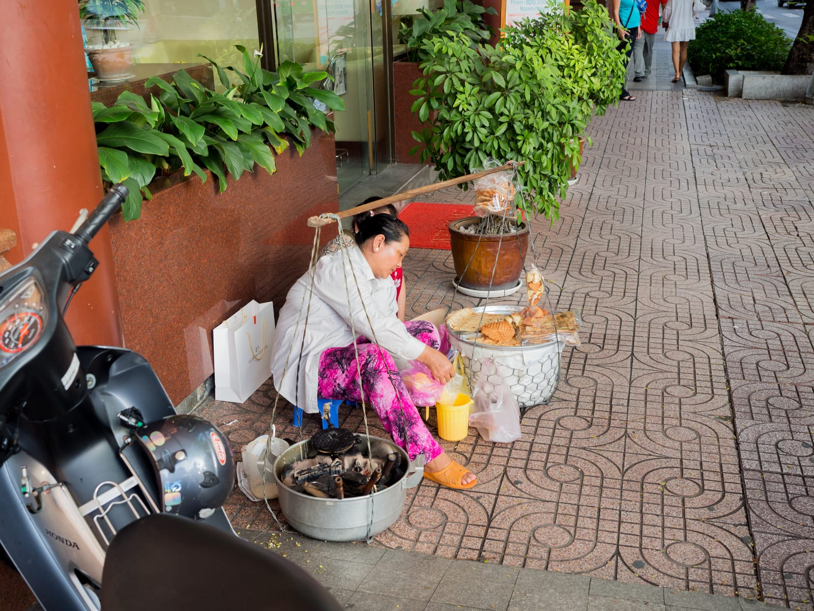
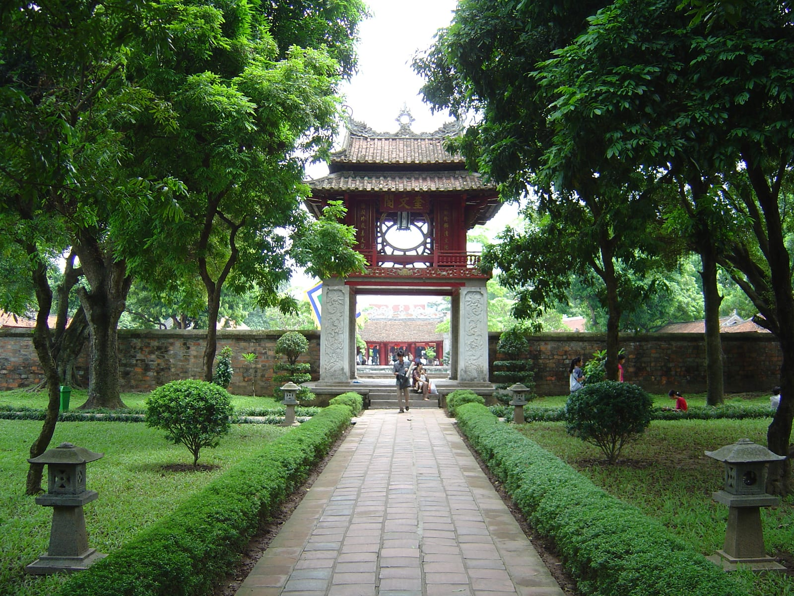
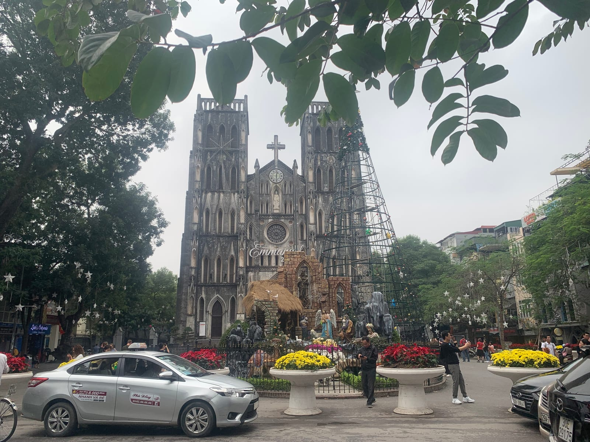
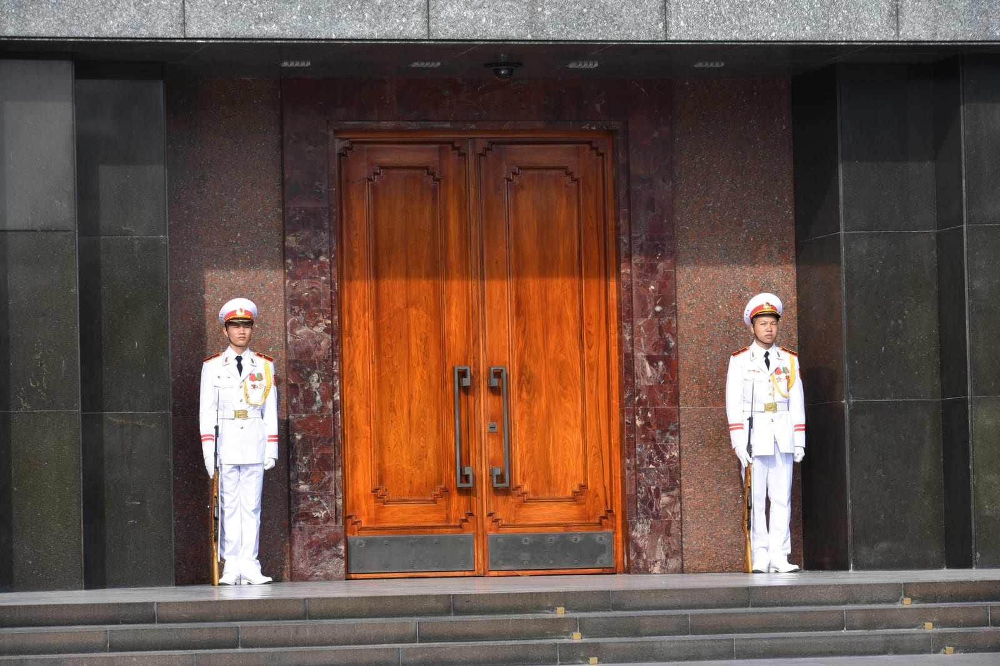
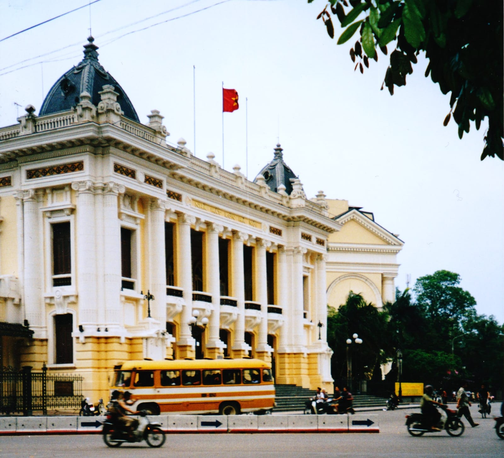
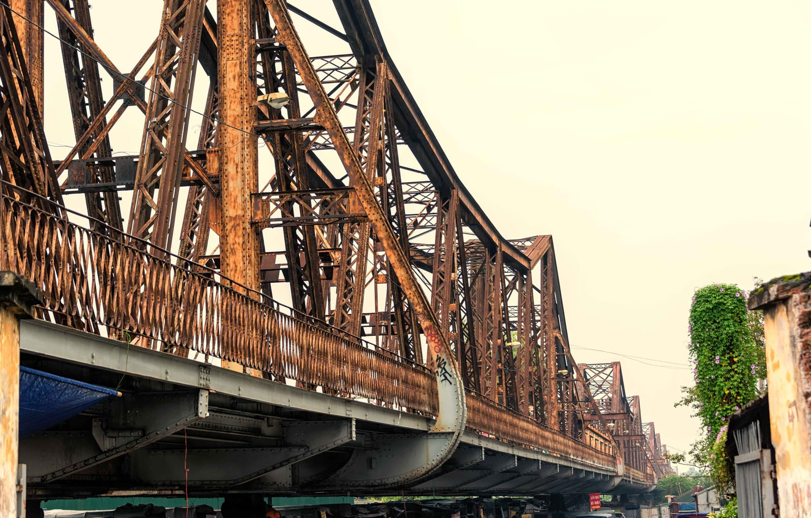
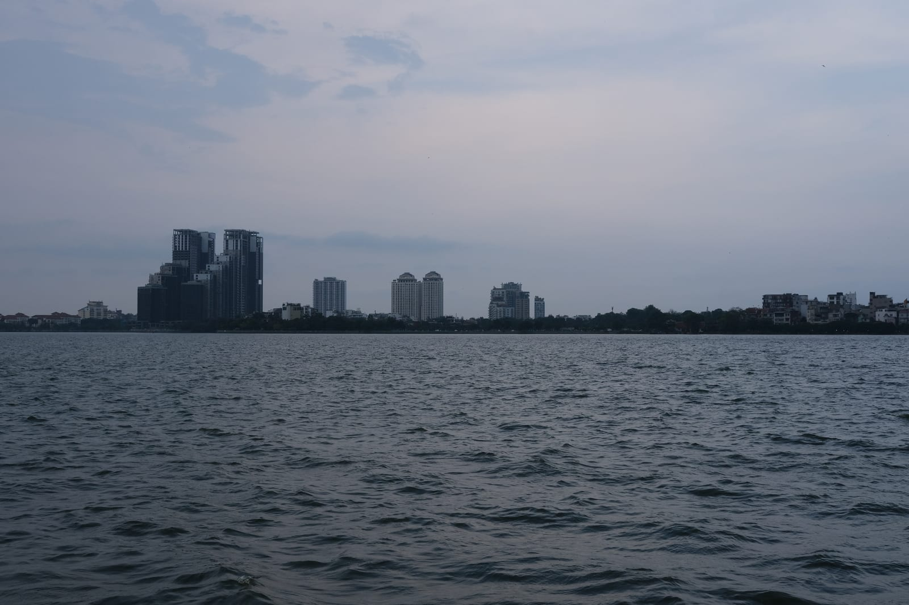

import { tpkDeep } from '../../data/affiliate.js';

export const hanoiTripster = tpkDeep('tripster', 'https://experience.tripster.ru/experience/Hanoi/', 'hanoi_one_day_tripster');
export const hanoiSputnik = tpkDeep('sputnik8', 'https://www.sputnik8.com/ru/hanoi', 'hanoi_one_day_sputnik');
export const hanoiStay = tpkDeep('ostrovok', 'https://ostrovok.ru/hotel/vietnam/hanoi_old_quarter_-_hoan_kiem_lake_neighborhood/', 'hanoi_one_day_stay');

Для первого дня в Ханое я бы выбрал **озеро Хоанкьем и Старый квартал**, а после обеда — **один музей или храм**. Так остаётся время зайти во двор, посидеть у воды и переждать жару. Я был в Ханое, но этот маршрут целиком не проходил: на дорогу и очереди заложите запас.

**Маршрут на день:** Хоанкьем → храм Нгокшон → Старый квартал → обед → Храм Литературы **или** музей Хоало → вечер у озера. В храм можно зайти по желанию. В жару или дождь сократите прогулку и проведите больше времени в музее. Для мавзолея Хо Ши Мина, Западного озера и моста Лонгбьен лучше выбрать другой день.

Если хочется понять город с человеком, который в нём живёт, сравните <a href={hanoiTripster} class="aff-cta" rel="sponsored">прогулки по Ханою на Tripster</a> и <a href={hanoiSputnik} class="aff-cta" rel="sponsored">маршруты на Sputnik8</a>. У обоих есть экскурсии на русском, но конкретное время, язык гида, встречу и состав группы проверяйте у выбранной прогулки. Самостоятельный маршрут ниже не требует покупки экскурсии.

## Пять вариантов одного дня

| Сколько времени и для кого | Что выбрать | Транспорт и машина | Честный минус |
| --- | --- | --- | --- |
| **3–4 часа в центре, при длинной пересадке** | Озеро и Старый квартал | Пешком; машина в узких улицах не нужна | Мало времени на внутренние экспозиции; дорога в аэропорт и процедуры отдельно |
| **6–8 часов, первая поездка** | Озеро, квартал, обед и один музей | Пешком, к дальнему объекту такси | Вторая половина зависит от пробок и усталости |
| **Полный день, интерес к истории** | Озеро, Хоало и Храм Литературы | Пешком плюс короткий переезд | Два музея подряд утомляют; Старый квартал придётся сократить |
| **День с дождём или сильной жарой** | Музей женщин, Хоало и короткие прогулки | Переезды между крытыми точками | Меньше времени на живой уличный Ханой |
| **С детьми или в спокойном темпе** | Озеро, пара улиц квартала, один объект по силам | Пешком и такси по необходимости | Придётся отказаться от «обязательной пятёрки» мест |

Время в таблице рассчитано на день **в самом Ханое**. Дорогу из аэропорта или отдалённого отеля прибавляйте отдельно. Для смены районов удобно такси; по узким улицам Старого квартала проще ходить пешком. Линия метро 2A соединяет Катлинь и Хадонг и для прогулки вокруг Хоанкьема не подходит.

## Базовый маршрут: озеро, Старый квартал, один выбор после обеда

### Утро — Хоанкьем и Нгокшон

Начните у озера. Круг вокруг воды помогает сориентироваться: Красный мост ведёт к храму Нгокшон на северной стороне, а башня Черепахи стоит на островке посреди озера. Берег открыт для прогулки весь день; заход в храм — отдельное посещение. Если времени меньше четырёх часов, посмотрите на мост и оставьте храм для другой поездки. Так вы не начнёте день в очереди, когда город ещё не видели.

Озеро — удобный центр повседневной жизни Ханоя. Это хороший старт именно потому, что отсюда можно повернуть в квартал, к собору Святого Иосифа или на более тихие улицы южнее. Не надо обходить берег ради формального полного круга: выходите там, где продолжается ваш вариант маршрута.

### До обеда — Старый квартал

От северного берега идите в Старый квартал. Его удобно смотреть пешком: мастерские, торговые улицы и кафе стоят плотнее, чем точки на карте. Не превращайте «36 улиц» в чеклист. Выберите две-три соседние улицы, сверните в более тихий переулок, затем возвращайтесь к озеру. В этом районе дороги делят пешеходы и мотоциклы; при переходе смотрите на поток машин. Навигатор его не покажет.

На обед можно остаться здесь же. Фо, бунча и яичный кофе встречаются в туристических подборках, но качество конкретного места меняется. Выбирайте по свежим отзывам и видимой очереди, уточняйте цену до заказа. Одно кафе с паузой лучше, чем три адреса, ради которых вы пересечёте квартал туда и обратно.

После обеда не ищите на карте «все места рядом»: Старый квартал и озеро удобны для одной прогулки, а музеи лежат в разных направлениях. Храм Литературы — западнее озера, Хоало — юго-западнее, Музей женщин — южнее. Если собираетесь в храм, выходите из квартала в сторону западной части центра; если в Хоало или Музей женщин, удобнее завершать прогулку на южной стороне квартала. Конкретный поворот выбирайте по навигатору на месте: схема выше показывает взаимное положение, а не улицы, по которым нужно идти.

Перед выходом из кафе проверьте расстояние до выбранного музея и время работы его кассы на этот день. Если до закрытия осталось мало времени, ещё одна остановка по пути может превратить билет в спешку. При дожде или с ребёнком можно подъехать к музею на такси, а прогулку оставить у озера; когда погода хорошая, часть пути пройдите пешком. Оба решения сохраняют главное преимущество одного дня: после обеда у вас один понятный пункт назначения, а не список мест, который приходится бросать на середине.

### После обеда — Храм Литературы или Хоало

**Храм Литературы** выбирайте, если хочется архитектуры, дворов и истории образования. Он западнее озера, поэтому закладывайте переезд или более длинную прогулку. Комплекс открыт ежедневно **с 08:00 до 17:00**; обычный взрослый билет стоит **70 000 донгов, около 230 ₽**. Последний вход и праздничный режим перепроверьте перед поездкой. Для неспешного осмотра не ставьте его сразу после другого большого музея.

**Хоало** подходит, если хотите понять тяжёлую часть истории города и остаться ближе к центру. Музей открыт ежедневно **08:00–17:00**; обычный билет — **50 000 донгов, около 160 ₽**. Экспозиция посвящена бывшей тюрьме; с маленькими детьми или после насыщенного дня содержание может быть слишком тяжёлым. Для Хоало выбирайте день, когда готовы к тяжёлой теме.

Рублёвый эквивалент ориентировочный: касса и обменник считают по своим правилам, а входные цены могут поменяться. Если важен бюджет, к **цене входного билета прибавьте дорогу**. Две цифры на сайтах музеев не покажут всех расходов.

### Вечер — вернуться к озеру или закончить там, где удобно

После музея не обязательно ехать к ещё одной «главной» точке. Вечером Старый квартал шумнее и светится вывесками; если это нравится, вернитесь к его краю и пройдитесь без нового списка адресов. Если устали, поужинайте ближе к отелю. Поездка на Западное озеро ради одного кадра не окупит длинный крюк в коротком маршруте.

## Когда менять маршрут

### Если у вас только 3–4 часа

Оставьте **озеро + квартал + один обед**. Это окно в 3–4 часа начинается после приезда в центр и заканчивается перед дорогой обратно, а не равно длительности стыковки рейсов. Собор Святого Иосифа можно увидеть снаружи, если он по пути к вашему жилью; отдельный переезд к мавзолею не нужен. Время до аэропорта считайте отдельно с запасом на посадку и пробки. Из Нойбая до железнодорожного вокзала Ханоя ходит автобус № 86, но конкретные остановки и расписание проверьте в день поездки. Короткий транзит не гарантирует, что вы успеете выйти из аэропорта и вернуться к рейсу.

### Если хочется больше истории

Начните у озера, затем выбирайте **Хоало → Храм Литературы**. Между ними оставьте обед и путь по городу. Это полноценный день с двумя экспозициями, а не добавка к бесконечной прогулке по кварталу. Храм закрывается в 17:00, поэтому на него нельзя рассчитывать после позднего ужина. Мавзолей Хо Ши Мина — отдельный вариант с собственными правилами посещения; без сверенных часов в этот сценарный план его не ставлю.

### Если идёт дождь или тяжело переносить жару

Проведите длинную часть дня внутри. **Музей женщин Вьетнама** открыт ежедневно с 08:00 до 17:00 и находится южнее озера, на улице Ли Тхыонг Киет. Он рассказывает о семье, истории и одежде вьетнамских женщин; доступен аудиогид на английском, русский на сайте музея не заявлен. После музея решите по погоде, идти ли к Хоало или вернуться к озеру. Дождь в городе может быстро меняться, а мокрые тротуары и движение скутеров делают длинную пешую петлю менее приятной.

Если погода прояснилась, посмотрите снаружи на Оперный театр восточнее озера. Для входа в зал нужен билет на экскурсию или представление; программу и время проверяйте отдельно.

### Если вы с ребёнком или не хотите много ходить

Начните с короткой прогулки по берегу, дайте себе время на еду и выберите **один** объект. В Музее женщин есть лифт, доступный туалет и возможность взять кресло-коляску. Доступность тротуаров на остальном пути нужно оценивать на месте. В Храме Литературы несколько открытых дворов: при жаре и дожде они ощущаются иначе, чем зал музея. Такси между точками может сохранить силы, но последний участок около озера всё равно проходится пешком.

## Что не стоит добавлять ради галочки

**Train Street** известна по фотографиям с поездом между домами. Я писал о ней в [путеводителе по сезонам Вьетнама](/blog/vietnam-guide-2026/), но снимок не подтверждает сегодняшние правила доступа и расписание поездов. Не стройте один день вокруг попытки пройти к путям и не выходите на них ради фотографии. Если место важно, проверьте текущие ограничения на месте у официальных служб.

**Лонгбьен и Западное озеро** лучше оставить на отдельную прогулку. Мост севернее центра, большое озеро западнее; на схеме дня они не лежат между Хоанкьемом и музеями. Если хотите именно мост или закат у воды, вычеркните музей, а не прибавляйте ещё два переезда.

Для приезда на ночь до прогулки выбирайте жильё по **полному пути к первой точке**; цену комнаты сравните вместе с дорогой. У <a href={hanoiStay} class="aff-cta" rel="sponsored">Островка можно сравнить отели возле Старого квартала и озера</a>; проверяйте даты, способ оплаты и условия отмены каждого номера. Если в Ханое несколько дней, отдельный [визовый разбор для россиян](/blog/vietnam-visa-2026/) поможет спланировать всю поездку, а этот маршрут оставьте для одного свободного дня.

## Перед выходом

Сохраните адрес отеля офлайн, возьмите воду и решите заранее, **какой один объект после обеда** важен именно вам. Часы музеев и билет проверяйте по страницам самих объектов, а не по старой карточке на карте. На короткой пересадке сначала рассчитайте возвращение в аэропорт. На полноценном дне главное решение проще: идти пешком вокруг озера и квартала, а потом либо продолжить историю в музее, либо спокойно закончить прогулку.

## Частые вопросы перед прогулкой

### Хватит ли пересадки в Нойбае на прогулку по центру?

Считайте время **после приезда в центр и до выезда обратно**, а не всю стыковку. На озеро, квартал и обед стоит оставить 3–4 часа в городе; отдельно заложите обе дороги, аэропортовые процедуры и запас перед рейсом. Если этого окна нет, полный маршрут не планируйте.

### Что делать, если к музею подходите перед закрытием?

Проверьте время последнего входа в день визита: Храм Литературы и Хоало закрываются в 17:00, но это не обещание, что билет продадут за минуту до закрытия. Если времени на осмотр осталось мало, закончите прогулку у озера вместо спешки в экспозиции.

### Как сократить маршрут в дождь или с ребёнком?

Оставьте короткий отрезок у озера и выберите один крытый объект. В Музее женщин есть лифт, доступный туалет и возможность взять кресло-коляску; Хоало может быть тяжёлым для маленьких детей по содержанию. Между районами можно подъехать на такси, не обещая удобных тротуаров на всём пути.

### Можно ли пройти весь день пешком?

Озеро и Старый квартал удобно соединить пешком. После обеда расстояние и силы оценивайте заново: Храм Литературы западнее озера, Хоало — юго-западнее, Музей женщин — южнее. Схема показывает направления, а не улицы или измеренное время; конкретный путь проверьте по навигатору.
