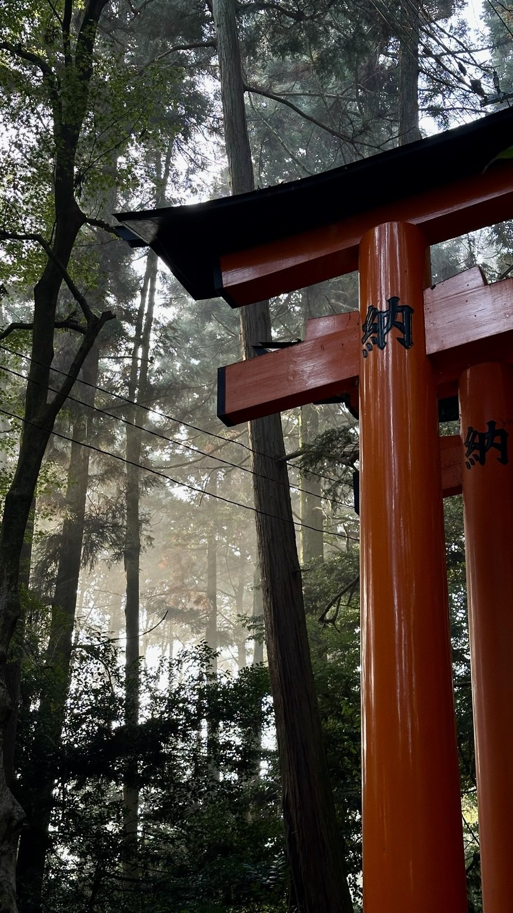
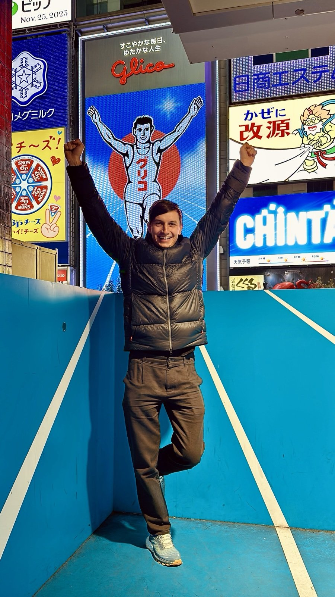
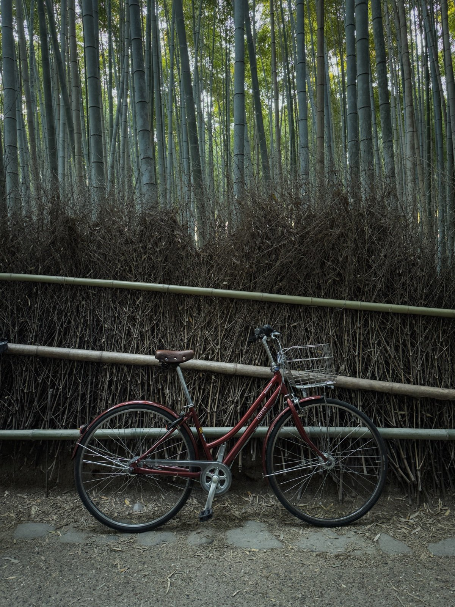
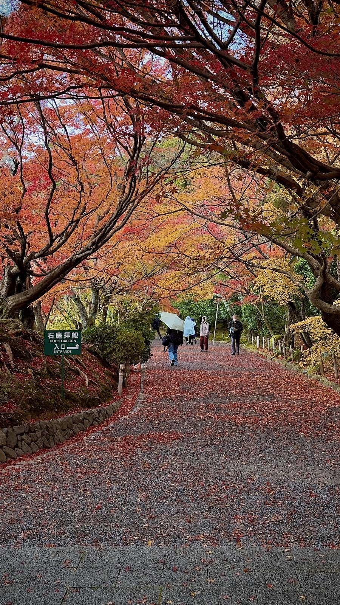

В 2026 году Золотая неделя складывается в **8 дней подряд** — с 29 апреля по 6 мая. Это редкий «идеальный» расклад: четыре национальных праздника лягут так, что вся страна уйдёт в отпуск без перерыва. Туристов это должно интересовать ровно по одной причине — это самые дорогие и самые забитые дни в Японии за весь год.

Сам я ехать на Золотую неделю не советую — и в [главном гайде по Японии](/blog/japan-guide-2026/) ставлю красный флажок на эти даты. Но раз вы уже здесь — значит либо рассматриваете поездку именно на эти числа, либо случайно купили билеты и теперь не понимаете, во что ввязались. Разберу обе ситуации.

> **Если коротко:** в 2026 году Золотая неделя — **29 апреля — 6 мая**, 8 дней подряд. Цены на отели в Токио растут до **×3** от средних, синкансены забиты, многие магазины и музеи закрыты на 1–4 дня (по данным [JNTO Lodging Statistics за GW 2024](https://www.jnto.go.jp/statistics/data/visitor-trends/)). Реальная альтернатива — **середина мая** (после 8 мая) или **июнь до начала цую**. Если уже купили билеты — стратегия в разделе ниже.

> По некоторым ссылкам в гайде можно сразу забронировать или оформить — цена для вас та же, а блог получает небольшую комиссию. Это держит его бесплатным. Такие ссылки помечены реклама.

> **Дисклеймер:** на Золотой неделе сам в Японии не был. В Японии бывал в другие сезоны (момидзи, сакура до пика), а на Golden Week ехать осознанно избегал. Этот пост — компиляция данных из официальных источников: правительственного сайта праздников Японии, JNTO, прайс-листов японских сетей отелей и опыта читателей. Все факты — со ссылками.

---

## Точные даты Золотой недели 2026

В 2026 году раскладка такая:

| Дата | День недели | Праздник |
|---|---|---|
| **29 апреля** | среда | Showa Day (昭和の日) — день рождения императора Сёва |
| 30 апреля | четверг | рабочий, но многие компании дают выходной-мост (англ. bridge holiday) |
| 1 мая | пятница | рабочий, но выходной-мост — фактически выходной |
| 2 мая | суббота | выходной |
| **3 мая** | воскресенье | Constitution Memorial Day (憲法記念日) |
| **4 мая** | понедельник | Greenery Day (みどりの日) |
| **5 мая** | вторник | Children's Day (こどもの日) |
| **6 мая** | среда | substitute holiday — переносится с воскресенья 3 мая |

Источник: [официальный список праздников Японии, Cabinet Office](https://www.cao.go.jp/chosei/shukujitsu/gaiyou.html).

То есть формальные праздничные дни — **29 апреля, 3–6 мая**, но из-за того что 30 апреля и 1 мая попадают между ними, бизнес массово закрывается на все 8 дней. Это так называемый **«Super Golden Week»** (в японской прессе — スーパーゴールデンウィーク, «суперзолотая неделя») — раскладка которая случается в среднем раз в 5–7 лет. В 2027-м её уже не будет: 29 апреля будет четверг, и подряд получится только 3 праздника.

---

## Насколько вырастут цены в Японии на Золотую неделю?

Короткий ответ: дорого. Длинный — насколько именно.

### Отели

По данным [JNTO Lodging Statistics Survey](https://www.jnto.go.jp/statistics/data/visitor-trends/) за апрель–май 2024 (последний сезон с полной статистикой), **средний прайс на отель 4* в Токио в Golden Week превышает обычный апрельский почти в 2.5 раза**. По моим выборкам цен на агрегаторах:

- **APA Hotel Shinjuku** в обычные дни апреля — 11 000 ¥/ночь, на 1–5 мая — 28 000–32 000 ¥
- **Mitsui Garden Yotsuya** в апреле — 18 000 ¥, на пиковые даты — 45 000–55 000 ¥
- **Park Hyatt Tokyo** в апреле — 75 000 ¥, на 3–5 мая — 180 000–220 000 ¥

То есть цены растут не равномерно ×2.5, а особенно жёстко на 3–5 мая (центр Золотой недели). На 29 апреля и 6 мая чуть мягче — ×1.5–2.

**Бронировать отели на Golden Week нужно за 4–6 месяцев минимум.** За 1–2 месяца остаётся только премиум-сегмент или пригороды. За 2 недели — практически ничего, кроме капсульных отелей по 8000 ¥ (которые в обычные дни — 3500 ¥). Бронировать удобно через Ostrovok — японские отели в каталоге все, карты МИР принимает, Booking из РФ — нет. <a href="https://ostrovok.tpk.mx/w4cAS1wZ?erid=2VtzqvE1cv3" class="aff-cta" rel="sponsored">Забронировать отель на Golden Week</a>реклама

**Или готовый тур «всё включено»** — если не собирать отель и перелёт по частям. Пакет из Москвы — <a href="https://travelata.tpk.mx/Do2A3cgV?erid=2VtzqufPtiT" class="aff-cta" rel="sponsored">Подобрать тур в Японию</a>реклама: в высокий сезон туроператор часто выкупает блоки мест заранее, поэтому пакет на пиковые даты бывает дешевле раздельной брони, оплата картой МИР.

### Авиабилеты

По данным Aviasales и Skyscanner, средняя цена туда-обратно Москва — Токио (NRT/HND) с пересадкой (<a href="https://aviasales.tpk.mx/JCSPlC17?erid=2Vtzqxkn4LF&u=https%3A%2F%2Fwww.aviasales.ru%2F%3Forigin_iata%3DMOW%26destination_iata%3DTYO" class="aff-cta" rel="sponsored">найти билет Москва — Токио</a>реклама — сравнивает все авиакомпании сразу, cookie 30 дней, можно забронировать позже):

- Низкий сезон (январь, февраль): **$500–650**
- Обычный апрель / июнь: **$700–900**
- **Golden Week 2026 (вылет 28–29 апреля, обратно 5–7 мая): $1100–1500**

Цены на рейсы японских авиакомпаний (ANA, JAL) внутри страны (Токио → Окинава, Токио → Sapporo (Хоккайдо)) на эти даты — ×3–4 от обычных. Такие билеты лучше брать сильно заранее или вообще не лететь — дешевле взять синкансен, который тоже подорожает, но не в разы.

### Синкансены

Цены на синкансены **не меняются** — тариф фиксированный. Но проблема в другом: **зарезервированные места (reserved seats) разлетаются за недели**, а в нерезервированный вагон в пиковые дни (3–5 мая) попасть физически нельзя — толпы стоят на вокзале часами.

Бронировать места в синкансене нужно через [SmartEX](https://smart-ex.jp/en/) или JR-офис **ровно за 30 дней до даты поездки** — раньше система не открывает резерв. Делать это в первый же день когда открывается окно.

> **Точный бюджет под твои даты:** [калькулятор поездки](/calculator/) — закладывай Golden Week-надбавку через выбор «премиум» уровня, иначе расчёт получится в 2 раза заниженный.

---

## Что закрыто и что работает в Японии на Golden Week?

Распространённый миф: «вся Япония закрывается». Это не совсем так. Что реально не работает:

**Малый бизнес:**
- Семейные рестораны и ресторанчики в районах вне центра (Асакуса, Янака) — часть закрывается на 3–5 дней. Ищите вывески 休業 (kyūgyō, «закрыто»)
- Местные музеи и небольшие галереи — расписание стоит проверять заранее на официальных сайтах

**Государственные учреждения:**
- Посольства и консульства — закрыты 29 апреля и 3–6 мая
- Почтовые отделения работают в ограниченном режиме
- Банки закрыты, но банкоматы Seven Bank в 7-Eleven работают как обычно

**Что работает 100%:**
- Все крупные сетевые отели и рестораны
- Метро и поезда (расписание выходного дня, поезда чаще)
- Музеи национального уровня (Tokyo National Museum, Edo-Tokyo Museum, Kyoto National Museum) работают, но с очередями на вход 30–90 минут
- Универмаги и торговые центры (Don Quijote, Bic Camera, Yodobashi, Mitsukoshi) — работают, и активнее обычного из-за внутреннего туризма
- 7-Eleven, Lawson, FamilyMart, Tsutaya — 24/7 как всегда
- Парки развлечений (Disneyland, Universal Studios) — работают, но это пик посещаемости года, очереди по 4–6 часов на топ-аттракционы

Источник: [japan-guide.com — Golden Week details](https://www.japan-guide.com/e/e2270.html).

---

## Что специально посмотреть в Golden Week

Если уж едете — Golden Week сам по себе праздничный период с фестивалями, которых в другое время не будет.

**5 мая — Children's Day и фестиваль Koinobori.** По всей Японии вывешивают **карповые флаги** (鯉のぼり) — символ силы и стойкости, традиционно для мальчиков. Самые масштабные точки:
- **Tokyo Tower** — сотни флагов на пешеходной зоне
- **Tatebayashi (Гумма)** — рекорд Гиннеса, 5000+ флагов над рекой
- **Kazo (Сайтама)** — гигантский 100-метровый карп

**Фестиваль Hakata Dontaku в Фукуоке (3–4 мая).** Один из крупнейших в стране, **парад с 3 миллионами участников**. Если уже вылетаете не в Токио — Фукуока более тихий вариант, и там этот фестиваль становится главным событием.

**Sanja Matsuri в Асакусе.** Не всегда совпадает по датам — в 2026 проводится **15–17 мая** ([официальный сайт](https://www.asakusajinja.jp/sanjamatsuri/)) — на GW не попадает, перенесён на 15–17 мая. Это главный фестиваль Токио.

**Сакура на Хоккайдо.** К началу мая цветение доходит до Хоккайдо (Sapporo, Hakodate), и это **последний шанс года увидеть сакуру**. Если в основной Японии она к этому времени уже опала, на севере — пик. Билеты Токио — Sapporo на синкансене дорогие, но летать ANA/JAL быстрее (2 часа вместо 4).

---

## Что делать если уже купили билеты на эти даты

Что можно сделать:

**1. Не сидите в Токио или Киото.** Самые дорогие и забитые точки. Если у вас 8 дней — потратьте 2–3 на Токио, остальные на менее очевидные направления:
- **Канадзава** (Hokuriku Shinkansen, 2.5 часа от Токио) — самурайский квартал, Кенроку-эн (один из трёх лучших садов Японии), морепродукты
- **Такаяма и Ширакава-го** (Японские Альпы) — деревня в стиле gasshō-zukuri, объект ЮНЕСКО, в Golden Week там теплее обычного
- **Мацумото** — замок на воде, недалеко от Нагано
- **Никко** (2 часа от Токио) — храмы Тошогу, водопады

В этих городах Golden Week ощущается мягче — толпы есть, но не такие как в Токио, и цены растут на 30–50%, а не в 2.5 раза (по выборкам Rakuten Travel за GW 2024: Канадзава — +35%, Такаяма — +50% к среднему апрелю).

**2. Бронируйте ВСЁ заранее.** Каждый ужин в нормальном ресторане — бронь через [Tabelog](https://tabelog.com/en/) или TableCheck минимум за 2 недели. На входе в популярные точки без резерва даже не пустят.

**3. Не пытайтесь использовать общественный транспорт в пиковые часы.** Метро Токио в 17–19 часов 3–5 мая — давка platform rush, на платформе ждать 2–3 поезда чтобы влезть. Передвигайтесь между 11–14, 21–23 часами, или вечерним такси (которое тоже подорожает на 30–50%, но в любом случае дешевле истерики).

**4. Закладывайте +50% к бюджету.** Если рассчитывали на $150/день — будет $225. Это дополнительные ~$1500 на пару за 8 дней. Если эта сумма ощутимая — стоит ещё раз подумать о смене дат.

> **Точный расчёт под Golden Week:** в [калькуляторе бюджета](/calculator/) выбирай «премиум» уровень и +30% к перелёту. Реальную сумму увидишь сразу, без сюрпризов на месте.

---

## Когда лучше ехать в Японию вместо Золотой недели?

**Сразу после Golden Week — со 2-й недели мая.** Цены падают резко: к 8–10 мая отели возвращаются к обычным апрельским тарифам, или даже ниже. Сакура отцвела, но погода уже стабильно тёплая (+22–25°C), без сезона дождей. **Лучший компромисс мая** — 10–25 мая: цены −40% к GW, погода +22–25°C, но сакуры уже нет — для неё ехать в апреле.

**Конец мая — начало июня.** До начала сезона дождей цую (середина июня) — окно с тёплой сухой погодой, низкими ценами и почти без туристов. Я в [таблице сезонов](/seasons/) пометил это окно как «хорошо» именно поэтому.

**Конец сентября — октябрь.** Жара спадает, тайфуны заканчиваются (последний обычно в начале октября), цены обычные. Ещё не момидзи, но +22–26°C, влажность падает с летних 80% до 60–65%, очередей в храмы Киото в 2–3 раза меньше августовских.

**Лучший месяц для первой поездки в Японию — ноябрь.** Об этом в [главном гайде](/blog/japan-guide-2026/) подробно: момидзи, сухо, +18°C, цены в полтора раза ниже Golden Week (по выборкам Ostrovok ноябрь 2024 vs Golden Week 2024).

---

## FAQ

**Какие майские праздники в Японии 2026?**
В 2026 году в мае четыре национальных праздника: **3 мая** — Constitution Memorial Day (День Конституции), **4 мая** — Greenery Day (День Зелени), **5 мая** — Children's Day (День Детей), **6 мая** — substitute holiday (компенсация за 3 мая, выпавшее на воскресенье). Плюс **29 апреля** — Showa Day. Подряд получается **8 выходных дней с 29 апреля по 6 мая** — это и называется «Золотая неделя» (Golden Week, ゴールデンウィーク).

**Какой праздник 6 мая в Японии в 2026?**
6 мая 2026 — **substitute holiday (振替休日)**. По японскому закону если национальный праздник выпадает на воскресенье, ближайший рабочий понедельник становится выходным. **Constitution Memorial Day 3 мая 2026 — это воскресенье**, поэтому компенсационный выходной переносится на среду 6 мая (4 и 5 мая — собственные праздники: Greenery Day и Children's Day). На 6 мая закрыты банки, госучреждения, многие малые бизнесы; крупные сети, метро и достопримечательности работают.

**7 мая 2026 в Японии — рабочий день?**
**Да, 7 мая 2026 — обычный рабочий четверг** в Японии. Золотая неделя заканчивается 6 мая. С 7 мая офисы открыты, отели возвращаются к плановым ценам в течение 2–3 дней (полностью — к 8–10 мая), синкансены свободны без брони, очереди в музеи и парки спадают. 7 мая — первый день, когда отели уже сбросили GW-наценку, а синкансены свободны без брони.

**Когда Золотая неделя в Японии в этом году?**
В **2026 году — с 29 апреля (среда) по 6 мая (среда)**, 8 дней подряд. Это редкий «Super Golden Week», случается раз в 5–7 лет. В 2027-м расклад слабее: подряд только 4 + 3 дня с рабочей серединой. В 2028-м — снова сильный год благодаря удачному выпадению дней недели.

**Есть ли прямые рейсы Россия — Япония в 2026?**
**Нет, прямых рейсов из России в Японию в 2026 нет** и в обозримом будущем не будет. Aeroflot отменил рейсы Москва → Токио в марте 2022, Japan Airlines и ANA не возобновляли. Все варианты — с пересадкой: через **Стамбул** (Turkish Airlines) — самый частый, **Дубай** (Emirates), **Доху** (Qatar), **Пекин/Шанхай** (Air China, China Eastern — иногда самый дешёвый вариант с одной пересадкой), **Сеул** (Korean Air, Asiana). Время в пути — 14–22 часа, цена туда-обратно $500–900 в обычные даты, $1100–1500 на Golden Week.

**Стоит ли вообще ехать в Японию на Золотую неделю?**

Если у вас нет жёсткого ограничения по датам — нет. Цены ×2.5–3, толпы максимальные, очереди в музеи и парки 1–4 часа. Если есть гибкость — сдвинуть даже на одну неделю (5–13 мая вместо 29 апреля — 6 мая) сэкономит на отелях −40–50%, на авиабилетах −20–30%, рестораны на тех же ценах — суммарно −30–40% к бюджету.

**Что если уже купил билеты и не вернуть?**

Коротко: уехать из Токио на 5–6 из 8 дней, бронировать рестораны заранее, +50% к бюджету. Подробно — [раздел «Что делать если уже купили билеты»](#что-делать-если-уже-купили-билеты-на-эти-даты) выше.

**Какие даты Золотой недели в 2027 году?**

В 2027-м расклад менее удачный: 29 апреля — четверг, 3 мая — понедельник, 5 мая — среда. Подряд получится 4 дня (29 апреля – 2 мая) и 3 дня (3–5 мая) с рабочей серединой. Это «слабая» Золотая неделя — толпы и цены тоже растут, но не как в 2026.

**Когда открывается бронирование синкансенов на Golden Week?**

За **30 дней до даты поездки**, через [SmartEX](https://smart-ex.jp/en/) или в JR-офисе. Раньше нельзя — система просто не открывает резерв. На 3–5 мая места разлетаются за 1–3 дня после открытия. Бронировать в день открытия, в первые часы.

**Можно ли вернуть/обменять билеты на синкансен если планы поменялись?**

Да, до отправления — за комиссию ~330 ¥ при обмене и 30% при возврате. Бронирование через SmartEX делает это удобнее всего — всё через приложение, без очередей в JR-офис.

**Действует ли Tax Free 10% во время Golden Week?**

Да, [Tax Free](/blog/japan-guide-2026/#-бюджет-деньги-и-tax-free) работает как обычно при покупке от 5000 ¥ с предъявлением паспорта. Расходники запечатают в пакет, открывать до вылета нельзя.

**Где смотреть актуальные карповые флаги в Токио?**

Главные точки — Tokyo Tower (центр) и парк Shinjuku Gyoen. Большинство флагов вывешиваются с 25–28 апреля и снимаются 6–8 мая. В пригородах (Tatebayashi в Гумме) сезон длиннее — с середины апреля.

---

## Что делать дальше

* [Главный гайд по Японии 2026](/blog/japan-guide-2026/) — бюджет, отели, транспорт, что нельзя ввозить
* [Виза в Японию для россиян](/blog/japan-visa-2026/) — пошагово, бесплатно, JVAC 970 ₽
* [Сезоны для путешествий](/seasons/) — выбирай месяц по погоде и ценам, не только для Японии
* [Калькулятор бюджета поездки](/calculator/) — точная цифра под твои даты и уровень комфорта
* [@traveltriberu](https://t.me/traveltriberu) — разборы стран и поездок в Telegram

---

*Актуально на: 9 мая 2026. Даты праздников проверены по [официальному списку Cabinet Office](https://www.cao.go.jp/chosei/shukujitsu/gaiyou.html). Цены на отели и перелёты — выборки с агрегаторов (Ostrovok, Aviasales, Skyscanner) и [JNTO Lodging Statistics](https://www.jnto.go.jp/statistics/data/visitor-trends/). Рекомендации по фестивалям — [japan-guide.com](https://www.japan-guide.com/e/e2270.html) и [JNTO](https://www.jnto.go.jp/).*
