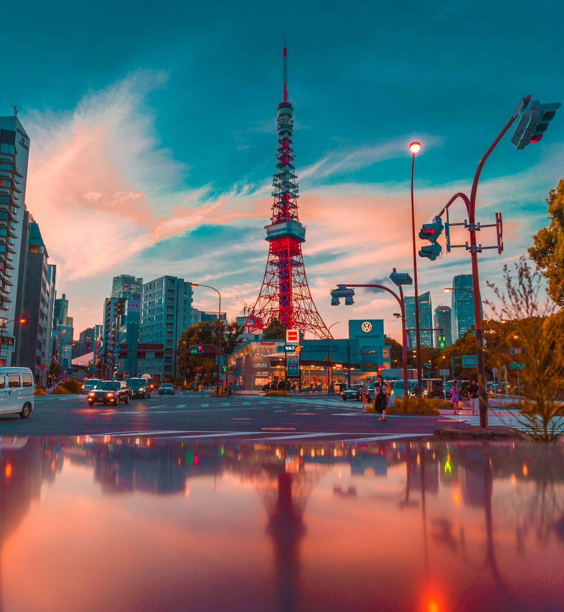
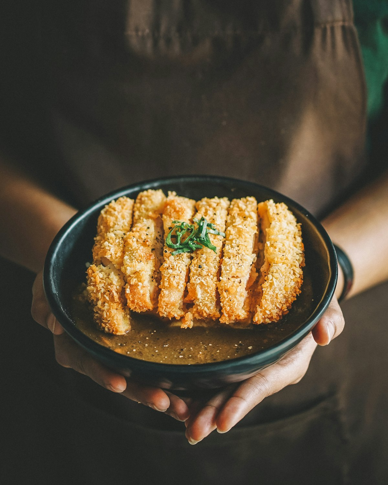
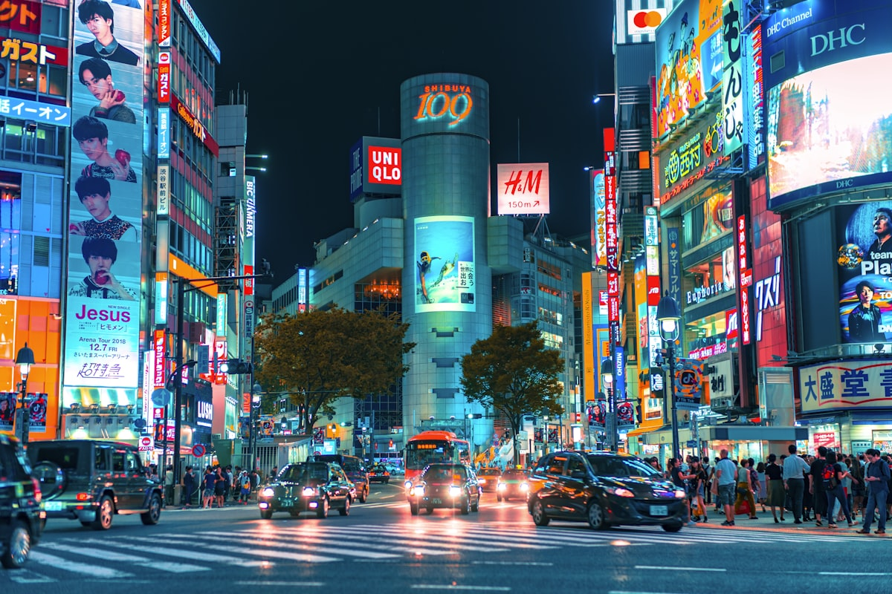
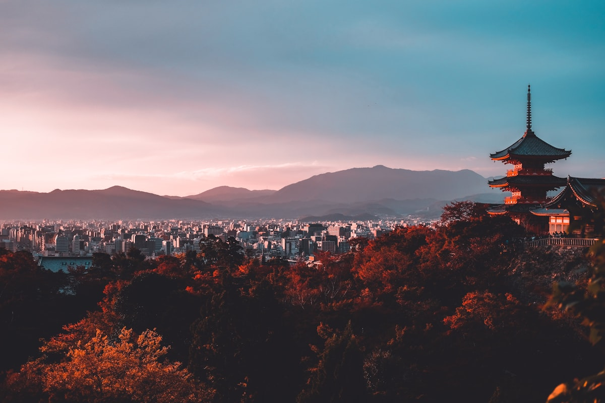

Никаких лирических отступлений про сакуру — только хардкорная выжимка для тех, кто едет в Японию первый раз и хочет не облажаться.

Япония сейчас — одна из самых лояльных стран для россиян: бесплатная виза, низкий процент отказов, иена слабая. Но требует подготовки — здесь много непривычного: от кодеина в аптечке (запрещён) до правил поведения в метро.

> **Когда лучше ехать:** [таблица сезонов Японии](/seasons) — пик весной (сакура) и осенью (момидзи), летом изнуряюще жарко.

---

## 🌤 Когда ехать (сезоны и погода)

* **Весна (март–май):** Сакура. Пик туристического сезона — отели бронируются за полгода, цены максимальные.
* **Осень (октябрь–ноябрь):** Момидзи (красные клёны). Сухо, тепло, идеальная погода. Я бы выбрал этот сезон — не так толпно, как весной, а виды не хуже.
* **Лето (июнь–август):** Жара до +38°C, влажность 100%, сезон дождей цую. Ехать только ради восхождения на Фудзи или летних фестивалей.
* **🚩 Золотая неделя (конец апреля–начало мая):** Вся страна уходит в отпуск. Толпы, билеты раскуплены, цены ×3. Избегайте этих дат — экономия колоссальная.

---

## 🛂 Виза и документы

* **Стоимость:** консульский сбор **0 ₽**. Платите только за услуги визового центра (970 ₽ в Москве/СПб, до 2500 ₽ в регионах).
* **Сроки:** 4–7 рабочих дней (в сезон сакуры до 14).
* **Главное отличие от Шенгена:** нужен **Itinerary** — таблица с расписанием по дням (Дата — Отель — План).
* **Финансы:** выписка с остатком из расчёта **минимум $100/день**. Идеал — от $2000 на счёте.

> **Подробный пошаговый чек-лист с актуальными правилами 2026:** [виза в Японию для россиян](/blog/japan-visa-2026) — там разобрано, какие документы реально требуют, и почему отели больше не нужно выкупать.

---

## 💰 Бюджет, деньги и Tax Free

Япония сейчас дешевле Европы из-за слабого курса иены. На себе проверял — еда в Токио дешевле, чем в Москве в среднем ресторане.

### Бюджет в день
* **Эконом:** $50–60
* **Комфорт:** $100–150

### Цены на еду
* Завтрак в комбини (7-Eleven, Lawson): **$3–5**
* Обед — рамен, карри, удон: **$6–9**
* Суши на конвейере (Kaiten): **$10–15**

### Жильё
APA Hotel или Toyoko Inn — сетевые бизнес-отели, **$50–80/ночь** на двоих. Номера 12 кв.м., но в центре, чистота как в операционной.

### Деньги
* **Снятие наличных:** банкоматы **Seven Bank ATM** в любом 7-Eleven — самые надёжные для зарубежных карт, работают 24/7 на английском.
* **Tax Free 10%:** работает прямо на кассе при покупке от 5000 иен. Нужен оригинал паспорта. Расходники запечатают в специальный пакет — вскрывать до вылета нельзя, проверяют на таможне.

> **Считаешь поездку?** [Калькулятор бюджета](/calculator) — закладывает перелёт из Москвы, отель и питание под выбранный уровень комфорта.

---

## 🚇 Транспорт и магия багажа

* **JR Pass больше не нужен.** В 2023 подорожал на 70%. На маршруте «Токио–Киото–Осака–Токио» дешевле купить разовые билеты на синкансен.
* **Suica / Pasmo** — обязательная транспортная карта. Работает как кошелёк для метро, автобусов и магазинов. Выпускается виртуально в **Apple Wallet** прямо с iPhone — не надо стоять в очереди в аэропорту.
* **Takkyubin (доставка чемоданов).** За $15–20 чемодан из отеля Токио доедет до отеля Киото к утру. Ищите логотип чёрного кота — это Yamato. Едете между городами налегке с одним рюкзаком.
* **Крупный багаж в синкансенах:** если сумма размеров чемодана больше 160 см — нужно бронировать специальное место oversized baggage заранее, иначе не пустят в вагон.

---

## 📱 Связь, розетки, здоровье

* **Интернет:** eSIM (Airalo, Ubigi) — берите до вылета. 10 GB ~$15–18. В аэропорту физическая SIM в 2 раза дороже. Та же схема работает [на Хайнане](/blog/hainan-guide-2026), только там eSIM ещё и обходит китайский файрвол.
* **Навигация:** Google Maps — лучший инструмент. Показывает номер платформы, стоимость, нужный вагон для пересадки. Точность ±10 секунд.
* **Розетки:** тип A (100V, два плоских штырька). Нужен переходник — обычный евровилочный не подойдёт.
* **Вода:** из-под крана пить безопасно везде.
* **Лекарства на границе:** **корвалол, кодеин, амфетамины запрещены к ввозу**. За корвалол депортируют — реальные кейсы россиян. Только базовая аптечка в заводских упаковках.

---

## 🛑 Чего делать НЕЛЬЗЯ

* **Чаевые под запретом.** Строго 0%. Оставите деньги на столе — официант выбежит, вернёт «забытое».
* **Мусорок на улицах нет.** Весь мусор с собой до отеля или комбини. Сортировка строгая, штрафы реальные.
* **Еда на ходу — дурной тон.** Купили у лотка — съешьте стоя рядом. Жевать бургер на ходу могут только туристы.
* **Татуировки в онсэнах.** В 90% традиционных бань вход с тату закрыт. Ищите *tattoo-friendly* или приватные купальни (kashikiri) — стоят дороже, но без вопросов.
* **Тишина в транспорте.** В поездах нельзя говорить по телефону. Звонки — только беззвучный режим.
* **Безопасность:** забыли телефон в кафе — в 99% случаев он там же через час. Не трогайте чужие потерянные вещи — сдайте в полицию или администратору.

---

## ❓ FAQ

**Когда лучше первый раз ехать в Японию?**
Конец октября–ноябрь. Сухо, +20°C, момидзи, никаких толп Золотой недели и сакурного сезона.

**Сколько денег брать?**
$2000 на счету для визы + наличными ~$200 на первый день. Остальное снимать через Seven Bank ATM по мере надобности.

**Можно ли расплачиваться российскими картами?**
Visa/Mastercard российских банков — нет. JCB и UnionPay некоторых банков — местами. План: основная — иностранная карта, страховка — наличные.

**Сколько времени закладывать на Японию?**
Минимум 10 дней. Маршрут: 3 дня Токио — 1 день Хаконе — 2 дня Киото — 1 день Нара — 1 день Осака — 2 дня запаса. За 7 дней успеваете только Токио + Киото галопом.

---

## Что делать дальше

* 🇯🇵 [Подробный гайд по визе](/blog/japan-visa-2026) — список документов, требования к выписке, новые правила 2026
* 📅 [Сезоны для Японии](/seasons) — выбирай месяц по погоде и ценам
* 💸 [Калькулятор бюджета](/calculator) — посчитай поездку с реальным курсом
* 🇨🇳 [Альтернатива — Хайнань](/blog/hainan-guide-2026) — если хочется тропики и без визы
* 📲 [@traveltriberu](https://t.me/traveltriberu) — разборы стран без воды в Telegram

---

*Актуально на: 30 апреля 2026. Цены, требования к визе и правила ввоза проверены по официальным источникам и подтверждены практикой.*
