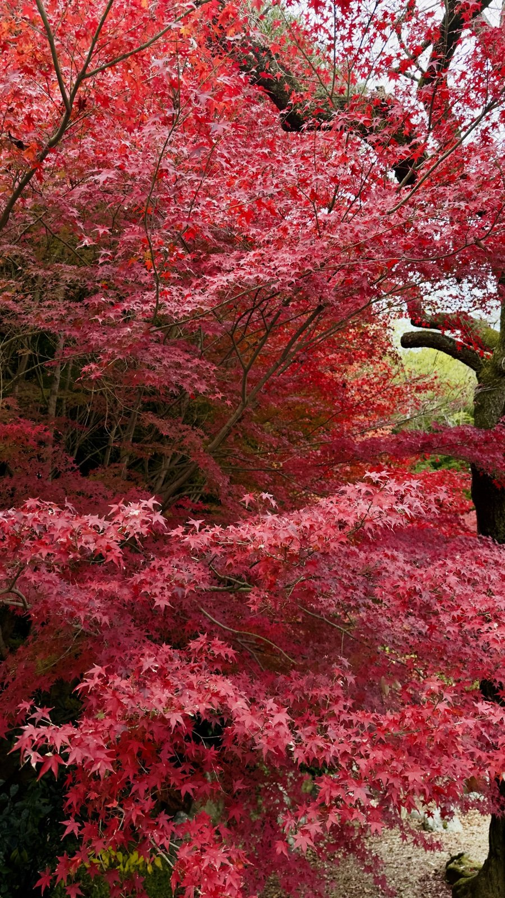

Никаких лирических отступлений про сакуру — только хардкорная выжимка для тех, кто едет в Японию первый раз и не хочет облажаться.

Япония сейчас — одна из самых лояльных стран для россиян: бесплатная виза, низкий процент отказов, иена слабая. Но требует подготовки: тут много непривычного. От корвалола в аптечке (запрещён, депортируют) до правил поведения в метро (по телефону не говорят).

> **Если коротко:** виза **бесплатна** (сервис JVAC 970 ₽), отказы <5%. Лучший сезон — **октябрь–ноябрь** (момидзи), избегать Золотой недели 29.04–05.05. Бюджет — от **$50/день** (эконом) до **$300+** (премиум). JR Pass с 2023 не нужен. Минимум 10 дней на Golden Route.

> **Когда лучше ехать:** [таблица сезонов Японии](/seasons/) — пик весной (сакура) и осенью (момидзи), летом изнуряюще жарко.

---

## Когда ехать (сезоны и погода)

* **Весна (март–май):** сакура. Пик туристического сезона — отели бронируются за полгода, цены максимальные. Цветение длится 1–2 недели и зависит от широты: Токио и Киото — конец марта–начало апреля, Хоккайдо — начало мая.
* **Осень (октябрь–ноябрь):** момидзи (красные клёны). Сухо, тепло, идеальная погода. Я бы выбрал этот сезон — не так толпно, как весной, виды не хуже. Пик в Киото — середина-конец ноября.
* **Лето (июнь–август):** жара до +38°C, влажность 100%, сезон дождей цую (середина июня — середина июля). Ехать только ради восхождения на Фудзи (открыт 1 июля – 10 сентября) или летних фестивалей.
* **🚩 Золотая неделя (29 апреля – 5 мая):** вся страна уходит в отпуск. Толпы, билеты раскуплены, цены ×3. Избегайте этих дат — экономия колоссальная.
* **🚩 Обон (середина августа):** второй национальный отпуск. Те же толпы и цены.

---

## Аэропорты Токио и трансфер

В Токио два международных аэропорта, и какой выбрать — решает прямо логистика поездки.

**Narita (NRT)** — основной для дальних рейсов, до центра 60 км. Варианты доехать:

* **Narita Express (N'EX):** до Tokyo Station — 53 минуты, 3070 ¥ (~1450 ₽). Самый быстрый JR-вариант.
* **Skyliner:** до Ueno — 41 минута, 2580 ¥. Самый быстрый, если едете в северный Токио.
* **Limousine Bus:** до главных отелей — 60–90 минут, 3600 ¥. Удобно с большим багажом.

**Haneda (HND)** — ближе к городу, многие азиатские рейсы:

* **Tokyo Monorail + JR Yamanote:** до центра — 30 минут, 660 ¥.
* **Keikyu Line:** до Shinagawa — 15 минут, 327 ¥.

**Курс йены на 30.04.2026: 100 ¥ ≈ 47 ₽** (по [ЦБ РФ](https://www.cbr.ru/)). Иена сильно ослабла за последние пару лет — это лучшее время для поездки в Японию за десятилетие.

Билеты Москва → Токио (NRT/HND) с пересадкой через Дубай или Стамбул — от $500 туда-обратно в низкий сезон. Сравнивать удобно через [Aviasales](https://www.aviasales.ru/?marker=546042.Zz66f13c16ff6b488883a4127-546042&market=ru) — там видны все стыковочные варианты с фильтром по багажу.

---

## Виза и документы

* **Стоимость:** консульский сбор **0 ₽**. Платите только за услуги визового центра — 970 ₽ в Москве/СПб, до 2500 ₽ в регионах.
* **Сроки:** 4–7 рабочих дней (в сезон сакуры до 14).
* **Главное отличие от Шенгена:** нужен **Itinerary** — таблица с расписанием по дням (Дата — Отель — План).
* **Финансы:** выписка с остатком из расчёта **минимум $100/день**. Идеал — от $2000 на счёте.

> **Подробный пошаговый чек-лист с актуальными правилами 2026:** [виза в Японию для россиян](/blog/japan-visa-2026/) — там разобрано, какие документы реально требуют и почему отели больше не нужно выкупать.

---

## Где жить в Токио — районы

Выбор района = удобство всей поездки. Метро в Токио огромное, но логистика сильно проще, если вы рядом с одной из главных станций кольцевой линии Yamanote.

* **Shinjuku** — деловой и ночной центр, лучший узел метро. Шиндзюку Стейшн — самая загруженная станция в мире, выходов под 200, потеряться легко. База для первой поездки.
* **Shibuya** — молодёжный, шопинг, знаменитый перекрёсток, рядом Harajuku. Дороже Шиндзюку.
* **Asakusa** — старый Токио, храм Сэнсо-дзи, традиционные рёканы. Дешевле, тише, но дальше до развлечений.
* **Ginza** — премиум-шопинг, дорогие отели Mandarin Oriental, Peninsula. Скучновато для туриста, но рядом Tsukiji и Tokyo Station.
* **Ueno** — рядом со станцией Skyliner до Narita, парки, музеи. Бюджетные хостелы и отели.
* **Akihabara** — район электроники и аниме. Тематический, не для большинства.

### Сети отелей по бюджету

* **Эконом ($50–80/ночь, 12 кв.м.):** APA Hotel, Toyoko Inn, Hotel Mystays — японские бизнес-сети, чисто и в центре.
* **Средний ($100–180):** Mitsui Garden Hotels, Dormy Inn (с онсэном на крыше!), Hotel Gracery (с Годзиллой в Шиндзюку).
* **Премиум ($300+):** Park Hyatt Tokyo, Mandarin Oriental, Peninsula, Aman Tokyo.

**Где бронировать.** Booking из РФ почти мёртв. Я беру через [Ostrovok](https://ostrovok.tpk.mx/w4cAS1wZ) — принимает Visa/MC/МИР, японские отели в каталоге все, плюс программа Guru со скидками до 40%. Подходит и для брони под визу.

---

## Бюджет, деньги и Tax Free

Япония сейчас дешевле Европы из-за слабого курса иены. На себе проверял — еда в Токио дешевле, чем в Москве в среднем ресторане. Серьёзно: миска рамена в чистом заведении в центре — $7, в Москве сейчас не найдёшь.

### Бюджет в день

| Уровень | USD | Иена | Что входит |
|---|---|---|---|
| **Эконом** | $50–60 | 5500–6500 ¥ | APA Hotel, рамен, комбини, метро |
| **Комфорт** | $100–150 | 11 000–16 500 ¥ | 4* отель, izakaya, такси иногда |
| **Премиум** | $300+ | 33 000+ ¥ | Рёкан с кайсэки, такси, премиум-рестораны |

### Цены на еду

* Завтрак в комбини (7-Eleven, Lawson, FamilyMart) — **$3–5** (300–550 ¥).
* Обед — рамен, карри, удон — **$6–9** (700–1000 ¥).
* Суши на конвейере (Kaiten Sushi) — **$10–15** (1100–1700 ¥).
* Ужин в средней izakaya — **$25–40** (2800–4500 ¥).
* Кайсэки в рёкане — **$80–200** (9000–22 000 ¥).

### Деньги

**Снятие наличных.** Банкоматы Seven Bank ATM в любом 7-Eleven — самые надёжные для зарубежных карт, работают 24/7 на английском. Альтернатива — Japan Post Bank ATM в почтовых отделениях.

**Tax Free 10%.** Работает прямо на кассе при покупке от 5000 иен (~2350 ₽). Нужен оригинал паспорта. Расходники запечатают в специальный пакет — вскрывать до вылета нельзя, проверяют на таможне.

> **Считаешь поездку?** [Калькулятор бюджета](/calculator/) — закладывает перелёт из Москвы, отель и питание под выбранный уровень комфорта.

---

## Транспорт и магия багажа

**JR Pass больше не нужен.** В 2023 подорожал на 70%. На маршруте «Токио–Киото–Осака–Токио» дешевле купить разовые билеты на синкансен Nozomi: Tokyo → Kyoto за 14 170 ¥ (~6700 ₽), 2 ч 15 мин.

**IC-карты для метро.** Suica (JR East), Pasmo (Tokyo Metro/частные), ICOCA (Кансай) — все три работают по всей Японии. Suica и Pasmo выпускаются виртуально в Apple Wallet — не надо стоять в очереди в аэропорту. На Android — только физическая карта.

**Takkyubin (доставка чемоданов).** За $15–20 чемодан из отеля Токио доедет до отеля Киото к утру. Ищите логотип чёрного кота — это [Yamato Transport](https://www.global-yamato.com/en/). Едете между городами налегке с одним рюкзаком, и это меняет всё ощущение от поездки.

**Крупный багаж в синкансенах.** Если сумма размеров чемодана больше 160 см — нужно бронировать специальное место (oversized baggage) заранее, иначе не пустят в вагон.

### Идеальный 10-дневный маршрут (Golden Route)

| Дни | Город | Что смотреть | Перемещение |
|---|---|---|---|
| 1–3 | **Токио** | Сэнсо-дзи (Асакуса), Shibuya Crossing, Akihabara, парк Уэно, Shinjuku | — |
| 4 | **Хаконе** | Онсэны, Фудзи, озеро Аси, Open-Air Museum | Tokyo → Hakone, 40 мин |
| 5–6 | **Киото** | Фусими-Инари, Киёмидзу-дэра, Гион, Арасияма | Hakone → Kyoto, 2 ч |
| 7 | **Нара** | Тодай-дзи, ручные олени | Kyoto → Nara, 45 мин |
| 8 | **Осака** | Дотонбори, такояки, замок Осаки | Nara → Osaka, 15 мин |
| 9–10 | **Токио** | Запас на покупки и недосмотренное | Osaka → Tokyo, 2.5 ч |

Весь маршрут связан синкансеном Nozomi. Добавьте Хиросиму на 11–12-й день, если есть время.

---

## Связь, розетки, здоровье

* **Интернет:** eSIM на [Airalo](https://airalo.tpk.mx/bqFZxtCL) — берите до вылета. 10 GB ~$15–18. В аэропорту физическая SIM в 2 раза дороже. Та же схема работает [на Хайнане](/blog/hainan-guide-2026/), только там eSIM ещё и обходит китайский файрвол.
* **Навигация:** Google Maps — лучший инструмент в Японии. Показывает номер платформы, стоимость, нужный вагон для пересадки. Точность ±10 секунд, не шутка.
* **Розетки:** тип A (100 V, два плоских штырька). Нужен переходник — обычный евровилочный не подойдёт. В 5* отелях обычно есть универсальные розетки.
* **Вода:** из-под крана пить безопасно везде, даже в провинции.
* **Лекарства на границе:** **корвалол, кодеин, амфетамины запрещены к ввозу**. За корвалол депортируют — реальные кейсы россиян. Только базовая аптечка в заводских упаковках. Список запрещённых веществ — на [сайте Минздрава Японии (Yakkan Shoumei)](https://www.mhlw.go.jp/english/topics/import/index.html).

---

## Чего делать НЕЛЬЗЯ

**Чаевые под запретом.** Строго 0%. Оставите деньги на столе — официант выбежит, вернёт «забытое». Тут это считается оскорблением.

**Мусорок на улицах нет.** Весь мусор с собой до отеля или комбини. Сортировка строгая, штрафы реальные.

**Еда на ходу — дурной тон.** Купили у лотка — съешьте стоя рядом. Жевать бургер на ходу могут только туристы.

**Татуировки в онсэнах.** В 90% традиционных бань вход с тату закрыт. Ищите *tattoo-friendly* (есть карта на сайте Tattoo-Friendly Japan) или приватные купальни (kashikiri) — стоят дороже, но без вопросов.

**Тишина в транспорте.** В поездах нельзя говорить по телефону. Звонки — только в беззвучном режиме, в синкансенах есть отдельные телефонные тамбуры между вагонами.

**Безопасность.** Забыли телефон в кафе — в 99% случаев он там же через час. Не трогайте чужие потерянные вещи — сдайте в полицию (kōban) или администратору.

---

## FAQ

**Когда сезон дождей в Японии в 2026?**
Сезон дождей (цую, 梅雨) в 2026 году ожидается **с середины июня по середину июля**: на Хонсю — примерно с 7–10 июня по 18–22 июля, на Кюсю — с конца мая, на Хоккайдо цую почти не бывает. Точные даты Японское метеоагентство объявляет за неделю до начала. Дожди не круглосуточные — обычно ливни 1–2 часа в день, потом солнце. Влажность 80–95%, температура +25–28°C. Это не «убийственный» сезон, но фотографии под серым небом, мокрые камни в храмах. Если выбираешь между «сезон дождей» и «жара августа +38» — июнь приятнее.

**Что такое момидзи и когда красные клёны в Японии в 2026?**
Момидзи (紅葉) — японская традиция любования красными клёнами осенью, аналог сакурного ханами весной. **В 2026 году пик ожидается:** Хоккайдо — конец сентября — начало октября, Тохоку — середина октября, Токио и Киото — **середина–конец ноября** (примерно 15–30 ноября), Кюсю — конец ноября — начало декабря. Лучшие точки в Киото — Эйкан-до, Тофуку-дзи, Арасияма; в Токио — парк Синдзюку-Гёэн, сад Рикугиэн. Сезон длится 2–3 недели в каждом регионе. Это **лучший месяц для первой поездки в Японию** — погода сухая, тёплая (+18°C), цены ниже сакурного пика.

**Есть ли прямые рейсы Россия — Япония в 2026?**
**Нет, прямых рейсов нет** и в обозримом будущем не будет. Aeroflot отменил рейсы Москва ↔ Токио в марте 2022, ANA и JAL не возобновляли. Все варианты — с пересадкой: через **Стамбул** (Turkish Airlines, самый частый), **Дубай** (Emirates, лучший сервис), **Доху** (Qatar), **Пекин/Шанхай** (Air China, China Eastern — иногда самый дешёвый), **Сеул** (Korean Air, Asiana). Время в пути 14–22 часа. Цена туда-обратно: $500–900 в обычные даты, $1100–1500 на пик (Golden Week, момидзи, НГ). Сравнить актуальные цены и пересадки удобнее всего через [Aviasales](https://www.aviasales.ru/?marker=546042.Zz66f13c16ff6b488883a4127-546042&market=ru) — он агрегирует все эти авиакомпании в одной выдаче.

**Действует ли Tax Free в Японии в 2026?**
Да, **Tax Free** на 10% действует на покупки от **5 000 ¥ за день в одном магазине** при предъявлении загранпаспорта на кассе. Категории: одежда, электроника, косметика, сувениры. Расходники (косметика, продукты) запечатают в специальный пакет, открывать до вылета из Японии нельзя. Чеки прикрепляют в паспорт — на таможне в аэропорту проверяют. С 2025 года порядок упростили: оформление через QR-код в большинстве крупных сетей (Yodobashi, Bic Camera, Don Quijote, Mitsukoshi) — буквально 1 минута на кассе.

**Сколько можно находиться в Японии без визы?**
**Нисколько.** Япония не даёт безвиз для граждан России в 2026 году. Любая поездка — только по визе. Один из частых мифов: «60 стран дают безвиз России, Япония в их числе». Это устаревшая информация — она действовала до 1990-х, сейчас уже нет. Для въезда в Японию нужна туристическая виза (бесплатная, JVAC 970 ₽, отказы <5%) — [подробный пошаговый гайд](/blog/japan-visa-2026/).

**Когда лучше первый раз ехать в Японию?**
Конец октября–ноябрь. Сухо, +20°C, момидзи, никаких толп Золотой недели и сакурного сезона. Альтернатива — конец марта (сакура), но цены и толпы ×2.

**Сколько денег брать?**
$2000 на счету для визы + наличными ~$200 (≈22 000 ¥) на первый день. Остальное снимать через Seven Bank ATM по мере надобности.

**Можно ли расплачиваться российскими картами?**
Visa/Mastercard российских банков — нет. JCB и UnionPay некоторых банков — местами. План: основная — иностранная карта, страховка — наличные.

**Сколько времени закладывать на Японию?**
Минимум 10 дней (Golden Route выше). За 7 дней успеваете только Токио + Киото галопом, без Нары и Осаки. За 14 дней можно добавить Хиросиму или Хоккайдо.

**Стоит ли брать рёкан с онсэном?**
Хотя бы одну ночь — да, обязательно. Лучшие места — Хаконе, Никко, Кусацу. $200–400/ночь с ужином-кайсэки и завтраком.

---

## Что делать дальше

* 🇯🇵 [Подробный гайд по визе](/blog/japan-visa-2026/) — список документов, требования к выписке, новые правила 2026
* 📅 [Сезоны для Японии](/seasons/) — выбирай месяц по погоде и ценам
* 💸 [Калькулятор бюджета](/calculator/) — посчитай поездку с реальным курсом
* 🇨🇳 [Альтернатива — Хайнань](/blog/hainan-guide-2026/) — если хочется тропики и без визы
* 🇪🇺 [Шенгенская виза 2026](/blog/schengen-visa-2026/) — сравни требования с японской
* 🛂 [EES биометрия в Шенгене](/blog/ees-shengen-2026/) — в Японии этого нет, в Европе теперь есть
* 📲 [@traveltriberu](https://t.me/traveltriberu) — разборы стран без воды в Telegram

---

*Актуально на: 30 апреля 2026. Цены, требования к визе и правила ввоза проверены по официальным источникам — [посольство Японии в РФ](https://www.ru.emb-japan.go.jp/itpr_ru/visa.html) и [Минздрав Японии](https://www.mhlw.go.jp/english/topics/import/index.html). Курс йены — [ЦБ РФ](https://www.cbr.ru/).*

*Часть ссылок партнёрские (Aviasales, Airalo, Ostrovok). Цена для тебя не меняется — мы получаем небольшую комиссию.*
