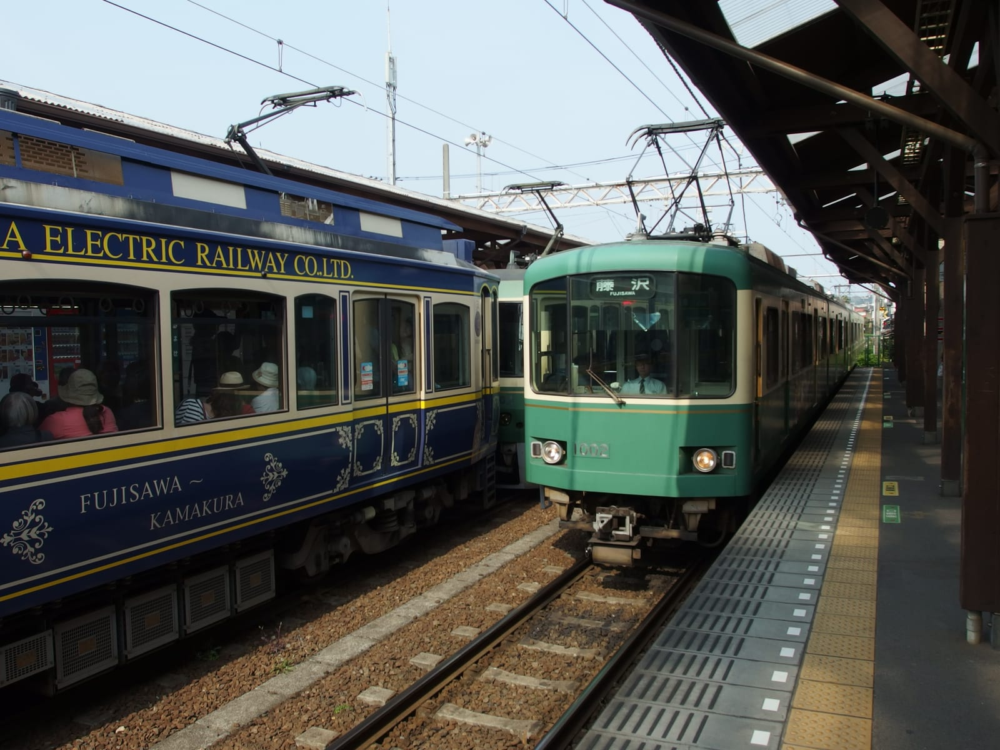
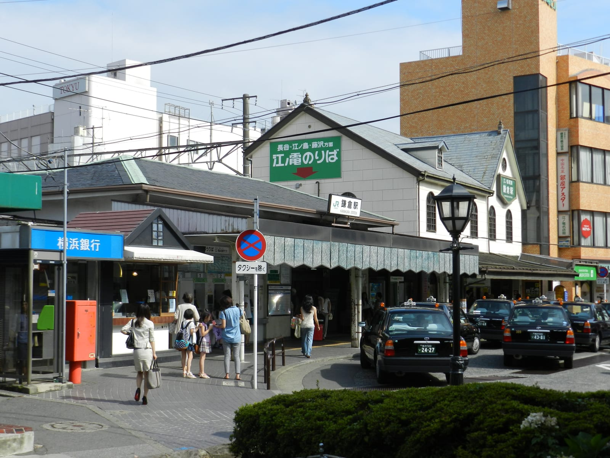
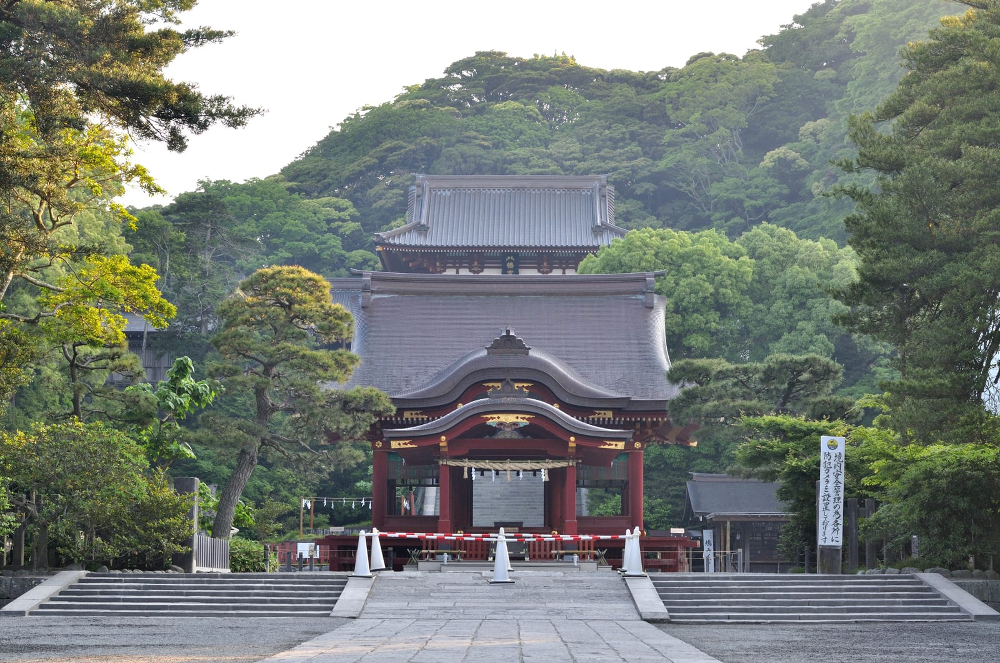
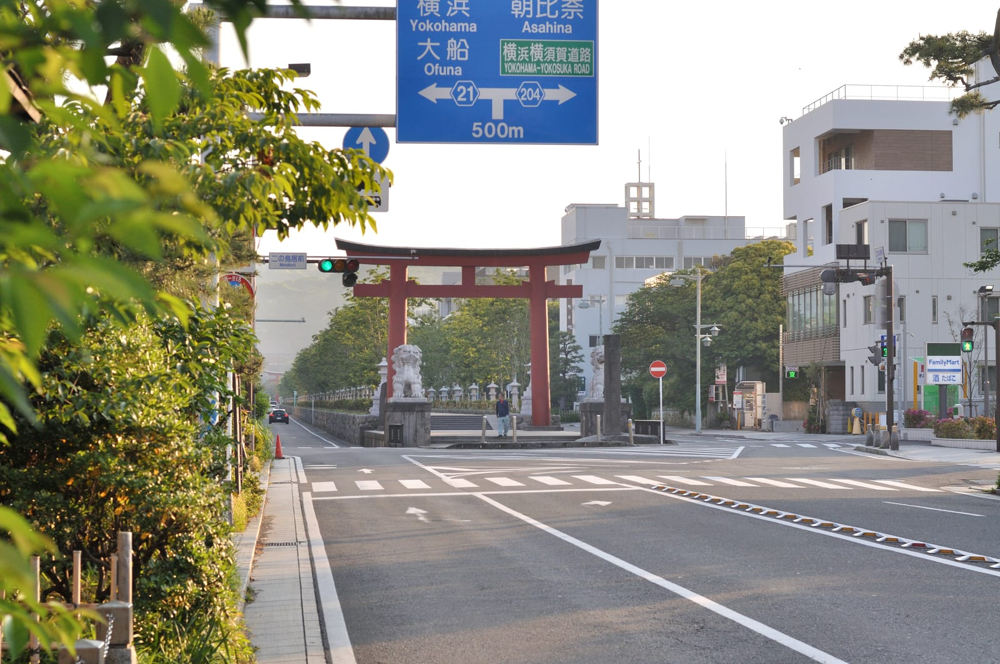
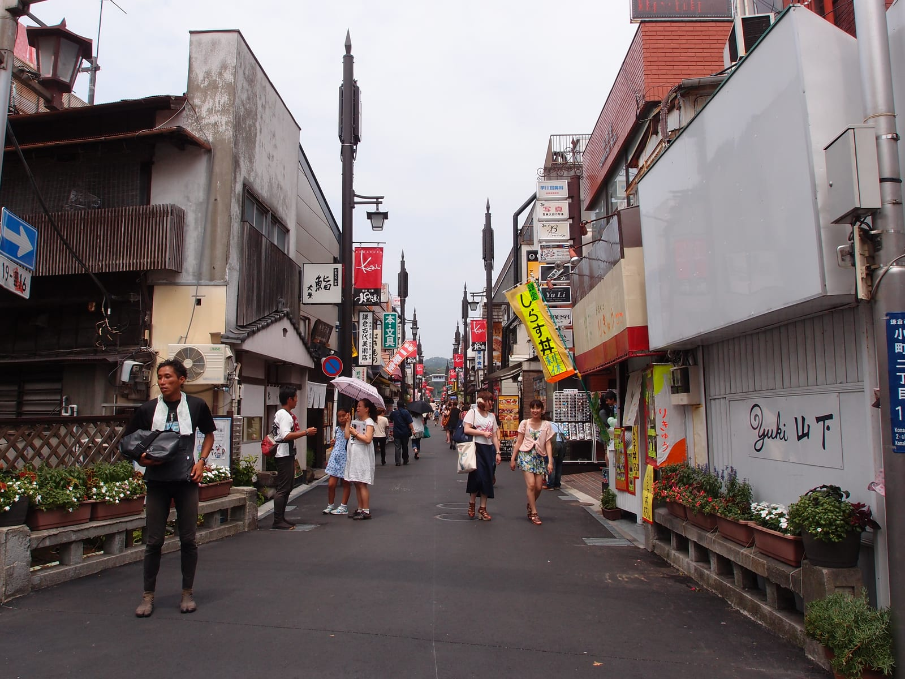
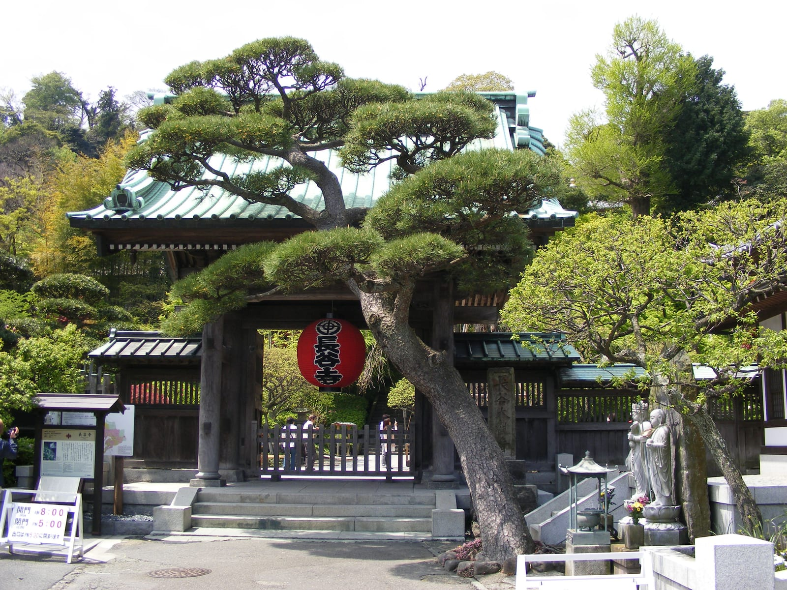
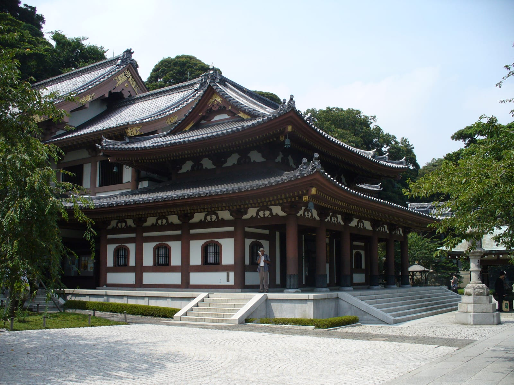
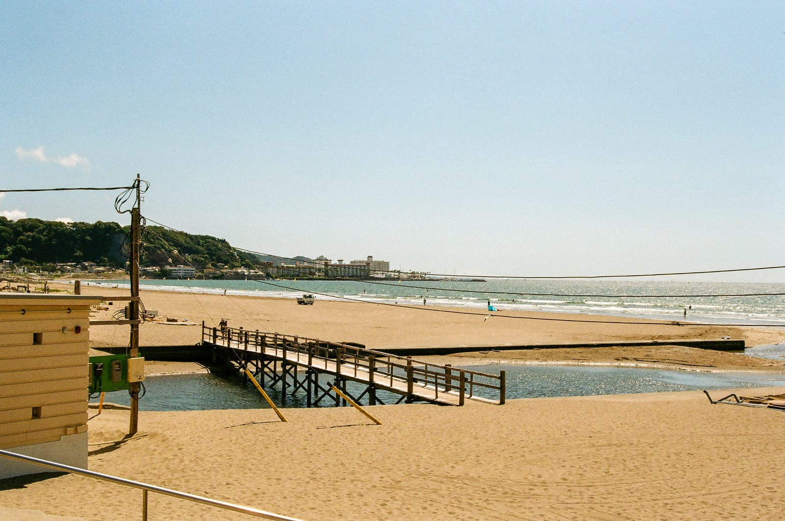
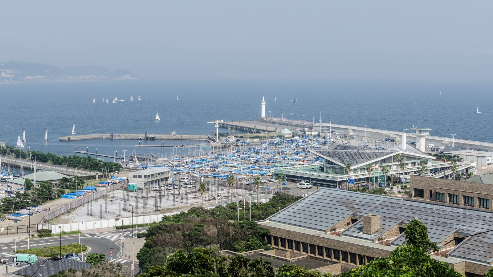

import { ostrovokCity } from '../../data/affiliate.js';

export const kamakuraStay = ostrovokCity('japan', 'kamakura', 'kamakura_overnight');

**За один день в Камакуре можно посмотреть святилище Цуругаока Хатимангу, Большого Будду, храм Хасэдэра и выйти к морю.** Из центра Токио дорога поездом занимает примерно час, но зависит от станции отправления. Эносиму лучше оставить на второй день или заменить ею часть храмов: добавлять остров в конец насыщенной прогулки неудобно.

В Камакуре бронзовый Будда сидит под открытым небом, между домами проходит небольшой поезд Enoden, а от храмового района можно дойти до песчаного берега. Сюда едут за сменой ритма после Токио. Однако «небольшой город» не означает, что все точки стоят вокруг одной площади: святилище, район Хасэ и остров Эносима требуют отдельных переездов.

Этот маршрут рассчитан на первый визит без машины. В нём есть две опорные точки — станция Kamakura и станция Hase. Сначала выберите, откуда поедете из Токио, затем решите, нужен ли остров. Покупать проездной до этого решения рано: его выгодность зависит от дороги, а не от количества красивых мест на карте.

*На обложке — Большой Будда Камакуры. Фото: RobMyersAI / [Wikimedia Commons](https://commons.wikimedia.org/w/index.php?curid=132047946), [CC BY-SA 4.0](https://creativecommons.org/licenses/by-sa/4.0/). Архивный кадр обрезан.*

## Как добраться из Токио: JR или Odakyu через Фудзисаву

Для храмов и моря удобная конечная точка первого переезда — **станция Kamakura**. Из района Tokyo Station ищите маршрут JR Yokosuka Line. Из других районов столицы сравните дорогу от своего отеля целиком: путь пешком до станции, пересадки и прибытие. Обещание «час от Токио» не включает любой адрес внутри огромного города.

Не выбирайте поезд только по названию линии: проверьте конечную станцию конкретного рейса и необходимость пересадки в навигаторе перевозчика. Утренний план должен заканчиваться прибытием в Kamakura, а не в соседний город с дальнейшим поиском транспорта. Для поездки туда и обратно по JR сравнивайте отдельные билеты или оплату подходящей транспортной картой; проездной Odakyu эти участки не покрывает.

Другой путь начинается на Shinjuku у Odakyu и идёт через Fujisawa. Оттуда в сторону Камакуры следует Enoden. Этот вариант имеет смысл, если вы строите поездку вокруг побережья, хотите пользоваться Enoden несколько раз или включаете Эносиму. Для визита только к Будде и возвращения в отель рядом с Tokyo Station дорога через Фудзисаву может оказаться лишним объездом.

У Shinjuku несколько железнодорожных операторов. Билет с названием города не превращается в билет на каждый из них: для Odakyu ищите вход и платформу Odakyu, для JR — соответствующий маршрут JR. Общие вопросы подготовки собраны в [гайде по Японии](/blog/japan-guide-2026/), а документы — в [инструкции по японской визе](/blog/japan-visa-2026/). Здесь важен выбор дороги на один день.

*Enoden на станции Hase. Фото: Guilhem Vellut / [Wikimedia Commons](https://commons.wikimedia.org/w/index.php?curid=149165391), [CC BY 2.0](https://creativecommons.org/licenses/by/2.0/). Архивный кадр.*

*Здание станции Kamakura и площадь перед входом. Фото: Dr. Koto / [Wikimedia Commons](https://commons.wikimedia.org/w/index.php?curid=20382777), [CC BY](https://creativecommons.org/licenses/by/3.0/). Архивный кадр.*

## Что покрывает Enoshima-Kamakura Freepass за 1640 иен

Однодневный [Enoshima-Kamakura Freepass от Shinjuku](https://odakyu-global.com/passes/enoshima-kamakura-freepass/) стоит **1640 иен для взрослого — около 878 ₽**. В билет входят поездка туда и обратно по Odakyu от выбранной станции и неограниченные поездки в указанной оператором местной зоне: Odakyu между Fujisawa и Katase-Enoshima, а также линия Enoden. Это билет на транспорт, входы в храмы оплачиваются отдельно.

При оплате картой или обмене наличных фактическая сумма будет другой. Рубли помогают оценить порядок расходов; покупать билет предстоит за иены по тарифу оператора.

Freepass не действует на JR. Если утром вы едете из Tokyo Station в Kamakura по JR, а вечером хотите вернуться тем же путём, цена 1640 иен не описывает стоимость вашей поездки. Можно построить смешанный маршрут, но тогда участки вне покрытия считаются отдельно. Начните со схемы перемещений, а не с попытки любой ценой «отбить» билет.

Romancecar тоже требует внимания: на поезд с резервируемыми местами нужен дополнительный билет к базовому проезду. Freepass сам по себе не означает забронированное кресло в экспрессе. Для обычного дневного маршрута сначала сравните обычные поезда и время прибытия; комфорт экспресса имеет смысл выбирать осознанно, с учётом доплаты.

Если вы начинаете поездку в Fujisawa, взрослый Freepass от этой станции стоит 810 иен, около 434 ₽. Это другая точка старта, поэтому дешёвый местный вариант нельзя сравнивать с билетом от Shinjuku без стоимости дороги до Фудзисавы. Для детей у оператора отдельные тарифы и возрастные условия.

## Маршрут на день: утром Хатимангу, затем Хасэ и море

Практический порядок для прибытия по JR — Kamakura, Цуругаока Хатимангу, возвращение к станции, Enoden до Hase, Хасэдэра и Большой Будда, затем прогулка к берегу. Два платных храма держите в середине дня: у них есть часы последнего входа. Пляж и ужин не стоит ставить перед объектом, ради которого вы приехали.

Время ниже — план прогулки, а не расписание поездов и не обещание отсутствия очередей. Сдвигайте его под фактическое прибытие. Если к 13:00 вы только выходите из поезда в Камакуре, начинайте с района Hase и сокращайте утреннюю часть. Попытка сохранить каждую строку после позднего старта превращает поездку в постоянную проверку часов.

| Часть дня | Что успевает сложиться |
|---|---|
| 09:00–11:00 | Прибытие в Kamakura, прогулка к Хатимангу и обратно |
| 11:00–12:00 | Переезд на Enoden до Hase, обед или короткая остановка |
| 12:00–15:00 | Хасэдэра и Котоку-ин с Большим Буддой |
| 15:00–16:30 | Берег Юигахама, если позволяет погода и осталось желание гулять |
| После 16:30 | Возвращение к станции и поезд в Токио |

Между храмами в районе Hase нет необходимости каждый раз возвращаться на поезд. Котоку-ин указывает около пяти минут пешком до Хасэдэра; от станции Hase до самого Котоку-ин — около семи минут. Эти короткие переходы удобнее объединить в одну прогулку. В расчёт не входят остановки у магазинов, фотографии и очереди на вход.

Поездку по линии Enoden воспринимайте как часть маршрута, но не как гарантию места у окна. Если главная цель — увидеть храм, не откладывайте выход ради «ещё одной красивой остановки». Обратную дорогу можно сделать спокойнее после завершения платной части программы.

## Цуругаока Хатимангу: начать прогулку со святилища

Хатимангу подходит для первой части дня, когда вы прибыли на станцию Kamakura. Это отдельная точка маршрута, а не ещё одно название храма с Большим Буддой. Сначала пройдите к святилищу, затем возвращайтесь в сторону станции: так движение к Hase не придётся разрывать поездкой обратно через весь центр.

Не пытайтесь за одно утро включить каждое соседнее святилище и музей. Для первого визита полезнее оставить время на сам комплекс и дорогу, чем вычеркнуть их после пяти минут у входа. Если посещение религиозных зданий — главная цель поездки, сократите пляж; если едете с детьми, заранее выберите одну дополнительную остановку и обсудите, где будет обед.

*Цуругаока Хатимангу. Фото: Ocdp / [Wikimedia Commons](https://commons.wikimedia.org/w/index.php?curid=59313469), [CC0](https://creativecommons.org/publicdomain/zero/1.0/). Архивный кадр.*

На территории действующего святилища ориентируйтесь на местные указатели: доступность отдельного помещения и возможность фотографировать не следуют из того, что вход во двор открыт. Для спокойной прогулки оставьте рюкзак компактным и не останавливайтесь посреди прохода ради снимка. Дополнительные экспозиции в расчёт ниже не включены.

*Красные ворота тории на улице Камакуры. Фото: Ocdp / [Wikimedia Commons](https://commons.wikimedia.org/w/index.php?curid=59313465), [CC0](https://creativecommons.org/publicdomain/zero/1.0/deed.en). Архивный кадр.*

## Комати-дори: обед без лишнего возвращения в центр

Комати-дори удобно соединить с прогулкой от станции к Хатимангу. Это место для еды и магазинов, а не обязательный музейный пункт с фиксированной длительностью. Если вы хотите обстоятельный обед, поставьте его после святилища до поездки в Hase. Если предпочитаете перекус, не превращайте каждую витрину в отдельную остановку, съедающую часы работы храмов.

Не закладывайте в план конкретный ресторан без проверки его дня отдыха и режима кухни. В этой статье нет «среднего чека Камакуры»: он мало помогает человеку, который выбирает между полноценным обедом и едой навынос. Разумнее выделить собственный бюджет на питание отдельно от билетов и заранее понять, нужен ли вам стол в помещении.

При поездке небольшой компанией договоритесь о времени выхода с улицы: покупки легко занимают весь остаток утра. Тем, кому магазины неинтересны, удобнее использовать район для обеда и идти дальше.

*Магазины и пешеходы на Комати-дори в Камакуре. Фото: Guilhem Vellut from Annecy, France / [Wikimedia Commons](https://commons.wikimedia.org/w/index.php?curid=149110835), [CC BY](https://creativecommons.org/licenses/by/2.0/). Архивный кадр.*

## Хасэдэра: сад, храм и лестницы

Хасэдэра находится примерно в пяти минутах пешком от станции Hase. Взрослый вход стоит 400 иен, около 214 ₽; детский билет для возраста 6–11 лет — 200 иен, около 107 ₽. Перед поездкой проверяйте билеты на [странице посещения Хасэдэра](https://www.hasedera.jp/guide/).

С июля по март храм открыт с 08:00 до 17:00, последний вход — в 16:30. С апреля по июнь закрытие в 17:30, вход до 17:00. Для сентябрьской поездки ориентир — первый режим. Время закрытия и время прекращения продажи входных билетов различаются: прибыть к воротам в 16:55 не означает успеть осмотреть комплекс.

*Вход в Хасэдэра, апрель 2010 года. Фото: Țetcu Mircea Rareș / [Wikimedia Commons](https://commons.wikimedia.org/w/index.php?curid=10440606), [CC BY 2.5](https://creativecommons.org/licenses/by/2.5/). Архивный кадр.*

Для планирования имеет значение рельеф: посещение не сводится к ровной дорожке от ворот. Лестницы и подъёмы могут изменить темп группы. При ограниченной подвижности заранее уточняйте доступность нужной части комплекса у самого храма; общее слово «доступно» в путеводителе не описывает каждую площадку и каждую ступень.

Не привязывайте поездку к цветению по фотографии в статье. Архивный сад показывает место, но не состояние растений в ваш день. У цветочных сезонов и обычной осенней прогулки разные ожидания. Если едете ради конкретного цветения, проверьте сообщения храма и будьте готовы изменить дату; для маршрута с Буддой, садом и морем такая зависимость слабее.

*Зал Каннон в храме Хасэдэра. Фото: Junichi / [Wikimedia Commons](https://commons.wikimedia.org/w/index.php?curid=1197646), [CC BY-SA](https://creativecommons.org/licenses/by-sa/3.0/). Архивный кадр.*

## Большой Будда в Котоку-ин: вход и посещение внутри

Большой Будда находится в Котоку-ин. Взрослый билет на территорию стоит 300 иен, около 161 ₽. Посещение внутри статуи оплачивается отдельно — ещё 50 иен, около 27 ₽. Не складывайте в одну цену вход в комплекс и дополнительное посещение, если оно вам не нужно или временно недоступно.

По [обычному расписанию Котоку-ин](https://kotoku-in.jp/en/) с апреля по сентябрь открыт с 08:00 до 17:30, с октября по март — до 17:00. Вход прекращается за пятнадцать минут до закрытия. Для посещения внутри статуи отдельное окно: 08:00–16:30, вход до 16:20. Поэтому «храм ещё открыт» и «можно зайти внутрь Будды» — разные вопросы.

Сначала проверьте сообщения о временных ограничениях на сайте храма. При сильной непогоде обычные часы не гарантируют работу: перенос посещения по ситуации лучше, чем дорога к закрытым воротам. Тот же принцип относится к Enoden и выбранному поезду из Токио. Состояние транспорта проверяйте утром, а не только при составлении маршрута за месяц.

У Будды можно провести короткую остановку или задержаться, рассматривая статую с разных сторон. Не резервируйте весь остаток дня под объект с близким временем закрытия. Если выбираете между внутренним посещением и спокойной прогулкой к морю, это выбор интереса, а не обязательная часть «полного» билета. Отказ от одной дополнительной опции не делает маршрут незавершённым.

## Юигахама: закончить день у моря

Юигахама даёт маршруту то, чего не хватает храмовой прогулке: открытый горизонт и возможность сменить темп. Планируйте берег как прогулку, а не как обещание купания. Погода, волна, сезонная инфраструктура и местные ограничения определяют, уместно ли заходить в воду. Видимые в море сёрферы не подтверждают безопасность купания для любого посетителя.

*Юигахама в 2024 году. Фото: Klaasjeoranje / [Wikimedia Commons](https://commons.wikimedia.org/w/index.php?curid=177868315), [CC BY-SA 4.0](https://creativecommons.org/licenses/by-sa/4.0/). Архивный кадр.*

После двух храмов берег можно сократить до короткой прогулки. Не заставляйте всю группу проводить здесь час только потому, что он стоит в таблице. В ветреный или дождливый день логичнее вернуться к станции, поесть в помещении и уехать раньше. Камакура не перестаёт быть состоявшейся поездкой, если в ней нет пляжной части.

Обратную дорогу выбирайте до того, как ушли далеко по берегу. Сравните путь к ближайшей подходящей станции с пешим возвращением в центр и учтите покрытие своего билета. Для семьи с уставшим ребёнком лишняя пересадка может быть хуже небольшой разницы в цене; для владельца Freepass удобнее сохранить маршрут внутри оплаченной зоны.

## Стоит ли добавлять Эносиму в тот же день

Эносима подходит тем, кому важнее побережье и прогулка по острову, чем полный набор храмов Камакуры. Однако это не точка в нескольких шагах от Большого Будды. В программе появляется ещё один переезд, отдельная прогулка и своя дорога обратно. При позднем старте лучше заменить островом Хатимангу или один из платных храмов, чем сжимать каждый визит.

Для первого дня выберите одну из двух логик: «Камакура с морем» или «побережье с Эносимой». Во втором случае Freepass Odakyu и Enoden соответствует географии поездки лучше, но не избавляет от необходимости сравнить конкретные поезда. Входы в отдельные объекты на острове в расчёт этой статьи не включены.

Если хотите и подробную Камакуру, и остров без спешки, рассмотрите ночёвку. Смотрите расположение относительно станции и условия заселения: название города само по себе не означает удобную пешую дорогу с багажом. Для раннего выезда с чемоданом близость к нужной линии бывает полезнее вида из окна.

<a href={kamakuraStay} target="_blank" rel="sponsored noopener noreferrer">Сравнить жильё в Камакуре на Островке</a> — для ночёвки между храмами и отдельным днём на побережье. Цену, способ оплаты и отмену смотрите на свои даты.

*Гавань Эносимы и море. Фото: DXR / [Wikimedia Commons](https://commons.wikimedia.org/w/index.php?curid=33039683), [CC BY-SA](https://creativecommons.org/licenses/by-sa/3.0/). Архивный кадр.*

## Четыре сценария: что убрать, если времени меньше

Для каждого сценария машина не нужна. Разница — в темпе, направлении движения и готовности отказаться от части списка. Выберите вариант до покупки проездного: иначе оплаченный билет начинает управлять прогулкой, хотя должен лишь помогать ей.

| Сценарий | Длительность и честный минус |
|---|---|
| Хатимангу, Хасэдэра, Будда, берег | Полный день из Токио. Потребуется ранний старт и несколько переходов |
| Хасэдэра и Большой Будда | Полдня в Камакуре плюс дорога. Центр и святилище останутся за рамками |
| Один храм, Enoden и Эносима | Полный день. Придётся сократить историческую часть Камакуры |
| Камакура и побережье с ночёвкой | Два дня. Добавляются расходы на отель и перемещение с багажом |

При дожде первым убирайте необязательное длительное пребывание на берегу. При позднем старте сокращайте число объектов с фиксированными часами входа. При усталости выбирайте ближайшую удобную станцию и возвращение, а не дальнюю точку «ради галочки». Это три разные причины изменения программы; универсальный запасной маршрут для них не нужен.

Если выбираете между Камакурой и [Никко на один день](/blog/nikko-iz-tokio-za-odin-den/), сравните желаемый день: здесь храмы соединяются с морем, там поездка строится вокруг храмового района и горного направления. Между выездами можно оставить городской день для отдыха от поездов.

## Сколько стоит маршрут без еды и отеля

Для взрослого с Freepass от Shinjuku и двумя платными храмами базовый расчёт — 2340 иен, около 1253 ₽. Это сумма 1640 + 400 + 300 иен. Она не является полной стоимостью дня: отдельно нужны питание, дополнительные билеты, возможные поездки вне зоны проездного и дорога от отеля до точки его действия.

| Расход | Взрослый билет |
|---|---|
| Freepass от Shinjuku, один день | 1640 иен ≈ 878 ₽ |
| Хасэдэра | 400 иен ≈ 214 ₽ |
| Котоку-ин | 300 иен ≈ 161 ₽ |
| Итого три позиции | 2340 иен ≈ 1253 ₽ |
| Внутри Большого Будды, по желанию | Ещё 50 иен ≈ 27 ₽ |

Если едете по JR, замените первую строку собственным расчётом дороги. Не прибавляйте Freepass автоматически к любому маршруту из Токио: это двойной счёт двух способов добраться до побережья. Для ребёнка пересчитайте каждую позицию по возрасту; скидки железной дороги и храмов нельзя считать одним общим процентом.

На два дня изменится прежде всего жильё и программа второго дня. Однодневный проездной не превращается в двухдневный из-за ночёвки. Перед оплатой сравните общий бюджет двух дней с двумя отдельными выездами из Токио и учтите, останется ли у вас оплаченная столичная гостиница. Иногда ночёвка покупает удобство, но не экономию.

## Что показывает один рассказ о поездке

В открытом [отчёте о посещении 7 июня 2025 года](https://yhunter.ru/blog/travel/japan-2025-2/) описаны прогулка вдоль моря, сёрферы и возвращение в Токио вечером. Пляжная инфраструктура тогда готовилась к сезону. Это полезное напоминание: берег можно включить в храмовый день, а готовность сезонных заведений следует проверять отдельно.

Проверен один отчёт, опубликованный 29 августа 2025 года. Такая выборка не позволяет судить о типичных очередях, заполненности поездов или частоте дождей. Транспортные детали здесь сверены по перевозчикам: личный рассказ помогает представить темп поездки, но не заменяет схему линий и действующие билеты.

## Частые вопросы о Камакуре

### Хватит ли одного дня из Токио?

Для Хатимангу, Хасэдэра, Большого Будды и короткой прогулки у моря одного полного дня хватит при раннем старте. Если хотите подробно гулять по Эносиме, посещать дополнительные музеи и сидеть на пляже без оглядки на часы, разделите программу на два дня.

### Можно ли посмотреть только Большого Будду?

Да. Езжайте до района Hase и оставьте остальное по желанию. Рядом находится Хасэдэра, поэтому эти два храма удобно объединить. Для короткого визита не требуется покупать проездной с неограниченными поездками: сравните его цену со своим фактическим маршрутом.

### Что удобнее из Токио: JR или Odakyu?

От Tokyo Station для Камакуры логично смотреть JR Yokosuka Line. От Shinjuku сравните варианты от своего отеля; Odakyu через Fujisawa удобен для маршрута с Enoden и Эносимой. Решающими остаются пересадки, время прибытия и покрытие билета, а не название перевозчика.

### Нужна ли машина в Камакуре?

Для описанного маршрута нет. Основные переезды проходят по железной дороге, между храмами района Hase можно идти пешком. Машина добавляет вопрос парковки и возвращения к ней. При ограниченной подвижности проверяйте конкретные подъезды и доступность объектов отдельно: отсутствие машины не означает отсутствия лестниц.

### Можно ли совместить Камакуру и Эносиму без ночёвки?

Можно, если сократить храмовую программу и начать рано. Выберите один основной храм, прогулку на Enoden и остров. Полный маршрут по Камакуре плюс обстоятельная Эносима — другой объём дня; в таком случае ночёвка даёт больше времени, но требует отдельного бюджета.

### Подходит ли Камакура для поездки с детьми?

Маршрут можно адаптировать: один храм, поезд и короткая прогулка у моря вместо всех объектов подряд. Учитывайте лестницы Хасэдэра, погоду и время отдыха. На берегу не считайте присутствие сёрферов разрешением на купание ребёнка; ориентируйтесь на местные условия и указатели.

### Что делать, если начался сильный дождь?

Проверьте сообщения перевозчиков и храмов, затем решите, стоит ли сохранять выезд. При обычном дожде можно сократить берег; при предупреждениях о тайфуне или остановке поездов обычное расписание теряет практический смысл. Не приезжайте к объекту только на основании часов в путеводителе.

### Сколько дней выбрать для первой поездки?

Один день подходит для первого знакомства с храмами и морем. Два дня позволяют выделить Эносиму отдельно и сократить число переездов за вечер. Если у вас мало времени на Токио, сначала оцените, какую городскую программу вы заменяете второй ночёвкой у побережья.
