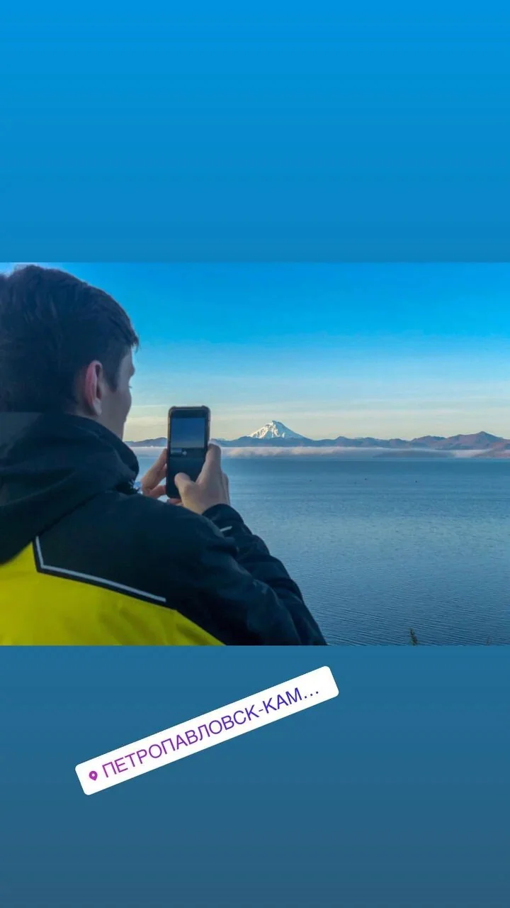
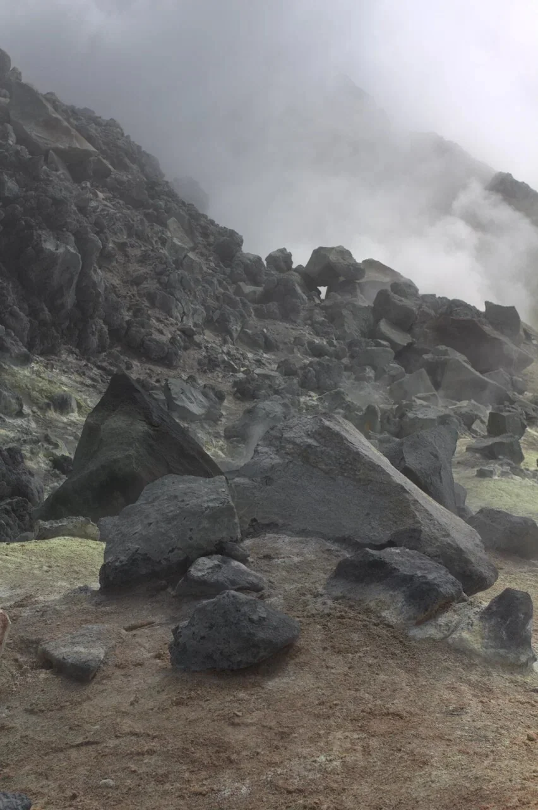
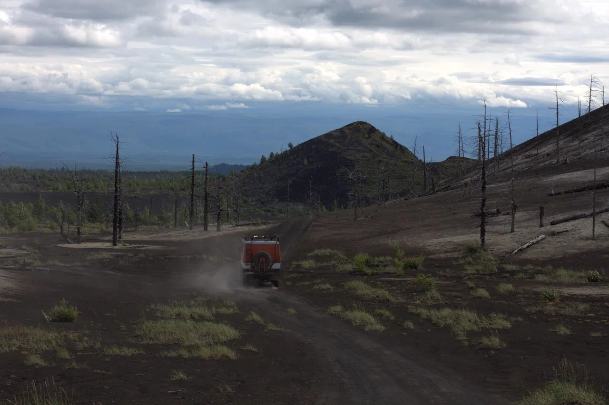
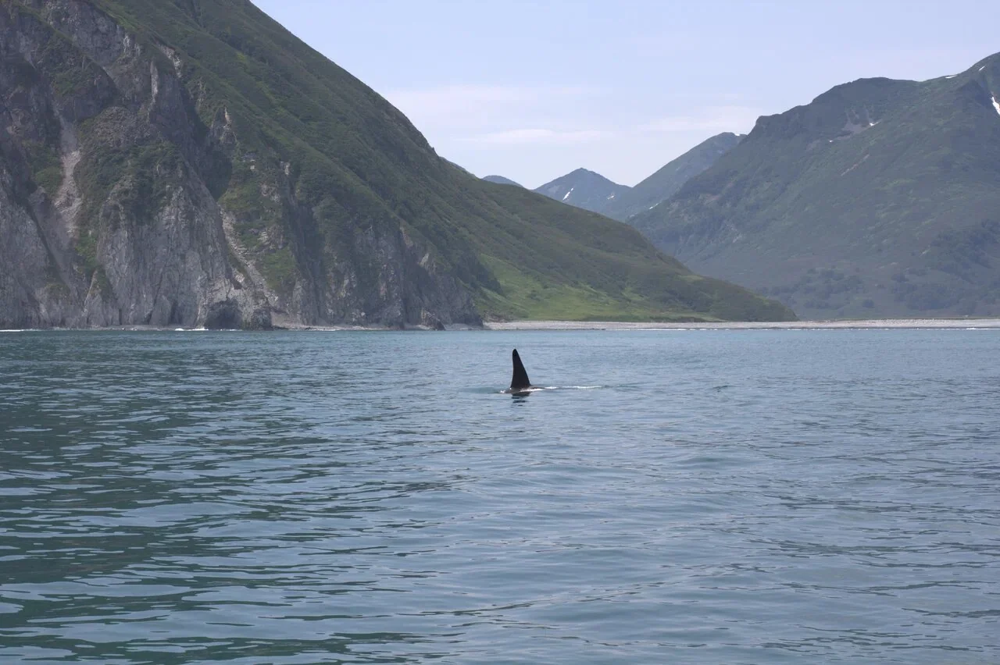
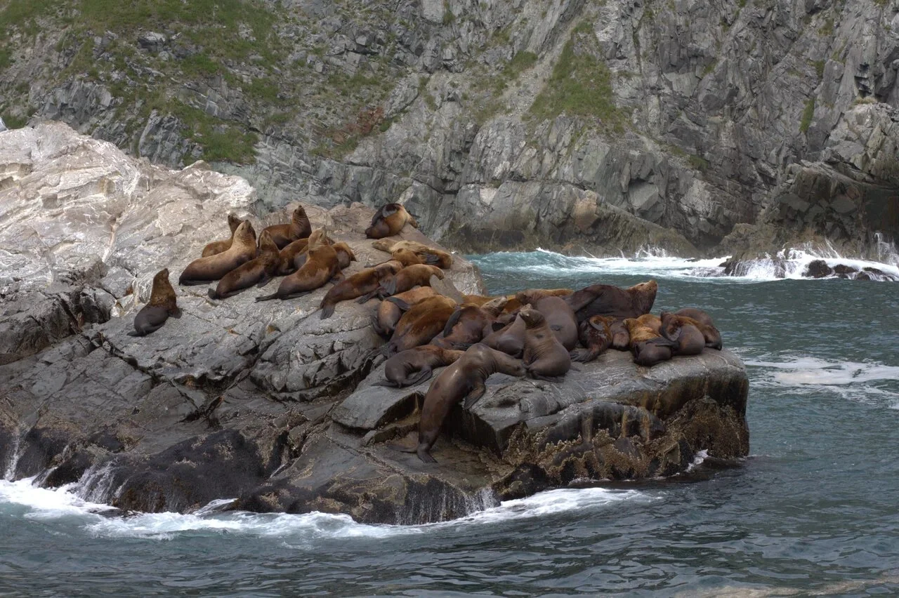
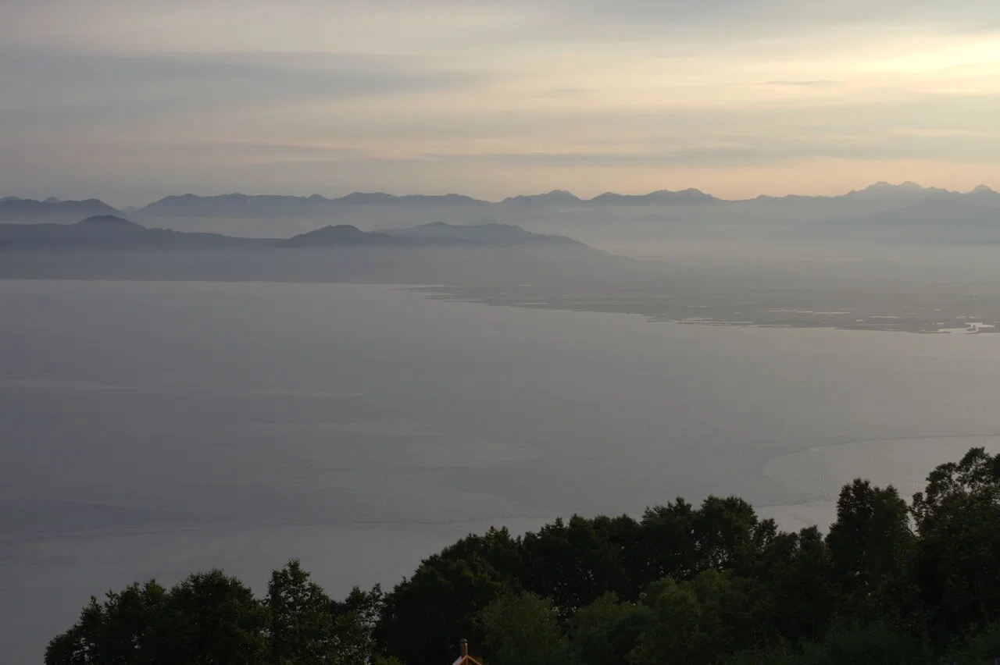

import FlightRoutes from '../../components/post/FlightRoutes.astro';
import PricingCards from '../../components/post/PricingCards.astro';
import AffiliateNote from '../../components/post/AffiliateNote.astro';
import { TP_LINKS } from '../../data/affiliate.js';

Я был во многих местах, но Камчатка — единственное, где казалось, что прилетел на другую планету. Стоишь на чёрных полях Толбачика среди сухого мёртвого леса — это Марс. Через день — катер в Авачинском заливе, и в десяти метрах из воды выходит косатка. Ещё через день — поднимаешься к фумаролам Мутновского, и земля под ногами шипит серой. Камчатка — это не «съездить отдохнуть», это экспедиция, к которой надо готовиться. Дальше — что обязательно увидеть, когда ехать, как не разориться на перелёте и сколько реально стоит, без турагентского глянца.

> **Если коротко:** ехать **с июня по сентябрь** (короткое камчатское лето), главное — **вулканы, Долина гейзеров, медведи на Курильском озере и косатки в океане**. Добираться только самолётом: прямой **Москва — Петропавловск-Камчатский ~8–9 часов**, ловить **«плоские тарифы»** Аэрофлота за 4–6 месяцев (от ~20 000 ₽ туда-обратно). Камчатка дорогая: тур на 8–10 дней — от **100 000 ₽**, и почти всё берут организованно, потому что сам логистику не вывезешь.

<AffiliateNote />

> **Когда лучше ехать:** [таблица сезонов](/seasons/) — для Камчатки окно узкое, разбор по месяцам ниже.

В отличие от заграничных пляжей, тут не нужна виза, работают российские карты и связь — но на этом простота заканчивается. Камчатка про другое: дикую природу, которую в России больше нигде не увидеть в такой концентрации.

---

## Что посмотреть на Камчатке

Это главное, ради чего сюда летят. По поиску видно: чаще всего ищут именно **вулканы** и **Долину гейзеров** — и не зря.

### Вулканы

Камчатку называют «страной вулканов» — их здесь около 300, три десятка действующих. Самые доступные для туриста:

* **Авачинский и Корякский** — «домашние» вулканы над Петропавловском, на Авачу поднимаются за день.
* **Мутновский и Горелый** — действующие, с дымящими фумаролами и кратерными озёрами. У Мутновского земля шипит серой прямо под ногами.
* **Толбачик** — поля застывшей лавы и мёртвый лес после извержений. Самый «марсианский» пейзаж Камчатки, сюда возят на внедорожниках с ночёвкой в палатках.

### Долина гейзеров

Одно из семи чудес России, в Кроноцком заповеднике. Попасть можно **только вертолётом** (наземных дорог нет) — это самая дорогая экскурсия поездки (около 45 000–55 000 ₽ с человека), но виды того стоят. Вертолётный день обычно совмещают с кальдерой вулкана Узон и термальными источниками.

### Медведи

«Медвежий край» — не метафора. Лучшее место увидеть бурых медведей — **Курильское озеро** на юге, куда они выходят на нерест лосося. Пик — **август**. Возят туда тоже вертолётом или в составе многодневных туров с инспекторами.

### Океан и косатки

Морская прогулка по **Авачинскому заливу** — обязательна. Скалы «Три брата», птичьи базары, лежбища сивучей на камнях, а если повезёт — косатки и киты прямо у борта. Я видел косаток в нескольких метрах от катера — это сильнее любого зоопарка.

Морские прогулки, вертолёт в Долину гейзеров и выходы к медведям входят в авторские туры по Камчатке — маршрут, заброски и логистика уже собраны, а места на сезон разбирают за месяцы: <a href={TP_LINKS.youtravel} class="aff-cta" rel="sponsored">Поехать по Камчатке с местным экспертом</a> — малая группа, оплата картой РФ.

### Термальные источники и чёрные пляжи

После треккинга — горячие источники (Паратунка, Налычево). А **Халактырский пляж** — это чёрный вулканический песок и открытый океан, сюда приезжают серферы в гидрокостюмах даже летом.

---

## Когда ехать на Камчатку

**Сезон короткий — с июня по сентябрь.** Это единственное окно, когда открыты перевалы, ходят катера и летают вертолёты.

* **Июнь** — ещё лежит снег на перевалах, зелень только начинается, но меньше туристов и комаров
* **Июль–август** — пик: всё доступно, тепло (+15…+20 °C), но это и максимум цен и людей. **Август** — медведи на Курильском озере
* **Сентябрь** — золотая тундра, ягоды, меньше комаров, но погода уже капризнее
* **Зима** — отдельная история для лыжников и хели-ски, дорого и нишево; обычному туристу нечего делать

Главная особенность: **погода непредсказуема**. Вертолётные экскурсии и восхождения отменяют из-за тумана и ветра — поэтому в маршрут всегда закладывают «запасные» дни.

---

## Как добраться до Камчатки

**Только самолётом.** Прямой рейс **Москва — Петропавловск-Камчатский** занимает **8–9 часов**, летают Аэрофлот и «Россия». Ключевой лайфхак — **«плоские тарифы»**: фиксированная сниженная цена на перелёт в дальневосточные регионы. Их разбирают быстро, поэтому **бронировать надо за 4–6 месяцев**.

<FlightRoutes routes={[
 {
 from: 'Москва', to: 'Петропавловск-Камчатский',
 flights: [
 { airline: 'Аэрофлот / Россия', code: 'прямой, плоский тариф', duration: '~8–9 ч', priceFrom: '20 000–35 000 ₽ туда-обратно (плоский тариф)', priceUrl: 'https://aviasales.tpk.mx/JCSPlC17?erid=2Vtzqxkn4LF&u=https%3A%2F%2Fwww.aviasales.ru%2F%3Forigin_iata%3DMOW%26destination_iata%3DPKC' },
 ]
 },
]} caption="Москва → Петропавловск-Камчатский — рейс в 2026" />

Плоские тарифы появляются ограниченными партиями — выгоднее всего ловить их заранее: <a href="https://aviasales.tpk.mx/JCSPlC17?erid=2Vtzqxkn4LF&u=https%3A%2F%2Fwww.aviasales.ru%2F%3Forigin_iata%3DMOW%26destination_iata%3DPKC" class="aff-cta" rel="sponsored">Найти билет Москва — Камчатка</a>: Aviasales показывает все рейсы сразу, а гибкие даты помогают поймать плоский тариф. Российские карты работают — это всё-таки внутренний рейс.

В самом Петропавловске удобно жить пару ночей до и после тура — <a href="https://ostrovok.tpk.mx/xtyTcUcY?erid=2VtzqvE1cv3" class="aff-cta" rel="sponsored">Забронировать отель в Петропавловске</a> (Ostrovok, оплата картой МИР).

---

## Сколько стоит поездка на Камчатку

**Камчатка — одно из самых дорогих направлений России**, и перелёт тут не главная статья (его как раз спасают плоские тарифы). Основные деньги уходят на туры, вертолёты и логистику.

<PricingCards tiers={[
 {
 tier: 'Бюджет',
 emoji: '',
 price: 'от 90 000 ₽',
 priceNote: '8–10 дней, 1 чел.',
 features: [
 'Перелёт по плоскому тарифу',
 'Групповой тур, палатки/хостел',
 'Наземные вулканы, морская прогулка',
 'Без вертолётов',
 ],
 },
 {
 tier: 'Оптимум',
 emoji: '',
 price: '180 000–280 000 ₽',
 priceNote: '8–10 дней, 1 чел.',
 featured: true,
 badge: 'Полная программа',
 features: [
 'Вертолёт в Долину гейзеров',
 'Курильское озеро (медведи)',
 'Гостиницы + термальные источники',
 'Вулканы + океан',
 ],
 },
 {
 tier: 'Премиум',
 emoji: '',
 price: '400 000 ₽+',
 priceNote: '10–14 дней, 1 чел.',
 features: [
 'Морской круиз к Северным Курилам',
 'Индивидуальный гид и джип',
 'Лучшие лоджи',
 'Рыбалка, хели-туры',
 ],
 },
]} />

Главный совет по деньгам: **бронировать сильно заранее** — и перелёт (плоский тариф), и сам тур (места в группах и вертолёты разбирают за полгода). Готовый тур обычно выгоднее самостоятельной сборки — <a href="https://travelata.tpk.mx/Do2A3cgV?erid=2VtzqufPtiT" class="aff-cta" rel="sponsored">Подобрать тур на Камчатку</a>: Travelata собирает программы туроператоров, оплата картой МИР.

---

## Тур или самостоятельно — на Камчатке почти всегда тур

Это тот случай, когда **самостоятельная поездка не имеет смысла для большинства**. Причины:

* **Нет дорог.** К Долине гейзеров, на Курильское озеро, к Толбачику добираются вертолётом или подготовленными внедорожниками — в одиночку это нереально.
* **Заповедники и погранзоны.** Многие места — особо охраняемые территории, нужны пропуска и сопровождение инспекторов.
* **Медведи и погода.** Выходы в дикую природу без гида опасны, а маршрут зависит от погоды — нужен тот, кто перестроит программу.

Самостоятельно реально разве что прилететь, пожить в Петропавловске, подняться на Авачинский и сходить в морскую прогулку. Всё интересное за пределами города — это организованные туры, групповые или авторские. Авторские туры малыми группами с местными гидами — лучший формат для Камчатки: <a href="https://travelata.tpk.mx/Do2A3cgV?erid=2VtzqufPtiT" class="aff-cta" rel="sponsored">Посмотреть туры на Камчатку</a>.

---

## Маршрут на 8–10 дней

Классическая программа, которая закрывает главное:

1. **День 1–2:** Петропавловск, акклиматизация, морская прогулка по Авачинскому заливу (косатки, сивучи, «Три брата»)
2. **День 3–4:** восхождение на Авачинский вулкан или поездка к Мутновскому и Горелому с фумаролами
3. **День 5:** вертолётный день — Долина гейзеров + кальдера Узон + термальные источники
4. **День 6–7:** Толбачик — лавовые поля и мёртвый лес с ночёвкой в палатках
5. **День 8:** Курильское озеро (медведи, август) или Халактырский чёрный пляж
6. **Запасной день** на случай нелётной погоды — обязательно закладывать

Между активными днями — горячие источники Паратунки, чтобы восстановиться.

---

## Что взять на Камчатку

Камчатка — это горы, океан и вулканы в один день, поэтому главное правило — **слои и непромокаемость**:

* Мембранная куртка и штаны от дождя и ветра (погода меняется за час)
* Треккинговые ботинки, разношенные заранее
* Тёплый флис и шапка даже летом — на вулканах и в море холодно
* Резиновые сапоги для вулканических зон и переправ
* Репеллент от комаров (июль — их пик), солнцезащита (на снегу горит лицо)
* Купальник для термальных источников, гидрокостюм дают на сёрфинге

---

## Не только вулканы: сёрфинг, рыбалка и этно-Камчатка

Камчатка — не только восхождения и вертолёты. Что ещё стоит заложить в маршрут:

* **Сёрфинг на Халактырском пляже** — открытый океан и чёрный вулканический песок в получасе от Петропавловска. Школы дают гидрокостюм и доску, ловить волну можно даже летом (вода холодная, +10…+12 °C, без гидрокостюма не зайти).
* **Рыбалка** — Камчатка трофейная: лосось, голец, микижа, кижуч. Туры с рыбалкой на горных реках и сплавом — отдельный популярный формат, часто совмещают с наблюдением за медведями.
* **Эссо** — «камчатская Швейцария» в Быстринском районе: горы, термальный бассейн под открытым небом, этнодеревня эвенов-оленеводов. Сюда едут за этникой и тишиной после вулканических нагрузок.
* **Командорские острова** — для тех, кто уже был на «классической» Камчатке: киты, котики, могила Беринга. Дорого и далеко, но уникально.

Это направления «второго визита» или для тех, кому мало стандартной программы.

---

## Минусы и реальность Камчатки

* **Дорого.** Это главный барьер — вертолёты и туры стоят как заграничный отпуск
* **Погода рушит планы.** Туман и ветер отменяют вертолёты и восхождения; без запасных дней рискуете не увидеть Долину гейзеров
* **Физическая нагрузка.** Это активный отдых, а не лежание — восхождения, треккинги, качка на катере
* **Комары.** В июле их тучи, особенно в тундре и у воды
* **Мало инфраструктуры.** За пределами Петропавловска — палатки, полевые условия, нестабильная связь
* **Бронировать надо за полгода** — иначе нет ни плоских тарифов, ни мест в группах

Но всё это — плата за то, чего нет больше нигде в России: живые вулканы, медведи на реке, косатки у борта и пейзажи с другой планеты.

---

## FAQ — что чаще всего спрашивают перед Камчаткой

### Когда лучше ехать на Камчатку?

**С июня по сентябрь** — короткое камчатское лето. Июль–август — пик (всё доступно, медведи в августе), июнь и сентябрь — меньше людей и комаров, но капризнее погода. Зимой — только лыжникам.

### Сколько стоит поездка на Камчатку?

Бюджетный групповой тур на 8–10 дней — **от 90 000 ₽**, полная программа с вертолётом в Долину гейзеров и медведями — **180 000–280 000 ₽**, премиум с круизом к Курилам — **от 400 000 ₽**. Перелёт по плоскому тарифу — от 20 000 ₽ туда-обратно.

### Как добраться до Камчатки?

Только самолётом: прямой рейс **Москва — Петропавловск-Камчатский ~8–9 часов** (Аэрофлот, «Россия»). Ищите «плоские тарифы» и бронируйте за 4–6 месяцев.

### Что обязательно посмотреть?

Вулканы (Мутновский, Толбачик, Авачинский), Долину гейзеров (вертолётом), медведей на Курильском озере (август), морскую прогулку по Авачинскому заливу с косатками и сивучами, термальные источники.

### Можно ли поехать на Камчатку самостоятельно?

Частично: Петропавловск, Авачинский вулкан и морская прогулка — реально самому. Но Долина гейзеров, Курильское озеро и Толбачик — только организованными турами (нет дорог, заповедники, погранзоны, медведи).

### Нужна ли виза и работают ли карты?

Виза не нужна — это Россия. Российские карты (МИР, Visa/MC российских банков) и связь работают, как и везде по стране. Это удобнее заграничных направлений.

### Сколько дней нужно на Камчатку?

Оптимально **8–10 дней** плюс запасной день на нелётную погоду. За меньший срок не успеть совместить вулканы, океан и вертолётные экскурсии, а перелёт через всю страну слишком дорог для короткой поездки.

---

## Что делать дальше

* Сверьтесь с [таблицей сезонов](/seasons/) — точное окно под ваш месяц
* <a href="https://aviasales.tpk.mx/JCSPlC17?erid=2Vtzqxkn4LF&u=https%3A%2F%2Fwww.aviasales.ru%2F%3Forigin_iata%3DMOW%26destination_iata%3DPKC" class="aff-cta" rel="sponsored">Найти билет Москва — Камчатка</a> — ловить плоский тариф за 4–6 месяцев
* <a href={TP_LINKS.youtravel} class="aff-cta" rel="sponsored">Поехать по Камчатке с местным экспертом</a> — авторский тур малой группой: морские прогулки, вертолёт, медведи
* <a href="https://travelata.tpk.mx/Do2A3cgV?erid=2VtzqufPtiT" class="aff-cta" rel="sponsored">Подобрать тур на Камчатку</a> — программа с вертолётом и медведями
* <a href="https://ostrovok.tpk.mx/xtyTcUcY?erid=2VtzqvE1cv3" class="aff-cta" rel="sponsored">Забронировать отель в Петропавловске</a> — на дни до и после тура
* Посчитайте бюджет в [калькуляторе](/calculator/)

Если хочется ещё дикой природы России — следующими будут Курилы и Алтай. Свежие отчёты и фото из поездок — в [@traveltriberu](https://t.me/traveltriberu).

---

*Актуально на: 7 июня 2026. Личный опыт автора (фото из поездки) + ориентиры по ценам и логистике: [RussiaDiscovery](https://www.russiadiscovery.ru/regions/kamchatka/), [Большая Страна](https://bolshayastrana.com/kamchatka). Цены на туры и вертолёты — ориентир, уточняйте у операторов перед бронированием.*
