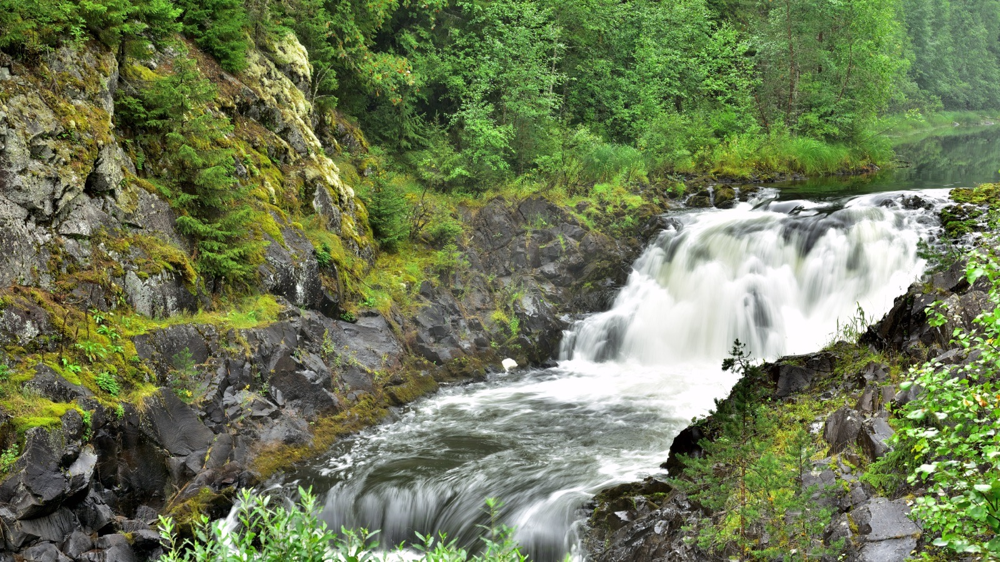

import AffiliateNote from '../../components/post/AffiliateNote.astro';
import PricingCards from '../../components/post/PricingCards.astro';
import { TP_LINKS } from '../../data/affiliate.js';

Карелию я знаю не только по справочникам — бывал здесь ещё в детстве, и северная природа из тех поездок не отпускает до сих пор. Это край тысяч озёр, гранитных скал, водопадов и деревянных церквей в трёх часах от Петербурга — без визы, загранпаспорта и долгого перелёта. Разбираю по делу: что посмотреть, как добраться (спойлер — проще всего поездом), когда ехать и сколько стоит поездка в 2026 году.

> **Если коротко:** Карелия — регион на северо-западе России с **~60 000 озёр**, граница с Финляндией, безвизовый отдых для россиян. Главные места — **горный парк Рускеала**, остров **Кижи**, остров **Валаам**, водопад **Кивач**. Добираться удобнее всего **поездом**: Москва — Петрозаводск (~15 ч ночным), Петербург — Петрозаводск или Сортавала «Ласточкой» (~4–5 ч). Лучшие месяцы — **август и сентябрь** (тёплая вода, мало комаров, работает навигация на острова); июнь–июль — белые ночи, но пик комаров и цен. Неделя выходит ориентировочно в **50 000–90 000 ₽ на двоих** без дороги. Жильё — домики и базы на берегу озёр.

<AffiliateNote />

---

## Стоит ли ехать в Карелию?

**Да, если едете за северной природой, а не за пляжно-отельным сервисом.** Карелия — это про озёра, скалы, лес, белые ночи летом и северное сияние зимой, про деревянное зодчество и тишину. Регион огромный: здесь около **60 000 озёр и 27 000 рек**, а Ладожское и Онежское — крупнейшие озёра Европы.

Карелия граничит с Финляндией, и это чувствуется во всём — от природы до кухни (та же сливочная уха из лосося). При этом регион полностью «свой»: рубли, русский язык, никаких виз и загранпаспортов. Добраться реально за один день из Москвы или Петербурга.

Главное, к чему стоит готовиться, — погода переменчива, а летом досаждают **комары и мошка**. Но это плата за дикую, почти нетронутую природу, ради которой сюда и едут.

---

## Что посмотреть в Карелии?

**Минимум — Рускеала, Кижи, Валаам и водопад Кивач; на каждый из топ-объектов у нас есть отдельный подробный разбор.** Чтобы не превращать этот гайд в простыню, дам короткий обзор со ссылками на детальные статьи с ценами и расписаниями.

- **Горный парк Рускеала** — затопленный мраморный каньон с бирюзовой водой, штольни, зиплайн и ретропоезд на паровозе из Сортавалы. Главная «открытка» Карелии. Подробно: [горный парк Рускеала 2026](/blog/gornyy-park-ruskeala-2026/).
- **Остров Кижи** — ансамбль деревянного зодчества под охраной ЮНЕСКО с 22-купольной Преображенской церковью. Добираются метеором из Петрозаводска. Подробно: [остров Кижи 2026](/blog/ostrov-kizhi-2026/).
- **Остров Валаам** — действующий Спасо-Преображенский монастырь на гранитном острове посреди Ладоги. Метеор из Сортавалы. Подробно: [остров Валаам 2026](/blog/ostrov-valaam-2026/).
- **Водопад Кивач** — в одноимённом заповеднике на реке Суне; высота 10,4 м, **второй по величине равнинный водопад Европы** после Рейнского.
- **Сортавала** — атмосферный городок у Ладоги, главная база для поездок в Рускеалу и на Валаам.
- **Ладожские шхеры** — национальный парк, архипелаг из сотен скалистых островов; здесь обитает эндемичная ладожская кольчатая нерпа.
- **Марциальные Воды** — первый российский курорт, открытый по указу Петра I в 1719 году; сам Пётр приезжал на воды четырежды.
- **Петроглифы** (Бесов Нос на Онего, Беломорские) — наскальные рисунки возрастом 5–6 тысяч лет, старше египетских пирамид.
- **Вулкан Гирвас** — древний палеовулкан в 70 км от Петрозаводска; эффектный водосброс на нём бывает только весной, в половодье.

---

## Как добраться до Карелии?

**Карелия — поездное направление, и это самый удобный способ.** Прямого «карельского» аэропорта-хаба нет: аэропорт Петрозаводска (Бесовец) принимает лишь несколько направлений (Казань, Сочи, Калининград, Самара, Минск — рейсы и расписание лучше сверять перед поездкой). Поэтому большинство едет по железной дороге.

| Откуда | Как | Время |
|---|---|---|
| Москва → Петрозаводск | поезд (ночные фирменные) | ~15 ч |
| Санкт-Петербург → Петрозаводск | «Ласточка» | ~5 ч |
| Санкт-Петербург → Сортавала | «Ласточка» (для Рускеалы и Валаама) | ~4 ч |
| Санкт-Петербург → Петрозаводск | авто (трасса «Кола») | ~6 ч / 450 км |
| Москва → Петрозаводск | авто | ~13 ч / 1000 км |

Ключевая развилка — **что вам нужно**. Для Кижи, Кивача и Марциальных вод базируйтесь в **Петрозаводске**. Для Рускеалы, Валаама и Ладожских шхер удобнее **Сортавала** (туда из Петербурга идёт «Ласточка» за 4 часа). Многие закладывают обе точки: пара дней в Приладожье + пара в Петрозаводске.

<a href={TP_LINKS.tutu} class="aff-cta" rel="sponsored">Посмотреть поезда в Карелию →</a> — расписание и цены на «Ласточку» и фирменные поезда, билеты онлайн.

---

## Сколько стоит отдых в Карелии в 2026?

**Неделя на двоих — ориентировочно 50 000–90 000 ₽ без дороги**, в зависимости от жилья и числа экскурсий. Готовые туры на двоих стартуют примерно от 38 000 ₽ за 3 дня и от 90 000 ₽ за 5 дней. Точную сумму проще собрать из компонентов:

| Что | Цена 2026 |
|---|---|
| Домик на берегу озера | от ~2 500 ₽/ночь |
| Коттедж (Приладожье) | 14 000–25 000 ₽/ночь |
| База отдыха премиум | от ~18 000 ₽/ночь |
| Обед в кафе | от ~400 ₽/чел |
| Метеор на Кижи (туда-обратно) | 5 200 ₽ взрослый |
| Метеор на Валаам с экскурсией | от 7 700 ₽ |
| Вход в Рускеалу | 750 ₽ |
| Поезд Москва — Петрозаводск (купе) | от ~7 000 ₽ |

**Где сэкономить:** ехать плацкартом или «Ласточкой», жить в домиках вместо баз премиум-класса, готовить часть еды самим (многие домики с кухней), а на острова брать только базовые билеты без допуслуг. Самые дорогие позиции — метеоры на острова и организованные туры.

> **Точнее посчитать** перелёт/проезд, жильё и еду под ваши даты можно в [калькуляторе поездки](/calculator/).

---

## Когда лучше ехать в Карелию?

**Оптимально — август и сентябрь: тёплая вода, мало комаров, ещё работает навигация на острова.** Но у каждого сезона своя логика.

- **Июнь — июль:** белые ночи (солнце почти не заходит ~52 дня), тепло, открыта навигация на Кижи и Валаам. Минус — **пик комаров и мошки** (особенно вечером у воды) и максимум туристов и цен.
- **Август:** лучший баланс — вода прогрета, комары спадают, со второй половины пойдут грибы и ягоды (черника, брусника, морошка).
- **Сентябрь:** «бабье лето» ~+15 °C, комаров почти нет, золотая осень; навигация на острова ещё идёт (с середины сентября стоянка на Кижи короче).
- **Зима (декабрь — март):** другая Карелия — хаски и оленьи упряжки, снегоходы, зимняя подсветка Рускеалы, карельский Дед Мороз Талвиукко. В феврале при ясной погоде и вдали от городов реально увидеть **северное сияние**. На Кижи зимой добираются на судне на воздушной подушке.
- **Апрель и ноябрь — худшие окна:** распутица весной и межсезонье осенью, навигации нет, многие базы закрыты.

Сводка по месяцам с погодой и сезоном — в [таблице сезонов](/seasons/); под конкретный месяц удобно свериться, например [Карелия в августе](/trips/august/karelia/).

---

## Где жить: Петрозаводск, Сортавала или база на озере?

**Три типичных варианта — город как база, курортное Приладожье или домик на природе.**

<PricingCards tiers={[
 { tier: 'Петрозаводск', featured: true, badge: 'Удобная база',
 price: 'от ~2 500 ₽/ночь',
 priceNote: 'для Кижи и севера',
 features: [
 'Метеоры на Кижи — отсюда',
 'Рядом Кивач и Марциальные воды',
 'Гостиницы, кафе, вокзал',
 'Городской комфорт',
 ] },
 { tier: 'Сортавала / Приладожье',
 price: '14 000–25 000 ₽/ночь',
 priceNote: 'коттеджи у Ладоги',
 features: [
 'Рускеала и Валаам — рядом',
 'Ладожские шхеры',
 '«Ласточка» из Петербурга',
 'Атмосфера карельского севера',
 ] },
 { tier: 'Домик на озере',
 price: 'от ~2 500 ₽/ночь',
 priceNote: 'наедине с природой',
 features: [
 'Баня, лодка, рыбалка',
 'Тишина и свои закаты',
 'Нужна машина',
 'Бронировать заранее на лето',
 ] },
]} />

Самый востребованный формат — **домик или база на берегу озера** (с баней и лодкой). Бронировать на июль–август стоит сильно заранее: хорошие варианты разбирают за месяцы.

<a href={TP_LINKS.sutochno} class="aff-cta" rel="sponsored">Подобрать домик или базу в Карелии →</a> — посуточная аренда у озёр, оплата картой РФ.

---

## С детьми и активный отдых

**Карелия хороша и для семьи, и для активного отдыха.** Летом — каякинг, сапы, велосипеды, рыбалка (щука, окунь, форель); весной (апрель–май, большая вода) — **рафтинг и сплавы**. Зимой — снегоходные сафари, **хаски** и оленьи упряжки, лыжи, зимняя рыбалка.

С детьми популярны резиденция карельского Деда Мороза Талвиукко, питомники хаски, прогулки по Рускеале и Кижам (на острове есть кафе и прокат велосипедов). Главное — заложить репелленты летом и тёплую одежду в любой сезон: на воде и островах ветрено.

---

## Что попробовать из карельской кухни

**Карельская кухня — отдельная причина приехать.** Обязательно:

- **Калитки** — ржаные открытые пирожки с картофелем, пшёнкой или ягодами, главный местный специалитет.
- **Лохикейтто** — финская сливочная уха из лосося.
- **Рыба** — карельская форель, ряпушка, корюшка, судак.
- **Дичь** — оленина и лосятина (в том числе в калитках).
- **Ягоды** — морошка, черника, брусника; северный мёд и морсы.

Из сувениров везут **карельский бальзам** на травах и изделия из **шунгита** — местного минерала.

---

## Интересные факты о Карелии

**Карелия — это не только Рускеала и Кижи; у региона есть чем удивить.**

- **Край тысяч озёр.** Здесь около **60 000 озёр и 27 000 рек**, а коэффициент озёрности — один из самых высоких в мире (около 18% территории под водой). Ладожское и Онежское — **крупнейшие озёра Европы**.
- **«Калевала».** Карело-финский эпос из **50 рун** Элиас Лённрот собрал из народных песен этих мест; в честь него назван посёлок на севере региона.
- **Петроглифы старше пирамид.** Наскальным рисункам на Бесовом Носу и Белом море — **5–6 тысяч лет**, они древнее египетских пирамид.
- **Высшая точка — гора Нуорунен (577 м)** в национальном парке Паанаярви на севере, у самой границы с Финляндией; тамошнее озеро Паанаярви — одно из глубочайших в Европе.
- **Древний вулкан.** Палеовулкан **Гирвас** — один из древнейших на планете; эффектный водосброс на нём бывает только весной.
- **Шунгит.** Чёрный минерал, который добывают только в Карелии, — популярный сувенир и местный бренд.

Эти места — повод заехать дальше Сортавалы и Петрозаводска, если есть лишние дни и машина.

---

## Маршрут на неделю по Карелии

**Оптимально — разделить поездку между Приладожьем и Петрозаводском.** Пример на 7 дней:

- **День 1.** Приезд в Сортавалу, прогулка по городу, виды на Ладогу.
- **День 2.** [Горный парк Рускеала](/blog/gornyy-park-ruskeala-2026/) (каньон, штольни) + Рускеальские водопады.
- **День 3.** [Остров Валаам](/blog/ostrov-valaam-2026/) — метеор из Сортавалы, монастырь и скиты.
- **День 4.** Ладожские шхеры (лодочная прогулка), переезд в Петрозаводск.
- **День 5.** [Остров Кижи](/blog/ostrov-kizhi-2026/) — метеор из Петрозаводска.
- **День 6.** Водопад Кивач, Марциальные Воды, вулкан Гирвас.
- **День 7.** Петрозаводск (Онежская набережная), дорога домой.

Зимой маршрут перекраивается под лёд и навигацию: Валаам и Кижи доступны иначе, зато добавляются хаски, снегоходы и подсветка Рускеалы.

---

## Деньги, связь и что взять

**Карелия — это Россия, так что с деньгами и связью всё проще, чем за границей, но природа диктует свои правила сбора.**

- **Деньги:** рубли, карты принимают в городах и крупных объектах, но в глубинке, на базах и островах берите **наличные** (на Валааме банкоматы — только Почтабанка).
- **Связь:** в Петрозаводске и Сортавале — нормально; в лесах, на трассах и островах сигнал пропадает. Заранее скачивайте офлайн-карты и билеты.
- **От насекомых:** репеллент и средство после укусов — обязательны с конца мая по август; весной активны клещи, стоит прививка/осторожность.
- **Одежда:** тёплый непродуваемый слой и дождевик в любой сезон — на воде и островах ветрено даже в жару; удобная обувь для троп и камней.
- **Транспорт:** многие базы и достопримечательности удобнее на машине; без авто закладывайте метеоры, «Ласточки» и организованные экскурсии.

Список вещей по сезону удобно свериться на странице [сборов в Карелию](/packing/karelia/).

---

## FAQ

**Нужна ли виза или загранпаспорт в Карелию?**
**Нет.** Карелия — регион России, виза и загранпаспорт не нужны, достаточно обычного паспорта РФ (детям — свидетельство о рождении).

**Как добраться до Карелии дешевле всего?**
**Поездом.** Из Петербурга «Ласточка» до Петрозаводска (~5 ч) или Сортавалы (~4 ч), из Москвы — ночной поезд до Петрозаводска (~15 ч). Это удобнее и часто дешевле перелёта.

**Когда лучше ехать в Карелию?**
**Август и сентябрь** — тёплая вода, мало комаров, работает навигация на острова. Июнь–июль — белые ночи, но пик комаров и цен. Зима — для хаски, снегоходов и северного сияния.

**Сколько стоит неделя в Карелии?**
**Ориентировочно 50 000–90 000 ₽ на двоих без дороги** — жильё, еда и 3–4 экскурсии. Бюджетно (домики, плацкарт, базовые билеты) — заметно дешевле.

**Что обязательно посмотреть в Карелии?**
**Рускеала, Кижи, Валаам и водопад Кивач.** На островах учитывайте сезон навигации (метеоры ходят примерно с середины мая по сентябрь).

**Сильно ли донимают комары?**
**Да, в конце июня — июле**, особенно вечером у воды. Нужен репеллент. К концу августа и в сентябре их заметно меньше.

**Можно ли попасть на Кижи и Валаам зимой?**
На Кижи — да, на судне на воздушной подушке или через Заонежье (дороже и дольше). На Валаам регулярного зимнего туристического сообщения нет — только по записи через монастырь.

---

## Что почитать дальше

- [Горный парк Рускеала 2026](/blog/gornyy-park-ruskeala-2026/) — билеты, ретропоезд, что внутри
- [Остров Кижи 2026](/blog/ostrov-kizhi-2026/) — метеор, билеты, церковь без гвоздей
- [Остров Валаам 2026](/blog/ostrov-valaam-2026/) — как добраться, монастырь, правила
- [Карелия в августе](/trips/august/karelia/) — лучший месяц для поездки
- [Калькулятор поездки](/calculator/) — прикинуть бюджет под свои даты

---

*Материал носит справочный характер. Цены, расписания поездов и метеоров, сезон навигации в Карелии меняются — сверяйтесь с официальными сайтами объектов и перевозчиков перед поездкой. Проверял 21.06.2026. Нашли неточность — напишите в [Telegram-канал @traveltriberu](https://t.me/traveltriberu), обновлю.*

*Фото: Egor Plenkin (пейзаж) и Александр Байдуков (Кивач) / [Wikimedia Commons](https://commons.wikimedia.org/wiki/File:Karelian_space_(51748969305).jpg) / CC BY 2.0 и [CC BY-SA 4.0](https://creativecommons.org/licenses/by-sa/4.0/).*
