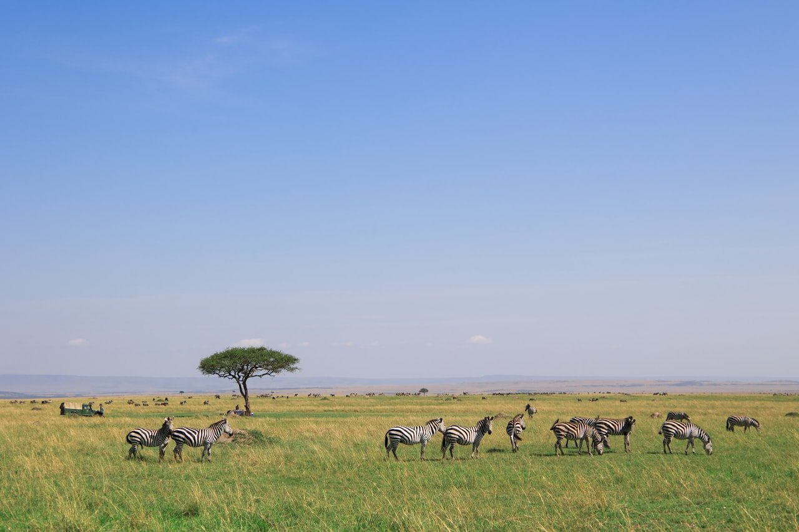
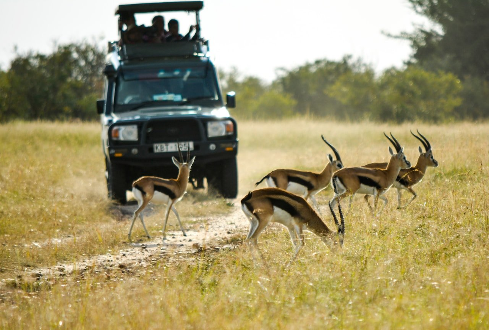

import PricingCards from '../../components/post/PricingCards.astro';
import FlightRoutes from '../../components/post/FlightRoutes.astro';
import AffiliateNote from '../../components/post/AffiliateNote.astro';

Кения — самое доступное по логистике классическое сафари Восточной Африки: Большая пятёрка в Масаи-Мара, слоны на фоне Килиманджаро в Амбосели и Великая миграция гну с июля по октябрь. Виза заменена на электронное разрешение eTA, английский в ходу, а само сафари можно собрать самостоятельно — не переплачивая туроператору. Этот гайд — обзор по официальным источникам и отчётам путешественников с [форума Винского](https://forum.awd.ru/viewforum.php?f=657): что с визой и прививками, когда ехать, сколько стоит и как не переплатить.

> **Если коротко:** россиянам нужна не виза, а **eTA** — электронное разрешение, ~**$30**, оформляется онлайн за 48–72 ч. Прямых рейсов нет, летят **со стыковкой** через залив или Стамбул в Найроби, от ~55 000 ₽ туда-обратно. **Великая миграция в Масаи-Мара — июль–октябрь**; сухой сезон и для парков январь–февраль. Сафари недёшево: бюджетный формат **от $200–300 в день** на человека, входной билет в Масаи-Мара ~$100/день. Найти билет: <a href="https://aviasales.tpk.mx/JCSPlC17?erid=2Vtzqxkn4LF&u=https%3A%2F%2Fwww.aviasales.ru%2F%3Forigin_iata%3DMOW%26destination_iata%3DNBO" class="aff-cta" rel="sponsored">Перелёт Москва — Найроби</a>.

<AffiliateNote />

---

## Нужна ли виза в Кению для россиян в 2026?

**Визы в привычном виде нет — нужно электронное разрешение eTA** (electronic Travel Authorization). С 1 января 2024 года Кения заменила прежнюю e-Visa на eTA для всех иностранцев, включая россиян ([Tourweek](https://tourweek.ru/visa/kenya), [памятка КДМИД](https://www.kdmid.ru/docs/kenya/information-about-the-country/)).

Как оформить:

- Подать заявку онлайн на официальном портале **etakenya.go.ke** — заранее, до вылета
- Сбор — около **$30** (плюс возможный сервисный сбор), оплата картой
- Одобрение приходит на email обычно за **48–72 часа** (подавайте минимум за неделю)
- Загранпаспорт с запасом действия **от 6 месяцев**, обратный билет, бронь жилья
- eTA даёт пребывание **до 90 дней** (продлевается ещё на 90 в стране)

eTA нужна каждому путешественнику, включая детей. На границе в Найроби предъявляете распечатку или электронную версию разрешения и паспорт.

---

## Какие прививки нужны для Кении?

**Главное — сертификат о вакцинации от жёлтой лихорадки и профилактика малярии.** По данным [КДМИД](https://www.kdmid.ru/docs/kenya/information-about-the-country/), прививки от жёлтой лихорадки, гепатита A/B и брюшного тифа носят рекомендательный характер, **но сертификат о жёлтой лихорадке обязателен при въезде из стран эндемичной зоны** — его могут спросить, если летите со стыковкой через такую страну.

- **Жёлтая лихорадка** — сделать стоит в любом случае (прививка действует пожизненно, выдаётся жёлтый сертификат). При транзите через эндемичные страны Африки — фактически обязательна.
- **Малярия** — профилактика рекомендуется, особенно на побережье и у озера Виктория. Найроби и нагорье Масаи-Мара — зона пониженного риска, но репелленты и закрытая одежда на закате обязательны.
- **Страховка с медицинской эвакуацией** — по факту необходима: лечение для иностранцев платное, а до хорошей клиники из парка только вертолётом.

Точные требования уточняйте перед поездкой — это YMYL-вопрос, правила меняются. Полис с покрытием Африки — <a href="https://cherehapa.tpk.mx/GmVWjhCN?erid=2VtzquZTwb5" class="aff-cta" rel="sponsored">оформить страховку на Cherehapa</a>, оплата картой РФ.

---

## Как добраться до Кении из Москвы?

**Прямых рейсов из России в Найроби нет — летят со стыковкой**, чаще через залив или Стамбул. Аэропорт прилёта — **Jomo Kenyatta (NBO)** в Найроби.

<FlightRoutes routes={[
 {
 from: 'Москва', to: 'Найроби (NBO)',
 flights: [
 { airline: 'Emirates / Qatar / Etihad (через залив)', code: 'EK/QR/EY', duration: 'от 13 ч, 1 пересадка', priceFrom: '55 000 ₽', priceUrl: 'https://aviasales.tpk.mx/JCSPlC17?erid=2Vtzqxkn4LF&u=https%3A%2F%2Fwww.aviasales.ru%2F%3Forigin_iata%3DMOW%26destination_iata%3DNBO' },
 { airline: 'Turkish Airlines (через Стамбул)', code: 'TK', duration: 'от 12 ч, 1 пересадка', priceFrom: '58 000 ₽' },
 { airline: 'Ethiopian (через Аддис-Абебу)', code: 'ET', duration: 'от 11 ч, 1 пересадка', priceFrom: '60 000 ₽' },
 ]
 },
]} caption="Стыковочные маршруты Москва → Найроби в 2026" />

Цены ориентировочные, зависят от сезона и глубины покупки — ловите заранее. До национальных парков из Найроби — отдельный внутренний перелёт на малой авиации (Safarilink, AirKenya) или переезд на джипе.

Поймать стыковку дешевле — <a href="https://aviasales.tpk.mx/JCSPlC17?erid=2Vtzqxkn4LF&u=https%3A%2F%2Fwww.aviasales.ru%2F%3Forigin_iata%3DMOW%26destination_iata%3DNBO" class="aff-cta" rel="sponsored">сравнить рейсы Москва — Найроби</a>: Aviasales показывает все авиакомпании и стыковки, cookie 30 дней.

---

## Когда ехать в Кению и когда Великая миграция?

**Лучшее время для сафари — сухие сезоны: июль–октябрь и январь–февраль.** В сухой сезон трава ниже, животные стягиваются к воде, дороги проходимы — зверей видно лучше.

- **Июль–октябрь (пик):** Великая миграция в **Масаи-Мара** — миллионы гну и зебр переходят реку Мара из танзанийского Серенгети. Переправы (river crossings) с хищниками — главное зрелище, пик август–сентябрь. Это высокий сезон: лоджи дороже, бронировать заранее.
- **Январь–февраль:** второй сухой сезон, отлично для game viewing, меньше толп, в южных саваннах — сезон отёла (много детёнышей и хищников).
- **Апрель–май (худшее):** «длинные дожди» — грунтовки развозит, часть кэмпов закрывается, зелено и красиво, но зверей искать труднее. Зато дёшево.
- **Ноябрь:** «короткие дожди», переходный сезон, цены ниже.

Если цель — миграция, целитесь в август–сентябрь; если баланс «звери + цена + меньше людей» — конец января.

---

## Сколько стоит сафари в Кении: бюджет 2026?

**Сафари в Кении — недешёвое удовольствие: бюджетный формат обходится от $200–300 в день на человека**, средний — $400–600, люкс-кэмпы — от $1000. Главные статьи: входные сборы в парки (Масаи-Мара ~$100 с человека в день), проживание в лодже/кэмпе, аренда джипа с гидом и внутренние перелёты. Неделя сафари на человека — ориентировочно **$1500–4000+** сверх перелёта из Москвы. *Оценка на июнь 2026, цифры зависят от сезона и формата.*

<PricingCards tiers={[
 { tier: 'Бюджетно', emoji: '',
 price: 'от $200/день',
 priceNote: 'групповой тур, палаточный кэмп',
 features: [
 'Палаточный кэмп/budget lodge: $80–150',
 'Групповой game drive в джипе',
 'Входной сбор Масаи-Мара: ~$100/день',
 'Переезд из Найроби на джипе (5–6 ч)',
 'Неделя на человека: ~$1500',
 ] },
 { tier: 'Комфорт', emoji: '', featured: true, badge: 'Оптимально',
 price: '$400–600/день',
 priceNote: 'midrange-лодж, перелёт в Мару',
 features: [
 'Лодж/tented camp с питанием: $150–350',
 'Перелёт Safarilink в Мару: ~$200',
 'Game drive утром и вечером',
 '2–3 парка за поездку',
 'Неделя на человека: ~$2500–3500',
 ] },
 { tier: 'Люкс', emoji: '',
 price: 'от $1000/день',
 priceNote: 'private conservancy, all-inclusive',
 features: [
 'Luxury camp в частном заповеднике',
 'Личный гид и джип',
 'Полёты между парками',
 'Off-road (запрещён в основном парке)',
 'Неделя на человека: $7000+',
 ] },
]} />

Главный способ сэкономить из отчётов путешественников — **не брать всё пакетом**: бронировать лодж напрямую и **докупать game drive на месте у ворот парка** выходит дешевле туроператорского «всё включено». Ещё один рычаг — ехать не в высокий сезон миграции (август–сентябрь), а в конце января: звери те же, а лоджи дешевле на 20–40%.

**Что съедает бюджет недельного сафари (комфорт, на человека):**
- Перелёт из Москвы со стыковкой: ~60 000 ₽
- Лоджи/кэмпы 6 ночей × $200: ~$1200
- Входные сборы парков (3–4 дня × ~$100): ~$400
- Внутренний перелёт в Мару и обратно: ~$400
- Game drive, аренда джипа с гидом, чаевые: ~$300
- eTA, страховка, связь: ~$80
- **Итого ~$2400 на человека за неделю** сверх перелёта из РФ. *Ориентир на июнь 2026.*

**Лодж или кэмп с картой РФ** — <a href="https://ostrovok.tpk.mx/xtyTcUcY?erid=2VtzqvE1cv3" class="aff-cta" rel="sponsored">подобрать жильё на Ostrovok</a>: принимает Visa/MC/МИР. А готовый сафари-тур из Москвы под ключ — <a href="https://travelata.tpk.mx/Do2A3cgV?erid=2VtzqufPtiT" class="aff-cta" rel="sponsored">сравнить туры в Кению</a>.

---

## Какие национальные парки выбрать?

**Минимум — Масаи-Мара (Большая пятёрка и миграция), по возможности плюс Амбосели (слоны и Килиманджаро) и озеро Накуру (фламинго и носороги).** За одну поездку обычно берут 2–3 парка:

- **Масаи-Мара** — главный, Большая пятёрка (лев, леопард, слон, буйвол, носорог), переправы миграции. Сердце кенийского сафари.
- **Амбосели** — огромные стада слонов на фоне заснеженного **Килиманджаро** (он в Танзании, но вид — из Кении). Лучшие фото.
- **Озеро Накуру** — розовые фламинго, носороги, компактный парк по пути.
- **Цаво (Восточный и Западный)** — самый большой, «красные» от пыли слоны, меньше туристов.
- **Самбуру** — север, засушливый, уникальные виды (сетчатый жираф, зебра Греви).

---

## Как устроено сафари: game drive, лоджи, перелёты?

**Сафари — это game drive (выезды на джипе) утром и вечером из лоджа или палаточного кэмпа.** Звери активны на рассвете и закате, днём — отдых в лодже. Как это работает на практике по отчётам:

- **Джип с гидом-водителем** — открытый верх, гид находит зверей и рассказывает. В основном парке off-road запрещён (только в частных conservancy).
- **Лоджи и tented camps** — от простых палаток с удобствами до люкса; в кэмпе ночью слышно львов, территория не огорожена.
- **Перелёты на малой авиации** (Safarilink, AirKenya) — Найроби → Мара ~1 час вместо 5–6 ч тряски по грунтовке. Багаж ограничен (~15 кг, мягкая сумка).
- **Чаевые гиду** — ожидаются, ориентир $10–15 в день; это часть культуры сафари.

**Основной парк или частный заповедник (conservancy)?** Это важная развилка, о которой часто пишут на форумах. В государственном заповеднике Масаи-Мара дешевле входной билет, но много джипов у одного льва и запрещён съезд с дорог и ночные выезды. В прилегающих частных conservancy (Mara North, Naboisho, Ol Kinyei) дороже, зато мало машин, разрешён off-road к зверю, ночные game drive и прогулки пешком с рейнджером. Для второго-третьего сафари или ради фотоохоты conservancy стоит переплаты; для первого знакомства хватает основного парка.

---

## Самостоятельно или с туром по Кении?

**Самостоятельно дешевле и гибче, но логистику парков всё равно придётся собирать.** В отличие от пляжного отдыха, сафари требует брони лоджей, трансферов и game drive заранее.

- **Сам:** бронируете лодж напрямую, game drive докупаете на месте, перелёт или джип до парка — отдельно. Экономия против пакета 20–40%, но больше планирования.
- **Self-drive** (аренда 4×4) — возможен, но навигация и состояние дорог сложные; новичкам не советуют.
- **Тур/оператор:** удобен «под ключ», особенно для связки 2–3 парков и миграции — <a href="https://travelata.tpk.mx/Do2A3cgV?erid=2VtzqufPtiT" class="aff-cta" rel="sponsored">сравнить сафари-туры</a>. В высокий сезон миграции пакет иногда выгоднее раздельной брони.

---

## Можно ли совместить сафари и пляж?

**Да — классическая связка «сафари + Индийский океан».** После Масаи-Мара летят на побережье: **Диани-Бич** (один из лучших пляжей Африки, белый песок) или район **Момбасы**. Между Найроби и побережьем — внутренние рейсы или скоростной поезд SGR (Найроби — Момбаса, ~5 ч).

Побережье тёплое круглый год; лучшие месяцы — сухие декабрь–март и июль–октябрь. Кроме Диани, путешественники хвалят **Ватаму и Малинди** (морские парки, снорклинг и дельфины) и старый город **Ламу** — объект ЮНЕСКО с суахилийской архитектурой без автомобилей. На пляж закладывайте 3–4 дня после сафари — резкая смена ритма с ранних game drive на ничегонеделание у океана как раз кстати. Учтите: на побережье выше риск малярии, чем в нагорье — профилактика и репелленты обязательны.

---

## Что посмотреть в Найроби?

**Найроби — точка входа, но на день-два есть что посмотреть.** Большинство путешественников проводят здесь стыковочную ночь до или после сафари:

- **Sheldrick Elephant Orphanage** — питомник слонят-сирот, открыт час в день (11:00–12:00), бронь заранее.
- **Giraffe Centre** — покормить жирафов Ротшильда с руки.
- **Дом-музей Карен Бликсен** («Из Африки») — поместье героини фильма у подножия холмов Нгонг.
- **Национальный парк Найроби** прямо у города — единственный в мире парк, где львов и носорогов снимают на фоне небоскрёбов; хороший вариант, если на полноценное сафари нет дней.

**Важно:** Найроби — город с заметной уличной преступностью, вечером не ходить пешком, не светить технику и деньги, передвигаться на такси/Uber.

---

## Безопасно ли в Кении и какие тонкости?

**Парки и побережье безопасны, главный риск — улицы Найроби и мелкие разводы.** Из отчётов путешественников:

- **Найроби** — карманники и грабежи, особенно в центре и ночью. Uber/Bolt вместо пешки, ценное — в сейф лоджа.
- **Деньги** — кенийский шиллинг; в городах повсеместно **M-Pesa** (мобильные платежи), но в парках и для чаевых нужны наличные, лучше доллары. Карты РФ не работают.
- **Развод с «деревней масаи»** — посещение часто постановочное, $20–30 с человека; решайте сами, насколько это интересно.
- **Торг** на рынках и с таксистами без счётчика обязателен.
- **Язык** — английский и суахили официальные; по-английски говорят повсеместно, общаться проще, чем в франкоязычной Африке.

---

## Маршрут по Кении на 7–10 дней

**Оптимум на 8 дней — Найроби + два-три парка + опционально пляж:**

1. **День 1 — Найроби.** Прилёт, слонята Sheldrick, жирафовый центр, ночь в городе.
2. **День 2–4 — Масаи-Мара.** Перелёт Safarilink, game drive утром и вечером, переправы миграции (в сезон).
3. **День 5 — озеро Накуру.** Фламинго и носороги по пути обратно.
4. **День 6–7 — Амбосели.** Слоны на фоне Килиманджаро, лучшие кадры.
5. **День 8 — Найроби и вылет** (или перелёт на **Диани-Бич** на 2–3 дня океана).

Короче 7 дней — берите один парк (Масаи-Мара) плюс Найроби; гнаться за всеми парками за неделю — выматывающие переезды. Точный расчёт под маршрут — в [калькуляторе поездки](/calculator/).

---

## FAQ

**Нужна ли виза в Кению россиянам в 2026?**
Визы нет, но нужно **электронное разрешение eTA** (~$30), оформляется онлайн на etakenya.go.ke за 48–72 часа. Даёт пребывание до 90 дней. Загранпаспорт от 6 месяцев.

**Какие прививки обязательны для Кении?**
Сертификат о **жёлтой лихорадке** обязателен при въезде из эндемичных стран и рекомендован всем; профилактика **малярии** рекомендуется, особенно на побережье. Уточняйте по [КДМИД](https://www.kdmid.ru/docs/kenya/information-about-the-country/) — правила меняются.

**Когда лучше ехать на сафари в Кению?**
**Июль–октябрь** — Великая миграция в Масаи-Мара (пик переправ август–сентябрь). **Январь–февраль** — второй сухой сезон, отлично для зверей, меньше людей. Апрель–май — дожди, худшее время.

**Сколько стоит сафари в Кении?**
**Бюджетно** — от $200–300 в день на человека (групповой тур, палаточный кэмп). **Комфорт** — $400–600. **Люкс** — от $1000. Неделя на человека — $1500–4000+ сверх перелёта. Входной сбор в Масаи-Мара ~$100/день.

**Есть ли прямой рейс Москва — Найроби?**
**Нет.** Летят со стыковкой через залив (Emirates, Qatar, Etihad), Стамбул (Turkish) или Аддис-Абебу (Ethiopian). В пути 11–16 ч, ориентировочно от 55 000 ₽ туда-обратно.

**Безопасно ли в Кении?**
В парках и на побережье — да. Главный риск — **уличная преступность в Найроби**: вечером не ходить пешком, не светить ценное, пользоваться Uber/Bolt. На сафари сопровождает гид.

**Нужна ли страховка для Кении?**
Фактически да — медицина платная, а эвакуация из парка дорогая. Полис с покрытием Африки и медэвакуацией — <a href="https://cherehapa.tpk.mx/GmVWjhCN?erid=2VtzquZTwb5" class="aff-cta" rel="sponsored">оформить на Cherehapa</a>.

**Какие деньги брать в Кению?**
Кенийский шиллинг; в городах работает мобильная оплата **M-Pesa**, но в парках и для чаевых гидам нужны **наличные доллары**. Карты Visa/Mastercard российских банков не работают.

**На каком языке говорят в Кении?**
Английский и суахили — официальные. По-английски говорят повсеместно, общаться заметно проще, чем во франкоязычной Африке.

**Сколько дней нужно на Кению?**
Минимум **7 дней** на Найроби + один-два парка. Комфортная программа с Масаи-Мара, Амбосели и Накуру — **8–10 дней**; со связкой «сафари + пляж Диани» — 10–12.

**Нужны ли чаевые на сафари?**
Да, это часть культуры. Гиду-водителю — ориентир **$10–15 в день**, персоналу лоджа — отдельно. Лучше наличными долларами.

**Нужна ли eSIM в Кении?**
Удобнее eSIM — подключается до вылета, интернет из аэропорта. <a href="https://airalo.pxf.io/c/1209822/1310283/15608?erid=2VtzqxRWDfm&sharedID=546042_&u=https%3A%2F%2Fairalo.com%2Fru" class="aff-cta" rel="sponsored">eSIM Airalo с покрытием Кении</a> от $5. В парках связь местами слабая.

---

## Что почитать дальше

- [Кения — кратко: виза, сезоны, бюджет](/kenya/) — справка-хаб по стране
- [Виза в Кению для россиян](/visa/kenya/) — eTA, сроки, что нужно
- [Чек-лист: что взять в Кению](/packing/kenya/) — одежда для сафари, аптечка, техника
- [Уганда 2026: гориллы Бвинди и сафари](/blog/uganda-safari-2026/) — соседнее сафари-направление
- [Связь за границей 2026](/blog/esim-zagranicey-2026/) — eSIM, SIM, роуминг
- [Сезоны путешествий](/seasons/) — выбор месяца под направление

---

*Обзор подготовлен по официальным источникам и отчётам путешественников; проверял 17 июня 2026. Визовые и санитарные правила меняются — сверяйте eTA на [etakenya.go.ke](https://www.etakenya.go.ke/) и требования по прививкам с [КДМИД](https://www.kdmid.ru/docs/kenya/information-about-the-country/) перед поездкой. Уточнения — в [Telegram-канал @traveltriberu](https://t.me/traveltriberu).*
