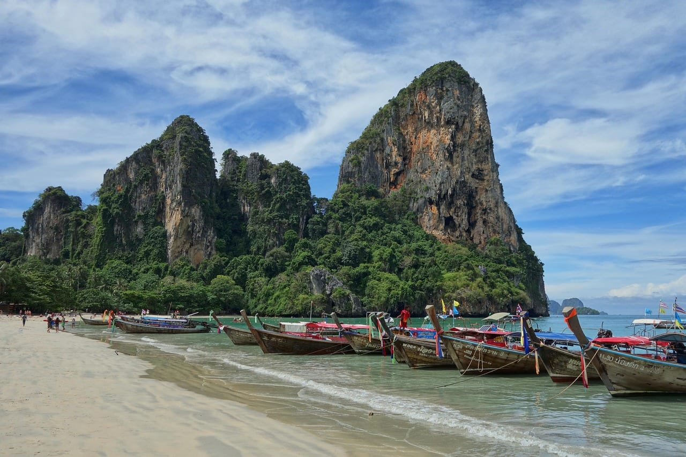
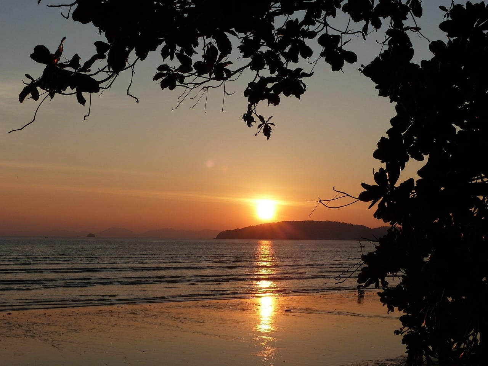
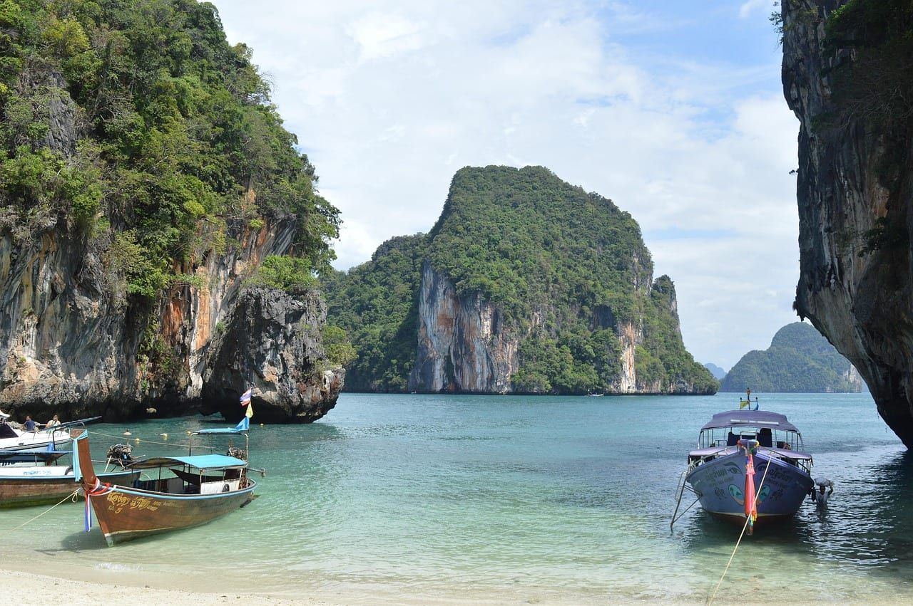
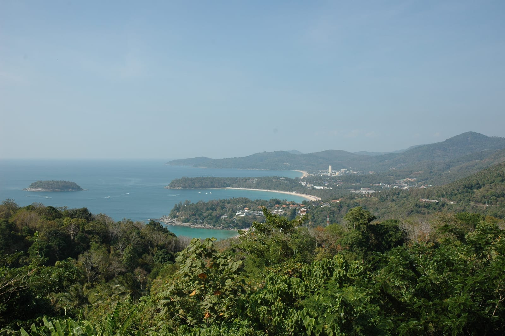
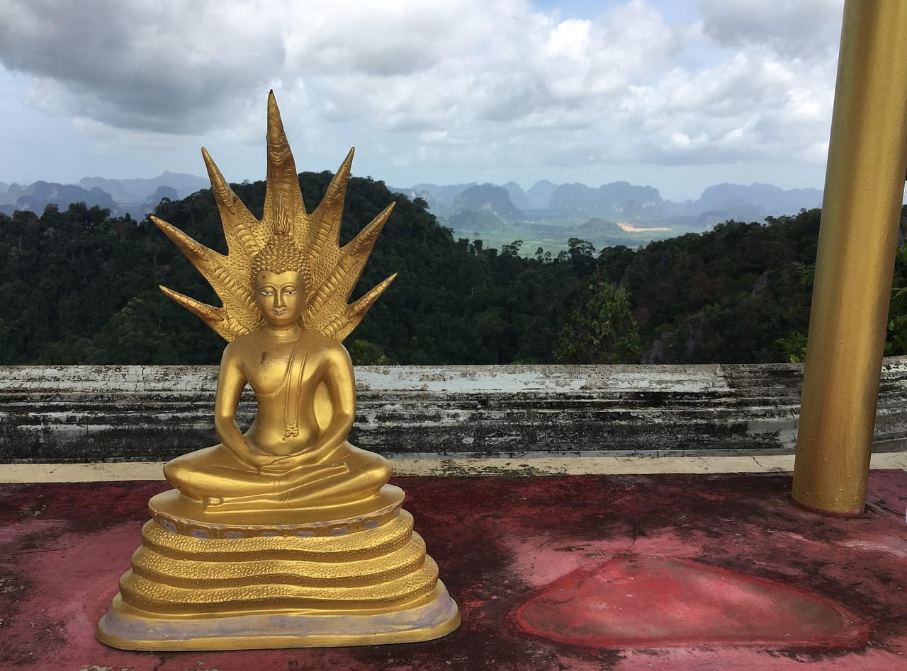

import AffiliateNote from '../../components/post/AffiliateNote.astro';
import { cherehapaCountry, aviasalesRoute } from '../../data/affiliate.js';

Краби продают как «Пхукет, только тише и дешевле». Половина правдива. Вторая половина стоит дня в дороге и лишних 330 миллиметров дождя за год.

> **Если коротко:** **Пхукет** — если летите в Таиланд первый раз, цените прямой рейс и хотите, чтобы всё работало рядом с отелем. **Краби** — если готовы доплатить дорогой ради скал, каяков и тишины. Главная развилка не в атмосфере, а в логистике: прямых рейсов из России в Краби нет вовсе, до него добираются с Пхукета или из Бангкока. <a href={aviasalesRoute('MOW', 'HKT', 'krabi_phuket_2027_tldr', 0)} class="aff-cta" rel="sponsored">Посмотреть цены на билеты в Таиланд</a>

<AffiliateNote />

---

## Чем Краби отличается от Пхукета

Краби — это не остров. Это провинция на материке напротив Пхукета: город Краби-таун, курортный посёлок Ао Нанг, отрезанный скалами полуостров Рейли и россыпь островов, включая Пхи-Пхи. Пхукет — остров, соединённый с материком мостом, и по площади он меньше Сингапура примерно на четверть.

| | Краби | Пхукет |
|---|---|---|
| **Как добраться из Москвы** | только с пересадкой | прямой рейс, 9 часов 15 минут |
| **Аэропорт** | в 8 км от города | в 26 км от города |
| **Чем берёт** | скалы, каяки, скалолазание | пляжи на любой вкус, инфраструктура |
| **Вечер** | пара улиц в Ао Нанге | Патонг и Бангла-роуд |
| **Дождей за год** | 2613 мм | 2283 мм |
| **Кому** | второй-третий раз в Таиланде | первый раз, семья, тусовка |

Рейли — то самое место с открыток, и попасть туда можно только с воды: дороги нет, скалы отрезают полуостров от материка.

---

## Где на самом деле суше зимой

Расхожий ответ — «климат у них одинаковый, оба на Андаманском море». На сопоставимых наблюдениях это неверно: Краби мокрее Пхукета каждый месяц года.

| Месяц | Краби, мм / дней с дождём | Пхукет, мм / дней с дождём |
|---|---|---|
| Ноябрь | 254 / 17 | 198 / 16 |
| Декабрь | 126 / 10 | 82 / 9 |
| Январь | 65 / 6 | 49 / 6 |
| Февраль | 48 / 5 | 24 / 3 |
| Март | 119 / 10 | 84 / 8 |
| Апрель | 197 / 17 | 131 / 14 |

Что из этого следует по делу. **Декабрь в Краби — ещё не сухой сезон**: десять дней с дождём против девяти на Пхукете и вдвое больше воды. Настоящее окно — **январь, февраль, март**, и февраль здесь вне конкуренции: пять дождливых дней, 48 мм. На Пхукете февраль ещё суше — три дня и 24 мм, вдвое меньше.

Апрель обманчив. Жара стоит та же, а дождь возвращается: семнадцать дней с осадками в Краби — это больше половины месяца. Едете на апрельские праздники — закладывайте, что часть дней уйдёт под воду.

Море тёплое круглый год, 28–30 °C, и на выбор месяца оно не влияет. Помесячная картина по всей стране, включая восточное побережье, — на [странице Таиланда](/thailand/), а разбор конкретного месяца — например, [Таиланд в феврале](/trips/february/thailand/).

---

## Как добраться: прямых рейсов в Краби нет

Это главное, что меняет расчёт поездки, и это редко пишут прямо.

У аэропорта Краби есть международные рейсы — Куала-Лумпур, Сингапур, Дубай, Абу-Даби, Дели, зимой сезонно Хельсинки, Копенгаген и Прага. Из России — ни одного.

Значит, путей три:

- **Через Пхукет.** Аэрофлот летает из Москвы ежедневно, дорога 9 часов 15 минут. Дальше паром или автобус — про них ниже.
- **Через Бангкок.** Перелёт до столицы, потом внутренний рейс до Краби: полтора часа, летают Thai AirAsia, Bangkok Airways и Thai Airways из обоих столичных аэропортов.
- **Через Ближний Восток.** Дубай и Абу-Даби дают стыковку прямо на Краби, без второго перелёта внутри Таиланда.

Переезд с Пхукета: у скоростных судов переход занимает около двух часов, у медленных — заметно дольше. Билет стоит 700–1 000 батов, это 1 800–2 550 ₽. Автобус дешевле — около 150 батов, 380 ₽, — но едет вдвое дольше. И важное: **паромы ходят сезонно**, примерно с ноября–декабря по апрель. Летом этот путь отпадает, остаётся дорога вокруг залива.

Разницу считайте честно. Прямой рейс на Пхукет — прилетели утром, к обеду на пляже. Краби отнимает полдня в одну сторону: через Бангкок это стыковка и второй перелёт, через Пхукет — переезд в порт и паром. Туда и обратно выходит день. За неделю отпуска — день из семи.

---

## Отливы: то, о чём узнают на месте

Вот чего нет ни в одном рекламном описании Ао Нанга. Между полной и малой водой здесь около двух метров по вертикали, и на пологом берегу это превращается в сотни метров по горизонтали.

Дважды в сутки море уходит. Не «немного отступает» — уходит так, что до воды идти по обнажённому дну, а под ногами камни, кораллы и водоросли. Купание в такие часы отменяется. Те, кто там жил, пишут об одном и том же: плавать выходило по утрам, а на возвращении прилива постоянно натыкались на кораллы.

Что с этим делать:

- Посмотреть таблицу приливов на свои даты до того, как выберете отель. Она есть в открытом доступе на каждый пляж отдельно.
- Брать отель с бассейном — на Ао Нанге это не роскошь, а страховка от половины светового дня без моря.
- На Рейли ситуация та же, а на восточной стороне полуострова в отлив вместо пляжа открывается мангровая грязь. Селиться надо на западной.

На Пхукете перепад такой же по высоте, но берег круче, и море уходит заметно меньше. Для семьи с маленькими детьми это весомее, чем разница в атмосфере.

---

## Что изменилось 15 сентября 2026

Безвизовый срок для россиян — **30 дней**. До 14 сентября 2026 действовало послабление на 60 дней, оно отменено.

Причина отмены не в России: Таиланд свернул общее правило для 93 стран и составил новый список из 60 государств с 30-дневным безвизом. России в этом списке нет — и это не ограничение, а особый порядок: с Таиландом у России действует отдельное межправительственное соглашение, и оно закрепляет те же 30 дней.

Продлить пребывание можно один раз ещё на 30 дней через иммиграционный офис — 1 900 батов, это 4 830 ₽, наличными, и подавать надо до того, как истекут первые тридцать. На границе спрашивают обратный билет: без него разворачивают.

Чем платить на месте — вопрос отдельный и меняется быстрее, чем расписание паромов: свежий статус карт по странам лежит в [таблице карт](/cards/). Условия въезда, документы на границе и порядок продления — в разборе [визы в Таиланд](/visa/thailand/).

---

## Сколько стоит дорога

Билет Москва — Пхукет на витрине поиска начинается от 21 800 ₽ в одну сторону. Это цена ближайших дат низкого сезона, и на зимние даты она не переносится: декабрь и январь — пик спроса, к новогодним числам перелёт дорожает кратно. Брать зимние даты нужно за два-три месяца.

Краби добавляет к этому:

- паром 1 800–2 550 ₽ на человека в одну сторону, либо
- внутренний перелёт Бангкок — Краби, либо
- автобус за 380 ₽ и четыре часа.

Итого поездка в Краби выходит дороже пхукетской на дорогу и на день времени. Жильё и еда это частично отыгрывают: Ао Нанг дешевле Патонга, но не втрое, как иногда обещают, — курорт давно не дикий и цены растут каждый сезон.

Байк и море дают больше всего обращений в клиники Таиланда, и счета там не тайские — <a href={cherehapaCountry('thailand', 'krabi_phuket_2027_ins')} class="aff-cta" rel="sponsored">подобрать страховку в Таиланд</a>.

Пхи-Пхи лежит между Краби и Пхукетом, и попасть туда одинаково удобно с обеих сторон — это не аргумент ни за, ни против.

---

## Кому Краби не подойдёт

Честный список, чтобы не покупать чужую картинку:

- **Первый раз в Таиланде.** Пересадка, паром, расписание — лишние точки отказа, когда ещё не понимаешь, как страна устроена.
- **Отпуск на неделю.** День на дорогу из семи — дорого.
- **Ребёнок, который хочет в море сейчас.** Отлив не спрашивает.
- **Вечерняя жизнь.** В Ао Нанге это одна улица с барами. Кому нужен Патонг — тому нужен Патонг.
- **Апрель и май.** Мокро, и мокрее, чем на Пхукете.

И наоборот, Краби выигрывает, когда: едете во второй-третий раз, берёте две недели, хотите каяки, скалолазание и острова без толпы, готовы жить в посёлке, а не в курортном городе.

---

## Сколько дней — что складывается

| Сколько есть | Куда | Как проходит | Честный минус |
|---|---|---|---|
| **7 дней** | Пхукет | Прилетели утром, к обеду на пляже. Один день на Пхи-Пхи, один на залив Пхангнга, остальное — море и город | Толпа в высокий сезон, Патонг шумит до утра |
| **7 дней** | Краби | День уходит на дорогу в обе стороны, остаётся шесть. Хватает на Ао Нанг, один выход на острова и подъём к храму | День из семи ушёл на переезды, а погода в декабре и апреле подводит |
| **10–14 дней** | Краби | Ао Нанг как база, два-три дня на Рейли, выход на Ко Ланту, каяки в мангровых протоках Ао Талане | Вечером делать нечего, кроме ужина; кому нужна ночная жизнь — заскучает |
| **10–14 дней** | Пхукет плюс Краби | Пять дней на Пхукете, паром, пять в Краби. Возвращаетесь через Пхукет, оттуда прямой рейс домой | Два заселения и переезд с чемоданами посреди отпуска |
| **3–4 дня** транзитом | Пхукет | Стыковка на пути дальше по Азии: доехать до пляжа и обратно успеваете | На Краби такой запас не тратят — дорога съест половину |

## Что выбрать под задачу

- **Неделя зимой, первый Таиланд, семья** — Пхукет. Февраль, если можете выбирать месяц.
- **Две недели, второй-третий раз, природа** — Краби. Январь или февраль, отель с бассейном, таблица приливов под рукой.
- **Хочу и то и другое** — прилетайте на Пхукет, пять дней там, паром, пять дней в Краби. Паром работает как раз в те месяцы, когда вы полетите.
- **Апрель** — Пхукет, и то с оговоркой: дождь возвращается в оба места, в Краби сильнее.

Пляжи, сезоны и цены соседних курортов — в разборе [Пхукет или Самуи](/blog/phuket-samui-2026/). Общая картина по стране, включая восточное побережье и Бангкок, — в [гайде по Таиланду](/blog/thailand-guide-2026/).

Храм Тигровой пещеры под Краби-тауном — больше 1 200 ступеней вверх. Идти лучше до семи утра: днём на лестнице без тени плюс тридцать и никакого ветра.
