import { aviasalesRoute, cherehapaCountry, youtravelCountry } from '../../data/affiliate.js';

export const flightHurghada = aviasalesRoute('MOW', 'HRG', 'kruiz_po_nilu_2027_flight_hrg', 10);
export const flightLuxor = aviasalesRoute('MOW', 'LXR', 'kruiz_po_nilu_2027_flight_lxr', 10);
export const tours = youtravelCountry('egypt', 'kruiz_po_nilu_2027_tours');
export const insurance = cherehapaCountry('egypt', 'kruiz_po_nilu_2027_insurance');

**Классический круиз по Нилу — это три-четыре ночи на теплоходе между Луксором и Асуаном.** Каюта, которую покупают на месте в Асуане, стоит 75–85 $ с человека за ночь — это 6 300–7 200 ₽. Неделя у российского оператора, с Каиром и морем в Хургаде, — 119 878 ₽ с человека на 31 октября — 7 ноября 2026 года и 98 887 ₽ на 9–16 января 2027-го, перелёт отдельно. Дахабия под парусами — 330 € за ночь, около 32 400 ₽. Премиальный тур с Абу-Симбелом — от 840 000 ₽.

Плыть лучше с ноября по февраль: днём в Луксоре +23…+29 °C. С мая по сентябрь там +39…+41 °C.

Теперь то, о чём витрины молчат. Теплоход — скорее плавучая гостиница, чем корабль в пути: в трёх свежих отчётах путешественников из трёх-четырёх ночей судно шло по реке от суток до двух, остальное время стояло у причалов. Ниже пять форматов круиза с ценой и минусом каждого, ловушка «круиза из Хургады», что не входит в цену и как добраться из Москвы.

## Как устроен круиз и сколько он плывёт на самом деле?

**Теплоход идёт между Асуаном и Луксором, по пути встаёт у храмов в Ком-Омбо и Эдфу и проходит шлюз в Эсне.** Вниз по течению, из Асуана, круиз обычно длится три ночи. Вверх, из Луксора, — четыре. Храмы смотрят на стоянках, поэтому подъёмы ранние, а часы хода приходятся на день и вечер.

Как это выглядит на деле, видно по двум отчётам на форуме Винского. В отчёте, опубликованном в мае 2026 года, путешественники прилетели в Асуан во вторник в семь утра и в тот же день в 14:00 отплыли. До Луксора теплоход шёл ровно сутки, потом ещё сутки стоял у причала: день на храмы Луксора, ночь на борту, утром выселение.

Во втором отчёте, от января 2025 года, четырёхночный круиз из Луксора по расписанию уходил в субботу, а фактически отплыл в воскресенье в 14:00. В Асуан пришли в понедельник поздно вечером, и весь вторник судно простояло у берега как отель.

Из майского отчёта же практичный совет: на стоянке в Луксоре каюта по правому борту смотрела на реку, а по левому — на берег. Совет одного автора, но уточнить сторону при покупке ничего не стоит.

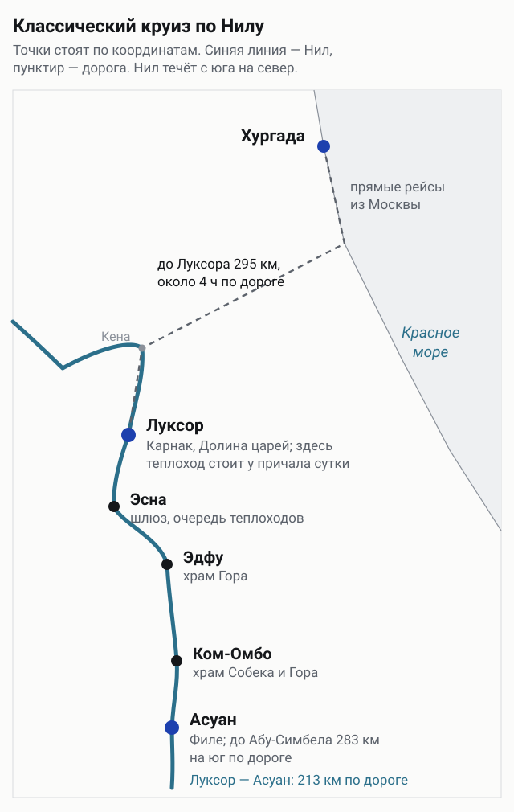
*Точки стоят по координатам. Теплоход идёт по синей линии, из Хургады к Луксору — дорога 295 км.*

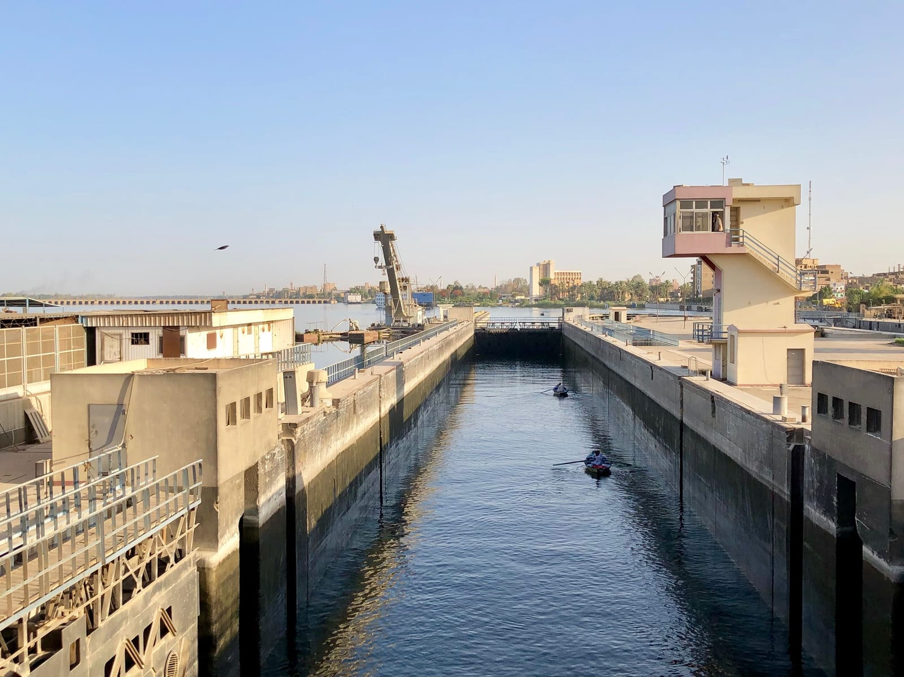
*Шлюз в Эсне. Через него проходит каждый теплоход между Луксором и Асуаном.*

## Пять способов проплыть по Нилу и одна ловушка

Дешевле всего — каюта, купленная на месте, дороже всего — премиальный тур, а посередине пакет на неделю и дахабия. Главное различие не в цене за ночь, а в том, кто решает за вас даты и что включено в цену.

| Формат | Ночей на борту | Цена с человека | Главный минус |
|---|---:|---|---|
| Неделя из Москвы: Каир, теплоход, Хургада | 4 из 7 | 98 887–119 878 ₽ | даты и группа заданы, перелёт отдельно |
| Каюта на месте, Асуан — Луксор | 2–3 | 75–85 $ за ночь, 6 300–7 200 ₽ | в январе мест может не быть |
| Бронь заранее, Луксор — Асуан | 4 | около 1 100 $ за круиз, 92 800 ₽ | последняя ночь — стоянка в Асуане |
| Дахабия, Эсна — Асуан | 4 | 330 € за ночь, 129 700 ₽ за круиз | примерно в 5 раз дороже каюты на месте |
| Премиум с Абу-Симбелом | 5 | от 840 000 ₽ | цена |

### Неделя из Москвы: Каир, четыре ночи на теплоходе и Хургада

Российские операторы продают неделю по одной схеме: две ночи в Каире с пирамидами, переезд в Асуан, четыре ночи на теплоходе до Луксора и две ночи на море в Хургаде. На теплоходе Jaz Al Qassida это 119 878 ₽ с человека на 31 октября — 7 ноября 2026 года и 98 887 ₽ на 9–16 января 2027-го. Экскурсии по программе входят в цену: пирамиды Гизы, Асуанская плотина с островом Филе, храмы Ком-Омбо и Эдфу.

Минус — всё задано за вас: даты, группа, время выходов. Перелёт покупается отдельно, и прилетаете вы в Каир, а улетаете из Хургады.

### Каюта на месте: Асуан — Луксор за три ночи

Самый дешёвый способ — прилететь в Асуан и договориться на причале или через местного посредника. В мае 2025 года посредник запросил 75 $ за ночь с человека с экскурсиями и по переписке пообещал 60 $. На месте на первом теплоходе оказались маленькие неоткрывающиеся окна, и за следующий, с большими окнами, заплатили исходные 75 $. В январе 2025-го другое агентство продало три ночи по 85 $ с человека без экскурсий, с экскурсиями было бы 150 $, — за двоих заплатили 510 $, около 43 000 ₽.

Минус — сезон. В январе 2026 года путешественники обошли на набережной Асуана больше десяти теплоходов: у всех либо полная бронь, либо неподходящий день отхода. В итоге взяли две ночи на Semiramis II за 360 $, без торга. Платили на месте наличными.

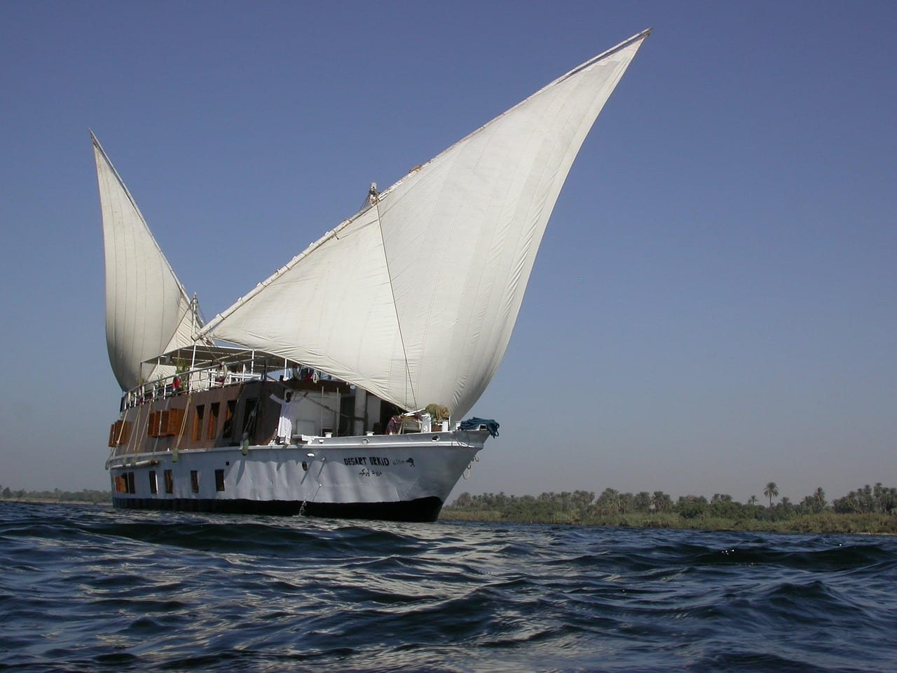
*Дахабия на Ниле. На таких судах идут вверх по реке от Эсны до Асуана за четыре ночи.*

### Бронь заранее: Луксор — Асуан за четыре ночи

Если не хочется торговаться на жаре, каюту бронируют заранее — на сайте бронирования отелей или через агентство. В январе 2025 года четыре ночи на теплоходе в конце месяца стоили около 2 200 $ на двоих — примерно 92 800 ₽ с человека. На другом судне в круизе 30 октября — 3 ноября 2025 года платили 160 $ в сутки за двоих, то есть 80 $ с человека за ночь.

Минус — последняя ночь: судно пришло в Асуан и стоит у берега, вы по сути доплачиваете за отель. И теплоход теплоходу рознь: в том ноябрьском круизе окна кают не открывались, спать можно было только под кондиционером, на верхней палубе стояли лежаки без зонтов.

### Дахабия: Эсна — Асуан под парусом

Дахабия — парусное судно на несколько кают вместо сотни пассажиров теплохода. У одного из операторов вверх по реке от Эсны до Асуана идут четыре ночи, вниз — три, отправления по фиксированным дням недели. Ночь в двухместной каюте — 330 € с человека (32 400 ₽), одному — 490 € (48 200 ₽). Четыре ночи на двоих выходят в 2 640 €, около 259 500 ₽. В отчёте октября 2024 года дахабия стоила 500 $ в день с человека, с едой, напитками и экскурсиями, кроме алкоголя.

Минус — цена: примерно в пять раз дороже каюты, купленной на месте. И маршрут начинается в Эсне, а не в Луксоре, — до причала добираются машиной.

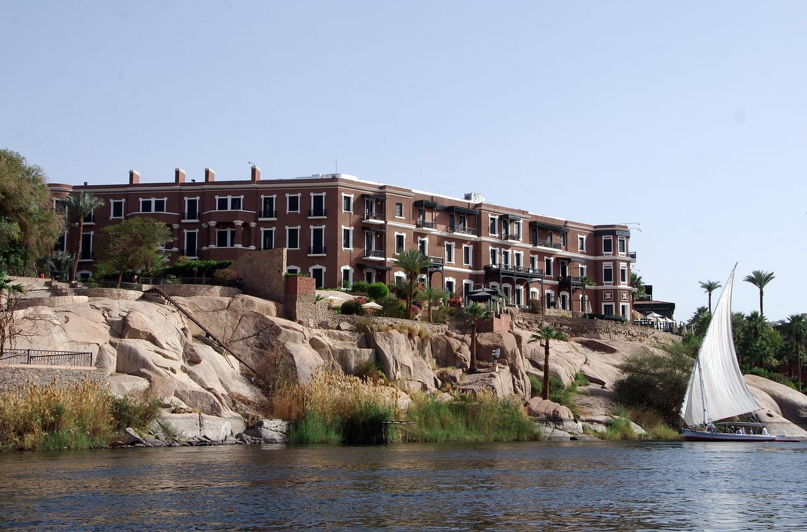
*Фелука у скал Асуана. Выше на берегу — отель «Олд Катаракт».*

### Премиум: пять ночей с Абу-Симбелом

Верхний край рынка — туры, где в цене всё: отель у Нила в Каире, внутренние перелёты, входные билеты и полный пансион на борту. Пять ночей на теплоходе Sanctuary Sun Boat III на 5–13 января 2027 года стоят от 840 000 ₽ с человека, плюс сервисный сбор на борту 60 $, около 5 100 ₽. Десять дней с Абу-Симбелом на теплоходе класса люкс Jaz Elite Senator на 26 октября — 4 ноября 2026 года — от 900 000 ₽.

Минус один — цена. За неё вы получаете тишину, меньшую группу и гида-египтолога, но храмы те же, что у пассажиров каюты за 75 $.

### Ловушка: «круиз по Нилу» из Хургады за 51 $

На витринах экскурсий в Хургаде под Нилом часто продают другое: однодневную поездку в Луксор на 16–20 часов в группе до 45 человек, где река — это прогулка на лодке между храмами. Такая программа стоит от 51 $, это 4 300 ₽. Настоящий круиз из Хургады — это 295 км дороги до Луксора, около четырёх часов в одну сторону, и минимум две ночи на борту. Перед оплатой ищите в описании число ночей на теплоходе.

Отдельный формат — круиз по озеру Насер от Асуана до Абу-Симбела на три-четыре ночи. Цен на зиму 2026/27 у операторов найти не удалось, поэтому в таблицу он не попал.

Готовые программы с круизом по Нилу, от недели с Каиром до больших туров по всему Египту, собраны в одном каталоге: <a href={tours} class="aff-cta" rel="sponsored">Посмотреть туры по Египту с круизом по Нилу</a> — оплата картой РФ.

## Сколько дней закладывать на поездку?

**Сам круиз — три-четыре ночи, вся поездка — от пяти дней до двух недель.** Всё упирается в то, хотите ли вы Каир с пирамидами и море после храмов.

| Дней | Что складывается | Кому подходит |
|---:|---|---|
| 5–6 | перелёт в Луксор или Асуан с пересадкой, 3 ночи на борту | тем, кому нужен только Нил |
| 7–8 | Каир 2 ночи, теплоход 4 ночи, Хургада 2 ночи | первой поездке в Египет |
| 10 | то же плюс Абу-Симбел | тем, кто хочет увидеть главное за раз |
| 12–14 | круиз плюс неделя на море | тем, кому после храмов нужен отдых |

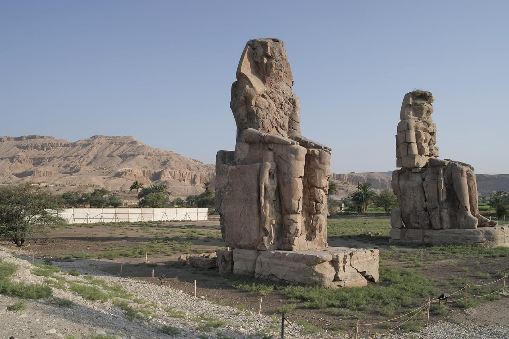
*Колоссы Мемнона на западном берегу Луксора. Их показывают по дороге к Долине царей.*

## В каком месяце плыть по Нилу?

**С ноября по февраль: днём в Луксоре и Асуане +23…+29 °C.** Октябрь, март и апрель — пограничные месяцы, днём +29…+36 °C. С мая по сентябрь днём +39…+41 °C, и от жары не спасают даже экскурсии в шесть утра.

| Месяц | Луксор, день / ночь | Асуан, день / ночь |
|---|---:|---:|
| Октябрь | +35 / +18 °C | +36 / +21 °C |
| Ноябрь | +29 / +12 °C | +29 / +16 °C |
| Декабрь | +24 / +8 °C | +24 / +11 °C |
| Январь | +23 / +6 °C | +23 / +9 °C |
| Февраль | +25 / +8 °C | +25 / +11 °C |
| Март | +30 / +12 °C | +29 / +15 °C |
| Апрель | +35 / +17 °C | +35 / +20 °C |
| Июль | +41 / +25 °C | +41 / +26 °C |

Две вещи из этой таблицы меняют сборы. Первая — ночи с декабря по февраль: в Луксоре +6…+8 °C, а на верхней палубе ещё и ветер. Нужен свитер или флиска, а не лёгкая кофта.

Вторая — январь. Это самый прохладный и самый востребованный месяц: в январе 2026 года путешественники обошли на месте больше десяти теплоходов, прежде чем нашли каюту. На январь и новогодние даты каюту лучше бронировать заранее.

*Фелука на Ниле на закате. Такие лодки катают туристов по вечерам у Асуана и Луксора.*

## Что не входит в цену круиза?

**Если каюту берёте на месте или бронируете сами, отдельно платите за входные билеты, чаевые, напитки и визу.** В пакетах российских операторов экскурсии по программе обычно включены, но проверяйте строку «включено в стоимость» до оплаты.

| Храм или место | Взрослый билет | В рублях |
|---|---:|---:|
| Карнак | 600 EGP | 986 ₽ |
| Луксорский храм | 500 EGP | 821 ₽ |
| Долина царей | 750 EGP | 1 232 ₽ |
| Гробница Тутанхамона, отдельно | 700 EGP | 1 150 ₽ |
| Храм Хатшепсут | 360 EGP | 591 ₽ |
| Эдфу | 550 EGP | 904 ₽ |
| Ком-Омбо | 450 EGP | 739 ₽ |
| Филе | 550 EGP | 904 ₽ |
| Абу-Симбел | 750 EGP | 1 232 ₽ |

Семь мест из обычной программы — Карнак, Луксорский храм, Долина царей, Хатшепсут, Эдфу, Ком-Омбо и Филе — дают 3 760 египетских фунтов, около 6 200 ₽ с человека. Тутанхамон сверху — ещё 1 150 ₽. В Абу-Симбеле 22 февраля и 22 октября, когда солнце заглядывает в святилище, билет стоит 1 200 фунтов вместо 750. Студентам почти везде вдвое дешевле.

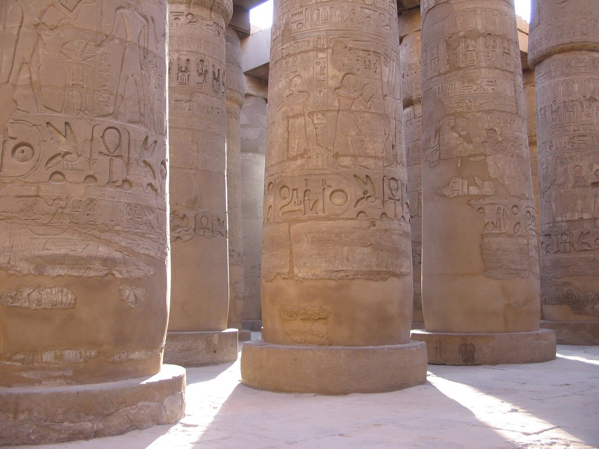
*Гипостильный зал Карнака. Билет сюда — самый дорогой из храмов Луксора, 600 фунтов.*

Остальное — из отчётов путешественников. Чаевые экипажу оставляют разом в конце круиза на ресепшене, от 20 $ с человека, около 1 700 ₽. Напитки на борту — 3–5 $, чай и кофе — 2–3 $. Виза — 30 $, это 2 500 ₽.

Пример на двоих: три ночи в каюте на месте по 85 $ — 510 $, около 43 000 ₽; билеты на семь мест — 12 400 ₽; чаевые — 3 400 ₽; визы — 5 100 ₽. Выходит около 64 000 ₽ без перелёта и дороги до Асуана.

<a href={insurance} class="aff-cta" rel="sponsored">Подобрать страховку в Египет на свои даты</a> — оплата картой РФ.

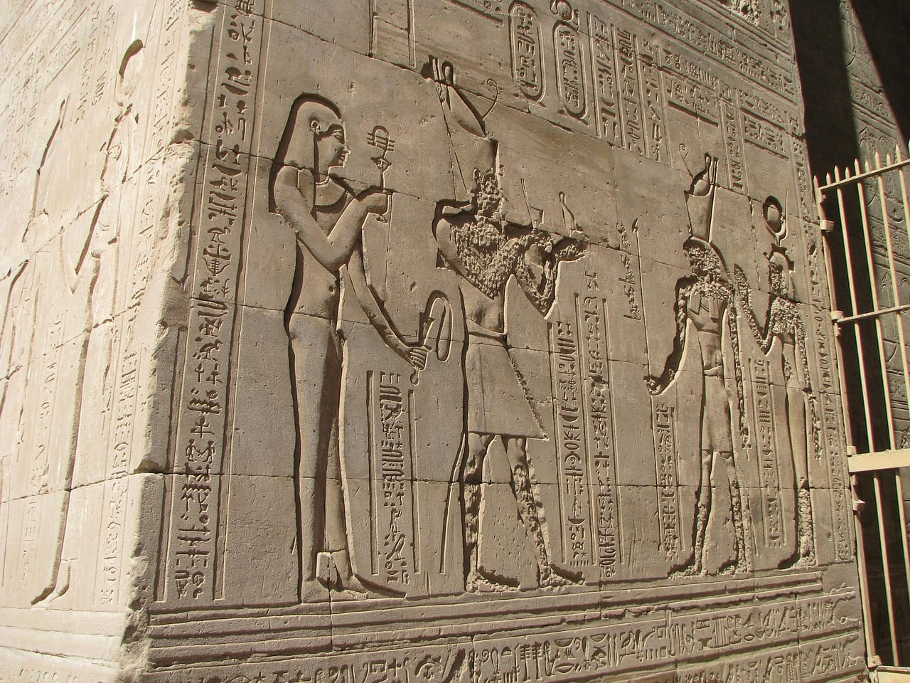
*Рельефы храма Гора в Эдфу. К нему выходят со стоянки теплохода.*

## Как добраться из Москвы: Хургада, Луксор или Каир?

**Дешевле всего лететь в Хургаду и ехать к Нилу машиной: до Луксора 295 км, около четырёх часов.** Прямые рейсы туда-обратно на ноябрь 2026 и январь 2027 года начинаются от 48 000 ₽, с пересадкой — от 28 000–30 000 ₽. В Луксор из Москвы летают только с пересадками: середина найденных цен на ноябрь–январь — 66 000–80 000 ₽. В Каир есть прямые рейсы, от 47 500 ₽ туда-обратно.

Это минимумы, которые кто-то нашёл на конкретные даты. На ваши даты будет дороже, на Новый год — заметно.

<a href={flightHurghada} class="aff-cta" rel="sponsored">Найти билет Москва — Хургада на ноябрь</a> — прямые рейсы есть. Лететь сразу к Нилу: <a href={flightLuxor} class="aff-cta" rel="sponsored">Москва — Луксор на ноябрь</a> — только с пересадкой.

Россиянам в Египет нужна виза за 30 $: её ставят в аэропорту прилёта или оформляют заранее онлайн. Действует месяц, на месте её можно бесплатно продлить ещё на два. Подробности — на странице [виза в Египет](/visa/egypt/).

⛔ Ловушка Шарм-эль-Шейха. Прилетевшим туда можно обойтись без визы: ставят бесплатный синайский штамп на 15 дней. Но он действует только в курортной зоне Южного Синая, и с ним на Нил не поехать. Если собираетесь на круиз, берите обычную визу за 30 $ прямо в аэропорту. Как выбрать между двумя курортами, разобрано в статье [Хургада или Шарм-эль-Шейх](/blog/hurghada-sharm-2026/).

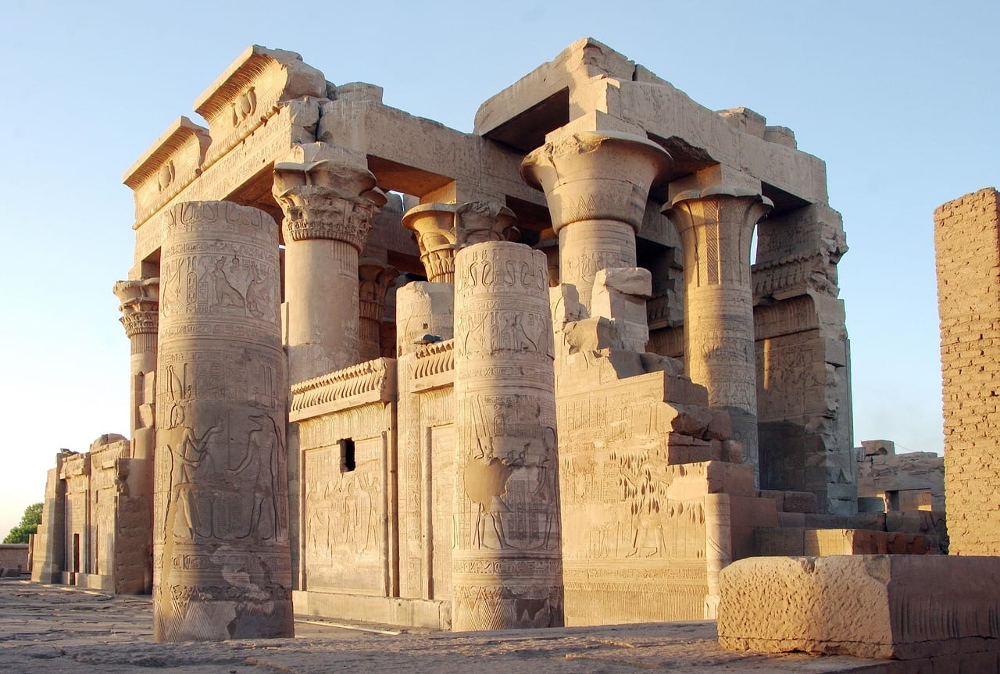
*Храм Ком-Омбо, посвящённый Собеку и Гору. Теплоход встаёт у него на пути между Асуаном и Эдфу.*

Если Нил вы хотите совместить с морем, сезон на побережье разобран в гайде [когда лучше ехать в Египет](/blog/egypt-guide-2026/). А Луксор летом 2027 года станет главной точкой полного солнечного затмения — но это +41 °C в тени, про это отдельно: [затмение 2 августа 2027 года](/blog/solnechnoe-zatmenie-2027/).

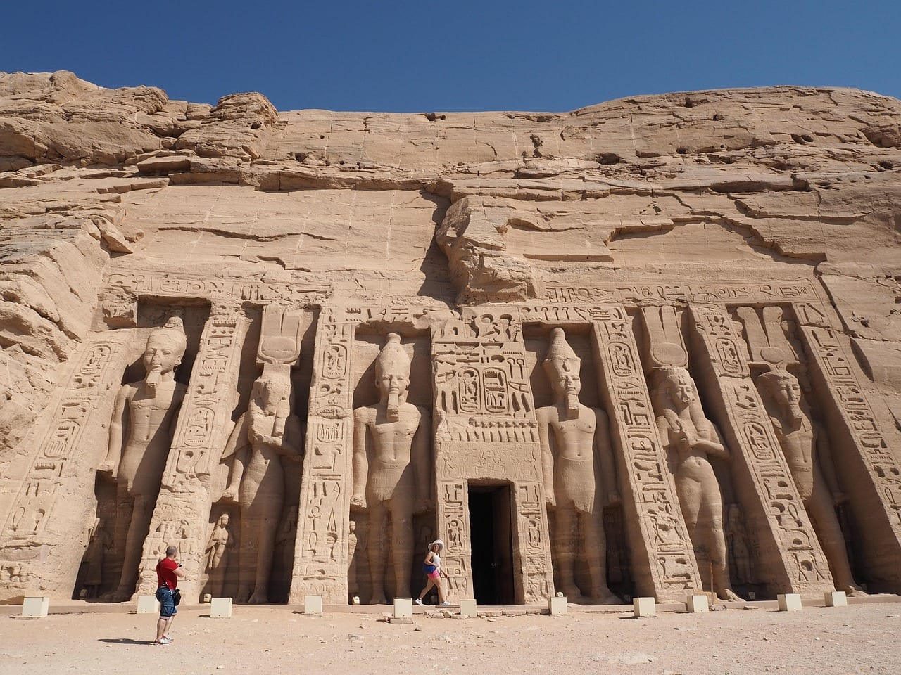
*Малый храм Абу-Симбела. От Асуана до него 283 км по дороге через пустыню.*

## Что пишут те, кто плавал

Выборка маленькая, и сказать это нужно сразу: 17 сообщений с конкретикой за март 2023 — май 2026 года в трёх темах форума Винского. Представительной её считать нельзя, но противоречия в ней полезнее средних цифр.

- **Торг работает не всегда.** В мае 2025 года посредник в Асуане по переписке сбавил цену с 75 до 60 $ за ночь, но за теплоход с нормальными окнами на месте взял исходные 75 $. В январе 2026-го другие путешественники обошли больше десяти теплоходов и взяли каюту без торга. Решают загрузка и сам теплоход, а не умение торговаться.
- **Дни отхода — главная путаница.** Один автор пишет, что из Асуана по воскресеньям теплоходы не уходят вообще. Другой вспоминает, что кто-то на форуме запрещал вторник, а они отплыли именно во вторник в 14:00. Единого расписания нет, день отхода уточняйте у продавца.
- **Плавучий отель или путешествие — зависит от судна.** Автор отчёта о круизе 30 октября — 3 ноября 2025 года посчитал, что из четырёх ночей лодка шла два дня, а на стоянке встала к соседнему судну «окна в окна». Авторы майского отчёта 2026 года пишут, что увидели всё, что хотели, без спешки и толп.
- **Жалобы повторяются:** духота в каютах старых судов, дорогие напитки на борту, гиды разного уровня.

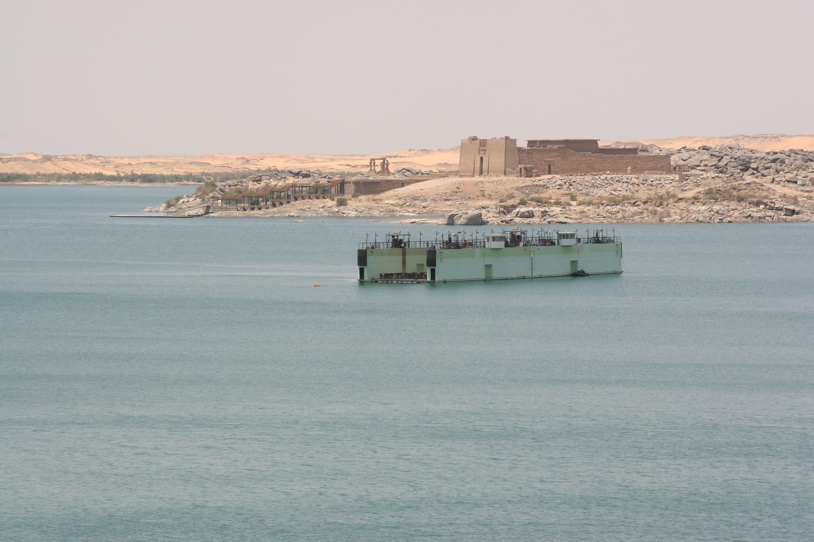
*Храм Калабша на берегу озера Насер. Круизы по озеру идут от Асуана до Абу-Симбела.*

## FAQ — что ещё спрашивают про круиз по Нилу

### Плыть вверх или вниз по течению?

Вниз, из Асуана в Луксор, — обычно три ночи, и круиз выходит на ночь дешевле. Вверх, из Луксора, — четыре ночи, и это удобнее тем, кто прилетает в Хургаду: до Луксора 295 км, а до Асуана через Луксор — больше 500.

### Можно ли поехать на круиз из Шарм-эль-Шейха?

Можно, но с обычной визой за 30 $, а не с бесплатным синайским штампом. И дорога долгая: до Луксора по дорогам больше 1 000 км, поэтому из Шарма к Нилу чаще летят с пересадкой через Каир.

### Сколько стоит круиз по Нилу на двоих?

Каюта на месте на две-три ночи — 360–510 $, это 30 400–43 000 ₽, плюс билеты около 12 400 ₽. Неделя у российского оператора — от 197 800 ₽ на двоих без перелёта. Премиальный тур — от 1,68 млн ₽.

### Что взять с собой зимой?

Тёплый слой на вечер: в декабре–феврале ночью в Луксоре +6…+8 °C. Закрытую удобную обувь для храмов, солнцезащитный крем — днём в январе +23 °C и открытое солнце. И наличные доллары: на причале и за чаевые платят ими.

### Можно ли с детьми?

Можно, но детские тарифы у каждого судна свои: в одном отчёте января 2025 года ребёнка четырёх лет взяли бесплатно. С детьми разумнее ехать с ноября по февраль — летом у храмов днём +41 °C.

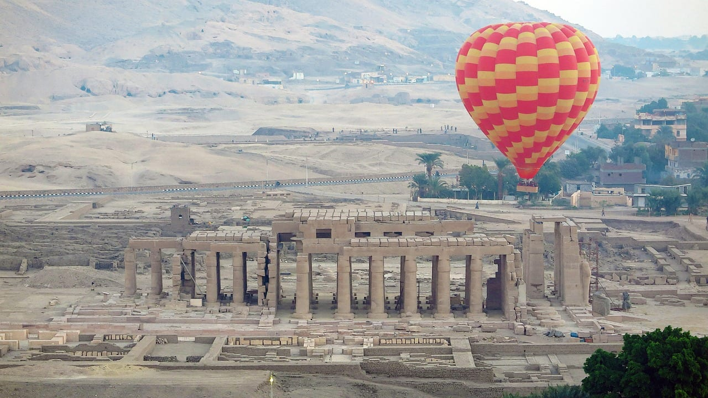
*Рассвет над Рамессеумом. Полёт на шаре над западным берегом — частая добавка к круизу в Луксоре.*
