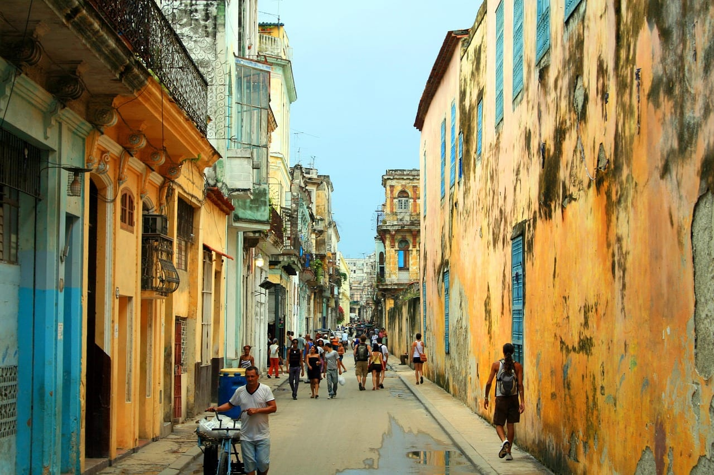
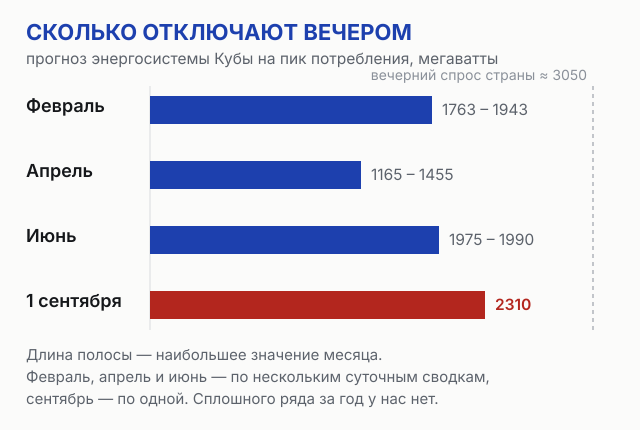
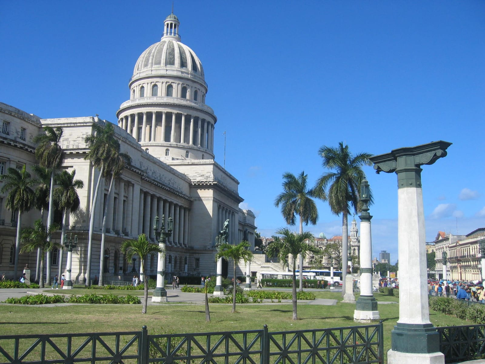
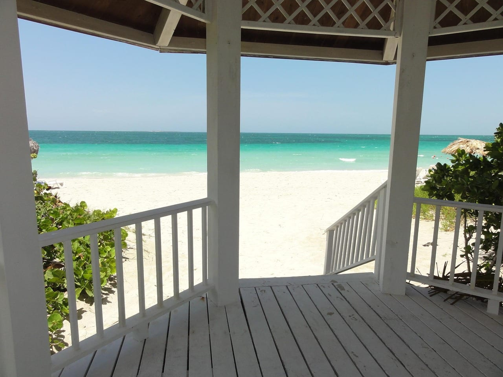
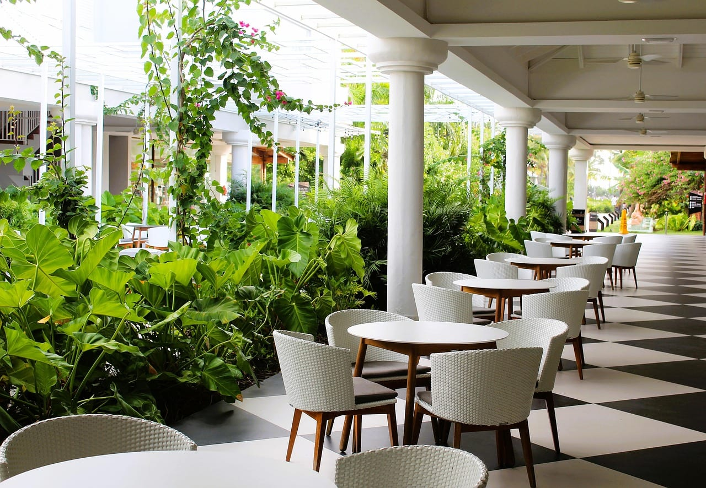
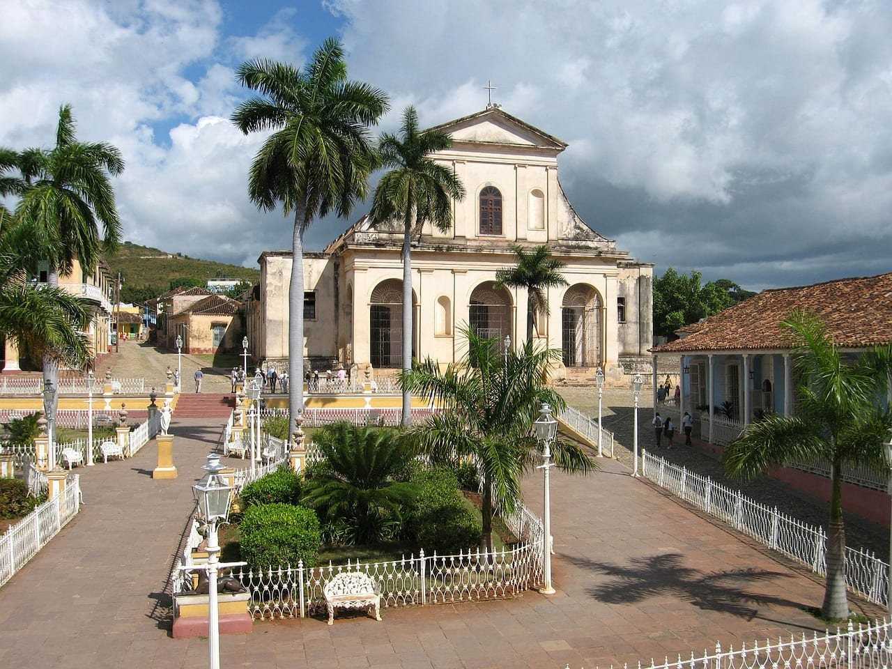

import AffiliateNote from '../../components/post/AffiliateNote.astro';
import LivePriceTable from '../../components/post/LivePriceTable.astro';
import { aviasalesRoute, cherehapaTravel } from '../../data/affiliate.js';

export const puntaCanaFlight = aviasalesRoute('MOW', 'PUJ', 'kuba_2027_punta_cana_flight', 11);
export const cancunFlight = aviasalesRoute('MOW', 'CUN', 'kuba_2027_cancun_flight', 11);
export const insurance = cherehapaTravel('kuba_2027_insurance');

Люди ищут не Кубу. Люди ищут, куда делись туры на Кубу: «есть ли сейчас», «почему нет», «когда возобновятся». В сентябре таких запросов около тысячи трёхсот в месяц, а витрины операторов отвечают на них страницей «купить путёвку».

> **Если коротко:** **прямых рейсов из России на Кубу нет с 12 февраля 2026 года** — «Россия» и Nordwind вывезли туристов и остановили программу из-за того, что кубинские аэропорты перестали заправлять самолёты. **7 сентября 2026 года гендиректор «Аэрофлота» Сергей Александровский сказал на Восточном экономическом форуме: «Кубу пока не планируем»** — в зимнем расписании её не будет, единственное новое направление компании до конца года — Фукуок. Долететь через третьи страны можно, но дорога выходит самой дорогой в карибской тройке: по одной и той же ежедневной выгрузке минимальных цен декабрьский билет в одну сторону до Гаваны стоит **165 750 ₽** против **117 157 ₽** до Пунта-Каны и **108 005 ₽** до Канкуна. Прямых рейсов при этом нет ни на одном из трёх направлений: у «Северного ветра» и Канкун, и Пунта-Кана помечены «Временно не летаем». <a href={puntaCanaFlight} class="aff-cta" rel="sponsored">Посмотреть перелёт Москва — Пунта-Кана</a> — Aviasales откроет маршрут с датой в декабре, свои дни подставьте сами.

<AffiliateNote />

## Почему рейсы встали

Дело не в решении туроператоров и не в политике. Дело в керосине.

10 февраля 2026 года кубинская сторона уведомила авиакомпании, что на ближайший месяц заправить самолёты в аэропортах страны не сможет. Для дальнемагистрального рейса это приговор: борт из Москвы долетает до Гаваны за тринадцать с лишним часов и обратно без дозаправки не уйдёт.

12 февраля «Россия» и Nordwind выполнили вывозные рейсы, забрали туристов и остановили полётную программу «до изменения ситуации». Одновременно Минэкономразвития рекомендовало туроператорам приостановить продажу туров на кубинские курорты. С тех пор регулярного прямого сообщения между Россией и Кубой нет.

Витрины при этом остались открытыми. На странице Кубы у Coral Travel 8 сентября 2026 года стояло описание с прямыми рейсами из Внукова раз в две недели — текст описывает программу, которой сейчас не существует. Человек читает такую страницу и идёт искать, что происходит; отсюда и весь вопросный куст в поиске.

## Вернутся ли рейсы этой зимой

Нет. Это самый свежий и самый определённый факт в статье.

7 сентября 2026 года на Восточном экономическом форуме во Владивостоке гендиректор «Аэрофлота» Сергей Александровский сказал про зимний сезон 2026/27 дословно: «Кубу пока не планируем. По новым направлениям, кроме Фукуока, пока ничего до конца года не будет». Зимнее расписание — это ноябрь — март, то есть весь высокий карибский сезон.

Министр транспорта Андрей Никитин говорил о заинтересованности восстановить полёты после того, как на острове наладится с топливом. Условие названо честно, срок — нет. Планировать поездку под фразу «после того, как наладится» нельзя.

Что это значит на практике: **если вы хотите Кубу на новогодние каникулы, готового пакета «перелёт плюс отель» из России не будет**. Останется самостоятельная сборка через третью страну — и цена, о которой ниже.

## Что на острове сейчас

Здесь я опираюсь на кубинские государственные публикации, и это ограничение стоит назвать сразу: сводки энергосистемы и статистику въезда публикует та же сторона, которой невыгодно выглядеть плохо. Тем ценнее, что цифры в них плохие.

**Свет.** Кубинская энергосистема каждый день публикует прогноз отключений на вечерний пик. 5 июня 2026 года сводка выглядела так: доступно 1 090 МВт при максимальном спросе 3 050 МВт, отключить планировалось 1 990 МВт — около двух третей вечернего потребления страны. К осени стало хуже: 1 сентября прогноз отключений составил 2 310 МВт.

Отель с генератором держит свет и кондиционер, но генератор работает на топливе, а топливо и есть дефицит. За пределами отельной территории вечерний город — это тёмные улицы и неработающие светофоры.

**Туристы.** Управление статистики Кубы 1 сентября 2026 года опубликовало данные за январь — июль: **419 863 иностранных посетителя, это 37,2 % от прошлогоднего уровня** за тот же период — почти 709 тысяч человек недосчитались. Считая кубинцев, живущих за границей, всего въехало 794 492 человека — вдвое меньше, чем годом раньше. Сильнее всех просела Канада (минус 350 737 человек), за ней кубинская диаспора и США; Россия тоже в списке снизившихся.

Пустой курорт звучит соблазнительно, пока не вспомнишь, откуда берутся деньги на дизель для генератора и продукты для шведского стола.

**Деньги.** Visa и Mastercard на Кубе не работают — они заблокированы американскими санкциями, и это не новость 2026 года. С картами МИР сложнее, и я не стану делать вид, что знаю ответ: наша [страница карт по странам](/cards/) на сверке 6 мая 2026 года записала приём примерно в 20 тысячах точек, а наш же [разбор страховки на Кубу](/blog/cuba-insurance-2026/) пишет осторожнее: принимали местами в Гаване и Варадеро, рассчитывать нельзя. Публичного списка стран у платёжной системы нет, за полгода топливного кризиса терминалы могли отключиться где угодно, а проверять это на месте поздно. Вывод для поездки один при любом раскладе: **наличные евро на всю сумму**. Доллары США на Кубе меняют хуже и с потерей.

## Сколько стоит долететь через третью страну

Гавану обслуживают иностранные авиакомпании, и билет из Москвы с пересадками собирается. Вопрос — за какие деньги.

Ниже — наша ежедневная выгрузка минимальных цен из Москвы. Это самый дешёвый билет **в одну сторону на одного**, который нашёлся на месяц вылета, а не средняя цена сезона и не стоимость поездки: на конкретные даты такой билет часто не собирается.

<LivePriceTable iata="HAV" />

Сравнение с двумя другими карибскими направлениями по той же выгрузке, всё в одну сторону на одного:

| Направление | Декабрь 2026 | Январь 2027 | Февраль 2027 |
|---|---:|---:|---:|
| **Гавана** | 165 750 ₽ | 154 075 ₽ | 142 987 ₽ |
| **Пунта-Кана** | 117 157 ₽ | 107 747 ₽ | 105 681 ₽ |
| **Канкун** | 108 005 ₽ | 105 752 ₽ | 104 601 ₽ |

Разница в декабре — **48 593 ₽ на человека в одну сторону** между Гаваной и Пунта-Каной и **57 745 ₽** между Гаваной и Канкуном. Если обратный билет обойдётся в ту же сумму — предположение шаткое, ниже объясняю почему, — то на двоих туда-обратно Гавана дороже Пунта-Каны на **194 372 ₽**, а Канкуна на **230 980 ₽**. Это доплата за то, чтобы прилететь в страну с двумя третями вечерних отключений и без работающих иностранных карт.

⚠️ **Два предупреждения к этим числам, оба важнее самих чисел.**

Первое: прямых рейсов нет **ни на одном** из трёх направлений. У авиакомпании «Северный ветер» в календаре цен и по Канкуну, и по Пунта-Кане 8 сентября 2026 года стояло «Временно не летаем в этом направлении» — я смотрел на сайте самого перевозчика. Чартерные программы туроператоров на Мексику существуют, но продаются пакетом и на конкретные даты; расписания на агрегаторах при этом висят и после отмены рейсов.

Второе: выгрузка годится, чтобы сравнить направления между собой, и не годится, чтобы посчитать бюджет. Числа в ней — билет в одну сторону, найденный где-то внутри месяца. Когда мы в конце августа искали билет в Пунта-Кану на конкретные даты в январе руками, туда-обратно вышло **147 349 ₽** с ручной кладью и **161 434 ₽** с багажом — это [разбор Доминиканы](/blog/dominican-republic-2027/), и складывать одно с другим нельзя: единицы разные. Пользуйтесь колонками таблицы как линейкой между направлениями, а свои даты считайте поиском.

Курс ЦБ на 8 сентября 2026 года: доллар 86,19 ₽, евро 100,17 ₽ — по нему считайте всё, что на месте называют в валюте.

## Кому Куба всё-таки имеет смысл

Не хочу, чтобы статья читалась как «не ездите». Есть люди, которым туда стоит, и их немного.

**Тем, кто едет за Кубой, а не за морем.** Гавана, Тринидад, табачные долины Виньялеса, музыка — это не заменяется Доминиканой. Если цель — страна, а не пляж с браслетом, пустой сезон играет в вашу пользу хотя бы очередями: при въезде вдвое меньше людей, чем год назад, — это прямо следует из статистики выше. Что при этом будет с ценами на жильё, я не знаю: мы их не мерили.

**Тем, кто ездит самостоятельно и умеет без сервиса.** Наличные на всю поездку, запас на непредвиденное, готовность к тому, что вечером в кафе не будет света, а в магазине половины позиций.

**Кому точно не стоит:** с маленькими детьми, при хронических болезнях, требующих аптеки и работающего холодильника для лекарств, и всем, кто покупает отдых пакетом и ждёт, что за него всё решат. Медицинская страховка при въезде на Кубу обязательна — это [отдельный разбор](/blog/cuba-insurance-2026/), и в нынешней обстановке экономить на покрытии не стоит. <a href={insurance} class="aff-cta" rel="sponsored">Сравнить полисы на Cherehapa</a> — оплата картой РФ, полис приходит в PDF.

## Куда лететь вместо Кубы

Три замены, которые закрывают разные части кубинского запроса.

### Доминикана, Пунта-Кана — если нужен был пляж и «всё включено»

Ближайший аналог по картинке: те же Карибы, тот же белый песок, тот же формат курортного пояса. Дорога дешевле гаванской: декабрьский минимум по выгрузке — 117 157 ₽ в одну сторону. **Прямых рейсов нет с 2022 года**, и это не следствие кубинского кризиса — направление потеряло их раньше. Виза не нужна, а вот со сроком у самой Доминиканы порядка нет: межправительственное соглашение даёт 60 дней, миграционная служба страны пишет про 30 дней для туриста с платным продлением, и документа, который сводит одно с другим, на официальных сайтах не нашлось. Электронная анкета e-Ticket обязательна, туристический сбор 10 $ входит в цену билета. Минус честный и денежный: **в Доминикане не работают ни МИР, ни выпущенные в России Visa и Mastercard**. Годится либо карта иностранного банка, либо наличные доллары — то есть на Кубе и на замене нужны разные вещи, и проверять свой набор карт надо до вылета. Подробности по сезонам и ценам — в [разборе Доминиканы](/blog/dominican-republic-2027/). <a href={puntaCanaFlight} class="aff-cta" rel="sponsored">Найти билет Москва — Пунта-Кана</a> — Aviasales покажет прямые и стыковочные в одном поиске.

### Мексика, Канкун — если хотелось истории, а не только моря

Юкатан закрывает ту часть кубинского запроса, которую Доминикана не закрывает: старые города, руины майя, кухня, которая не сводится к отельному буфету. Декабрьский минимум по выгрузке — 108 005 ₽ в одну сторону, самое дешёвое из трёх направлений. **Регулярных прямых рейсов у «Северного ветра» нет** — 8 сентября 2026 года в его календаре по Канкуну стояло «Временно не летаем»; чартер под пакетный тур спрашивайте у оператора на свои даты. Въезд оформляется заранее: бесплатное электронное разрешение SAE онлайн, миграционная карта включена в билет, пускают на 180 дней. Минус тот же, что у Доминиканы: **российские карты не работают, нужна карта иностранного банка или наличные доллары**, а курортный пояс Ривьеры-Майя застроен плотно и стоит заметно дороже материковой Мексики. <a href={cancunFlight} class="aff-cta" rel="sponsored">Посмотреть перелёт Москва — Канкун</a> — маршрут откроется с датой в декабре.

### Азия — если Карибы были случайностью

Стоит проверить себя вопросом: вам нужны Карибы или тёплое море зимой? Если второе, то дорога до Шри-Ланки в декабре стоит 58 971 ₽, до Мальдив — 64 325 ₽ по той же выгрузке. Это втрое дешевле Гаваны и вдвое дешевле Пунта-Каны, а лететь ближе. Куда именно и на какие сроки пускают — в [подборке зимовок на сезон 2026/27](/blog/zimovka-2027/).

## Если тур на Кубу куплен раньше

Такие туры продавались до февраля 2026 года, и часть договоров с дальними датами жива до сих пор.

Оператор в этой ситуации предлагает три пути: перенести поездку на более поздний срок, подобрать другое направление с доплатой или разницей в вашу пользу, оформить возврат по условиям договора. Первым делом читайте свой договор, а не сайт оператора: сроки и размер удержаний записаны там.

Один практический совет: письменный отказ или письменное предложение переноса от оператора стоит получить до того, как соглашаться устно. Дальше вы будете иметь дело с датами, и подтверждение своей позиции пригодится.

## Что должно измениться, чтобы Куба вернулась

Порядок такой, и он не про желание сторон.

1. **Топливо в кубинских аэропортах.** Пока борт нельзя заправить на месте, дальнемагистральный рейс из Москвы экономики не имеет.
2. **Решение перевозчика по расписанию.** Зимний сезон свёрстан, и «Аэрофлот» уже сказал, что Кубы в нём нет. Ближайшая развилка — летнее расписание, оно формируется к весне.
3. **Снятие рекомендации о приостановке продаж** и возвращение направления в системы бронирования операторов.

Реалистичный ориентир для проверки — конец октября 2026 года, когда станет понятно, меняется ли что-то к летнему сезону. К этой дате мы вернёмся к статье сами.

## Что мы не проверяли

- **Сколько стоит жизнь на Кубе сейчас.** Цены на еду, жильё и такси мы не измеряли, а годичной давности числа в нынешней обстановке ничего не значат.
- **Свежие отчёты тех, кто съездил после февраля 2026 года.** Найти их не удалось — поток упал вдвое, и русскоязычных рассказов этого года в открытом доступе почти нет. Обычно у нас в статьях о месте стоит разбор чужих отчётов; здесь его нет, и это пропуск, а не решение.
- **Приём карт МИР на сентябрь 2026 года.** Последняя сверка — 6 мая, до полугода топливного кризиса. Публичного списка стран у платёжной системы нет, снять вопрос сегодня нечем. Поэтому наличные евро — не совет, а требование.
- **Чартерные программы на Мексику и Доминикану.** У «Северного ветра» оба направления помечены «Временно не летаем», но чартер под пакетный тур сайт перевозчика не показывает вовсе. Есть ли он этой зимой и на какие даты — проверять у оператора, мы этого не проверили.
- **Личный опыт.** Автор на Кубе не был. Всё, что здесь есть, — документы, сводки и цифры; сцен из поездки в тексте нет намеренно.

## Вопросы, которые задают чаще всего

**Туры на Кубу продают или нет?**
Пакетных туров с перелётом из России нет: прямая полётная программа остановлена с 12 февраля 2026 года, и Минэкономразвития рекомендовало операторам приостановить продажу. Страницы Кубы на сайтах операторов при этом остаются открытыми — наличие страницы не значит наличие рейса.

**Когда возобновятся рейсы на Кубу?**
Даты нет. 7 сентября 2026 года «Аэрофлот» сказал, что в зимнем сезоне 2026/27 Кубу не планирует. Условие возвращения названо — топливо в кубинских аэропортах, срок не назван.

**Можно ли долететь самостоятельно?**
Да, через третьи страны. Декабрьский минимум из Москвы до Гаваны — 165 750 ₽ в одну сторону по нашей ежедневной выгрузке, это дороже Пунта-Каны на 48 593 ₽ по той же линейке. Бюджет поездки по этому числу не считается: билет туда-обратно на конкретные даты ищется поиском. Прямых рейсов нет ни на одном из трёх направлений.

**Нужна ли виза?**
Гражданам России виза на Кубу не нужна, пускают на 90 дней. Медицинская страховка при въезде обязательна — её могут проверить на границе.

**Чем платить на Кубе?**
Visa и Mastercard не работают. По карте МИР сверка от 6 мая 2026 года записала приём примерно в 20 тысячах точек, но наш разбор страховки предупреждает: принимали местами и рассчитывать нельзя. Считайте, что не работает, и везите наличные евро на всю поездку.

**Безопасно ли там сейчас?**
Вопрос не про преступность, а про обеспечение: вечерние отключения света, перебои с продуктами и лекарствами, ограниченная медицина. Для самостоятельного взрослого путешественника это неудобство, для семьи с ребёнком или человека с хроническим заболеванием — риск.
