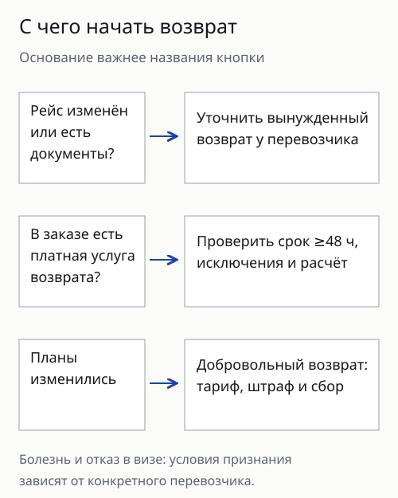
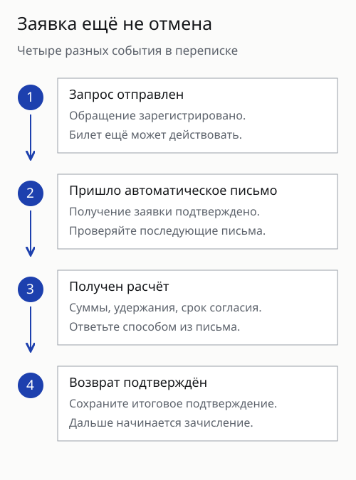
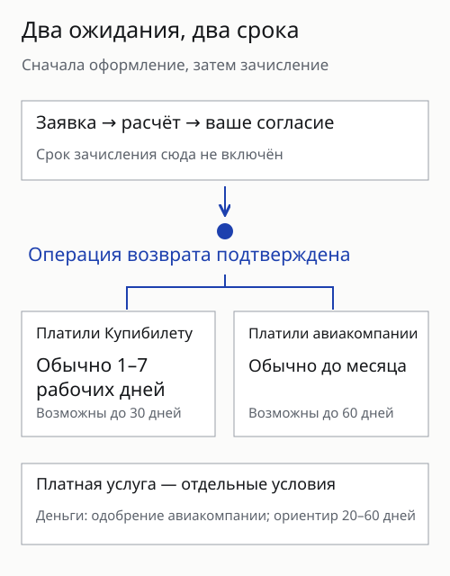
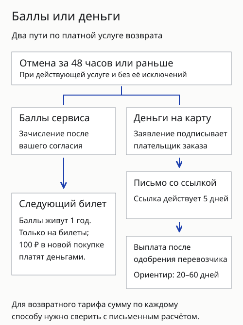

**Возврат билета через Купибилет начинается в заказе, а заканчивается подтверждением отмены и выплатой.** Автоматическое письмо о получении заявки ещё не означает, что билет отменили. До согласия с расчётом проверьте основание возврата, удержания и способ, которым деньги должны вернуться.

Ниже разобраны публичные правила сервиса. Личный возврат автора через Купибилет не подтверждён. Здесь нет обещания, что поддержка ответит или банк зачислит деньги в определённый день: для конкретного заказа важны его тариф, получатель оплаты и письма по заявке.

## Какой возврат подходит вашему случаю?

**Передумали лететь — начните с добровольного возврата; рейс отменён — уточняйте вынужденный.** Это разные основания, и сумма удержаний может различаться. Не выбирайте привычную кнопку раньше, чем прочитаете описание случая в заказе.

| Что произошло | Что выяснить до подтверждения | Чего не обещает само название |
|---|---|---|
| Планы изменились | Возвратность тарифа, штраф перевозчика, сбор сервиса | «Возвратный» билет не обязательно означает выплату всей покупки |
| Изменился рейс или есть документальная причина отказа | Признал ли перевозчик основание вынужденным, какие подтверждения нужны | Болезнь или отказ в визе не дают одинакового результата для всех тарифов |
| В заказе куплена услуга «Возврат от Купибилет» | Крайний срок отмены, исключения, деньги или баллы | Дополнительная услуга не покрывает любые расходы поездки |

Если обстоятельства относятся к вынужденному отказу, опишите их в обращении через заказ и приложите документы, которые запросит поддержка. Не заменяйте причину на «передумал», чтобы быстрее отправить форму. Для спорной ситуации попросите письменный ответ с указанием правил конкретного перевозчика.

Пропущенный рейс, добровольная отмена и отмена авиакомпанией тоже требуют разных действий. Тариф и состояние билета имеют значение даже тогда, когда в разговоре всё называют одним словом «возврат». Общие различия между билетами и продавцами разобраны в [материале об Авиасейлсе](/blog/aviasales-2026/).

## Как подать заявку и понять, что билет отменили?

**Откройте нужный заказ в личном кабинете и нажмите «Запросить возврат».** Проверьте пассажира и весь маршрут, затем выберите основание. Ответ приходит на почту, указанную при покупке, поэтому доступ к ней понадобится на следующих шагах.

Путь по заявке состоит из нескольких состояний:

1. **Заявка получена.** Приходит автоматическое уведомление. Сохраните его, но не считайте документом об отмене.
2. **Расчёт подготовлен.** В письме указаны условия и, если требуется, срок вашего согласия. Проверьте сумму к выплате и каждое удержание.
3. **Согласие отправлено.** Если платили картой через Купибилет, отвечайте в той же переписке, сохраняя тему письма. При оплате непосредственно через авиакомпанию порядок подтверждения может включать оплату сервисного сбора.
4. **Возврат оформлен.** Должно прийти отдельное подтверждение специалиста либо результат автоматической операции в заказе.

Есть оговорка: если при подаче заявки вы сразу согласились отказаться от билетов, операция может пройти без предварительного расчёта. Поэтому читайте текст формы до подтверждения. Не нажимайте согласие ради того, чтобы только узнать возможную сумму.

Повторная заявка не ускоряет очередь. Полезнее сохранить номер обращения и отвечать в той же переписке. Если письмо не пришло, проверьте адрес заказа и папку спама, затем уточните в чате, зарегистрировано ли обращение. Не отправляйте полные реквизиты карты или документы в посторонние сообщения от людей, представившихся поддержкой.

## Какие сборы удерживает Купибилет?

**У сервиса есть отдельный сбор за добровольный возврат: в справке указаны 10% или 16,9%.** Условие зависит от того, как покупатель попал на сайт при оформлении билета. Это сбор Купибилета, а штраф авиакомпании может идти отдельной строкой.

| Источник покупки по справке сервиса | Добровольный возврат | Вынужденный возврат |
|---|---:|---:|
| Покупка напрямую на сайте, без перехода со стороннего ресурса | 10% | 0% |
| Переход со стороннего сервиса, в том числе поисковика авиабилетов | 16,9% | 0% |

Для купленного билета нельзя определить применимый процент по тому, как вы открыли личный кабинет сейчас. Попросите расчёт именно вашего заказа. В публичной справке нет достаточных деталей, чтобы без его данных назвать точную рублёвую сумму и состав базы удержания.

Ещё один платёж — сбор при покупке. Купибилет отдельно пишет, что он не возвращается. Не смешивайте его со сбором за оформление возврата: нулевая комиссия за операцию сама по себе не обещает вернуть все ранее оплаченные услуги.

В исключениях указаны услуга приоритетной поддержки «Максимум», «Купибилет.Возврат» и признанные перевозчиком основания вынужденного отказа. Наличие пакета в заказе нужно проверить по его названию и условиям. Не считайте любое слово «поддержка» подтверждением подходящего пакета.

Перед согласием с расчётом попросите разбить удержания на штраф перевозчика, сбор операции, покупательский сбор и дополнительные услуги. Такая разбивка полезнее сравнения итогов двух чужих отзывов: у них могут отличаться тариф, продавец и причина отмены.

## Когда ждать деньги после оформления возврата?

**Срок зависит от получателя оплаты, а отсчёт зачисления начинается после проведения возврата.** Между отправкой заявки и оформлением операции может пройти отдельное время. Дату первого автоматического письма не стоит использовать как начало банковского срока.

В справке о платежах картой Купибилет разделяет два случая. Если оплату принимал сервис, после проведения возврата указан срок до 30 дней; обычный ориентир — 1–7 рабочих дней. Если картой платили через авиакомпанию, деньги возвращает перевозчик: справка приводит ориентир до 60 дней и отмечает, что поступление часто происходит быстрее. Это опубликованные ориентиры, а не проверенный автором срок исполнения конкретного заказа.

Чтобы разобраться с ожиданием, задайте поддержке три разных вопроса: отменён ли билет, оформлен ли возврат и отправлены ли деньги. Ответ «обращение в работе» не отвечает на последний. Если деньги отправлены, уточните дату и доступное подтверждение операции, затем обращайтесь в свой банк с этими данными.

Отдельный срок предусмотрен для платной услуги «Возврат от Купибилет». Его нельзя переносить на обычный возврат по тарифу. Для другого сервиса также нужны его собственные условия: [возврат на Trip.com](/blog/trip-com-2026/) устроен через отдельные правила заказа.

## Что означает платная услуга возврата 90%?

**В описании услуги обещаны 90% стоимости билета; дополнительные услуги в компенсацию не входят.** Услугу нужно заранее добавить в заказ при покупке. Предусмотрены варианты выплаты баллами сервиса и деньгами. До согласия уточните выбранный способ и перечень оплаченных позиций, на которые распространяется компенсация.

Для услуги назван крайний срок отмены: **не позднее чем за 48 часов до вылета**. Она не распространяется на частично использованный билет, обмен и дополнительные услуги. Отдельное исключение — серьёзное нарушение работы перевозчика или аэропортов, например закрытие границ. Цена самой услуги обычно не возвращается; исключение в справке — её отмена в день покупки.

Денежный вариант в описании связан с одобрением авиакомпании и обычным ориентиром 20–60 дней. Баллы можно использовать на билеты, срок их использования указан как один год. Они не равны деньгам на банковском счёте: выбирать их стоит после проверки, подойдёт ли вам следующий заказ и его правила списания.

Если выбрали деньги, заявление заполняет и подписывает плательщик заказа от своего имени. Бланк приходит от поддержки; заполненный документ отправляют ответом в той же переписке. После его получения сервис обещает письмо со ссылкой на выплату в течение двух рабочих дней. Это письмо тоже нужно открыть: ссылка действует пять дней. Если нет доступа к указанной в заказе почте или номеру телефона, справка просит сообщить об этом в течение 24 часов — выплату будут оформлять вручную.

Для возвратного тарифа публичная страница содержит разные описания того, как сочетаются выплата перевозчика и компенсация остатка. Поэтому без письменного расчёта не обещаем, что любой такой заказ даст ровно 90% всей покупки деньгами. Попросите указать сумму по каждому способу и сохранить выбранное условие в переписке.

Если рейс отменён авиакомпанией, сначала выясняйте положенный возврат по этому основанию. Не заменяйте его добровольным применением дополнительной услуги лишь потому, что её название есть в заказе.

## Можно ли отменить билет в день покупки?

**Такой порядок есть, но доступен не для любого билета и не в любой момент.** В справке сервиса указан запрос до 22:00 по московскому времени в день оформления билета. Некоторые перевозчики ограничивают окно сильнее или не разрешают такую операцию по техническим причинам.

Дата оформления находится в маршрутной квитанции. Сверяйте её с московской датой, особенно если покупали в другом часовом поясе. Присланный расчёт и срок подтверждения тоже нужно проверить: отправка запроса в нужный день ещё не завершает отмену.

Ошибка в данных не обязательно требует покупки второго билета. Сначала опишите её через заказ и выясните варианты исправления или отмены. Внимательно проверьте, что будет с прежним билетом: новый платёж сам по себе его не отменяет. Если до вылета осталось менее 48 часов, вы зарегистрированы или регистрация закрыта, описанный порядок отмены в день покупки может быть недоступен. Условия тарифа и ответ поддержки определяют дальнейшие действия.

## Частые вопросы о возврате Купибилета

### Вернут ли деньги за невозвратный билет?

Добровольный возврат зависит от тарифа. Вынужденное основание и заранее купленная дополнительная услуга требуют отдельной проверки; слово «невозвратный» не описывает их результат целиком.

### Можно ли вернуть только перелёт туда?

У единого билета на весь маршрут такое частичное действие может быть недоступно. В справке Купибилета указана полная отмена; раздельные билеты рассматриваются независимо.

### Что будет с обратным рейсом?

Не отменяйте первый участок, не выяснив судьбу остальных. Если использовали перелёт туда, возможность возврата обратного участка зависит от тарифа и состояния билета.

### Нужно ли подтверждать расчёт?

Это определяется письмом и выбранным способом операции. Если согласие требуется, соблюдайте срок и способ ответа; автоматическое уведомление согласия не заменяет.

### Можно ли узнать сумму без отмены?

Читайте форму запроса: согласие сразу отказаться от мест может привести к операции без предварительного расчёта. Для ознакомления с суммой сначала уточните порядок в чате заказа.

### Почему сбор отличается от указанного в чужом отзыве?

Проверьте источник покупки, основание, тариф и пакеты услуг. У другого человека эти условия могли отличаться; его удержание не является расчётом вашего заказа.

### Бесплатен ли вынужденный возврат?

В справке указан нулевой сервисный сбор за такую операцию. Это не подтверждает возврат стоимости всех дополнительных услуг или сборов покупки.

### Можно ли вернуть услугу возврата 90% отдельно?

В её описании предусмотрен отказ в день оформления заказа. За пределами этого срока не считайте её отмену доступной без отдельного подтверждения.

### Куда обращаться, если деньги не пришли?

Сначала выясните, завершена ли операция и кто принимает оплату. После подтверждения отправки денег уточняйте зачисление в банке; храните переписку и сведения о платеже.

### Стоит ли создавать ещё одну заявку?

Сервис предупреждает, что повторы не ускоряют обработку. Сохраните номер первого обращения и добавляйте сведения к нему, если поддержка не предложила другой порядок.

## Что почитать дальше

Для следующей покупки разберитесь, [кто продаёт билет, найденный на Авиасейлсе](/blog/aviasales-2026/). Если поездка включала другие бронирования, отдельно проверьте [отмену отеля и билета на Trip.com](/blog/trip-com-2026/). Полис на случай отмены поездки имеет собственные условия — они разобраны в [статье о страховке от невыезда](/blog/strahovka-ot-nevyezda/).
