import AffiliateNote from '../../components/post/AffiliateNote.astro';
import { aviasalesRoute, cherehapaCountry } from '../../data/affiliate.js';

Рейтинги «лучших городов» обычно составляют редакции — этот собрали иначе: опросили 4 000 человек 18–29 лет в 150 городах и оставили по одному городу от страны. Получилось честнее обычного, и сюрпризов там больше, чем побед: у города-победителя доступной ночную жизнь считает всего треть опрошенных, а в самом уютном городе списка безопасным его не назвал вообще никто.

> **Если коротко:** первая тройка — **Токио, Порту и Мельбурн**. Дальше Эдинбург и Шанхай, а привычные Париж и Вена оказались в конце двадцатки, потому что мерили не инфраструктуру, а цену вечера и лёгкость знакомств. Ниже — все двадцать городов с фотографиями и деталями: какие районы сейчас живые, где какие скидки для молодых, во что обходится день. И то, чего нет в оригинале: **шесть городов из двадцати открыты по загранпаспорту или почти без формальностей** — Бангкок, Шанхай, Кейптаун, Мехико, Рио, а Сеул с электронным разрешением за пару дней.

<AffiliateNote />

---

## Как считали этот рейтинг

Основа — ежегодный опрос горожан по всему миру, из которого отобрали ответы людей моложе тридцати. Из каждой страны в список попал только один город с лучшим результатом, поэтому рядом не стоят Париж с Лионом или Токио с Осакой. Партнёр рейтинга — туроператор Intrepid Travel, который возит малые группы для тех, кому 18–35.

Спрашивали не про достопримечательности, а про быт: удобно ли ходить пешком, есть ли рядом зелень, сколько стоит выйти в бар, легко ли знакомиться, чувствуется ли соседское сообщество, стало ли за последний год счастливее. Отсюда и неожиданные результаты — города, которые обычно возглавляют туристические подборки, здесь просели, а те, что редко попадают в списки, поднялись.

К каждому городу я добавил то, чего в оригинале нет и быть не могло: что там с визой для российского паспорта и во сколько обходится день. Визовые сроки и сборы — из нашей [таблицы виз](/visa/), она сверена с консульствами в мае 2026 года. Стоимость дня — медиана по нескольким источникам, тоже на май 2026, на человека, без перелёта: «бюджетно» — это хостел, транспорт, еда в недорогих местах.

---

## Топ-20 одной таблицей

| Место | Город | Виза россиянам | День бюджетно |
|---|---|---|---|
| 1 | Токио, Япония | нужна, сбор 970 ₽, от 4 дней | 3 500 ₽ |
| 2 | Порту, Португалия | шенген | — |
| 3 | Мельбурн, Австралия | нужна, AUD 250, до 3 месяцев | 6 300 ₽ |
| 4 | Эдинбург, Шотландия | британская, долго | — |
| 5 | Шанхай, Китай | **не нужна**, 30 дней | 1 449 ₽ |
| 6 | Нью-Йорк, США | нужна, $185 + $250 при выдаче, запись за границей | 4 786 ₽ |
| 7 | Копенгаген, Дания | шенген | — |
| 8 | Берлин, Германия | шенген | — |
| 9 | Валенсия, Испания | шенген, €90 + €35, 10–15 дней | 4 572 ₽ |
| 10 | Бангкок, Таиланд | **не нужна**, с 15 сентября — 30 дней | 2 250 ₽ |
| 11 | Неаполь, Италия | шенген, €90 + €30, 30–60 дней | 7 200 ₽ |
| 12 | Кейптаун, ЮАР | **не нужна**, 90 дней | 4 500 ₽ |
| 13 | Краков, Польша | шенген | — |
| 14 | Сеул, Корея | разрешение за 72 часа до вылета, 60 дней | 2 135 ₽ |
| 15 | Париж, Франция | шенген | — |
| 16 | Афины, Греция | шенген, €90 + €30, 5–15 дней | 5 400 ₽ |
| 17 | Мехико, Мексика | **не нужна**, 180 дней | 1 234 ₽ |
| 18 | Рио-де-Жанейро, Бразилия | **не нужна**, 90 дней | 4 500 ₽ |
| 19 | Ванкувер, Канада | нужна, 4–8 недель | 7 200 ₽ |
| 20 | Вена, Австрия | шенген | — |

Прочерк — там, где у нас нет собственного расчёта по стране: выдумывать цифру ради заполненной клетки я не буду.

---

## 1. Токио, Япония

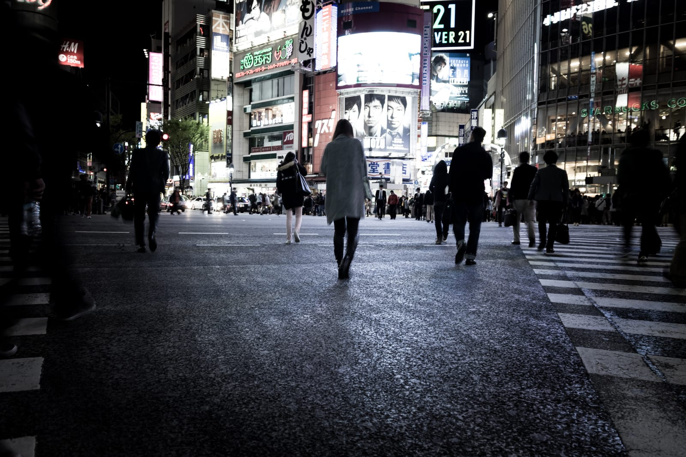

Победитель взял своё не клубами, а устройством повседневности. Пешком удобно почти везде, транспорт работает как часы, культура дешёвая, а главное — здесь нет жилищного кризиса, который выдавливает двадцатилетних из Лондона и Нью-Йорка. Для мировой столицы это редкость и, судя по ответам, именно она держит ощущение «здесь можно жить, а не выживать».

Ночь в Токио устроена не только вокруг баров, и это ответ на дороговизну. Поют в караоке до утра, отдыхают в круглосуточных банях, идут в спортивно-развлекательные центры, где под одной крышей боулинг, настольный теннис и дартс. Вечер получается насыщенным и без счёта из бара — а бары как раз дорогие, и молодые токийцы это признают открыто.

Город каждую весну пускает бесплатно на выставки тех, кому нет восемнадцати, — небольшая городская программа, но она задаёт тон: культура здесь не привилегия. Отсюда и максимум по «радости в повседневных мелочах»: сто процентов опрошенных, лучший результат всей двадцатки.

**Цифры опроса:** 100% находят радость в обычных днях, 89% высоко оценили ночную жизнь — но доступной по деньгам её назвали лишь 33%.

**Из России.** Виза нужна, сама она бесплатная, платите сервисный сбор визового центра 970 ₽; сроки от четырёх дней, дают от 15 дней до многократной на три года. День бюджетно — около 3 500 ₽. Подробный разбор — на странице [Японии](/japan/).

---

## 2. Порту, Португалия

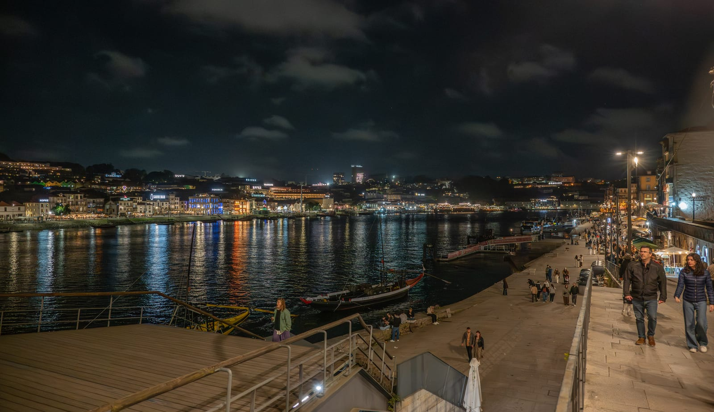

Второе место Порту взял тем, что в опросах почти никогда не выигрывает, — ощущением общности. Сто процентов опрошенных отозвались о местном сообществе хорошо: это лучший результат в списке, и он важнее, чем кажется. Молодые уезжают не туда, где красиво, а туда, где через месяц у тебя есть с кем пить кофе.

Сам город даёт редкое сочетание: река, океан в получасе, зелёные сады и исторический центр под охраной ЮНЕСКО, по которому ходят пешком, а не ездят. Красивым Порту назвали все опрошенные без исключения — тоже стопроцентный результат.

Культура тут дешёвая или бесплатная. Национальный музей Соареша душ Рейша не берёт денег по воскресеньям с местных, центр фотографии бесплатен всегда. Для двадцатилетних это решает больше, чем список ресторанов: сходить посмотреть искусство можно, не сверяясь с балансом.

**Цифры опроса:** 100% за чувство сообщества, 100% за красоту города, 93% назвали его доступным по деньгам — особенно поесть, выпить и попасть на выставку.

**Из России.** Нужна шенгенская виза; Португалия принимает документы не так охотно, как Греция или Италия, поэтому проще заходить по шенгену другой страны, если поездка по нескольким. Собственного расчёта дня по Португалии у нас нет.

---

## 3. Мельбурн, Австралия

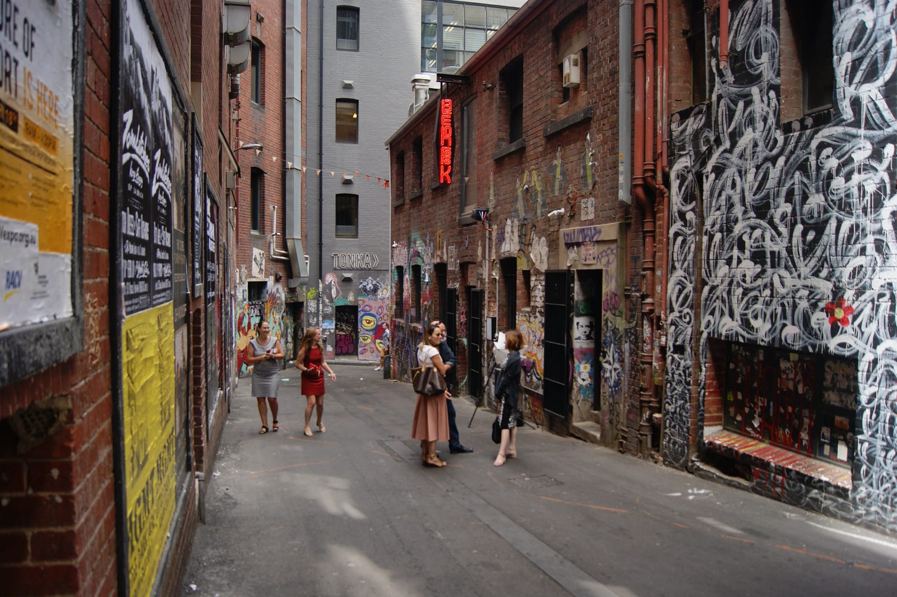

Мельбурн в этом году лучший город мира по общему рейтингу, а среди молодых он третий. Причина — сцена. Инди-театр, живая музыка, комедия, импровизация и подпольные рейвы идут почти каждый вечер недели, а город недавно выделил около миллиона на программу, которая помогает местным авторам доводить идеи до полноценных постановок. Это не абстрактная «поддержка культуры»: она видна в афише.

Дешёвым Мельбурн не назовёшь, но обходные пути знает каждый местный. Есть кафе, где всё меню стоит четыре доллара. Есть ресторан, где любое французское блюдо, включая стейк с картошкой, идёт по четырнадцать. Проезд до конца года — за полцены. Студенческое сообщество здесь одно из самых сильных на планете, и через него держится половина города.

Из двадцати городов Мельбурн взял максимум по ресторанам: сто процентов. Это к вопросу, зачем ехать на другой конец земли.

**Цифры опроса:** 100% за рестораны, 97% за культуру, 94% похвалили свой район.

**Из России.** Виза нужна, туристическая категории 600, сбор AUD 250 (с 1 июля 2026 подняли с 200), ждать от двух недель до трёх месяцев. День на восточном побережье бюджетно — около 6 300 ₽. Разбор страны — в [гайде по Австралии 2026](/blog/australia-guide-2026/).

---

## 4. Эдинбург, Шотландия

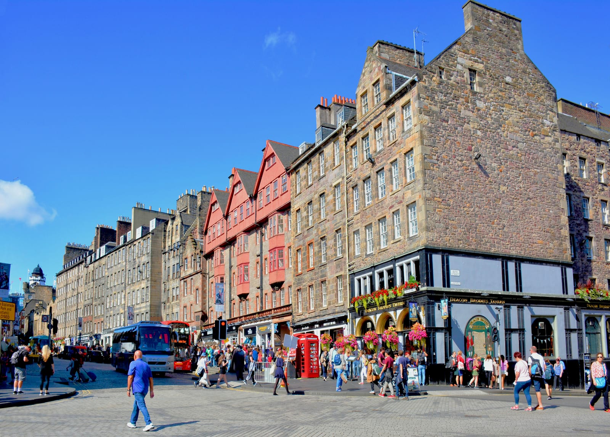

Зелень, пешеходность и мировая культурная афиша — это про Эдинбург известно всем. Для молодых решает другое: Каугейт, улица, под которой в средневековых сводчатых подвалах прячутся клубы и концертные залы. Дёшево и весело — в подвалах, поглянцевее и подороже — в Новом городе, и переход между этими мирами занимает десять минут пешком.

В августе город живёт фестивалем, и для молодых он ощутимо дешевле: до восемнадцати билеты вдвое дешевле, до тридцати — на треть. Месяц, когда население города удваивается, а найти жильё почти невозможно, зато можно посмотреть три спектакля за день.

Отдельная строка — безопасность. Эдинбург самый безопасный город двадцатки, и всё равно безопасным его назвали лишь 55% опрошенных. Это хорошо показывает, какой планкой мерили: у молодых горожан по всему миру ощущение защищённости низкое почти везде.

**Цифры опроса:** 90% сказали, что счастливее здесь, чем были где-либо ещё, 94% отметили позитивных людей вокруг, 84% довольны качеством жизни, 79% назвали город красивым.

**Из России.** Нужна британская виза: запись, биометрия, длинные сроки, часто через третью страну. Из всей двадцатки это один из самых тяжёлых вариантов по подготовке.

---

## 5. Шанхай, Китай

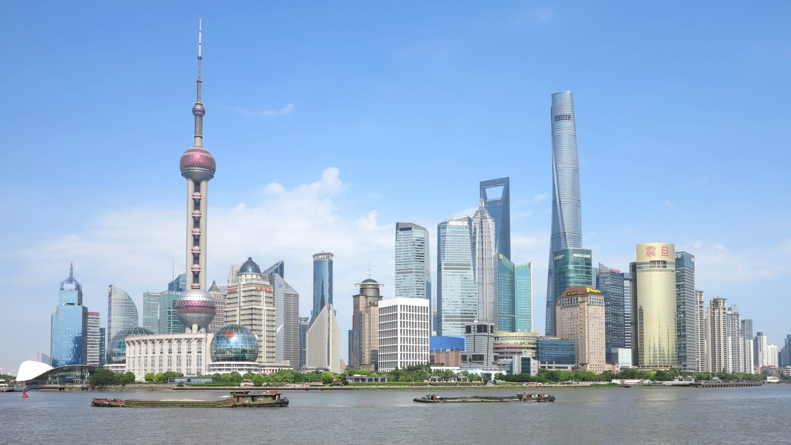

Первое, что называют местные, — безопасность. Возвращаться домой одной после клуба здесь нормально, и в опросе это отзывается высоким ощущением спокойствия. Второе — деньги: если вынести за скобки аренду, город недорогой, а кино и кофе доступными назвали вообще все опрошенные.

С июня в Шанхае действует программа «города, дружелюбного к молодым»: обещают больше 250 тысяч доступных съёмных квартир рядом со станциями метро и деловыми районами. Такие обещания стоит проверять временем, но сам факт, что город официально борется за молодых жителей, в рейтинге редкость.

Третье, чем берёт Шанхай, — места, куда приходят разговаривать. Крафтовый бар, где наливают и безалкогольное. Клуб, куда идут без телефонов, чтобы весь вечер смотреть друг на друга, а не в экран. На фоне всеобщей усталости от соцсетей это работает.

**Цифры опроса:** 83% отметили, что ощущение счастья в городе выросло за последнее время, 76% говорят, что легко знакомиться, 63% назвали город приветливым, 100% — доступными кино и кофе.

**Из России.** Виза не нужна вовсе: безвизовый въезд до 30 дней действует до 31 декабря 2027 года, число поездок не ограничено. День в Китае бюджетно — около 1 449 ₽, это самый дешёвый вариант из «больших» городов списка. Смотреть даты и цены: <a href={aviasalesRoute('MOW', 'PVG', 'goroda_gen_z_2026')} class="aff-cta" rel="sponsored">билеты Москва — Шанхай</a>. Разбор страны — на странице [Китая](/china/).

---

## 6. Нью-Йорк, США

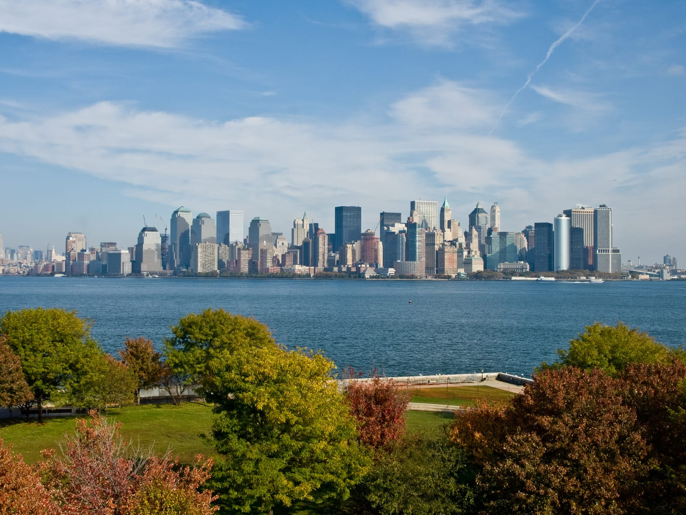

Нью-Йорк держится в верхней части списка на одном свойстве: здесь постоянно происходит что-то новое. Приток приезжих не иссякает, проекты запускаются и закрываются за сезон, и ощущение «может случиться что угодно» перевешивает и цены, и бытовые сложности. По культуре город третий в мире.

Городская летняя программа поддерживает небольшие организации, которые устраивают бесплатные события для молодых жителей, а расписание собрано на карте — удобно, когда бюджета на билеты нет. И это отражается в цифрах странным образом: общая доступность города низкая, а вот «сходить посмотреть искусство по карману» отметили 93%.

Отдельно стоит сказать про пешеходность: 98% — почти абсолют. Нью-Йорк из тех редких американских городов, где машина не нужна вообще.

**Цифры опроса:** 98% за пешеходность, 95% за культуру, 93% за доступность искусства, 88% назвали город оживлённым.

**Из России.** Виза нужна, и стоит она дороже, чем принято считать: к консульскому сбору $185 с 4 июля 2025 года добавлен отдельный платёж $250, который берут при выдаче визы. Итого около $435. Главная сложность при этом не в деньгах: собеседование проходят за границей, ближайшие живые окна — Варшава с ожиданием от двух недель до месяца, в Астане запись уходит на 2027–2028 годы. День в США бюджетно — около 4 786 ₽.

---

## 7. Копенгаген, Дания

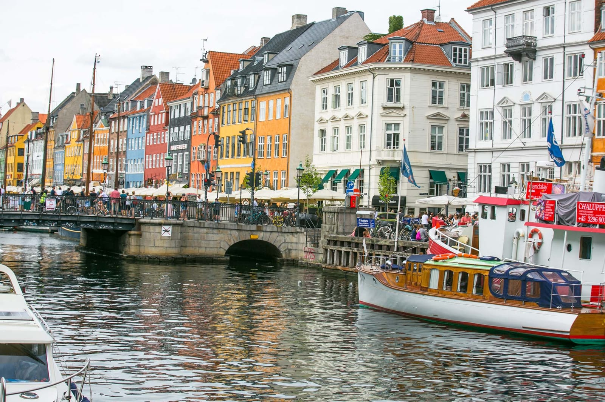

Копенгаген устроен вокруг велосипеда, и это не экологическая витрина, а способ экономить: 83% опрошенных высоко оценили, как здесь ходят пешком и ездят на двух колёсах. Летом купаются прямо в гавани, парки в выходные забиты целиком, а любимые места молодых — не новая скандинавская кухня, а старые «коричневые» бары, где пиво дешевле и разговор громче.

Выходить в свет тут недёшево, зато образование бесплатное и есть стипендии, а городская программа даёт свободный вход в культурные площадки тем, кому от 18 до 27. Летом кварталы Норребро и Вестербро занимает уличный фестиваль, где большая часть вечеринок бесплатна: три дня город танцует на улицах.

Результат — 78% сказали, что в Копенгагене им радостнее, чем в любом другом городе, где они жили. Для дорогой северной столицы это сильный ответ.

**Цифры опроса:** 83% за велосипед и пешие маршруты, 78% за общее ощущение радости, 65% за общественный транспорт.

**Из России.** Нужна шенгенская виза; Дания выдаёт неохотно, обычно заходят через шенген другой страны. Собственного расчёта дня по Дании у нас нет.

---

## 8. Берлин, Германия

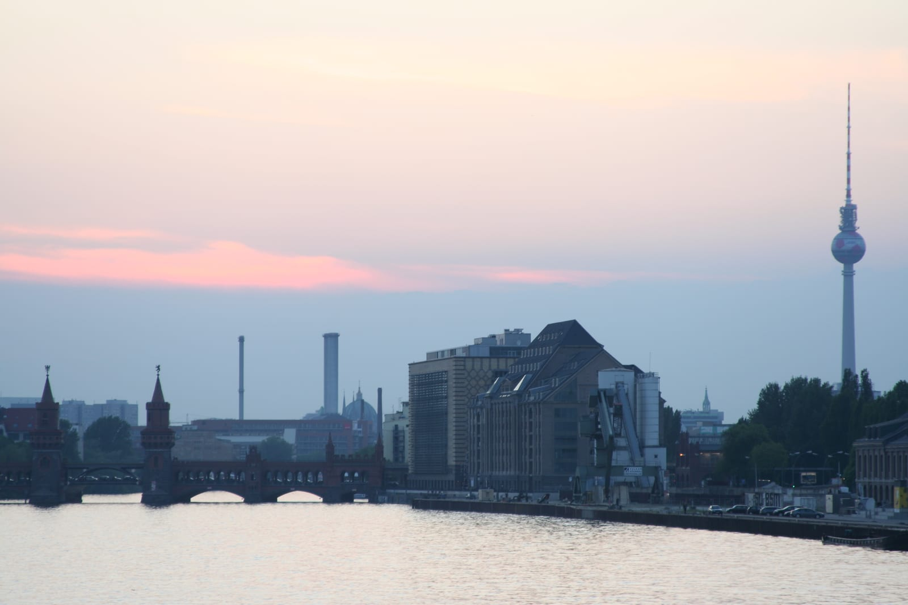

Берлин — город, в котором находят своих. Не «культурная столица» в путеводительном смысле, а место, где под любую странность есть сообщество, и оно соберётся в четверг вечером. Ровно поэтому у него в опросе почти всё держится около 65%: ресторанов, зелени, знакомств, благополучия — всего понемногу, но у каждого своё.

Город дорожает, и это заметно по тому, как изменились вечера: программы расходятся по сарафану, дешёвое пиво берут в ночных ларьках и пьют на лавке рядом, а клуб выбирают один на неделю. Ночную жизнь высоко оценили 65%, но доступной её считают только 57% — разрыв, которого десять лет назад не было.

Днём молодое сообщество никуда не девается: танцевальные классы африканской диаспоры, книжные вечера быстрых знакомств, барахолки для квир-сообщества. Искусство по деньгам подходит 72% — выше, чем ночная жизнь, и это про Берлин говорит многое.

**Цифры опроса:** по 65% за рестораны, зелень, лёгкость знакомств и благополучие; 72% за доступность искусства, 57% за доступность ночной жизни.

**Из России.** Нужна шенгенская виза; Германия — одно из самых загруженных направлений по записи. Собственного расчёта дня по Германии у нас нет.

---

## 9. Валенсия, Испания

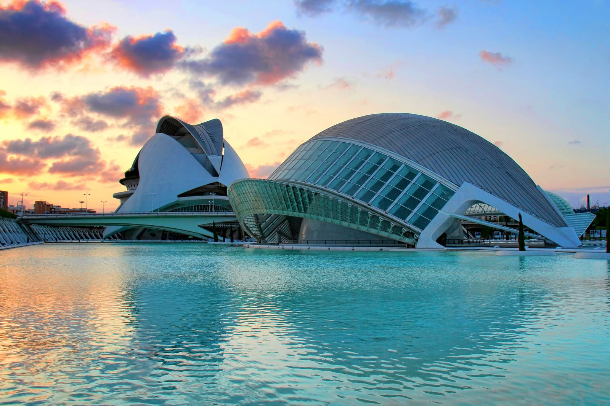

Валенсия выигрывает у Барселоны и Мадрида не морем и не архитектурой, а тем, как здесь знакомятся. Бесплатные встречи на воздухе — совместные походы в горы, пробежки по парку в русле старой реки, заплывы в море на рассвете. Люди приходят одни и уходят компанией, и это, судя по ответам, работает лучше любых приложений.

Деньги тоже на стороне города: проездной примерно за 15 евро даёт месяц метро, электричек и автобусов, музеи по воскресеньям бесплатны, ночная жизнь дешевле, чем в столицах. Триста солнечных дней в году добавляют к этому простую вещь: большую часть жизни можно проводить снаружи, а снаружи бесплатно.

Любопытная деталь: счастливыми здесь себя называют 93%, а вот лёгким знакомство с новыми людьми — только 64%. Валенсия щедра к тем, кто уже нашёл свой круг, и требует усилия от новичка.

**Цифры опроса:** 93% счастливы здесь жить, 86% за чувство сообщества, 86% отметили, что стали счастливее за последнее время, 64% — за лёгкость знакомств.

**Из России.** Нужна шенгенская виза: сбор €90 плюс €35 визовому центру, решение за 10–15 дней, обычно дают однократную. Испания сейчас одна из немногих стран, которая ещё принимает россиян более-менее ровно. День в Испании бюджетно — около 4 572 ₽.

---

## 10. Бангкок, Таиланд

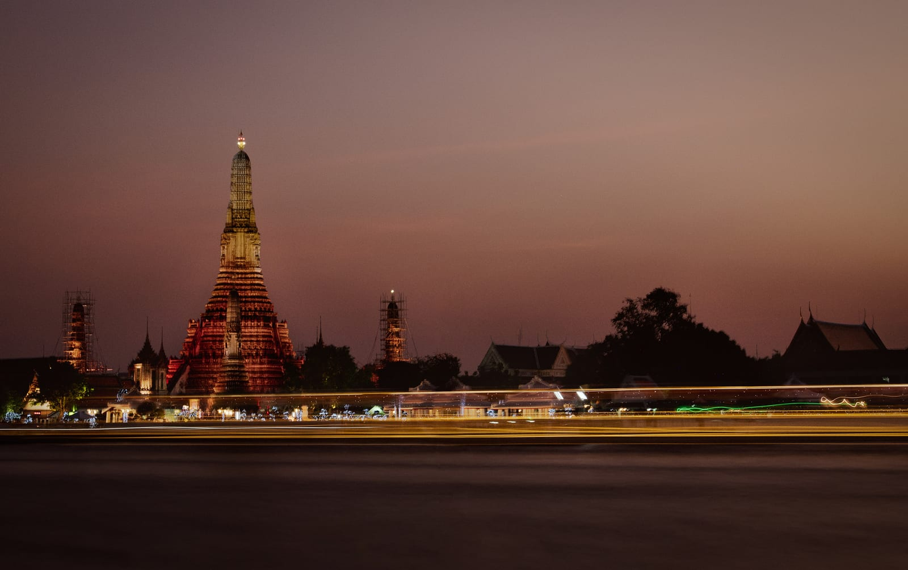

Бангкок — единственный город списка, который одновременно дешёвый и живой, и это редкое сочетание. Здесь варится креативная среда: дизайнеры, художники, повара и музыканты перекидываются идеями, и результат виден в меню, коллекциях и выставках через месяц, а не через год. Квартиры доступные, поэтому закрепиться можно без большого капитала — молодые едут сюда работать удалённо и остаются.

Вечеринки — визитная карточка, но нынешние двадцатилетние ходят сюда не только за ними: беговые клубы, йога, холодные ванны собирают людей не меньше баров. Главный район сейчас — Сонг-Ват: в старых лавочных домах у реки открылись мастерские и бары, стены расписаны, и всё это в двух шагах от китайского квартала.

Самая сильная цифра у Бангкока не про рестораны и не про ночь: 96% сказали, что город делает их счастливыми и что здесь им лучше, чем везде, где они жили раньше.

**Цифры опроса:** 96% за ощущение счастья, 87% за рестораны, 78% за ночную жизнь.

**Из России.** Виза не нужна: при въезде до 14 сентября 2026 года включительно дают до 60 дней, с 15 сентября — до 30 дней по двустороннему соглашению. Выданный до перехода срок сохраняется. Нужна электронная въездная карта. День в Таиланде бюджетно — около 2 250 ₽. По деньгам это лучший вход из всей двадцатки: <a href={aviasalesRoute('MOW', 'BKK', 'goroda_gen_z_2026')} class="aff-cta" rel="sponsored">посмотреть цены на билеты Москва — Бангкок</a>, а медицина для иностранцев там платная, поэтому <a href={cherehapaCountry('thailand', 'goroda_gen_z_2026')} class="aff-cta" rel="sponsored">полис в Таиланд оформляется за пару минут</a>, оплата картой РФ. Разбор страны — на странице [Таиланда](/thailand/).

---

## 11. Неаполь, Италия

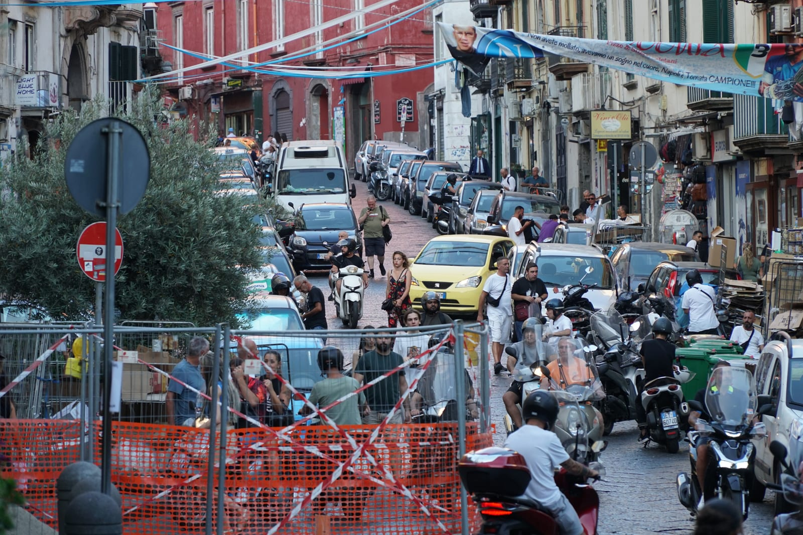

Городу две с половиной тысячи лет, а ощущение от него молодое. Неаполь берёт тем, чего нет у отполированных северных итальянцев: доступной культурой, расслабленными вечерами и самой низкой стоимостью жизни среди крупных городов страны. При высокой безработице он при этом второй в Италии по предпринимательству среди тех, кому нет тридцати пяти, — здесь открывают своё, потому что работать больше особо негде.

Еда — отдельный аргумент, и он измеряется в евро. Кофе всё ещё можно найти за один. Пицца в бумажном конверте с собой — меньше чем за три. Простая маринара за столом — до пяти. На главной улице старого центра это не туристическая приманка, а обычный уровень цен.

И тут же самая тревожная цифра всего рейтинга: безопасным Неаполь не назвал ни один опрошенный. Ноль процентов. При этом 91% счастливы здесь жить, а позитивными людей вокруг назвали все сто. Такой разрыв больше не встречается нигде в списке.

**Цифры опроса:** 100% за позитивных людей вокруг, 91% за ощущение счастья, 82% за доступность, 0% за безопасность.

**Из России.** Нужна шенгенская виза: сбор €90 плюс €30 визовому центру, решение занимает 30–60 дней, подача очная. День на юге Италии бюджетно — около 7 200 ₽, и это дороже, чем кажется по цене пиццы: платит не еда, а жильё.

---

## 12. Кейптаун, ЮАР

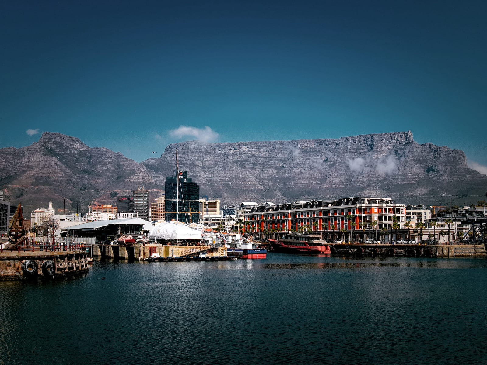

Кейптаун — про контраст громкого и тихого. Город не сбавляет темп, но между шумными кусками спрятаны места, где можно выдохнуть: набережная для спокойной прогулки, винные фермы в получасе езды, десятки однодневных походов, которые начинаются прямо от городских кварталов. Природа тут не выезд на выходные, а часть обычного дня — 93% опрошенных отметили именно доступ к ней.

Молодые здесь не столько потребляют готовое, сколько делают места под себя: бары, шоурумы, независимые проекты открывают те же люди, которые в них ходят. Отсюда и вторая сильная цифра — 93% находят радость в повседневности.

О безопасности рейтинг честно молчит, и это тот случай, когда молчание красноречиво: район и время суток в Кейптауне значат больше, чем в любом другом городе двадцатки.

**Цифры опроса:** 93% за зелень и доступ к природе, 93% за радость в обычных днях.

**Из России.** Виза не нужна: пускают на 90 дней, штамп ставят на границе. День в ЮАР бюджетно — около 4 500 ₽. Из безвизовых вариантов списка это самый «дальний» перелёт, зато никакой подготовки. Разбор страны — на странице [ЮАР](/south-africa/).

---

## 13. Краков, Польша

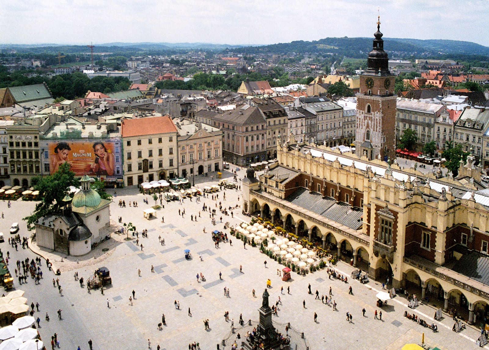

Краков — культурная столица Польши и один из крупнейших студенческих центров Евросоюза, и обе роли видны на улице. Старый город под охраной ЮНЕСКО гудит круглый год, а студенческий билет открывает скидки в музеи, кино, на главные достопримечательности и в рестораны. Пешеходность 90% — один из лучших результатов списка: центр обходится за час.

Ночь здесь дешёвая и бесконечная. Вокруг Рыночной площади — рюмочные, танцполы и старые студенческие пабы, куда ходят поколениями. В Казимеже, бывшем еврейском квартале, — винтажные бары с разномастной мебелью, где сидят до утра и никто не торопит.

Знакомиться легко: 77%. Для города, куда каждый сентябрь приезжают десятки тысяч студентов, логично — половина города тоже новенькие.

**Цифры опроса:** 95% за ночную жизнь, 90% за пешеходность, 77% за лёгкость знакомств.

**Из России.** Нужна шенгенская виза; польские визы россиянам сейчас практически не выдают, поэтому реалистичный путь — шенген другой страны. Собственного расчёта дня по Польше у нас нет.

---

## 14. Сеул, Корея

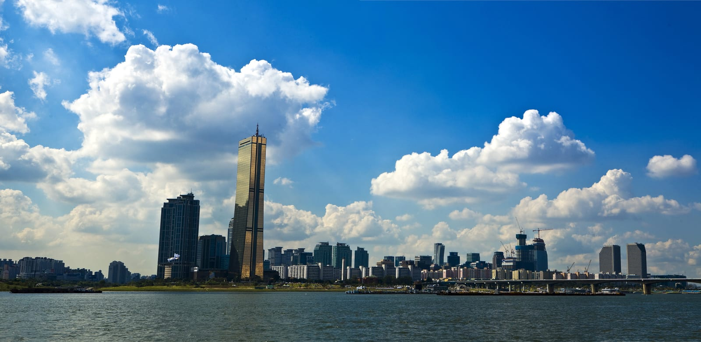

Сеул — город, который переключается между эпохами на одной улице. Яркие поп-апы в Сонсу, королевские дворцы через квартал от галерей современного искусства, кофейни в традиционных домах-ханоках, а вечером те же улицы застилают тенты недорогих уличных едален. Ничего из этого не выглядит музейным: старым здесь пользуются, а не любуются.

Лучшее в Сеуле — места, где он перестаёт быть городом, и все они бесплатны: ручей в бетонных берегах прямо в центре, гора посреди делового района, целый национальный парк на окраине, куда доезжает метро. Доступ к зелени отметили 75%.

И главная цифра: 100% сказали, что по Сеулу удобно ходить пешком. Единственный такой результат в мире — Сеул формально самый пешеходный город рейтинга.

**Цифры опроса:** 100% за пешеходность, 75% за зелень, 75% за лёгкость знакомств.

**Из России.** Виза не нужна, но нужно электронное разрешение: около $8, действует три года, подавать его нужно не позже чем за 72 часа до посадки. Пускают на 60 дней за одну поездку, а суммарно — не больше 90 дней в каждые 180. Это самый простой «почти безвиз» в списке. День в Корее бюджетно — около 2 135 ₽. Как считается срок, кому разрешение не нужно и чем за него платить — в разборе [визы и K-ETA в Южную Корею](/blog/south-korea-visa-2026/). Разбор страны — на странице [Кореи](/south-korea/).

---

## 15. Париж, Франция

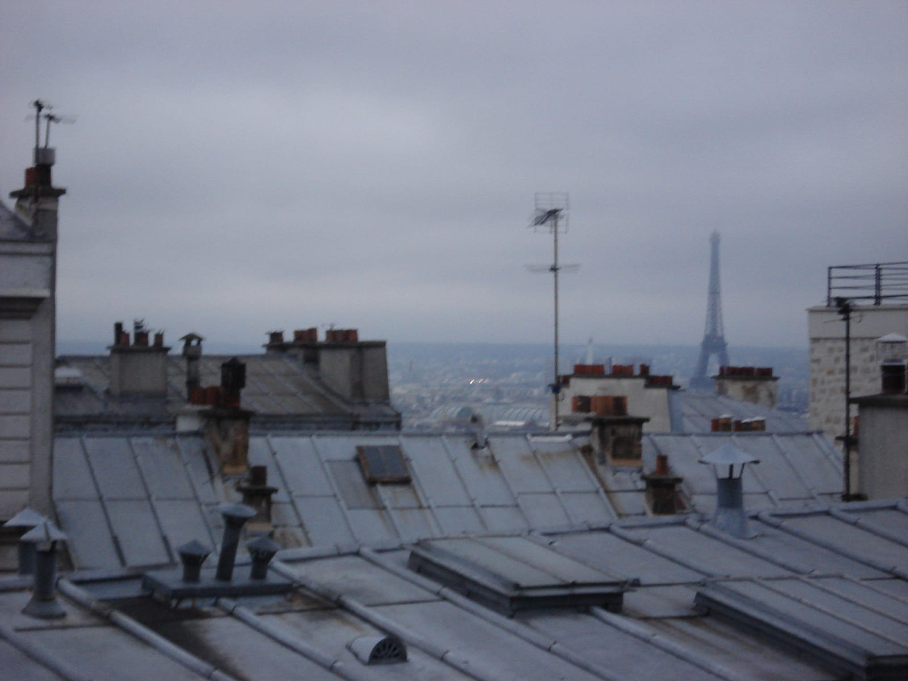

Париж на пятнадцатом месте — и это не ошибка опроса, а его суть. По качеству жизни и инфраструктуре город десятилетиями в верхних строчках любых рейтингов, но здесь спрашивали не об этом, а о том, во что обходится вечер и легко ли в двадцать пять найти друзей.

Обходные пути знает каждый местный. Музеи бесплатны для граждан Франции и стран ЕС младше двадцати шести, а в первое воскресенье месяца — для всех, только билет нужно брать заранее. Вечер дешевле проводить не в клубе, а в джаз-баре: вход недорогой, а в подвальных залах Латинского квартала играют вживую и танцуют до утра. Кафе и бистро работают допоздна, так что засидеться можно почти в любом квартале.

Ресторанами Париж набрал сто процентов — единственная категория, где он безоговорочный лидер. А вот доступными напитки назвали 80%, и это про то, как молодые считают деньги.

**Цифры опроса:** 100% за рестораны, 87% за оживлённость, 83% за ночную жизнь, 80% за доступные напитки.

**Из России.** Нужна шенгенская виза; Франция принимает документы, но запись разбирают быстро, а сроки плавают. Собственного расчёта дня по Франции у нас нет.

---

## 16. Афины, Греция

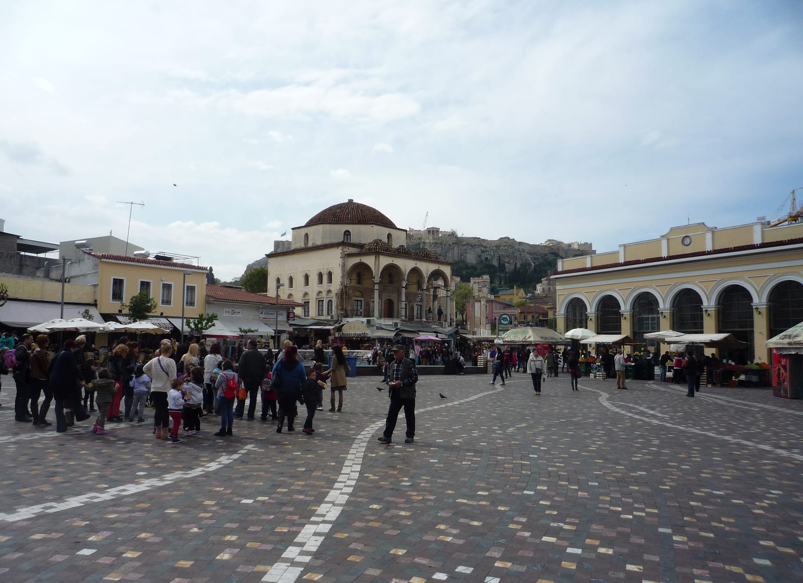

Афины дают ответ на вопрос про деньги самим устройством жизни: здесь почти круглый год общаются на улице, а улица бесплатна. Встречаются на площадях Экзархии, растекаются по узким улицам Псири, идут в недорогие бары и подвальные клубы, где вход стоит меньше, чем коктейль в Париже.

Молодые двигают местную творческую сцену: независимые галереи, винтажные магазины, соседские события, которые не найти в путеводителях. А закончить день можно купанием на побережье в двадцати минутах от центра или подъёмом на гору, откуда весь город виден сразу.

При этом расслабленным Афины считают только 64% — город шумный, плотный и не всегда удобный. Зато своим районом довольны 91%, и это второй результат в двадцатке.

**Цифры опроса:** 91% за свой район, 82% за ощущение счастья, 82% за радость в обычных днях, 64% за расслабленность.

**Из России.** Нужна шенгенская виза, и Греция сейчас самая лояльная к россиянам: сбор €90 плюс €30, решение за 5–15 дней. Если из этой двадцатки хочется в Европу, начинать проще всего отсюда. День в Греции бюджетно — около 5 400 ₽.

---

## 17. Мехико, Мексика

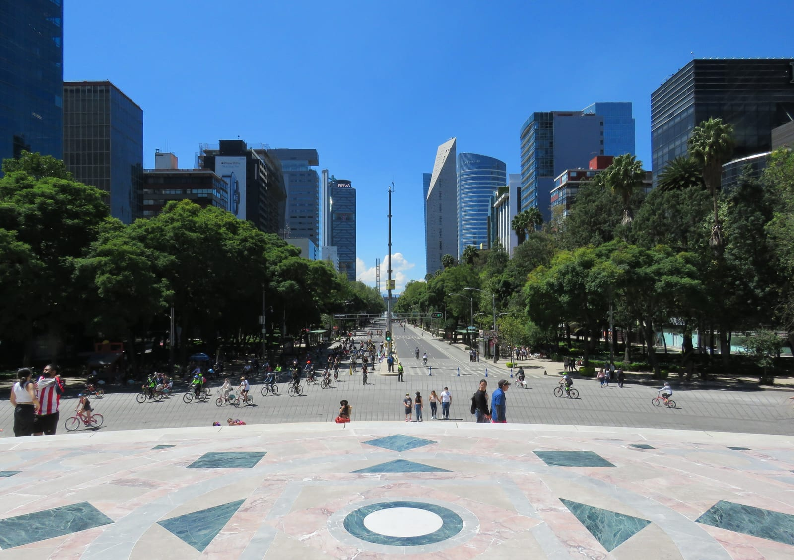

Мехико попал в тройное совпадение: ночная жизнь, доступная культура и аренда, которая приезжим кажется подъёмной. Город звучит реггетоном и корридос, террасы работают до утра, а часть вечеринок проходит по спискам в обычных жилых домах — попасть можно, если знаешь кого-то, кто знает.

Культура тут дешёвая по расписанию: в последнюю среду месяца главные музеи пускают бесплатно на вечерний обход, в феврале город накрывает неделя искусства, а канатная дорога над кварталами стоит около тридцати рублей за поездку и заменяет обзорную экскурсию.

Одну вещь местные говорят прямо, и её стоит повторить: для приезжих цены нормальные, а для самих жителей аренда растёт как раз из-за приезжих. Приезжать сюда «пожить полгода недорого» — участвовать в этом процессе, а не наблюдать со стороны.

**Цифры опроса:** 92% сказали, что жизнь здесь делает их счастливыми, 84% находят радость в повседневности, 80% похвалили доступ к зелени.

**Из России.** Виза не нужна, но нужно бесплатное электронное разрешение, которое оформляют онлайн заранее; пускают на срок до 180 дней. День в Мексике бюджетно — около 1 234 ₽, это самая дешёвая страна всей двадцатки. Смотреть варианты перелёта: <a href={aviasalesRoute('MOW', 'MEX', 'goroda_gen_z_2026')} class="aff-cta" rel="sponsored">билеты Москва — Мехико</a>. Разбор страны — на странице [Мексики](/mexico/).

---

## 18. Рио-де-Жанейро, Бразилия

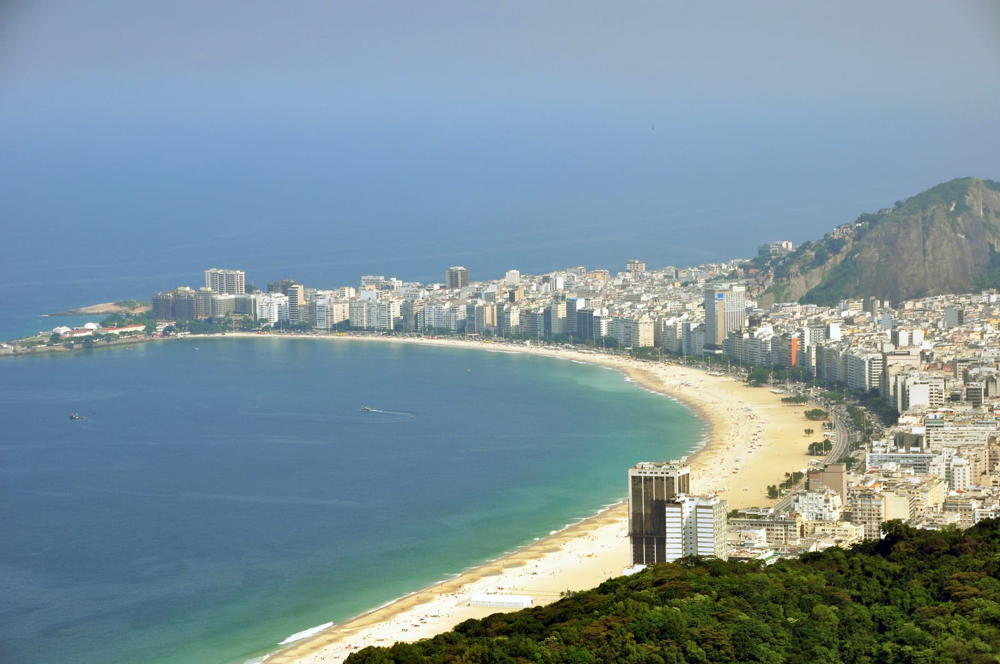

Тот самый бразильский образ жизни, который расходится по соцсетям, в Рио выглядит буднично: солнце, пляж, самба и спорт. Это город для тех, кто не любит планировать. День на пляже, прогулка вдоль воды и групповая тренировка под открытым небом складываются в полноценную программу, и всё это почти ничего не стоит.

Вечером главные места — не клубы, а listening bars: полумрак, диджей, хаус, рэп, фанк и ритм-энд-блюз, разговоры вполголоса. Вокруг них выросли собственные вечериночные коллективы, которые сейчас и делают ночную сцену города, — афиша живёт в соцсетях и меняется каждую неделю.

Дешёвыми напитки назвали 89% — один из лучших показателей списка. А вот оживлённым свой город считают только 50%, и для места с такой репутацией это самый неожиданный результат опроса.

**Цифры опроса:** 89% за дешёвые напитки, 72% за лёгкость знакомств, 67% за ночную жизнь, 50% за оживлённость.

**Из России.** Виза не нужна: пускают на 90 дней, при необходимости продлевают до 180, штамп на границе. День в Бразилии бюджетно — около 4 500 ₽. Разбор страны — на странице [Бразилии](/brazil/).

---

## 19. Ванкувер, Канада

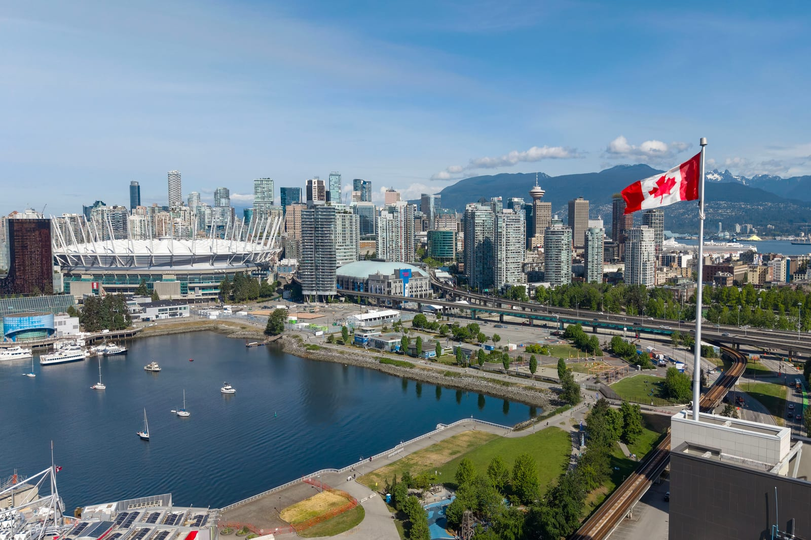

Репутация Ванкувера не врёт: люди дружелюбные, природа начинается там, где кончается улица, жизнь дорогая. Но аренда впервые за долгое время снижается, а лучшие развлечения здесь бесплатны, потому что это горы, пляжи и парки — доступ к зелени отметил 81% опрошенных.

Вечерами идут на две главные улицы: пивоварни, музыкальные бары, залы, где играют местные, — атмосфера скорее районная, чем столичная. Студенческий билет открывает скидки почти во все городские музеи, и это заметно снижает стоимость культурной программы.

Общественный транспорт молодые ванкуверцы оценили в 88% — лучший результат в этой категории по всему списку. Для города, зажатого между океаном и горами, это достижение.

**Цифры опроса:** 88% за транспорт, 81% за зелень, 81% за радость в обычных днях.

**Из России.** Виза нужна, сбор около CA$100 плюс биометрия, срок оформления 4–8 недель, зато дают на десять лет. День на востоке Канады бюджетно — около 7 200 ₽; Ванкувер западнее и не дешевле.

---

## 20. Вена, Австрия

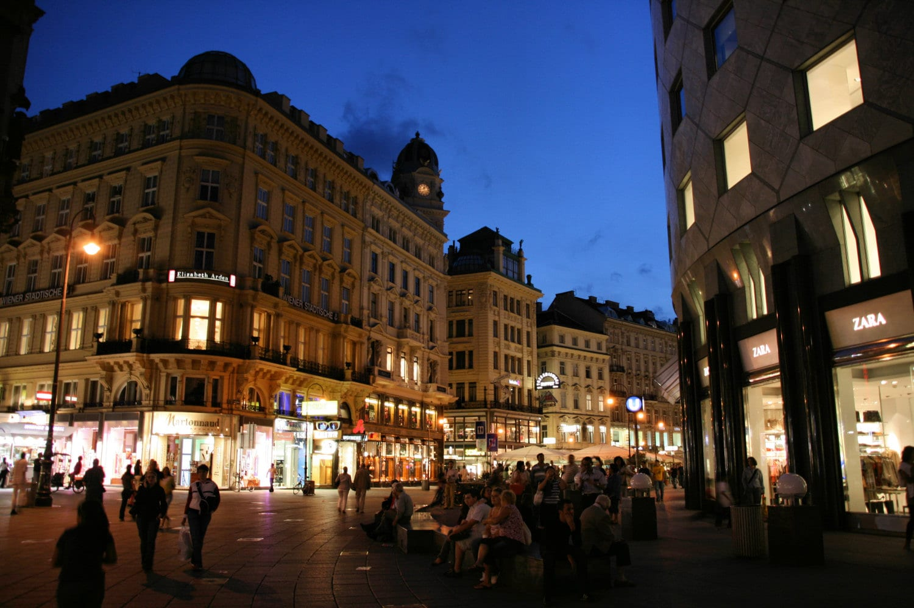

Вена замыкает двадцатку, и объяснение у этого простое. По качеству жизни город набрал 89% — почти лучший результат списка. По ощущению сообщества 82%. А вот легко ли здесь заводить друзей, подтвердили лишь 30%: худшая цифра всей двадцатки. Именно это и утянуло город вниз, и в этом вся логика рейтинга.

При этом жить в Вене молодым по карману, и город об этом заботится: скидки на транспорт, ограниченная законом аренда, билеты в оперу и театры за 15–20 евро. Отдельная история — кафе, которые днём работают как читальни, а к вечеру превращаются в бары, и никто не смотрит, сколько вы сидите над одной чашкой. Доступным кофе назвали 76%.

Летом город выходит на улицу: купаются в Дунае, сидят в маленьких дворах-шанигартенах, идут на крупнейший в Европе бесплатный опен-эйр. Со стороны выглядит идеально — пока не окажешься тут один и без знакомых.

**Цифры опроса:** 89% за качество жизни, 82% за чувство сообщества, 76% за доступный кофе, 30% за лёгкость знакомств.

**Из России.** Нужна шенгенская виза; Австрия выдаёт россиянам крайне сдержанно. Собственного расчёта дня по Австрии у нас нет.

---

## Куда из этого списка реально доехать из России

Двадцать городов делятся на три группы, и разница между ними — месяцы подготовки.

**Без визы или с электронным разрешением.** Бангкок, Шанхай, Кейптаун, Мехико и Рио-де-Жанейро пускают по загранпаспорту, Сеул — с электронным разрешением за пару дней. Это половина практической ценности рейтинга: билет, страховка, и через сутки вы на месте. Разбор по каждой стране — на страницах [Таиланда](/thailand/), [Китая](/china/), [ЮАР](/south-africa/), [Мексики](/mexico/), [Бразилии](/brazil/) и [Кореи](/south-korea/).

**Виза нужна, но она посильная.** Токио, Валенсия, Афины, Неаполь, Берлин, Копенгаген, Париж, Вена, Краков и Порту. Для стран Шенгена это одна виза на всех, и заходить проще через самые лояльные консульства — Греция принимает решение за 5–15 дней, Испания за 10–15. Япония выдаёт свою визу бесплатно, платится только сервисный сбор. Актуальные сроки и сборы — в [разделе виз](/visa/), они меняются чаще, чем выходят рейтинги.

**Долгая история.** Нью-Йорк, Мельбурн, Ванкувер и Эдинбург. Американская, австралийская, канадская и британская визы для россиян — отдельный проект с записью, ожиданием и собеседованием, часто в третьей стране; у США запись в Астане уходит на 2027–2028 годы. Спонтанной такую поездку не сделать.

Если считать по деньгам, а не по визам, порядок другой. Самый дешёвый день из всей двадцатки — Мехико, около 1 234 ₽. Следом Шанхай с 1 449 ₽, Сеул с 2 135 ₽ и Бангкок с 2 250 ₽. Самые дорогие — Неаполь и Ванкувер, оба около 7 200 ₽ в день. То есть три из четырёх самых доступных городов рейтинга ещё и не требуют визы.

---

## Что в рейтинге удивило меня

**Дороговизна не мешает счастью, а ощущение сообщества решает всё.** Токио с его ценами обошёл дешёвые города, потому что людям хорошо в обычные дни. Порту поднялся на второе место ровно по той же причине. А Неаполь с нулевой оценкой безопасности всё равно оказался одним из самых счастливых мест списка — люди вокруг перевешивают то, чего боятся.

Париж на пятнадцатом, Вена на двадцатом. Оба города десятилетиями возглавляют рейтинги «лучших для жизни», но те считают медицину, транспорт и безопасность, а не то, легко ли в двадцать пять найти друзей. В Вене это удалось лишь 30% — и вот вам двадцатое место при 89% за качество жизни. Рейтинг фактически измерил одиночество в благополучных городах.

Рио получил 89% за дешёвые напитки и всего 50% за оживлённость собственного города. Для места с такой репутацией это выглядит парадоксом и хорошо показывает: репутация и повседневность живут отдельно друг от друга. То же самое, только наоборот, у Бангкока — от него ждут вечеринок, а 96% говорят про ощущение счастья.

---

## FAQ — что чаще всего спрашивают про этот рейтинг

### Какой город признали лучшим для молодых в 2026 году?

Токио. Он набрал максимум по ощущению радости в повседневной жизни, 89% за ночную жизнь и высокие оценки за пешеходность и транспорт. При этом доступной ночную жизнь назвали лишь 33% опрошенных.

### Кто составлял рейтинг и по каким критериям?

Time Out — по ежегодному опросу горожан, из которого отобрали ответы людей моложе тридцати. Спрашивали про пешеходность, зелень, цену вечера, лёгкость знакомств, чувство сообщества и изменение ощущения счастья за год. Из каждой страны в список вошёл только один город.

### Куда из списка можно поехать без визы?

Бангкок, Шанхай, Кейптаун, Мехико и Рио-де-Жанейро — по загранпаспорту. В Сеул нужно заранее оформить электронное разрешение примерно за $8, решение приходит за 24–72 часа. Остальные четырнадцать городов требуют визы.

### Какой город самый дешёвый для молодых?

По стоимости дня — Мехико, около 1 234 ₽ бюджетно, следом Шанхай с 1 449 ₽. По ответам самих горожан самым доступным среди европейских городов оказался Неаполь: кофе за евро и пицца с собой меньше чем за три, хотя жильё там недешёвое.

### Почему Париж и Вена так низко в рейтинге?

Опрос мерил не инфраструктуру, а повседневность глазами молодых: цену вечера, лёгкость знакомств, чувство соседского сообщества. Вена получила 89% за качество жизни и всего 30% за лёгкость знакомств — это и утянуло её на последнее место в двадцатке.

### Сколько городов из списка попали от одной страны?

По одному. Правило рейтинга — один город от страны, поэтому в списке нет ни Осаки рядом с Токио, ни Лиссабона рядом с Порту, ни Барселоны рядом с Валенсией.

---

Источник рейтинга и всех процентов — [Time Out, «The world's best cities for Gen Z to live in»](https://www.timeout.com/travel/best-cities-for-gen-z-2026), опубликовано 6 августа 2026 года; описания городов там писали местные авторы издания, здесь они пересказаны своими словами. Визовые сроки и сборы, а также стоимость дня — наши собственные данные, сверенные с консульствами и агрегаторами цен в мае 2026 года; смотрите [раздел виз](/visa/) и перед поездкой сверяйтесь с сайтом консульства, правила меняются быстрее, чем выходят рейтинги.

*Фотографии городов — Викисклад и другие свободные источники, лицензии CC0, CC BY и CC BY-SA. Авторы по порядку: Токио — Yiannis Theologos Michellis, Порту — Michael Gaylard, Мельбурн — JFP93, Эдинбург — Mike McBey, Шанхай — pxfuel, Нью-Йорк — William Warby, Копенгаген — JD Lasica, Берлин — Till Krech, Валенсия — O Palsson, Бангкок — Fernando Garcia, Неаполь — Adam Harangozó, Кейптаун — Matthiasmullie, Краков — Pko, Сеул — USAGI_POST, Париж — Vania Teofilo, Афины — Sjaak Kempe, Мехико — francerobert2001, Рио-де-Жанейро — chensiyuan, Ванкувер — Quintin Soloviev, Вена — Marek Ślusarczyk.*
