import AffiliateNote from '../../components/post/AffiliateNote.astro';
import { aviasalesRoute, cherehapaTravel } from '../../data/affiliate.js';

В мае 2025 года я ходил по парку Нары и кормил оленей у ворот Тодай-дзи. В паре километров оттуда, в стороне от всех туристических маршрутов, стояло краснокирпичное здание с башенками — бывшая тюрьма эпохи Мэйдзи. Тогда она была закрыта и обнесена забором. 25 июня 2026 года в ней открылся отель на 48 сьютов, а 2 сентября National Geographic поставил его в свой первый в истории список лучших новых отелей мира.

> **Если коротко:** список вышел 2 сентября 2026 года, в нём **20 отелей плюс один бонусный** — парижский, его выбрал ведущий программы канала. Разброс цен внутри списка десятикратный: **от 19 400 ₽ за ночь** в канадском Джаспере **до 268 800 ₽** в девятиномерном отеле в Кигали. Главное, чего в оригинале нет: **в десять из двадцати одного отеля россиянин попадает без похода в консульство** — Фиджи, Багамы, Ямайка, Бразилия пускают по одному загранпаспорту, Кения, Танзания, Индонезия, Корея и Мексика выдают разрешение онлайн, Руанда ставит визу прямо в аэропорту. Остальные одиннадцать закрыты визой США, Канады, Японии, Британии или шенгеном.

<AffiliateNote />

---

## Кто и как выбирал эти двадцать отелей

Список собрала редакция National Geographic Travel и выпустила 2 сентября 2026 года как часть ежегодной программы Best of the World. Для журнала это первый такой рейтинг: раньше он выбирал места и маршруты, но не гостиницы.

Критерий один: отель должен был открыться или переоткрыться после большой перестройки. Поэтому рядом стоят вещи разного возраста — тюрьма 1908 года постройки, шато XII века, кокосовая плантация на Фиджи и трёхлетний корейский комплекс из дерева. Объединяет их не звёздность, а то, что каждый чем-то занят помимо гостей: восстанавливает риф, считает ягуаров, учит островных подростков работе в отеле, возвращает волка в шотландские холмы.

Двадцать первый отель в списке стоит особняком. Это личный выбор Антони Поровски, ведущего телепрограммы Best of the World: маленький парижский отель, в котором он жил во время съёмок.

К каждому объекту я добавил то, чего в оригинале нет и быть не могло: цену ночи в рублях по курсу ЦБ на 3 сентября 2026 года (доллар 86,9963 ₽, евро 100,8287 ₽, фунт 117,7756 ₽, канадский доллар 62,6053 ₽) и ответ на вопрос, пустят ли туда по российскому паспорту.

---

## Топ-20 одной таблицей: цена ночи и виза

| № | Отель, страна | Ночь от | Виза россиянам |
|---|---|---|---|
| 1 | Jean-Michel Cousteau Resort, Фиджи | 478 400 ₽ за 6 ночей на двоих | **не нужна, 90 дней** |
| 2 | Koroi Forest Camp, Танзания | 36 700 ₽ с человека | разрешение онлайн |
| 3 | Airelles Palladio, Италия | 121 000 ₽ в низкий сезон | шенген |
| 4 | One&Only Moonlight Basin, США | 169 600 ₽ | виза США |
| 5 | Harbor House Inn, США | — | виза США |
| 6 | Château la Commaraine, Франция | 61 200 ₽ | шенген |
| 7 | Caiman, Бразилия | — | **не нужна** |
| 8 | Coral Sands, Багамы | 64 600 ₽ | **не нужна, 90 дней** |
| 9 | Brenners Park-Hotel & Spa, Германия | 69 600 ₽ | шенген |
| 10 | NIHI Rote, Индонезия | 69 600 ₽ всё включено, до сентября | разрешение онлайн |
| 11 | Limelight Boulder, США | 26 400 ₽ вводный тариф | виза США |
| 12 | Fairmont Jasper Park Lodge, Канада | 19 400 ₽ | виза Канады |
| 13 | The Hanok Heritage, Южная Корея | 76 200 ₽ | разрешение онлайн |
| 14 | HOSHINOYA Nara Prison, Япония | 79 800 ₽ | виза Японии |
| 15 | The Pinnacle Kigali, Руанда | 268 800 ₽ | виза в аэропорту, $50 |
| 16 | Kitirua Plains Lodge, Кения | 73 100 ₽ с человека | разрешение онлайн |
| 17 | Hope, Шотландия | 129 600 ₽ всё включено | виза Британии |
| 18 | Casa Bonavita, Мальта | — | шенген |
| 19 | Alila Mayakoba, Мексика | 95 900 ₽ | авторизация онлайн, только авиа |
| 20 | Jakes Hotel, Ямайка | 31 800 ₽ | **не нужна, 90 дней** |
| 21 | Hotel Hana, Париж | 40 900 ₽ | шенген |

Прочерк стоит там, где отель не публикует цену ни на своём сайте, ни у агрегаторов: Harbor House Inn, Caiman и Casa Bonavita считают стоимость под запрос. Выдумывать число ради заполненной клетки я не буду.

---

## В какие отели списка пустят по загранпаспорту?

**В десять из двадцати одного — без похода в консульство.** Четыре страны пускают по одному паспорту: Фиджи ставит бесплатный штамп на 90 дней, Багамы дают те же 90 суток, Ямайка — 90 дней в каждые 180 по соглашению 2019 года, Бразилия пускает без формальностей. Все четыре правила — из справок Консульского департамента МИД России.

Ещё пять стран оформляют разрешение онлайн, не вызывая на собеседование: Кения, Танзания, Индонезия, Южная Корея и Мексика. У мексиканской авторизации есть тонкость, на которой спотыкаются: она бесплатна, действует 30 дней, даёт один въезд и пребывание до 180 дней, но работает **только при перелёте самолётом**. С действующей многократной визой США, Канады, Британии, Японии или шенгена она не нужна вовсе.

Руанда стоит отдельно: визу ставят прямо в аэропорту Кигали за $50 на 30 дней. Есть и единая виза на Кению, Руанду и Уганду за $100 — она удобна, если ехать сразу к гориллам и на сафари.

Остальные одиннадцать отелей закрыты обычной консульской визой: США (три отеля), Канада, Япония, Британия и шенген (четыре отеля плюс парижский бонус). Это не «невозможно», но это месяцы ожидания и запись в третьей стране.

Прямых рейсов из России нет ни в одну страну списка. Реалистичные стыковки — через Стамбул, Дубай, Доху и Абу-Даби: <a href={aviasalesRoute('MOW', 'NBO', 'oteli_natgeo_2026')} class="aff-cta" rel="sponsored">посмотреть цены Москва — Найроби</a>, оттуда до Амбосели полчаса на самолёте местной линии.

---

## 1. Jean-Michel Cousteau Resort — Фиджи, остров Вануа-Леву

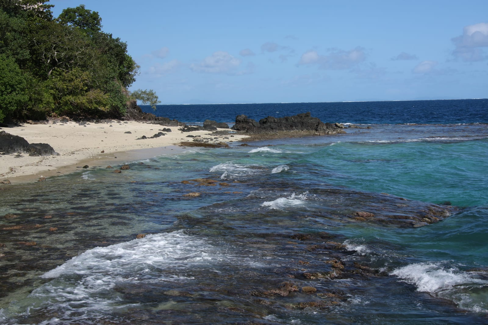

Курорт назван именем сына Жака-Ива Кусто и с самого открытия строился вокруг моря, а не вокруг бассейна. Он стоит на 17 акрах бывшей кокосовой плантации у бухты Савусаву, в нём 25 хижин-буре под тростником.

26 января 2026 года отель закрылся целиком и открылся заново 1 апреля. За три месяца пятиспальные буре на первой линии переделали в резиденции на две спальни и два санузла, перекрыли крыши, добавили фитнес-зал на 83 квадратных метра с окнами на бухту и перестелили корты. В ремонте участвовали сами сотрудники курорта.

Морская часть — то, ради чего сюда едут: программы наблюдения за рифом, мангровые заросли под охраной, детская натуралистская школа, которая работает тут дольше, чем большинство подобных курортов существует.

**Из России.** Виза не нужна: на границе бесплатно ставят штамп на 90 дней, паспорт должен быть действителен ещё полгода. Пакет на шесть ночей для двоих стоит $5 499 — около 478 400 ₽ за поездку, включая все приёмы пищи, спа-процедуры, выезды и трансфер из аэропорта; двое детей живут бесплатно.

---

## 2. Koroi Forest Camp — Танзания, национальный парк Аруша

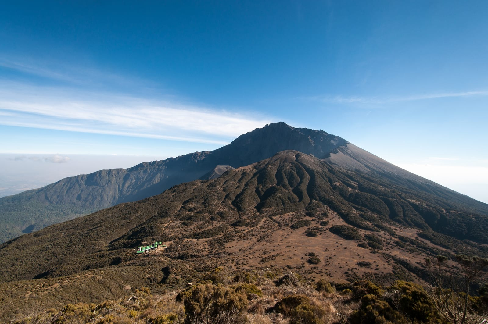

Самый дешёвый вход в этот список и единственный лагерь, где вместо саванны лес. Koroi стоит в реликтовом горном лесу у подножия Меру — потухшего вулкана высотой 4 562 метра, пятой вершины Африки. Название взято из масайского языка: так называют чёрно-белых обезьян-колобусов, которые живут в кронах над лагерем.

Восемь лесных шале смотрят на поляну, которую в сезон дождей заливает водой, и туда приходит зверьё. Птиц в округе больше четырёхсот видов, и орнитологическая программа тут заменяет привычную «большую пятёрку»: прогулки по лесу, подъём в кратер Нгурдото, ущелье с водопадом, смотровая площадка в кронах деревьев, ночной выезд и встречи с масаями.

**Из России.** Танзания выдаёт электронное разрешение онлайн. Полный пансион стоит от $422 с человека за ночь — около 36 700 ₽; с ежедневными выездами на сафари от $587, с полной приключенческой программой от $721. До 22 декабря 2026 года действует акция: четыре ночи по цене трёх.

---

## 3. Airelles Palladio — Италия, Венеция, остров Джудекка

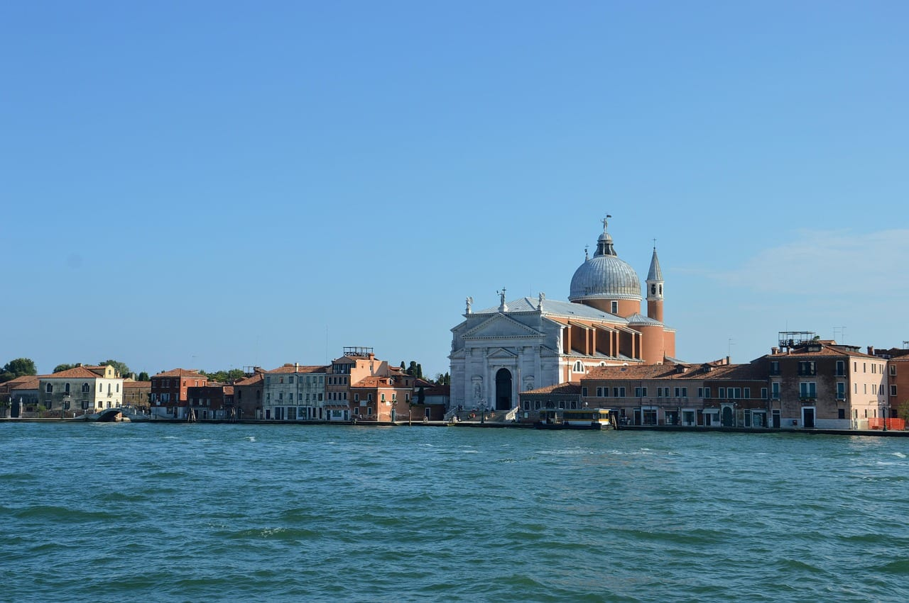

Первый отель французской марки Airelles за пределами Франции открылся 1 апреля 2026 года на Джудекке — острове напротив главной набережной, куда почти не доходят туристические толпы. Под отель отдали три здания XVI века и гектар частных садов.

Внутри 45 ключей: 17 номеров, 28 сьютов и отдельная вилла на три спальни с бассейном. Президентский сьют занимает 450 квадратных метров, велнес-центр — 1 700, к ним прилагаются три бассейна, детский клуб и пять точек питания, одна из которых со звездой Мишлен. Ставка сделана на венецианское ремесло: антиквариат, стекло, ткани.

**Из России.** Нужен шенген. Ночь в низкий сезон стоит от €1 200–1 400 с завтраком, это 121 000–141 200 ₽; в высокий сезон доходит до €2 500, около 252 100 ₽. В апреле, месяц открытия, номера продавали по €6 500–9 840 за ночь.

---

## 4. One&Only Moonlight Basin — США, Биг-Скай, Монтана

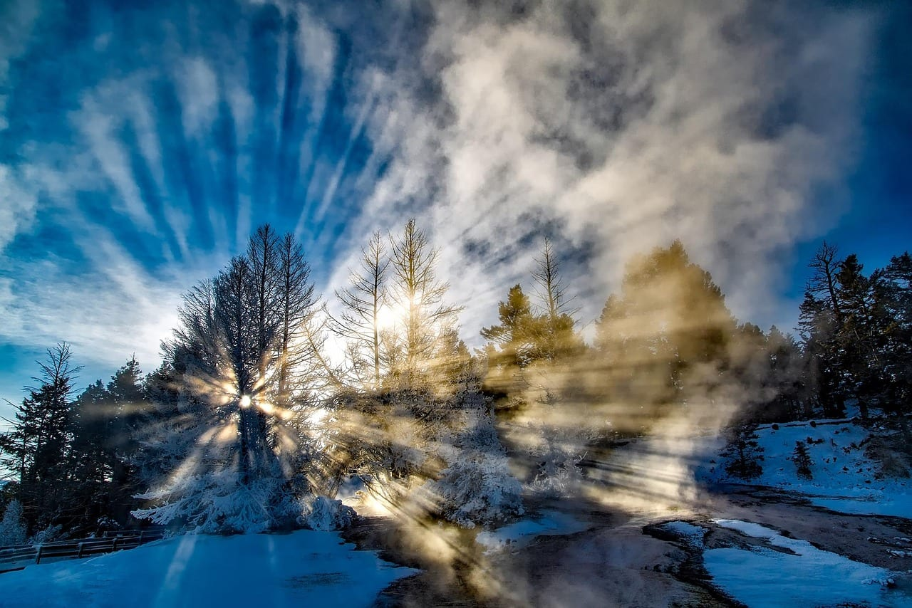

Первый американский и первый горный курорт марки One&Only открылся в ноябре 2025 года. Он стоит на 240 акрах, вокруг ещё 17 тысяч акров охраняемых земель, до Бозмена час езды, до входа в Йеллоустоун — примерно столько же.

Здания намеренно рассыпаны по лесу и спрятаны в рельеф: место лежит на пути миграции зверья, и застройка не должна была перекрыть коридор. К подъёмникам Big Sky Resort ведёт своя отапливаемая гондола, в ресторане работает Акира Бэк со звездой Мишлен, у гостей есть частные горные озёра.

В цифрах это 73 номера и сьюта, 19 отдельных кабин, 62 частных дома и 8 участков под застройку — то есть посёлок, а не гостиница.

**Из России.** Нужна виза США: запись за границей, ожидание месяцами. Ночь стоит от $1 950 до налогов — около 169 600 ₽.

---

## 5. Harbor House Inn — США, Элк, Калифорния

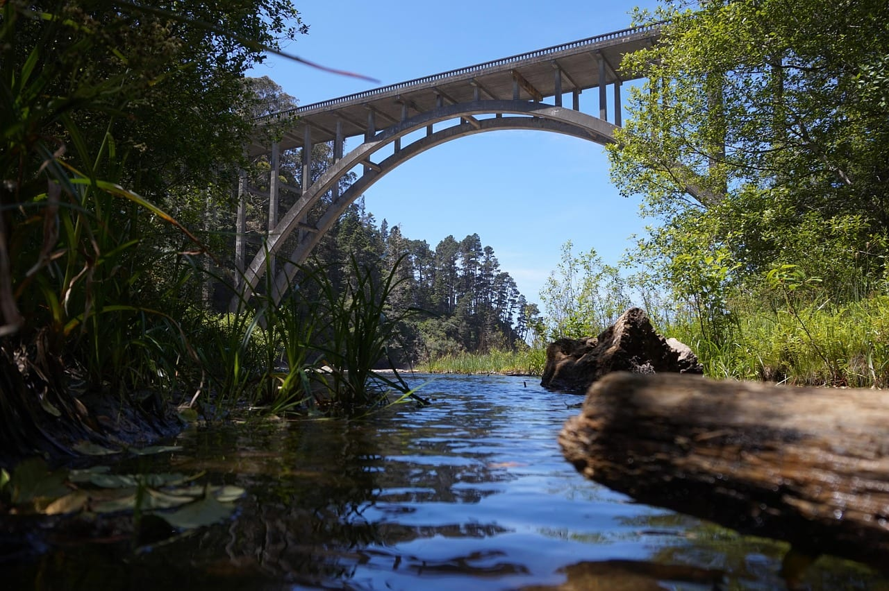

Дом из красного дерева построили в 1916 году для лесопромышленной компании Goodyear Lumber — тогда это была контора при лесопилке на обрыве над Тихим океаном. Сейчас в нём шесть номеров и ещё пять отдельных коттеджей, к воде ведёт частная тропа.

Главное здесь — еда. У ресторана две звезды Мишлен и «зелёная звезда» — отдельная награда за то, как хозяйство устроено: шеф Мэтью Каммерер строит дегустационное меню на том, что собрано и выловлено в паре километров, вплоть до водорослей с этого же берега и местного морского ежа, популяцию которого на побережье восстанавливают.

Осторожно с формулировкой «новый отель»: восьмилетняя реставрация здесь закончилась в мае 2018 года, а подтверждения отдельного ремонта 2025–2026 годов я не нашёл.

**Из России.** Нужна виза США. Цену за ночь отель не публикует, завтрак включён в проживание.

---

## 6. Château la Commaraine — Франция, Бургундия, Поммар

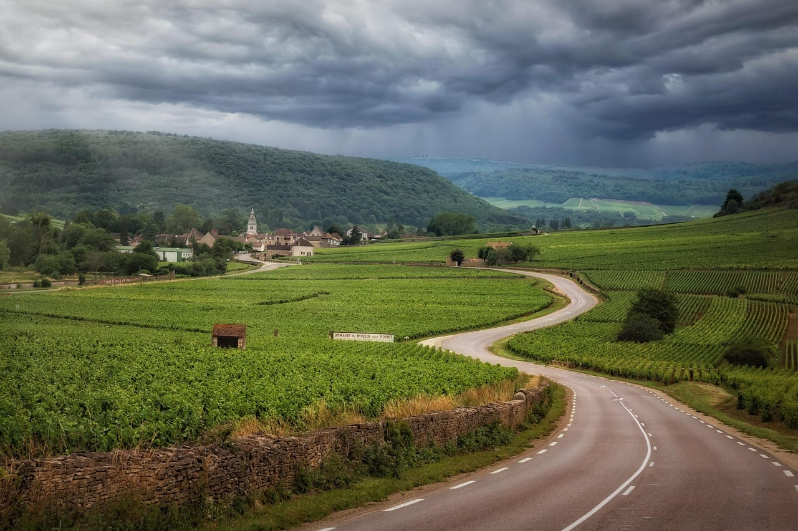

Замок XII века в самом центре Поммара открылся в конце апреля 2026 года после пятилетней реставрации: 37 номеров, спа на три кабинета с сауной, хаммамом и купелью, два ресторана.

Отличие от прочих винных отелей — работающая винодельня прямо в хозяйстве и собственный виноградник-монополь Clos de la Commaraine площадью больше девяти акров в статусе premier cru. Гостей пускают внутрь процесса: дегустации, встречи с виноделами, работа по сезону. Гастрономический ресторан Le VIII открылся в июле 2026 года в бывшем сводчатом погребе, а имя получил по восьми участкам, на которые поделён виноградник.

**Из России.** Нужен шенген. Ночь от $704 — около 61 200 ₽. Из всех европейских позиций списка это самая дешёвая.

---

## 7. Caiman, Pantanal — Бразилия, Пантанал

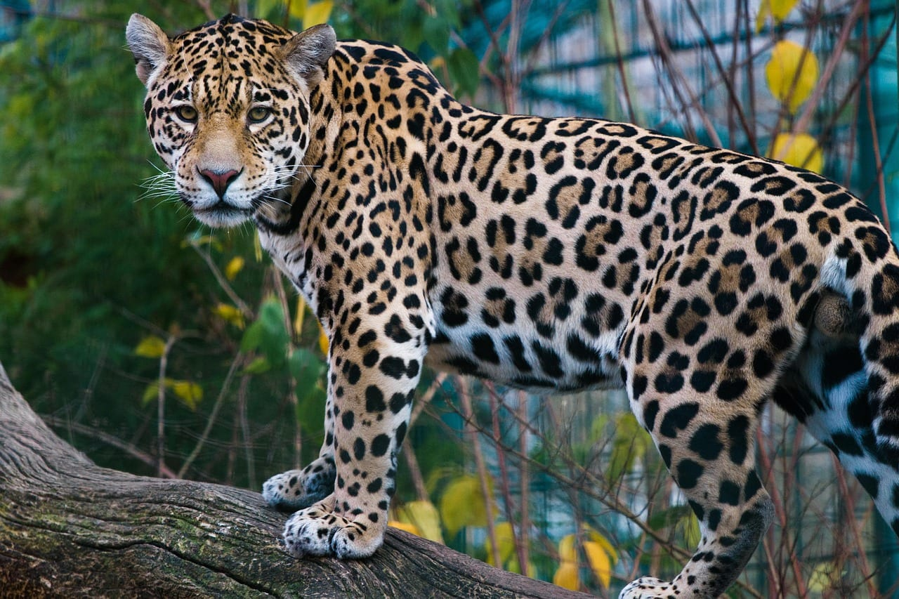

Пантанал — крупнейшее в мире водно-болотное угодье, и Caiman занимает в нём 131 тысячу акров. Формально это отель: главный дом Casa Caiman на 18 сьютов и две частные виллы. Фактически — база двух научных программ, по ягуарам и по гиацинтовым ара.

Цифра, ради которой сюда стоит смотреть внимательнее прочих: в 2013 году ягуара за поездку видели 16% гостей, через десять лет работы проекта Onçafari — 100%. Это не про удачу, а про то, что звери в заповеднике привыкли к машинам и перестали прятаться.

**Из России.** Виза не нужна. Цену за ночь хозяйство не публикует, минимальный заезд — три ночи, всё включено: питание, безалкогольные напитки и выезды. Туроператоры продавали пятидневные пакеты по $10 099–11 099 с человека на лето 2026 года — около 878 600 ₽, но это цена тура целиком, а не ночи.

---

## 8. Coral Sands Inn & Cottages — Багамы, Харбор-Айленд

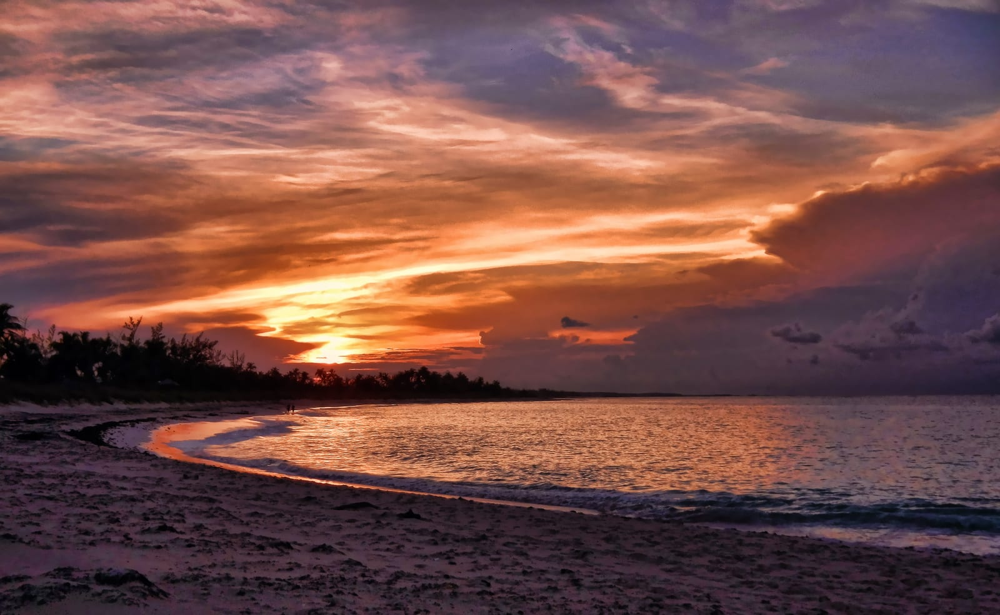

Отель 1968 года на розовом пляже Харбор-Айленда — том самом, где песок отдаёт розовым от растёртых раковин фораминифер. В начале 2024 года его купила компания AJ Capital Partners, к декабрю того же года открыла после первой очереди ремонта, а вторую очередь со спа доводит в 2026 году.

Всего 41 место для ночлега: 24 номера, 6 бунгало, 8 коттеджей и три резиденции по четыре спальни. Богемную эстетику шестидесятых сохранили сознательно, но добавили деталей, которых раньше не было: колонны ресторана Pink Mermaid облицованы семью тысячами раковин, набранных вручную.

**Из России.** Виза не нужна: до 90 суток по загранпаспорту, справка МИД России. Ночь в январе 2026 года стоила $742–826 — около 64 600–71 900 ₽.

---

## 9. Brenners Park-Hotel & Spa — Германия, Баден-Баден

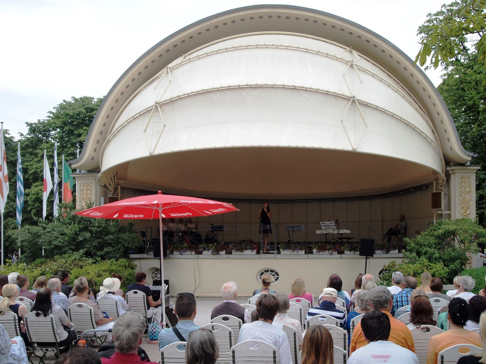

Гранд-отель 1872 года в городе, куда русская литература ездила лечиться и проигрываться. Двухлетний ремонт закончился в конце 2025 года; вела его графиня Бергит Дуглас, дочь Рудольфа-Августа Откера, чьей семье отель принадлежит.

В 104 номерах больше 27 разных решений — двух одинаковых нет. Спа занимает четыре этажа и опирается на римские термальные источники, которые и создали этот город.

Самая интересная деталь спрятана в тумбочке: в номерах категорий Superior и Deluxe Stéphanie и в спа-сьюте есть кнопка цифрового детокса — одно нажатие обесточивает номер целиком и отключает вайфай. Не «режим тишины» в приложении, а физический разрыв.

**Из России.** Нужен шенген. Ночь от $800 с завтраком — около 69 600 ₽; отдельный корпус Villa Stephanie идёт от €683, это 68 900 ₽.

---

## 10. NIHI Rote — Индонезия, остров Роти

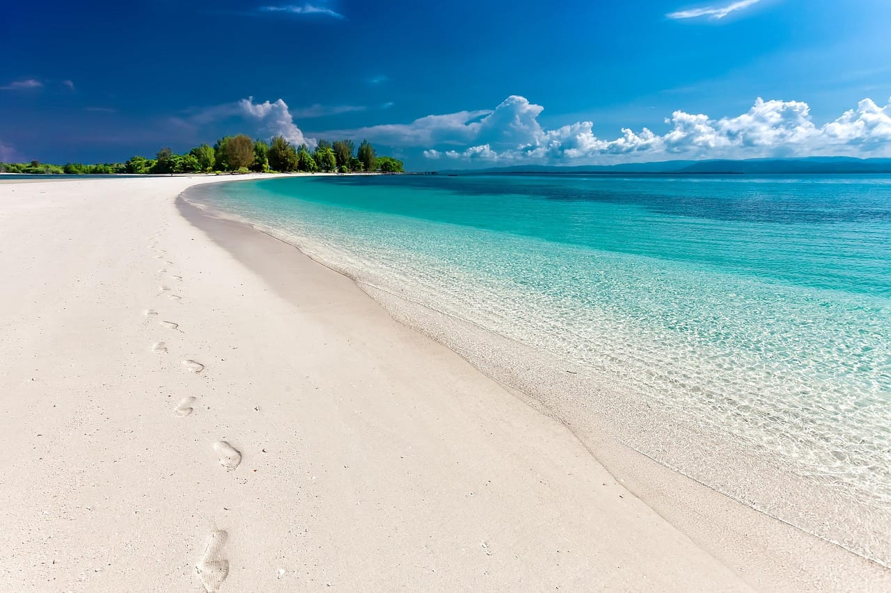

Роти — самый южный обитаемый остров Индонезии, дальше только океан до Австралии. Курорт открылся 16 апреля 2026 года у белого пляжа Боа: 21 вилла размером от 130 до 270 квадратных метров, у каждой свой бассейн, вокруг сёрф-брейки.

Отличает его школа. При курорте работает академия гостеприимства для местных подростков — не благотворительный жест, а способ набирать персонал на острове, где до этого туристической работы не было вовсе. Вертолётная связь с NIHI Sumba, старшим курортом той же марки, решает вопрос доставки.

Честно про недостроенность: главный бассейн, спа и ресторан Ombak откроются только в сентябре 2026 года. Курорт открывался частями, и цену держат низкой именно поэтому.

**Из России.** Индонезия выдаёт разрешение по прилёте и онлайн. Ночь от $800 по системе «всё включено» — около 69 600 ₽; после сентября 2026 года тариф поднимут.

---

## 11. Limelight Boulder — США, Боулдер, Колорадо

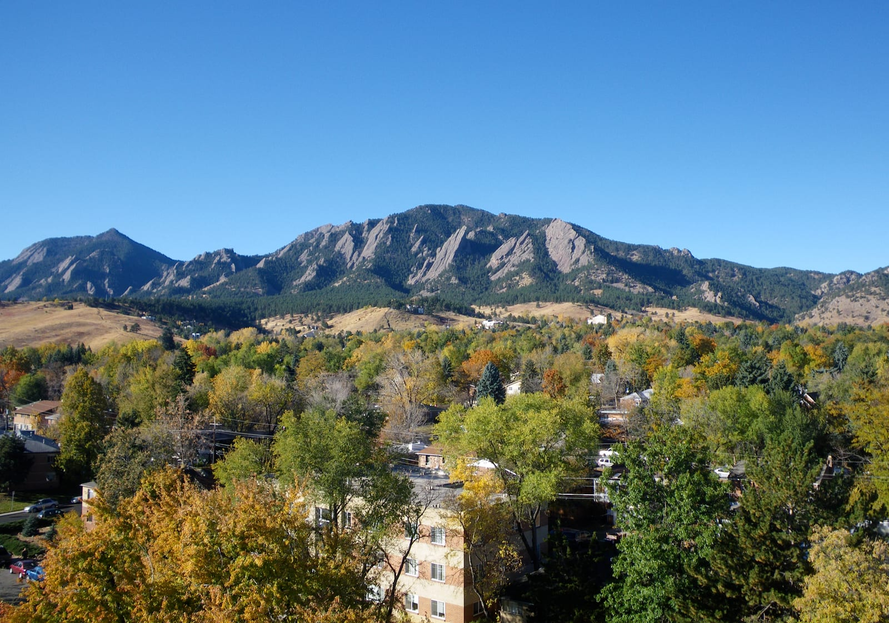

Самый крупный полностью электрический отель США: ни газа, ни котельной, всё на электричестве. Открылся в августе 2025 года на University Hill, рядом с кампусом Университета Колорадо. В нём 252 номера и 26 тысяч квадратных футов площадей под мероприятия.

Здесь стоит поправить оригинал списка: кинофестиваль Sundance переезжает в Боулдер в январе 2027 года, а не сейчас. Отель к этому переезду готовился и стоит в десяти минутах от главных площадок, но пока принимает обычных постояльцев, а не кинематографистов.

**Из России.** Нужна виза США. Вводный тариф — $303 за ночь плюс $30 кредита на еду, это около 26 400 ₽; цифра выбрана по телефонному коду Боулдера. Обычные номера идут от $295.

---

## 12. Fairmont Jasper Park Lodge — Канада, Альберта, Джаспер

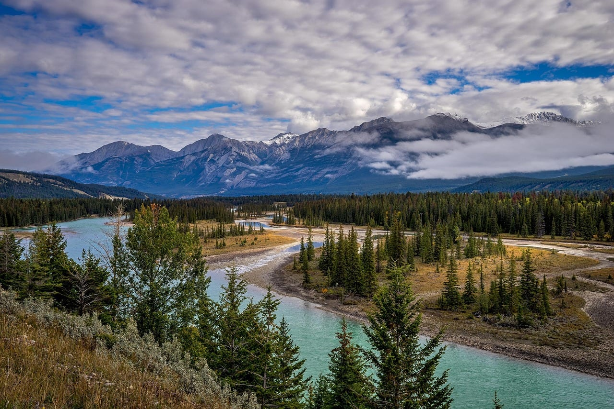

Летом 2024 года город Джаспер горел: 22 июля отель эвакуировали, он закрылся на два с половиной месяца и открылся 1 октября. Огонь до главных корпусов не дошёл — уцелели и главный дом, и гольф-клуб, и лодочный сарай, и исторические коттеджи.

Настоящее переоткрытие случилось позже. С 4 ноября 2025 по 1 июня 2026 года шла перестройка за 100 миллионов канадских долларов: обновили больше 330 номеров из 397 и открыли три ресторана — Lume с садовой кухней, Elderwood в главном зале и Barbicon с мясом на огне и выдержкой.

Территория — 700 акров, а вокруг крупнейший в мире заповедник тёмного неба: с 2011 года здесь запрещена лишняя подсветка, и Млечный Путь виден с террасы.

**Из России.** Нужна виза Канады — ожидание от полутора месяцев. Ночь от 260 канадских долларов плюс курортный сбор 50 за номер в сутки, вместе около 19 400 ₽. Это самая дешёвая позиция списка.

---

## 13. The Hanok Heritage — Южная Корея, Йонволь, провинция Канвондо

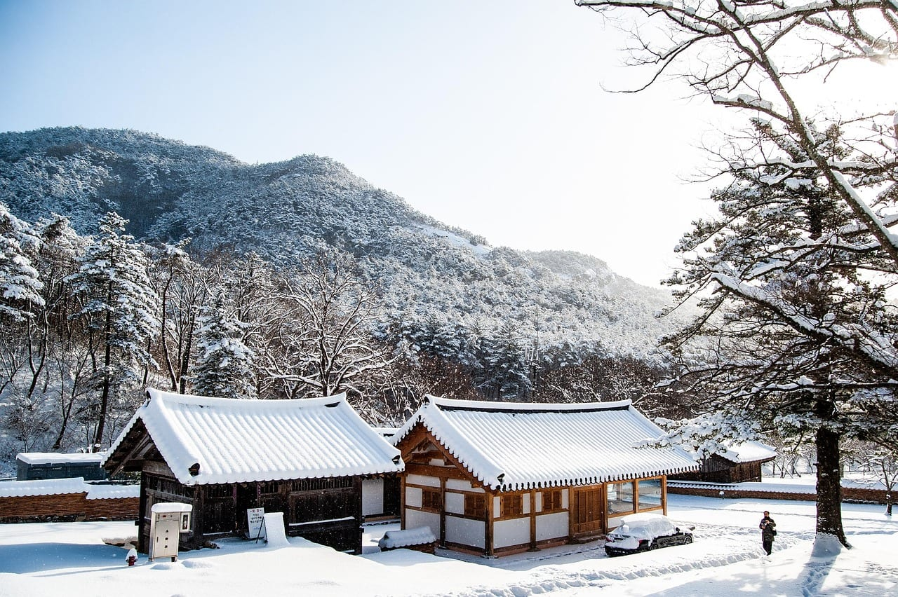

Самый большой ханок-отель Кореи занимает 340 тысяч квадратных метров в горах Канвондо. Ханок — традиционный корейский дом из дерева и глины, и обычно это музей или гостевой домик на пару комнат. Здесь из него сделали комплекс: 20 номеров и пять частных вилл, всё построено по старой технологии, а вдохновением служил главный зал святилища Чонмё из списка ЮНЕСКО.

Смысл проекта в том, что дерево заставили работать по-современному: коробление и промерзание, из-за которых в ханоках холодно и сыро, решены нынешними материалами внутри традиционной конструкции.

До сентября 2025 года это был закрытый клуб для своих, сейчас пускают всех. Комплекс продолжают строить: бассейн в ханок-стиле и культурное пространство обещали к июню, полностью работы закончатся к 2028 году.

**Из России.** Корея пускает по электронному разрешению, которое оформляют онлайн за пару дней. Ночь стоит 1,2–2,7 миллиона вон — от 76 200 до 171 400 ₽.

---

## 14. HOSHINOYA Nara Prison — Япония, Нара

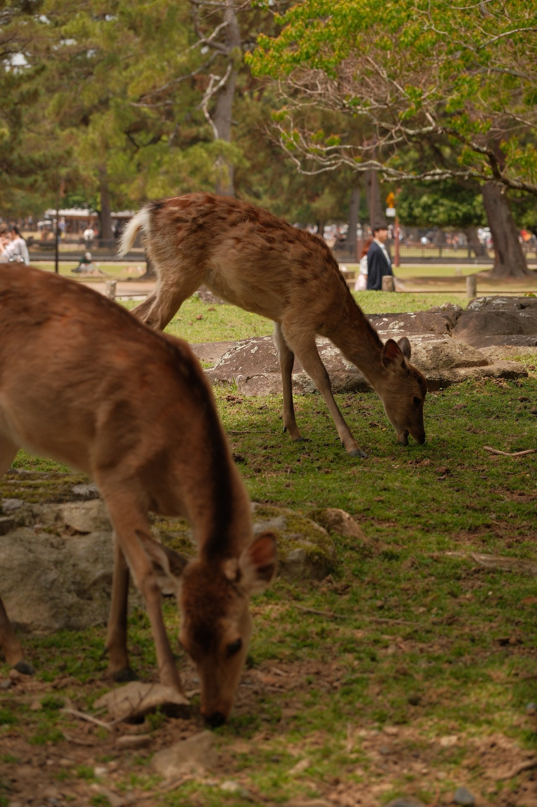

Тот самый отель, мимо которого я прошёл в мае 2025 года, не зная, что там будет. Здание тюрьмы Нара построено в 1908 году, это единственная сохранившаяся из «пяти великих тюрем» эпохи Мэйдзи и с 2017 года — важный культурный объект государственного значения. Отель открылся 25 июня 2026 года после семи лет реставрации.

В оригинале списка стоит 1872 год — это дата основания учреждения, а не постройки нынешнего здания, разница в 36 лет.

Сорок восемь сьютов собраны из бывших камер: самый большой номер занимает одиннадцать камер, поменьше — девять. Радиальную планировку, при которой коридоры расходятся лучами от центрального поста, сохранили целиком, как и решётки на маленьких окнах. Забыть, где находишься, тут не выйдет, и это сделано намеренно. На той же территории в 25 акров с 27 апреля работает музей тюрьмы.

**Из России.** Нужна японская виза, консульский сбор минимальный. Ночь от 147 000 иен без питания — около 79 800 ₽, минимальный заезд три ночи. Бронирование открылось 20 января 2026 года, и к июлю первый сезон был раскуплен на 60–70%.

---

## 15. The Pinnacle Kigali — Руанда, Кигали

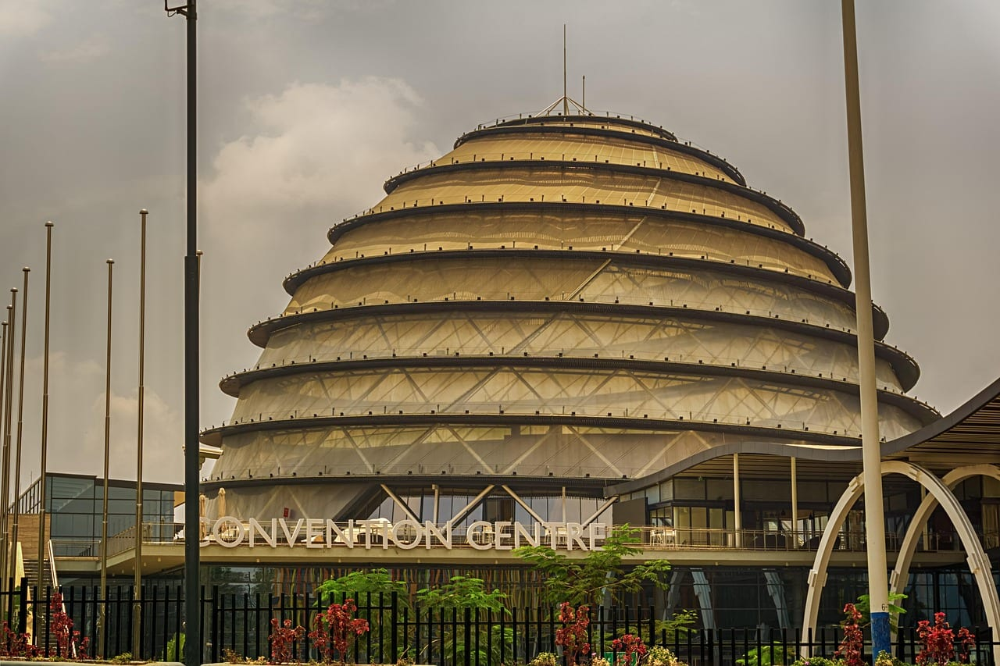

Девять номеров на холме Реберо над столицей — и самая высокая цена во всём списке. Отель открылся для иностранных гостей в январе 2026 года.

Его построила Шейла Кьярисиима: родилась в Уганде в руандийско-угандийской семье, выучилась на инженера-строителя в Университете Брауна, работала в Goldman Sachs, пять лет вынашивала идею и называет результат письмом любви к Руанде. Она первая чернокожая женщина — владелица люксового отеля в стране.

Замысел в том, чтобы Кигали перестал быть пересадкой по дороге к гориллам. Поэтому здесь спа, корты для тенниса, паделя и баскетбола, стойка теппаньяки и афро-азиатская кухня — набор, ради которого останавливаются на несколько дней. Отель приняли в Small Luxury Hotels of the World, а журнал Time включил его в список лучших мест 2026 года.

**Из России.** Визу ставят в аэропорту Кигали: $50 на 30 дней. Ночь от $3 090 — около 268 800 ₽; дневное пользование без ночёвки от $1 545.

---

## 16. Kitirua Plains Lodge — Кения, Амбосели

Лагерь открылся 1 июня 2026 года на 128 акрах частной концессии, которая граничит с национальным парком Амбосели: до главных ворот десять минут. Для компании Abercrombie & Kent это возвращение туда, где шестьдесят лет назад она придумала современное сафари.

Тринадцать отдельно стоящих сьютов — здесь оригинал списка ошибается, в пресс-релизе оператора их 13, а не 11 — построены без всякой отсылки к палаткам: текучая форма, вписанная в рельеф, площадь каждого около 120 квадратных метров, ванна, душ внутри и снаружи, кондиционер и веранда с видом на Килиманджаро. Электричество от солнца, материалы местные, здания разнесены по участку, чтобы не рвать ландшафт.

**Из России.** Кения выдаёт электронное разрешение онлайн. Ночь от $840 с человека — около 73 100 ₽, и в эту цену входит всё: питание, напитки, выезды на сафари и трансферы. Медицина в Кении для иностранцев платная, <a href={cherehapaTravel('oteli_natgeo_2026')} class="aff-cta" rel="sponsored">полис с покрытием сафари оформляется за пару минут</a>, оплата российской картой. Подробный разбор страны — в [гайде по Кении](/blog/kenya-guide-2026/).

---

## 17. Hope — Шотландия, Сазерленд, Хайлендс

Охотничий дом XIX века на северном побережье Шотландии, между горой Бен-Хоуп и озером Лох-Хоуп, открылся в мае 2026 года. Спален всего семь, дом можно снять целиком.

Стоит он внутри частного проекта восстановления дикой природы площадью 220 тысяч акров: хозяева выкупают земли и возвращают им то, что человек свёл за два столетия — леса, торфяники, реки с лососем. Гость платит за ночь и заодно финансирует эту работу, а гулять выходит по территории, которая при нём меняется. Небо здесь тёмное, без городской засветки на десятки километров.

**Из России.** Нужна британская виза — самая долгая в списке по срокам. Ночь от £1 100 — около 129 600 ₽, но это «всё включено» в буквальном смысле: полный штат, ежедневная уборка, вся еда, которую готовят свои повара из местных продуктов.

---

## 18. Casa Bonavita — Мальта, Аттард

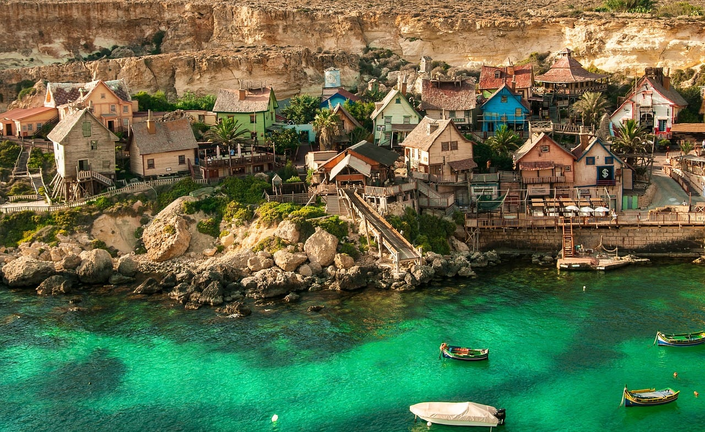

Отель открылся в мае 2026 года в деревне Аттард — это внутренняя, не курортная Мальта, в получасе от переполненного побережья. Под него отдали фамильный дом XVIII века, который пять лет приводили в порядок.

Сделали его Кристофер и Сюзанна Шарп, основатели ковровой марки The Rug Company, — это их первый отель, и интерьеры собирала лондонская студия Сюзанны. Отсюда семнадцать номеров, ни один не похож на соседний: антиквариат, сицилийский мрамор, муранские люстры. При отеле два бассейна, спа с хаммамом и купелью, средиземноморская кухня шефа Декса Оусмана — обедают либо в зале с фресками, либо во дворе под апельсиновыми деревьями.

В оригинале списка дом назван виллой венецианского дворянина 1715 года. Сам отель и мальтийская пресса пишут осторожнее — «палаццо XVIII века», без венецианцев.

**Из России.** Нужен шенген. Цену за ночь отель не публикует.

---

## 19. Alila Mayakoba — Мексика, Ривьера-Майя

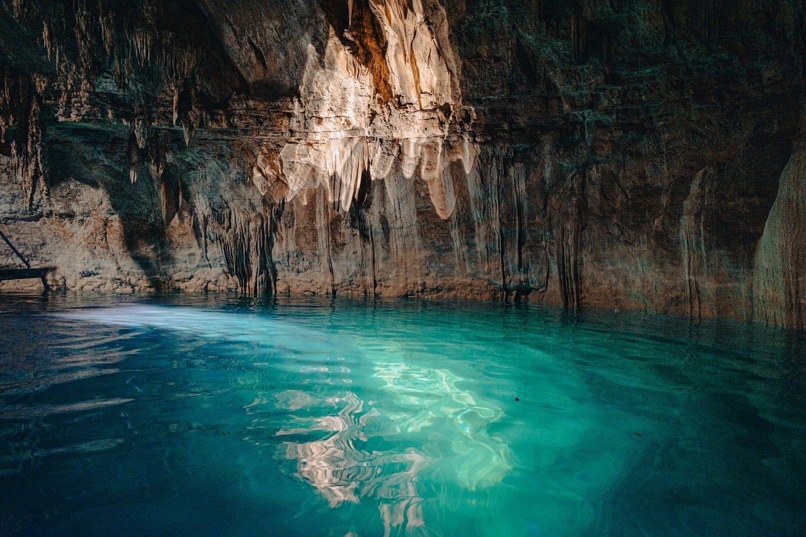

Курорт открылся 12 февраля 2026 года на месте закрывшегося Andaz Mayakoba и стал первым отелем марки Alila в Латинской Америке. Он занимает 60 акров мангровых зарослей, прорезанных каналами, — по ним ходят лодкой вместо машины.

Из 182 номеров 72 — сьюты, у части свои небольшие бассейны. Всю отделку переделали: камень и дерево от местных мастеров, ванные комнаты в логике спа, внутренние сады. Спа с гидротерапией под открытым небом и залами, повторяющими форму сенота — карстовой воронки с подземным озером, которых на Юкатане тысячи и которые у майя считались входом в подземный мир.

**Из России.** Консульская виза не нужна, но нужна бесплатная электронная авторизация: 30 дней действия, один въезд, пребывание до 180 дней и только при перелёте самолётом. Ночь стоила $1 102 для участников программы Hyatt и $1 353 без неё — 95 900 и 117 700 ₽. Подробности по стране — на странице [Мексики](/mexico/).

---

## 20. Jakes Hotel — Ямайка, Треже-Бич

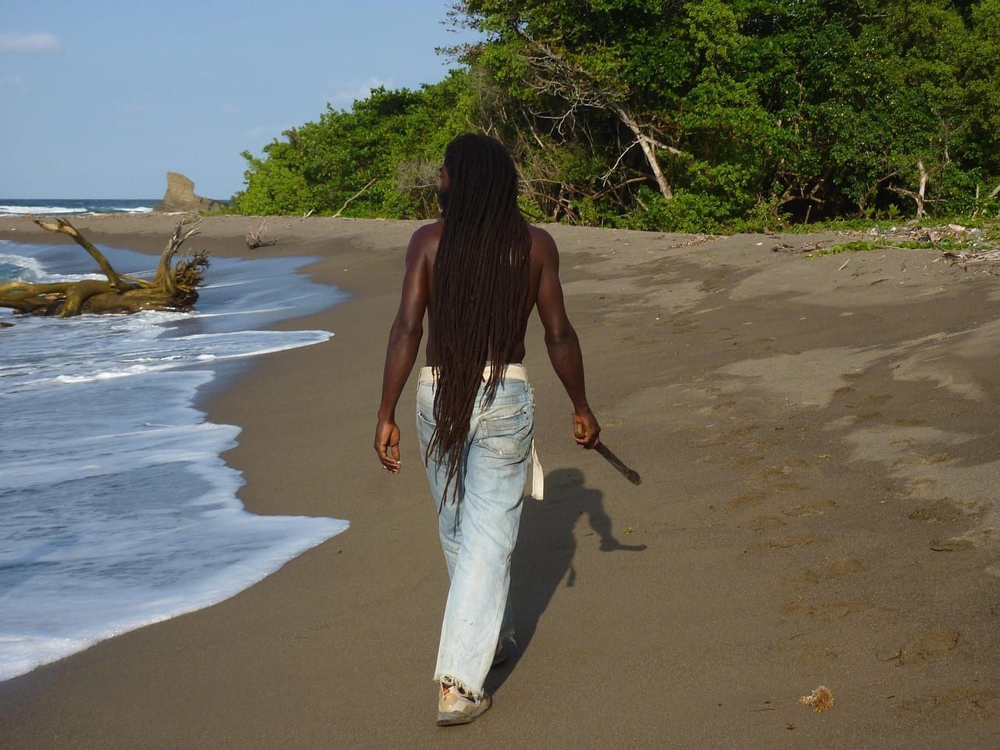

История, ради которой этот отель и попал в список. Jakes работает с 1993 года на южном берегу Ямайки, вдали от курортной Негрила, и держится на местном сообществе, а не на туроператорах.

28 октября 2025 года на Треже-Бич вышел ураган «Мелисса» пятой категории и разнёс отель почти полностью — за год до этого по югу острова прошёл «Берил». Восстановление обошлось примерно в миллион долларов, и делали его местными силами: на стройке работали стажёры государственной программы обучения. 18 декабря 2025 года отель открылся с тремя четвертями номеров, в апреле 2026 года сдали шесть новых бунгало на первой линии — с уличным душем, крышей-террасой и выходом прямо к воде.

**Из России.** Виза не нужна: 90 дней в каждые 180 по соглашению 2019 года. Ночь в новом бунгало от $365 — около 31 800 ₽; до 30 июня 2026 года действовала скидка 30% при заезде от двух ночей.

---

## 21. Hotel Hana — Франция, Париж

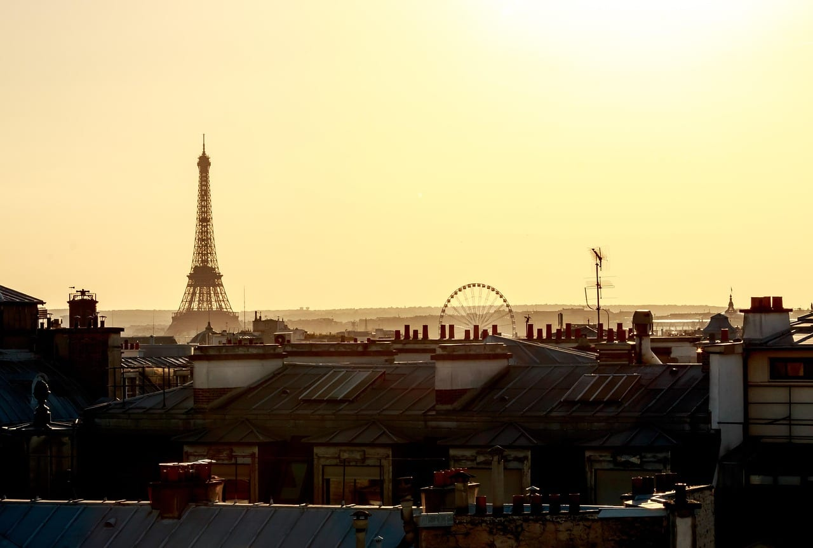

Бонусная позиция: этот отель выбрал не редакция, а Антони Поровски, ведущий программы Best of the World, который жил здесь во время съёмок.

Двадцать шесть номеров в квартале Маленький Токио, рядом с улицей Сент-Анн, где держат лучшие в городе рамен и удон. Внутри японский минимализм рёкана сложен с парижской роскошью конца XIX века, при отеле спа, крытый бассейн и франко-японский ресторан Hanabi.

Поровски хвалил отель за то, чего обычно не хватает пятизвёздочным: «самый милый и продуманный, без пафоса и снобизма». Из еды вспоминал завтрак — мягкий омлет с плотным хлебом на закваске и маслом с фурикакэ.

**Из России.** Нужен шенген. Двухместный номер от €406 плюс городской налог €11,70 с человека за ночь — около 40 900 ₽.

---

## Чем платить за такой номер, если карта российская?

**Российскими Visa и Mastercard — никак, они не работают за границей с марта 2022 года.** Ни один отель из этого списка не примет карту российского банка ни при бронировании, ни на стойке.

Рабочих способов три. Виртуальная карта иностранного эмитента в долларах или евро выпускается за минуты и пополняется рублями через СБП — ей же бронируют онлайн. Карта UnionPay местного банка в Казахстане, Армении или Кыргызстане требует поездки на пару дней, но даёт пластик. Наличные доллары или евро остаются страховкой на месте: в Танзании, Кении и на Ямайке ими платят охотнее, чем картой.

Отдельная сложность с бронированием: привычные международные площадки из России не работают, и половина отелей списка принимает заявки только через свой сайт или туроператора. У лоджей вроде Caiman и Kitirua это норма и без всяких санкций — там заезд считают пакетом, а не ночью.

Полный разбор с лимитами и комиссиями — в статье про [карты для оплаты за границей](/blog/pay-abroad-2026/). Билет считают отдельно от номера, и цена там зависит от даты сильнее, чем от страны: <a href={aviasalesRoute('MOW', 'KIN', 'oteli_natgeo_2026')} class="aff-cta" rel="sponsored">посмотреть цены Москва — Кингстон</a> для самого дешёвого безвизового варианта, Ямайки.

---

## Что в списке не сходится

Три числа в оригинале расходятся с тем, что пишут сами отели, и одно событие сдвинуто по времени.

Тюрьму в Наре National Geographic датирует 1872 годом. Hoshino Resorts на своей странице и в новостях указывает 1908-й: 1872-й — год, когда учреждение основали, нынешнее здание построили через 36 лет.

У Kitirua Plains Lodge в списке 11 сьютов, в пресс-релизе Abercrombie & Kent — 13.

Кинофестиваль Sundance в описании Limelight Boulder подан как состоявшийся. Переезд состоится в январе 2027 года.

Ещё одна вещь, которую стоит держать в голове при чтении: список сделан американской редакцией для американского читателя. Семь позиций из двадцати одной — три в США плюс Канада, Багамы, Ямайка и Мексика, то есть места, куда из Нью-Йорка летят прямым рейсом за несколько часов. Для читателя из Москвы география получается совсем другой.

И последнее: половина отелей списка ещё не отработала первого сезона. У Casa Bonavita, Hope, Kitirua и Koroi отзывов постояльцев нет вовсе, у NIHI Rote не достроены бассейн и ресторан, у Coral Sands не открыт спа, у The Hanok Heritage стройка идёт до 2028 года. Ни одного отзыва российских путешественников по этим объектам я не нашёл ни на одной площадке.

---

## FAQ — что чаще всего спрашивают про этот рейтинг

**Что это за список и когда он вышел?**
Список из двадцати новых отелей мира, который National Geographic опубликовал 2 сентября 2026 года в составе программы Best of the World. Для журнала это первый рейтинг гостиниц.

**Сколько всего отелей в списке?**
Двадцать основных плюс один бонусный: парижский Hotel Hana выбрал ведущий телепрограммы Антони Поровски.

**Какой отель самый дешёвый?**
Fairmont Jasper Park Lodge в Канаде: от 260 канадских долларов за ночь плюс курортный сбор 50, вместе около 19 400 ₽. Из тех, куда пустят по загранпаспорту, дешевле всего Jakes на Ямайке — от $365, около 31 800 ₽.

**Какой самый дорогой?**
The Pinnacle Kigali в Руанде: от $3 090 за ночь, около 268 800 ₽. Отель на девять номеров.

**В какие отели можно попасть без визы?**
Без консульской визы доступны десять из двадцати одного. Фиджи, Багамы, Ямайка и Бразилия пускают по загранпаспорту; Кения, Танзания, Индонезия, Корея и Мексика выдают разрешение онлайн; Руанда ставит визу в аэропорту за $50.

**Правда ли, что в Японии открыли отель в тюрьме?**
Да. HOSHINOYA Nara Prison открылся 25 июня 2026 года в здании бывшей тюрьмы Нара 1908 года постройки. В нём 48 сьютов, собранных из тюремных камер, ночь от 147 000 иен без питания — около 79 800 ₽.

**Можно ли забронировать эти отели российской картой?**
Нет. Карты российских банков за границей не работают с марта 2022 года. Нужна виртуальная карта иностранного эмитента, карта банка СНГ или бронирование через туроператора.

**Есть ли в списке отели, куда летают прямые рейсы из России?**
Нет ни одного. Все маршруты — со стыковкой, чаще всего через Стамбул, Дубай, Доху или Абу-Даби.

**Почему в списке столько отелей в США?**
Список составляла американская редакция. Три позиции приходятся на США, ещё пять — на соседние страны и Карибы, куда из Штатов летают прямым рейсом.

**Все ли отели из списка открыты?**
Работают все, но часть открыта не полностью. У NIHI Rote бассейн, спа и ресторан откроются в сентябре 2026 года, у Coral Sands достраивают спа, у The Hanok Heritage полный комплекс обещают к 2028 году.

**Как добираться до отелей, куда пускают без визы?**
Всё со стыковкой. На Ямайку и Багамы летят через Стамбул или Доху, на Фиджи — через Дубай и Сингапур или Гонконг, в Бразилию — через Стамбул, в Кению и Танзанию — через Стамбул, Дубай или Доху. Цена билета зависит от даты вылета сильнее, чем от направления.

---

## Что почитать дальше

- [Лучшие города мира для молодых 2026](/blog/luchshie-goroda-dlya-molodyh-2026/) — двадцатка Time Out с визами и ценой дня
- [Карты для оплаты за границей 2026](/blog/pay-abroad-2026/) — четыре рабочих способа заплатить
- [Гайд по Кении 2026](/blog/kenya-guide-2026/) — сафари, сезоны, бюджет
- [Куда поехать в 2026 году россиянину](/blog/best-2026-for-russians/) — двадцать направлений с визами
- [Страховка для путешествий 2026](/blog/strahovka-dlya-puteshestviy-2026/) — что покрывает и сколько стоит

---

Цены за ночь собраны 3 сентября 2026 года с сайтов отелей и отраслевых изданий; в рубли пересчитаны по курсу ЦБ РФ на эту дату. Тарифы у таких отелей меняются по сезону и по датам — перед бронированием их надо смотреть заново. Визовые правила приведены по справкам Консульского департамента МИД России и по нашей [таблице виз](/visa/); проверять их нужно перед покупкой билета, они меняются без предупреждения.

Пишу про поездки в канале [@traveltriberu](https://t.me/traveltriberu).
