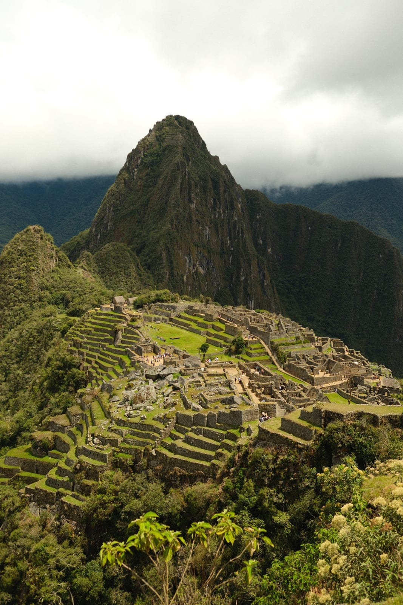
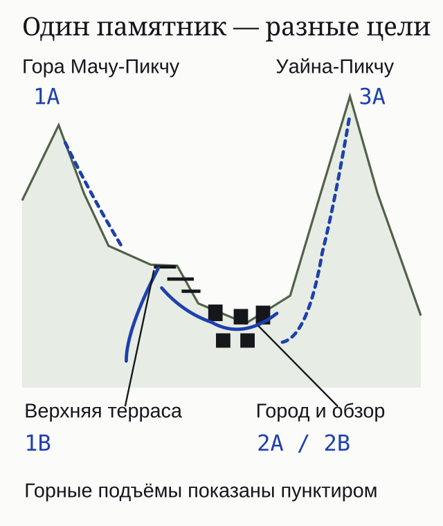
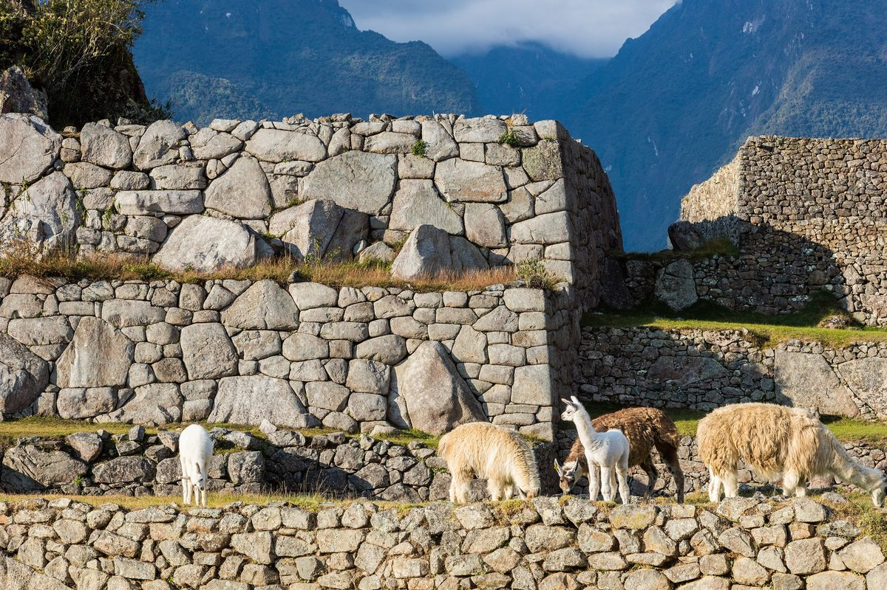
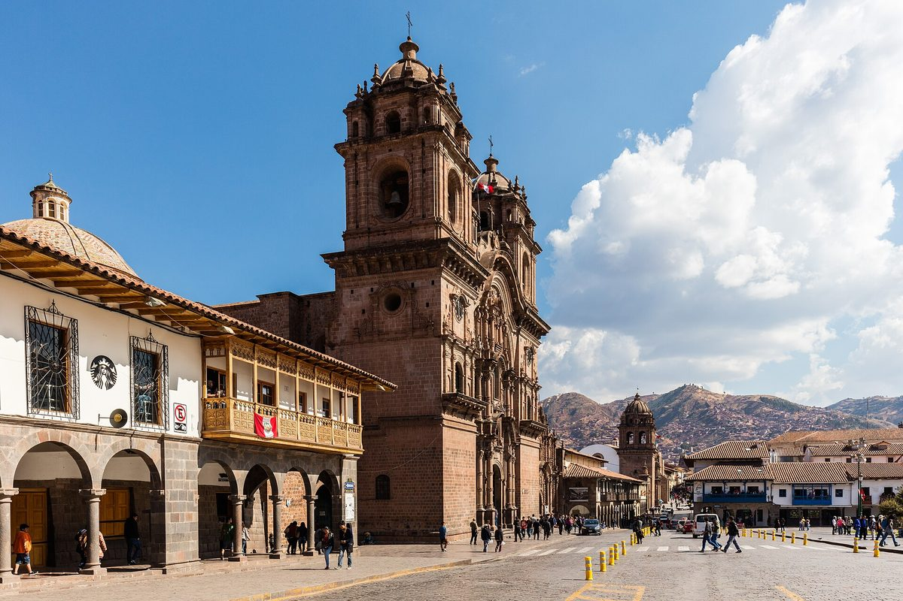

**Для первой поездки с панорамой и прогулкой по древнему городу я бы выбирал маршрут 2A или 2B.** Для вида с верхней террасы есть 1B, для подъёма на гору Мачу-Пикчу — 1A, на Уайна-Пикчу — 3A. Это разные билеты: горный подъём не добавляется к обычному входу по желанию. Покупка идёт через [Tu Boleto Министерства культуры Перу](https://tuboleto.cultura.pe/llaqta_machupicchu), где выбирают конкретные маршрут, дату и время.

Главная ловушка — купить билет с надписью Machupicchu и решить, что по нему можно пройти всю территорию. В названии важны и номер круга, и буква маршрута. За красивым названием может стоять панорамная площадка, городской проход или отдельный подъём. Выбирать нужно под то, ради чего вы приехали.

## Какой маршрут Мачу-Пикчу выбрать для первого раза?

**2A и 2B совмещают классический вид и проход по городскому сектору.** Их разумно смотреть первыми, если хочется и увидеть Мачу-Пикчу целиком, и пройти между каменными зданиями. Если оба есть на удобное время, сравните карты; если остался один, не отвергайте его только из-за буквы.

| Что хочется получить | Какой билет смотреть | Что важно до покупки |
|---|---|---|
| Панораму и прогулку по городу | 2A или 2B, круг 2 — Clásico | Оба дают классическое фото; у 2B отдельно обозначена нижняя терраса |
| Вид с верхней террасы | 1B — Terraza Superior | Это панорамный маршрут; он не заменяет городской проход круга 2 |
| Подъём на гору Мачу-Пикчу | 1A — Montaña Machupicchu | В названии должна быть гора, а не только название памятника |
| Подъём на Уайна-Пикчу | 3A — Montaña Waynapicchu | Это другая гора и другой маршрут; 3B не включает этот подъём |
| Проход по нижней части города без выбранной горы | 3B — Ruta diseñada | Сопоставьте его карту с желаемыми точками, не считайте копией круга 2 |

Для одного посещения полезно выбрать одну главную цель. «Хочу фото и посмотреть город» — понятный запрос к кругу 2. «Хочу обязательно на Уайна-Пикчу» — запрос к 3A. «Хочу всё за один вход» не соответствует устройству билетов.

*Гора на заднем плане — Уайна-Пикчу. Билет на обычный городской маршрут не даёт права подняться на неё.*

## Чем отличаются маршруты 2A и 2B?

**У 2B явно выделен выход на нижнюю террасу; классический вид есть и у 2A.** В обоих официальных описаниях посещение начинается в сельскохозяйственном секторе, затем продолжается через главный вход в город, главную площадь, Священную скалу и сектор водных зеркал. У 2A указан обзор из сельскохозяйственного сектора, у 2B — подъём на нижнюю террасу для панорамы.

На официальных карточках приблизительная длина прохода туда и обратно — **2,5 км для 2A и 2,7 км для 2B**. Оба отнесены к нагрузке средней–высокой. Поэтому объяснение «2A трудный, а 2B почти без подъёмов» я бы не использовал. Разница в двух сотнях метров не описывает все ступени и темп вашей группы.

Карты помогают увидеть, куда добавлен выход к террасе и какие участки городского прохода совпадают. Названия храмов на карте не означают, что можно свободно зайти в каждое помещение: маршрут задаёт последовательность движения и точки обзора. Перед покупкой решите, устраивают ли вас этот проход, время входа и нагрузка.

Если вы едете вдвоём и хотите идти вместе, нужны места на **один и тот же маршрут и время для обоих**. Два билета на одну дату, но с разными буквами или часами, не решают эту задачу. Перед оплатой полезнее проверить обе строки заказа, чем долго спорить, какой из двух похожих маршрутов «самый правильный».

Например, если на удобный час есть два места на 2A, а на 2B осталось одно, для совместного посещения выбор 2A решает задачу лучше. Это пример принятия решения, а не сводка свободных мест. Обратная ситуация работает так же: подходящий 2B для всей группы полезнее желанного 2A, по которому часть группы не сможет войти. Приоритеты простые: нужная цель, совместный вход, выполнимая стыковка — затем небольшие различия прохода.

Сравните [карту 2A](https://api-tuboleto.cultura.pe/archivos/lugares/documentos/C2-R2A.pdf) и [карту 2B](https://api-tuboleto.cultura.pe/archivos/lugares/documentos/C2-R2B.pdf): это карты проходов, по которым стоит выбирать билет.

## Что означают три круга и десять маршрутов?

**Круг задаёт часть памятника, а буква уточняет проход или дополнительную цель.** Схема из трёх кругов и десяти маршрутов действует с 1 июня 2024 года. Старые советы с пятью кругами могут описывать прежнюю систему: перед покупкой сверяйте буквенный код.

В круге **1 — Panorámico** есть 1A с горой Мачу-Пикчу, 1B с верхней террасой, 1C с Интипунку — Воротами Солнца, 1D с мостом инков. Название *Montaña Machupicchu* обозначает именно гору; *Terraza Superior* — верхнюю террасу. Их нельзя подменять друг другом в заказе.

Круг **2 — Clásico** содержит 2A и 2B. Круг **3 — Realeza** содержит 3A с Уайна-Пикчу, 3B с городским проходом, 3C с Большой пещерой, 3D с Учуй-Пикчу. Учуй-Пикчу и Уайна-Пикчу — разные цели, несмотря на похожие названия.

Маршруты **1C, 1D, 3C и 3D обозначены как сезонные**. Не переносите на них календарь обычного городского входа. Если маршрут упоминается в статье, но не доступен на вашу дату в продаже, это не даёт права пройти к нему по соседнему билету.

*Панорама, город и горные подъёмы — разные цели. Схема показывает их расположение по уровням, а точный проход задаёт карта выбранного билета.*

## Когда стоит брать билет на гору?

**Когда подъём — самостоятельная цель поездки.** Я бы не добавлял гору только потому, что билет кажется «полнее». Уайна-Пикчу, гора Мачу-Пикчу и Учуй-Пикчу — три разных названия; перед оплатой нужно сопоставить название, код, доступность и ограничения именно выбранного маршрута.

В городском проходе тоже есть ступени. Но горный билет добавляет отдельную задачу: рассчитать силы и время на подъём, а затем успеть к обратному транспорту. Если вы боитесь высоты или не хотите длинного подъёма, сам факт свободного места на 3A не делает его подходящей заменой кругу 2.

Для поездки с ребёнком или человеком, которому трудно ходить, сначала прочитайте ограничения возраста и описание рельефа на карточке маршрута. Не делайте вывод «подходит всем» из небольшой длины или отсутствия слова «гора». Доступ без ступеней нельзя обещать по названию 3B.

*Каменные стены и травяные террасы находятся в разных частях памятника. Номер маршрута определяет, мимо каких участков вы пройдёте.*

## Где купить билет на Мачу-Пикчу самостоятельно?

**Официальная онлайн-продажа — Tu Boleto по адресу tuboleto.cultura.pe.** Сайт памятника ведёт на эту систему. Формулировка «официальный билет» у посредника описывает билет, а не обязательно статус самого продавца: смотрите адрес страницы и состав услуги.

В форме выбирают круг, маршрут, дату, доступное время и число посетителей. Для российского туриста держите рядом загранпаспорт и переносите данные так, как они указаны в документе. До оплаты сопоставьте маршрут, дату, час и всех посетителей. Ошибка в одной строке может испортить общий план, даже если остальные поля верны.

Сначала откройте нужную дату и посмотрите доступные варианты. Затем проверьте транспорт на этот же день и решите, нужна ли ночёвка. Согласуйте эти части плана до оплаты входа: выбранный час должен подходить и маршруту, и поездке к памятнику.

Итоговую сумму смотрите для **своей категории и выбранного маршрута перед платежом**. Старую цену обычного входа нельзя считать ценой любого билета с горой или суммой всей поездки. В этом разборе нет неподтверждённого «от»: поезд, автобус и вход нужно считать отдельными строками.

Успешное списание и полученный билет тоже стоит различать. Сохраните сам билет и проверьте данные после покупки. Возможность оплаты конкретной картой и результат платежа не следуют из того, что форма сайта открылась. Если деньги списались, а билет не пришёл, не оплачивайте тот же заказ повторно вслепую — разберите его статус у продавца.

## Как связать время входа с поездом и автобусом?

**Время на билете относится к входу в памятник, а поезд привозит в Мачу-Пикчу-Пуэбло, или Агуас-Кальентес.** От города нужно ещё добраться до входа. У обычных услуг PeruRail Expedition и Vistadome вход и автобус не включены в железнодорожный билет. Автобус к памятнику обслуживает Consettur.

В плане дня нужны четыре отдельные строки: прибытие поезда, дорога к входу, посещение по выбранному маршруту, возвращение к обратному поезду. Промежуток между прибытием на станцию и часом входа должен вмещать посадку на автобус и подъём. Совпавшие часы в двух билетах означают опоздание к одному из этапов, а не удобную стыковку.

Если хочется самый ранний вход, подумайте о ночёвке в Мачу-Пикчу-Пуэбло. Это организационная альтернатива попытке приехать поездом впритык. Если хотите вернуться в Куско в тот же день, сначала сопоставьте время обратного поезда с выбранным посещением, особенно при билете на гору.

*Куско — отдельная часть путешествия. Билет с этим названием на железной дороге требует проверки конкретной станции отправления и состава услуги.*

Не обещайте себе ясный вид только за ранний час. Расписание входа можно купить, погоду — нет. Выбирайте время, которое согласуется с транспортом и вашими силами; фотографический результат останется зависеть от облаков и условий на месте.

## Что делать, если билетов на круг 2 нет?

**Сначала сравнить соседние даты, затем решить, какую часть посещения вы готовы заменить.** Билет на 1B может решить задачу верхней панорамы, но не превратится в 2A. Билет на 3B даёт другой городской проход, а 3A добавляет конкретную гору. Надпись «Мачу-Пикчу» у всех одинакова; опыт посещения различается.

Покупка двух маршрутов — отдельный сценарий. У каждого будут свои время, цена и условия входа. Не складывайте два прохода в один длинный свободный маршрут: нужно понять, как закончить первый и попасть на второй. Два билета на близкие часы могут конфликтовать даже без горного подъёма.

Если точные даты поездки ещё подвижны, сменить день часто разумнее, чем платить за маршрут, который не отвечает вашей цели. Если даты фиксированы, выбирайте по доступным картам. Посредник может помочь купить билет или собрать посещение, но его предложение нужно читать до оплаты: код маршрута, время, включённые услуги и условия при отсутствии нужных мест.

## Что взять и что нельзя делать внутри?

**Небольшой рюкзак и дождевик подходят лучше громоздкой сумки и зонта.** В официальном списке запретов указаны сумки больше **40 × 35 × 20 см**, зонты, штативы, моноподы и селфи-палки. С коляской внутрь тоже нельзя. Подготовьте вещи до выхода к входу, чтобы не решать это в очереди.

Не сходите с установленного маршрута ради другого ракурса. Нельзя забираться на стены, трогать или перемещать каменные элементы, кормить животных. Видимые на фотографиях ламы не означают разрешение подманивать их едой для кадра. Ограничения нужны и для вашего плана: после выбора билета нельзя обещать себе доступ к любой видимой площадке.

Воду и вещи для прогулки собирайте с учётом правил памятника и перевозчика. У поезда и у входа разные ограничения багажа; допустимая сумка в вагоне не автоматически допустима в памятнике. Большой чемодан не стоит тащить через все этапы посещения.

## Частые вопросы о билетах и маршрутах

### 2B — это только фото, без города?

Нет. Его официальное описание включает нижнюю террасу для панорамы и продолжение по городскому сектору. Считать 2B заменой одного фотостопа неверно.

### По билету 2A можно подняться на Уайна-Пикчу?

Нет: для этой горы указан маршрут 3A — Montaña Waynapicchu. Похожие названия памятника и горы не расширяют право прохода.

### 1A — самый простой билет на обзорную площадку?

Нет. Это маршрут с горой Мачу-Пикчу. Верхняя терраса без такого названия — 1B. Проверяйте именно код и полное название в заказе.

### Есть универсальный билет на все десять маршрутов?

В официальной форме выбирают конкретный маршрут. Планировать свободную смену кругов по одному обычному входу нельзя.

### Сколько стоит всё посещение?

Сложите вход по вашей категории, выбранный транспорт, автобус или иной способ подъёма, ночёвку при необходимости и отдельные услуги гида. Один тариф входа эту сумму не описывает. Цены смотрите на одинаковую дату и на всех участников поездки.

### Как понять, что я покупаю именно то посещение?

Сопоставьте четыре вещи: **код маршрута, полное название, дату и час входа**. После этого проверьте число посетителей и документы. Общая фотография Мачу-Пикчу на карточке услуги не заменяет эти данные.

Для всей поездки вокруг Куско и Священной долины есть [общий путеводитель по Перу](/blog/peru-guide-2026/). Достопримечательности и сезоны собраны в [справке по Перу](/peru/).
