import AffiliateNote from '../../components/post/AffiliateNote.astro';
import { TP_LINKS, aviasalesRoute, ostrovokCountry, cherehapaTravel, airaloSub } from '../../data/affiliate.js';

export const tours = TP_LINKS.youtravel;
export const flights = aviasalesRoute('MOW', 'MRU', 'mauritius_2026');
export const stay = ostrovokCountry('mauritius', 'mauritius_2026');
export const insurance = cherehapaTravel('mauritius_2026');
export const esim = airaloSub('mauritius_2026');

Маврикий продаётся одной картинкой: бирюзовая лагуна в кольце рифа, белый песок, базальтовая гора на горизонте. Картинка честная — такие места на острове есть. Нечестно другое: она одинаковая на снимках всех берегов, а берега ведут себя по-разному.

Остров лежит в полосе юго-восточного пассата. Полгода этот ветер бьёт в один и тот же бок острова, и лагуна, которая на фотографии выглядит зеркалом, в это время идёт рябью и волной. Другая сторона в те же дни закрыта горами и стоит тихо.

Это и есть главное решение поездки. Не отель, не звёздность и не тип питания, а сторона света под месяц вылета.

> **Если коротко:** прямых рейсов из России нет, летают через Дубай, Стамбул и Аддис-Абебу. Виза россиянам не нужна, но **единая въездная форма обязательна по закону**, бесплатна, и её спрашивают при посадке. С мая по октябрь на острове сухая австральная зима с ветром **20–30 км/ч** с востока-юго-востока, в июле и августе — порывы **за 90 км/ч** на открытых берегах. Пляжный отдых в эти месяцы держится на севере и западе, восток отдают тем, кто едет за отелем. Турсбор — **3 €** за ночь (**296 ₽** по курсу ЦБ 98,5457 ₽ за евро на 20.08.2026) с гостей от двенадцати лет. <a href={tours} class="aff-cta" rel="sponsored">Посмотреть авторские туры по Маврикию</a> — YouTravel собирает программы малых групп с гидом, видно даты, размер группы и что входит в цену.

<AffiliateNote />

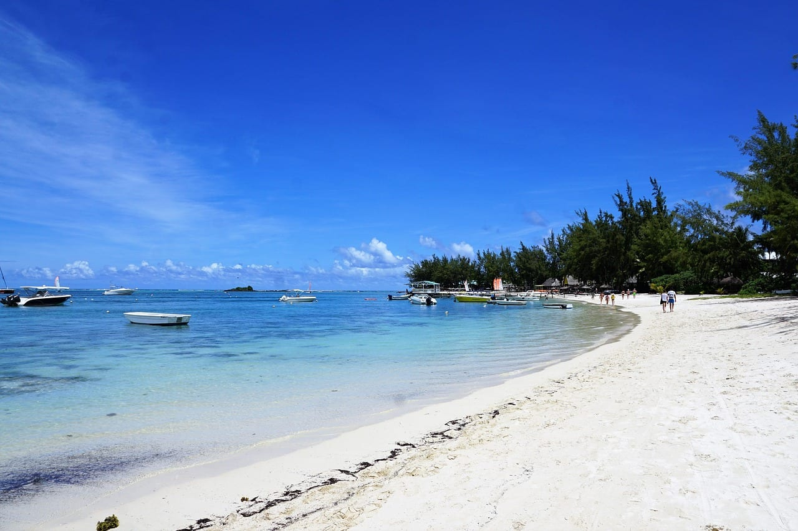

## Сколько на Маврикии сезонов и когда какой

Метеослужба Маврикия описывает климат острова двумя сезонами, а не четырьмя. Тёплое влажное лето идёт с ноября по апрель, прохладная сухая зима — с июня по сентябрь. Май и октябрь названы переходными месяцами.

Разница между сезонами меньше, чем ждёт человек, привыкший к российской зиме: средняя летняя температура **24,7 °C**, средняя зимняя **20,4 °C**, разрыв всего **4,3 °C**. Самые тёплые месяцы — январь и февраль со средним дневным максимумом **29,2 °C**. Самые прохладные — июль и август, когда средний ночной минимум опускается до **16,4 °C**.

Дождя за год выпадает **2 010 мм** (норма 1971–2000 годов). Из них **1 344 мм**, то есть **67%**, приходится на летние месяцы, и **666 мм** на зимние. Самые мокрые месяцы — февраль и март, самый сухой — октябрь.

Отсюда первый вывод, который ломает привычную логику: **российское лето на Маврикии — сухой сезон**, а новогодние каникулы попадают в мокрый. Тот, кто едет в феврале за гарантированным солнцем, покупает самый дождливый месяц в году.

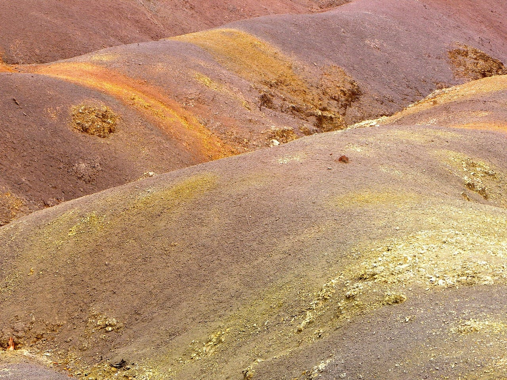

## Что на самом деле означает «низкий сезон» на Маврикии

Низким сезоном туроператоры называют австральную зиму, май — октябрь, и объясняют это прохладой. Объяснение неполное. Главная особенность зимы не температура, а ветер, и на конкретную поездку он влияет сильнее.

Метеослужба Маврикия выпустила сезонный обзор зимы 29 апреля 2026 года, на период с 1 мая по 31 октября 2026 года. В нём три числа, которых нет ни в одном туристическом описании острова.

Первое: **ветер дует преимущественно с востока-юго-востока со скоростью 20–30 км/ч**. Второе: в разгар зимы, в июле и августе, возможен **ветер порядка 40 км/ч с порывами, которые на открытых участках превышают 90 км/ч**. Третье: осадков за зиму ожидается около **535 мм**, то есть **80% от многолетней нормы** — суше обычного.

Сложите это вместе, и «низкий сезон» перестаёт быть про холод. Он про сухую солнечную погоду, в которой одна половина острова стоит под постоянным ветром, а вторая — за горами.

**Восток и юго-восток** ловят пассат в лоб. **Север и запад** прикрыты сушей и центральным нагорьем. Разницу видно даже по солнцу: та же метеослужба считает, что зимой на плато светит около 5 часов в день, а на побережьях — больше 7,5 часа.

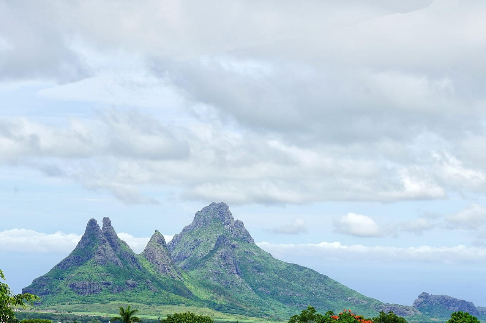

## Какой берег выбирать в каждый месяц

Ниже — таблица, ради которой написана половина статьи. Месяцы разложены по двум сезонам метеослужбы, берег подобран под ветер и осадки.

| месяц | что с погодой | какой берег | чем заняться |
|---|---|---|---|
| январь – февраль | самое тёплое и самое мокрое время, пик сезона циклонов | север и запад | вода тёплая, но короткие ливни и духота |
| март | конец жары, февраль и март — самые дождливые месяцы года | север и запад | межсезонные цены, риск дождя высокий |
| апрель | переход, влажность падает | любой, ветер ещё слабый | лучший компромисс тепла и сухости |
| май | переходный месяц, ветер разворачивается на юго-восток | север и запад | цены падают, море ещё тёплое |
| июнь – июль | сухо и ветрено, ночью до 16 °C | север и запад | сёрф, кайт, экскурсии, горбатые киты |
| август | самый ветреный отрезок, порывы за 90 км/ч на открытых берегах | строго север и запад | те же киты, гольф, походы |
| сентябрь | ветер слабеет, сухо | север и запад | стабильная погода, мало туристов |
| октябрь | самый сухой месяц года, переход к лету | любой | лучший месяц для тех, кто не переносит жару |
| ноябрь – декабрь | теплеет, начинается сезон циклонов | север, запад, восток при выборе бухты | вода прогревается, цены к Новому году растут |

Правило под этой таблицей одно: **с мая по сентябрь берег важнее отеля, с октября по апрель — отель важнее берега**. В ветреные месяцы пятизвёздочный резорт на открытом восточном берегу проиграет тройке на закрытом северном по единственному критерию, ради которого сюда летят, — по возможности зайти в воду и не бороться с волной.

<a href={stay} class="aff-cta" rel="sponsored">Подобрать отель на Маврикии</a> — Островок показывает карту, и по ней видно, на каком берегу стоит гостиница; фильтр по датам сразу подтягивает цены низкого сезона.

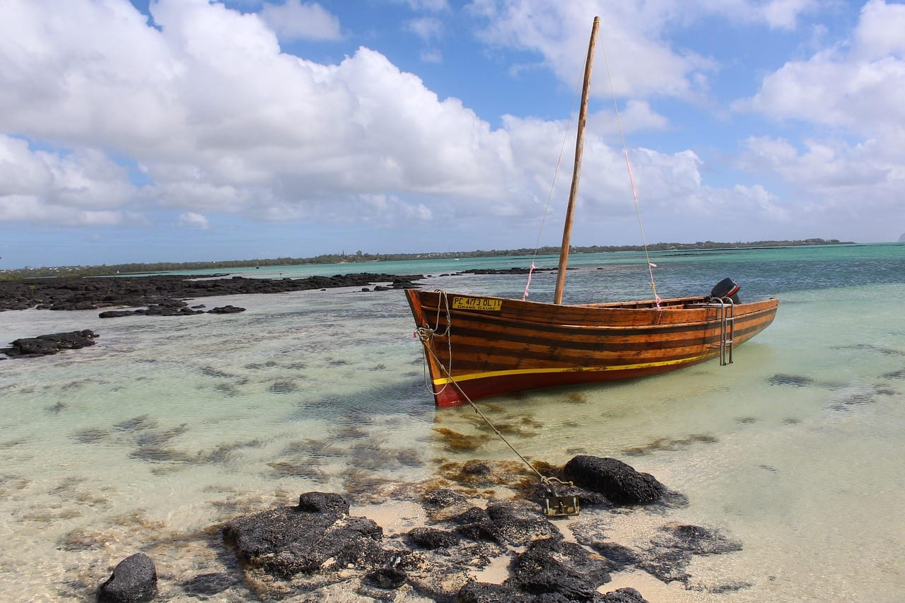

## Почему восточный берег бронируют чаще всех

Здесь начинается расхождение между тем, что советует география, и тем, что люди покупают.

По данным туроператора «Русский Экспресс», собранным Ассоциацией туроператоров России, **на восточное побережье приходится 30% заявок**, а на северное и юго-западное — по 25%. То есть самый ветреный в зимние месяцы берег продаётся лучше остальных.

Объяснение простое, и оно не про ошибку. На востоке стоят сильнейшие отели острова — Four Seasons, Shangri-La's Le Touessrok, One&Only Le Saint Geran. Человек, который платит за сервис и приватность, выбирает их осознанно, и качество отеля для него весит больше, чем облачность или короткий тропический дождь.

Второй довод туроператоров тоже верен: многие восточные отели стоят в бухтах и лагунах, где ветер почти не ощущается. Восток — не приговор, а место, где выбор конкретной бухты важнее выбора страны.

Ошибка возникает в третьем случае: когда человек берёт восточный отель по картинке и цене, не проверив, закрыт ли его пляж от пассата. Тогда июльская поездка выглядит не так, как на снимке.

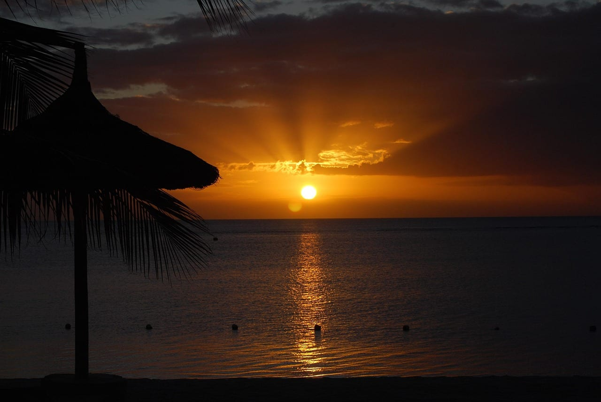

## Опасны ли на Маврикии циклоны

Официальный сезон тропических циклонов в этой части Индийского океана идёт **с 1 ноября по 15 мая**. Всемирная метеорологическая организация заканчивает сезон 30 апреля почти везде, и Маврикий с Сейшелами — исключение, для них срок продлён до 15 мая.

Это не значит, что каждый год приносит на остров ураган. Циклон обычно проходит стороной, а его влияние на отдых чаще выражается в трёх сутках дождя и закрытых экскурсиях, а не в разрушениях. Пик риска приходится на январь и февраль — те же месяцы, что дают максимум осадков.

К российскому лету сезон практически заканчивается: туроператоры отмечают, что вероятность штормов в июне — августе минимальна. Отдельный плюс острова, который называют те же туроператоры: приливы и отливы бывают дважды в сутки, но ситуаций, когда море уходит на километр, как на Бали или Занзибаре, на Маврикии нет.

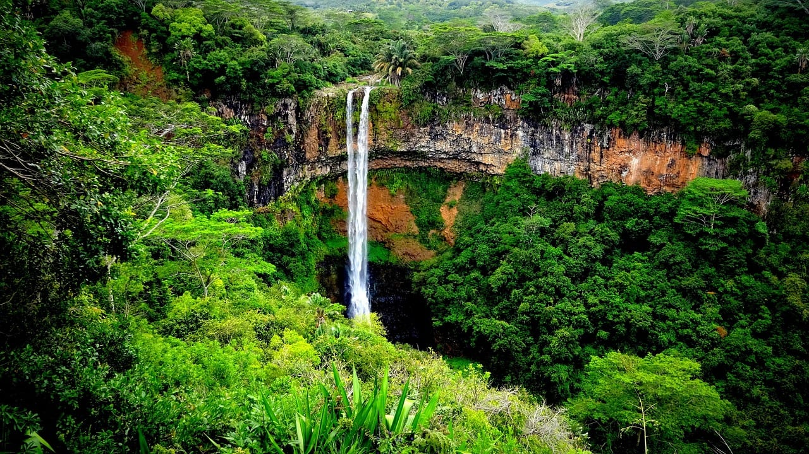

## Как лететь на Маврикий в 2026 году

Прямых рейсов из России на Маврикий нет. «Аэрофлот» летал на остров с декабря по конец марта дважды в неделю, но в зимнем расписании 2024/2025 годов направление не появилось: по оценке экспертов отраслевой ассоциации, возобновлению мешают санкционные риски — задержки бортов и заправка. Короткая полётная цепочка, которая была, спрос не обрушила: по наблюдениям туроператоров, после её завершения бронирования не снизились.

Работающие маршруты на 20.08.2026 такие.

**Через Дубай, Emirates.** Самый популярный вариант, стыковка занимает 2–3 часа. Билеты туда-обратно ориентировочно от **80–82 тыс. ₽** на человека по сводке туроператоров на 25.05.2026.

**Через Стамбул, Turkish Airlines.** Дороже: ориентир от **100 тыс. ₽**, а на июньские даты доходило до **130 тыс. ₽**.

**Через Аддис-Абебу, Ethiopian Airlines.** Маршрут открыт **12 июля 2026 года**: три рейса в неделю из Москвы по вторникам, четвергам и субботам на Boeing 787 и Boeing 737 MAX 8, стыковка около трёх часов в каждую сторону. Экономкласс начинался от **79 877 ₽** в обе стороны, бизнес — от **461 210 ₽**.

Отдельно про зиму. С **31 октября 2026 года по 10 марта 2027 года** на направлении работает блочная программа на регулярных рейсах Emirates: вылеты по средам и субботам из Домодедово, багаж на маврикийском плече 2 места по 23 кг. Это гарантированная перевозка внутри пакета, а не отдельный билет.

<a href={flights} class="aff-cta" rel="sponsored">Сравнить билеты Москва — Маврикий</a> — Aviasales сразу открывает нужный маршрут и показывает стыковки по датам, оплата картой российского банка.

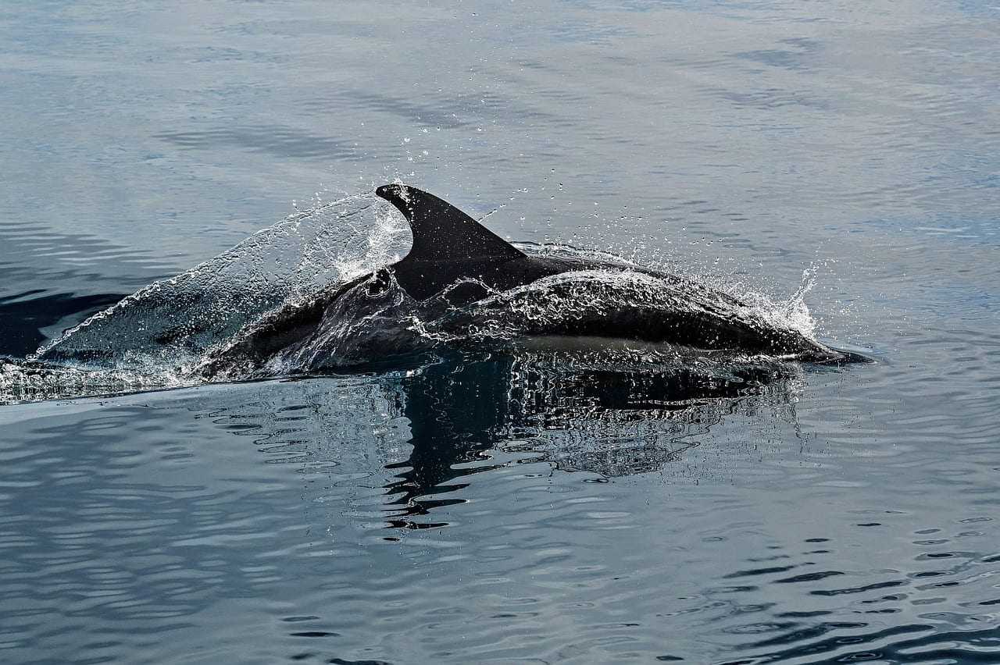

## Нужна ли россиянам виза на Маврикий

Виза не нужна. Посольство Маврикия в Москве формулирует это прямо: владельцам паспортов, выданных Российской Федерацией, виза для въезда на Маврикий не требуется.

Дальше начинается место, где большинство описаний расходится с первоисточником. В выдаче гуляют цифры «60 дней» и «90 дней», но ни посольство, ни Паспортно-иммиграционная служба Маврикия такой цифры для россиян не называют.

Служба описывает механику иначе: окончательное решение о въезде принимает офицер в пункте прибытия, и он же решает, на какой срок человек может остаться в конкретный приезд. Верхняя граница задана отдельно и по цели поездки: для туристической цели это **максимум шесть месяцев в календарном году, по каждому случаю отдельно**.

Практический смысл: на двухнедельный отпуск это не влияет никак, а вот планировать зимовку по чужому пересказу «безвиз 90 дней» рискованно — гарантии этой цифры нет.

Требования к въезду там же перечислены и они обычные: паспорт, действительный дольше предполагаемого срока пребывания, обратный билет, подтверждённая бронь жилья или приглашающая сторона, деньги на поездку. Отдельная строка на сайте службы: **визы и продления срока пребывания выдаются бесплатно**.

<a href={insurance} class="aff-cta" rel="sponsored">Сравнить полисы для поездки на Маврикий</a> — Cherehapa сравнивает предложения российских страховых, оплата картой РФ, полис приходит в PDF. Обязательным условием въезда полис не назван, но медицина на острове платная, а до ближайшей альтернативы — тысячи километров океана.

## Единая въездная форма: обязательна, бесплатна и с уголовной статьёй

Это тот факт, ради которого стоит дочитать визовый раздел до конца, и в популярных описаниях он передан неверно.

Правительственный портал Министерства здравоохранения Маврикия пишет дословно: путешественники **обязаны по маврикийскому закону** заполнить декларацию о здоровье до поездки, **подтверждение заполнения спрашивают при посадке**, а за отказ заполнить форму или за заведомо ложные сведения предусмотрен **штраф до 500 000 маврикийских рупий и лишение свободы на срок до пяти лет**. По курсам Банка Маврикия и Банка России на 20.08.2026 верхняя граница штрафа — около 900 тысяч рублей.

Второй абзац того же портала: форма **полностью бесплатна**, и правительство Маврикия не берёт за неё никакой платы.

Это важно, потому что в поисковой выдаче по запросу об этой форме первыми идут коммерческие сайты-посредники, продающие «оформление» того, что государство отдаёт даром. Признак подделки простой: если с вас просят деньги за доступ к форме или за её подачу — это не государственный портал.

Форма собирается из шести шагов: данные о перелёте, личные данные, где будете жить, экстренный контакт, вопросы о самочувствии и подпись. На выходе получается PDF с QR-кодом. Она заменяет бумажную иммиграционную карточку, которую иначе пришлось бы заполнять по прилёте.

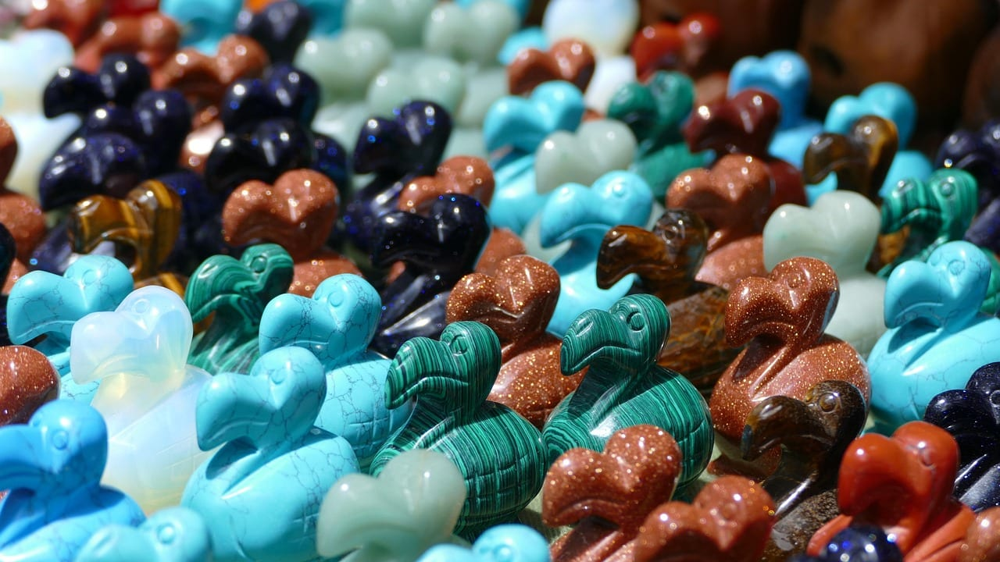

## Турсбор 3 € за ночь: кто платит и кто нет

С **1 октября 2025 года** на Маврикии действует туристический сбор. Налоговое управление Маврикия описывает его так: **3 € с туриста за каждую ночь** в туристическом жилье, начиная с возраста **двенадцати лет**. По курсу Банка России на 20.08.2026 это **296 ₽** за человека за ночь.

Сбор распространяется на отели, гостевые дома, туристические резиденции и поместья. Собирает его само жильё и ежемесячно перечисляет налоговому управлению — отдельно платить ничего не надо, но сумма всплывает при выезде, если она не была включена в цену тура.

Кто не платит по списку налогового управления: туристы младше двенадцати лет, гости, живущие бесплатно, резиденты Маврикия, маврикийцы с национальным паспортом, живущие за границей, владельцы действующей премиальной визы и владельцы вида на жительство.

Считать легко. Пара на десять ночей заплатит 60 €, то есть около **5 900 ₽**. Семья из двух взрослых и двух детей до двенадцати лет заплатит столько же, сколько пара, — детская часть отпадает целиком.

## Киты и дельфины: что разрешает закон, а что обещают продавцы

Выход к дельфинам и китам продают как главное впечатление острова, и половина обещаний в описаниях экскурсий незаконна. Правила заданы постановлением о наблюдении за дельфинами и китами, опубликованным в правительственном вестнике Маврикия 1 сентября 2012 года и действующим с 1 ноября 2012 года.

Что в нём написано.

**Плавать, нырять и снорклить с китом запрещено.** Прямой запрет, без оговорок для туристов. Разрешено только наблюдать с лодки.

**С дельфинами плавать можно, но по часам.** Наблюдение за деньги разрешено с **6:00 до 12:00**, а плавание с дельфинами — только с **6:00 до 9:00**. Экскурсия «после завтрака поплаваем с дельфинами» противоречит постановлению.

**В воде одновременно не больше трёх человек, включая спасателя.** То есть фактически двое туристов за раз, по очереди, а не группа с лодки разом.

**Зона запрета — 50 метров до ближайшего дельфина и 100 метров до ближайшего кита.** Между 50 и 150 метрами (для китов — между 100 и 200) лодка обязана идти без волны от корпуса, подходить сбоку и параллельно, не заходить в стаю, не разворачиваться вокруг животного и не подкрадываться сзади или в лоб.

**Кормить, трогать и подзывать шумом нельзя.** Отдельным пунктом: в радиусе 500 метров от ближайшего дельфина или кита запрещены кайтсёрфинг, гидроциклы, парапланы, дайвинг и виндсёрфинг.

Что до самих животных: официальный туристический портал страны пишет, что кашалотов у Маврикия видят круглый год, а горбатые киты проходят мимо острова **с июля по ноябрь**. Смотрят их с западного побережья, где глубина подходит близко к берегу.

Практический вывод для выбора экскурсии: спрашивайте у продавца время выхода. Лодка, которая обещает плавание с дельфинами в десять утра, либо нарушает правила, либо продаёт наблюдение под видом плавания.

## Сколько стоит поездка на Маврикий

Маврикий — премиальное направление, и основная часть чека уходит на перелёт и отель. Цифры ниже собраны Ассоциацией туроператоров России по данным туроператоров.

Десять ночей на двоих с завтраками и перелётом, замер на 25.05.2026:

| категория | цена на двоих за 10 ночей |
|---|---|
| 4* | 280 000 – 320 000 ₽ |
| 5* | 315 000 – 360 000 ₽ |
| премиум | от 440 000 ₽ |

Для летних дат ориентир мягче: по замеру на 18.06.2026 на летний отдых стоит закладывать **минимум 299 000 ₽ на двоих** с перелётом и четвёркой на завтраках.

Новогодние даты — отдельная история. По замеру на 24.10.2024 туры с заездом в конце декабря начинались от **394 300 ₽ за двоих** за семь ночей без перелёта в пятёрке и доходили до **667 000 ₽ за двоих** с перелётом в тройке с завтраками. Заезды 4–5 января выходили на 10–15% дешевле, чем перед самим праздником.

Самостоятельная поездка считается иначе. По нашей сводке дневных трат на 2026 год ориентир — около **6 300 ₽** в день на человека при экономном варианте, **13 500 ₽** при среднем и **31 500 ₽** при дорогом. Это оценка по чужой выборке, а не наш замер, и годится как порядок величины.

Отдельная строка экономии — зимние скидки. По данным принимающей стороны на 17.06.2026, летом в низкий сезон отели снижают цены на размещение **до 30%**, и это главная причина, по которой российское лето на Маврикии выходит дешевле новогоднего при лучшей погоде.

К любой из этих сумм добавляйте турсбор 3 € за ночь на каждого от двенадцати лет и наличные на месте: карты российских банков на острове не работают.

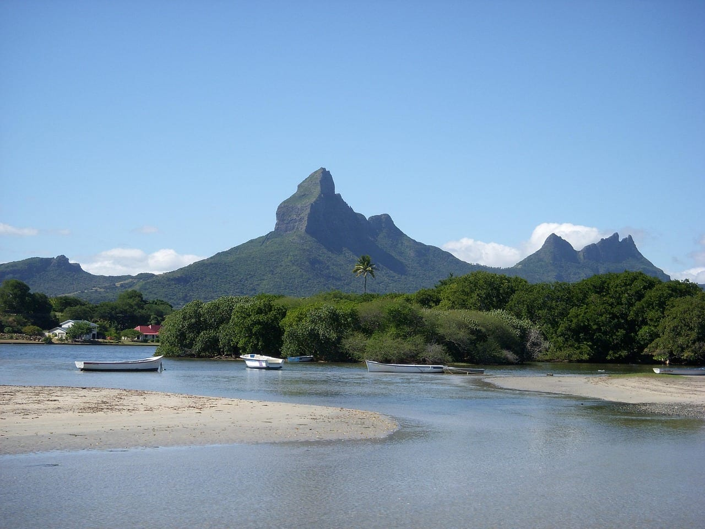

## Шесть сценариев поездки

**Неделя на севере, без машины.** База в районе Гранд-Бэ, пляжи рядом, катамаран на северные островки, вечером рестораны в пешей доступности. Машина не нужна. Минус: внутренняя часть острова остаётся не увиденной, а север — самое людное место Маврикия.

**Десять дней с машиной, база на западе.** Тамарен или Флик-ан-Флак, оттуда радиально: Шамарель, Ле-Морн, ущелье Чёрной реки, чайные плантации. Машина нужна. Минус: левостороннее движение и узкие дороги в горах, первый день уходит на привыкание.

**Две недели «два берега».** Неделя на севере или западе ради воды, неделя на востоке ради отеля и тишины. Машина нужна на первой половине. Минус: переезд с чемоданами и двойная процедура заселения.

**Неделя ради отеля.** Восточный или юго-западный резорт с полным пансионом, выездов минимум. Машина не нужна. Минус: в зимние месяцы на открытом восточном берегу ветер портит купание, и всё держится на том, закрыта ли бухта.

**Десять дней с китами.** Июль — сентябрь, база на западе, утренние выходы в море, между ними горы и водопады. Машина нужна. Минус: выход к дельфинам стартует до рассвета, а море зимой прохладнее — 22–25 °C вместо летних 26–30 °C.

**Двенадцать дней Маврикий плюс Сейшелы.** Перелёт между архипелагами занимает около 2 часов 30 минут, и связка решает главную проблему зимнего Маврикия — прохладную воду. Минус: два въезда, два бюджета и лишний перелёт в середине отпуска.

<a href={`${TP_LINKS.economybookings}&sub_id=mauritius_2026`} class="aff-cta" rel="sponsored">Сравнить цены на аренду авто</a> — движение левостороннее, машин в высокий сезон мало, бронировать стоит заранее.

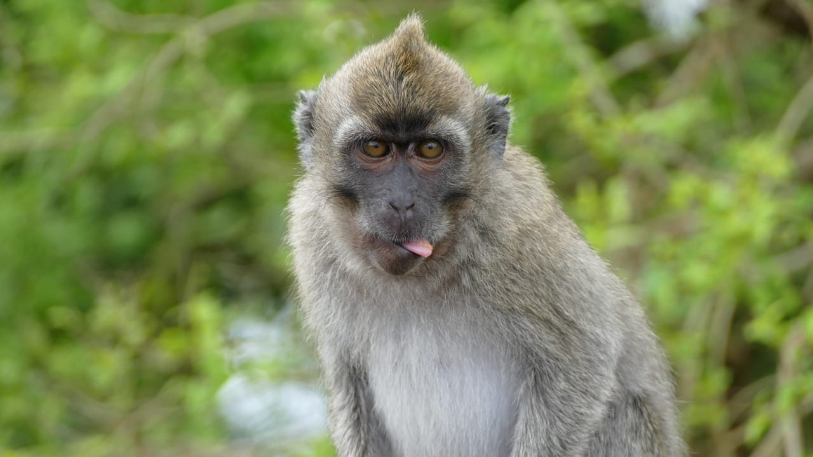

## Сколько дней закладывать и что из чего складывается

| дней | берег | что складывается | что останется за кадром |
|---|---|---|---|
| 5 | один | пляж и два коротких выезда | горы, юг, второй берег |
| 7 | один | берег целиком, Шамарель и Ле-Морн | восток, чайные плантации, Порт-Луи |
| 10 | один плюс радиально | остров с машиной за несколько выездов | морские выходы, соседние острова |
| 12 | два | переезд между берегами либо выходы к китам | Родригес и внешние острова |
| 14 | два | Маврикий без спешки или связка с Сейшелами | Родригес, куда летают отдельным рейсом |

Пять дней на Маврикии — это перелёт со стыковкой почти в сутки туда-обратно ради трёх с половиной полноценных дней. Считайте это нижней границей, ниже которой поездка не окупается по времени.

<a href={esim} class="aff-cta" rel="sponsored">Взять eSIM на Маврикий до вылета</a> — Airalo активируется по QR-коду ещё дома, роуминг не нужен, тарифы от пары долларов за пакет.

## Что на Маврикии разочаровывает

Про минусы в подборках пишут редко, а они предсказуемы.

**Вода зимой прохладная.** В июле и августе воздух ночью опускается до 16 °C, и океан следом. Для человека, летящего за тропиками в разгар российского лета, это неожиданность.

**Ветер там, где его не ждали.** Половина острова полгода стоит под пассатом, и на открытом берегу это не «свежесть», а постоянный шум и волна в лагуне.

**Дорого без ощущения роскоши за эти деньги.** Чек уровня Мальдив, а инфраструктура — обычного тропического острова с городами, пробками и рынками. Кому-то это плюс, кому-то разочарование.

**Подводный водопад — не водопад.** Знаменитый кадр у Ле-Морна — оптическая иллюзия из песка и ила, сползающих по подводному склону. С земли и с воды её не видно вовсе: нужен вертолёт или гидросамолёт, и это отдельные деньги.

**Левостороннее движение и узкие дороги.** Остров маленький, но перегоны по серпантинам и через посёлки идут медленнее, чем показывает карта.

**Карты не работают.** Наличные надо везти и менять, а планировать траты — заранее. Это общая для россиян история, но на дорогом направлении она заметнее.

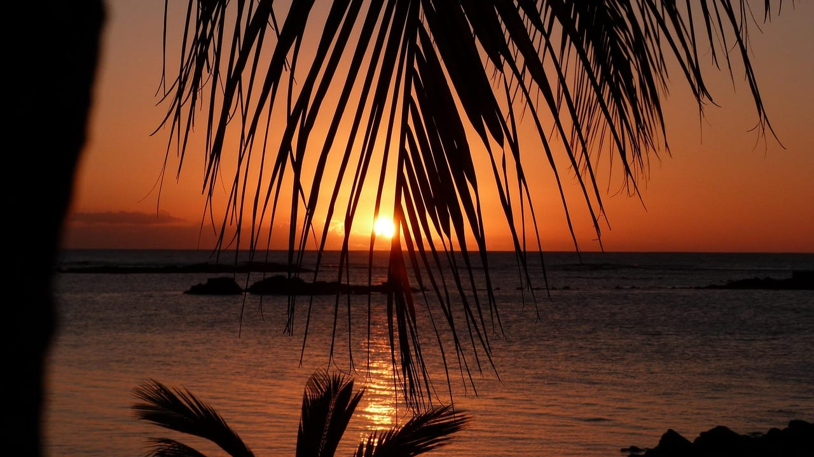

## FAQ

**Нужна ли виза на Маврикий россиянам в 2026 году?**
Не нужна. Посольство Маврикия в Москве пишет, что владельцам российских паспортов виза для въезда не требуется. Срок пребывания определяет офицер на границе; для туристической цели Паспортно-иммиграционная служба называет верхнюю границу в шесть месяцев за календарный год, по каждому случаю отдельно.

**Что за форма, которую надо заполнить до вылета?**
Единая въездная форма на правительственном портале Министерства здравоохранения Маврикия. Она обязательна по маврикийскому закону, бесплатна, а подтверждение её заполнения спрашивают при посадке. За отказ заполнять или за ложные данные предусмотрен штраф до 500 000 маврикийских рупий и лишение свободы до пяти лет.

**Сколько стоит эта форма?**
Нисколько. Государство не берёт за неё платы. Сайты, требующие денег за доступ к форме или за её подачу, к государственному порталу отношения не имеют.

**Есть ли прямые рейсы из Москвы?**
Нет. Летают со стыковками: Emirates через Дубай, Turkish Airlines через Стамбул, с 12 июля 2026 года Ethiopian Airlines через Аддис-Абебу три раза в неделю. С 31 октября 2026 года по 10 марта 2027 года работает блочная программа на рейсах Emirates по средам и субботам.

**Когда на Маврикии лучший месяц?**
Октябрь. По данным метеослужбы Маврикия это самый сухой месяц года, ветер к этому времени слабеет, а жары летнего сезона ещё нет. Второй кандидат — апрель, когда влажность падает, а вода остаётся тёплой.

**Какой месяц самый дождливый?**
Февраль и март. На летние месяцы приходится 67% годовых осадков, а годовая норма по метеослужбе — 2 010 мм.

**Опасен ли сезон циклонов?**
Официальный сезон идёт с 1 ноября по 15 мая, пик риска — январь и февраль. Прямое попадание случается редко, чаще влияние выражается в нескольких дождливых днях и отменённых морских экскурсиях.

**Какой берег выбрать?**
С мая по сентябрь — север и запад: они закрыты от юго-восточного пассата. С октября по апрель ветер слабее, и берег перестаёт быть решающим. Восток стоит брать ради конкретного отеля в закрытой бухте, а не по картинке.

**Можно ли поплавать с китами?**
Нет. Постановление 2012 года прямо запрещает плавать, нырять и снорклить с китом. С дельфинами плавать разрешено с 6 до 9 утра, в воде одновременно не больше трёх человек, включая спасателя.

**Сколько стоит турсбор?**
3 € за ночь с каждого гостя от двенадцати лет, действует с 1 октября 2025 года. Дети младше двенадцати, резиденты Маврикия и владельцы вида на жительство освобождены.

**Сколько стоит десять ночей на двоих?**
По сводке туроператоров на 25.05.2026 — от 280 до 320 тысяч рублей в четвёрке, от 315 до 360 тысяч в пятёрке, от 440 тысяч в премиум-сегменте. Цены с завтраками и перелётом.

**Работают ли российские карты?**
Нет. Наличные меняют на маврикийские рупии, купюры принимают не старше 2009 года выпуска. Часть трат в отелях можно закрыть картой иностранного банка.

**Нужна ли машина?**
На севере и в связке «отель плюс пара экскурсий» — нет. Для острова радиально — да: перегоны короткие, но общественный транспорт медленный. Движение левостороннее.

## Что почитать дальше

- [Сейшелы 2026: когда ехать, какой берег, прямые рейсы](/blog/seychelles-2026/) — соседний архипелаг, с которым Маврикий чаще всего сравнивают
- [Занзибар 2026: прямые рейсы, обязательный полис, сезон](/blog/zanzibar-2026/) — третий остров Индийского океана и чем он дешевле
- [Маврикий: коротко о направлении](/mauritius/) — визы, сезоны и бюджет одной страницей
- [Виза на Маврикий для россиян](/visa/mauritius/) — условия въезда и документы
- [Что взять на Маврикий](/packing/mauritius/) — список под сезон и погоду
- [Как платить за границей в 2026 году](/blog/pay-abroad-2026/) — что делать там, где российские карты не работают
- [eSIM за границей](/blog/esim-zagranicey-2026/) — как остаться на связи без роуминга

---

Данные проверены 20 августа 2026 года по сайту метеослужбы Маврикия, сайту Паспортно-иммиграционной службы Маврикия, сайту посольства Маврикия в Москве, правительственному порталу Министерства здравоохранения, сайту Налогового управления Маврикия, тексту постановления о наблюдении за дельфинами и китами в правительственном вестнике, официальному туристическому порталу страны, публикациям Ассоциации туроператоров России и курсам Банка России и Банка Маврикия на эту дату. Правила въезда, сборы и расписания меняются: перед поездкой сверяйтесь с первоисточниками, ссылки на них приведены в журнале проверок выше. Цены туров и жилья взяты с открытых витрин и носят ориентировочный характер.

Лично на Маврикии я не был — это за пределами моих маршрутов, и выдумывать поездку, которой не было, я не стану. Статья собрана по первоисточникам: метеослужба, иммиграционная служба, налоговое управление, текст постановления. Где был сам — помечаю явно.

Больше заметок о поездках — в канале [@traveltriberu](https://t.me/traveltriberu).
